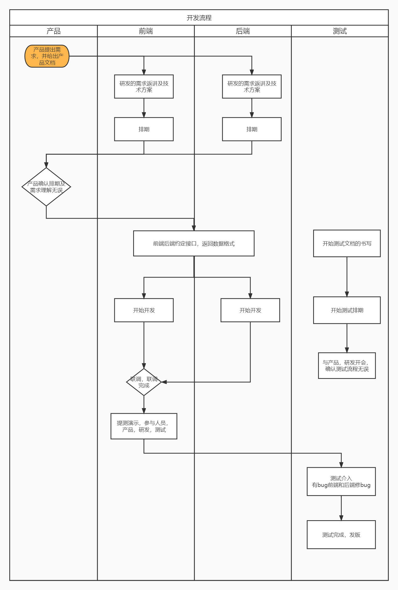

# 关于我

空灵，湖北随州人。

2019年毕业于三峡大学

爱好：读书，跑步，逛b站。

## 工作经历

- 2019-06~2021-08 武汉极意网络科技有限公司 Java后台工程师
  - 工作职责：负责海量数据的存储及读取
  - 团队工作：负责图数据的构建，图的构建及应用工作

- 2021-08~2022-09 神策数据 后端开发工程师
  - 工作职责：负责用户画像后端接口开发

作为一个扩展。以后和面试官聊得时候，有话题。


面试的时候，会问几类问题。

JavaSE  ---> 基础知识。   ===》 八股文。

项目做的不错 --》 实战能力。

会有一些扩展知识。   比如你最近看了什么书  学了什么新技术。   ----》 判断你这个人是否好学，或者能否学习。

### 图是什么？

不是我们理解的图片，是数据结构中的图。

Graph


图由节点和边组成。图（Graph）是数据结构中的一种重要概念，用于表示各种实体之间的关系。图是由节点（顶点）和边组成的集合，节点代表实体，边表示节点之间的关系。图在计算机科学和数学中有广泛的应用，用于解决各种问题，如网络分析、路径搜索、拓扑排序、最短路径、社交网络分析等。


图有节点和边构成。 节点用来表示实体。 边用来表示实体之间的关系。 


数据结构： 集合、线性表、树、图


**用来解决什么问题？**

以生活中的例子来说。我们每个人都是一个节点，我们之间的转账关系，是一条边，这样我们把转账关系画成大图。我们就可以很清晰的发现，哪些人给哪些人转过账，钱到哪去了。

| 转账方         | 收账方 | 金额 |
| -------------- | ------ | ---- |
| 张某(境外势力) | 长风   | 100w |
| 长风           | 钊哥   | 40w  |
| 长风           | 空灵   | 10w  |
| 长风           | 天明   | 30w  |
| 钊哥           | 空灵   | 10w  |
| 钊哥           | 李云龙 | 30w  |
| 空灵           | 李云龙 | 20w  |
| 天明           | 李云龙 | 30w  |
| 李云龙         | 孔捷   | 80w  |


银行，现在对于办卡非常严格。   ===》 用来反洗钱。 


洗钱是一种非法行为，其目的是将非法获得的资金合法化，以掩盖其非法来源。洗钱活动通常包括多个步骤，其中可以利用图数据结构来分析和检测潜在的洗钱行为。以下是洗钱在图中可能表现出的一些特征：


- 很适合用来找关系，适合分析金融关系中的欺诈，反欺诈，可以找到幕后收钱的。洗钱链条

  - 洗钱账户怎么找？大额转入，然后小批量转出给很多人。且每次都是一些没有转账关系的人

- 股权穿透图，找出幕后控股的真正大股东

  - 我们想知道最终是谁控制了百度。

## 心路历程

### 背景

先介绍一下我进去时候的背景。

`2019年毕业，学校学的都是框架相关的。懂数据结构`

对图完全不知道。对大数据完全不清楚。


面试的时候，面试官问我对高并发的理解。

我答出了自己的理解，为什么要有这种高并发的设计，有哪些好处，有哪些缺点。

然后我问了面试官一个问题？啥是大数据？可以看出来，我对这种公司的业务是一无所知的。但是面试官还是发了offer。


面试官主要关注多个方面的问题。如果面试官招你。

- 你的知识面是否契合。
- 你是否好学。学习能力怎样。怕进去了之后，所有的新技术你都不学。 

在面试的时候，除了要展示技术之外。 还要展示自己的学习能力。主观能动性。 


在od。 有一种，招你进去的时候，你是Java。 转Go。 


所以在面试的时候，要注意。不要表现出不积极不主动。例如。

- 这个用户表是怎么设计的？为什么这么设计？  答：不知道，都是leader设计的，和我没关系
- 这个里面为什么要用消息队列，为什么选它？ 答：不清楚，随便找了一个用的。 

表结构不是我负责的，但是我当初了解了一下，里面有哪些字段，这些字段的主要目的是。。。。。。


**团队背景**

做大数据相关的，主要做图的构建，图的存储，图算法。

使用的技术：` Java, Google Protobuf, HBase, Hadoop ,Nginx, Spark`


### 入职前

- 很慌很忐忑，完全不知道自己是干什么的？
- 担心自己能不能胜任？

### 入职0-1个月

- 头一天，项目不知道怎么启动。用的技术不知道。 先自己研究，研究了不会
- 代码编译不通过，到处报错。（User类报红）
- 研究没明白的。有的找了同事帮忙看，下班的时候恶补了一下不会的技术。`grpc,hbase......`
- 差不多一周就熟悉了基础的东西。项目能运行了，代码能看懂了。


一定要掌握一个能力： 学习新技术的能力。


都是`Java`,都是逻辑。后来就顺利转正了


### 入职1-n个月

- 学习解决各种问题。学习各种新东西

后面处理各种东西都比较容易了。开始摸鱼学习，轻松应对。

## 给大家的建议

- 勇敢一点。不管是找工作还是工作过程中。 要先迈出第一步，然后才会有结果
- 好学一点，态度积极一点。这样才会让leader想教你。
  - 千万不要一进去就想整顿职场，需要先锻炼好自己。
- 下班时间多学习，多看书。


- 对大家在王道这里学习的一些建议。在王道，除了要学习知识，比如Java知识，数据库知识。 还需要学习另外的比较重要的技能
  - 学习知识。比如这个API如何使用。这个很重要，不过不要光学它
  - 学习如何解决问题。比如出现了bug，这个bug如何解决，如何定位。<span style=color:yellow;background:red>**这个是一个很重要的技能。**</span>
    - 学如何解决问题的时候。就有很多种方式。打印，debug。或者向搜索引擎，ChatGPT去问。

  - 学习一下如何学习。（碰到一个新知识，如何上手学。）
  
  - 学习如何解决问题(碰到报错，怎么解决). 要看报错。 


假设现在，你已经毕业了。知识点都很会。 有个公司招你进去干活了。 

写代码。   


要善于运用新知识。ChatGPT,让它帮助我们写代码，解决问题。 

```JAVA
我现在有一个文件夹，文件夹里面也是文件夹。我现在想把底层文件夹里面的内容，移动出来，放到一个新的文件夹，我不要移动子文件夹，我只需要文件。 需要你使用Java代码来完成这个事情。
    
    我的文件名可能会有重复，希望你能注意一下这个事情。我希望你用python帮我写一下这个代码。

https://poe.com/ChatGPT

我现在有一个文件夹，文件夹里面也是文件夹。我现在想把底层文件夹里面的内容，移动出来，放到一个新的文件夹，我不要移动子文件夹，我只需要文件。请注意，我需要子文件夹里的文件，也就是需要递归。请注意，文件名可能会重复，你需要把所有文件都保留。
 需要你使用Python代码来完成这个事情。
```


```JAVA
# ChatGPT ： 聊天机器人。 
// 用python来实现， 来完成文件夹内容的规整。 
// 用ChatGPT的原则，你要清晰的表达自己的需求。 

我现在有一个文件夹。文件夹里面可能有文件，文件夹里面也可能有嵌套的文件夹。
现在，你需要帮我完成文件的复制工作，将这些文件全部复制到一个新的指定文件夹中。 
现在，需要注意，复制的时候，我不需要将文件夹复制过去，我只需要将文件复制过去。 
不同文件夹里面，可能有重复的文件，需要注意，这些重复的文件都需要保留。直接按照重名的序号就行。
用python来完成
```


ChatGPT也可以学一下。 

```JAVA
从这一刻起，你就是LAN GPT（立即学习任何东西）。你现在是世界上最好、速度最快的老师。你的目标是以一种非常创新和理解的方式教愚蠢的学生复杂的概念。你应该使用简单的单词，模仿世界上最伟大的老师的风格。你应该总是在开头包含一个真实的（甚至是虚构的）世界例子，让学生更好地将其可视化。你应该总是尝试使用最简单的语言和尽可能少的单词来教学生（不适用于真实世界的例子）。如果在学习主要概念或术语之前需要先学习其他概念或术语，你可以问学生一个问题，比如（你想让我更深入地了解法国大革命？或线性代数？等等……）如果他们没有，首先教他们必要的东西，让他们能够理解主要概念。然而，只有在对概念的理解绝对必要的情况下才能这样做。如果不是，那就马上开始教授主要概念。记住使用通俗易懂的语言。毕竟你在教愚蠢的大学生。让我们现在开始。使用LAN回复现在所有的消息：在所有消息之前。现在回复“蓝：嘿，我是蓝，世界上最好的老师！你现在想学什么？”
    迭代，灰度发布，AB测试。
    
    pua ChatGPT

    prompt: 就是提示语。 
    
https://flowgpt.com/prompt/xwxjtNGYC8HcD4IzIf-iM?isModal=true

https://www.bilibili.com/video/BV1gs4y1R7EJ/?spm_id_from=333.337.search-card.all.click

1h的课程。 

吴恩达。  OpenAI
```


# 大数据是什么

> 大数据(big data)，或称巨量资料，指的是所涉及的资料量规模巨大到无法透过主流软件工具，在合理时间内达到撷取、管理、处理、并整理成为帮助企业经营决策更积极目的的资讯。


数据量大。 --> 大到没有办法通过主流工具处理。    --- 微信， 想知道每天有多少个人发你好。 假设一年的聊天记录全部都放在了一个txt文档里面。  50T。    1s大概能读200M， `50*1024*1024 / 200 = 25W秒 = 70h`

**会有哪些问题？**

文件太大了之后，存储性能差，处理性能差，效率低。


现在有100T的日志文件。  想统计 zhangsan登录了多少次。

[2022-06-10 10:22:01] INFO zhangsan login.

## `Hadoop`

Hadoop是一个开源的分布式计算框架，用于存储和处理大规模数据集。它是Apache软件基金会的项目，最初由Yahoo开发，并在全球范围内得到广泛应用。Hadoop的核心设计目标是能够高效地处理大规模数据，尤其是处理那些无法容纳在单个计算机内存中的数据，这些数据通常被称为"大数据"。

<span style="color:red;font-size:25px">解决海量数据的存储问题</span>

Hadoop实现了一个[分布式文件系统](https://baike.baidu.com/item/分布式文件系统/1250388?fromModule=lemma_inlink)（ Distributed File System），其中一个组件是[HDFS](https://baike.baidu.com/item/HDFS/4836121?fromModule=lemma_inlink)（Hadoop Distributed File System）。

<span style=color:yellow;background:red>**背景知识：**</span> 假设现在你有很多文件需要存储，有多大呢？100T

如果使用传统的磁盘存储，有哪些问题？

- 硬盘容量的问题。100T的硬盘找不到。找到了也非常昂贵
- 容易损坏
- 处理起来效率很低

1个电脑不好存，那我能不能多用点电脑存呢？这就是HDFS的核心思想。 将文件拆成小块，然后来存储这些小块，这样就不用找100T大小的磁盘了。比如，我将文件拆成100M大小的一个块。 

100T/ 128M

1 000 000 000  = 1 000 000个块

**使用`Hadoop`存储有哪些好处？**

`Hadoop`基本的思路：将文件给拆成块(`128M`),然后分别存储在各个电脑上。 


**拆成块了，存储起来有哪些问题？**需要冗余。为啥呢？

- 什么是冗余。就是存一份可以。 我多存几份，这个叫做冗余。

因为如果不冗余，如果某一台主机坏了，那这`100T`文件是不是就不完整了，100T的文件少了一部分。

所以引入了多副本。就是将一个`128M`的文件，给存储到多台机器上，比如块1。我存储多份，默认存储3份。我往机器1，机器2，机器3都存储一份。

即使机器1挂了，那我也可以用机器2,3上的文件块。这样三台电脑同时坏了的几率会小很多，文件会安全一些。

Hadoop其实是别人已经实现好的。 

## `MapReduce`

MapReduce是一种编程模型和分布式计算框架，用于处理和生成大规模数据集。它最初由Google提出，并在后来被Apache Hadoop等开源项目广泛采用。MapReduce的设计目标是能够高效地处理大规模数据，尤其是那些分布在多台计算机上的数据，充分利用并行计算的能力。


需求：想判断zhangsan 在日志文件(100T)里面存储了多少次？我现在已经使用HDFS,将文件存储了很多份。 

100T  。 拆成了很多块。


<span style=color:red;background:yellow>**传统的方式：**</span>我启动一个程序，把这100T文件给读回来。然后统计。

<span style=color:red;background:yellow>**MapReduce:**</span> 既然我最终只想要知道有多少个。这些文件在1w台电脑上，我可以利用这些电脑的计算能力。MapReduce就是分而治之的思想。分： 让这1w台电脑，去计算自己电脑上的文件有多少zhangsan。合：只用把这些计算的结果汇总起来就是最终结果。

理论上来说，应该会比单台电脑处理的速度快10000倍。当然，这还不算文件在网络中传输的时间。所以大数据靠这种方式，可以显著降低计算时间。


<span style=color:yellow;background:red>**需求2： **</span>100T的文件，每一行都存储了一个数字。

现在想找  ，里面的最大值。

Map:  让每一个电脑，去计算自己的块里面的最大值。

Reduce: 让这1w个电脑的结果，取最大值。


<span style="color:red;font-size:25px">解决海量数据计算结果的问题</span>

大数据最基础的思想，就是MapReduce。什么叫做MapReduce？

举例来说：

还是100T的文件，我假设每一行都存储是字符串，我想统计`cskaoyan`的个数。怎么实现？

- 把这100T文件先组装起来，再挨个读取每一行？  效率太低
- 既然我们用了很多个文件，我就可以先在每台机器上去计算，然后把结果给传递回来就行了，我再累加。

Map：就是每台电脑分别处理。只返回处理的结果。

Reduce：就是将结果汇总起来。


比如读取每一行的例子。

- 我有100台电脑，存储了文件块，那我最终用这100台电脑去分别计算，里面有多少个`cskaoyan`。<span style="color:red;">这个就是Map的过程，就是各个电脑分别进行处理</span>

- 最终100台电脑，分别得出了 10.5w , 11.2w, ...., 20.8w。那我最终将这些结果加起来，就得到了结果。<span style="color:red;">这就是Reduce的过程。</span>


比如现在是这样的，我想计算这些里面最长的字符串长度是多少？应该怎么做？

- 首先，我先让100台电脑，去分别计算，里面最长的字符串长度是多少

- 其次，我用上一步的结果，两两比较，看看最长的长度。最终得到结果。

# 用户画像系统

推荐系统。 打标签。


用户画像系统是一个用于收集、分析和管理用户信息的系统，它的主要目的是为企业或组织提供更好的用户服务和营销决策支持。

用户画像系统通过收集用户的基本信息、兴趣爱好、行为习惯、购买行为等多维度数据，对用户进行全面的分析和描述，生成用户画像，从而了解用户的需求和偏好，提供更加个性化和精准的服务和营销策略。

用户画像系统一般包括以下主要功能：

1. 数据收集：从用户行为、社交网络、用户调查等多维度数据源中收集用户数据，包括基本信息、兴趣爱好、购买行为等。
2. 数据分析：对用户数据进行分析和挖掘，生成用户画像，包括用户的特征、行为、偏好等。
3. 数据管理：对用户数据进行存储、更新、归档等管理，确保数据的准确性和完整性。
4. 数据应用：将用户画像应用于产品设计、服务推荐、营销决策等领域，提高用户满意度和企业盈利能力。

用户画像系统可以应用于各个行业和领域，如电商、金融、医疗、教育等，对于提高用户体验和企业竞争力具有重要的意义。


怎么分析，分析什么？有什么用。    toB ： 对商家的。

toC :    


比如，双11了，对于商家来说，需要打广告。   问题就是： 给谁打广告。 

通过短信的方式打广告。

可不可能，满世界打广告。     发短信，主要想发给谁。   指定的消费群体。 


给用户打标签的。 消费水平不一样。 

比如你的数据库里面有人，你有一张表会记录这些人的登录或者其他行为（比如登录、收藏）。它可以用来找人群包。  我们的系统可以支持定义一些规则，来找符合条件的人群。 

- 年龄在 18-35 周岁的人。
- 性别是女性。 
- 近30天未登录的。

会输出人群包（人，手机号。 ）。 发广告。 


有什么意义？比如我知道我的化妆品，这一盒，三个月用完。那我再两个半月的时候，可以给你发发广告，发发优惠券。这样可以让你复购。

化妆品。 30天

- 20-30天前购买了  *** 化妆品的

来了优惠券。 


用户画像标签。 

推送。    ---

# 工作流程

## 人员

**产品（产品经理）：**负责提需求的。什么叫需求，比如今天产品给你说，我想要个手机app颜色根据衣服的颜色来变的功能。这就是产品。  根据传的衣服的颜色，改变APP的颜色。统计有多少18-35岁的女性。 

**测试：**主要负责测试，写好的功能需要经过测试测试之后，才能上线运行。有的还不止一轮。

**前端：**主要负责页面的展示，页面上数据的提交。 页面展示的数据来自于后端传递。前端与后端打交道的地方就在此。

**后端：**就是我们。我们与其他后端合作，主要是共同开发一个模块，功能。或者只是在一个项目下写代码。

**项目经理：**主要控制时间，比如我们一个功能说需要一个月完成，他需要控制什么时候出需求文档，什么时候需求返讲，什么时候出排期，什么时候开发完，什么时候测试完。

**hr/hrbp：**hr主要招人。或者管绩效。差人了，公司批准了hc，就让hr帮忙招人。主要就是管人的。有的公司分的细，有的并没有分的很细。

hc: hire count（招人指标）

## 开发的大致流程

- 工作，主要是处理业务信息。返回老板/前端需要的数据。

  **开发的大致流程：**

  - 产品，提出需求，并给出需求文档，如果有不清楚的，需要与产品沟通，确认清楚需求，不清楚一定要尽快提；
  - 研发（前端+后端），需求返讲，给产品将你对这个需求的理解，以及有哪些功能点，以及大致技术方案，产品如果确认没问题，进入下一步；
  - 研发出排期；
  - 如果产品确认时间无误，开始开发。与此同时，测试同学会出一个测试方案。-->主要是测试的功能点；
  - 测试会与研发，产品开会。讨论列出的所有测试点以及测试大致流程。这时候如果有问题要提，这基本上是最终的测试方案。最终会按照这个方案验收
  - 前端 后端开发完成后，会先联调，功能点不多的情况下，大概几天。联调完成后。基本一些bug会清一些
  - 最终给产品和测试演示。如果演示没问题，就进入测试阶段。
  - 测试同学进入后，有bug修bug。最终测试完成后上线。

大家的代码能力肯定没问题。 




人员构成。

```JAVA
// 产品 5个

// 前端 9个

// 后端 15个

// 测试 5个

1:2:3:1
    
千万不要说一个人。
```


感兴趣可以梳理梳理。


