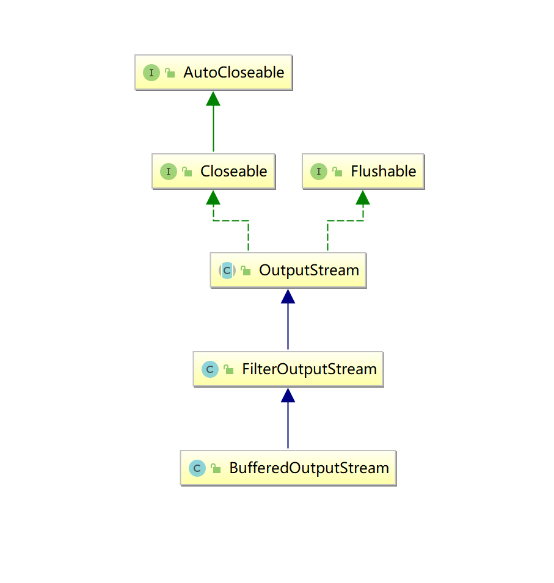

学习目标:

- 掌握IO体系及分类
- 熟练掌握字节流
- 熟悉字符流
- 熟悉其他流


<span style=color:yellow;background:red>**章节在工作、面试过程中作用：**</span>在工作过程中，可能会涉及到一些希望从文件中读取文件内容，将程序中的内容写入一个文件。这时候会使用本节内容。 面试时，可能会有一些小问题，不多。

但是在工作过程中，会涉及大量的此章节操作。

实践章节

# IO概述

## 什么是IO?

在Java中，IO（Input/Output）流是用于处理输入和输出操作的机制。Java提供了强大而灵活的IO系统，用于在程序和外部数据源（文件、网络、内存等）之间进行数据传输。IO流主要分为两大类：字节流（Byte Streams）和字符流（Character Streams）。

input : 输入   读

output: 输出  写

## 为什么有IO?

 在操作系统中，一切需要永久保存的数据都以文件的形式 存储。需要长久保存的文件数据，存储在外部设备。
但是需要读入内存才能显示这些数据
同时，内存的大小有限，因此常常需要在内存和外设之间交换数据，即I/O。

内存是有限的，有很多数据是在外部。 所以，要么会希望将程序的数据写出去（存着）。从外部读取数据进内存。 

## Java中如何实现IO功能

Java流模型


## IO的分类

**按流类型分**

字节流（Byte Streams）和字符流（Character Streams）是Java中用于处理IO的两种基本类型。它们的主要区别在于处理的数据单元的不同。

1. **字节流（Byte Streams）：**
   - 字节流以字节（8位）为单位进行操作，适用于处理二进制数据（如图像、音频、视频等）或文本数据。
   - `InputStream`和`OutputStream`是字节流的抽象基类（父类）。
   - 字节流通常用于处理二进制数据，因为它们不对数据进行解释，而是直接处理字节。`FileInputStream`和`FileOutputStream`是常用的字节流类，用于读写文件。
2. **字符流（Character Streams）：**
   - 字符流以字符为单位进行操作，适用于处理文本数据。
   - `Reader`和`Writer`是字符流的抽象基类。
   - 字符流使用字符编码（例如UTF-8）来处理字符，因此更适合处理文本数据，而不会引起乱码问题。`FileReader`和`FileWriter`是用于读写字符文件的常用字符流类。

**按流向分(以内存为参照物)**

- 输出流: 内存---> 磁盘
- 输入流: 磁盘---> 内存

## 4个抽象基类

字节输出流: OutputStream

字节输入流: InputStream

字符输出流: Writer

字符输入流: Reader

由这4个抽象基类派生的子类都是以其父类名作为后缀的

如：InputStream的子类FileInputStream。
如：Reader的子类FileReader

后续，我们从类的后缀名，就可以直接看出来，它是谁的子类。 

## 什么时候用什么流?

一般来讲, 纯文本文件用字符流  .txt .java .cpp

其他情况用字节流(字节流是万能的)  .word  .ppt  .mp4  .mp3 .jpg . png  .exe

.word  .docx  其实就是个压缩包。 这个压缩包里面其实就是微软/wps自己认识的格式。 它把样式和文本内容都要保存。 


文本情况下，使用字符流； 其他情况用字节流。如果你不知道是啥情况，使用字节流。 

# 字节流

## 字节输出流

### 抽象基类OutputStream

此抽象类是表示输出字节流的所有类的超类 （基类）

**继承关系**


**成员方法**

| void           | close()        关闭此输出流并释放与此流有关的所有系统资源。  |
| -------------- | ------------------------------------------------------------ |
| void           | flush()        刷新此输出流并强制写出所有缓冲的输出字节。    |
| void           | write(byte[] b)        将 b.length 个字节从指定的 byte 数组写入此输出流。 |
| void           | write(byte[] b,  int off, int len)       将指定 byte 数组中从偏移量 off 开始的  len 个字节写入此输出流。 |
| abstract  void | write(int b)        将指定的字节写入此输出流。write 的常规协定是：向输出流写入一个字节。要写入的字节是参数 b 的八个低位。b 的 24 个高位将被忽略。 |

### 具体子类

#### FileOutputStream文件字节输出流

用于将数据写入 File 。主要用于向文件中写入原始的字节数据。

**继承关系**


**构造方法**

| FileOutputStream(File file)        创建一个向指定 File 对象表示的文件中写入数据的文件输出流。 |
| ------------------------------------------------------------ |
| FileOutputStream(File file,  boolean append)       创建一个向指定 File  对象表示的文件中写入数据的文件输出流。 |
| FileOutputStream(String fileName)        创建一个向具有指定名称的文件中写入数据的输出文件流。 |
| FileOutputStream(String name,  boolean append)       创建一个向具有指定 name 的文件中写入数据的输出文件流 append - 如果为 true，则将字节写入文件末尾处，而不是写入文件开始处 |

**成员方法**

| void           | write(byte[] b)        将 b.length 个字节从指定的 byte 数组写入此输出流。 |
| -------------- | ------------------------------------------------------------ |
| void           | write(byte[] b,  int off, int len)       将指定 byte 数组中从偏移量 off 开始的  len 个字节写入此输出流。 |
| abstract  void | write(int b)        将指定的字节写入此输出流。write 的常规协定是：向输出流写入一个字节。要写入的字节是参数 b 的八个低位。b 的 24 个高位将被忽略。 |

Demo

```java 
import org.junit.Test;

import java.io.FileOutputStream;
import java.io.IOException;
import java.io.OutputStream;
import java.nio.charset.Charset;
import java.nio.charset.StandardCharsets;

/**
 * @author Common-zhou
 * @since 2023-11-29 21:35
 */
public class Demo2FileOutputStream {
    @Test
    public void testFileOutputStreamConstructor() throws IOException {
        // 四种构造方法：
        // public FileOutputStream(String name) :   name: 文件名
        // public FileOutputStream(String name, boolean append): name: 文件名, append: 是否追加
        // public FileOutputStream(File file):  file: 文件对象
        // public FileOutputStream(File file, boolean append): file: 文件对象, append: 是否追加

        OutputStream outputStream = new FileOutputStream("1.txt");

        outputStream.write("abc".getBytes(Charset.defaultCharset()));
        outputStream.close();
    }

    /**
     * 使用FileOutputStream写数据的流程
     * 1.创建FileOutputStream对象
     * 2.调用write方法写数据
     * 3.关闭流
     *
     * @throws IOException
     */
    @Test
    public void testFileOutputStreamWrite() throws IOException {
        // 1.创建FileOutputStream对象
        OutputStream outputStream = new FileOutputStream("1.txt");

        // 2.调用write方法写数据
        outputStream.write(97);

        // 3.关闭流
        outputStream.close();
    }

    @Test
    public void testWriteMethod() throws IOException {
        // 写数据的几种方式：
        // 1. write(int b)  写一个字节
        // 2. write(byte[] b)  写一个字节数组
        // 3. write(byte[] b, int off, int len)  写一个字节数组的一部分

        // 1.创建FileOutputStream对象
        OutputStream outputStream = new FileOutputStream("2.txt");

        // 1) 使用write(int b)方法写数据:
        // 97代表 'a'
        outputStream.write(97);

        byte[] bytes = "hello world".getBytes(StandardCharsets.UTF_8);
        // 2) 使用write(byte[] b)方法写数据
        // outputStream.write(bytes);

        // 3) 使用write(byte[] b, int off, int len)方法写数据
        outputStream.write(bytes, 0, 5);

        outputStream.close();
    }
}

```


#### 注意事项

- 当我们创建一个输出流对象的时候,发生了什么?

  - JVM向操作系统中看这个文件是否存在
  - 如果文件不存在, 帮我们创建
  - 文件已经存在, 覆盖重新开始写

- 如何实现文件追加功能?

  - 借助于带append参数的构造方法

  - ```Java
    public class Demo3Append {
        /**
         * 实现文件的追加功能。
         * 就是写入的时候，不把之前的数据删除（覆盖）掉
         * @throws IOException
         */
        @Test
        public void testAppend() throws IOException {
            OutputStream outputStream = new FileOutputStream("4.txt", true);
    
            outputStream.write(98);
    
            outputStream.close();
        }
    }
    ```
  
- 如何实现换行功能

  - ```java
    public class Demo4NewLine {
        @Test
        public void test1() throws IOException {
            OutputStream outputStream = new FileOutputStream("5.txt");
    
            outputStream.write(97);
    
            // 方式1： \r\n
            outputStream.write("\r\n".getBytes(StandardCharsets.UTF_8));
            outputStream.write(97);
    
            // 方式2： \r
            outputStream.write("\r".getBytes(StandardCharsets.UTF_8));
            outputStream.write(98);
    
            // 方式3： \n.用UTF-8的编码方式，将这个字符串转换为字节数组。 
            outputStream.write("\n".getBytes(StandardCharsets.UTF_8));
            outputStream.write(99);
    
            // 方式4：
            outputStream.write(System.lineSeparator().getBytes(StandardCharsets.UTF_8));
            outputStream.write(100);
            
            outputStream.close();
        }
    }
    ```
  
- 如何异常处理

  - try-catch-finally

    - ```java
      public class Demo4Exception {
          @Test
          public void test1() {
              OutputStream outputStream = null;
      
              try {
                  outputStream = new FileOutputStream("5.txt");
                  outputStream.write("aaa".getBytes(StandardCharsets.UTF_8));
              } catch (IOException e) {
                  throw new RuntimeException(e);
              } finally {
                  try {
                      if (outputStream != null) {
                          outputStream.close();
                      }
                  } catch (IOException e) {
                      throw new RuntimeException(e);
                  }
              }
          }
      }
      ```
      
      
    
  - try-with-resources
  
    - ```java
      语法
      try(资源,只要实现了AutoCloseable接口的类){
       //可能出现异常的代码
       // 当出了try代码块的时候 close方法会自动执行 资源会被自动释放
      }catch(Exception e){
      	
      }
      
      // 只要按照这个语法写。 close方法，需不需要你调用？  ===》 JDK帮你调用。 
      ```
      
    - ```java
      /**
       * try-with-resources
       * @author Common-zhou
       * @since 2023-10-17 10:25
       */
      public class Demo5TryWithResources {
          @Test
          public void test1() {
              try (OutputStream outputStream = new FileOutputStream("6.txt")) {
                  outputStream.write("aaa".getBytes(StandardCharsets.UTF_8));
              } catch (FileNotFoundException e) {
                  e.printStackTrace();
              } catch (IOException e) {
                  throw new RuntimeException(e);
              }
          }
      }
      ```
      
    - 验证自动执行
    
    - ```java
      /**
       * 验证close方法自动执行
       * @author Common-zhou
       * @since 2023-10-17 10:30
       */
      public class Demo6AutoCloseable {
          @Test
          public void test1() {
              try (AExtendsAutoClosable a = new AExtendsAutoClosable()){
                  // 只调用func方法。 会发现。两个方法都被调用了
                  // =====================程序实际输出
                  // func method call.
                  // close method call.
                  a.func();
              } catch (Exception e) {
                  throw new RuntimeException(e);
              }
          }
      }
      
      
      /**
       * @author Common-zhou
       * @since 2023-10-17 10:29
       */
      public class AExtendsAutoClosable implements AutoCloseable {
      
          public void func() {
              System.out.println("func method call.");
          }
      
          @Override
          public void close() throws Exception {
              System.out.println("close method call.");
          }
      }
      
      ```
  
- 为什么要close?

  - JVM使用了不属于JVM的资源, 不能通过GC回收, 只能通过close显式的释放资源.


#### BufferedOutputStream缓冲字节输出流

该类实现缓冲的输出流。通过设置这种输出流，应用程序就可以将各个字节写入底层输出流中，而不必针对每次字节写入调用底层系统。 

**继承关系**



**构造方法**

| BufferedOutputStream(OutputStream out)        创建一个新的缓冲输出流，以将数据写入指定的底层输出流。默认缓冲区大小是8KB |
| ------------------------------------------------------------ |
| BufferedOutputStream(OutputStream out,  int size)       创建一个新的缓冲输出流，以将具有指定缓冲区大小的数据写入指定的底层输出流。 指定缓冲区size大小 |

**成员方法**

3个write方法

write(int b)

write(byte[] b)

write(byte[] b, int off, int len)

Demo

```java 
package _17io02.com.cskaoyan.bytestream._03buffer;

import java.io.BufferedOutputStream;
import java.io.File;
import java.io.FileOutputStream;
import java.io.IOException;

/**
 * @description:
 * @author: 景天
 * @date: 2022/10/17 11:02
 **/
/*
使用缓冲输出流
 */
public class Demo {
    public static void main(String[] args) throws IOException {
        // 创建输出流对象
        //FileOutputStream fileOutputStream = new FileOutputStream("a.txt");
        //BufferedOutputStream out = new BufferedOutputStream(fileOutputStream);

        BufferedOutputStream out =
                new BufferedOutputStream(new FileOutputStream("a.txt"));

        // write
        // 写单个字节
        out.write(97);
        out.write(98);

        out.write("yyds".getBytes());
        
        // flush
        out.flush();

        // close
        out.close();
    }
}

```


注意：

- 使用所有带缓冲区的输出流, 记得flush操作

- 执行close方法会自动执行flush

  - 

- 缓冲区满了会自动刷新

  - ```java
    public class Demo2 {
        public static void main(String[] args) throws IOException {
            // 使用指定缓冲区
            BufferedOutputStream out =
                    new BufferedOutputStream(new FileOutputStream("a.txt"), 4);
            // write
            out.write("abcdef".getBytes());
    
            // flush
    
            // close
        }
    }
    ```


## 字节输入流

### 抽象基类InputStream

此抽象类是表示字节输入流的所有类的超类。

**继承关系**


**成员方法**

| abstract  int | read()        从输入流中读取数据的下一个字节。返回 0 到 255 范围内的 int 字节值。如果因为已经到达流末尾而没有可用的字节，则返回值 -1。在输入数据可用、检测到流末尾或者抛出异常前，此方法一直阻塞。返回值代表了读取到的字节值  readData |
| ------------- | ------------------------------------------------------------ |
| int           | read(byte[] b)        从输入流中读取一定数量的字节，并将其存储在缓冲区数组 b 中。读入缓冲区的总字节数；如果因为已经到达流末尾而不再有数据可用，则返回 -1。返回值表示读取的字节的个数 readCount |
| int           | read(byte[] b,  int off, int len)       将输入流中最多 len 个数据字节读入 byte 数组。 |


### 具体子类

#### FileInputStream文件字节输入流

`FileInputStream` 从文件系统中的某个文件中获得输入字节

**继承关系**


**构造方法**

| FileInputStream(File file)        通过打开一个到实际文件的连接来创建一个 FileInputStream，该文件通过文件系统中的  File 对象 file 指定。 |
| ------------------------------------------------------------ |
| FileInputStream(String fileName)        通过打开一个到实际文件的连接来创建一个 FileInputStream，该文件通过文件系统中的路径名  name 指定。 |

**成员方法**

| abstract  int | read()        从输入流中读取数据的下一个字节。返回 0 到 255 范围内的 int 字节值。如果因为已经到达流末尾而没有可用的字节，则返回值 -1。在输入数据可用、检测到流末尾或者抛出异常前，此方法一直阻塞。返回值代表了读取到的字节值  readData |
| ------------- | ------------------------------------------------------------ |
| int           | read(byte[] b)        从输入流中读取一定数量的字节，并将其存储在缓冲区数组 b 中。读入缓冲区的总字节数；如果因为已经到达流末尾而不再有数据可用，则返回 -1。返回值表示读取的字节的个数 readCount |
| int           | read(byte[] b,  int off, int len)       将输入流中最多 len 个数据字节读入 byte 数组。 |

Demo 

```java 
/**
 * @author Common-zhou
 * @since 2023-10-17 11:38
 */
public class Demo1FileInputStream {
    @Test
    public void testConstructor() throws IOException {
        // 构造方法有两种。 一种文件名，一种文件File对象
        InputStream inputStream = new FileInputStream("2.txt");

        byte[] bytes = new byte[2048];

        int len = inputStream.read(bytes);
        // len代表读取回来的长度。 数据都存储在bytes中。   使用 new String 将其转化为字符串，才能看到。
        System.out.println(new String(bytes, 0, len));

        inputStream.close();

        // read() 读取单字节
        // 一个字节一个字节的读

        // read(byte[])

        // read(byte[],int off,int len)
    }

    @Test
    public void testRead1() throws IOException {
        // read() 读取单字节

        InputStream inputStream = new FileInputStream("2.txt");

        int read1 = inputStream.read();
        int read2 = inputStream.read();
        int read3 = inputStream.read();
        System.out.println((char) read1);
        System.out.println((char) read2);
        System.out.println((char) read3);
    }

    @Test
    public void testRead2() throws IOException {
        InputStream inputStream = new FileInputStream("4.txt");

        byte[] bytes = new byte[2048];

        // 传入一个字节数组，将数据放到这个数组中。len是最终拿到的数据的长度
        // 建议使用数组
        int len = inputStream.read(bytes);

        System.out.println(new String(bytes, 0, len));

    }
}
```


```java 
/**
 * @author Common-zhou
 * @since 2023-10-17 11:38
 */
public class Demo2FileInputStream {
    @Test
    public void testRead3() throws IOException {
        // 里面的数据  abcdef
        InputStream inputStream = new FileInputStream("a.txt");

        byte[] bytes = new byte[4];

        int len1 = inputStream.read(bytes);
        System.out.println(new String(bytes, 0, len1));

        int len2 = inputStream.read(bytes);
        System.out.println(new String(bytes, 0, len2));

        inputStream.close();
    }
}
```


**循环读取**

```java
public class Demo3FileInputStream {
    @Test
    public void testWhile1() throws IOException {
        // 当遇到文件很大时，一般采用循环读取的方式
        InputStream inputStream = new FileInputStream("a.txt");

        int readData;

        while ((readData = inputStream.read()) != -1) {
            System.out.println((char) readData);
        }

        inputStream.close();
    }

    @Test
    public void testWhile2() throws IOException {
        InputStream inputStream = new FileInputStream("a.txt");

        // 使用字节数组接数据
        byte[] bytes = new byte[2048];

        int len;
        while ((len = inputStream.read(bytes)) != -1) {
            System.out.println(new String(bytes, 0, len));
        }

    }
}
```


#### BufferedInputStream缓冲字节输入流

**继承关系**


**构造方法**

| BufferedInputStream(InputStream in)        创建一个 BufferedInputStream 并保存其参数，即输入流  in，以便将来使用。默认缓冲区8KB |
| ------------------------------------------------------------ |
| BufferedInputStream(InputStream in,  int size)       创建具有指定缓冲区大小的 BufferedInputStream  并保存其参数，即输入流 in，以便将来使用。 使用指定的缓冲区 |

**成员方法**

3个read

read() 读取单个字节

read(byte [] b) 读取数据填充到数组

read(byte [] b, int off , int len) 读取数据填充到数组

```java
package com.cskaoyan.day8_io1._01_bytestream._04_bufferedinput;

import org.junit.Test;

import java.io.BufferedInputStream;
import java.io.FileInputStream;
import java.io.IOException;

/**
 * @author Common-zhou
 * @since 2023-10-19 09:28
 */
public class Demo3BuffedInputStream {

    @Test
    public void readSingle() throws IOException {
        // 单个字节读取
        BufferedInputStream inputStream = new BufferedInputStream(new FileInputStream("2.txt"));

        // 单次读取，每个字节
        int readData = inputStream.read();

        System.out.println((char) readData);

        inputStream.close();
    }

    @Test
    public void readWithArray() throws IOException {
        BufferedInputStream inputStream = new BufferedInputStream(new FileInputStream("2.txt"));

        // 使用数组来读取，
        byte[] bytes = new byte[2048];

        // dataLength就是获取出来的数据长度。
        int dataLength = inputStream.read(bytes);

        inputStream.close();
    }
}
```

## 文件复制功能

思路:

- 读取源文件,  把数据读取到内存里
- 把内存的数据写到新文件

主要逻辑


**使用字节流复制**

文本文件:  正常复制

图片文件: 正常复制

视频文件: 正常复制


**使用字符流复制**

文本文件:  正常复制

图片文件: 复制出错

视频文件: 复制出错


```JAVA
public class Demo2CopyFile {

    public void copyWithSingleByte(String sourcePath, String destPath) throws IOException {

        InputStream inputStream = new FileInputStream(sourcePath);

        OutputStream outputStream = new FileOutputStream(destPath);

        int readData;

        while ((readData = inputStream.read()) != -1) {
            outputStream.write(readData);
        }

        inputStream.close();
        outputStream.close();

    }

    public void copyWithByteArray(String sourcePath, String destPath) throws IOException {

        InputStream inputStream = new FileInputStream(sourcePath);

        OutputStream outputStream = new FileOutputStream(destPath);

        int readCount;
        byte[] bytes = new byte[2048];

        while ((readCount = inputStream.read(bytes)) != -1) {
            outputStream.write(bytes, 0, readCount);
        }

        inputStream.close();
        outputStream.close();

    }

    @Test
    public void testCopyTxt() throws IOException {
        String sourcePath = "2.txt";
        String descPath = "1.txt";

        // copyWithSingleByte(sourcePath, descPath);
        copyWithByteArray(sourcePath, descPath);
    }

    @Test
    public void testCopyJpg() throws IOException {
        String sourcePath = "1.png";
        String descPath = "2.png";

        // copyWithSingleByte(sourcePath, descPath);
        copyWithByteArray(sourcePath, descPath);
    }
}
    
```

**单字节复制还是字节数组方式效率高?**

- 字节数组批量的方式效率高

**为什么?**

- 批量的方式会减少跟操作系统的交互

举例:

我在JD 买了5个快递

单字节: 快递小哥1次送一个

字节数组方式: 东哥说了  大家都是兄弟 配车   快递装车里


```JAVA
public class Demo1BufferedInputStream {
    @Test
    public void testCompare() throws IOException {
        InputStream inputStream = new FileInputStream("a.txt");

        int readData;
        int count = 0;

        long startTime = System.currentTimeMillis();
        while ((readData = inputStream.read()) != -1) {
            count++;
        }

        System.out.println("single read consume time:" + (System.currentTimeMillis() - startTime));

        System.out.println("read count:" + count);

        inputStream.close();

        byte[] bytes = new byte[2048];
        int len;
        inputStream = new FileInputStream("a.txt");
        count = 0;

        startTime = System.currentTimeMillis();
        while ((len = inputStream.read(bytes)) != -1) {

        }
        System.out.println("multi read consume time:" + (System.currentTimeMillis() - startTime));
        System.out.println("read count:" + count);


    }

}

```

# 字符流

## 为什么有字符流?

- 使用字节流读取英文数字
  - 没有问题
- 使用字节流读取中文
  - 可能有问题

## 一个字符是如何存在计算机中的

基于某个编码表. 每个字符对应这一个整数值(编码值), 计算机存的就是这个整数值

| 字符 | 编码值(整数值)           |
| ---- | ------------------------ |
| a    | 97 ---> 二级制  01100001 |
| 你   | 21320 --->二进制         |

## 编码表

ASCII：美国标准信息交换码。
用一个字节的7位可以表示。0000 0000 - 0111 1111
ISO8859-1：拉丁码表。欧洲码表
用一个字节的8位表示。  0000 0000 - 1111 1111

GB2312：中国的中文编码表。
GBK：中国的中文编码表升级，融合了更多的中文文字符号。
GB18030：GBK的取代版本
BIG-5码 ：通行于台湾、香港地区的一个繁体字编码方案，俗称“大五码”。

Unicode：国际标准码，融合了多种文字。

UTF-8：可变长度来表示一个字符。
UTF-8不同，它定义了一种“区间规则”，这种规则可以和ASCII编码保持最大程度的兼容：

可变长的字符集。  使用1-4个字节来表示一个字符。 

中文一般是使用三个字节来表示一个字符。 4个字节来存这个表情符号。 


utf-16:

JVM使用的编码表，用2个字节来编解码

char : 2 字节 

**工作中常用的**

- ASCII     1个字节的低7位
- GBK      2个字节表示一个中文字符
- UTF-8    3个字节表示一个中文字符

一定要知道这几个代表编码表，至于具体的对应关系，可以下去自己了解一下。 

## 编解码

**编码**

- 把一字符串数据转为二进制数据存到计算机的过程(把人看懂的东西-----> 计算机看懂的东西)

**解码**

- 编码的逆过程(把计算机看懂的东西 ---- > 人看懂的东西)


举例:

类似于摩斯密码

你 

中文编码表 0x0001

日文编码表 0x0001  の

**默认的编码表**

- idea: utf-8
- Win: GBK  (ANSI 默认的)

## Java中的编解码

```java
/**
 * @author Common-zhou
 * @since 2023-10-17 16:38
 */
public class Demo1Encode {
    @Test
    public void testEncode() throws UnsupportedEncodingException {
        // Java中的编解码。
        // 编码： 就是把人能看懂的， 转换为计算机认识的（也就是存储的）

        String s = "你好";

        // byte[] getBytes()
        // 使用平台的默认字符集将此 String 编码为 byte 序列，
        // 并将结果存储到一个新的 byte 数组中
        byte[] bytes = s.getBytes();
        System.out.println(Arrays.toString(bytes));
        // [-28, -67, -96, -27, -91, -67]

        // 使用GBK来对字符串进行编码。最终的结果也是一个 byte 数组
        byte[] bytes1 = s.getBytes("GBK");
        System.out.println(Arrays.toString(bytes1));
        // [-60, -29, -70, -61]
    }

    @Test
    public void testDecode() throws UnsupportedEncodingException {
        String s = "你好";
        byte[] bytes = s.getBytes("GBK");

        // 解码： 就是把计算机能存储的，转化为我们认识的字符串
        String decodeStr = new String(bytes, "GBK");
        System.out.println(decodeStr);
    }

    @Test
    public void testMessyCode() throws UnsupportedEncodingException {
        // 乱码的本质：编解码不一致
        // 解决办法： 使两者一致

        // 比如使用GBK编码， 使用UTF8解码

        String s = "王道训练营";

        // 编码
        byte[] decodeArray = s.getBytes("GBK");

        // 解码
        // String convertStr = new String(decodeArray, "utf8");
        String convertStr = new String(decodeArray, "GBK");
        System.out.println(convertStr);
    }
}
```


**乱码问题**

- 产生的原因: 编码解码不一致
- 解决: 使其一致


## 字符流的本质


## 字符输出流

### 抽象基类Writer

写入字符流的抽象类

**继承关系**


**成员方法**

| void           | write(char[] cbuf)        写入字符数组。                     |
| -------------- | ------------------------------------------------------------ |
| abstract  void | write(char[] cbuf,  int off, int len)       写入字符数组的某一部分。 |
| void           | write(int c)        写入单个字符。                           |
| void           | write(String str)        写入字符串。                        |
| void           | write(String str,  int off, int len)       写入字符串的某一部分 |

### 具体子类

#### OutputStreamWriter转换流

OutputStreamWriter 是字符流通向字节流的桥梁：可使用指定的 [`charset`](../../java/nio/charset/Charset.html)  将要写入流中的字符编码成字节。它使用的字符集可以由名称指定或显式给定，否则将接受平台默认的字符集。

**继承关系**


**构造方法**

| OutputStreamWriter(OutputStream out)        创建使用默认字符编码的 OutputStreamWriter。 |
| ------------------------------------------------------------ |
| OutputStreamWriter(OutputStream out,  String charsetName)        创建使用指定字符集的 OutputStreamWriter。 |

**成员方法**

5个write

3+2

3个跟字符相关的

2个跟字符串相关的

Demo

```java
package com.cskaoyan.day8_io1._02_charstream._02_output;

import org.junit.Test;

import java.io.FileOutputStream;
import java.io.IOException;
import java.io.OutputStreamWriter;
import java.io.Writer;

/**
 * Writer是一个
 *
 * @author Common-zhou
 * @since 2023-10-19 09:54
 */
public class Demo1Writer {
    /**
     * 两个写入字符串的方法，
     * 1.可以直接将一个字符串全部写出；
     * 2.可以将一个字符串的一部分写出
     *
     * @throws IOException
     */
    @Test
    public void test1WriteString() throws IOException {
        Writer writer = new OutputStreamWriter(new FileOutputStream("2.txt"));

        // write(String str)： 直接写入字符串
        writer.write("hello writer.");

        writer.write("\r\n");

        // write(String str, int off, int len)
        writer.write("zhangsan", 0, 3);

        writer.write("\r\n");

        writer.close();
    }

    @Test
    public void test2WriteWithArray() throws IOException {
        // 写出数组
        Writer writer = new OutputStreamWriter(new FileOutputStream("2.txt"));

        String s = "write array1";

        char[] chars = s.toCharArray();

        // write(char cbuf[])
        writer.write(chars);

        writer.write("\r\n");

        String s1 = "array2 testtest";
        char[] chars1 = s1.toCharArray();

        // write(char cbuf[], int off, int len)
        writer.write(chars1, 0, 6);

        writer.close();
    }

    @Test
    public void testWriteInt() throws IOException {
        Writer writer = new OutputStreamWriter(new FileOutputStream("2.txt"));

        // write(int c)
        // 这个写出方法，会写出int对象的char。
        writer.write(97);

        writer.close();
    }
}
```


#### FileWriter简化流

用来写入字符文件的便捷类

**继承关系**


**构造方法**

| FileWriter(File file)        根据给定的 File 对象构造一个 FileWriter 对象。 |
| ------------------------------------------------------------ |
| FileWriter(File file,  boolean append)       根据给定的 File 对象构造一个 FileWriter 对象。 |
| FileWriter(String fileName)        根据给定的文件名构造一个 FileWriter 对象。 |
| FileWriter(String fileName,  boolean append)       根据给定的文件名以及指示是否附加写入数据的 boolean 值来构造  FileWriter 对象。 |


**成员方法**

5个write

3个跟字符相关的

2个跟字符串相关的

```java
package _17io02.com.cskaoyan.charstream.com.cskoyan._05simple;

import java.io.FileWriter;
import java.io.IOException;

/**
 * @description:
 * @author: 景天
 * @date: 2022/10/17 16:32
 **/
/*
使用简化流写数据
 */
public class Demo2 {
    public static void main(String[] args) throws IOException {
        // 创建输出流对象
        FileWriter fileWriter = new FileWriter("a.txt");
        // write
        fileWriter.write("宝,我今天拉便便了,什么便,想你的一遍又一遍");
        // flush
        fileWriter.flush();
        // close
        fileWriter.close();
    }
}

```


#### BufferedWriter缓冲流

将文本写入字符输出流，缓冲各个字符，从而提供单个字符、数组和字符串的高效写入。 

可以指定缓冲区的大小，或者接受默认的大小。在大多数情况下，默认值就足够大了

**继承关系**


**构造方法**

| BufferedWriter(Writer out)        创建一个使用默认大小输出缓冲区的缓冲字符输出流。默认缓冲区大小是16KB |
| ------------------------------------------------------------ |
| BufferedWriter(Writer out,  int sz)       创建一个使用给定大小输出缓冲区的新缓冲字符输出流。缓冲区大小size |

**成员方法**

5 + 1

5个常规的write

1个独有的方法

newLine()        写入一个行分隔符。

Demo

```java
package com.cskaoyan.day8_io1._02_charstream._02_output;

import org.junit.Test;

import java.io.BufferedWriter;
import java.io.FileOutputStream;
import java.io.IOException;
import java.io.OutputStreamWriter;

/**
 * @author Common-zhou
 * @since 2023-10-19 11:58
 */
public class Demo4BufferedWriter {
    @Test
    public void test1() throws IOException {
        BufferedWriter bufferedWriter = new BufferedWriter(new OutputStreamWriter(new FileOutputStream("3.txt")));

        bufferedWriter.write("大郎,来喝药!");

        // 新方法，换一行
        bufferedWriter.newLine();

        bufferedWriter.close();
    }
}
```

## 字符输入流

### 抽象基类Reader

用于读取字符流的抽象类

**成员方法**

| int           | read()        读取单个字符。作为整数读取的字符，范围在 0 到 65535 之间 (0x00-0xffff)，如果已到达流的末尾，则返回 -1   用readData 读取到的字符值 |
| ------------- | ------------------------------------------------------------ |
| int           | read(char[] cbuf)        将字符读入数组。 读取的字符数，如果已到达流的末尾，则返回 -1 用readCount表示 读取到的字符的个数 |
| abstract  int | read(char[] cbuf,  int off, int len)       将字符读入数组的某一部分。 |

### 具体子类

#### InputStreamReader转换流

InputStreamReader 是字节流通向字符流的桥梁：它使用指定的 [`charset`](../../java/nio/charset/Charset.html)  读取字节并将其解码为字符。它使用的字符集可以由名称指定或显式给定，或者可以接受平台默认的字符集。

**构造方法**

| InputStreamReader(InputStream in)        创建一个使用默认字符集的 InputStreamReader。 |
| ------------------------------------------------------------ |
| InputStreamReader(InputStream in, String charsetName)        创建使用指定字符集的 InputStreamReader。 |

**成员方法**

3个read方法

read()

read(char[] c)

read(char[] c ,int off, int len)

Demo

```java 
package com.cskaoyan.day8_io1._02_charstream._02_input;

import org.junit.Test;

import java.io.FileInputStream;
import java.io.IOException;
import java.io.InputStreamReader;
import java.io.Reader;

/**
 * @author Common-zhou
 * @since 2023-10-19 14:20
 */
public class Demo1Reader {

    @Test
    public void testReader1() throws IOException {
        Reader reader = new InputStreamReader(new FileInputStream("2.txt"), "utf8");

        int readData;

        while ((readData = reader.read()) != -1) {
            System.out.println((char) readData);
        }
    }

    @Test
    public void testReader2() throws IOException {
        Reader reader = new InputStreamReader(new FileInputStream("2.txt"));

        char[] chars = new char[1024];
        int len = reader.read(chars);

        System.out.println(new String(chars, 0, len));
    }
}
```


#### FileReader简化流

**继承关系**


**构造方法**

| FileReader(File file)        在给定从中读取数据的 File 的情况下创建一个新 FileReader。 |
| ------------------------------------------------------------ |
| FileReader(String fileName)        在给定从中读取数据的文件名的情况下创建一个新 FileReader。 |

**成员方法**

3个read

Demo

```java
package com.cskaoyan.day8_io1._02_charstream._02_input;

import org.junit.Test;

import java.io.FileReader;
import java.io.IOException;
import java.io.Reader;

/**
 * @author Common-zhou
 * @since 2023-10-19 14:32
 */
public class DemoFileReader {
    @Test
    public void test1() throws IOException {
        // FileReader不能指定文件的编码格式，FileReader只能使用默认的编码格式
        Reader reader = new FileReader("2.txt");

        char[] chars = new char[1024];
        int len = reader.read(chars);

        System.out.println(new String(chars, 0, len));

        reader.close();
    }
}
```


**转换流VS简化流**

- 使用角度, 简化流简单, 转换流麻烦
- 继承关系, 转换流是简化流的父类
- 核心区别, 简化流不能指定字符集(使用默认的字符集), 转化流可以指定的字符集

#### BufferedReader缓冲流

从字符输入流中读取文本，缓冲各个字符，从而实现字符、数组和行的高效读取。 

可以指定缓冲区的大小，或者可使用默认的大小。大多数情况下，默认值就足够大了

**继承关系**


**构造方法**

| BufferedReader(Reader in)        创建一个使用默认大小输入缓冲区的缓冲字符输入流。 |
| ------------------------------------------------------------ |
| BufferedReader(Reader in,  int sz)       创建一个使用指定大小输入缓冲区的缓冲字符输入流。 |

**成员方法**

3+1

3个常规read

1个独有的方法

| String | readLine()        读取一个文本行。如果已到达流末尾，则返回 <font color=red>null</font> |
| ------ | ------------------------------------------------------------ |

Demo

```java 
package com.cskaoyan.day8_io1._02_charstream._02_input;

import org.junit.Test;

import java.io.BufferedReader;
import java.io.FileInputStream;
import java.io.IOException;
import java.io.InputStreamReader;

/**
 * @author Common-zhou
 * @since 2023-10-19 15:34
 */
public class Demo3BufferedReader {
    @Test
    public void test1() throws IOException {
        BufferedReader bufferedReader = new BufferedReader(new InputStreamReader(new FileInputStream("2.txt")));

        // 常规使用方法
        char[] chars = new char[2048];
        int readCount = bufferedReader.read(chars);

        System.out.println(new String(chars, 0, readCount));

        bufferedReader.close();
    }

    @Test
    public void test2() throws IOException {
        BufferedReader bufferedReader = new BufferedReader(new InputStreamReader(new FileInputStream("2.txt")));

        // 特殊的方法，一次读一行
        String line = bufferedReader.readLine();

        System.out.println(line);

        bufferedReader.close();
    }

    /**
     * 使用缓冲的输入流循环读取数据 readline()
     * @throws IOException
     */
    @Test
    public void test3() throws IOException {
        // 如果使用readLine如何读取文件的全部数据

        BufferedReader bufferedReader = new BufferedReader(new InputStreamReader(new FileInputStream("2.txt")));

        String line;

        while ((line = bufferedReader.readLine()) != null) {
            System.out.println(line);
        }

        bufferedReader.close();
    }
}

```


# 其他流

## 数据流

需求: 用字节流向文件中写个整数1000   小数3.14

- 做不到

### DataOutputStream数据输出流

数据输出流允许应用程序以适当方式将基本 Java 数据类型写入输出流中。然后，应用程序可以使用数据输入流将数据读入。 

**构造方法**

DataOutputStream(OutputStream out)        创建一个新的数据输出流，将数据写入指定基础输出流。

**成员方法**

每种数据类型都有1个对应的write方法

举例

int   ---->  writeInt(int a)

double ---->  writeDouble(Double d)

....


### DataInputStream数据输入流

数据输入流允许应用程序以与机器无关方式从底层输入流中读取基本 Java 数据类型

**构造方法**

DataInputStream(InputStream in)        使用指定的底层 InputStream 创建一个 DataInputStream。

**成员方法**

每种数据类型都有1个对应的read方法

举例

int   ---->  readInt()

double ---->  readDouble()

....


```java 
package com.cskaoyan.day8_io1;

import org.junit.Test;

import java.io.*;

/**
 * 写出什么类型，必须要按什么类型写入。
 * 比如，按照 writeDouble  writeInt 写出。
 * 按照readInt readDouble 会出现问题
 *
 * @author Common-zhou
 * @since 2023-10-19 15:40
 */
public class Demo1DataStream {
    @Test
    public void test1() throws IOException {
        // 数据流
        DataOutputStream dataOutputStream = new DataOutputStream(new FileOutputStream("1.txt"));

        dataOutputStream.writeInt(10);
        dataOutputStream.writeBoolean(true);
        dataOutputStream.close();
    }

    @Test
    public void test2() throws IOException {
        DataInputStream dataInputStream = new DataInputStream(new FileInputStream("1.txt"));

        int readInt = dataInputStream.readInt();
        System.out.println(readInt);

        boolean b = dataInputStream.readBoolean();
        System.out.println(b);

    }
}
```


```java
package _18io03.com.cskaoyan._01data;

import java.io.*;

/**
 * @description:
 * @author: 景天
 * @date: 2022/10/18 10:24
 **/

public class Demo3 {
    public static void main(String[] args) throws IOException {
        write();
        read();
    }

    private static void read() throws FileNotFoundException, IOException {
        DataInputStream dis = new DataInputStream(
                new FileInputStream("dos.txt"));
        byte b = dis.readByte();
        System.out.println(b);
        short s = dis.readShort();
        System.out.println(s);
        int i = dis.readInt();
        System.out.println(i);
        long l = dis.readLong();
        System.out.println(l);
        float f = dis.readFloat();
        System.out.println(f);
        double d = dis.readDouble();
        System.out.println(d);
        char ch = dis.readChar();
        System.out.println(ch);
        boolean bb = dis.readBoolean();
        System.out.println(bb);
        dis.close();
    }

    private static void write() throws IOException {
        DataOutputStream dos = new DataOutputStream(new FileOutputStream(
                "dos.txt"));
        dos.writeByte(1);
        dos.writeShort(20);
        dos.writeInt(300);
        dos.writeLong(4000);
        dos.writeFloat(12.34f);
        dos.writeDouble(12.56);
        dos.writeChar('a');
        dos.writeBoolean(true);
        dos.close();
    }

}

```

**注意**

- 写的顺序是什么, 读取的时候要按照相同的顺序。

工作过程中，基本不咋用这种。 

## 打印流

核心思想: 把不同的数据类型--->String

案例:

```JAVA
定义一个类Printer： 专门把任何类型的数据，全部转换为 字符串。 

定义成员变量OutputStream

定义5个方法:

写int的方法  void printInt(int a)
写int并且换行的方法 void printIntLn(int a)
写double的方法  void printDouble(double a)
写double并且换行的方法 void printDoubleLn(double a)
写一个close方法  void  close()
```


```java
package com.cskaoyan.day8_io1;

import java.io.FileOutputStream;
import java.io.IOException;
import java.io.OutputStream;

/**
 * @author Common-zhou
 * @since 2023-10-19 17:26
 */
public class Demo2PrintStream {
    public static void main(String[] args) throws IOException {
        Printer printer = new Printer(new FileOutputStream("4.txt"));

        printer.printInt(10);
        printer.printIntNewLine(20);

        printer.printDouble(10.25);
        printer.printDoubleNewLine(100.34);
    }
}

/**
 * 打印类，可以打印
 * int
 * int的换行
 * double
 * double的换行
 * close方法
 */
class Printer {
    // 在内部，还是使用OutputStream。核心思想，就是把传过来的东西，变成字符串，然后打印。
    private OutputStream outputStream;

    public Printer(OutputStream outputStream) {
        this.outputStream = outputStream;
    }

    public void printInt(int num) throws IOException {
        // int --》 String
        String s = String.valueOf(num);

        outputStream.write(s.getBytes());
    }

    public void printIntNewLine(int num) throws IOException {
        printInt(num);

        outputStream.write(System.lineSeparator().getBytes());
    }

    public void printDouble(double num) throws IOException {
        // double --》 String
        String s = String.valueOf(num);

        outputStream.write(s.getBytes());
    }

    public void printDoubleNewLine(double num) throws IOException {
        printDouble(num);

        outputStream.write(System.lineSeparator().getBytes());
    }

    public void close() throws IOException {
        outputStream.close();
    }

}
```


### PrintStream字节打印流

`PrintStream` 为其他输出流添加了功能，使它们能够方便地打印各种数据值表示形式

**继承关系**


**构造方法**

| PrintStream(File file)        创建具有指定文件且不带自动行刷新的新打印流。 |
| ------------------------------------------------------------ |
| PrintStream(OutputStream out)        创建新的打印流。        |
| PrintStream(OutputStream out,  boolean autoFlush)       创建新的打印流。 |
| PrintStream(String fileName)        创建具有指定文件名称且不带自动行刷新的新打印流。 |

**成员方法**

每个数据类型都有一个相对应的print方法

举例:

int     --->  print(int a)

double --->  print(double d)

......

```java
package _18io03.com.cskaoyan._02print;

import java.io.IOException;
import java.io.PrintStream;

/**
 * @description:
 * @author: 景天
 * @date: 2022/10/18 11:09
 **/
/*
使用字节打印流写数据
 */
public class Demo2 {
    public static void main(String[] args) throws IOException {
        // 创建输出流对象
        PrintStream printStream = new PrintStream("a.txt");
        // print
        // 写int 1000
        printStream.print(1000);
        // 写true
        printStream.print(true);
        // close
        printStream.close();
    }
}

```


### PrintWriter字符打印流

向文本输出流打印对象的格式化表示形式


**继承关系**


**构造方法**

| PrintWriter(File file)        使用指定文件创建不具有自动行刷新的新 PrintWriter。 |
| ------------------------------------------------------------ |
| PrintWriter(OutputStream out)        根据现有的 OutputStream 创建不带自动行刷新的新 PrintWriter。 |
| PrintWriter(OutputStream out,  boolean autoFlush)       通过现有的 OutputStream 创建新的  PrintWriter。 |
| PrintWriter(String fileName)        创建具有指定文件名称且不带自动行刷新的新 PrintWriter。 |
| PrintWriter(Writer out)        创建不带自动行刷新的新 PrintWriter。 |
| PrintWriter(Writer out,  boolean autoFlush)       创建新 PrintWriter。 |

**成员方法**

每个数据类型都有一个相对应的print方法

举例:

int     --->  print(int a)

double --->  print(double d)

......

Demo

```java
package _18io03.com.cskaoyan._02print;

import java.io.FileWriter;
import java.io.IOException;
import java.io.PrintStream;
import java.io.PrintWriter;

/**
 * @description:
 * @author: 景天
 * @date: 2022/10/18 11:09
 **/
/*
使用字符打印流写数据
 */
public class Demo3 {
    public static void main(String[] args) throws IOException {
        // 创建输出流对象
        PrintWriter printWriter = new PrintWriter(new FileWriter("a.txt"));
        // print
        // 写int 1000
        printWriter.print(1000);
        // 写true
        printWriter.print(true);
        // flush
        printWriter.flush();
        // close
        printWriter.close();
    }
}

```


**打印流特点**

- 只能操作目的地，不能操作数据来源。
  - 没有与之相对应的输入流
- 可以操作任意类型的数据。
  - 把任意类型的数据--->String (String.valueOf(不同类型的数据))
- 如果启动了自动刷新，能够自动刷新。
  - autoFlush如果为 true，则 println、printf 或 format 方法将刷新输出缓冲区
  - 
  - 
- 可以操作文件的流
  - 构造方法里可以传File对象或者String fileName

### 标准输入输出流

**标准输入流**

- System.in
- 默认输入设备是键盘
- 本质: InputStream  普通的字节输入流


**标准输出流**

- System.out
- 默认输出设备 显示器
- 本质: PrintStream 字节打印流


练习：利用System.in 完成Scanner的nextLine()的功能。

想到BufferedReader 有个readLine

```java
package com.cskaoyan.day8_io1._03_other;

import java.io.BufferedReader;
import java.io.IOException;
import java.io.InputStreamReader;

/**
 * 练习：利用System.in 完成Scanner的nextLine()的功能。
 * 一直允许输入，直到输入  gun 
 * @author Common-zhou
 * @since 2023-10-19 20:14
 */
public class Demo4 {
    public static void main(String[] args) throws IOException {
        BufferedReader bufferedReader = new BufferedReader(new InputStreamReader(System.in));

        String s;

        // 在控制台一直允许输入，直到输入一个  gun 才停止

        while (!"gun".equals(s = bufferedReader.readLine())) {
            System.out.println(s);
        }

        bufferedReader.close();
    }
}
```


## 对象流(序列化与反序列化流)

**什么是序列化与反序列化?**

- 序列化: 把对象数据转为二进制数据, 存到文件的过程
- 反序列:(序列化的逆过程) 把二进制数据还原回对象数据的过程

为什么需要序列化?

把对象持久化保存

```java
Student s = new Student("zs",20);

// 在网络上传输的时候，也需要使用这个序列化和反序列化的方式。 
```


### ObjectOutputStream序列化流

ObjectOutputStream 将 Java 对象的基本数据类型和图形写入 OutputStream。可以使用 ObjectInputStream  读取（重构）对象。通过在流中使用文件可以实现对象的持久存储。如果流是网络套接字流，则可以在另一台主机上或另一个进程中重构对象。

只能将支持 java.io.Serializable 接口的对象写入流中  Serializable接口是一个空接口, 起到标记的作用

writeObject 方法用于将对象写入流中

**继承关系**


**构造方法**

ObjectOutputStream(OutputStream out)        创建写入指定 OutputStream 的 ObjectOutputStream。

**成员方法**

| void | writeObject(Object obj)        将指定的对象写入 ObjectOutputStream。 |
| ---- | ------------------------------------------------------------ |
|      |                                                              |


### ObjectInputStream反序列化流

ObjectInputStream 对以前使用 ObjectOutputStream 写入的基本数据和对象进行反序列化

**继承关系**


**构造方法**

ObjectInputStream(InputStream in)        创建从指定 InputStream 读取的 ObjectInputStream。

**成员方法**

| Object | readObject()        从 ObjectInputStream 读取对象。 |
| ------ | --------------------------------------------------- |
|        |                                                     |

```java
package com.cskaoyan.day8_io1._03_other;

import org.junit.Test;

import java.io.*;

/**
 * @author Common-zhou
 * @since 2023-10-19 20:43
 */
public class Demo5ObjectStream {
    @Test
    public void testSerialize() throws IOException {
        // 序列化。就是将对象序列化到文件中

        ObjectOutputStream objectOutputStream = new ObjectOutputStream(new FileOutputStream("1.txt"));

        Student zs = new Student("zs", 18);

        // java.io.NotSerializableException: com.cskaoyan.day8_io1._03_other.Student
        // 调用这个方法，类一定要实现序列化接口。
        objectOutputStream.writeObject(zs);


        objectOutputStream.close();
    }

    @Test
    public void testDeserialize() throws IOException, ClassNotFoundException {
        ObjectInputStream objectInputStream = new ObjectInputStream(new FileInputStream("1.txt"));

        Student o = (Student) objectInputStream.readObject();

        System.out.println(o);
    }
}


class Student implements Serializable {
    private static final long serialVersionUID = 5975823263399828106L;
    private String name;
    private int age;

    public Student(String name, int age) {
        this.name = name;
        this.age = age;
    }

    @Override
    public String toString() {
        return "Student{" + "name='" + name + '\'' + ", age=" + age + '}';
    }
}
```

设置自动生成SeriaversionUID(Java里面用来标识这个对象的)


**注意**

- java.io.NotSerializableException  没有实现Serializable接口
- java.io.InvalidClassException: _18io03.com.cskaoyan._04serialize.Student; local class incompatible: stream classdesc serialVersionUID = -7889256375299507710, local class serialVersionUID = 7388140007375758175  SerialVersionUID不匹配
- transient修饰不想被序列化的成员变量

# 总结

| 类型     | 字节输出流           | 字节输入流          | 字符输出流         | 字符输入流        |
| -------- | -------------------- | ------------------- | ------------------ | ----------------- |
| 抽象基类 | OutputStream         | InputStream         | Writer             | Reader            |
| 文件相关 | FileOutputStream     | FileInputStream     | FileWriter         | FileReader        |
| 缓冲相关 | BufferedOutputStream | BufferedInputStream | BufferedWriter     | BufferedReader    |
| 转换相关 |                      |                     | OutputStreamWriter | InputStreamReader |
| 数据相关 | DataOutputStream     | DataInputStream     |                    |                   |
| 打印相关 | PrintStream          |                     | PrintWriter        |                   |
| 对象相关 | ObjectOutpuStream    | ObjectInputStream   |                    |                   |


IO是工作过程中，使用的比较多的类。 

<span style=color:yellow;background:red>**使用最多的是字节流。 所以操作一定要熟练。 **</span>

字符流这块需要掌握就是：一定要知道字符集的概念。 字符流就是字节流 + 字符集。

<span style=color:yellow;background:red>**乱码是什么导致： **</span>

一定要知道，乱码其实就是编解码不一致。  如何解决乱码，让编解码一致。 

其他流了解一下。 

<span style=color:yellow;background:red>**序列化和反序列化。 这块比较重要。 要知道什么是序列化和反序列化。 有啥用。 **</span>


