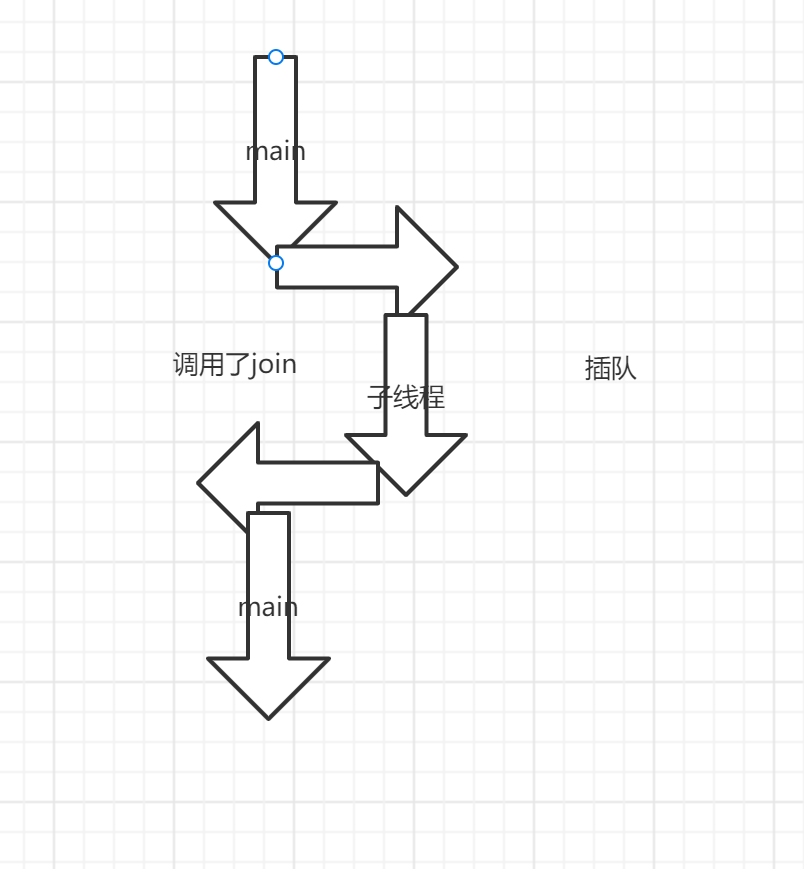
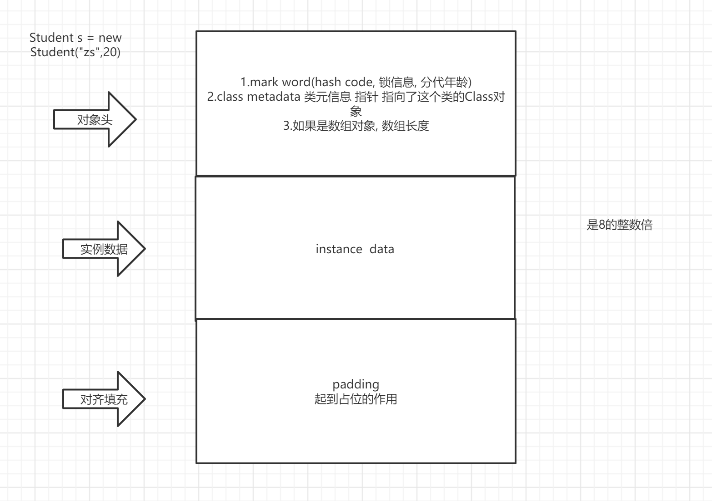
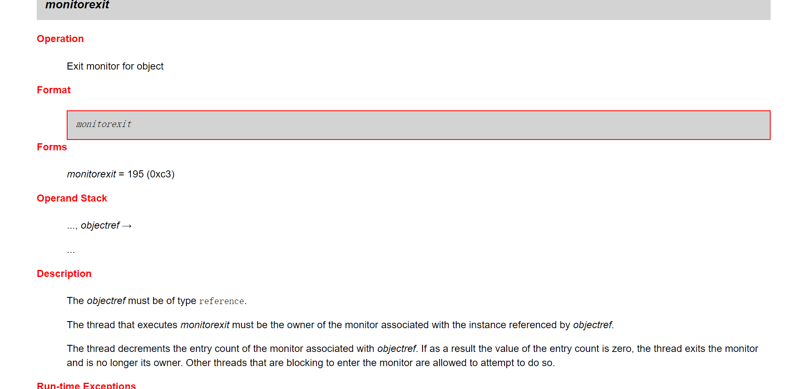

学习目标:

- 除了标记了解的, 其余的都掌握


<span style=color:yellow;background:red>**章节在工作、面试过程中作用：**</span>在工作过程中，使用单线程比较慢，有一些场景下，可能需要使用多线程加快速度（场景不多，且多线程非常容易出错）。所以对于多线程的使用，是这样建议的：能不用多线程就不用。

在面试过程中，会涉及到此章节内容，但是在工作过程中，多线程基本不怎么使用。 


面试的时候，可以不会。 但是不能不会，还表现不想学。没有学习的欲望。

# 引例:单线程不能满足"同时"的需求

假如我要实现如下功能
程序不停地在屏幕上输出一句问候的语句(比如“你好”)
“同时”，当我通过键盘输入固定输入的时候，程序停止向屏幕输出问候的语句(比如说输入end)


单线程

无法做到"同时"发生

```java
package _19thread01.com.cskaoyan._01introduction;

import java.util.Scanner;
import java.util.concurrent.TimeUnit;

/**
 * @description:
 * @author: 景天
 * @date: 2022/10/19 9:11
 **/
/*
程序不停地在屏幕上输出一句问候的语句(比如“你好”)  ----> sayHello()
“同时”，当我通过键盘输入固定输入的时候，          --->waitToStop()
程序停止向屏幕输出问候的语句(比如说输入gun)
 */
public class Demo {
    public static boolean flag = true;
    public static void main(String[] args) {
        System.out.println("main before");
        System.out.println("hello before");

        sayHello();
        System.out.println("hello after");

        System.out.println("wait before");
        waitToStop();
        System.out.println("wait after");

        System.out.println("main after");
    }

    private static void waitToStop() {
        Scanner scanner = new Scanner(System.in);
        // 多次输入
        while (flag) {
            String s = scanner.nextLine();
            if ("gun".equals(s)) {
                flag = false;
                break;
            }
        }
    }

    private static void sayHello() {
        while (flag) {
            System.out.println("你好");
            try {
                // 让程序暂停执行3秒
                TimeUnit.SECONDS.sleep(3);
            } catch (InterruptedException e) {
                e.printStackTrace();
            }
        }
    }
}

```


多线程

可以做到同时发生

```java
package _19thread01.com.cskaoyan._01introduction;

import java.util.Scanner;
import java.util.concurrent.TimeUnit;

/**
 * @description:
 * @author: 景天
 * @date: 2022/10/19 9:11
 **/
/*
程序不停地在屏幕上输出一句问候的语句(比如“你好”)  ----> sayHello()
“同时”，当我通过键盘输入固定输入的时候，          --->waitToStop()
程序停止向屏幕输出问候的语句(比如说输入gun)

多线程改进
 */
public class Demo2 {
    public static boolean flag = true;
    public static void main(String[] args) {
        System.out.println("main before");
        System.out.println("hello before");

        sayHello();
        System.out.println("hello after");

        System.out.println("wait before");
        waitToStop();
        System.out.println("wait after");

        System.out.println("main after");
    }

    private static void waitToStop() {
        new Thread(new Runnable() {
            @Override
            public void run() {
                Scanner scanner = new Scanner(System.in);
                // 多次输入
                while (flag) {
                    String s = scanner.nextLine();
                    if ("gun".equals(s)) {
                        flag = false;
                        break;
                    }
                }
            }
        }).start();

    }

    private static void sayHello() {
        new Thread(new Runnable() {
            @Override
            public void run() {
                while (flag) {
                    System.out.println("你好");
                    try {
                        // 让程序暂停执行3秒
                        TimeUnit.SECONDS.sleep(3);
                    } catch (InterruptedException e) {
                        e.printStackTrace();
                    }
                }
            }
        }).start();

    }
}

```


# 操作系统基本概念

## 进程(process)与线程(thread)

**进程**

- 计算机程序在某个数据集合上的运行活动.进程是操作系统进行资源调度与分配的基本单位
- 正在运行的程序或者软件（比如word这个程序，qq这个程序，就是一个进程）

**线程**

- 进程中有多个子任务,每个子任务就是一个线程. 从执行路径的角度看, 一条执行路径就是一个线程
- 线程是CPU进行调度的基本单位（比如一个Java程序中，有一个main线程，肯定还有一个垃圾回收线程）


**进程与线程的关系**

- 线程依赖于进程而存在
- 一个进程中可以有多个线程(最少1个)
- 线程共享进程资源
- 举例: 迅雷。


迅雷这个程序是一个进程。 

迅雷里面有下载文件的，传统的下载方式，就是使用一个人来搬，多线程就是喊10个人来搬。 


<span style=color:yellow;background:red>**面试的时候，可能会涉及到直接询问这个概念。**</span>

要自己思考一下。


## 串行(serial),并行(parallel)与并发(concurrency)

<font color=red>**面试会直接问这几个词的含义。 **</font>

**串行**

- 一个任务接一个任务按顺序执行

并行

- 在同一个时间点(时刻)上, 多个任务同时运行

并发

- 在同一时间段内,多个任务同时运行


## 同步(synchronization)与异步(asynchronization)

有2个任务(业务) A   B

同步:

- A任务执行的时候B不能执行,按顺序执行
- 你走我不走

异步:

- A任务执行的时候,B任务可以执行
- 你走你的,我走我的,互相不干扰
- 多线程是天生异步的

举例: 去书店买Java书, 给老板打了个电话, 问有没有Java书

同步: 老板说找一下,然后告诉我, 电话没有挂断, 我在电话另一端等待.

异步:老板说找一下,然后告诉我, 电话挂断. 等老板找到后, 再通知我, 我在电话另一端不用等待


同步和异步， 异步的效率高。 但是同步更简单一点。 

# Java程序运行原理

## Java命令+主类类名运行原理

- Java命令会启动JVM进程, JVM进程会创建一个线程(main线程)
- 执行main线程里面的main方法

## JVM是单线程还是多线程的

结论: JVM是多线程的

除了main线程外,还有其他线程,起码还有一个垃圾回收线程

# 多线程的实现方式一:继承Thread类

*线程* 是程序中的执行线程。Java 虚拟机允许应用程序并发地运行多个执行线程。

## 文档示例


## 步骤

1. 定义一个类继承Thread类
2. 重写run方法
3. 创建子类对象
4. 通过start方法启动线程

Demo

```java
package com.cskaoyan.day19_thread._02_newthread;

import java.util.concurrent.TimeUnit;

/**
 * 创建线程的方式一： 继承Thread类。
 * 步骤：
 * 1.新建类，类继承Thread
 * 2.重写run方法.(在这个方法中，完成你的业务逻辑。)
 * 3.新建这个类，调用它的start方法
 *
 * @author Common-zhou
 * @since 2023-10-20 17:04
 */
public class Demo1 {
    public static void main(String[] args) {
        System.out.println("main start");

        // 使用这个类的方式。新建一个这个类，然后调用它的start方式.
        MyThread myThread = new MyThread();

        myThread.start();

        try {
            TimeUnit.SECONDS.sleep(2);
        } catch (InterruptedException e) {
            throw new RuntimeException(e);
        }

        System.out.println("main end");
    }
}

class MyThread extends Thread {
    @Override
    public void run() {
        System.out.println("MyThread run......");
    }
}
```


```java
没加等待的结果:
main start
main end
MyThread run......

加上等待的结果:
main start
MyThread run......
main end
```

## 注意事项

**多线程的执行特点是什么?**

- 执行特点是随机的（针对的是线程和线程之间，在线程内部，还是顺序。 ）

```java
package com.cskaoyan.day19_thread._02_newthread;

/**
 * 线程执行的特点是随机的
 *
 * @author Common-zhou
 * @since 2023-10-22 14:01
 */
public class Demo2 {
    public static void main(String[] args) {
        // 新建这个类，调用start方法

        MyThread2 myThread2 = new MyThread2();
        MyThread2 myThread21 = new MyThread2();

        myThread2.start();
        myThread21.start();

    }
}

class MyThread2 extends Thread {

    /**
     * 在这个run方法中写自己的逻辑
     */
    @Override
    public void run() {
        for (int i = 0; i < 10; i++) {
            // getName是获取线程的名字。 是Thread的方法
            System.out.println(Thread.currentThread().getName() + "---" + i);
        }
    }
}

```

```java
执行结果:
Thread-1---0
Thread-1---1
Thread-1---2
Thread-1---3
Thread-1---4
Thread-1---5
Thread-1---6
Thread-0---0
Thread-0---1
Thread-1---7
Thread-0---2
Thread-1---8
Thread-1---9
Thread-0---3
Thread-0---4
Thread-0---5
Thread-0---6
Thread-0---7
Thread-0---8
Thread-0---9
```


**start方法跟run方法有什么区别?**

- start方法才是开辟新的执行路径, run方法只是普通方法调用, 并没有开辟新的执行路径, 还是一条执行路径, 仍然是单线程的.

```java
package com.cskaoyan.day19_thread._02_newthread;

/**
 * start方法跟run方法有什么区别?
 * start方法是启动一个线程来执行；
 * run 方法是调用这个方法，并没有启动新线程
 * 
 * @author Common-zhou
 * @since 2023-10-22 14:05
 */
public class Demo3 {
    public static void main(String[] args) {
        MyThread2 myThread2 = new MyThread2();

        System.out.println("main start ");

        // 只有使用start才是启动线程。 否则只是相当于调用了这个方法
        // start() 新建线程
        // run() 普通的方法调用
        myThread2.start();

        // 这只是普通的方法调用。 并不是新建线程
        // myThread2.run();

        System.out.println("main end");


    }
}

```

```java
调用start()方法的结果:
main start 
main end
Thread-0---0
Thread-0---1
Thread-0---2
Thread-0---3
Thread-0---4
Thread-0---5
Thread-0---6
Thread-0---7
Thread-0---8
Thread-0---9
    
调用run()方法的结果:
main start 
main---0
main---1
main---2
main---3
main---4
main---5
main---6
main---7
main---8
main---9
main end
```

同学，run方法和start方法，有啥区别？（<span style=color:yellow;background:red>**面试题**</span>）

- run方法里面写得是方法的逻辑。 但是调用的时候，不能调用run方法，如果调用只是单线程
- 如果要启动一个新的线程，必须要start方法。 


**同一个线程能否启动多次?**

- 不能启动多次, java.lang.IllegalThreadStateException

- ```java
  package com.cskaoyan.day19_thread._02_newthread;
  
  /**
   * 同一个线程对象，不能启动多次。
   * 会报错 IllegalThreadStateException
   * @author Common-zhou
   * @since 2023-10-22 14:23
   */
  public class Demo4 {
      public static void main(String[] args) {
          MyThread2 myThread2 = new MyThread2();
          System.out.println("main start");
  
          myThread2.start();
          myThread2.start();
          System.out.println("main end");
  
      }
  }
  
  ```
  
  

**谁才代表一个线程?**

- Thread及其子类对象才代表线程, 就是t1,t2


在多线程中，输出可能和单线程不一样。 

# 设置获取线程名称


```JAVA
String  getName()   返回该线程的名称。
static Thread    currentThread()     返回对当前正在执行的线程对象的引用。
void  setName(String name)      改变线程名称，使之与参数 name 相同。
```


还可以通过**[Thread](../../java/lang/Thread.html#Thread(java.lang.String))**(String name)        分配新的 Thread 对象。设置名称

```java
package com.cskaoyan.day19_thread._03_api;

/**
 * 每个线程都有名字。 是从Thread-0 1 2 开始的
 *
 * @author Common-zhou
 * @since 2023-10-22 14:28
 */
public class Demo1Name {
    public static void main(String[] args) {
        // Thread.currentThread() 可以获取当前的线程，
        System.out.println("thread run :" + Thread.currentThread().getName());

        MyThread myThread = new MyThread();
        // 如果没有指定线程的名称。 那就是 Thread-0  Thread-1
        myThread.start();

        MyThread myThread2 = new MyThread("王道吴彦祖");

        // setName() 可以设置线程的名称
        myThread2.setName("王道彭于晏");

        myThread2.start();
    }
}

class MyThread extends Thread {

    public MyThread() {
    }

    // 可以传入线程名称。
    public MyThread(String name) {
        super(name);
    }

    @Override
    public void run() {
        for (int i = 0; i < 10; i++) {
            System.out.println(Thread.currentThread().getName() + "---" + i);
        }
    }
}
```


# 线程的调度方式

## 什么是线程调度

概念: 给线程分配CPU处理权的过程

## 调度方式的分类

- 协同式线程调度
  - 线程的执行时间由线程本身决定, 当这个线程执行完后报告操作系统,切换到下一个线程
- 抢占式的线程调度方式
  - 线程的执行时间由系统决定, 哪个线程抢到了CPU的执行,哪个线程执行

比如，现在有多个线程要执行。 线程1， 线程2，线程3。

## Java中采用哪种调度方式

Java中采用的是抢占式的调度方式。

效率会更高一点。 

# 线程的优先级(了解)

## 操作系统优先级

动态优先级

- 正在执行的线程会随着执行时间的延长, 优先级降低
- 正在等待的线程会随着等待的时间的延长,优先级会升高

静态优先级

- 固定数值

动态优先级+静态优先级

## Java中优先级

静态优先级  1-10

| static int | MAX_PRIORITY        线程可以具有的最高优先级。10  |
| ---------- | ------------------------------------------------- |
| static int | MIN_PRIORITY        线程可以具有的最低优先级。  1 |
| static int | NORM_PRIORITY        分配给线程的默认优先级。  5  |


**设置获取优先级**

| int  | getPriority()        返回线程的优先级。 |
| ---- | --------------------------------------- |
| void | setpriority(int n) 设置线程优先级       |

Demo

```java
package _19thread01.com.cskaoyan._03api;

/**
 * @description:
 * @author: 景天
 * @date: 2022/10/19 14:38
 **/
/*
获取设置线程优先级
 */
public class PriorityDemo {
    public static void main(String[] args) {
        // 创建子类对象
        MyThread2 t = new MyThread2();
        // setPriority(int n)
        //t.setPriority(Thread.MAX_PRIORITY);
        t.setPriority(Thread.MIN_PRIORITY);

        // getPriority()
        int priority = t.getPriority();
        System.out.println("priority = " + priority);
        // start
        t.start();
    }
}

class MyThread2 extends Thread{
    //run

    @Override
    public void run() {
        for (int i = 0; i < 10; i++) {
            System.out.println(i);
        }
    }

}
```


优先级案例

创建并启动2个线程 A  B

A线程设置最大优先级10

B线程设置最小优先级 1

每个线程打印10个数


结论: 做不到A先打印完 B打印完

优先级没有卵用.

然而，我们在Java语言中设置的线程优先级，它仅仅只能被看做是一种"建议"(对操作系统的建议)，
实际上，操作系统本身，有它自己的一套线程优先级 (静态优先级 + 动态优先级)

 Java官方： 线程优先级并非完全没有用，我们Thread的优先级，它具有统计意义，总的来说，高优先级的线程
 占用的cpu执行时间多一点，低优先级线程，占用cpu执行时间，短一点

```java
package _19thread01.com.cskaoyan._03api;

/**
 * @description:
 * @author: 景天
 * @date: 2022/10/19 14:42
 **/
/*


优先级案例

创建并启动2个线程 A  B

A线程设置最大优先级10

B线程设置最小优先级 1

每个线程打印10个数
 */
public class Ex {
    public static void main(String[] args) {
        // 创建2个线程
        MyThread3 t1 = new MyThread3("A");
        MyThread3 t2 = new MyThread3("B");

        // 设置优先级
        t1.setPriority(10);
        t2.setPriority(1);

        // 启动
        t1.start();
        t2.start();
    }
}

class MyThread3 extends Thread{
    //run

    public MyThread3(String name) {
        super(name);
    }

    @Override
    public void run() {
        for (int i = 0; i < 10; i++) {
            System.out.println(getName()+"-----"+i);
        }
    }

}
```

# 线程控制API

## 线程休眠sleep

```JAVA
static void sleep(long millis)        在指定的毫秒数内让当前正在执行的线程休眠（暂停执行），此操作受到系统计时器和调度程序精度和准确性的影响。
```


```java
package com.cskaoyan.day19_thread._03_api;

/**
 * sleep就是让线程休眠
 *
 * @author Common-zhou
 * @since 2023-10-22 16:44
 */
public class Demo3Sleep {
    public static void main(String[] args) {
        System.out.println("main start ");

        new SleepThread().start();

        System.out.println("main end");
    }
}

class SleepThread extends Thread {
    @Override
    public void run() {
        for (int i = 0; i < 10; i++) {
            System.out.println(Thread.currentThread().getName() + "===>" + i);

            // Thread.sleep单位是ms。
            // Thread.sleep(1000); 和  TimeUnit.MILLISECONDS.sleep(1000); 等价
            try {
                Thread.sleep(1000);
            } catch (InterruptedException e) {
                throw new RuntimeException(e);
            }
            // TimeUnit.MILLISECONDS.sleep(1000);
        }
    }
}

```


## 线程合并join

```JAVA
void join()        等待该线程终止。
```


**谁等待?**

执行结果上看main线程在等待, join这行代码在哪个线程上运行, 哪个线程等待


**等待谁?**

执行结果上看等待的是子线程, 哪个线程调用了join, 等待的就是这个线程



```java
package com.cskaoyan.day19_thread._03_api;

/**
 * 执行结果上看main线程在等待, join这行代码在哪个线程上运行, 哪个线程等待
 * join就是等待，当前线程等待调用这个线程结束。
 * 如果当前执行的线程是main。  则main end会等到joinThread结束后才往下走。
 * <pre>
 * {
 *      joinThread.join();  // 代表main线程等待joinThread执行完成之后。再往下执行
 *      System.out.println("main end")
 * }
 * </pre>
 *
 * @author Common-zhou
 * @since 2023-10-22 16:53
 */
public class Demo4Join {

    public static void main(String[] args) throws InterruptedException {
        // join就是让其他的线程加入到当前执行的线程之中。
        // 等到这个线程执行结束，再继续执行

        System.out.println("main start");

        JoinThread joinThread = new JoinThread();

        joinThread.start();

        joinThread.join();

        System.out.println("main end");
    }

}

class JoinThread extends Thread {
    @Override
    public void run() {
        for (int i = 0; i < 10; i++) {
            System.out.println(Thread.currentThread().getName() + "===>" + i);
        }
    }
}
```


```java
没有使用join的输出结果:
main start
main end
Thread-0===>0
Thread-0===>1
Thread-0===>2
Thread-0===>3
Thread-0===>4
Thread-0===>5
Thread-0===>6
Thread-0===>7
Thread-0===>8
Thread-0===>9

    
使用join后输出结果:
main start
Thread-0===>0
Thread-0===>1
Thread-0===>2
Thread-0===>3
Thread-0===>4
Thread-0===>5
Thread-0===>6
Thread-0===>7
Thread-0===>8
Thread-0===>9
main end
```


## 线程礼让yield

```JAVA
static void yield()        暂停当前正在执行的线程对象，并执行其他线程。  
```


创建并启动2个线程 A B

都是打印10个数

要求A打印0, B打印0, A打印1, B打印1.....

结论: 通过yield方法做不到

```java
package com.cskaoyan.day19_thread._03_api;

/**
 * 要求A打印0, B打印0, A打印1, B打印1.....
 * 线程礼让
 * 创建并启动2个线程 A B
 * 都是打印10个数
 * 要求A打印0, B打印0, A打印1, B打印1.....
 * 礼让了，但是又没有完全礼让。
 *
 * @author Common-zhou
 * @since 2023-10-22 17:11
 */
public class Demo5Yield {
    public static void main(String[] args) {
        new YieldThread().start();
        new YieldThread().start();
    }
}

class YieldThread extends Thread {
    @Override
    public void run() {
        for (int i = 0; i < 10; i++) {
            System.out.println(Thread.currentThread().getName() + "===> " + i);

            // 当前线程将执行权让出去
            // 暂停当前正在执行的线程对象，并执行其他线程。
            Thread.yield();
            // 虽然yield方法使当前线程放弃了CPU的执行权 但是仍然可以参与下轮的CPU的竞争
        }
    }
}
```

## 守护线程setDaemon

**线程分类**

- 用户线程(默认)
  - 系统的工作线程
- 守护线程
  - 为用户线程服务的线程(GC垃圾回收线程), 系统的后台线程, 可以把它当做用户线程的奴仆

```java
void setDaemon(boolean on)        将该线程标记为守护线程或用户线程.on - 如果为 true，则将该线程标记为守护线程。
```


**注意:**

- 当正在运行的线程都是守护线程时，Java 虚拟机退出。
- 该方法必须在启动线程前调用。 (start之前) Java.lang.IllegalThreadStateException

```java
package _19thread01.com.cskaoyan._03api;

/**
 * @description:
 * @author: 景天
 * @date: 2022/10/19 15:45
 **/
/*
守护线程
 */
public class DaemonDemo {
    public static void main(String[] args) {
        System.out.println("main start");

        // 创建线程对象
        ThreadDaemon t = new ThreadDaemon();

        // 把t这个线程设置为守护线程
        t.setDaemon(true);

        // start
        t.start();


        // main 打印3个数
        for (int i = 0; i < 3; i++) {
            System.out.println(Thread.currentThread().getName()+
                    "----"+i);
            try {
                Thread.sleep(1000);
            } catch (InterruptedException e) {
                e.printStackTrace();
            }
        }

        System.out.println("main end");
    }
}

class ThreadDaemon extends Thread{
    @Override
    public void run() {
        for (int i = 0; i < 10; i++) {
            System.out.println(getName()+"----"+i);
            try {
                Thread.sleep(1000);
            } catch (InterruptedException e) {
                e.printStackTrace();
            }
        }
    }
}
```


## 线程中断stop(已过时,了解)

```JAVA
void stop()        已过时。 该方法具有固有的不安全性
```

# 线程的生命周期

## 线程的几种状态

### 理论层面的状态

**新建**

- 刚new出来的线程对象

**就绪**

- 线程执行了start()方法后

**执行**

- 拥有CPU的执行权

**阻塞**

- 线程会处于阻塞状态 

**死亡**

- run方法执行完

### 代码层面的状态

- NEW
  至今尚未启动的线程处于这种状态。 
- RUNNABLE
  正在  Java 虚拟机中执行的线程处于这种状态。 
- BLOCKED
  受阻塞并等待某个监视器锁的线程处于这种状态。 
- WAITING
  无限期地等待另一个线程来执行某一特定操作的线程处于这种状态。 
- TIMED_WAITING
  等待另一个线程来执行取决于指定等待时间的操作的线程处于这种状态。 
- TERMINATED
  已退出的线程处于这种状态。

## 线程状态的转换


# 多线程实现方式二:实现Runnable接口

## 文档示例


## 步骤

1. 定义一个类实现Runnable接口
2. 重写run方法
3. 创建子类对象
4. 创建线程对象, 把实现了Runnable接口的子类对象作为参数传递
5. start方法启动线程


Demo

```java
package com.cskaoyan.day19_thread._04_impltwo;

/**
 * 创建新线程的第二种方式。
 *
 * <pre>
 *    1. 定义一个类实现Runnable接口
 *    2. 重写run方法
 *    3. 创建子类对象
 *    4. 创建线程对象, 把实现了Runnable接口的子类对象作为参数传递
 *    5. start方法启动线程
 * </pre>
 *
 * @author Common-zhou
 * @since 2023-10-23 10:46
 */
public class Demo1NewThread {
    public static void main(String[] args) {
        // 3. 创建子类对象
        WorkRunnable workRunnable = new WorkRunnable();

        //  4. 创建线程对象, 把实现了Runnable接口的子类对象作为参数传递
        Thread thread = new Thread(workRunnable);

        // 5. start方法启动线程
        thread.start();
    }

}

// 1. 定义一个类实现Runnable接口
class WorkRunnable implements Runnable {

    // 2. 重写run方法
    @Override
    public void run() {
        System.out.println(Thread.currentThread().getName() + ", 我是runnable接口的run方法");
    }
}
```


其他写法 匿名内部类  lambda

```java
package com.cskaoyan.day19_thread._04_impltwo;

/**
 * 也可以不用写子实现类。 可以直接使用lambda表达式来写。
 *
 * @author Common-zhou
 * @since 2023-10-23 10:46
 */
public class Demo1NewThread2 {
    public static void main(String[] args) {

        // 匿名内部类
        new Thread(new Runnable() {
            @Override
            public void run() {
                System.out.println("匿名内部类的方式实现线程");
            }
        }).start();

        new Thread(() -> {
            System.out.println("lambda表达式实现的");
        }).start();
    }

}
```


## 为什么Runnable中的run方法会运行在子线程中

```java
class Thread implements Runnable{
    // 成员变量
	private Runnable  target;
    
    // 构造方法
    Thread(Runnable target){
        init(target);
    }
    void init(Runnable target){
        // 左边是成员变量 右边是传过来的参数 给成员变量赋值
        this.target = target;
    }
    
    void run(){
        if(target != null){
            target.run()
        }
    }
}

```


# 方式一VS方式二

- 步骤上, 方式一4步, 方式二是5步
- 方式一通过继承的方式(单继承的局限性),方式二通过实现接口的方式。在工作过程中，方式二更推荐。 
- 方式二把线程跟线程上要做的事情区分开来(执行路径,跟执行路径上的任务区分开来)  解耦
- 方式二便于数据共享。


- 方式1的步骤：继承Thread类；重写run方法；创建子类对象； 调用start方法
-  方式2的步骤： 实现Runnable接口； 实现run方法； 创建接口（子类）对象； 创建线程，把子类对象塞入构造方法； 调用start。 


多线程仿真如下场景：
假设A电影院正在上映某电影，该电影有100张电影票可供出售，现在假设有3个窗口售票。请设计程序模拟窗口售票的场景。

分析：
3个窗口售票，互不影响，同时进行。 -----> 多线程  3个线程
3个窗口共同出售这100张电影票		-------> 多线程共享数据

```java
package com.cskaoyan.day19_thread._05_datasecurity;

import java.util.concurrent.TimeUnit;

/**
 * 我们先梳理一下，单线程和多线程的场景。
 * 背景： 假设现在有一个电影院，它需要卖票出去，现在有几个窗口呢？
 * 场景一（单线程）： 假设现在就一个售票窗口。
 * 场景二（多线程）：假设现在有几个售票窗口。
 * 接下来，我们以下面这个例子，说明多线程的好处以及坏处。
 *
 * @author Common-zhou
 * @since 2023-10-23 14:51
 */
public class Demo1Cinema {
    public static void main(String[] args) {
        // 100张票
        SellWindow sellWindow = new SellWindow(100);

        Thread thread1 = new Thread(sellWindow);
        Thread thread2 = new Thread(sellWindow);
        Thread thread3 = new Thread(sellWindow);

        thread1.setName("窗口1");
        thread2.setName("窗口2");
        thread3.setName("窗口3");

        thread1.start();
        thread2.start();
        thread3.start();

        // ========================= Case1: 重复的票 =========================
        // 有ABC三个线程。
        // 假设A抢到了CPU的执行权 tickets = 100
        // 假设B抢到了CPU的执行权 tickets = 100
        // C抢到了CPU的执行权    tickets = 100

        // 因为ticket--并不是一步
        // 1.取值  2.-1  3.重新赋值
        //
        // 假设A睡醒  取值100 没来及-1 被抢走了执行权
        // B抢到了   取值100 没来及-1  被抢走了执行权
        // C抢到了  取值100

        // ========================= Case2: 不存在的票 =========================
        // 假设目前就剩一张票。
        // A线程  ticket=1
        // B线程  ticket=1
        // C线程  ticket=1
        // 三个线程都进入了if。这时候是都可以的。
        // 所以都进去了
        // 等到卖票的时候，可能就变成了  1  0  -1


    }

}

// 一般推荐使用实现Runnable的方式，因为是单继承。
class SellWindow implements Runnable {

    int ticket;

    public SellWindow(int ticket) {
        this.ticket = ticket;
    }

    @Override
    public void run() {
        while (true) {
            // 这就是几个窗口，它们疯狂卖票。
            // 但是有时候，现实生活中，可能会出现网络不好等情况，我们使用睡一会来代替。
            if (ticket > 0) {
                // 如果大于0，代表能卖
                try {
                    TimeUnit.MILLISECONDS.sleep(100);
                } catch (InterruptedException e) {
                    throw new RuntimeException(e);
                }
                System.out.println(Thread.currentThread().getName() + "卖出了第" + (ticket--) + "张票");
            } else {
                break;
            }
        }
    }
}
```


多线程的好处和坏处

在工作过程中的代码，绝大部分都是单线程，可能有同学写了两三年代码，不懂多线程，但是丝毫不影响写业务代码。这是为什么呢？

因为在绝大部分情况下，主要是业务比较复杂，只要完成业务就行。只有在很特殊的场景下，才需要使用多线程。

多线程好处： 速度快。

多线程坏处：容易出错。死锁等问题。

# 多线程数据安全问题

## 造成的现象

- 出现重复的票

  

- 出现不存在的票


## 产生原因

- 多个线程，需要去访问同样一个数据。
- 存在非原子操作
  - 原子操作: 一个不可分割的操作(一个操作要么一次执行完, 要么不执行)

举例来说，单线程就是一个人去卖100张票；多线程就是三个人去卖100张票。所以会出问题。

如果能将卖票的动作原子化，则可以解决这个问题。

# 解决多线程数据安全问题

思路: 由产生的原因入手

需求无法更改

只能改非原子操作

引入锁的概念


还是拿买票这个例子来说。可以将买票这个动作原子化。什么意思呢，就是我卖票，你不能卖，比如，我们去拿一个锁，拿到锁才能卖。

## synchronized

### 同步代码块

同步代码块的锁对象(对象 , 用来充当锁的角色)

可以是任意的对象, 但是要保证是同一个

```java
synchronized(锁对象){
    // 对共享数据的访问操作
}
```

```java
package com.cskaoyan.day19_thread._05_datasecurity;

import java.util.concurrent.TimeUnit;

/**
 * 线程
 *
 * @author Common-zhou
 * @since 2023-10-23 15:58
 */
public class Demo2Cinema2 {
    public static void main(String[] args) {

        SellWindow2 sellWindow = new SellWindow2(100);

        Thread thread1 = new Thread(sellWindow);
        Thread thread2 = new Thread(sellWindow);
        Thread thread3 = new Thread(sellWindow);

        thread1.setName("窗口1");
        thread2.setName("窗口2");
        thread3.setName("窗口3");

        thread1.start();
        thread2.start();
        thread3.start();
    }
}

class SellWindow2 implements Runnable {

    int ticket;

    // 定义一把锁，只有拿到这个锁，才能进入代码块
    private final Object object = new Object();
    // private final A a = new A();

    public SellWindow2(int ticket) {
        this.ticket = ticket;
    }

    @Override
    public void run() {
        while (true) {
            synchronized (object) {
                if (ticket > 0) {
                    try {
                        TimeUnit.MILLISECONDS.sleep(100);
                    } catch (InterruptedException e) {
                        throw new RuntimeException(e);
                    }

                    System.out.println(Thread.currentThread().getName() + "卖出了第" + (ticket--) + "张票");
                } else {
                    break;
                }
            }

        }

    }
}

class A {
}
```


比如，现在有另一个需求，我们需要使用多线程，对一个数累加10000次，五个线程来累加。从单线程的角度思考，最终得到的整数，肯定是5w。但是，如果使用多线程来操作，如果不加控制，最终结果不会是5w。换句话来说，这也就是线程安全问题。

```JAVA
package com.cskaoyan.day19_thread._06_sync;

/**
 * synchronized关键字，可以用在三个地方。
 * 1.方法上
 * 2.静态方法上
 * 3.类对象上。
 *
 * @author Common-zhou
 * @since 2023-10-23 16:56
 */
public class Demo1Sync1 {
    public static void main(String[] args) throws InterruptedException {
        MyThread1 myThread1 = new MyThread1();
        MyThread1 myThread2 = new MyThread1();
        MyThread1 myThread3 = new MyThread1();
        MyThread1 myThread4 = new MyThread1();
        MyThread1 myThread5 = new MyThread1();

        myThread1.start();
        myThread2.start();
        myThread3.start();
        myThread4.start();
        myThread5.start();

    }
}

class MyThread1 extends Thread {
    // 我有n个线程，需要对一个int数据进行累加。
    // 在单线程的情况下，这种很好理解。 比如有5个线程，每个线程加10000次，最终的答案是 50000

    public static int value = 0;

    @Override
    public void run() {
        for (int i = 0; i < 10000; i++) {
            value++;
        }
        System.out.println("最终的值是：" + value);
    }
}

```


```JAVA
package com.cskaoyan.day19_thread._06_sync;

/**
 * synchronized关键字，可以用在三个地方。
 * 1.方法上
 * 2.静态方法上
 * 3.类对象上。
 *
 * @author Common-zhou
 * @since 2023-10-23 16:56
 */
public class Demo1Sync1 {
    public static void main(String[] args) throws InterruptedException {
        MyThread1 myThread1 = new MyThread1();
        MyThread1 myThread2 = new MyThread1();
        MyThread1 myThread3 = new MyThread1();
        MyThread1 myThread4 = new MyThread1();
        MyThread1 myThread5 = new MyThread1();

        myThread1.start();
        myThread2.start();
        myThread3.start();
        myThread4.start();
        myThread5.start();

    }
}

class MyThread1 extends Thread {
    // 我有n个线程，需要对一个int数据进行累加。
    // 在单线程的情况下，这种很好理解。 比如有5个线程，每个线程加10000次，最终的答案是 50000

    public static int value = 0;

    // 用来当锁的对象
    public static final Object obj = new Object();

    @Override
    public void run() {

        for (int i = 0; i < 10000; i++) {
            synchronized (obj) {
                // 如果抢到锁了，再进行累加
                value++;
            }
        }

        System.out.println("最终的值是：" + value);
    }
}

```


synchronized可以加在以下这些位置：

- 代码块上。放在代码块上，需要手动指定锁对象，分以下两种情况

  - 使用this 或 其他对象
  - 使用class对象。  如 Demo.class

- 方法上。不用指定锁对象，锁对象是this 。将synchronized关键字放在方法上。

  ```JAVA
   private synchronized void test2() 
  ```

- 静态方法。不用指定锁对象，锁对象是类文件

  ```JAVA
   private static synchronized void test3() 
  ```

  

### 同步方法

同步方法的锁对象是this

### 静态同步方法

静态同步方法的锁对象是字节码文件对象(Class对象)


```JAVA
package com.cskaoyan.day19_thread._06_sync;

import java.util.concurrent.TimeUnit;

/**
 * 这个验证： synchronized 放在普通方法上 和 synchronized(this) 锁的都是当前对象。
 *
 * @author Common-zhou
 * @since 2023-10-24 09:38
 */
public class Demo3Block {
    public static void main(String[] args) {

        MyRunnable2 myRunnable2 = new MyRunnable2(true);

        Thread thread1 = new Thread(myRunnable2);
        Thread thread2 = new Thread(myRunnable2);

        thread1.start();
        thread2.start();

    }
}


class MyRunnable2 implements Runnable {

    private boolean useBlock;

    public MyRunnable2(boolean useBlock) {
        this.useBlock = useBlock;
    }

    @Override
    public void run() {
        if (useBlock) {
            useBlock = false;
            synchronized (this) {
                // 使用自身对象当锁
                System.out.println(Thread.currentThread().getName() + " 进入synchronized代码块");
                try {
                    TimeUnit.SECONDS.sleep(10);
                } catch (InterruptedException e) {
                    throw new RuntimeException(e);
                }
                System.out.println(Thread.currentThread().getName() + " 退出synchronized代码块");
            }
        } else {
            test2();
        }

    }

    private synchronized void test2() {
        System.out.println(Thread.currentThread().getName() + " 进入方法");

        try {
            TimeUnit.SECONDS.sleep(10);
        } catch (InterruptedException e) {
            throw new RuntimeException(e);
        }

        System.out.println(Thread.currentThread().getName() + " 退出方法");

    }
}

```


```JAVA
package com.cskaoyan.day19_thread._06_sync;

import java.util.concurrent.TimeUnit;

/**
 * 这个验证的是 synchronized(Demo.class) 和  synchronized放在静态方法上。 所得都是当前类对象
 *
 * @author Common-zhou
 * @since 2023-10-24 10:11
 */
public class Demo4Block {
    public static void main(String[] args) throws InterruptedException {
        MyRunnable3 myRunnable3 = new MyRunnable3();


        Thread thread1 = new Thread(myRunnable3);
        Thread thread2 = new Thread(myRunnable3);

        System.out.println("线程一启动");
        thread1.start();

        TimeUnit.SECONDS.sleep(1);

        System.out.println("线程二启动");
        thread2.start();
    }
}


class MyRunnable3 implements Runnable {

    private boolean useBlock = true;

    @Override
    public void run() {
        if (useBlock) {
            useBlock = false;

            synchronized (MyRunnable3.class) {
                System.out.println("MyRunnable的类锁进入了");

                try {
                    TimeUnit.SECONDS.sleep(10);
                } catch (InterruptedException e) {
                    throw new RuntimeException(e);
                }

                System.out.println("MyRunnable的类锁退出了");
            }
        } else {
            useStaticMethod();
        }
    }

    private static synchronized void useStaticMethod() {
        System.out.println("MyRunnable的 静态方法进入了");

        try {
            TimeUnit.SECONDS.sleep(10);
        } catch (InterruptedException e) {
            throw new RuntimeException(e);
        }

        System.out.println("MyRunnable的 静态方法退出了");

    }
}
```


### synchronized的细节

#### 执行流程

- AB2个线程访问sync代码块中的内容
- 假设A线程抢到了CPU的执行权, 看一下锁对象是否可用, 可用, A线程就持有了锁对象, A线程访问同步代码块的内容
- A还没有访问结束,发生了线程切换,B抢到了执行权,B也想访问同步代码块中的内容, 看一下锁是否可用, 不可用, 对于B线程来说, 只能在sync外面等待, B就处于同步阻塞状态
- A再次抢到执行权. A接着执行,访问结束, 退出sync代码块, A释放锁
- B线程就可以获取锁, 访问sync代码块中的内容.

```java
package com.cskaoyan.day19_thread._06_sync;

import java.util.concurrent.TimeUnit;

/**
 * synchronized执行流程。
 *
 * @author Common-zhou
 * @since 2023-10-24 10:23
 */
public class Demo5SyncDetail {

    private static final Object OBJECT_LOCK = new Object();

    public static void main(String[] args) {
        new Thread(() -> {
            synchronized (OBJECT_LOCK) {
                System.out.println("A进入了,拿到了锁对象");
                try {
                    TimeUnit.SECONDS.sleep(10);
                } catch (InterruptedException e) {
                    throw new RuntimeException(e);
                }
                System.out.println("A退出了,释放了锁对象");
            }
        }, "A").start();

        new Thread(() -> {
            synchronized (OBJECT_LOCK) {
                System.out.println("B进入了,拿到了锁对象");
                try {
                    TimeUnit.SECONDS.sleep(10);
                } catch (InterruptedException e) {
                    throw new RuntimeException(e);
                }
                System.out.println("B退出了,释放了锁对象");
            }
        }, "B").start();
    }
}
```


#### 出现异常会释放锁

```java
package com.cskaoyan.day19_thread._06_sync;

import java.util.concurrent.TimeUnit;

/**
 * 演示，当有异常的时候，会自动释放锁。
 *
 * @author Common-zhou
 * @since 2023-10-24 10:36
 */
public class Demo6SyncException {

    private static final Object OBJECT = new Object();

    public static void main(String[] args) throws InterruptedException {
        new Thread(() -> {

            synchronized (OBJECT) {

                int count = 0;
                while (true) {
                    // 在里面写了一个死循环
                    System.out.println("A正在执行， count=" + count);
                    count++;

                    // 循环1次，睡1s。
                    try {
                        TimeUnit.SECONDS.sleep(1);
                    } catch (InterruptedException e) {
                        throw new RuntimeException(e);
                    }

                    if (count == 5) {
                        // 如果count为5，则认为抛出异常
                        throw new RuntimeException("异常了");
                    }
                }
            }

        }, "A").start();

        TimeUnit.SECONDS.sleep(1);

        new Thread(() -> {
            System.out.println("B线程开始执行了========");
            synchronized (OBJECT) {
                System.out.println("B拿到锁了");
            }
        }).start();
    }
}
```


#### 1个对象的内存布局



#### 2条字节码指令(monitorenter/monitorexit)




## Lock

基本使用


```JAVA
void lock()        获取锁
void unlock()      释放锁
```


Lock是Java提供给我们的一个接口，是一个显式锁。 程序员可以手动控制获取锁，释放锁。 

### ReentrantLock可重入锁

一个可重入的互斥锁 [`Lock`](../../../../java/util/concurrent/locks/Lock.html)，它具有与使用  `synchronized` 方法和语句所访问的隐式监视器锁相同的一些基本行为和语义，但功能更强大。


```java
package com.cskaoyan.day19_thread._07_lock;

import java.util.concurrent.locks.Lock;
import java.util.concurrent.locks.ReentrantLock;

/**
 * Lock是Java给我们提供的接口，允许我们手动的加锁和释放锁。
 *
 * @author Common-zhou
 * @since 2023-10-24 10:51
 */
public class Demo1Lock {
    public static void main(String[] args) {
        MyRunnable myRunnable = new MyRunnable();
        new Thread(myRunnable).start();
        new Thread(myRunnable).start();
        new Thread(myRunnable).start();
        new Thread(myRunnable).start();
        new Thread(myRunnable).start();
    }
}

class MyRunnable implements Runnable {
    private int num = 0;

    private Lock lock = new ReentrantLock();

    @Override
    public void run() {

        // 加锁
        lock.lock();
        try {

            for (int i = 0; i < 10000; i++) {
                num++;
            }
        } finally {
            // 释放锁，必须要放在finally里面，不然有异常，会导致锁一直被占有
            lock.unlock();
        }

        System.out.println("num = " + num);
    }
}

```

**synchronized VS Lock**

- synchronized是关键字, Lock是个接口
- synchronized是一把隐式的锁, 加锁和释放锁是由JVM自动完成的. Lock它是一把真正的(显式的)锁, 我们能看到加锁跟释放锁的过程(lock , unlock)


# 死锁

## 什么是死锁

2个或以上线程因为争抢资源而造成的互相等待的现象


比如线程1需要两个锁，需要A锁和B锁。线程2也需要A锁和B锁。

死锁产生的条件。线程1获取了A锁，线程2获取了B锁。 但是他们都没法获取另外一把锁，就死锁了。


## 死锁产生的场景

一般出现在同步代码块嵌套

```java
synchronized(objA){
    synchronized(objB){
    
}
}
```

```java 
package com.cskaoyan.day20_thread2._02_dielock;

import java.util.concurrent.TimeUnit;

/**
 * 死锁
 *
 * @author Common-zhou
 * @since 2023-10-24 14:39
 */
public class Demo1DieLock {
    public static void main(String[] args) {
        // 第一个，首先使用A锁，再使用B锁
        new Thread(new DieLockRunnable(true)).start();

        // 第二个，首先使用B锁，再使用A锁
        new Thread(new DieLockRunnable(false)).start();

    }
}

/**
 * 这个实现类，主要是完成死锁的演示。
 * 里面有两个对象。作为锁对象。
 * 一个线程先获取A锁，然后获取B锁； 另一个线程先获取B锁，然后获取A锁
 * 顺序是靠 firstUseA来控制的
 */
class DieLockRunnable implements Runnable {

    private static final Object OBJECT_A = new Object();
    private static final Object OBJECT_B = new Object();
    // 代表用A的顺序，是首先用A，还是后面用A。
    private boolean firstUseA;

    public DieLockRunnable(boolean firstUseA) {
        this.firstUseA = firstUseA;
    }

    @Override
    public void run() {
        if (firstUseA) {
            synchronized (OBJECT_A) {
                System.out.println(Thread.currentThread().getName() + "获取了A锁.");

                try {
                    TimeUnit.SECONDS.sleep(1);
                } catch (InterruptedException e) {
                    throw new RuntimeException(e);
                }

                synchronized (OBJECT_B) {
                    System.out.println(Thread.currentThread().getName() + "获取了B锁.");
                    System.out.println(Thread.currentThread().getName() + "同时获取了两个锁.执行成功");
                }
            }
        } else {
            synchronized (OBJECT_B) {
                System.out.println(Thread.currentThread().getName() + "获取了B锁.");
                try {
                    TimeUnit.SECONDS.sleep(1);
                } catch (InterruptedException e) {
                    throw new RuntimeException(e);
                }

                synchronized (OBJECT_A) {
                    System.out.println(Thread.currentThread().getName() + "获取了A锁.");
                    System.out.println(Thread.currentThread().getName() + "同时获取了两个锁.执行成功");
                }
            }
        }

    }
}

```


## 怎么解决死锁

死锁的解决办法：

- 更改加锁的顺序
- 先争夺同一把锁，争取到了，再去获取这些锁。

**更改加锁的顺序**

```java
package com.cskaoyan.day20_thread2._02_dielock;

import java.util.concurrent.TimeUnit;

/**
 * 死锁的两种解决办法：
 * 1.多把锁，按照同样顺序去获取锁。比如，先获取A，再获取B；
 * 2.先获取同一把锁。 获取了之后，再去获取A，获取B
 * <p>
 * 解决办法1： 以同样的顺序去获取锁。
 *
 * @author Common-zhou
 * @since 2023-10-24 15:10
 */
public class Demo2DieLock2 {
    public static void main(String[] args) {

        new Thread(new DieLockRunnable2(true)).start();

        new Thread(new DieLockRunnable2(false)).start();
    }
}

class DieLockRunnable2 implements Runnable {

    private static final Object OBJECT_A = new Object();
    private static final Object OBJECT_B = new Object();

    // 代表用A的顺序，是首先用A，还是后面用A。
    private boolean flag;

    public DieLockRunnable2(boolean flag) {
        this.flag = flag;
    }


    @Override
    public void run() {
        if (flag) {
            synchronized (OBJECT_A) {
                System.out.println(Thread.currentThread().getName() + "获取了A锁.");

                try {
                    TimeUnit.SECONDS.sleep(1);
                } catch (InterruptedException e) {
                    throw new RuntimeException(e);
                }

                synchronized (OBJECT_B) {
                    System.out.println(Thread.currentThread().getName() + "获取了B锁.");
                    System.out.println(Thread.currentThread().getName() + "同时获取了两个锁.执行成功");
                }
            }
        } else {
            synchronized (OBJECT_A) {
                System.out.println(Thread.currentThread().getName() + "获取了A锁.");
                try {
                    TimeUnit.SECONDS.sleep(1);
                } catch (InterruptedException e) {
                    throw new RuntimeException(e);
                }

                synchronized (OBJECT_B) {
                    System.out.println(Thread.currentThread().getName() + "获取了B锁.");
                    System.out.println(Thread.currentThread().getName() + "同时获取了两个锁.执行成功");
                }
            }
        }


    }
}

```

**再加一把锁, 变成原子操作**

```java
package com.cskaoyan.day20_thread2._02_dielock;

import java.util.concurrent.TimeUnit;

/**
 * 死锁的两种解决办法：
 * 1.多把锁，按照同样顺序去获取锁。比如，先获取A，再获取B；
 * 2.先获取同一把锁。 获取了之后，再去获取A，获取B
 * <p>
 * 解决办法2： 先获取同一把锁。 获取了之后，再去获取A，获取B
 *
 * @author Common-zhou
 * @since 2023-10-24 15:10
 */
public class Demo2DieLock3 {
    public static void main(String[] args) {
        // 第一个，首先使用A锁，再使用B锁
        new Thread(new DieLockRunnable3(true)).start();

        // 第二个，首先使用B锁，再使用A锁
        new Thread(new DieLockRunnable3(false)).start();
    }
}

class DieLockRunnable3 implements Runnable {

    private static final Object OBJECT_A = new Object();
    private static final Object OBJECT_B = new Object();

    // 创建一把公用的锁。再获取锁之前，先获取这把锁，获取到了，再去获取其他锁
    private static final Object OBJECT_C = new Object();
    // 代表用A的顺序，是首先用A，还是后面用A。
    private boolean firstUseA;

    public DieLockRunnable3(boolean firstUseA) {
        this.firstUseA = firstUseA;
    }


    @Override
    public void run() {
        if (firstUseA) {
            synchronized (OBJECT_C) {
                synchronized (OBJECT_A) {
                    System.out.println(Thread.currentThread().getName() + "获取了A锁.");

                    try {
                        TimeUnit.SECONDS.sleep(1);
                    } catch (InterruptedException e) {
                        throw new RuntimeException(e);
                    }

                    synchronized (OBJECT_B) {
                        System.out.println(Thread.currentThread().getName() + "获取了B锁.");
                        System.out.println(Thread.currentThread().getName() + "同时获取了两个锁.执行成功");
                    }
                }
            }


        } else {
            synchronized (OBJECT_C) {
                synchronized (OBJECT_B) {
                    System.out.println(Thread.currentThread().getName() + "获取了B锁.");
                    try {
                        TimeUnit.SECONDS.sleep(1);
                    } catch (InterruptedException e) {
                        throw new RuntimeException(e);
                    }

                    synchronized (OBJECT_A) {
                        System.out.println(Thread.currentThread().getName() + "获取了A锁.");
                        System.out.println(Thread.currentThread().getName() + "同时获取了两个锁.执行成功");
                    }
                }
            }

        }

    }
}
```

# 生产者消费者模型


```java
import java.util.concurrent.BlockingQueue;
import java.util.concurrent.LinkedBlockingQueue;
import java.util.concurrent.TimeUnit;

/**
 * BlockingQueue的示例代码。
 * 一般是生产者和消费者一起使用同一个阻塞队列。生产者往里面放数据，消费者从里面获得数据。
 * 生产者速度快，就会导致数据堆积，生产者这边就会卡住（等待）
 * 消费者速度快，就会导致数据不够，消费者这边会卡住（等待）
 * @author Common-zhou
 * @since 2023-03-02 15:01
 */
public class TestBlockingQueue {
    public static void main(String[] args) throws InterruptedException {
        BlockingQueue<String> blockingQueue = new LinkedBlockingQueue<>(5);

        Producer producer = new Producer(blockingQueue);
        new Thread(producer).start();

        Consumer consumer = new Consumer(blockingQueue);
        new Thread(consumer).start();

    }
}

/**
 * 生产者，负责往一个阻塞队列里写数据
 * 当这个阻塞队列满了的时候，会暂停写入
 */
class Producer implements Runnable {
    BlockingQueue<String> blockingQueue;

    public Producer(BlockingQueue<String> blockingQueue) {
        this.blockingQueue = blockingQueue;
    }

    @Override
    public void run() {

        for (int i = 0; i < 100; i++) {
            try {

                System.out.println("生产者生产了一份数据: " + i);
                // put 是一个阻塞方法。当BlockingQueue里面满了，会卡在这里。阻塞队列里面数据少了。
                blockingQueue.put(i + "");
                // 可以通过它来调整生产的速度
                TimeUnit.MILLISECONDS.sleep(10);

            } catch (InterruptedException e) {
                throw new RuntimeException(e);
            }
        }

    }
}

/**
 * 消费者
 * 从阻塞队列里获取数据
 */
class Consumer implements Runnable {
    BlockingQueue<String> blockingQueue;

    public Consumer(BlockingQueue<String> blockingQueue) {
        this.blockingQueue = blockingQueue;
    }

    @Override
    public void run() {
        for (int i = 0; i < 100; i++) {
            try {
                String take = blockingQueue.take();
                System.out.println("生产者获取到了一份数据:" + take);

                // 可以通过它来调整消费的速度
                TimeUnit.MILLISECONDS.sleep(100);

            } catch (InterruptedException e) {
                throw new RuntimeException(e);
            }
        }
    }
}
```

# 线程间通信

## wait与notify机制

**wait与notify机制**

**拥有相同锁**的线程才可以实现wait/notify机 制，所以后面的描述中都是假定操作同一个锁。

-  wait()方法是Object类的方法，它的作用是使当前执行wait()方法的线程**等待**，在wait()所在的 代码行处暂停执行，并释放锁，直到接到通知被唤醒。在调用wait()之前，线程必须获得锁对象，即只能在同步方法或同步块中调用wait()方法。如果调用wait()时没有持有适当的锁，则抛出 IllegalMonitorStateException，它是 RuntimeException的一个子类，因此不需要try-catch语句捕捉异常。 
-  notify()方法要在同步方法或同步块中调用， 即在调用前，线程必须获得锁对象，如果调用notify() 时没有持有适当的锁，则会抛IllegalMonitorStateException。该方法用来通知那 些可能等待该锁对象的其他线程，如果有多个线程等待，则唤醒其中随机一个线程，并使该线程重新获取锁。
-  需要说明的是，执行notify()方法后，当 前线程不会马上释放该锁，因wait方法而阻塞的线程也 并不能马上获取该对象锁，要等到执行notify()方 法的线程将程序执行完，也就是退出synchronized 同步区域后，当前线程才会释放锁，而处于阻塞状 态的线程才可以获取该对象锁。当第一个获得了 该对象锁的wait线程运行完毕后，它会释放该对 象锁，此时如果没有再次使用notify语句，那么其 他呈阻塞状态的线程因为没有得到通知，会继续 处于阻塞状态。

 **总结：wait()方法使线程暂停运行，而notify() 方法通知暂停的线程继续运行**


## wait()

```
1. 阻塞功能：
    当在某线程中，对象上.wait(), 在哪个线程中调用wait(), 导致哪个线程处于阻塞状态
    当某线程，因为调用执行某对象的wait(),而处于阻塞状态，我们说，该线程在该对象上阻塞。
2. 唤醒条件
   当某线程，因为某对象A的wait(), 而处于阻塞状态时，如果要唤醒该线程，只能在其他线程中，
   再同一个对象(即对象A)上调用其notify()或notifyAll()
   即在线程的阻塞对象上，调用notify或notifyAll方法，才能唤醒，在该对象上阻塞的线程
3. 运行条件
      当前线程必须拥有此对象监视器。
      监视器：指synchronized代码块中的锁对象
    即我们只能在，当前线程所持有的synchronized代码块中的，锁对象上调用wait方法，
    才能正常执行
    如果没有锁对象就会有这样一个异常 IllegalMonitorStateException
```


### 执行条件与特点

**执行条件**

需要锁对象

```java
package com.cskaoyan.day20_thread2._03_wait_notify;

/**
 * wait方法。
 * wait方法，就是让当前的线程阻塞，并且释放掉获取的锁。等到通知的时候，才会唤醒
 *
 * @author Common-zhou
 * @since 2023-10-24 16:41
 */
public class Demo1Wait {
    public static void main(String[] args) {
        Object o = new Object();

        // wait就是让当前线程丢掉锁，等待。等待到通知的时候继续。
        // wait 是Object的方法，
        // 但是调用wait的时候，一定是有锁的状态下。否则有异常： IllegalMonitorStateException
        try {
            o.wait();
        } catch (InterruptedException e) {
            e.printStackTrace();
        }
        // IllegalMonitorStateException

    }
}
```


**执行特点**

```java
package com.cskaoyan.day20_thread2._03_wait_notify;

/**
 * wait方法。
 * wait方法，就是让当前的线程阻塞，并且释放掉获取的锁。等到通知的时候，才会唤醒
 *
 * @author Common-zhou
 * @since 2023-10-24 16:41
 */
public class Demo2Wait {
    public static void main(String[] args) throws InterruptedException {
        Object o = new Object();

        synchronized (o) {
            // 只有在加锁的里面，才能使用 wait notify
            // wait，会让当前线程等待。直到被其他线程调用同对象的 notify、notifyAll
            System.out.println("wait before");
            o.wait();
            System.out.println("wait after");
        }
        /**
         * 执行结果： wait before
         * main线程处于阻塞状态
         * 想要after打印出来, 必须在别的线程中, 同一个锁对象上调用notify方法唤醒
         */

    }
}

```


### 验证wait释放锁

```java
package com.cskaoyan.day20_thread2._03_wait_notify;

import java.util.concurrent.TimeUnit;

/**
 * 验证wait的时候，会释放锁
 *
 * @author Common-zhou
 * @since 2023-10-24 17:33
 */
public class Demo3 {
    private static final Object obj = new Object();

    public static void main(String[] args) throws InterruptedException {

        new Thread(() -> {
            System.out.println("A线程已经执行了");

            synchronized (obj) {
                System.out.println("A获得了锁");

                // 睡两秒。之后再wait。可以观察到另一个线程是等到睡结束之后才获取到锁的。
                try {
                    TimeUnit.SECONDS.sleep(2);
                    System.out.println("wait before");
                    obj.wait();
                    System.out.println("wait after");
                } catch (InterruptedException e) {
                    throw new RuntimeException(e);
                }

                System.out.println("A释放了锁");
            }
        }, "A").start();

        // 睡一会。保证一个事情。 B是在A后执行的
        TimeUnit.MILLISECONDS.sleep(300);

        new Thread(() -> {
            System.out.println("B线程已经执行了");
            synchronized (obj) {
                System.out.println("B获取了锁");
            }
        }, "B").start();

    }
}
```


### wait与notify的基本使用

```java
package com.cskaoyan.day20_thread2._03_wait_notify;

import java.util.concurrent.TimeUnit;

/**
 * wait notify的基本使用。
 * <p>
 * wait就是让当前线程等待，并且丢掉锁。[直到有人 notify]
 * notify 就是通知其他线程
 * 注意： notify的，一定是持有同一个对象的。
 *
 * @author Common-zhou
 * @since 2023-10-24 17:44
 */
public class Demo4 {

    private static final Object OBJECT = new Object();

    public static void main(String[] args) throws InterruptedException {
        // 一个线程去wait。它只有等到另一个线程notify notifyAll 才能唤醒。
        // 一定是同一个锁对象才能唤醒

        new Thread(() -> {
            System.out.println("A 开始执行了");
            synchronized (OBJECT) {
                System.out.println("A 进入了synchronized");
                try {
                    TimeUnit.SECONDS.sleep(2);

                    // 一旦调用了这个wait方法，自己则会阻塞
                    System.out.println("wait before");
                    OBJECT.wait();
                    System.out.println("wait after");

                } catch (InterruptedException e) {
                    throw new RuntimeException(e);
                }
                System.out.println("A 走出了synchronized");
            }
        }, "A").start();

        TimeUnit.SECONDS.sleep(1);

        new Thread(() -> {
            System.out.println("B 开始执行了");
            synchronized (OBJECT) {
                System.out.println("B 进入了synchronized");

                System.out.println("notify before");
                OBJECT.notify();
                System.out.println("notify after");

                try {
                    TimeUnit.SECONDS.sleep(1);
                } catch (InterruptedException e) {
                    throw new RuntimeException(e);
                }

                System.out.println("B 走出了synchronized");

                // 当B线程退出的时候，顺手调一个notify。这样A线程才会继续执行

            }
        }).start();
    }

}
```


```JAVA
A 开始执行了
A 进入了synchronized
B 开始执行了
wait before
B 进入了synchronized
notify before
notify after
B 走出了synchronized
wait after
A 走出了synchronized
    
// ===========首先A线程开始执行。
// 
```


练习：面试题

创建2个线程A  B

A线程打印1,B线程打印2, A线程打印3, B打印4.... B线程打印100(使用wait notify)

```java
package _20thread02.com.cskaoyan._06wait_notify;

/**
 * @description:
 * @author: 景天
 * @date: 2022/10/20 16:37
 **/
/*
练习

创建2个线程A  B

A线程打印1,B线程打印2, A线程打印3, B打印4.... B线程打印100(使用wait notify)
 */
public class Ex {
    // 定义一把锁
    public static final Object OBJECT = new Object();
    public static void main(String[] args) {
        // 创建A线程 1 3 5....99
        new Thread(()->{
            // sync
            synchronized (OBJECT) {
                for (int i = 1; i < 100; i+=2) {
                    // 唤醒另一个线程
                    OBJECT.notify();
                    // 打印
                    System.out.println(Thread.currentThread().getName()+
                            "----"+i);
                    // 阻止自己打印 wait
                    try {
                        OBJECT.wait();
                    } catch (InterruptedException e) {
                        e.printStackTrace();
                    }
                }
                // notify 把对方唤醒
                OBJECT.notify();

            }
        },"A").start();
        // sleep
        try {
            Thread.sleep(100);
        } catch (InterruptedException e) {
            e.printStackTrace();
        }

        // 创建B线程 2 4 6.....100
        new Thread(()->{
            // sync
            synchronized (OBJECT) {
                for (int i = 2; i <= 100; i+=2) {
                    // 唤醒另一个线程
                    OBJECT.notify();
                    // 打印
                    System.out.println(Thread.currentThread().getName()+
                            "----"+i);
                    // 阻止自己打印 wait
                    try {
                        OBJECT.wait();
                    } catch (InterruptedException e) {
                        e.printStackTrace();
                    }
                }
                // notify()唤醒对象
                OBJECT.notify();

            }
        },"B").start();
    }
}

```


### sleep VS wait(面试题)

```java
Thread.sleep VS Object.wait()

1. 所属不同：
   a. sleep定义在Thread类，静态方法
   b. wait定义在 Object类中，非静态方法

2. 唤醒条件不同
   a. sleep: 休眠时间到
   b. wait: 在其他线程中，在同一个锁对象上，调用了notify或notifyAll方法

3. 使用条件不同：
   a. sleep 没有任何前提条件
   b. wait(), 必须当前线程，持有锁对象，锁对象上调用wait()

4. 休眠时，对锁对象的持有，不同：（最最核心的区别）
   a. 线程因为sleep方法而处于阻塞状态的时候，在阻塞的时候不会放弃对锁的持有
   b. 但是wait()方法，会在阻塞的时候，放弃锁对象持有
```

面试的时候，不要照着这个答案背。 尽量使用自己的话去答。

## notify()

- 唤醒在此对象监视器上等待的单个线程。
- 如果所有线程都在此对象上等待，则会选择唤醒其中一个线程。
- 选择是任意性的

## notifyAll()

唤醒多个等待的线程

## 为什么wait,notify,notifyAll方法不定义在Thread类中?

任意Java对象都能充当锁的角色

# 完整的线程状态转换图

## 理论层面


## 代码层面


# 多线程工具

## 线程池

在应用程序中，创建和销毁线程是一种开销较大的操作，因为涉及到操作系统资源的分配和释放。线程池的目的是在程序启动时创建一定数量的线程，并将它们保存在一个池中，以便在需要时重用这些线程，而不是每次任务到来时都创建新的线程。这有助于降低系统开销，提高性能，并更有效地管理并发执行的任务。

```java
Thread t = new Thread();
t.start();
Thread t1 = new Thread();
t1.start();
```

线程池： 


### 3种线程池

Executors: 线程工具类, 负责产生线程池

ExecutorServices: 代表线程池对象

```java
//JDK5提供了一Executors来产生线程池，有如下方法：
ExecutorService newCachedThreadPool()
// 特点:
// 1.会根据需要创建新线程，也可以自动删除，60s处于空闲状态的线程
// 2.线程数量可变，立马执行提交的异步任务（异步任务：在子线程中执行的任务）
ExecutorService newFixedThreadPool(int nThreads)
// 特点:
// 1.线程数量固定
// 2.维护一个无界队列（暂存已提交的来不及执行的任务）
// 3.按照任务的提交顺序，将任务执行完毕  
ExecutorService newSingleThreadExecutor()
// 特点:
// 1.单个线程
// 2.维护了一个无界队列（暂存已提交的来不及执行的任务）
// 3.按照任务的提交顺序，将任务执行完毕
```


阿里的开发手册。 线程池那里。禁止使用Executors。


**线程池的使用**

Future<?> submit(Runnable task)
Future<T> submit(Callable<T> task)

`Future` 表示异步计算的结果。它提供了检查计算是否完成的方法，以等待计算的完成，并获取计算的结果。

计算完成后只能使用 `get` 方法来获取结果，如有必要，计算完成前可以阻塞此方法

Future 用来存储返回值的结果(Callable是带返回值的)

```JAVA
V get()        如有必要，等待计算完成，然后获取其结果。
```


**Runnable类型的任务**

```java
package _21thread03.com.cskaoyan._01threadpool;

import java.util.concurrent.ExecutorService;
import java.util.concurrent.Executors;

/**
 * @description:
 * @author: 景天
 * @date: 2022/10/21 10:50
 **/
/*
向线程池中提交Runnable类型的任务
 */
public class Demo {
    public static void main(String[] args) {
        // 创建线程池
        ExecutorService pool = Executors.newCachedThreadPool();
        // 提交任务
        // submit(Runnable task)
        pool.submit(new RunnableTask());
        pool.submit(new RunnableTask());
    }
}

class RunnableTask implements Runnable{

    @Override
    public void run() {
        for (int i = 0; i < 10; i++) {
            System.out.println(Thread.currentThread().getName() + "----" + i);
        }
    }
}
```


**提交Callable类型的任务**

```java
package _21thread03.com.cskaoyan._01threadpool;

import java.util.concurrent.*;

/**
 * @description:
 * @author: 景天
 * @date: 2022/10/21 10:56
 **/
/*
提交Callable类型的任务
 */
public class Demo2 {
    public static void main(String[] args) throws ExecutionException, InterruptedException {
        // 创建线程池
        ExecutorService pool = Executors.newFixedThreadPool(2);
        // 提交任务
        // submit(Callable task)
        Future<String> future = pool.submit(new CallableTask());
        // 接收返回值
        // get()
        System.out.println("get before");
        String s = future.get();
        System.out.println("get after");

        System.out.println(s);

    }
}

class CallableTask implements Callable<String>{
    @Override
    public String call() throws Exception {
        for (int i = 0; i < 10; i++) {
            System.out.println(i);
        }
        TimeUnit.SECONDS.sleep(10);
        return "Call执行结束";
    }

    //@Override
    //public Object call() throws Exception {
    //    return null;
    //}
}
```


**关闭线程池**

```JAVA
void  shutdown()        启动一次顺序关闭，执行以前提交的任务，但不接受新任务。
List<Runnable>  shutdownNow()        试图停止所有正在执行的活动任务，暂停处理正在等待的任务，并返回等待执行的任务列表。
```


### 多线程的实现方式三:实现Callable接口

不借助线程池

需要借助FutureTask

FutureTask = Future + Task

**构造方法**

FutureTask(Callable<V> callable)        创建一个 FutureTask，一旦运行就执行给定的 Callable。

**继承关系**


基本使用

```java
package _21thread03.com.cskaoyan._02call;

import java.util.concurrent.Callable;
import java.util.concurrent.ExecutionException;
import java.util.concurrent.FutureTask;

/**
 * @description:
 * @author: 景天
 * @date: 2022/10/21 11:09
 **/
/*
使用Callable
 */
public class Demo {
    public static void main(String[] args) throws ExecutionException, InterruptedException {
        // 创建FutureTask对象
        FutureTask<String> futureTask = new FutureTask<>(new MyCallable());
        // 创建线程对象
        Thread t = new Thread(futureTask);
        // start
        t.start();
        // get() 获取结果
        String s = futureTask.get();
        System.out.println(s);

    }
}

class MyCallable implements Callable<String> {

    @Override
    public String call() throws Exception {
        System.out.println("call执行了");
        return "1234";
    }
}
```


练习

创建2个线程,A线程计算1+2+3...+100的结果

B线程计算1+2+3+...200的结果

使用Callable

```java
package _21thread03.com.cskaoyan._02call;

import java.util.concurrent.Callable;
import java.util.concurrent.ExecutionException;
import java.util.concurrent.FutureTask;

/**
 * @description:
 * @author: 景天
 * @date: 2022/10/21 11:15
 **/
/*
练习

创建2个线程,A线程计算1+2+3...+100的结果

B线程计算1+2+3+...200的结果

使用Callable
 */
public class Ex {
    public static void main(String[] args) throws ExecutionException, InterruptedException {
        // 创建FutureTask对象
        FutureTask<Integer> futureTask1 = new FutureTask<>(new SumTask(100));
        FutureTask<Integer> futureTask2 = new FutureTask<>(new SumTask(200));
        // 创建线程对象
        Thread t1 = new Thread(futureTask1);
        Thread t2 = new Thread(futureTask2);
        // start启动
        t1.start();
        t2.start();
        // get方法获取计算的结果
        Integer result1 = futureTask1.get();
        Integer result2 = futureTask2.get();
        System.out.println("result1 = " + result1);
        System.out.println("result2 = " + result2);
    }
}

class SumTask implements Callable<Integer> {
    // 成员变量
    int num;

    public SumTask(int num) {
        this.num = num;
    }

    @Override
    public Integer call() throws Exception {
        // 计算
        int sum =0;
        for (int i = 1; i <= num ; i++) {
            sum+=i;
        }
        return sum;
    }
}
```


**Runnable VS Callable**

- Runnable里是run方法, Callable里是call方法
- Runnable没有返回值, Callable有返回值

## 定时器与定时任务

### 定时器Timer

一种工具，线程用其安排以后在后台线程中执行的任务。可安排任务执行一次，或者定期重复执行。

**构造方法**

Timer()        创建一个新计时器。


**调度方法**

```java
schedule(TimerTask task, Date time)
schedule(TimerTask task, long delay, long period)
schedule(TimerTask task, Date firstTime, long period)
scheduleAtFixedRate(TimerTask task, long delay, long period)
    
schedule  VS scheduleAtFixedRate 区别
   schedule 只会执行一个任务一次。
   scheduleAtFixedRate 会在一定的周期内，定期执行。
    
追赶特性
```


```JAVA
void cancel()        终止此计时器，丢弃所有当前已安排的任务。
```

### 定时任务TimerTask

public abstract class TimerTask

由 Timer 安排为一次执行或重复执行的任务

**如何使用:**

- 定义一个任务继承TimerTask
- 重写run方法


```java 
package _21thread03.com.cskaoyan._03timer;

import java.text.ParseException;
import java.text.SimpleDateFormat;
import java.util.Date;
import java.util.Timer;
import java.util.TimerTask;
import java.util.concurrent.TimeUnit;

/**
 * @description:
 * @author: 景天
 * @date: 2022/10/21 11:41
 **/

public class Demo {
    public static void main(String[] args) throws ParseException, InterruptedException {
        // 创建定时器
        Timer timer = new Timer();
        // 调度
        // schedule(TimerTask task, Date time)
        SimpleDateFormat sdf = new SimpleDateFormat("yyyy-MM-dd HH:mm:ss");
        String time = "2022-10-21 11:48:00";
        Date date = sdf.parse(time);
        // timer.schedule(new MyTask(), date);

        //schedule(TimerTask task, long delay, long period)
        timer.schedule(new MyTask(),5000,3000);

        //schedule(TimerTask task, Date firstTime, long period)
        //timer.schedule(new MyTask(), date, 3000);

        //scheduleAtFixedRate(TimerTask task, long delay, long period)
        // 取消定时器
        TimeUnit.SECONDS.sleep(15);
        timer.cancel();
    }
}
// 定义一个定时任务
// 继承TimerTask
// 重写run
class MyTask extends TimerTask{

    @Override
    public void run() {
        System.out.println("炸弹爆炸了Boom!");
    }
}
```


