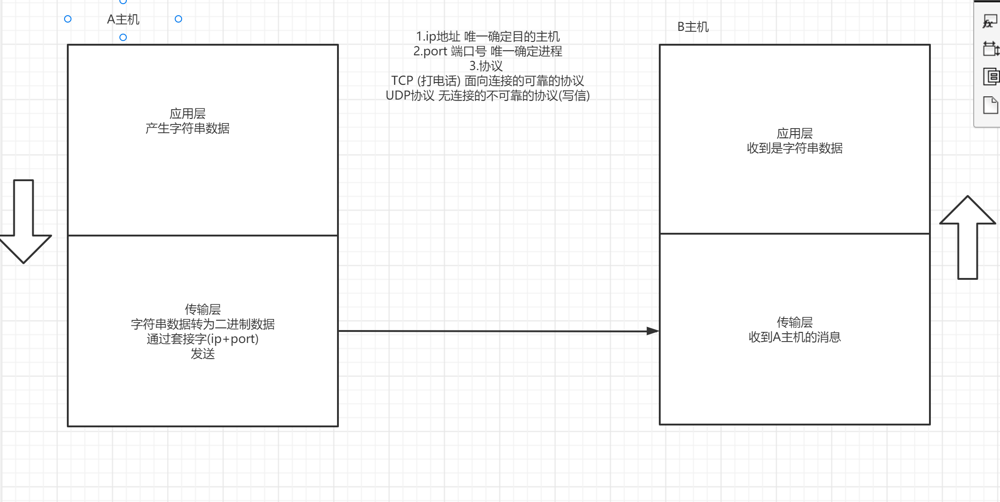
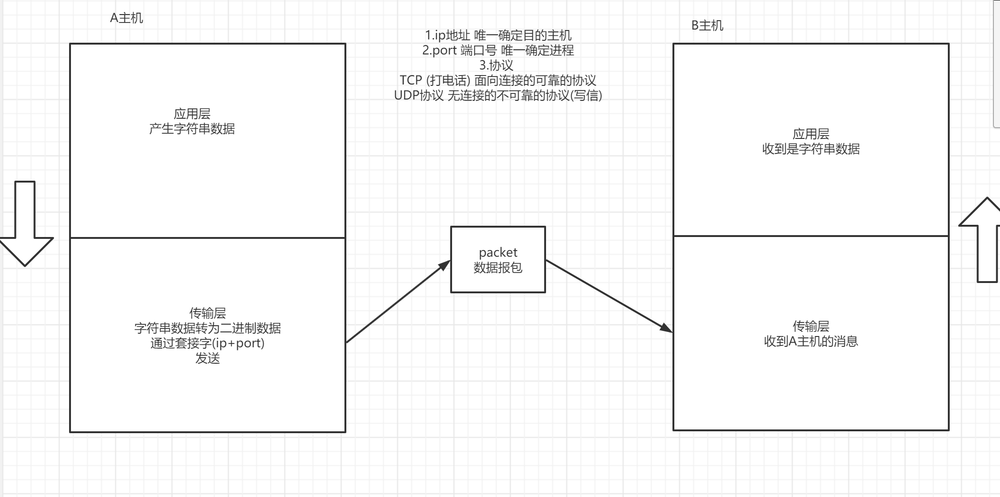
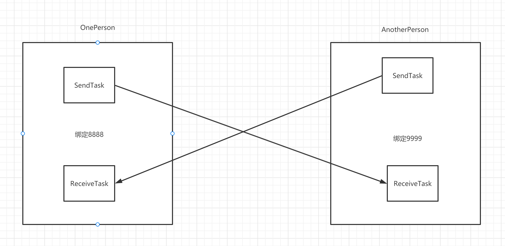
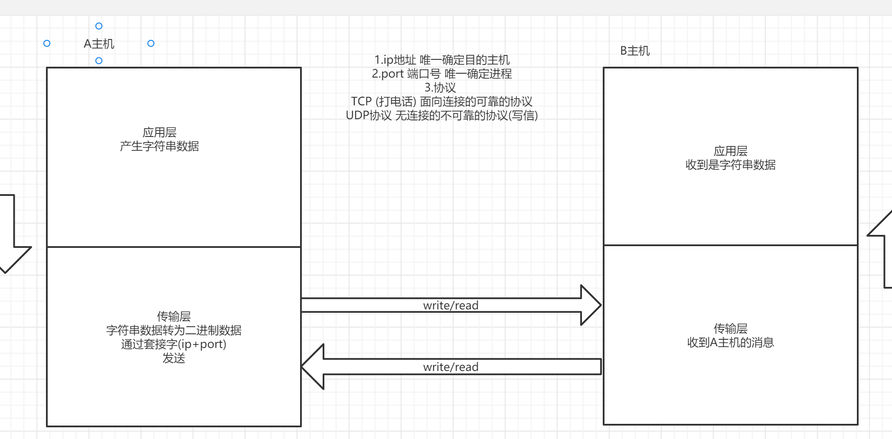
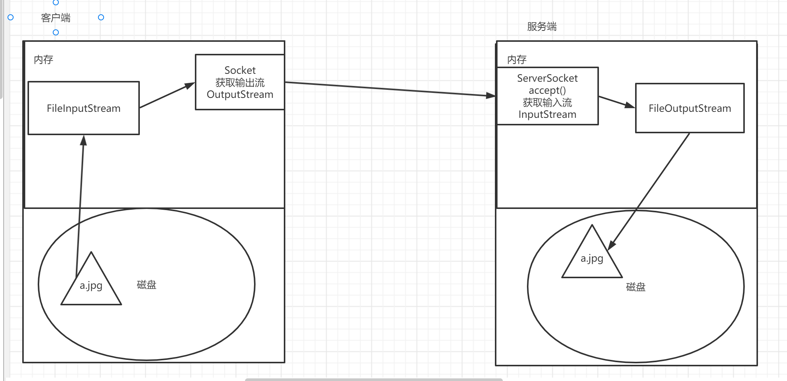

学习目标:

- 掌握UDP编程
- 掌握TCP编程


最好掌握TCP.

在工作过程中的作用： 因为我们工作过程中，所有的东西都是依赖于网络传输的。 比如我们写得代码要对外提供服务，都是通过网络。所以建议大家要掌握思想，网络的代码其实不用怎么写，但是如果你不清楚思想。 后续的流程很难捋动。

<span style=color:yellow;background:red>**一定要理解思想。 **</span>

# 基本原理




我们通过ip和端口来找到对应的一台主机，找到主机上的应用程序。 

<span style=color:red;background:yellow>**ip是什么东西，端口是什么东西。 **</span>

协议： 传输的过程中。有两种协议。 udp是不可靠的传输协议（写信），tcp是可靠的传输协议（）

# UDP编程

## 传输原理



## 发送端步骤

1. 创建发送端的socket对象
2. 把要发送的数据封装成数据报包
3. send方法发送数据报包
4. 释放资源close

## 接收端步骤

1. 创建接收端的socket对象
2. 创建用于接收的数据报包
3. receive方法接收数据
4. 解析数据报包
5. 释放资源close

## DatagramSocket

此类表示用来发送和接收数据报包的套接字。

**构造方法**

DatagramSocket(int port)        创建数据报套接字并将其绑定到本地主机上的指定端口。监听这个端口。

**成员方法**

| void | receive(DatagramPacket p)        从此套接字接收数据报包。 |
| ---- | --------------------------------------------------------- |
| void | send(DatagramPacket p)        从此套接字发送数据报包。    |

## DatagramPacket

此类表示数据报包。

**构造方法**

用于发送的

```java
DatagramPacket(byte[] buf,  int offset, int length, InetAddress address, int port)        构造数据报包，用来将长度为 length 偏移量为 offset  的包发送到指定主机上的指定端口号
```

用于接收的

```java
DatagramPacket(byte[] buf,  int offset, int length)       构造  DatagramPacket，用来接收长度为 length 的包，在缓冲区中指定了偏移量。
```

**成员方法**

| byte[] | getData()        返回数据缓冲区。                       |
| ------ | ------------------------------------------------------- |
| int    | getLength()        返回将要发送或接收到的数据的长度。   |
| int    | getOffset()        返回将要发送或接收到的数据的偏移量。 |

## 案例

### v1 发送端发送消息,接收端接收并打印

```java
package _22network.com.cskaoyan.udp.v1;

import java.io.IOException;
import java.net.DatagramPacket;
import java.net.DatagramSocket;

/**
 * @description: 接收端
 * @author: 景天
 * @date: 2022/10/21 15:50
 **/

public class Receiver {
    public static void main(String[] args) throws IOException {
        // - 创建接收端的socket对象
        DatagramSocket datagramSocket = new DatagramSocket(9999);
        //- 创建用于接收的数据报包
        byte[] bytes = new byte[1024];
        // DatagramPacket(byte[] buf,  int offset, int length)
        // 构造  DatagramPacket，用来接收长度为 length 的包，在缓冲区中指定了偏移量。
        DatagramPacket receivePacket = new DatagramPacket(bytes, 0, bytes.length);

        //- receive方法接收数据
        System.out.println("receive before");
        datagramSocket.receive(receivePacket);
        System.out.println("receive after");

        //- 解析数据报包
        // | byte[] | getData()        返回数据缓冲区。                       |
        //| int    | getLength()        返回将要发送或接收到的数据的长度。   |
        //| int    | getOffset()        返回将要发送或接收到的数据的偏移量。 |
        byte[] data = receivePacket.getData();
        int offset = receivePacket.getOffset();
        int length = receivePacket.getLength();
        String s = new String(data, offset, length);
        System.out.println("接收到了:" + s);

        //- 释放资源close
        datagramSocket.close();
    }
}

package _22network.com.cskaoyan.udp.v1;

import java.io.IOException;
import java.net.DatagramPacket;
import java.net.DatagramSocket;
import java.net.InetAddress;

/**
 * @description: 发送端
 * @author: 景天
 * @date: 2022/10/21 15:50
 **/
/*
v1 发送端发送消息,接收端接收并打印
 */
public class Sender {
    public static void main(String[] args) throws IOException {
        // - 创建发送端的socket对象
        //DatagramSocket(int port)
        // 创建数据报套接字并将其绑定到本地主机上的指定端口。
        DatagramSocket datagramSocket = new DatagramSocket(8888);

        //- 把要发送的数据封装成数据报包
        String s = "hello udp";
        byte[] bytes = s.getBytes();
        InetAddress targetIP = InetAddress.getByName("127.0.0.1");
        int port = 9999;

        // DatagramPacket(byte[] buf,  int offset, int length, InetAddress address, int port)
        // 构造数据报包，用来将长度为 length 偏移量为 offset  的包发送到指定主机上的指定端口号
        DatagramPacket sendPacket =
                new DatagramPacket(bytes, 0, bytes.length, targetIP, port);

        //- send方法发送数据报包
        datagramSocket.send(sendPacket);
        //- 释放资源close
        datagramSocket.close();
    }
}

```


### v2 使用工具类优化v1

```java
package utils;

import java.net.DatagramPacket;
import java.net.InetAddress;
import java.net.UnknownHostException;

/**
 * @description:
 * @author: 景天
 * @date: 2022/10/21 16:02
 **/

public class NetworkUtils {
    // 用于获取发送的数据报包
    public static DatagramPacket getSendPacket(String msg,String ip,int port) throws UnknownHostException {
        // 把数据封装成包
        byte[] bytes = msg.getBytes();
        InetAddress targetIP = InetAddress.getByName(ip);
        // 创建用于发送的数据报包
        DatagramPacket sendPacket =
                new DatagramPacket(bytes, 0, bytes.length, targetIP, port);
        //最终 return 装满了数据的一个包
        return sendPacket;
    }


    // 用于获取接收的数据报包
    public static DatagramPacket getReceivePacket() {
        byte[] bytes = new byte[1024];
        DatagramPacket receivePacket = new DatagramPacket(bytes, 0, bytes.length);
        // return 一个空的数据报包
        return receivePacket;
    }


    // 用于解析数据报包的方法
    public static String parseMsg(DatagramPacket receivePacket) {
        byte[] data = receivePacket.getData();
        int offset = receivePacket.getOffset();
        int length = receivePacket.getLength();

        String s = new String(data, offset, length);
        // 最终返回包里的数据 String
        return s;
    }
}

```


### v3 发送端接收端相互发送

```java
package _22network.com.cskaoyan.udp.v3;

import utils.NetworkUtils;

import java.io.IOException;
import java.net.DatagramPacket;
import java.net.DatagramSocket;
import java.util.Scanner;

/**
 * @description:
 * @author: 景天
 * @date: 2022/10/21 16:26
 **/

public class Receiver {
    public static void main(String[] args) throws IOException {
        // 创建接收端的socket对象
        DatagramSocket datagramSocket = new DatagramSocket(9999);
        // 创建Scanner对象
        Scanner scanner = new Scanner(System.in);
        // while
        while (true) {
            // 接收逻辑
            // 创建用于接收的数据报包
            DatagramPacket receivePacket = NetworkUtils.getReceivePacket();
            // receive
            datagramSocket.receive(receivePacket);
            //解析
            String msg = NetworkUtils.parseMsg(receivePacket);
            // 打印
            System.out.println("接收到了来自:"+receivePacket.getSocketAddress()+
                    "的消息: " +msg);

            // 发送逻辑
            // 接收键盘数据
            String s = scanner.nextLine();
            // 把要发送的数据封装成数据报包
            DatagramPacket sendPacket =
                    NetworkUtils.getSendPacket(s, "127.0.0.1", 8888);
            // send
            datagramSocket.send(sendPacket);
        }

    }
}


package _22network.com.cskaoyan.udp.v3;

import utils.NetworkUtils;

import java.io.IOException;
import java.net.DatagramPacket;
import java.net.DatagramSocket;
import java.util.Scanner;

/**
 * @description: 发送端
 * @author: 景天
 * @date: 2022/10/21 16:20
 **/
/*
v3 发送端接收端相互发送
 */
public class Sender {
    public static void main(String[] args) throws IOException {
        // 创建发送端的socket对象
        DatagramSocket datagramSocket = new DatagramSocket(8888);
        // 创建scanner对象
        Scanner scanner = new Scanner(System.in);
        // while循环
        while (true) {
            // 发送逻辑
            // 先接收键盘数据
            String s = scanner.nextLine();
            // 把要发送的数据封装成数据报包
            DatagramPacket sendPacket =
                    NetworkUtils.getSendPacket(s, "127.0.0.1", 9999);
            // send
            datagramSocket.send(sendPacket);

            // 接收逻辑
            // 创建用于接收的数据报包
            DatagramPacket receivePacket = NetworkUtils.getReceivePacket();
            // receive接收
            datagramSocket.receive(receivePacket);
            // 解析
            String msg = NetworkUtils.parseMsg(receivePacket);
            // 打印
            System.out.println("接收到了来自:"+receivePacket.getSocketAddress()+
                    "的消息: " +msg);

        }

    }
}
```


### v4 使用多线程优化v3



思路:

定义发送任务 SendTask 专门用来发送消息

定义成员变量

DatagramSocket datagramSocket;

String ip;

int port;

定义接收任务 receiveTask  专门用来接收消息

定义成员变量

DatagramSocket datagramSocket;


OnePerson:

创建用于发送的线程

创建用于接收的线程


AnotherPerson:

创建用于发送的线程

创建用于接收的线程


```java
package _22network.com.cskaoyan.udp.v4;

import utils.NetworkUtils;

import java.io.IOException;
import java.net.DatagramPacket;
import java.net.DatagramSocket;

/**
 * @description: 接收任务
 * @author: 景天
 * @date: 2022/10/21 16:49
 **/

public class ReceiveTask implements Runnable {
    // 定义成员变量
    DatagramSocket datagramSocket;

    public ReceiveTask(DatagramSocket datagramSocket) {
        this.datagramSocket = datagramSocket;
    }

    @Override
    public void run() {
        // 只接收消息
        while (true) {
            // 创建用于接收的数据报包
            DatagramPacket receivePacket = NetworkUtils.getReceivePacket();
            // receive接收
            try {
                datagramSocket.receive(receivePacket);
                // 解析
                String msg = NetworkUtils.parseMsg(receivePacket);
                // 打印
                System.out.println("接收到了来自:"+receivePacket.getSocketAddress()+
                        "的消息: " + msg);
            } catch (IOException e) {
                e.printStackTrace();
            }
        }
    }
}


package _22network.com.cskaoyan.udp.v4;

import utils.NetworkUtils;

import java.io.IOException;
import java.net.DatagramPacket;
import java.net.DatagramSocket;
import java.net.UnknownHostException;
import java.util.Scanner;

/**
 * @description: 发送任务
 * @author: 景天
 * @date: 2022/10/21 16:45
 **/

public class SendTask implements Runnable{
    // 定义成员变量
    DatagramSocket datagramSocket;

    String ip;

    int port;

    public SendTask(DatagramSocket datagramSocket, String ip, int port) {
        this.datagramSocket = datagramSocket;
        this.ip = ip;
        this.port = port;
    }

    @Override
    public void run() {
        // 只发送消息
        // 创建Scanner对象
        Scanner scanner = new Scanner(System.in);
        while (true) {
            // 键盘接收数据
            String s = scanner.nextLine();
            // 封装成数据报包
            try {
                DatagramPacket sendPacket = NetworkUtils.getSendPacket(s, ip, port);
                // send
                datagramSocket.send(sendPacket);
            } catch (UnknownHostException e) {
                e.printStackTrace();
            } catch (IOException e) {
                e.printStackTrace();
            }
        }
    }
}


package _22network.com.cskaoyan.udp.v4;

import java.net.DatagramSocket;

/**
 * @description:
 * @author: 景天
 * @date: 2022/10/21 16:52
 **/

public class OnePerson {
    public static void main(String[] args) throws Exception{
        DatagramSocket datagramSocket = new DatagramSocket(8888);
        // 创建用于发送的线程
        //创建用于接收的线程
        // start
        new Thread(new SendTask(datagramSocket, "127.0.0.1", 9999)).start();
        new Thread(new ReceiveTask(datagramSocket)).start();
    }
}


package _22network.com.cskaoyan.udp.v4;

import java.net.DatagramSocket;

/**
 * @description:
 * @author: 景天
 * @date: 2022/10/21 16:52
 **/

public class AnotherPerson {
    public static void main(String[] args) throws Exception{
        DatagramSocket datagramSocket = new DatagramSocket(9999);
        // 创建用于发送的线程
        //创建用于接收的线程
        // start
        new Thread(new SendTask(datagramSocket, "127.0.0.1", 8888)).start();
        new Thread(new ReceiveTask(datagramSocket)).start();
    }
}

```

# TCP编程

## 传输原理



## 客户端步骤(Client)

1. 创建客户端Socket对象
2. 从socket中获取输入输出流
3. 利用输出输出流进行读写操作
4. 释放资源close

## 服务端步骤(Server)

1. 创建服务端的socket对象(ServerSocket)
2. 通过accept建立连接, 得到socket对象
3. 从socket中得到输入输出流
4. 利用输入输出流进行读写操作
5. 释放资源

## Socket

此类实现客户端套接字

**构造方法**

Socket(String host,  int port)       创建一个流套接字并将其连接到指定主机上的指定端口号。

**成员方法**

| InputStream  | getInputStream()        返回此套接字的输入流。 |
| ------------ | ---------------------------------------------- |
| OutputStream | getOutputStream()   返回此套接字的输出流。     |

| void | shutdownOutput()        禁用此套接字的输出流。 |
| ---- | ---------------------------------------------- |
|      | Socket半关闭                                   |

## ServerSocket

此类实现服务器套接字

**构造方法**

ServerSocket(int port)        创建绑定到特定端口的服务器套接字。

**成员方法**

| Socket | accept()        侦听并接受到此套接字的连接。 |
| ------ | -------------------------------------------- |
|        |                                              |


## 案例

### v1 客户端发送消息,服务端接收并打印

```java
package _22network.com.cskaoyan.tcp.v1;

import java.io.OutputStream;
import java.net.Socket;

/**
 * @description: 客户端
 * @author: 景天
 * @date: 2022/10/21 17:31
 **/
/*
v1 客户端发送消息,服务端接收并打印
 */
public class Client {
    public static void main(String[] args) throws Exception{
        //- 创建客户端Socket对象
        // Socket(String host,  int port)
        // 创建一个流套接字并将其连接到指定主机上的指定端口号。
        Socket socket = new Socket("127.0.0.1", 12306);

        //- 从socket中获取输入输出流
        // getOutputStream()   返回此套接字的输出流。
        OutputStream out = socket.getOutputStream();
        //- 利用输出输出流进行读写操作
        out.write("hello tcp".getBytes());
        //- 释放资源close
        out.close();
    }
}


package _22network.com.cskaoyan.tcp.v1;

import java.io.InputStream;
import java.net.ServerSocket;
import java.net.Socket;

/**
 * @description: 服务端
 * @author: 景天
 * @date: 2022/10/21 17:31
 **/

public class Server {
    public static void main(String[] args) throws Exception{
        // - 创建服务端的socket对象(ServerSocket)
        // ServerSocket(int port)
        // 创建绑定到特定端口的服务器套接字。
        ServerSocket serverSocket = new ServerSocket(12306);

        //- 通过accept建立连接, 得到socket对象
        System.out.println("accept before");
        Socket socket = serverSocket.accept();
        System.out.println("accept after");

        //- 从socket中得到输入输出流
        // getInputStream()        返回此套接字的输入流。
        InputStream in = socket.getInputStream();
        //- 利用输入输出流进行读写操作
        byte[] bytes = new byte[1024];
        int readCount = in.read(bytes);
        String s = new String(bytes, 0, readCount);
        System.out.println(s);
        //- 释放资源
        socket.close();
        serverSocket.close();
    }
}

```


### v2 多个客户端发送,服务端接收(多线程处理)

```java
package _22network.com.cskaoyan.tcp.v2;

import java.io.OutputStream;
import java.net.Socket;
import java.util.Scanner;

/**
 * @description: 客户端
 * @author: 景天
 * @date: 2022/10/21 17:43
 **/
/*
v2 多个客户端发送,服务端接收(多线程处理)
 */
public class Client {
    public static void main(String[] args) throws Exception{
        // 创建客户端socket对象
        Socket socket = new Socket("127.0.0.1", 8888);
        Scanner scanner = new Scanner(System.in);
        // 循环
        while (true) {
            // 键盘接收数据
            String s = scanner.nextLine();
            // 从socket中获取输出流
            OutputStream out = socket.getOutputStream();
            // write
            out.write(s.getBytes());

        }
    }
}


package _22network.com.cskaoyan.tcp.v2;

import java.io.IOException;
import java.io.InputStream;
import java.net.ServerSocket;
import java.net.Socket;
import java.util.concurrent.ExecutorService;
import java.util.concurrent.Executors;

/**
 * @description: 服务端
 * @author: 景天
 * @date: 2022/10/21 17:43
 **/

public class Server {
    public static void main(String[] args) throws Exception{
        // 创建服务端socket对象
        ServerSocket serverSocket = new ServerSocket(8888);
        // 创建线程池
        ExecutorService pool = Executors.newFixedThreadPool(2);
        // 循环
        while (true) {
            // accept方法建立连接
            Socket socket = serverSocket.accept();
            //new Thread(new ConnectTask(socket)).start();
            // 提交任务
            pool.submit(new ConnectTask(socket));
        }
    }
}

class ConnectTask implements Runnable{
    // 定义成员变量
    Socket socket;

    public ConnectTask(Socket socket) {
        this.socket = socket;
    }

    @Override
    public void run() {
        while (true) {
            // 得到socket对象
            // 从socket中获取输入流
            try {
                InputStream in = socket.getInputStream();
                // read
                byte[] bytes = new byte[1024];
                int readCount = in.read(bytes);
                // 打印
                String s = new String(bytes, 0, readCount);
                System.out.println("接收到了来自" + Thread.currentThread().getName() +
                        socket.getInetAddress() + ":" + socket.getPort() + s);
            } catch (IOException e) {
                e.printStackTrace();
            }

        }
    }
}
```


### v3 客户端发送对象(序列化),服务端接收

```java
package _22network.com.cskaoyan.tcp.v3;

import java.io.ObjectOutputStream;
import java.io.OutputStream;
import java.net.Socket;

/**
 * @description:
 * @author: 景天
 * @date: 2022/10/22 9:46
 **/
/*
v3 客户端发送对象(序列化),服务端接收
 */
public class Client {
    public static void main(String[] args) throws Exception{
        // 创建客户端的socket对象
        Socket socket = new Socket("127.0.0.1", 11111);
        // 创建学生对象
        Student student = new Student("张三", 20);
        // 获取输出流 OutputStream
        OutputStream outputStream = socket.getOutputStream();
        // 创建序列化流对象ObjectOutputStream
        ObjectOutputStream out = new ObjectOutputStream(outputStream);
        // writeObject()
        out.writeObject(student);
        // 释放资源close
        out.close();
        socket.close();

    }
}


package _22network.com.cskaoyan.tcp.v3;

import java.io.InputStream;
import java.io.ObjectInputStream;
import java.net.ServerSocket;
import java.net.Socket;

/**
 * @description:
 * @author: 景天
 * @date: 2022/10/22 9:46
 **/

public class Server {
    public static void main(String[] args) throws Exception{
        // 创建服务端的socket对象
        ServerSocket serverSocket = new ServerSocket(11111);
        // accept建立练级 得到socket对象
        Socket socket = serverSocket.accept();
        // 从socket中获取输入流InputStream
        InputStream inputStream = socket.getInputStream();
        // 创建反序列化流对象ObjectInputStream
        ObjectInputStream in = new ObjectInputStream(inputStream);
        // readObject()
        Student student = (Student) in.readObject();
        // 打印
        System.out.println(student);
        // close
        socket.close();
        serverSocket.close();
    }
}


package _22network.com.cskaoyan.tcp.v3;

import java.io.Serializable;

/**
 * @description:
 * @author: 景天
 * @date: 2022/10/22 9:47
 **/

public class Student implements Serializable {

    private static final long serialVersionUID = -1049823664553329306L;
    String name;
    int age;

    public Student(String name, int age) {
        this.name = name;
        this.age = age;
    }

    @Override
    public String toString() {
        return "Student{" +
                "name='" + name + '\'' +
                ", age=" + age +
                '}';
    }
}

```


### v4 客户端上传文件到服务端

思路:



```java
package _22network.com.cskaoyan.tcp.v4;

import java.io.FileInputStream;
import java.io.InputStream;
import java.io.OutputStream;
import java.net.Socket;

/**
 * @description:
 * @author: 景天
 * @date: 2022/10/22 10:07
 **/
/*
客户端上传文件到服务器
 */
public class Client {
    public static void main(String[] args) throws Exception{
        // 创建客户端的socket对象
        Socket socket = new Socket("127.0.0.1", 8888);
        // 创建自己的输入流对象
        FileInputStream in = new FileInputStream("D:\\a.jpg");
        //FileInputStream in = new FileInputStream("D:\\b.txt");
        // 从socket中获取输出流
        OutputStream out = socket.getOutputStream();

        // 边读边写
        byte[] bytes = new byte[1024];
        int readCount;
        while ((readCount = in.read(bytes)) != -1) {
            out.write(bytes,0,readCount);
        }
        System.out.println("while end");
        //  void shutdownOutput()
        // 禁用此套接字的输出流。
        socket.shutdownOutput();

        // 循环结束 文件上传完成
        // 接收来自服务端的反馈消息
        // 从socket获取输入流
        InputStream in2 = socket.getInputStream();
        byte[] bytes1 = new byte[1024];
        System.out.println("read before");
        int readCount2 = in2.read(bytes1);
        System.out.println("read after");
        System.out.println(new String(bytes1,0,readCount2));

        // close
        in.close();
        socket.close();
    }
}


package _22network.com.cskaoyan.tcp.v4;

import java.io.FileOutputStream;
import java.io.InputStream;
import java.io.OutputStream;
import java.net.ServerSocket;
import java.net.Socket;

/**
 * @description:
 * @author: 景天
 * @date: 2022/10/22 10:07
 **/

public class Server {
    public static void main(String[] args) throws Exception{
        // 创建服务端的socket对象
        ServerSocket serverSocket = new ServerSocket(8888);
        // 创建自己的输出流对象
        FileOutputStream out = new FileOutputStream("server_a.jpg");
        //FileOutputStream out = new FileOutputStream("server_a.txt");

        // accept建立连接 得到socket对象
        Socket socket = serverSocket.accept();

        // 从socket中获取输入流
        InputStream in = socket.getInputStream();

        // 边读边写
        int readCount;
        byte[] bytes = new byte[1024];
        while ((readCount = in.read(bytes)) != -1) {
            out.write(bytes,0,readCount);
        }
        System.out.println("while end");
        // 循环结束 保存完成
        // 从socket中获取输出流
        // 给客户端一个反馈消息
        OutputStream out2 = socket.getOutputStream();
        out2.write("文件已经上传成功".getBytes());

        // close
        out.close();
        socket.close();
        serverSocket.close();

    }
}
```


**异常**

- java.net.ConnectException: Connection refused   先启动了Client会造成这个异常
- java.net.BindException: Address already in use: JVM_Bind   端口号被占用(换个端口)


一定要知道网络编程的基本步骤。  要知道怎么写TCP代码。 