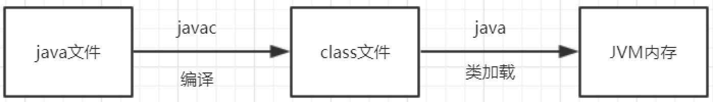
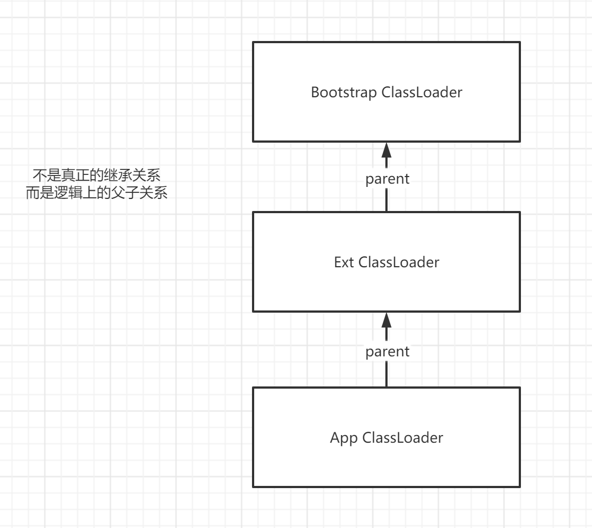
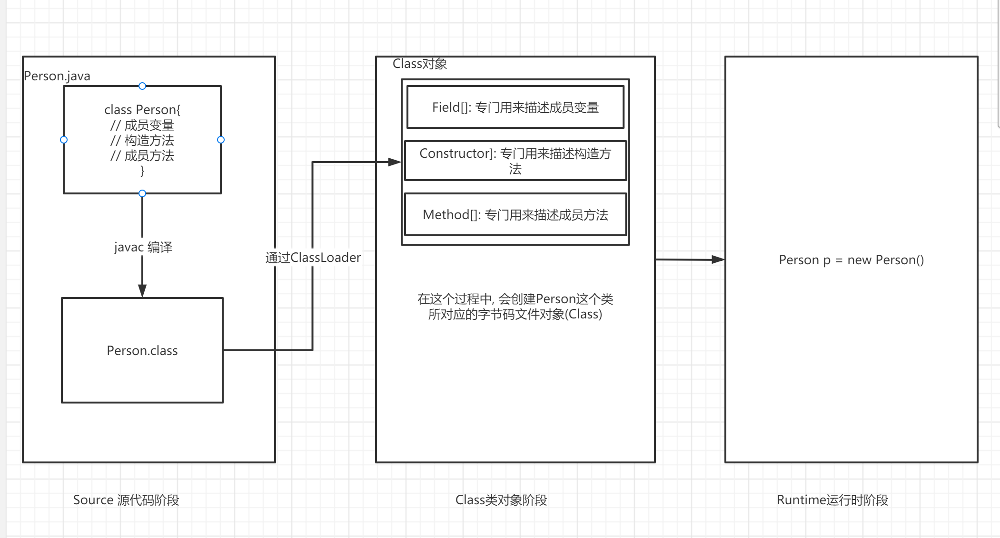
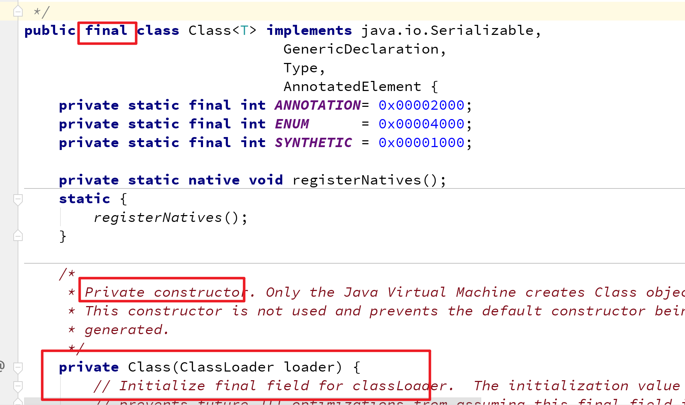
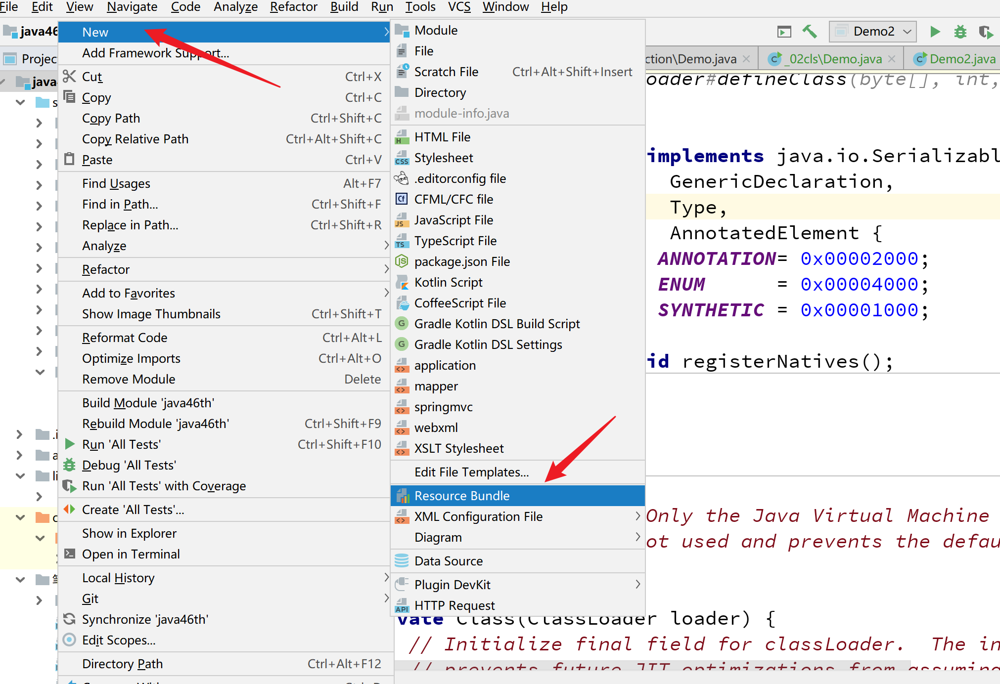
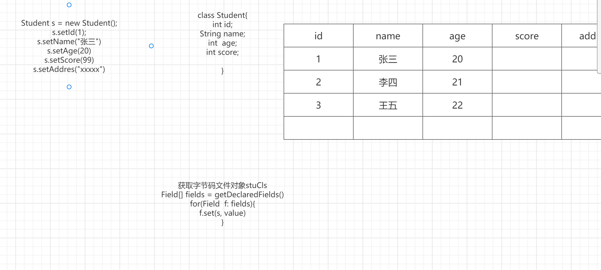

学习目标:

- 熟悉类加载过程与类加载器
- 熟练掌握类加载时机
- 掌握如何获取字节码文件对象
- 掌握使用配置文件（掌握加载配置文件的方式。 ）
- 掌握Constructor,Field,Method使用
- 了解自定义类加载器与双亲委派模型(有能力的同学掌握)


反射在工作过程中的作用： 1.面试。 2.获取配置文件。 3.动态获取类的信息。 

```JAVA
比如，现在让你创建一个Student。 
    
   new Student();

告诉你一个字符串，你给我创建出来它的对象。    "com.cskaoyan.bean.Student"
    
    Student 
```

# 类加载

之前学的



## 过程

- 加载

  - 通过类加载器(ClassLoader)加载.class文件,读取到内存
  - 在这个过程中,生成这个类所对应的字节码文件对象(java.lang.Class)

- 链接

  - 验证: 对字节码文件格式的验证

  - 准备: 给类的静态成员分配内存并赋予默认初始值

    - ```java
      static int a =10;
      ```

  - 解析: 把符号引(用一组符号来描述被引用的目标)用转化为直接引用(真实的地址)

  - ```
    class Student{
     String name;
     int age;
     Subject subject;
     
    }
    
    class Subject{
    	String name;
    }
    ```
  
- 初始化

  - 给静态成员赋真实的值, 并且执行静态代码块中的内容

## 类加载器

### 分类

Bootstrap ClassLoader 根类加载器
负责Java运行时核心类的加载，JDK中JRE的lib目录下rt.jar

Extension ClassLoader 扩展类加载器
负责JRE的扩展目录中jar包的加载，在JDK中JRE的lib目录下ext目录

Sysetm(App) ClassLoader 系统类加载器/应用加载器
 负责加载自己定义的Java类   

不同的Jar，是由不同的类加载器加载进来的。 


```java
/**
 * @author Common-zhou
 * @since 2023-11-09 21:24
 */
public class Demo1 {
    public static void main(String[] args) {
        // 查看类加载器
        // 系统类加载器
        ClassLoader systemClassLoader = ClassLoader.getSystemClassLoader();
        System.out.println(systemClassLoader);

        // 扩展类加载器
        ClassLoader parent = systemClassLoader.getParent();
        System.out.println(parent);

        // 跟类加载器 null 不是Java写的
        ClassLoader parent1 = parent.getParent();
        System.out.println(parent1);

        // 看一下加载路径
        System.out.println(System.getProperty("java.class.path").replace(";", System.lineSeparator()));

        System.out.println("-------------------");
        System.out.println(System.getProperty("java.ext.dirs").replace(";", System.lineSeparator()));

    }
}
```


### 双亲委派模型




双亲委派模型，就是对一些类要加载。我现在自己不加载，我让父亲加载。 

有什么好处。 比如有一天，你写了核心类。  System.

Student.

保证了一些核心类的安全，不能我们自己定义了一些同名同包类，就直接用了这个。这时候JVM会出现不可预见的问题。 

## 类加载时机

创建类的实例(首次创建该类对象)

访问类的静态变量(首次)

调用类的静态方法(首次)

加载某个类的子类，会先触发父类的加载

直接使用java.exe命令来运行某个主类，也就是执行了某个类的main()方法

**使用反射方式来强制创建某个类或接口对应的java.lang.Class对象**

# Java代码的3个阶段



# 反射

## 什么是反射

获取运行时类信息的一种手段

反射的起点是字节码文件对象。

比如我运行的时候，不知道我要创建一个什么类，但是我知道我需要创建一个类。 

或者根据我传入的字符串来创建这个类。比如传入了一个 `java.lang.String`。则创建一个String。


排序。  Comparable  Comparator .比如现在你是个后端，然后前端给你信息，让你获取学生列表。 

获取湖北的，年龄大于18的。    ===》 能拿到一个数组。

能不能帮我排个序。 排序的字段不确定，我给你传name，就按name，我给你传id，你就按id。

也可以通过反射。   可以硬编码，但是最好通过反射。 

## 获取字节码文件对象的几种方式

- 对象.getClass()
- 类名.class
- Class.forName(String className)  全限定名
- ClassLoader里的loadClass(String className)

**注意:**

无论通过什么方式获取的字节码文件对象 都是同一个

Demo

```java

/**
 * 获取字节码文件对象的几种方式
 *
 * @author Common-zhou
 * @since 2023-11-09 21:42
 */
public class Demo1 {
    public static void main(String[] args) throws ClassNotFoundException {

        // 方式一：对象.getClass()
        A a = new A();
        Class<? extends A> c1 = a.getClass();

        // 方式二： 类名.class
        Class<A> c2 = A.class;

        // 拿到的所有Class对象，都是一个
        System.out.println(c1 == c2);

        // 方式三： Class.forName(全限定名)
        Class<?> c3 = Class.forName("com.cskaoyan.day23_reflect._02cls.A");
        System.out.println(c1 == c3);

        // 方式四： ClassLoader.loadClass(String className)
        ClassLoader systemClassLoader = ClassLoader.getSystemClassLoader();
        Class<?> c4 = systemClassLoader.loadClass("com.cskaoyan.day23_reflect._02cls.A");
        System.out.println(c1 == c4);

    }
}

class A {
}
```


注意

```java
/**
 * @author Common-zhou
 * @since 2023-11-09 21:55
 */
public class Demo2 {
    public static void main(String[] args) throws ClassNotFoundException {
        // 直接使用 类名.class不会执行静态代码块
        Class<B> b1 = B.class;

        System.out.println("===================");

        // 使用Class.forName() 会执行静态代码块
        Class<?> b2 = Class.forName("com.cskaoyan.day23_reflect._02cls.B");
    }
}

class B {
    static {
        System.out.println("B的静态方法");
    }
}
```

## 关于Class

`Class` 类的实例表示正在运行的 Java 应用程序中的类和接口

`Class` 没有公共构造方法。`Class` 对象是在加载类时由 Java 虚拟机以及通过调用类加载器中的  `defineClass` 方法自动构造的。 


Class我们在程序中能不能创建。 不能自己创建。 



## 通过反射获取构造方法(Constructor)

**通过反射获取所有构造方法**

```java
// 通过class对象，获得构造器数组。 
// getConstructors()返回public的构造方法；  getDeclaredConstructors()返回所有的构造方法。
Constructor[] getConstructors()
Constructor[] getDeclaredConstructors() 
    
// 通过构造方法的参数，返回构造器数组。
```

**获取指定构造方法**

```java
// 就是我告诉它构造方法的参数，然后它告诉我构造方法。
Constructor<T> getConstructor(Class<?>... parameterTypes)
Constructor<T> getDeclaredConstructor(Class<?>... parameterTypes)
```

使用Constructor创建对象

```java 
Person p = new Person("zs",20,true)
newInstance(参数列表)
```

暴力破解

```java
// 有一些是私有化构造方法，无法直接调用。可以设置了setAccessible之后，再调用newInstance();
setAccessible(true) 
```

```java
package com.cskaoyan.day23_reflect._02cls;

import org.junit.Test;

import java.lang.reflect.Constructor;
import java.lang.reflect.InvocationTargetException;

/**
 * @author Common-zhou
 * @since 2023-11-12 14:07
 */
public class Demo4Constructor {

    @Test
    public void testGetConstructorsNoParameter() {
        // getConstructors()返回public的构造方法；  getDeclaredConstructors()返回所有的构造方法。
        // Constructor[] getConstructors(): 获取public的构造方法。
        // Constructor[] getDeclaredConstructors()： 获取所有定义的构造方法
        Class<Student> studentClass = Student.class;

        // 获取所有声明的public构造方法
        Constructor<?>[] constructors = studentClass.getConstructors();

        System.out.println("所有public声明的构造方法：");
        for (Constructor<?> constructor : constructors) {
            System.out.println(constructor);
        }

        Constructor<?>[] declaredConstructors = studentClass.getDeclaredConstructors();
        System.out.println("所有声明的构造方法：");
        for (Constructor<?> declaredConstructor : declaredConstructors) {
            System.out.println(declaredConstructor);
        }
    }


    @Test
    public void testGetConstructorsWithParameter() throws NoSuchMethodException {
        Class<Student> studentClass = Student.class;
        // 获取一个构造方法的入参是String的。
        Constructor<Student> constructor = studentClass.getConstructor(String.class);
        System.out.println(constructor);

        Constructor<Student> declaredConstructor = studentClass.getDeclaredConstructor(Integer.class, String.class);
        System.out.println(declaredConstructor);

    }

    @Test
    public void testUseConstructor() throws NoSuchMethodException, InvocationTargetException, InstantiationException, IllegalAccessException {
        // 1. Constructor可以帮助我们创建一个对象；
        Class<Student> studentClass = Student.class;

        Constructor<Student> constructor = studentClass.getConstructor(String.class);
        System.out.println(constructor);

        // 1) 拿到Constructor之后，可以通过  newInstance方法。新建一个对象
        Student student1 = constructor.newInstance("zhangsan");
        System.out.println(student1);

        // 2) 如果拿到的是private的构造方法。则无法newInstance
        Constructor<Student> privateConstructor = studentClass.getDeclaredConstructor(Integer.class, String.class);

        // can not access a member of class com.cskaoyan.day23_reflect._02cls.Student with modifiers "private"
        // Student student2 = privateConstructor.newInstance(10, "zhangsan");
        // System.out.println(student2);

        // 3) 可以通过setAccessible强制将其设置为可访问的。

        privateConstructor.setAccessible(true);
        Student student2 = privateConstructor.newInstance(10, "zhangsan");
        System.out.println(student2);

    }

}

class Student {
    String name;
    Integer age;
    String address;

    public Student() {
    }

    public Student(String name) {
        this.name = name;
    }

    Student(int age) {
        this.age = age;
    }

    public Student(String name, Integer age) {
        this.name = name;
        this.age = age;
    }

    private Student(Integer age, String address) {
        this.age = age;
        this.address = address;
    }

    protected Student(String name, Integer age, String address) {
        this.name = name;
        this.age = age;
        this.address = address;
    }

    @Override
    public String toString() {
        return "Student{" + "name='" + name + '\'' + ", age=" + age + ", address='" + address + '\'' + '}';
    }
}

```

## 通过反射获取成员变量(Field)

**通过反射获取所有成员变量**

```java
// 获得所有public的成员变量。  
Field[] getFields()
// 获得所有的成员变量。   
Field[] getDeclaredFields()
```

**获取指定成员变量**

```
Field getField(String name)
Field getDeclaredField(String name)
```

**通过Field读写对象的成员变量(可暴力破解)**

```java
Object get(Object obj)：获取值，传入对象
void set(Object obj, Object value)：赋值，传入对象
```

```java
package com.cskaoyan.day23_reflect._02cls;

import org.junit.Test;

import java.lang.reflect.Field;

/**
 * @author Common-zhou
 * @since 2023-11-12 15:31
 */
public class Demo5Field {
    @Test
    public void testGetField() {
        Class<Student1> studentClass = Student1.class;
        System.out.println("================所有的public field");
        // Field[] getFields()： 获取public的Field
        Field[] publicFields = studentClass.getFields();
        for (Field field : publicFields) {
            System.out.println(field);
        }

        System.out.println("================所有的field:");
        //Field[] getDeclaredFields()： 获取所有的Field
        Field[] allFields = studentClass.getDeclaredFields();
        for (Field allField : allFields) {
            System.out.println(allField);
        }
    }

    @Test
    public void testGetFieldWithParameter() throws NoSuchFieldException {
        Class<Student1> student1Class = Student1.class;

        // 如果是public的。可以获取出来。  如果这个Field不是public的，拿不出来。
        Field field = student1Class.getField("age");
        System.out.println(field);

        Field nameField = student1Class.getDeclaredField("name");
        System.out.println(nameField);
    }

    @Test
    public void testUseField() throws NoSuchFieldException, IllegalAccessException {
        // 1.获取出来Field之后。它只是一个属性，如果需要对一个对象的属性进行设置。
        // 还需要一个对象

        Class<Student1> student1Class = Student1.class;
        Field ageField = student1Class.getField("age");

        Student1 student1 = new Student1();

        // 1）set(Object obj, Object value)：对哪个对象设置。 value是设置的值
        ageField.set(student1, 10);
        System.out.println(student1);

        // 2）name是private的。使用 getField获取不出来。会报错
        Field nameField = student1Class.getDeclaredField("name");
        // 如果不调用这个方法，直接使用 set。 会报错。 因为private无法直接设置
        nameField.setAccessible(true);
        nameField.set(student1, "zhangsan");
        System.out.println(student1);

        // 3) get(Object obj)： 获取属性的值。 需要传递，从哪个对象获取
        System.out.println(ageField.get(student1));
        System.out.println(nameField.get(student1));
    }
}

class Student1 {
    private String name;
    public Integer age;

    protected String address;
    String phone;

    @Override
    public String toString() {
        return "Student1{" +
                "name='" + name + '\'' +
                ", age=" + age +
                ", address='" + address + '\'' +
                ", phone='" + phone + '\'' +
                '}';
    }
}
```

## 通过反射获取成员方法(Method)

**获取所有成员方法**

```
Method[] getMethods()   // 父类的也能获取到
Method[] getDeclaredMethods()
```

**获取指定的成员方法**

```
Method getMethod(String name, Class<?>... parameterTypes)
Method getDeclaredMethod(String name, Class<?>... parameterTypes)
```

**利用Method调用对象的方法**

```java
Object invoke(Object obj, Object... args)
```

```java
package com.cskaoyan.day23_reflect._02cls;

import org.junit.Test;

import java.lang.reflect.InvocationTargetException;
import java.lang.reflect.Method;

/**
 * @author Common-zhou
 * @since 2023-11-12 16:04
 */
public class Demo6Method {
    @Test
    public void testGetMethods() {
        Class<Student2> student2Class = Student2.class;

        System.out.println("获取所有的public methods: ");
        // 获取public方法， 父类的也能获取到
        Method[] allPublicMethods = student2Class.getMethods();

        for (Method allPublicMethod : allPublicMethods) {
            System.out.println(allPublicMethod);
        }

        System.out.println("获取所有的methods: ");
        // 获取所有的方法
        Method[] allMethods = student2Class.getDeclaredMethods();

        for (Method allMethod : allMethods) {
            System.out.println(allMethod);
        }
    }

    @Test
    public void testGetMethodsWithParameter() throws NoSuchMethodException, InvocationTargetException, IllegalAccessException {
        Class<Student2> student2Class = Student2.class;

        Student2 student2 = new Student2();

        Method test1Method = student2Class.getMethod("test1");
        // 通过对象，调用这个方法
        test1Method.invoke(student2);

        Method test1Method2 = student2Class.getMethod("test1", String.class);
        test1Method2.invoke(student2, "测试传参");

        // 如果是private的方法
        Method test2Method1 = student2Class.getDeclaredMethod("test2", String.class);
        // 如果没有设置 Accessible。则会失败
        test2Method1.setAccessible(true);
        // Demo6Method can not access a member of class com.cskaoyan.day23_reflect._02cls.Student2 with modifiers "private"
        test2Method1.invoke(student2, "传参");

    }
}

class Student2 {
    public void test1() {
        System.out.println("public test1");
    }

    public void test1(String name) {
        System.out.println("public test1 with name:" + name);
    }

    private void test2() {
        System.out.println("private test2");
    }

    private void test2(String name) {
        System.out.println("private test2 with name: " + name);
    }

}
```

# 补充

## 其他API

可以通过Class直接实例化 , 但是要有一个无参构造方法

```java
package com.cskaoyan.day23_reflect._02cls;

/**
 * 可以直接通过 class文件，去实例化一个对象
 *
 * @author Common-zhou
 * @since 2023-11-12 17:16
 */
public class Demo7Other {
    public static void main(String[] args) throws InstantiationException, IllegalAccessException, ClassNotFoundException {
        Class<?> aClass = Class.forName("com.cskaoyan.day23_reflect._02cls.Student4");

        // 通过class对象直接实例化对象. 但是要有一个无参构造方法
        Object o = aClass.newInstance();
        System.out.println(o);

    }
}

class Student4 {

    String name;

    public Student4() {
    }

    public Student4(String name) {
        this.name = name;
    }
}
```


其他API

```java
package _23reflect.com.cskaoyan.bean;

/**
 * @description:
 * @author: 景天
 * @date: 2022/10/24 11:31
 **/

public class Person {
    // 定义成员变量
    public  String name;
    private int age;
    boolean gender;

    // 构造方法

    public Person(String name, int age, boolean gender) {
        this.name = name;
        this.age = age;
        this.gender = gender;
    }

    private Person(String name, int age) {
        this.name = name;
        this.age = age;
    }

    public Person() {
    }

    // 定义成员方法

    @Override
    public String toString() {
        return "Person{" +
                "name='" + name + '\'' +
                ", age=" + age +
                ", gender=" + gender +
                '}';
    }

    public String eat(){
        System.out.println("eat food!");
        return "吃了";
    }

    private void eat(String food){
        System.out.println("eat " + food);
    }
}


package _23reflect.com.cskaoyan._05add;

import java.lang.reflect.Field;
import java.lang.reflect.Method;
import java.lang.reflect.Modifier;

/**
 * @description:
 * @author: 景天
 * @date: 2022/10/24 14:57
 **/

public class OtherApi {
    public static void main(String[] args) throws Exception{
        // 获取字节码文件对象
        Class<?> c = Class.forName("_23reflect.com.cskaoyan.bean.Person");
        //Class<?> c = Class.forName("java.io.OutputStream");
        // 获取全限定类名
        System.out.println(c.getName());
        // 获取简单名称
        System.out.println("c.getSimpleName() = " + c.getSimpleName());
        // 获取父类
        Class<?> superclass = c.getSuperclass();
        System.out.println("superclass = " + superclass.getSimpleName());

        // 获取实现的接口
        Class<?>[] interfaces = c.getInterfaces();
        for (Class<?> i : interfaces) {
            System.out.println(i);
        }
        // 获取类加载器
        ClassLoader classLoader = c.getClassLoader();
        System.out.println("classLoader = " + classLoader);

        // 获取name这个成员变量对象
        Field nameField = c.getDeclaredField("name");
        // 获取权限修饰符
        int modifiers = nameField.getModifiers();
        System.out.println(modifiers);
        // static String toString(int mod)
        // 返回描述指定修饰符中的访问修饰符标志的字符串。
        String s = Modifier.toString(modifiers);
        System.out.println("s = " + s);

        // 获取eat(String s)方法对象
        Method eatMethod = c.getDeclaredMethod("eat", String.class);
        Class<?> returnType = eatMethod.getReturnType();
        System.out.println("returnType = " + returnType);
        Class<?>[] parameterTypes = eatMethod.getParameterTypes();
        for (Class<?> parameterType : parameterTypes) {
            System.out.println(parameterType.getSimpleName());
        }
    }
}
```

## 自定义类加载器

- 继承ClassLoader
- 重写findClass方法

```java
/**
 * @author Common-zhou
 * @since 2023-11-12 17:42
 */
public class Demo8MyClassLoader {
    public static void main(String[] args) throws ClassNotFoundException, InstantiationException, IllegalAccessException {
        // 定义要加载的文件的路径
        String classPath = "D:\\IdeaProjects\\java50th\\test2";

        // 创建类加载器
        MyClassLoader myClassLoader = new MyClassLoader(classPath);

        System.out.println(myClassLoader);

        // 通过这个类加载器，去加载这个文件
        Class<?> aClass = myClassLoader.loadClass("Test1");

        ClassLoader classLoader = aClass.getClassLoader();
        // 看一下是哪个类加载器。
        System.out.println(classLoader);

        Object o = aClass.newInstance();
        System.out.println(o);
    }
}


package com.cskaoyan.day23_reflect._02cls;

import java.io.File;
import java.io.FileInputStream;
import java.io.IOException;

public class MyClassLoader extends ClassLoader {
    String classPath;

    public MyClassLoader(String classPath) {
        this.classPath = classPath;
    }

    @Override
    public Class<?> findClass(String name) throws ClassNotFoundException {

        Class<?> aClass = null;
        try {
            byte[] data = loadClassData(name);
            // defineClass 就是传进去字节码文件的流，会得到一个Class对象
            aClass = defineClass(name, data, 0, data.length);
        } catch (IOException e) {
            throw new RuntimeException(e);
        }

        return aClass;
    }


    /**
     * 加载字节码文件的byte数据流
     *
     * @param className
     * @return
     * @throws IOException
     */
    private byte[] loadClassData(String className) throws IOException {
        // 根据类名和类路径构造类文件的路径
        String fileName = classPath + File.separatorChar + className.replace('.', File.separatorChar) + ".class";

        // 读取类文件的字节码数据
        try (FileInputStream fis = new FileInputStream(fileName)) {
            int length = fis.available();
            byte[] data = new byte[length];
            fis.read(data);
            return data;
        }
    }
}

```


## 配置文件(.properties)

配置文件的几种格式.properties    .xml     .yml

配置文件的作用: 放配置信息的 (数据库的, 第三方服务的配置信息)

.properties的格式 键值对(key-value)  key=value   key是不能重复的

注释是#  文件里面全是String  


比如，配置可以放在代码里。 也可以放在配置文件里，为啥要放在配置文件里？

主要是因为，代码写了需要重新编译，测试，最后再放到线上运行。 在实际公司中，修改了代码一定不会让你私自放上去运行，一定需要测试。 

把配置信息放在配置文件中，就可以避免这种情况。 操作步骤要简单很多。 





获取配置信息

**Properties类**

`Properties` 类表示了一个持久的属性集。`Properties`  可保存在流中或从流中加载。属性列表中每个键及其对应值都是一个字符串。 

构造方法

Properties()        创建一个无默认值的空属性列表。

成员方法

| void | load(InputStream inStream)        从输入流中读取属性列表（键和元素对）。 |
| ---- | ------------------------------------------------------------ |
| void | load(Reader reader)        按简单的面向行的格式从输入字符流中读取属性列表（键和元素对）。 |

| String | getProperty(String key)        用指定的键在此属性列表中搜索属性。 |
| ------ | ------------------------------------------------------------ |
|        |                                                              |

```java
package _23reflect.com.cskaoyan._03config;

import java.io.FileInputStream;
import java.io.IOException;
import java.util.Properties;

/**
 * @description:
 * @author: 景天
 * @date: 2022/10/24 10:27
 **/

public class Demo {
    public static void main(String[] args) throws IOException {
        // 创建Properties对象
        Properties properties = new Properties();
        // load
        properties.load(new FileInputStream("config.properties"));

        // 获取属性值
        // getProperty(String key)
        String port = properties.getProperty("port");
        String user = properties.getProperty("user");
        String password = properties.getProperty("password");
        String host = properties.getProperty("host");
        System.out.println(port);
        System.out.println(password);
        System.out.println(user);
        System.out.println(host);
    }
}

```


```java
package _23reflect.com.cskaoyan._03config;

import java.io.FileInputStream;
import java.io.IOException;
import java.io.InputStream;
import java.net.URL;
import java.util.Properties;

/**
 * @description:
 * @author: 景天
 * @date: 2022/10/24 10:27
 **/

public class Demo2 {
    public static void main(String[] args) throws IOException {
        // 创建Properties对象
        Properties properties = new Properties();

        // 通过类加载器
        URL systemResource = ClassLoader.getSystemResource("");
        System.out.println(systemResource);

        InputStream in = ClassLoader.getSystemResourceAsStream("config.properties");

        // load
        properties.load(in);

        // 获取属性值
        // getProperty(String key)
        String port = properties.getProperty("port");
        String user = properties.getProperty("user");
        String password = properties.getProperty("password");
        String host = properties.getProperty("host");
        System.out.println(port);
        System.out.println(password);
        System.out.println(user);
        System.out.println(host);

    }
}

```


有中文的情况

```java
package _23reflect.com.cskaoyan._03config;

import java.io.FileInputStream;
import java.io.IOException;
import java.io.InputStreamReader;
import java.util.Properties;

/**
 * @description:
 * @author: 景天
 * @date: 2022/10/24 11:26
 **/
public class Demo3 {
    public static void main(String[] args) throws IOException {
        // 创建Properties对象
        Properties properties = new Properties();

        // load
        properties.load(new InputStreamReader(
                        new FileInputStream("config.properties"),"GBK"));

        // 获取属性
        String user = properties.getProperty("user");
        System.out.println(user);
    }
}
```


# 反射应用场景

mybatis框架，底层大量使用到了反射。 


框架想生成一个User对象。然后给它设置一些属性。 

- 因为框架只能拿到全类名（字符串），没有办法直接拿到User这个类。


通过反射获取注解信息

动态代理

ORM(Object Relational Mapping)框架, 数据库框架

