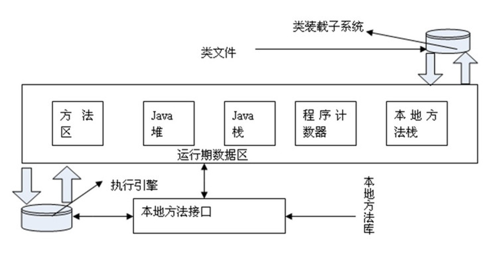
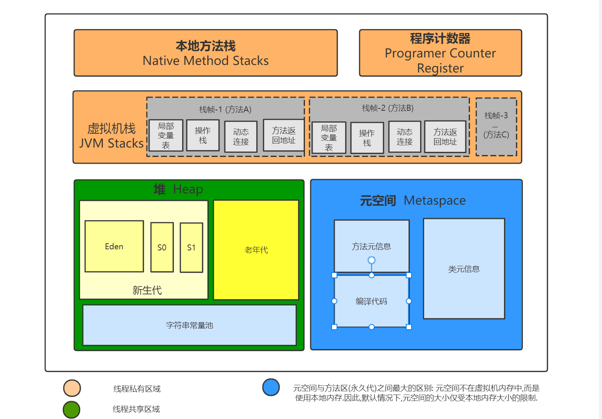
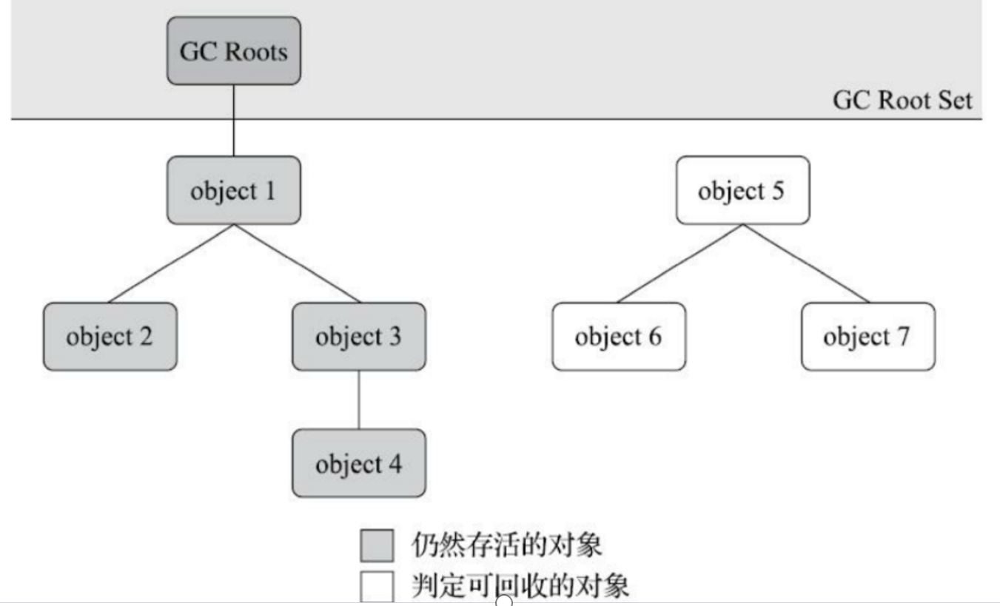
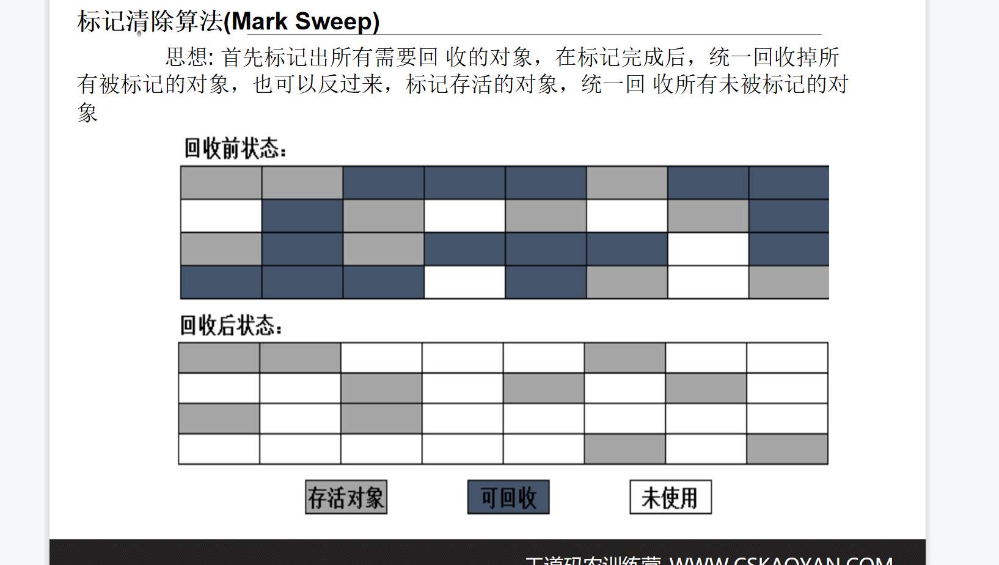
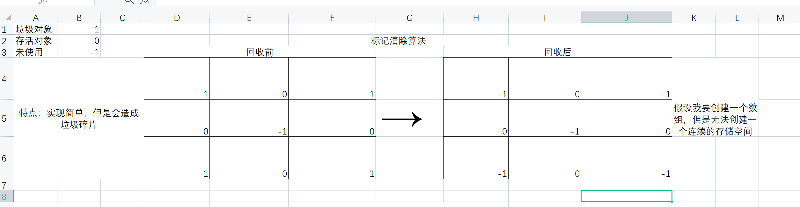
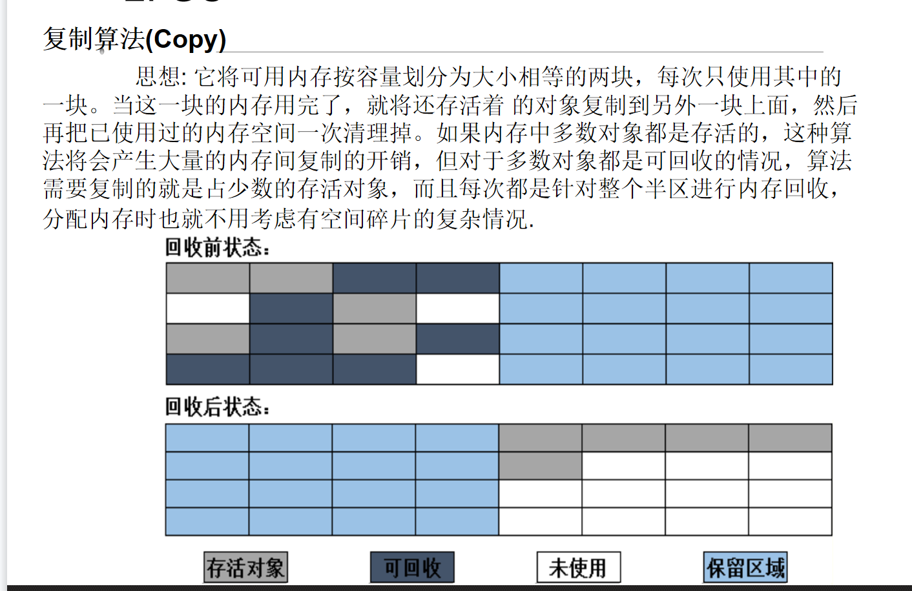
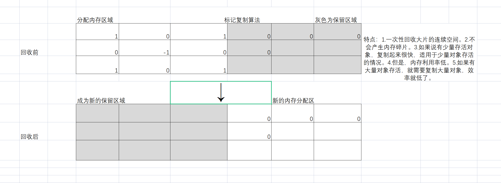
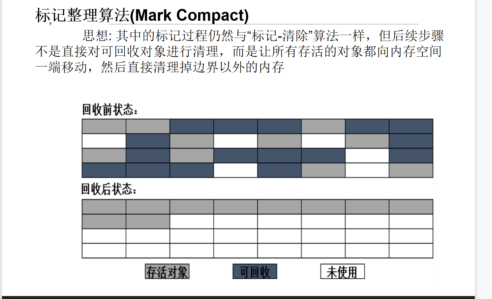
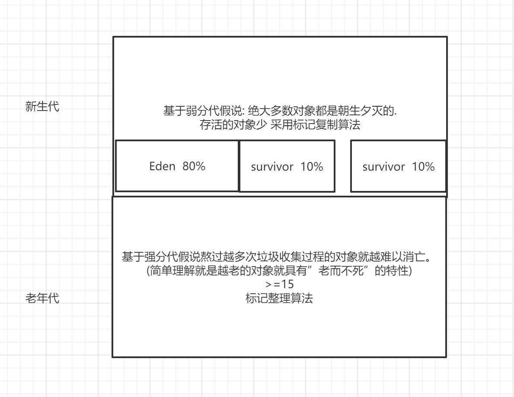

(本节内容了解)

# JVM运行时数据区

**程序计数器**
      程序计数器（Program Counter Register）是一块较小的内 存空间，它的作用可以看做是当前线程所执行的字节码的行号指示器。(**每个线程都有自己的程序计数器，线程隔离**)

**Java虚拟机栈**
     它描述的是Java 方法执行的内存模型：每个方法被执行的时候都会同时创建一个栈帧（Stack Frame ）用于存储局部变量表、操作栈、动态链接、方法出口等信息。**线程私有(线程隔离)**

**本地方法栈(线程私有)**
     本地方法栈（Native Method Stacks）与虚拟机栈所发挥的作用是非常相似的，其区别不过是虚拟机栈为虚拟机执行Java 方法（也就是字节码）服务，而本地方法栈则是为虚拟机使用到的Native 方法服务。

**Java堆**
     此内存区域的唯一目的就是存放对象，一个JVM实例只存在一个堆，堆内存的大小是可以调节的.**堆内存是线程共享的**。totalMemory 默认是系统64分之一 250M     maxMemory 默认是系统的四分之一 4g

 -Xms200m     -Xmx300m

**方法区(线程共享)**
     方法区（Method Area）与Java 堆一样，是各个线程共享的内存区域，它用于存储已被虚拟机加载的类信息、常量  、静态变量等数据。

方法区是逻辑概念

- 永久代
- 元空间

# 内存管理

**显式的内存管理(C/C++)**
内存管理(内存的申请和释放)是程序开发者的职责  malloc() free()
常见问题：
内存泄漏：内存空间已经申请，使用完毕后未主动释放
野指针：使用了一个指针，但是该指针指向的内存空间       已经被free
**隐式的内存管理(Java/C#)**
内存的管理是由垃圾回收器自动管理的
优点：增加了程序的可靠性，减小了memory leak
缺点：无法控制GC的时间，耗费系统性能

对于JVM来说，很重要的一个工作。就是如何确定这是个垃圾。 

在Java中，如何确定是垃圾，肯定不是随机。 

# GC

## 如何确定垃圾

### 引用计数算法

确定哪些对象已经变成了垃圾，最简单的算法就是引用计数法
给对象添加一个引用计数器
每当一个地方引用它时，计数器加1
每当引用失效时，计数器减少1
当计数器的数值为0时，也就是对象无法被引用时，表明对象不可在使用

但是这个算法存在一个致命的缺陷，无法解决循环引用的问题

为此，引入了另外一种根搜索算法。

### 根搜索算法

这个算法的基本思想是将一系列称为“GC Roots”的对象作为起始点
从这些节点开始向下搜索
搜索所走的路径称为引用链
当一个对象到所有的GC roots之间没有任何引用链相连时，就认为该对象变成了垃圾

GC Roots包含对象呢？
虚拟机栈中引用的对象
方法区中的静态属性引用的对象(静态变量引用的)

## 如何回收垃圾

### 标记清除算法

标记清除算法的问题：内存碎片太多。 如果要使用连续的内存，这时候虽然总内存够，但是没有办法分配。

### 标记复制算法

复制算法就是将活着的对象，拷贝到另外一边。这样可以保证内存空间连续。 但是空间的利用率太低，只有50%

### 标记整理算法

### 分代收集算法

Java里面做了一个假设。 大部分对象都是朝生夕死。 但是有一些对象，死活不会死。 

Java提供了一种思路。 我给对象分个代。 新生代，老年代。 

新生代： 创建之后立马挂，而且90%的都挂。 

老年代：之前没挂掉。这次应该也不会被挂掉。（挂的概率非常小。 ）

Java中采用的策略是分代策略。 新生代，老年代。 

不同的代采用不同的回收策略。 

**2个假说**

- 强分代假说
  - 熬过越多次垃圾收集过程的对象就越难以消亡。(简单理解就是越老的对象就具有”老而不死”的特性)
- 弱分代假说
  - 弱分代假说（Weak Generational Hypothesis）: 绝大多数对象都是朝生夕灭的.

## 什么时候回收垃圾

申请heap space失败后会触发GC回收

系统进入idle后一段时间会进行回收

主动调用GC进行回收  System.gc()。 严禁调用

