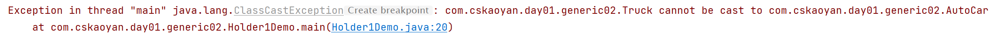
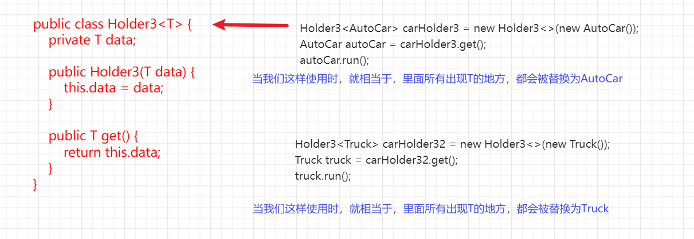
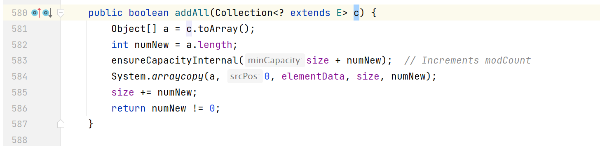

# 基础概念

**学习目标：**

- 理解泛型的概念及掌握泛型的好处

- 泛型类、泛型接口的定义
- 理解泛型在父子继承关系上的表现
- 理解泛型的擦除


在工作过程中的作用：在工作中，一些现有的容器会需要能存储多种类型，需要使用泛型来存储。 <span style=color:yellow;background:red>**所以使用的地方很多。**</span>

面试一般就问泛型的擦除。

## 引入

**背景条件**

- 汽车类
- 汽车的车库(主要用于存放车)。还提供一个方法获取汽车。 


```JAVA
/**
 * 类： 希望被持有的小汽车类
 * 功能： 里面只有一个run方法，打印。
 */
public class AutoCar {
    public void run() {
        System.out.println("小汽车跑跑跑......");
    }
}


/**
 * 类：车库类
 * 功能：
 * 1.持有小汽车。
 * 2.对外提供获取小汽车方法
 */
public class HolderAutoCar {
    private AutoCar autoCar;

    public HolderAutoCar(AutoCar autoCar) {
        this.autoCar = autoCar;
    }

    public AutoCar get() {
        return this.autoCar;
    }
}

public class HolderAutoCarDemo1 {
    public static void main(String[] args) {
        // 使用方式
        HolderAutoCar holderAutoCar = getHolderAutoCar();

        AutoCar autoCar = holderAutoCar.get();
        autoCar.run();
    }

    private static HolderAutoCar getHolderAutoCar() {

        AutoCar autoCar = new AutoCar();

        // 这里的步骤可能很繁琐。
        // 比如这个autoCar需要进行十几个步骤，才能得到
        // 我们使用这个方法来屏蔽这十几个步骤。因为这个AutoCar我们可能只使用，创建是其他程序员创建好。

        HolderAutoCar holderAutoCar = new HolderAutoCar(autoCar);

        return holderAutoCar;
    }
}
```


如果现在又有一个卡车类，也想拥有持有类

```JAVA
// 卡车类
public class Truck {
    public void run() {
        System.out.println("大卡车跑跑跑......");
    }
}

// 持有卡车类的类
public class HolderTruck {
    private Truck truck;

    public HolderTruck(Truck truck) {
        this.truck = truck;
    }

    public Truck get() {
        return this.truck;
    }
}

// 使用方式
HolderTruck holderTruck = new HolderTruck(new Truck());
holderTruck.get().run();
```


会发现，小汽车持有类和卡车持有类，非常相似，就隔了一个类型。


<span style=color:red;background:yellow>**问题：如果我还有其他的类呢？比如皮卡类，摩托车类？**</span>

如果继续这样写下去（一个车写一个车库类），有哪些优点和缺点？

优点：简单。这样可以一直写下去。写一个皮卡类，写一个皮卡车库类。

缺点：持有类的功能很固定，其实就是类型不一样。为每一个都单独写一个类，<font color=red>**类数目会急剧增多。**</font>


<span style=color:red;background:yellow>**解决方案1：**</span>

使用Object持有这些类。

好处：可以完成功能

坏处：一旦强转错了，会报错。比如本来存储进去的AutoCar，强转回的时候转成了Truck

```java
public class Holder1 {
  private Object object;

  public Holder1(Object object) {
    this.object = object;
  }

  public Object get() {
    return this.object;
  }
}

// 正确使用。存AutoCar
Holder1 holder11 = new Holder1(new AutoCar());
((AutoCar) holder11.get()).run();

// 正确使用。存Truck
Holder1 holder12 = new Holder1(new Truck());
Object o = holder12.get();
((Truck) o).run();

// 错误使用。 o是一个Truck对象，但是却把它转成了AutoCar
((AutoCar) o).run();
```

<font color=red>**问题：**</font>

存在类型强转问题,如果类型转换错误，会导致报错。




<span style=color:red;background:yellow>**解决方案2：**</span>

抽取公共接口，持有类持有接口。运用多态特性。

```JAVA
public interface Car {
  void run();
}

public class AutoCar implements Car{
  public void run() {
    System.out.println("小汽车跑跑跑......");
  }
}

public class Truck implements Car {
  public void run() {
    System.out.println("卡车跑跑跑......");
  }
  
  public void truckMethod() {
    System.out.println("我是truck特有的方法");
  }
}

public class Holder2 {
  private Car car;

  public Holder2(Car car) {
    this.car = car;
  }

  public Car get() {
    return car;
  }
}

// 具体使用
Holder2 holder2 = new Holder2(new AutoCar());
holder2.get().run();

Holder2 holder21 = new Holder2(new Truck());
holder21.get().run();

// 如果向下转型
Truck truck = (Truck) holder21.get();
truck.truckMethod();

// 如果转错了类型。
AutoCar autoCar = (AutoCar) holder21.get();
```

<font color=red>**问题：**</font>

- 需要修改代码Truck,AutoCar这种类。如果这个`AutoCar`是别人提供的，我们就无法添加继承关系。
- 只能调用接口所特有的方法，如果想调用子类单独的方法，需要强转，可能转错。


<span style=color:red;background:yellow>**解决方案3： **</span>

使用泛型

```JAVA
// 持有类的定义
public class Holder3<T> {
  private T data;

  public Holder3(T data) {
    this.data = data;
  }

  public T get() {
    return data;
  }
}

// 使用
// 尖括号的指定的类型。先有一个印象
Holder3<AutoCar> holder3 = new Holder3<>(new AutoCar());
holder3.get().run();

Holder3<Truck> holder31 = new Holder3<>(new Truck());
holder31.get().run();
```


## 泛型概念

**什么是泛型？**

<span style="color:red;">参数化类型。</span>我们在写代码的时候, 可能很多时候我们并不能确定某一个参数的具体类型, 或者, 我们希望代码某个参数类型是灵活可变的,  我们可以先假定一种不存在的类型来代指这个参数类型, 当我们真正使用的时候再传入具体的类型。



**相当于什么呢？**

```java
// 举例来说：比如我们之前定义一个变量
// int i ;
// 我们假设i = 1  --> 那i就是1
// 我们假设i = 2  --> 那i就是2

// 现在泛型来说
// 我们使用了一个符号来代替类型。比如我们使用这样一个定义  T data;
// 当我们传 T = String   那data就是String类型的
// 当我们传 T = Integer   那data就是Integer类型的

// 当我们传 T = AutoCar   那data就是AutoCar类型的
// 当我们传 T = Truck   那data就是Truck类型的
```

泛型： 参数化类型。 

## 泛型好处

1. 省去了类型强转的麻烦

   ```java
   不用使用强制类型转换。就避免了类型强转问题。
   ```

2. 将运行期遇到的问题转移到了编译期

   ```java
   没有泛型之前，编译器是不会检测集合容器中元素的数据类型的，因为它们全部都是Object。使用泛型后，能让编译器在编译的时候借助传入的类型参数（实参）检查对集合容器的插入，获取等操作是否合法。
   ```

强转的时候，运行时候才报错。 现在有了泛型，编译期就会报错。 

问题其实越早发现，越好解决。 

# 泛型

- 泛型类： 泛型定义在类上。<span style=color:red;background:yellow>**需要重点掌握**</span>
- 泛型接口：泛型定义在接口上，<span style=color:red;background:yellow>**需要重点掌握**</span>
- 泛型方法：泛型定义在方法上，了解即可
- 泛型通配： 了解即可
- 泛型擦除：重要，要记住


泛型是在Java 5中被引入的。在Java 5之前，Java的类和方法只能通过Object来实现泛化，这样的代码存在许多问题，如类型转换错误、编译时类型检查缺失等等，限制了代码的可读性、可维护性和安全性。

引入泛型机制后，Java可以在编译时进行更严格的类型检查，使得代码更加健壮、可读性更强，并且避免了许多运行时类型转换错误的问题。

##  泛型类

泛型类是一种可以在定义类时使用类型参数来表示类中使用的类型的类。在Java中，泛型类可以用于定义一些通用的数据结构或算法，以便能够适应不同类型的数据。

```JAVA
// 泛型类:  所谓泛型类,  就是把泛型'定义在'类上
// 定义的方法  类名<泛型类型1, 泛型类型2， ...>
格式:  class 类名<泛型类型1,…>{
}
```

**注意1：泛型的使用时候写法**

```JAVA
// JDK1.7的写法。泛型的写法1 前面写类型，后面直接写 <>
User1<String> user1 = new User1<>();
String data = user1.data;

// JDK1.5 的时候，泛型刚刚出来时候的写法：
// 泛型的写法2 User2<类型> 变量名 = new User2<类型>();
User1<Integer> user11 = new User1<Integer>();
Integer data1 = user11.data;
```

**注意2：默认类型**

定义了泛型，但是未写在<>中，会将其直接当做Object使用。

```JAVA
User1 user1 = new User1();

// 如果不使用 <> 来指定类型，这时候T是个什么类型呢？
// 是默认类型，Object
Object data = user1.data;
```

**注意3: 泛型类可以定义多个泛型**

- <font color=red>**可以定义多个泛型，但不建议超过两个。**</font>我们可以在一个泛型类上, 定义多个泛型, 但是建议不要超过两个(并不是语法限制)
- <font color=red>**定义多个泛型，使用时，要么全部指定，要么全部不指定。**</font>当我们给一个泛型类定义多个泛型的时候, 使用的时候, 传泛型就要指明类型, 或者全不指明默认Object

````java
User2<String, Integer> user2 = new User2<>("zs", 18);
// User2<String> user3 = new User2<>("zs", 18); // 报错，必须全部指定泛型的类型，或者全部不指定。

class User2 <T, E>{
    T name;
    E age;
}
````

**注意4: 定义了泛型不使用: 允许**

```java
// 定义了一个K, 但是我们没有使用
class User3 <T, E, K> {
    T name;
    E age;
}
```

**注意5: 泛型标识符**

```JAVA
// 我们会假定一种不存在的类型来代替这个参数类型，等我们真正使用的时候再传入具体的类型。
// int i; 这个i是变量。变量名
// T data;  这个T就是标识符。
// 使用单个大写字母。比如 E T K V
// E element; T type; K key; V value

// 这是一些规范。如果不按照这个规范，写代码也可以跑，但是出问题的风险比较大。
// 切记，不要使用String这种东西作为泛型，极容易认错
```

**注意6: 泛型必须使用引用类型**

```java
   User4<int> user1 = new User4<>(); // 报错: 泛型必须使用引用类型
   User4<Integer> user2 = new User4<>();
```

**注意7:  泛型类, 定义了泛型之后, 泛型的作用域**

- 泛型类定义泛型的作用域:  在<span style=color:red;background:yellow>**自己的**</span>类上，或者类中。
- 类上：类的定义这行,可以使用泛型。`class Son<T> extends Father`
- 类中：代表类体包含内容，包括内部类，可以使用泛型


```java
class Father1{
    // 用不了T, 因为子类定义 
}

class Son<T> extends Father1{ 
    T t;
    class SonInner{     
        T aInnerT;   
    }
}

class GrandSon extends Son{
   // 用不了T, 因为父类定义 
}
```

### 泛型在父子继承关系上的表现

```java
public class Demo1 {
  public static void main(String[] args) {
    Father<Integer> f = new Father<>();
    Integer ft = f.ft;

    // Son1 定义时没有指定Father泛型的类型，所以默认为Object
    Son1 son1 = new Son1();
    Object ft1 = son1.ft;

    // Son2 定义时，未指定泛型，指定了 Father泛型为String，所以ft为String
    Son2 son2 = new Son2();
    String ft2 = son2.ft;

    //Son3 定义时，指定泛型E，指定了 Father泛型为Integer，所以ft为Integer
    Son3<String> son3 = new Son3<>();
    Integer ft3 = son3.ft;

    // Son4 定义时，指定泛型E，指定了 Father泛型为E，所以ft类型和子类一致
    Son4<Integer> son4 = new Son4<>();
    Integer ft4 = son4.ft;
    Son4<String> son41 = new Son4<>();
    String ft41 = son41.ft;

    // Son5 指定T。 与符号无关
    Son5<String> son5 = new Son5<>();
    String ft5 = son5.ft;
  }
}

class Father <T> {
    T ft;
}
class Son1 extends  Father{ }
class Son2 extends Father<String>{}
// 这个前面的E叫做定义了一个泛型E 
class Son3<E> extends Father<Integer>{}

// 这里只是看起来好像是Integer。其实是定义了一个泛型叫做Integer。它和 java.lang.Integer有区别。
// class Son3<Integer> extends Father<Integer>{}
class Son4<E> extends Father<E>{}
class Son5<T> extends Father<T>{}
```

背景： 如果父类有泛型，子类情况如下：

- 如果继承时，<font color=red>**未指定父类泛型**</font>，则为默认类型。Object

  - ```JAVA
    class Son1 extends Father{}
    
    Son1 son1 = new Son1();
    Object object = son1.ft;
    ```

- 如果继承时，<font color=red>**指定了父类类型**</font>，则为指定类型，无论子类定义泛型与否。

  - ```JAVA
    class Son2 extends Father<String>{}  --》 父类变量类型为String
    class Son3<E> extends Father<Integer>{} --》 父类变量类型为Integer
    ```

- 如果继承时，<font color=red>**传入了子类指定的泛型**</font>，则父类与子类变量类型一致

  - ```JAVA
    class Son4<E> extends Father<E>{}  // 等到使用Son4的时候，指定什么类型，就是什么类型
    class Son5<T> extends Father<T>{}
    
    // 要注意bug
    
    // 前面一个 <Integer> 叫泛型的定义，相当于我定义了一个符号
    // 后面叫使用
    class Son51<Integer> extends Father<Integer>{}
    ```


泛型类里面有的这些特性，在泛型接口中也有。 

## 泛型接口

泛型接口是指在<span style=color:red;background:yellow>**声明接口的时候使用泛型参数**</span>，以便在实现接口时指定具体的类型。这样可以使接口更加灵活和通用，可以适应不同类型的数据结构或对象。

在泛型接口中，泛型参数可以用在接口中的方法、常量、嵌套类等地方。例如：

```java
// List既能存Student，也能存User 也能存Teacher。

// 存Student的，能不能存User。 

public interface List<T> {
    void add(T element);
    T get(int index);
    int size();
}
```

在上面的例子中，泛型参数T可以用于add方法的参数类型和get方法的返回类型。

泛型接口使得Java中的容器类更加通用和灵活，可以适应不同类型的数据结构和对象。


```java
// 所谓泛型接口, 就是把泛型定义在接口上
格式:  interface 接口名<泛型类型1…>
// 标识符。   T  E  
// 能不能用基础类型。
// 能不能定义多个泛型。 
// 定义了能不能不使用？  
    
// 泛型标识符。   单个大写字母。 
```

```java
// 格式: interface 接口名<泛型类型1…>
interface Player<T> {
    T play(T t);
}

// 如果实现时候，不指定类型，默认为Object
class YoungPlayer implements Player{
    @Override
    public Object play(Object data1) {
        return null;
    }
}

// 如果实现时，指定为什么类型，则为什么类型
class ChildPlayer implements Player<Integer>{

    @Override
    public Integer play(Integer data1) {
        return null;
    }
}

// 如果子类也有泛型，则与子类一致
// 等到这个子类，被创建的时候，才会有具体的类型。 
class OldPlayer<E> implements Player<E>{

    @Override
    public E play(E data1) {
        return null;
    }
}
```


**泛型接口类型在什么时候确定？**

<font color=red>**子类实现该接口时候，或者子接口继承该接口时。需要指定类型**</font>

```JAVA
interface Player<T> {
    T play(T t);
} 
  
// 1.子类实现该接口，没有指定泛型。		--> 接口中泛型为Object
//  class ChildrenPlayer implements Player {}
//  	 public Object play(Object o) {}
  
// 2.子类实现该接口，指定了泛型，给接口指定了类型  --> 接口中泛型为指定的类型
//  class YoungPlayer implements Player<String> {}
//  	 public String play(String s) {}

// 3.子类实现该接口，指定了泛型,且符号一致  --> 接口中为指定的泛型
//  class OldPlayer<E> implements Player<E>{}
//	public E play(E e) {}

// 1.子接口继承该接口时候
与以上行为一致。
```


### 案例

```JAVA
// 转换器接口，从一个类型转化到另一个类型
// 转换器，是讲一个类型转到另外一个类型，这时候类型肯定不能写死。  所以需要泛型。  f泛型有两个
// 定义这样的接口，有什么好处？   通用。 
// 一个规范。 只要见到这个东西，我就知道它是转换，把一个类型，转换到另外一个类型。 
public interface Converter<T, R> {
    R convert(T t);
}

// 从字符串转化为时间类型 我们约定字符串的格式为 yyyy-MM-dd。即这种类型 2022-11-01
public class String2DateConverter implements Converter<String, Date> {
    @Override
    public Date convert(String s) {

        Date parse = null;
        try {
            parse = new SimpleDateFormat("yyyy-MM-dd").parse(s);
        } catch (ParseException e) {
            throw new RuntimeException(e);
        }
        return parse;
    }
}

// 还可以写从String类型的转化为Integer
// 从Long 类型转化为 Date类型。
```

## 泛型方法

```java
// 所谓泛型方法, 把泛型定义在方法上
格式:  <泛型类型> 返回类型 方法名(泛型类型)

<T> T test1(T numer1){}
```

```java
public class Demo1 {
    public static void main(String[] args) {

        A a = new A();
        Integer t = a.getT(18);
        String zs = a.getT("zs");
        
    }
}
//格式:  <泛型类型> 返回类型 方法名(泛型类型 变量名)
class A{
    public <T> T getT(T t){
        return t;
    }
}
```

**注意事项：**

```JAVA
// 1.方法上没有定义泛型，只是使用了泛型，不叫泛型方法。
//比如
class Player<T>{
  T play(T t){
      System.out.println(t);
      return t;
  }
}
```

## 泛型的通配: 了解

<font color=red>**以后看源码，能明白含义即可。**</font>



泛型不允许协变,  又想产生类似协变的效果, 又不想引入协变带来的问题(类型不匹配问题)


**0.协变和逆变**

```JAVA
Integer是Number的子类。
所以我们可以使用这种形式。 Number number = new Integer(10);			父类引用指向子类对象
那这个有父子继承关系吗  User<Number>  User<Integer>
 		可以这样使用吗？		User<Integer> user1 = new User<>("zs", 18);
 		 User<Number> user2 = user1;
 结论： 不行。因为  User<Number> 和 User<Integer> 不是父子继承关系。
 这个操作叫做协变。
```

协变就是，允许接收该类及该类的子类。

逆变就是，允许接收该类及该类的父类。


```JAVA
// 数组是允许协变的。协变的问题。类型不匹配问题
Animal[] animals = new Cat[10];

animals[0] = new Cat();
animals[1] = new Cat();
// 编译期没有问题。  但是运行期有问题。
animals[2] = new Dog();
```

泛型不允许协变，也就是

```java
User<Animal> user = new User<Cat>();
```

泛型中，弄出来了几个通配，来让自己可以产生协变的效果。 

<span style=color:red;background:yellow>**泛型的通配**</span>

① 泛型通配符<?>
任意类型，如果没有明确，那么就是Object以及任意的Java类了
② ? extends E
向下限定，E及其子类
③ ? super E
向上限定，E及其父类


**1.任意类型**

```JAVA
class User<T> {
  String name;
  T data;
  // getter & setter & conctructor
}
```

```JAVA
// 我们想提供一个方法，打印User对象，方法的签名是以下
// 如果是打印Integer的，可以是以下的
public void print(User<Integer> user) {
  System.out.println(user.getName() + "--" + user.getData());
}
  
// 如果是String类型的，则以上方法用不了
// 可以使用这个类型吗? 也不允许，因为泛型不允许协变
public void print(User<Object> user) {
  
// 可以使用以下类型来接收。？代表任意类型
public void print(User<?> user) {
```


**2.向下限定**

`? extends E`

只允许接收该类及该类子类。

```JAVA
// 允许接收 Number 及Number的子类
public double compute(User<? extends Number> user) {
  Number data = user.getData();
  return data.doubleValue() + 1;
}

User<Integer> user = new User<>("zs", 18);
User<Double> user2 = new User<>("zs", 18.0);

double val = genericsExtends2.compute(user);
double val2 = genericsExtends2.compute(user2);
System.out.println(val);
System.out.println(val2);
```


**3.向上限定**

`? super E`

只允许接收该类及其父类。

## 泛型的擦除: 重要:需要记住

Java中的泛型<span style=color:red;background:yellow>**并不是真的泛型,**</span>  Java的泛型只存在于编译之前, 当Java中的泛型编译之后, 会把泛型编译成Object以及类型强转


看起来，它也是强转（JDK）； 我也是做的强转。为啥我非要用泛型呢？

因为人家强转，能保证你的代码问题，不会给你转错。 


面试题： 为什么使用泛型，因为泛型不涉及到强制类型转换，效率高一些。 对不对？

效率没有区别。

使用的时候，安全性有区别。 jdk帮你做的。 更安全点。


