# 准备部分

## 数据结构

leecode.很推荐刷刷leetcode。  做业务做准备的。 

```JAVA
// 数据结构:  什么是数据结构
//         数据的组织方式,  数据+结构

// 有哪些常见的数据结构:
     集合:  一堆无序的数据
     线性表:  描述的是一个有序序列, 在这有序序列中除了头和尾数据以外, 每一个数据有唯一的前驱和后继  
           操作受限的线性表: 栈和队列。都是线性表。 只允许在特定的位置进出数据。
               
     树:  一对多的关系
         一个节点，连接多个节点。二叉树： 一个节点，最多连接两个节点
     图:  多对多的关系
```

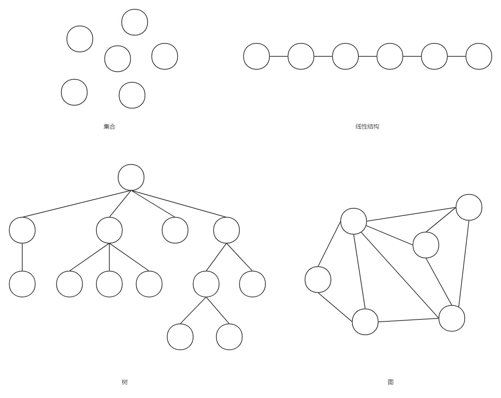

本节课只会讲线性表，因为后面会用到，其他的如果大家感兴趣可以自己去学习一下。

面试的时候，问可能问到线性表就结束了。 


不叫加分题，叫扣分题。 所以这种问题一定要会。

面试的时候，问线性表，一般怎么问？

- 数组和链表的插入，删除，查找流程讲一下。 
  - 对于数组的插入，如果是在中间位置，需要挪动数据，留出空，然后将新数据插入。对于链表，只需要修改指针。 
  - 对于数组的删除，需要挪动数据。 对于链表，也只需要修改指针。 
  - 对于数组的查找，可以随机查找（也就是根据下标，直接找到一个元素）。对于链表，只能一个一个找。 
- ArrayList和LinkedList。

### 数组

数组就是一片连续的内存空间，且存储的类型都是一致的。这就说明什么？

int[] numbers = new int[10];  类型一致说明空间大小一致。 

想取第四个位置的元素 

<span style=color:red;background:yellow>**说明每一个格子的大小是固定的。**</span>我们只要知道头一个地址，后方的地址都可以算出来

```
Q1: 数组我们都很熟悉，那你理解的数组是什么样的呢？它的最主要特点是什么呢？
    // 数组是在内存上连续存储,  所以可以随机访问
    // 对应数组下标的物理地址 = 数组首地址 + 下标 * 每一个内存单元大小
    
// 有一个数组长度是1000的。 现在想访问 index=500。是否可以直接访问到
// 可以。 数组的首地址 + 下标 * 每一个单元格的大小。

// 如果链表的长度是1000。 想访问 第 501个数据。  
// 用一个计数器。0 ，访问一次加1.
    
Q2: 为什么数组的效率比链表高？
    // 因为数组是连续存储可以做到随机访问, 但是链表是非连续存储不能做到随机访问
```

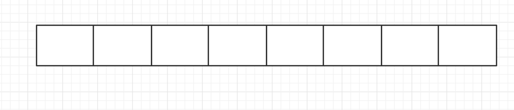

数组的插入数据流程

数组的删除数据流程

数组的查找数据流程


下去一定要自己写一下这个代码。因为面试如果答不上来，基本就挂了。

### 链表

<span style=color:red;background:yellow>**链表是一个线型的。**</span>

基础的结构是这样的。

```JAVA
// data可以用  泛型。 
// 泛型的主要目的：  保证数据类型的可变性，比如下一次要存储Integer了。如果现在写成String，就不行
public class Node<T> {
    T data;
    Node<T> next;
}
```


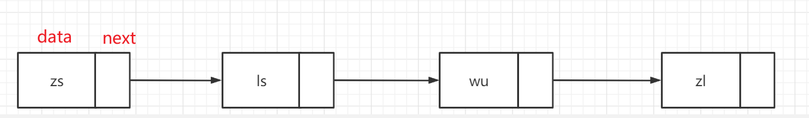

链表的插入数据流程

链表的删除数据流程

链表的查找数据流程

## 集合是什么

> 集合是具有某种特定性质的事物的总体。 这里的“事物”可以是人，物品，也可以是数学元素。

在Java中，指的就是存放数据的<span style=color:red;background:yellow>**容器**</span>，是一个<span style=color:red;background:yellow>**载体**</span>，可以一次容纳多个对象。

和数组比较像。 为什么要提供一套集合类。 就是因为数组操作起来，操作起来麻烦，但是非常容易出bug。

集合类帮助我们把这个事情隐藏起来。  数组长度不够用了。删除数据的时候挪动数据。


比如，现在数组的长度是8个， 目前里面的数据是7个。 

- 添加一个数据。 
- 再添加一个数据怎么办？ 创建一个新数组，长度是9，把原数据挪过去。 添加一个数据。 
- 再添加一个数据怎么办？


数组也可以存储多个对象，那集合和数组比，好在哪里呢？

```JAVA
// 1.班上有5个同学。  学生有名字，年龄，地址等信息
// 2.现在转学走了一个同学(第三个同学)。  怎么表示
// 3.新学期，又来了三个学生  怎么表示

// 使用数组完成一下这些功能
// 用集合类也完成一下这个功能。

//有啥问题？

// 1.操作起来非常的麻烦，容易出bug。添加一个学生，删除一个学生不好操作
// 2.使用数组，需要手动进行扩容，非常麻烦。
```


先使用集合实现一下。


集合类，其实就是Java帮我们封装的一些类。 可以使用这些类，完成功能。底层帮我们屏蔽了非常多细节。 减少了我们写代码过程中会出现的bug。 


 

Java中的集合类分为两大类：一类是实现了Collection接口的类，另一类是实现了Map接口的类。


**Collection：**先理解为一个袋子，往里面装数据。有各种各样的子实现。

在Java中，Collection是一个接口，它是所有集合类的顶层接口。它定义了一组通用的方法，用于操作集合中的元素。

Java中的Collection接口定义了一些常用的方法，例如add()、remove()、contains()等，还有用于获取集合大小、判断集合是否为空、清空集合等方法。Java中的集合类包括List、Set和Queue等，它们都是实现了Collection接口的子接口。

>  Collection是最基本的集合接口，一个 Collection 代表<font color=red>**一组**</font> Object，即 Collection 的元素, Java不提供直接继承自Collection的类，只提供继承于的子接口(如List和set)。

> - 比如存储一组学生
> - 比如存储一组手机号码


主要存储的就是单列数据。比如一个学生，一个老师。这种都叫单列数据。


**Map：**存储key-value结构的数据。key-value结构：就是可以根据一个key，找到一个对应的value。

> Map 接口存储一组键值对象，提供key（键）到value（值）的映射。

> - 比如根据手机号，快速获取到姓名
>
> - 比如根据身份证号，快速获取到人的信息

## 工作中的作用

<span style=color:red;background:yellow>**工作，主要是处理业务信息。返回老板/前端需要的数据。**</span>

我们一般在工作过程中，都是在处理数据。比如对某些数据进行筛选。

都是使用集合类，在对数据进行处理。


gui. 集合。 


学完之后，<font color=red>**要多对比**</font>，对比各个容器的不同。

整理不同容器的结构思维导图。


- 面试的时候，会被问到
- 写代码的时候，需要使用


CRUD boy。

# `Collection`

学习目标：

- 了解Collection接口的作用(描述数据增删查的一些方法。 )
- 掌握Collection的增、删、查方法（add  addAll  remove   removeAll  contains  containsAll  retainAll）
- 掌握Collection的遍历方法<span style=color:red;background:yellow>**(很重要)**</span> 
- 掌握Collection遍历方法的特点及迭代器方法需要小心的bug。toArray有什么特点？迭代器的并发修改异常问题，在使用迭代器的过程中，不能去修改原有集合。 
- <span style=color:yellow;background:red>**熟练掌握什么场景下使用Collection及其子类**</span>

遍历使用的非常多。比如，现在让你判断一下，有多少同学在18岁以下。 想看一下有多少同学来自江西。 想看一下我们班这次考试的最高分。


集合类讲课的大致顺序：

- 特点 --》 对这个容器有一个基础的认识。
- API  --》 基础使用
- 迭代方法 -- 在日常写代码过程中，使用最多的一类方法。 遍历。 
- 使用过程中，容易出现的问题。---》为了让大家了解这个问题，防止bug。


我们在学习任何一个接口之前，会给大家讲 接口的特点。

这个接口的特点，<span style=color:red;background:yellow>**是重点。**</span>大家了解了这个特点，基本对这个接口的一些基本行为有一个认知。

zs  ls   wu   -->    zs   ls  wu 

## 特点

1. Collection是顶级接口，用描述数据存储的接口.
2. Collection的一些子实现有序，一些无序
3. 一些子实现允许存储重复的数据，一些不允许
4. 一些子实现允许存储null，一些不允许

传统的三件套。 数据存储是否有序。 


> - 什么叫有序，什么叫无序？
>
> 指的是存储和读取的顺序，比如存入进去的是 `1 2 3 4 9`。读取出来的是`1 2 3 4 9`。或者 `9 4 3 2 1 `均称为有序。存进去的顺序和读取出来的顺序完全一致或者完全相反。 

## `API`

```java
//    ---------------------------------增删改查方法---------------------------------
// 需要熟练使用，清楚特点。 
//    boolean add(E e): 添加一个元素进入Collection
//    boolean addAll(Collection<? extends E> c): 添加一个Collection进目标Collection
//    boolean remove(Object o)： 删除元素， 只删除第一个出现的(如果存在多个)
//    boolean removeAll(Collection<?> c)： 删除Collection中的所有存在的元素,会全部删除，如果存在多个
//    boolean contains(Object o)： 判断是否存在指定元素
//    boolean containsAll(Collection<?> c)： 判断给定的collection中是否全部存在于目标Collection
//    boolean retainAll(Collection<?> c)： 将原有collection只保留传入的collection。

//    ---------------------------------特殊方法---------------------------------
//    void clear()： 清空collection
//    boolean equals(Object o) ： 判断是否相等
//    int hashCode()： 计算hashCode
//    boolean isEmpty(): 是否为空
//    int size()： collection里面的元素个数
//
//    ---------------------------------方便遍历方法---------------------------------
//    Object[] toArray(): 将collection转成一个数组，方便遍历
//    <T> T[] toArray(T[] a)：类似，只是传入了一个数组
//    Iterator<E> iterator()：返回一个迭代器
```

遍历：对一个集合中的元素，按照一定的顺序，访问且仅访问一遍。对集合的元素，挨个访问


- 添加方法

  ```JAVA
  boolean add(E e): 添加一个元素进入Collection
  
  boolean addAll(Collection<? extends E> c): 添加一个Collection进目标Collection
  ```

example

```java
@Test
public void addDemo1() {
    // Collection的add方法
    // ArrayList是Collection接口的一个子实现。ArrayList的底层是一个数组。
    Collection<String> collection = new ArrayList<>();

    // 往Collection中添加了两个数据。  zs   景天叔叔
    collection.add("zs");
    collection.add("景天叔叔");

    // ArrayList重写了toString()
    System.out.println(collection); // [zs, 景天叔叔]
}

@Test
public void addAllDemo1() {
    Collection<Integer> c1 = new ArrayList<>();
    c1.add(10);
    c1.add(6);
    c1.add(2);
    c1.add(8);

    Collection<Integer> c2 = new ArrayList<>();
    // 将c1中的所有元素 添加到c2
    // 是将数据添加到c2中
    c2.addAll(c1);

    System.out.println(c2);
}
```

- 删除方法

  ```JAVA
  boolean remove(Object o)： 删除元素， 只删除第一个出现的(如果存在多个)
    
  boolean removeAll(Collection<?> c)： 删除Collection中的所有存在的元素,会全部删除，如果存在多个
  ```

```java
@Test
public void removeDemo1() {
    Collection<String> collection = new ArrayList<>();

    collection.add("zs");
    collection.add("ls");
    collection.add("wu");
    collection.add("zs");
    collection.add("ls");

    // 现在collection中有 五个元素.
    System.out.println(collection); // [zs, ls, wu, zs, ls]

    // 删除 zs；  删除第一个 zs。有多个 zs,只会删除第一个
    collection.remove("zs");
    System.out.println(collection); // [ls, wu, zs, ls]
}

@Test
public void removeAllDemo1() {
    Collection<String> c1 = new ArrayList<>();
    c1.add("zs");
    c1.add("ls");
    c1.add("wu");
    c1.add("zs");
    c1.add("ls");

    Collection<String> c2 = new ArrayList<>();
    c2.add("zs");

    // 会从c1中删除所有的c2,无论c1中有多少个元素
    c1.removeAll(c2);
    System.out.println(c1); //[ls, wu, ls]
}
```

- 查询方法

  ```JAVA
  boolean contains(Object o)： 判断是否存在指定元素
    
  boolean containsAll(Collection<?> c)： 判断给定的collection中是否全部存在于目标Collection
  ```

```JAVA
@Test
public void containsDemo1() {
    Collection<String> collection = new ArrayList<>();
    collection.add("zs");
    collection.add("ls");
    collection.add("wu");

    // 判断 Collection中，是否包含元素 “zs”; 如果包含，返回true;否则返回false
    boolean contains = collection.contains("zs");
    System.out.println(contains); // true

    boolean contains1 = collection.contains("景天叔叔");
    System.out.println(contains1); // false
}

@Test
public void containsAllDemo1() {
    Collection<String> collection = new ArrayList<>();
    collection.add("zs");
    collection.add("ls");
    collection.add("wu");
    collection.add("zl");

    // 新建一个Collection，里面的元素是 zs  zhou
    // Arrays.asList 是一个创建集合的方法。但是需要注意，创建出来的集合，不能添加和删除数据
    Collection<String> collection1= Arrays.asList("zs", "zhou");

    boolean containsAll = collection.containsAll(collection1);
    System.out.println(containsAll); // 判断 collection中 是否包含 collection1里面的所有元素

    Collection<String> collection2= Arrays.asList("zs");
    boolean containsAll1 = collection.containsAll(collection2); // 判断 collection中 是否包含
    // collection2里面的所有元素
    System.out.println(containsAll1);
}

```


### `toArray`方法

<font color=red>**无参方法**</font>

就是直接拷贝一份数据，创建一个新的数组。

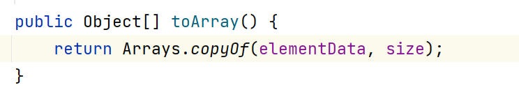


```java
// 底层是数组的实现
class ArrayList{
    //elementData: 存储数据的数组 
    Object[] elementData;

    // 数组列表的大小（它包含的元素数）
    int size;
}

```


<font color=red>**有参方法**</font>

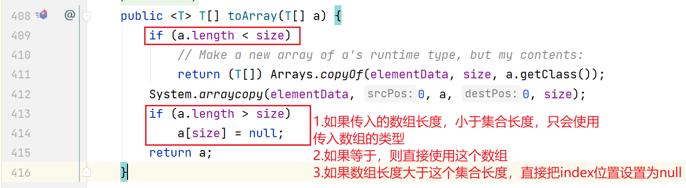


```JAVA
// ArrayList底层是数组、

class ArrayList{
    // elementData就是底层用来存储数据的数组
    Object[] elementData;
    
    // size ： ArrayList底层实际存储的数据的长度。
    // 比如最开始 初始化 长度10；  elementData = new Object[10];
    // size = 0;    size=1; 
    int size;
    
    
    //是ArrayList的toArray实现
    //  a = new String[3]
    // ArrayList里面，实际存了3个元素
    public <T> T[] toArray(T[] a) {
        // a.length(3)   <   size(3)
        if (a.length < size)
            // 如果你传入的数组长度，小于集合的长度。  这时候，会直接 复制底层存储的数据，只使用类型。
            return (T[]) Arrays.copyOf(elementData, size, a.getClass());
        
        // 只要走到这一行。说明  a.length >= size 。 传进来的数组长度，大于等于  元素个数
        // arraycopy 就是把一个数组 copy。 
        // 把elementData的所有数据 拷贝到  a(传进来的数组)
        System.arraycopy(elementData, 0, a, 0, size);
        
        // 传入的数组长度，大于size(实际存储的数据长度)
        if (a.length > size)
            // 直接把elementData后面的位置，赋了null。
            a[size] = null;
        return a;
    }
}
```


```Java
// 这是系统提供的一个数组拷贝方法。  --》 把一个数组复制到另外一个数组
// src 源数组
// srcPos 从什么地址开始复制（starting position in the source array.）
// dest 目标数组
// destPos 粘贴到的下标位置
// length 复制的长度（the number of array elements to be copied.）
public static native void arraycopy(Object src, int  srcPos, Object dest, int destPos, int length);
```


```JAVA
// elementData   ArrayList底层存储数据的数组。 
// size  存储数据的长度。
// a是什么东西？ 我传进来的数组。 
public <T> T[] toArray(T[] a) {
    // 传入的数组长度  <  实际的长度 ====》 装不下ArrayList里面的数据。 
    if (a.length < size)
        // 如果传过来的数组不够长，直接将 ArrayList底层数组复制,size，使用你传入的类型。 
        return (T[]) Arrays.copyOf(elementData, size, a.getClass());
    
    // 代码能走到这一行，说明什么。   ==》 说明肯定够装。
    // 将elementData拷贝一份，拷贝到a。 
    System.arraycopy(elementData, 0, a, 0, size);
    
    // 
    if (a.length > size)
        // size    [0, size-1]. 
        a[size] = null;
    return a;
}
```

<font color=red>**有参构造方法**</font>

传入的数组长度与集合长度的对比。

1.如果数组长度<font color=red>**小于**</font>集合长度。只会使用传入的数组的类型，不会使用这个数组
2.如果数组长度<font color=red>**等于**</font>集合长度，会直接使用这个数组
3.如果数组长度<font color=red>**大于**</font>集合长度，也会使用这个数组，并且将数组的index=length位置的元素设置为null


<span style=color:red;background:yellow>**直接使用`toArray`这个有什么弊端？**</span>

`toArray`是将原Collection直接copy了一份。（1w）


对于遍历来说，我一般主要是干什么？一般就是想统计一下符合条件的。 

- 耗费时间，需要将原有collection全部拷贝一遍
- 耗费空间，两倍的collection占有空间
- 后续使用完毕，还需要gc

我们一般遍历一个集合，有时候是想统计个数，有时候是想找出符合条件的，如果每次都复制一次，不仅耗费时间，而且使用完后，还需要`gc`。


在处理大量数据时，使用`toArray`方法需要谨慎考虑，因为它会将集合中的所有元素都复制到新的数组中，占用大量的内存空间。如果数据量非常大，可能会导致内存溢出的风险。

在处理大量数据时，建议使用迭代器进行遍历，而不是将集合转换为数组。迭代器可以逐个访问集合中的元素，并且不需要将所有元素都复制到新的数组中，从而减少内存的占用。


### `iterator`方法

比如对于一个数组来说，我需要遍历数组。 

其实迭代器的思路很简单。 如果是大家来遍历数组，会怎样操作？

- 方式1：复制一遍
- 方式2：直接使用一个int来遍历。


**迭代器**（iterator），有时又称**光标**（cursor）是程序设计的软件设计模式，可在容器对象（container，例如链表或数组）上遍历的接口，设计人员无需关心容器对象的内存分配的实现细节。

<span style=color:red;background:yellow>**是用来遍历这个容器对象所有数据的接口。**</span>

迭代器相当于只保留了一个标识，标识我可以怎么拿到这个数据，不copy数据。所有操作的数据都是针对的原有的Collection。

比如对于一个集合来说（底层实现：数组）。我想遍历这个集合。   下标

集合来说（底层实现：链表）。我想遍历这个链表。 指针就可以。


好处是什么？

`Iterator`是个接口，接口只定义规范，我们获取到了iterator，就可以使用这个对象对数据进行遍历。把接口与实现隔离。

```JAVA
//    boolean hasNext(): 是否有下一个元素
//    E next()： 获取下一个元素
//    void remove()： 删除刚刚遍历过的元素
```

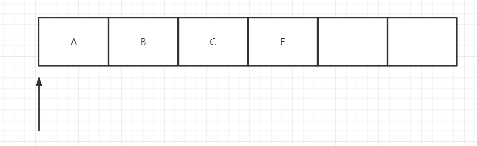

比如Collection底层有的是数组，有的是链表。

数组的Iterator里面维护的是下标

链表的Iterator里面维护的是指针。

所有的具体实现都交给具体的子类。接口只定义一个规范。


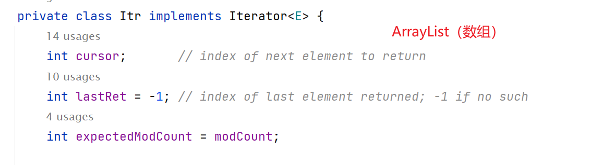

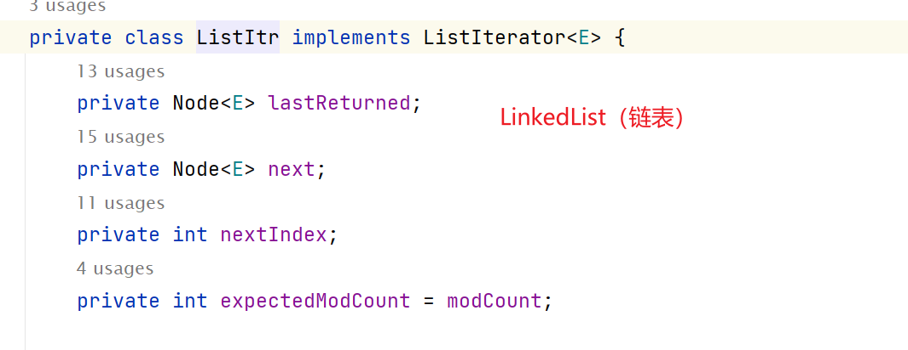


**迭代器是个游标，它遍历的时候，被别的线程，把原集合中加了几个元素，减了几个元素，那这时候这次遍历的意义大吗？**

`JDK`采用了存储一个值的方式，去保证在迭代器使用过程中，原有的集合不被修改（当前线程、其他线程）。

在Collection内部，有一个`modCount`,用来标识结构变化的次数(get/contains 这种查询不叫结构变化)

生成迭代器的时候，存储这个`expectedModCount=modCount`,在调用 next remove时候，会检查


使用迭代器过程中，如果原结构发生了变化，会报并发修改异常<span style=color:yellow;background:red>**（ConcurrentModificationException）**</span>。

如果见到了，需要检查，是不是在迭代器使用过程中，修改了原有集合。


迭代器怎样使用

```JAVA
//    boolean hasNext(): 是否有下一个元素
//    E next()： 获取下一个元素
//    void remove()： 删除刚刚遍历过的元素

    @Test
    public void iteratorDemo1() {
        Collection<String> collection = new ArrayList<>();
        collection.add("zs");
        collection.add("ls");
        collection.add("wu");

        // 现有collection里面有 三个元素。 [zs, ls, wu]
        System.out.println(collection);

        // 调用iterator()方法，生成一个迭代器。迭代器本身不存储数据。所以它操作的数据都是原有集合的
        Iterator<String> iterator = collection.iterator();

        // 现在的迭代器和数据 示意图：
        //  数据：   [     zs           ls           wu   ]
        //  迭代器位置： |

        // 迭代器后是否有元素。
        System.out.println(iterator.hasNext());

        // 将指针往后挪动，并返回刚刚经过的元素
        String next = iterator.next();
        System.out.println(next);
        
        // 现在的迭代器和数据 示意图：
        //  数据：   [     zs           ls           wu   ]
        //  迭代器位置： ------- |
    }

```


<font color=red>**怎么解决会出现并发修改异常问题？**</font>

不要在迭代器迭代过程中，去修改原集合。要不就是在迭代器生成之前，要不就在迭代器使用完成之后，再去修改原有集合。


```JAVA
    Collection<String> collection = new ArrayList<>();

    collection.add("zs");
    collection.add("ls");
    collection.add("wu");
	collection.add("zs");

	// ========================= 这个位置之前叫做迭代器生成之前 =========================
    Iterator<String> iterator = collection.iterator();

    while (iterator.hasNext()) {
       // 不能边使用，边修改原有集合。
      // collection.remove("zs");

      String next = iterator.next();
      System.out.println(next);
    }

	// ========================= 这个位置之前叫做迭代器生成之后 =========================

```


## `foreach`

工作中一般使用`foreach`居多。底层也是iterator。

所以需要注意，在`foreach`中，不要去改变Collection的结构。

```JAVA
Collection<String> collection = new ArrayList<>();

collection.add("zs");
collection.add("ls");
for (String s : collection) {
    System.out.println(s);
}
```


<font color=red>**案例1**</font>

```JAVA
// 1.存储一组学生。包括 姓名 年龄，总分，入学日期
// 2.找出总分最高的学生？
// 3.找出总分最低的学生
// 4.求平均分
// 5.删除低于平均分的学生
// 6.找出2年内入学的学生。
// 7.需要删除叫张三的学生
// 8.删除年龄小于18的学生
```

<font color=red>**案例2**</font>

```JAVA
// 存储一组订单数据。订单的信息包括，订单号，订单金额，订单时间，订单状态(未付款、已付款、已发货、已评价)，订单更新时间
// 新建5条订单放入 
// 2.找出下单时间最早的订单，并打印
// 3.找出订单状态是已付款的
// 4.找出订单金额超过200的，并且订单状态是已发货

// 思考一下，这些条件怎么传？

一定要注意： 命名的问题和代码抽方法的问题。 
```


获取到一段描述后，需要掌握以下能力。将描述转化为代码的能力。


<span style=color:red;background:yellow>**总结**</span>

怎样去遍历Collection接口

```JAVA
// 使用 iterator  
Collection<String> collection = new ArrayList<>();

collection.add("zs");
collection.add("ls");
collection.add("wu");

// 使用的时候，先生成一个迭代器
Iterator<String> iterator = collection.iterator();

while (iterator.hasNext()) {
    String next = iterator.next();
    System.out.println(next);
}


// 使用foreach
for (String next : collection) {
    System.out.println(next);
}

String[] strings = collection.toArray(new String[0]);
// 数组的foreach 底层就是fori
for (String string : strings) {
    System.out.println(string);
}

// 三种 迭代器，foreach，toArray
```


如何删除Collection中所有的zs和ls数据？

```JAVA
// 遍历，删除
// 1.方式1  
// 创建一个新的集合；
// 遍历原有集合。
//		判断。是否 zs  ls ; 是的话，添加到新集合
// removeAll()
// 遍历新集合 --》  remove()

// 2.方式2
// 迭代器
// 创建一个迭代器。遍历这个迭代器(while hasNext() next() )
// 判断， 是不是zs  或者 ls 。 是的话，remove  iterator.remove()
// 切记，不能通过原有集合的remove()


// 使用一个集合类，把所有的zs 和ls 都存起来。然后遍历集合类，再调用原有集合类的remove方法

// 使用一个集合类，存储 zs  ls  调用removeAll方法

// 使用迭代器的删除方法

// Collection<String>  
// Collection<Student> 
```


遍历Collection接口的时候，有什么需要注意的事项

<span style=color:yellow;background:red>**注意并发修改异常。出现的原因，以及解决的办法。**</span>

# `List`接口


学习目标

- <span style=color:red;background:yellow>**重点掌握List接口的特点，及其使用场景**</span>
- 掌握List接口特殊的方法
- 掌握List接口的特有遍历方式
- ArrayList的底层结构。初始化容量，扩容策略
- LinkedList的底层结构(双向链表)
- <span style=color:red;background:yellow>**（面试）Vector和ArrayList的区别？为什么被替换掉**</span>
- Stack是什么？在Java中想使用栈，应该怎么创建（Deque）

## 特点(重点)

1. List是Collection的子接口。（父子继承关系，想对原有接口进行增强。）
2. 数据结构表现为线性表。
3. 存储数据有序。（存储进去的顺序和读取出来的顺序。 完全一致或者完全相反）
4. 可以存储重复元素
5. 可以存储null


<font color=red>**线性表**</font>

线性表，全名为线性存储结构。使用线性表存储数据的方式可以这样理解，即“把所有数据用一根线儿串起来，再存储到物理空间中”。

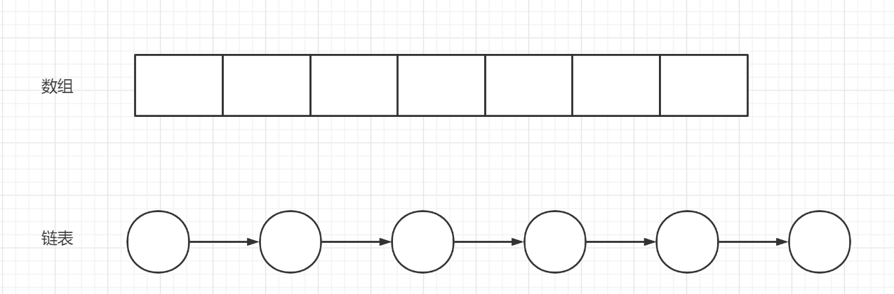

就是一对一的数据结构。一个数据元素，除了第一个元素和最后一个元素，都只有一个前驱一个后继。


<span style=color:yellow;background:red>**一定要掌握。**</span>数组的插入数据，删除数据流程，查找；链表的插入数据，删除数据流程，查找。

是一个超级减分项。

- 一定要会写这里的代码
- 还有一个，一定要能描述清楚。 

## `List`的`API`

`List`是`Collection`的子接口。所有肯定有`Collection`的所有方法。

`Collection`的API我们已经学习过，所以直接学习`List`所特有的。

```JAVA
//  List是线性表的实现，所以它相对于Collection增加了很多下标相关的API
//    void add(int index, E element)： 在指定位置添加元素。list添加的位置，只能在[0,length之间]
//    boolean addAll(int index, Collection<? extends E> c)： 在指定位置添加一个Collection的所有元素
//    E remove(int index)：删除指定下标的元素，只能删除下标的位置[0, lenth-1]。返回的是删除的元素
//    E set(int index, E element)： 设置指定下标的元素为element.   array[index] = element; 
//    E get(int index)： 获取指定下标元素
//    int indexOf(Object o)： 获取元素首次出现的下标。如果元素不存在。 返回的是-1
//    int lastIndexOf(Object o)： 获取元素最后一次出现的下标。

//    ListIterator<E> listIterator()： 
//    ListIterator<E> listIterator(int index)
//    List<E> subList(int fromIndex, int toIndex)
```

<span style=color:red;background:yellow>**需要注意的东西**</span>

- 画图，理清操作的是哪个位置。
  - add（1， “666”）
  - add(5,"888")
  - add(6，“777”)

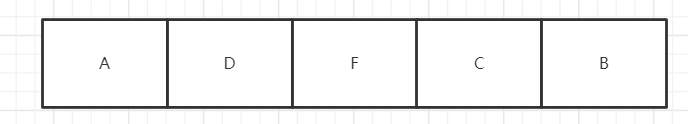

### `listIterator`方法

返回一个`ListIterator`的对象。这个与迭代器类似，只是可以前后移动，可以返回index。

- 有参构造，返回的迭代器对象，调用next返回的是指定下标的元素。<font color=red>**所以传入的index应该在什么范围？**</font>

[0,length]


```java
public interface ListIterator<E> extends Iterator<E>
        //boolean hasNext() : 判断后面是否还有元素可以遍历
        //E next()    : 向后遍历
        //void remove()   : 删除刚刚遍历的数据

        //boolean hasPrevious()    : 向前是否可以遍历
        //E previous() : 向前遍历

        //int nextIndex() : 向后遍历的数据的下标
        //int previousIndex() :  向前遍历的下标
        //void add(E e) : 添加一个数据到当前遍历位置,并且把指针往后挪一下
        //void set(E e) : 修改刚刚遍历过的元素位置
```

二进制的计算

### `subList`方法

看名字，会误认为是： 子/截取  生成一个新的List

但是其实是，返回列表中指定的 `fromIndex`（包括 ）和 `toIndex`（不包括）之间的部分**视图**。

<span style=color:red;background:yellow>**视图：**</span>只是原表的一个映射，并没有把数据复制一份。它和`iterator`很相似，只是维护了几个标记。操作`subList`产生的对象，会影响原来的对象。

相当于，只是一个看起来和原有数组一致，可以把它理解为镜子。


> 注意：它也会存在并发修改的问题。当生成了`subList`之后，如果再修改原集合。再访问`subList`的对象，会报错。

注意一些坑：

- 注意`oom`，因为`subList`只是一个视图，它保留了原始的数组。所以如果错误估计，可能会`oom`
- 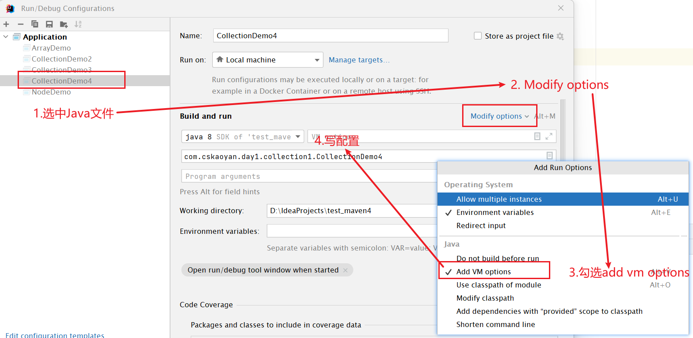

```JAVA
怎么出现oom，设置小堆内存。切记不要直接跑，可能会导致电脑死机
IDEA中，可以针对当前代码，设置最大的运行内存
Edit Configurations --> Add VM options -->
-Xmx500m -Xms500m
    
  -Xmx500m 最大堆内存 500m
  -Xms500m 初始堆内存 
```

- <span style=color:red;background:yellow>**注意并发修改异常**</span>

## <span style=color:yellow;background:red>**ArrayList**</span>

底层是数组。JDK在实现ArrayList的时候，和我们自己写的，区别不大。怎么实现的添加。删除。

大部分的东西，在List接口里面已经讲了。List<String> list = new ArrayList<>();

ArrayList<String> list = new ArrayList<>();


```JAVA
// 今后我们写代码的时候。  
// Collection    List   ArrayList
// 在工作中，是采用哪种方式写得多？   
Collection<String> collection = new ArrayList<>();  // 第一种，尽量不要使用。因为Collection和ArrayList还隔了一层。 
List<String> list = new ArrayList<>();   // 在工作过程中，最常用的一种写法。
ArrayList<String> list = new ArrayList<>();  // 也有人用。但不建议。 
```


ArrayList是Java集合框架中的一种，它实现了List接口，可以动态地添加、删除和修改元素。<span style=color:red;background:yellow>**与传统的数组不同，ArrayList的大小可以根据需要自动增长，因此非常适用于需要频繁添加或删除元素的场景。**</span>

<span style=color:yellow;background:red>**ArrayList内部实际上是一个动态数组，它可以存储任意类型的对象。**</span>当创建一个ArrayList时，它的初始容量是10个元素，当元素数量超过容量时，ArrayList会自动增加容量，以便能够容纳更多的元素。

ArrayList提供了一系列方法，可以方便地操作其中的元素，例如add()方法可以在末尾添加元素，remove()方法可以删除指定位置的元素，get()方法可以获取指定位置的元素，set()方法可以修改指定位置的元素等等。


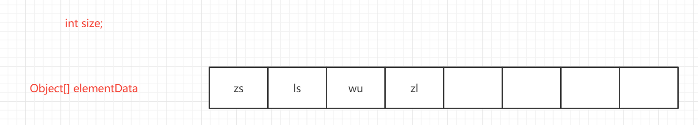


### 特点

1. ArrayList是List的实现
2. ArrayList数据结构表现为线性表
3. <span style=color:red;background:yellow>**底层结构是数组**</span>
4. 存储元素，有序
5. 可以存储重复元素
6. 可以存储null

### 构造方法

怎么创建这个类的。

```java
//    ArrayList() 构造一个初始容量为 10 的空列表。
//    ArrayList(Collection<? extends E> c)：构造一个包含指定 collection 的元素的列表，这些元素是按照该 collection 的迭代器返回它们的顺序排列的。
//    ArrayList(int initialCapacity)：构造一个具有指定初始容量的空列表。 

// List接口。 接口没有构造方法
```


### `ArrayList`的`API`

```java
//    Object clone()
//    返回此 ArrayList 实例的浅表副本。
//    void ensureCapacity(int minCapacity)
//    如有必要，增加此 ArrayList 实例的容量，以确保它至少能够容纳最小容量参数所指定的元素数。
//    void trimToSize( )
//    将此 ArrayList 实例的容量调整为列表的当前大小。
```


## `LinkedList`


双向链表。

Queue 队列

Deque 双端队列


LinkedList是Java集合框架中的一种，它实现了List和Deque接口，是一个双向链表。与ArrayList不同的是，LinkedList在内部并不使用数组来存储元素，<span style=color:red;background:yellow>**而是使用一个链表来存储元素，因此可以高效地进行插入和删除操作。**</span>

<span style=color:red;background:yellow>**LinkedList的每个节点都包含了一个指向前一个节点和后一个节点的指针，因此可以方便地进行双向遍历。**</span>在向LinkedList中添加元素时，只需要创建一个新的节点，并将其插入到链表中即可。同样，在删除元素时，只需要将该元素的前后节点的指针重新指向即可，不需要像ArrayList一样将其后面的元素全部向前移动。

LinkedList提供了一系列方法，可以方便地操作其中的元素。例如add()方法可以在指定位置添加元素，remove()方法可以删除指定位置的元素，get()方法可以获取指定位置的元素，set()方法可以修改指定位置的元素等等。除此之外，LinkedList还提供了一些特殊的方法，例如offer()和poll()方法用于在链表的首尾添加和删除元素，push()和pop()方法用于在链表的首部添加和删除元素等等。

### 特点

1. LinkedList是List的子实现
2. LinkedList数据结构表现为线性表
3. LinkedList底层结构是双向链表
4. 存储元素有序
5. 可以存储重复元素
6. 可以存储null

### `LinkedList`的构造方法

```JAVA
//LinkedList() 
//          构造一个空列表。 
//LinkedList(Collection<? extends E> c) 
//          构造一个包含指定 collection 中的元素的列表，这些元素按其 collection 的迭代器返回的顺序排列。 
```

### `LinkedList`的`API`

LinkedList里面的API分两类。第一类，是List接口继承过来的；  第二类，是Deque接口。 

不需要大家死记硬背。 靠理解去记忆。 只要知道里面有这么个方法，完成这个事情，有什么注意事项。 如果这个API忘了，用idea点一下。 


队列：先进先出，从队尾进，队头出。

双端队列：队头和队尾都可以进出。

栈：先进后出。

```java
//        来自Collection
//        来自List的
//    ----------------------------来自普通队列
//    boolean offer (E e)
//    将指定元素添加到此列表的末尾（最后一个元素）。
//    E peek () 获取但不移除此列表的头（第一个元素）。
//    E poll () 获取并移除此列表的头（第一个元素）

//    ---------------------------- 作为Stack的
//        E pop()： 从此列表所表示的堆栈处弹出一个元素。
//        void push(E e): 将元素推入此列表所表示的堆栈。

//    ---------------------------- 作为双端队列
//    boolean offerFirst (E e)
//    在此列表的开头插入指定的元素。
//    boolean offerLast (E e)
//    在此列表末尾插入指定的元素。
//
//    E peekFirst () 获取但不移除此列表的第一个元素；如果此列表为空，则返回 null。
//    E peekLast () 获取但不移除此列表的最后一个元素；如果此列表为空，则返回 null。
//
//    E pollFirst () 获取并移除此列表的第一个元素；如果此列表为空，则返回 null。
//    E pollLast () 获取并移除此列表的最后一个元素；如果此列表为空，则返回 null。

//    ----------------------------以下的API了解即可
//    void addFirst (E e)： 将指定元素插入此列表的开头。
//    void addLast (E e)： 将指定元素添加到此列表的结尾。
//    E removeFirst () 移除并返回此列表的第一个元素。
//    E removeLast () 移除并返回此列表的最后一个元素
//    E getFirst () 返回此列表的第一个元素。
//    E getLast () 返回此列表的最后一个元素。
//    boolean removeFirstOccurrence (Object o)
//    从此列表中移除第一次出现的指定元素（从头部到尾部遍历列表时）。
//    boolean removeLastOccurrence (Object o)
//    从此列表中移除最后一次出现的指定元素（从头部到尾部遍历列表时）。
//    Iterator<E> descendingIterator () 返回以逆向顺序在此双端队列的元素上进行迭代的迭代器。
//    E element () 获取但不移除此列表的头（第一个元素）。
```


<font color=red>**链表特点：**</font>插入和删除快。真的吗？

查找也需要时间，所以算起来和`ArrayList`类似。一般需要使用，直接使用`ArrayList`。除非在极个别情况下，才会用LinkedList。

`List<String> list = new ArrayList<>();`


```JAVA
class LinkedList{
    
    public LinkedList() {
    }
    
    
    // first 是一个节点。   是头结点
    // last 是尾节点。
    // 假设现在进来的是第一个元素。  
    //              zs
    void linkLast(E e) {
        // last=null;   l = null
        final Node<E> l = last;
        
        // 
        final Node<E> newNode = new Node<>(l, e, null);
        last = newNode;
        if (l == null)
            first = newNode;
        else
            l.next = newNode;
        size++;
        modCount++;
    }
}
```

LinkedList 只要知道一个事情。 它是个双向链表。  它靠链表存储数据。 

在工作过程中，绝大部分场景，使用ArrayList。


```JAVA
List<String> list = new ArrayList<>();
```


## `Vector`

1. Vector是List的子实现
2. Vector的数据结构表现是线性表
3. 底层结构是数组
4. 存储的数据有序，可重复，可存储null
5. 线程安全


Vector是JDK1.0出现，ArrayList是JDK1.2出现。 


Vector为啥被替代。 效率差，因为它所有的方法都有锁。


<span style=color:yellow;background:red>**在工作中，禁止使用Vector**</span>，面试专用。


面试一般会怎么问： 1.同学，了不了解Vector。2.是否了解ArrayList和Vector的区别。3.是否了解最开始的一个线程安全的List。

回答面试问题，先大后小。 

- Vector和ArrayList都是List的一个子实现。 
- 都是线性表
- 存储数据都是有序，都允许存储重复元素，都允许存储null
- Vector是线程安全的，ArrayList是线程不安全的。 


不要死记硬背面经。 八股文。一定要带着自己的理解去背，去答。


**什么叫线程安全问题？**

当多个线程同时对一个变量进行操作时，结果的预期与单线程下是一致的。这就是线程安全的。

比如多个线程对i进行操作，i初始值是0，有5个线程，每个线程累加10000次。最终结果应该是50000。 但真实情况不是这样的，这就是线程安全问题。

<span style=color:red;background:yellow>**为什么被弃用 **</span>

<span style=color:red;background:yellow>**效率低，**</span>在所有的接口上都加了`synchronized`关键字。线程安全是没问题了，但是效率却有问题。因为绝大部分都不涉及到多线程情况，所以`jdk1.2`采用了`ArrayList`来替代`Vector`

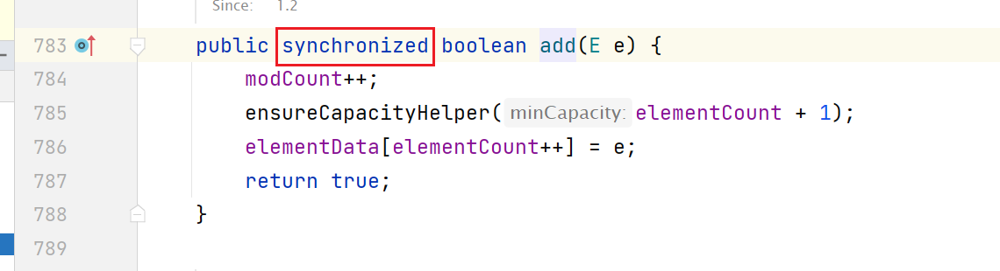

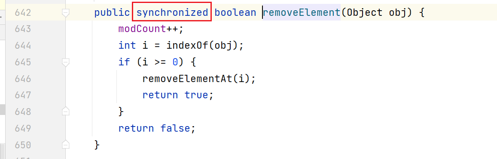

## `Stack`

1. Stack是Vector的子实现
2. 栈，是先进后出的数据容器。但是不建议使用这个来完成，效率是大问题。使用Deque来替代Stack --》 见jdk源码

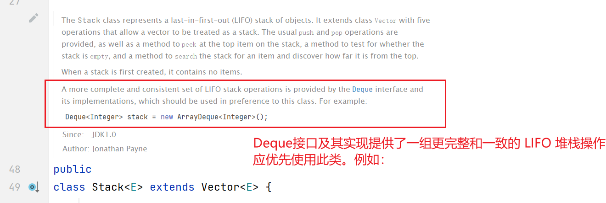


在Java中，要用栈，能不能使用Stack？ 不要用。

```JAVA
 Deque<Integer> stack = new ArrayDeque<Integer>();

为什么JDK宁愿给你提供新的 Deque。也不把Stack删掉。 
   就是为了兼容旧版本。 
    
    print "123%s", aabc    python2
    print "123%s", aabc    python3
```

# Queue

学习目标

- 掌握Queue的结构，以及Queue是什么。（操作受限的线性表。 只能在一端进，在另一端出。）
- 了解Queue两组增删查API及区别（add remove  element  |  offer poll peek  极端情况下表现不一致）
- 了解Deque的结构（offerFirst offerLast  addFirst addLast .使用API成组使用）
- 了解ArrayDeque的循环数组，是什么，以及为什么使用这种形式。
  - ArrayDeque是一个循环数组。底层是一个数组，使用两个int值来代表头和尾。避免从队列中获取数据的时候，频繁挪动数据，使用int值，就可以只操作int值，来模拟头和尾，提高了效率。

- 了解ArrayDeque的初始化容量及扩容策略。 如果传入一个非2的幂次方，它是怎么把它变成2的幂次方的
- 了解BlockingQueue是什么


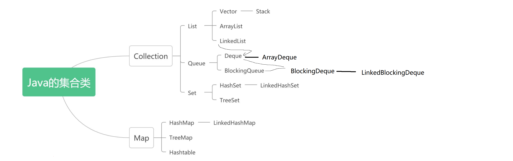

<span style=color:red;background:yellow>**Queue：**</span>在Java中，队列（Queue）是一种数据结构，用于存储元素并支持在队列的末尾添加元素和从队列的头部移除元素。队列的工作方式类似于排队等待服务的过程。

Java中的队列通常是先进先出（FIFO）的数据结构，这意味着最先添加的元素将最先被移除。Java中的队列接口（java.util.Queue）定义了队列的基本操作，如添加元素、移除元素、获取队列头部元素等。

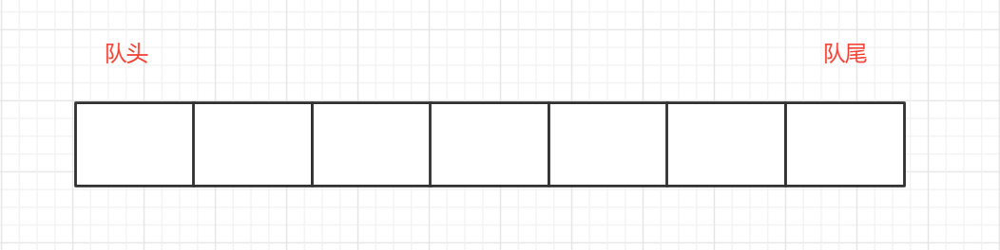

只能从队头出队列，从队尾进队列。

一定要知道Queue和Stack是操作受限的线性表。 

Queue是怎么受限的？   `从一端进，从另外一端出`

Stack是怎么受限的? `只能从同一端进出`

## 特点

1. Queue是Collection的子接口。
2. 数据结构表现为：队列
3. 存储元素有序
4. 存储元素可重复
5. 不能存储null（除了LinkedList子实现）

## API

```java
//boolean add(E e): 将指定的元素插入此队列（如果立即可行且不会违反容量限制），在成功时返回 true，如果当前没有可用的空间，则抛出 IllegalStateException。
//E remove():获取并移除此队列的头。
//E element() :获取，但是不移除此队列的头。

//boolean offer(E e):将指定的元素插入此队列（如果立即可行且不会违反容量限制），当使用有容量限制的队列时，此方法通常要优于 add(E)，后者可能无法插入元素，而只是抛出一个异常。
//E poll():获取并移除此队列的头，如果此队列为空，则返回 null。
//E peek(): 获取但不移除此队列的头；如果此队列为空，则返回 null。
```

在极端情况下，两组API的表现不一致。极端情况指的是

- 插入的时候，队列满了
- 删除或者获取的时候，队列空了。


|          | *抛出异常*                                          | *返回特殊值*                                      |
| -------- | --------------------------------------------------- | ------------------------------------------------- |
| **插入** | [`add(e)`](../../java/util/Queue.html#add(E))       | [`offer(e)`](../../java/util/Queue.html#offer(E)) |
| **移除** | [`remove()`](../../java/util/Queue.html#remove())   | [`poll()`](../../java/util/Queue.html#poll())     |
| **检查** | [`element()`](../../java/util/Queue.html#element()) | [`peek()`](../../java/util/Queue.html#peek())     |

## Deque

双端队列（Deque），是一种可以在队列的两端添加或删除元素的数据结构。

双端队列支持在队列的头部和尾部进行插入、删除和获取元素的操作，因此它可以同时用作栈和队列，是一种比较灵活的数据结构。在Java中，Deque接口提供了双端队列的实现，具有以下特点：

1. 可以在队列的头部或尾部添加或删除元素。
2. 可以获取队列头部或尾部的元素。
3. 可以用作栈或队列来进行数据操作。


<span style=color:red;background:yellow>**从队头可以进出，从队尾也可以进出。**</span>

### 特点

1. Deque是Queue的子接口
2. 数据结构表现：队列，栈，双端队列
3. 存储元素有序
4. 可存储重复元素
5. 不能存储null（LinkedList除外）

### API

```JAVA
// ------------- 作为Queue的
//        E peek()： 获取队头元素，但不移除它
//        E poll()：从队头移除元素
//        boolean offer(E e)： 添加一个元素到队尾

// ------------- 作为Stack的
//        E pop()： 从此列表所表示的堆栈处弹出一个元素。
//        void push(E e): 将元素推入此列表所表示的堆栈。

// ------------- 作为双端队列
//        boolean offerFirst(E e)：  从第一个位置插入指定元素
//        boolean offerLast(E e)： 从最后一个位置插入指定元素
//        E peekFirst()： 获取但是不移除第一个元素，如果列表为空，返回null
//        E peekLast()： 获取但是不移除最后一个元素，如果列表为空，返回null
//        E pollFirst()： 从第一个位置移除元素
//        E pollLast()： 从最后一个位置移除元素，如果列表为空，返回null

// -------------- 作为普通List的
//    boolean add(E e):将指定元素添加到此列表的结尾。
//    E remove()：获取并移除此列表的头（第一个元素）。

//        void addFirst(E e): 将指定元素插入此列表的开头。
//        void addLast(E e): 将指定元素添加到此列表的结尾。
//        E getFirst()： 返回此列表的第一个元素。
//        E getLast(): 返回此列表的最后一个元素。
//        E removeFirst(): 移除并返回此列表的第一个元素。
//        E removeLast()： 移除并返回此列表的最后一个元素。

// 这个API，大家觉得应不应该出现在Deque这个接口里面。 
//        boolean removeFirstOccurrence(Object o)： 从此列表中移除第一次出现的指定元素
//        boolean removeLastOccurrence(Object o)： 从列表中移除最后一次出现的指定元素
//        Iterator<E> descendingIterator()：获取一个倒序的迭代器
//        E element()：获取元素


// add remove  element  在极端情况报错
// offer poll peek 在极端情况返回特殊值。 
```

|          | **第一个元素（头部）**                                      | **第一个元素（头部）**                                      | **最后一个元素（尾部）**                                  | **最后一个元素（尾部）**                                  |
| -------- | ----------------------------------------------------------- | ----------------------------------------------------------- | --------------------------------------------------------- | --------------------------------------------------------- |
|          | *抛出异常*                                                  | *特殊值*                                                    | *抛出异常*                                                | *特殊值*                                                  |
| **插入** | [`addFirst(e)`](../../java/util/Deque.html#addFirst(E))     | [`offerFirst(e)`](../../java/util/Deque.html#offerFirst(E)) | [`addLast(e)`](../../java/util/Deque.html#addLast(E))     | [`offerLast(e)`](../../java/util/Deque.html#offerLast(E)) |
| **移除** | [`removeFirst()`](../../java/util/Deque.html#removeFirst()) | [`pollFirst()`](../../java/util/Deque.html#pollFirst())     | [`removeLast()`](../../java/util/Deque.html#removeLast()) | [`pollLast()`](../../java/util/Deque.html#pollLast())     |
| **获取** | [`getFirst()`](../../java/util/Deque.html#getFirst())       | [`peekFirst()`](../../java/util/Deque.html#peekFirst())     | [`getLast()`](../../java/util/Deque.html#getLast())       | [`peekLast()`](../../java/util/Deque.html#peekLast())     |

以 add  remove  getFirst getLast  这些都是极端情况报错

以  offer  poll  peek 极端情况返回特殊值。 

## ArrayDeque

循环数组（Cyclic Array），也称为环形数组，是一种数据结构，是数组的一种特殊形式。在循环数组中，数组的最后一个元素与第一个元素相邻，形成了一个环，因此可以通过数组下标进行循环遍历。

在循环数组中，每次增加数组下标时，需要考虑到下标越界的情况。一般来说，可以将下标对数组长度取模，实现在下标增加到数组最后一个元素时，返回到数组的第一个元素。同样地，当下标减小到数组的第一个元素时，可以通过将下标加上数组长度来返回到最后一个元素。

循环数组在实际应用中具有一定的优势，例如在循环队列、循环缓冲区等场景中，循环数组可以有效地实现元素的循环存储和遍历。同时，循环数组的空间利用率也相对较高，因为数组的最后一个元素可以直接连接到第一个元素，不需要额外的空间进行维护。

使用两个int值来存储头和尾的位置，来避免每一次出队列都需要让所有数据都挪动一遍，提高效率。


### 特点

1. ArrayDeque是Deque的子实现
2. 数据结构表现：队列，栈，双端队列
3. 底层实现： <font color=red>**循环数组**</font>。要理解一下循环数组的好处。
4. 存储元素有序
5. 存储元素可重复
6. 不可存储null

### 构造方法

ArrayDeque在JDK8和JDK17变化比较大。 看源码的时候，先按8看。 理解一下。  17也比较简单。 

面试过程中，ArrayDeque不怎么问。 

主要是提升。 


```JAVA
ArrayDeque() 
          构造一个初始容量能够容纳 16 个元素的空数组双端队列。  扩容机制 *2 （JDK8）
          构造一个初始容量能够容纳 17 个元素的空数组双端队列。   （JDK17）
ArrayDeque(Collection<? extends E> c) 
          构造一个包含指定 collection 的元素的双端队列，这些元素按 collection 的迭代器返回的顺序排列。 
ArrayDeque(int numElements) 
          构造一个初始容量能够容纳指定数量的元素的空数组双端队列。 
    
容量问题。如果传入的初始化容量小于8，则直接分配8个空间，如果传入的数字大于等于8，则直接找到(大于)数字的最近一个2的幂次方。
    24 --> 32
    32 --> 64
    为什么要分配2的幂次方？方便进行取模操作。
面试不会问。方便大家后面的工作，如果有遇到类似的需求，可以记起来 ArrayDeque底层有这种东西。
    
    ArrayDeque这块需要注意的问题：
    1.循环数组是什么，它可以解决什么问题
    2.它底层的数组长度，以及扩容策略。（16  2倍扩容）
    3.有一个构造方法，允许你传入自己写得容量，JDK底层是怎样把它变成2的幂次方的。
```

```JAVA
初始容量：16  2的幂次方。扩容策略是2倍
int tail=(tail + 1) % length
    tail = （tail + 1） & (length)
    
ArrayDeque里面有一个构造方法，允许你传入int大小的值，  但是我们通过推算得知，只有2的幂次方，才满足上述公式。
    所以JDK里面有把非2的幂次方，转成2的幂次方的方式。
```

```JAVA
一个结论： 
    如果b是2的幂次方,(2 4 8 )。 a%b = a&(b-1)
    
    1053876 % 100 = 76 = (1000000 + 50000 + 3000 + 800 + 76) % 100 = 76 ： 方便理解这个过程、
    
    53 % 16 = (0011 0101) % (0001 0000) = (0011 0101) & (0000 1111)
    a % b = a & (b-1)
```

循环数组。tail 的计算公式是  tail = (tail +1) % length

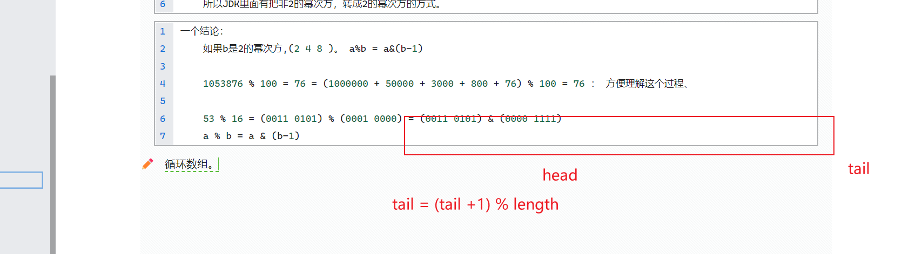


```JAVA
public void addLast(E e) {
    if (e == null)
        throw new NullPointerException();
    //
    elements[tail] = e;
    // tail = (tail + 1) & (elements.length - 1)
    // tail加1，取余；   判断tail和head。
    // doubleCapacity 两倍。
    if ( (tail = (tail + 1) & (elements.length - 1)) == head)
        doubleCapacity();
}
```


<font color=red>**准备知识：**</font>

<font color=red>**当除数为2的幂次方，可以用& 运算代替取余,即 **</font>

2的幂次方。 是类似于2的一次方，2的二次方，2的三次方。

```JAVA
  10568 % 100 = (10000 + 500 + 68) % 100   = 0 + 0 + 68 = 68
      
 a % b = a & (b-1)
53 % 16 = 0011 0101 % (0001 0000) = (0011 0101) & (0000 1111) = (0000 0101)
      如果能理解更好，不能记住，先死记住。

b是2的幂次方。 a % b = a & (b-1)
   如果不会推导，直接记死这个结论。
       
   53 % 16=
   00110101 = 0010 0000 + 0001 0000 + 0000 0101
   00010000
  =53& (16-1)
   0011 0101     
  =0000 1111
        
    十进制： 10568 % 100 = (10000 + 500 + 68) % 100  
        
    b是2的幂次方。  2 --》 10
        4 --》 100
        8 --》 1000
        
        34 % 16 = 0010 0010 % 0001 0000
        0010 0010
        0001 0000
        
        0010 0010
       &0000 1111
      
    例如 34 % 16= 0010 0010 % 0001 0000 = 0010 0010 & (0000 1111) = 01000
      
      0010 0010
&     0000 1111 
      0000 0010 = 2
      
    34%16 = 2
```


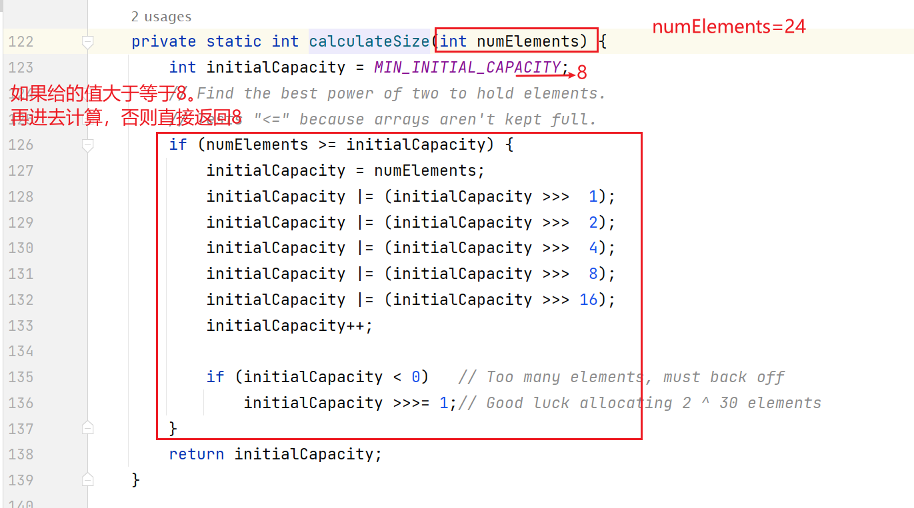


<span style=color:red;background:yellow>**比如：**</span>

24=0001 1000

32=0010 0000


```JAVA
24  --》 32（0010 0000）
32  --》64（0100 0000）

// 如果你传入了一个值，JDK并非直接使用你的 这个值。会给到这个方法，让它来计算
// 12
private static int calculateSize(int numElements) {
    // initialCapacity(初始化容量) = MIN_INITIAL_CAPACITY（最小的初始化容量） 
    // static final int MIN_INITIAL_CAPACITY = 8; 常量
    int initialCapacity = MIN_INITIAL_CAPACITY;
    // 如果你初始化的时候，传了2。 容量是8
    // 如果你传6. 也是8.
    if (numElements >= initialCapacity) {
        
        // numElements = 12(1100)
        
        // initialCapacity  = 1100
        initialCapacity = numElements;
        
        // initialCapacity |= (initialCapacity >>>  1); 可以分解为以下步骤
        // i+=2 ==>   i=i+2
        // initialCapacity = (initialCapacity | (initialCapacity >>>  1))
        
        // initialCapacity                       1100 
        // (initialCapacity >>>  1)              0110
        //   initialCapacity   =  1110
        
        initialCapacity |= (initialCapacity >>>  1);
        
        // initialCapacity =         1110
        // (initialCapacity >>>  2)  0011
        // initialCapacity = 1111
        
        initialCapacity |= (initialCapacity >>>  2);
        
        // 后面这些所有的步骤，都是在把数据赋1. 最后全部变成1之后，再加1。就会变成 2的幂次方。
        initialCapacity |= (initialCapacity >>>  4);
        initialCapacity |= (initialCapacity >>>  8);
        initialCapacity |= (initialCapacity >>> 16);
        initialCapacity++;

        if (initialCapacity < 0)   // Too many elements, must back off
            initialCapacity >>>= 1;// Good luck allocating 2 ^ 30 elements
    }
    return initialCapacity;
}
```


比如，后期你有这种需求，就是让你找2的幂次方。 

## BlockingQueue

阻塞队列

什么叫阻塞队列。一个<span style=color:red;background:yellow>**大小有限**</span>的队列。

- 插入时，<font color=red>**当队列满了，插入线程阻塞住**</font>。

- 从队列中获取元素时，<font color=red>**当队列空了，获取线程阻塞住**</font>。


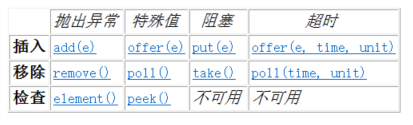


用API。阻塞API，只有两类API会阻塞，不是所有API都会阻塞。 

# Set

学习目标：

- 掌握Set接口存储数据的特点
- 掌握Set的子类。HashSet，LinkedHashSet，TreeSet存储数据的特点
  - 是否有序
  - 对重复的定义
  - 是否允许存储null
- 了解Set子类的实现方式
- <span style=color:yellow;background:red>**熟练掌握Set的使用场景**</span>


Set就是不允许存储重复元素。 它的效率高。 


## 特点

1.  Set是Collection的子接口
2.  Set数据结构是: 集合（不能存储重复元素）
3.  有些子实现无序(HashSet),  有些子实现是有序的(LinkedHashSet, TreeSet大小有序)
4.  所有子实现都不允许存储重复元素（什么叫重复。 HashSet或者LinkedHashSet  hashCode相同& equals 为true   TreeSet是Comparable接口返回0，叫重复。）
5.  有些子实现允许存储null(HashSet, LinkedHashSet), 有些子实现不允许存储null(TreeSet)

## Set的API

```JAVA
// -------------------------set接口, 没有在Collection的基础上额外定义什么api---------

//    ---------------------------------增删改查方法---------------------------------
//    boolean add(E e): 添加一个元素进入Collection
//    boolean addAll(Collection<? extends E> c): 添加一个Collection进指定的Collection
//    boolean remove(Object o)： 删除元素， 只删除第一个出现的(如果存在多个)
//    boolean removeAll(Collection<?> c)： 删除Collection中的所有存在的元素,会全部删除，如果存在多个
//    boolean contains(Object o)： 判断是否存在指定元素
//    boolean containsAll(Collection<?> c)： 判断给定的collection中是否全部存在于目标Collection
//    boolean retainAll(Collection<?> c)： 将原有collection只保留传入的collection。

//    ---------------------------------特殊方法---------------------------------
//    void clear()： 清空collection
//    boolean equals(Object o) ： 判断是否相等
//    int hashCode()： 计算hashCode
//    boolean isEmpty(): 是否为空
//    int size()： collection里面的元素个数
//
//    ---------------------------------方便遍历方法---------------------------------
//    Object[] toArray(): 将collection转成一个数组，方便遍历，
//    <T> T[] toArray(T[] a)：类似，只是传入了一个数组
//    Iterator<E> iterator()：返回一个迭代器
```

## HashSet

### HashSet的特点

1.  HashSet是Set接口的子实现
2.  HashSet底层持有了一个HashMap对象
    1. 我们存储到HashSet中的数据, 实际上都存储到底层持有的HashMap的key上
    2. HashSet的特点和HashMap对key的特点保持一致
3.  HashSet存储数据无序
4.  HashSet不允许存储重复数据。<span style=color:red;background:yellow>**注意这个重复的定义。**</span>
5.  HashSet允许存储null元素

### HashSet的构造方法

```java
HashSet() 
          构造一个新的空 set，其底层 HashMap 实例的默认初始容量是 16，加载因子是 0.75。 
HashSet(Collection<? extends E> c) 
          构造一个包含指定 collection 中的元素的新 set。 
HashSet(int initialCapacity) 
          构造一个新的空 set，其底层 HashMap 实例具有指定的初始容量和默认的加载因子（0.75）。 
HashSet(int initialCapacity, float loadFactor) 
          构造一个新的空 set，其底层 HashMap 实例具有指定的初始容量和指定的加载因子。 
```

### HashSet的api

```java
// ----------HashSet ,    set接口, 没有在Collection的基础上额外定义什么api---------
```


## LinkedHashSet

### LinkedHashSet的特点

1.  LinkedHashSet是HashSet一个子类
2.  LinkedHashSet底层持有一个LinkedHashMap对象
    1. LinkedHashSet的特点和LinkedHashMap的key保持一致
3.  LinkedHashSet存储数据有序
4.  LinkedHashSet 不允许存储重复数据
5.  LinekdHashSet允许存储null
6.  线程不安全

与HashSet唯一的不同：

<span style=color:red;background:yellow>**存储数据有序**</span>


### LinkedHashSet的构造方法

```java
LinkedHashSet() 
  构造一个带默认初始容量 (16) 和加载因子 (0.75) 的新空链接哈希 set。 
LinkedHashSet(Collection<? extends E> c) 
  构造一个与指定 collection 中的元素相同的新链接哈希 set。 
LinkedHashSet(int initialCapacity) 
  构造一个带指定初始容量和默认加载因子 (0.75) 的新空链接哈希 set。 
LinkedHashSet(int initialCapacity, float loadFactor) 
  构造一个带有指定初始容量和加载因子的新空链接哈希 set。 
```

### LinkedHashSet的api

```java
// --LinkedHashSet, HashSet ,    set接口, 没有在Collection的基础上额外定义什么api---------
```


## TreeSet

### TreeSet的特点

1. TreeSet是Set接口的子实现
2. TreeSet底层持有了一个TreeMap对象
   1. TreeSet存储数据的特点和TreeMap的key保持一致
3. TreeSet存储数据大小有序（大小有序  不是存储的顺序）
4. TreeSet不允许存储重复数据: ( Comparable接口返回的 是0 ；大小重复)
5. TreeSet不允许存储null
6. 线程不安全

### TreeSet的构造方法

```java
TreeSet() 
  构造一个新的空 set，该 set 根据其元素的自然顺序进行排序。 
TreeSet(Collection<? extends E> c) 
  构造一个包含指定 collection 元素的新 TreeSet，它按照其元素的自然顺序进行排序。 
TreeSet(Comparator<? super E> comparator) 
  构造一个新的空 TreeSet，它根据指定比较器进行排序。 
TreeSet(SortedSet<E> s) 
  构造一个与指定有序 set 具有相同映射关系和相同排序的新 TreeSet。 
```

### TreeSet的api

```java
// --TreeSet ,    set接口, 没有在Collection的基础上额外定义什么api---------

NavigableSet<E> subSet(E fromElement, boolean fromInclusive, E toElement, boolean toInclusive) 
  返回此 set 的部分视图，其元素范围从 fromElement 到 toElement。 
SortedSet<E> subSet(E fromElement, E toElement) 
  返回此 set 的部分视图，其元素从 fromElement（包括）到 toElement（不包括）。 
SortedSet<E> tailSet(E fromElement) 
  返回此 set 的部分视图，其元素大于等于 fromElement。 
NavigableSet<E> tailSet(E fromElement, boolean inclusive) 
  返回此 set 的部分视图，其元素大于（或等于，如果 inclusive 为 true）fromElement。 
    
// 见到这名字，你知不知道这个API在干啥？
    // 不太知道。 搜一下。或者ChatGPT一下。
```


<span style=color:red;background:yellow>**有序 **</span>

LinkedHashSet （有序的）--》 它的有序，指的是  add 顺序。添加进去的顺序

TreeSet (有序的)-->是根据 Comparable  返回的结果。

<span style=color:red;background:yellow>**重复**</span>

LinkedHashSet  HashSet ：  hashCode  && （equals）

TreeSet：   Comparable 返回0


我们所有的集合类，基本没提过线程安全，都是线程不安全的。 

线程安全的都被干掉了。 Vector   Hashtable 

ArrayList  LinkeList  


- 后期，想用线程安全的容器怎么办？
  - JDK里面提供了。 效率会更高一点。 如果要用线程安全的容器，一般JDK里面都提供了。后期需要用哪个，就去找。 


- 复习一下： 
  - 各个容器的特点。 
  - 最最最重要的就是HashMap。面试常考。
  - 写代码的时候，怎么使用集合。   


