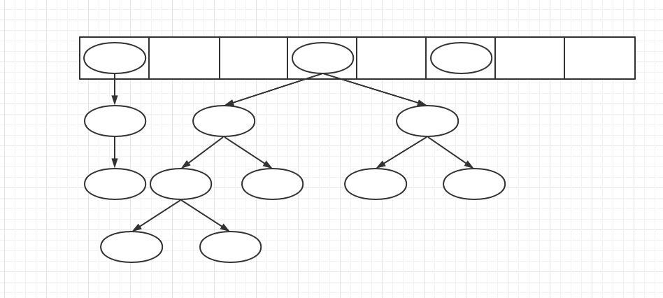

学习目标：

- 会使用Map的增删改查API。遍历Map的方式
- <span style=color:yellow;background:red>**掌握HashMap存储数据的特点**</span>
- <span style=color:red;background:yellow>**熟练掌握对常见的场景进行Map的使用**</span>.你的业务怎样需要，Map的key和value就可以怎样定义。
- <span style=color:yellow;background:red>**掌握HashMap的底层结构（面试）**</span>
- <span style=color:yellow;background:red>**掌握HashMap的添加一份key-value数据的流程**</span>
- <span style=color:yellow;background:red>**掌握HashMap的初始化容量及扩容机制，对重复的key的定义**</span>
- 掌握LinkedHashMap和TreeMap存储数据的特点

<span style=color:yellow;background:red>**重点，难点，面试常考点**</span>

面试的时候问集合。 90%会问到HashMap。

是否了解List接口，Set接口，Map接口。

是否了解List的子类。有什么特点？数组和链表。

# 前置准备

## Map是什么

什么是Map呢？Map就是用来存储键值对的接口，注意，它与Collection的区别。Collection存储的是单列数据，Map存储的键值对。什么叫键值对。就是一个key，一个value。我们举一个生活中的例子，我们把一些常见的公共电话与它的功能做一个对应。

比如 110 是警察局

120 是医院

119 是火警

122 是车辆救援

12345 是消费者权益保护。用一个键，可以快速获取一个值


比如，我们想知道一个电话对应的机构。 


比如，如果我们想在1-20中间随机生成10000个数，需要记录每个数生成了多少次，怎么存呢？


<font color=red>**生成1-20之间的随机数，10000个数字。**</font>


那如果是 1-10_000_000中间生成1000次呢？

使用数组实现不现实。 如果是int范围内生成呢？

需要使用Map。

等学完了Map的API，实现一下。


# Map

## 特点

1. Map是Map体系的顶级接口，用来存储键值对数据
2. Map存储的数据，有一些子实现有序，有一些无序。 大家学完之后，需要梳理一下，哪些有序，哪些无序。 
3. Map存储的数据，不能重复（指的是key）
4. Map存储的数据，有一些允许为null，有一些不允许。（指的key）

## API

```JAVA
//---------------------------新增，删除，查找数据接口
//    V put(K key, V value): 添加键值对。 如果键存在，是更新数据
//    void putAll(Map<? extends K,? extends V> m)： 将一个map的所有键值对都放入这个map
//    V get(Object key)： 根据一个key，获取value，如果key不存在，返回null
//    V remove(Object key)： 删除map中所包含的这个key

//    boolean containsKey(Object key): 判断map中是否包含这个key
//    boolean containsValue(Object value): 判断map中是否包含这个value

// getOrDefault()
// 如果存在，就返回对应的值；  如果不存在，就返回默认值

//---------------------------辅助接口
//    void clear() : 清空map
//    boolean equals(Object o)： 判断两个map是否相等
//    int hashCode(): 返回此映射的哈希码值。
//    boolean isEmpty(): map中是否有元素
//    int size() ：返回键-值映射关系数。

//---------------------------视图方法。  遍历方法
// 在Map里面 Entry 代表存储了key和value的一个接口体
//    Set<Map.Entry<K,V>> entrySet()： 返回此映射中包含的映射关系的 Set 视图。
//    Set<K> keySet()： 返回此映射中包含的键的 Set 视图。
//    Collection<V> values()： 返回此映射中包含的值的 Collection 视图。
```


<span style=color:red;background:yellow>**实现一下这个**</span>

如果我们想在1-20中间随机生成10000个数。怎么存？


1-10_000_000中间生成1000次？


班级里有一些学生，我想根据省份进行分组，应该怎么做？

```JAVA
private static List<Student> generateStudents() {
        List<Student> students = new ArrayList<>();

        List<String> provinceList = Arrays.asList("hubei", "hunan", "guangdong");

        for (int i = 0; i < 50; i++) {
            Student student = new Student();
            student.setName("student" + i);
            student.setAge(15);
            // 从省份的list中，获取出一个省份，设置到学生上
            String province = provinceList.get(i % 3);
            student.setProvince(province);

            students.add(student);
        }

        return students;
    }

class Student {
    String name;
    int age;
    String province;
}
```


<span style=color:yellow;background:red>**要学会完成抽象化的任务**</span>

- 比如你想统计一个班上每个省份的学生人数。应该怎么设计这个Map？
- 想统计一个班上，男生和女生的人数
- 一个班级的，语文分按照 [0,60), [60,80), [80,100]分三个层级 差，良，优秀。怎么统计每个层级的人数？(抽方法有什好处)


- key是省份；  value是人数。  `Map<String,Integer> map = new HashMap<>();`
- maleCount  femaleCount; 
- 五十六个民族的学生。 统计一下每个民族多少人？ Map
- 50. key是层级；   value是人数。 业务需求是灵活多变的，写代码的时候要给留条后路。 保持代码的灵活性。 


Map的使用，一句话。就是你怎么需要key，value。 Map就可以变成你想要的。

使用key-value结构去完成自己想做的需求。

Map进行增删改查的API

遍历Map的key-value数据的方式

# HashMap

## 准备知识

### 什么是Hash

映射（函数）的概念：

> 设A和B是两个非空集合，并存在某种对应关系f
>
> 按照这种对应关系f，对于集合A中的任何一个元素a，在集合B中都存在<font color=red>**唯一的**</font>一个元素b与之对应
>
> 那么，这样的对应（包括集合A，B，以及集合A到集合B的对应关系f）叫做集合A到集合B的映射
>
> y=f(x)。 一个x对应一个y。 一个y可能对应多少个x。
>
> 对于一个x，只能有一个y与之对应
>
> 对于一个y，可以有多个x与之对应。
>
> 映射。 对于一个x，只能有一个y；对于一个y,可能有多个x
>
> 函数，映射。  y=f(x)


注意：

1. <span style=color:red;background:yellow>**映射不要求元素一一对应，允许出现多对一，但绝不允许一（x）对多(y)。**</span>

---

明白映射的概念后，哈希映射(hash)就不难理解了。哈希映射也是一种特殊的映射，要求：

1. 集合A（x）必须是一个无限大小，具有无穷多元素的集合。
2. 集合B(y)必须是一个元素有限的集合。

x是无限的，y是有限的。  一定会出现，一个y对应多个x。

y=f(x)。    对于一个y，一定会对应多个x。


`化无限为有限`，这就是哈希映射。将**任意长度的输入**通过散列算法变换成**固定长度的输出**。

在哈希映射当中，集合A和B之间的对应关系f，就是一种映射的规则，称之为`哈希函数`、`哈希方法`或者`哈希算法`等。

而通过哈希算法，求得的集合B中的元素，称之为`哈希值`。


比如，我对任意长度的输入，做了哈希，之后可能会变成长度为32的字符串。

8G的电影。 

200M的文本 。  是一个单向的过程。所以Hash有时候在企业中用作密码存储。 

比如，志伟。 输入了用户名和密码。  用户名和密码需要存储到数据库。  不能明文存储。 

密码在企业中，一般加一个hash。     123456   ---》   aa121ba244

zhiwei  --  aa121ba244。 

有什么好处？  即使黑客知道了我的数据库存储的数据，也不知道我的密码。 


### 好的Hash算法希望的特点


y=f(x).也希望尽可能的均匀。


因为输入是无限数目的。而hash算法的结果(hash值)是有限的。所以肯定会遇到碰撞(hash值相同)。

<span style="font-size:20px;color:red;">好的hash算法希望对于不同的输入，得到不同的输出结果。</span>

### 2的幂取余问题

```JAVA
// 先说一个结论 
// 1.当 b 是2的幂次。则  a % b =  a & (b-1)

// 比如 25 % 16
// 25 % 16 
// = 11001 % 10000
// = 11001 & (10000-1)			 
// = 11001 & 01111
// = 01001

// 2.当b是2的幂次， a%b 相当于是取a的低位。

53 % 16 = （0011 0101）  % （0001 0000） = （0011 0101） & （0000 1111）

53 % 16 = （0011 0101） % （0001 0000） =（0011 0101） & （0000 1111）   = 0101
```

## HashMap的底层结构

HashMap底层结构是数组+链表+红黑树。

**HashMap的底层结构是一个数组。** 想往HashMap中添加一个键值对。要经过哪些流程呢？

- 首先，会对键，计算得到一个int类型的值<font color=red>**(其实就是hash的过程)**</font>
- 然后与数组长度取余，得到键在数组上的位置。（为什么要取余， 因为整数太大了，数组不一定能存下。 ）
- 如果数组位置上没有元素，则直接插入
- 如果数组位置上有元素，<font color=red>**这个时候怎么操作呢？**</font>我们采用的链表，存储落在同一个位置上的元素。挨个比较，比较完成后，如果没有就插入到链表的最后一个位置


<span style="font-size:20px;color:red;">链表太长了有什么问题？</span>

效率太低，因为比如链表有1w个节点，那就要比较1w次。效率差。所以链表太长了时会转化为<span style="font-size:20px;color:red;">红黑树。</span>


面试题： 为什么HashMap的底层，是数组+链表+红黑树？

把添加的流程答出来，然后分析，链表是必不可少的（因为存在多个key落在同一个数组位置）。如果链表长度太长，这时候，效率太差，采用红黑树提高效率。

答面试题，一定要注意，听懂面试官的问题。你要知道他在考你什么。


<div align="center"></div>

## 特点

1. HashMap是Map接口的子实现。用来存储key-value数据
2. <span style=color:red;background:yellow>**底层结构，是数组+链表+红黑树**</span>
3. 数组默认长度16，扩容机制是2倍。（数组的长度一直是2的幂次方  a%b=a&(b-1)）
4. 存储元素是无序的。对于key来说的
5. 不允许存储重复元素， <span style=color:red;background:yellow>**重复是指的它的键**</span>
6. 允许存储null。对于key来说的

## HashMap的一些注意事项(面试题)

### ==初始化容量及扩容==

```JAVA
// HashMap的底层是数组+链表+红黑树。
// 数组默认长度是16。 扩容机制2倍

// 所以说明 
//     1.数组长度一直都是2的幂次。说明  a%b=a&(b-1)
// 我们的第二步，对计算得到的int值，对数组长度进行取余。 可以转换以下  hash % length = hash & (length - 1)
```

### 加载因子

```JAVA
期望自己的  插入 删除 查找效率： O(1)
```


```JAVA
// HashMap底层是数组+链表+红黑树。如果不限制，其实可以存无限的数据，但是这样效率较低
// 在HashMap底层维护的了一个加载因子，用来表示存储到多少就会扩容
// 比如默认的数组长度是16。 加载因子是0.75f
// 阈值 = 16 * 0.75（加载因子） = 12
// HashMap存储的key-value数据数目超过 阈值, 就要引发数组扩容
// key-value键值对的数目，包括链表上挂着的东西。

// 加载因子是控制什么事情？ 主要是控制数组上能存储的数据。
// 主要控制的就是存储数据的密度。 
// 加载因子。不建议大家调整。JDK 0.75 结合工程实践，对很多场景进行测试。所以loadFactor不建议大家调整。

// if (++size > threshold)
//           resize();

//															0.75*16
//  threshold = (int)(DEFAULT_LOAD_FACTOR * DEFAULT_INITIAL_CAPACITY);

// 思考一下，添加数据的效率，查找数据的效率，删除数据的效率。 大概是多少？
```

### HashMap底层数组结构

```JAVA
// HashMap底层数组存储的key-value 是以Node结点存储的
// 里面存储了四个东西， key值 value值 hash 下一个节点
class Node{
    K key,
    V value,
    int hash,
    Node next
}

Node[] 
```


<div align="center"></div>

### hash的计算

```JAVA
static final int hash(Object key) {
    int h;
    
    // key==null  
    // 1.为null的时候，返回0
    // 2.不为null。 返回后面的。
    // (h = key.hashCode()) ^ (h >>> 16)
    // 首先计算hashCode。赋值给h。  h无符号右移16位，  再取异或。
    return (key == null) ? 0 : (h = key.hashCode()) ^ (h >>> 16);
}
```


```JAVA
// key是我们放入的键
static final int hash(Object key) {
    int h;
    
    // 三目运算符
    // 1.如果key是null。直接返回0
    // 2.不为null。 进行后续计算。 
    // (h = key.hashCode()) ^ (h >>> 16)
    // 计算hash值。  赋值给了h
    // h无符号右移16位
    return (key == null) ? 0 : (h = key.hashCode()) ^ (h >>> 16);
}

// 就是想用高位也参与hash的计算。 因为取余只用了低位。 
```


```JAVA
第一个hash值
1011 0101
     1011
     1110
    
    
第二个hash值：
0110 0101
     0110
     0011
    
    对于计算出来的hash值，最终.
    假设数组长度是8.
    第一个得到的是 0101
    第二个得到是 0101
    其实问题主要就是出在了，只有hash的低位参与了计算。 
    
    // 2.当b是2的幂次， a%b 相当于是取a的低位
```


hash函数，和谁有关。 和这个键的hashCode有关。 


### ==（重要）<span style="color:red;">HashMap对重复的key的定义</span>==


```JAVA
// p.hash == hash && ((k = p.key) == key || (key != null && key.equals(k)))
// p就是 当前数组位置的元素。 Node( hash  key  value  next)
// 如果你传入的key， 计算得到的hash和  数组上元素的hash相同。 这时候才会进入后面的逻辑。
// ((k = p.key) == key || (key != null && key.equals(k)))
// 如果传入的key和我数组上的key 是同一个(地址相同) ；    或者equals返回true，也认为是相同的。

// 如果key等于null的时候呢？
// 在前面的代码已经判断出来了。 (k = p.key) == key
```


```JAVA
// p是该数组，该位置的元素。
// hash  是传入key计算得到的int值。 
// key  value 是传入的键值对
// p.key   ==>   p.hash   取它里面的成员变量
// p.hash == hash   ：判断在该位置的元素的hash，是否和传入的hash相同。
// 如果hash相同。有两种情况，只要符合一个，就认为相同
// 1. p.key == key  地址相同（同一个对象）
// 2. key.equals(k)。  equals方法相同，认为相同。 
(p.hash == hash && ((k = p.key) == key || (key != null && key.equals(k))))
```

在Map中，作为一个key，一定需要同时重写hashCode和equals方法。 


-  这就要求我们，使用一些类作为key时。<span style=color:red;background:yellow>**必须同时重写hashCode和equals方法。**</span>
-  <span style=color:red;background:yellow>**不建议大家使用自定义的类当做key。一般使用字符串或者Integer。**</span>


```JAVA
// key为null的时候。 能否更新成功？
// map.put(null, "1");
// map.put(null, "2");  // 能否更新
// (k = p.key) == key  如果你们都是null。在这行会判断为真。
(p.hash == hash && ((k = p.key) == key || (key != null && key.equals(k))))
```


### 存储重复元素

map.put("zs", "hubei");

map.put("zs", "hunan");


HashMap不允许存储重复的key, 当我们存储一份重复的key-value数据时,   是直接用新value是替代旧value，然后，返回了旧值。

### 链表什么时候转化为红黑树

```JAVA
// 当某个下标位置, 链表长度, 超过8达到9个时候(算上新加的结点), 就要由链表转化为红黑树
```

### 当链表数目从8到达9，一定会转化为红黑树吗？


```JAVA
// 不一定会
// 如果数组的长度小于64.直接resize 扩容。

// 如果数组长度, 小于64,  即使某个下标位置,链表长度已经超过8, 达到9了, 不会转化为红黑树, 而是扩容, 扩容会导致原本存在于这个位置的数据, 拆成两部分
```

<span style="font-size:20px;color:red;">思考一下，为什么这么设计？</span>

当链表的长度，到达9的时候，会转化为红黑树。

因为容量马上就要到达阈值了，还不如先扩容一下。 


假设数组长度是：32。

假设其他位置有12个数据。 当前位置有9个数据。总共有21个数据。

32 * 0.75 = 24的时候。  


### 扩容后位置问题

```JAVA
// 现在，假设位置在x位置上的元素，扩容之后会落到新数组的什么位置
// 旧数组的容量  16
// 新数组的容量 32
// hash % 16 = x   ==>    hash = x + 16 * n

// hash % 32   =  (x + 16 * n) % 32 = x  或者  x+16

// 最后只可能落在两个位置上：  当前位置 。当前位置 + 旧数组容量

// 在HashMap中, 存储的数据量大于HashMap的阈值(加载因子*数组长度), 会产生扩容,  当扩容之后一个原本在旧数组x位置的key-value数据,   要和新数组长度取模,得到一个新的下标, 这个新的下标只有两个选择:  x位置, 旧数组长度+x的位置

// 扩2倍。
```

### 红黑树转化为链表

```JAVA
// 有两个情况:
// 第一个情况, 删除数据的时候;  要删除的数据在红黑树上,  删除数据导致红黑树上数据量变少,  由红黑树转化为链表

// 第二个情况: 扩容的时候, 一个红黑树再扩容之后, 被拆成两部分, 任一部分数据量过少, 也会由红黑树转化为链表
//    红黑树拆成低位(旧位置)和高位(旧位置+旧数组长度: 新位置)两部分, 这两部分, 任何一部分分配的数据量小于等于6个, 就要由红黑树转化为链表
```


### 如果我们在HashMap已经添加了一份key-value数据,  建议尽量不要再通过key的引用直接修改key,  有可能会无法 再操作这个数据 (了解)

```JAVA
// 重写了hashCode和equals。则两个对象的hashCode是一样的。落在了数组上的同一个位置。
// 如果这时候通过了原对象的引用去修改了变量值。则会导致一个现象。hashCode会改变。不会落在同一个位置。则操作不会生效，比如remove。

// 建议： Map里面的key, 直接用String.
```

### ==（重要）<span style="color:red;">HashMap的添加流程</span>==

```JAVA
// 1.当我们想往一个HashMap中添加一个数据。 key=zs,value=20
// 2.对key计算它的hash。 也就是对zs取hash。
// 		计算hash的方法：(key == null) ? 0 : (h = key.hashCode()) ^ (h >>> 16)
// 3.使用计算得到的hash。与数组长度取余，得到这个key在数组上的位置
// 		a%b=a&(b-1)
// 4.检查数组位置上是否有键值对。
//   4.1 如果数组上没有元素，则直接新建节点，然后插入到数组。
//  				Node   key,value,hash,next(Node)
//   4.2 如果数组位置有元素，比较是否相等。
//  			怎么判断相等：p.hash == hash && ((k = p.key) == key || (key != null && key.equals(k)))
//    1)如果相等，则直接使用新的value替代旧的value。结束
//	  2)如果不相等，则挨个进行比较。   链表直接调用next，树就是左小右大。一直比较到没有元素。
//	  		一直到最后一个。
// 5.如果是链表，插入后的长度超过阈值(8)。则会转化为红黑树
//		如果数组长度小于64。不会转化为红黑树，会直接进行扩容。
// 6.如果没有重复，插入后，map中节点数超过阈值。 默认为数组长度的0.75。则会进行扩容，扩容2倍。
// 		扩容后的位置： x或x+len 。len为数组的长度。  
// 7.上述所有的扩容, 都有可能导致原本数组某个位置如果有红黑树, 红黑树被拆成两部分(低位和高位), 任一位置结点数变少, 又有可能导致红黑树转化为链表
```


```JAVA
// 删除方法
    
// 查找方法
// 把添加流程弄懂，其他的流程很好弄懂。
```

## HashMap的构造方法

```JAVA
HashMap() 
          构造一个具有默认初始容量 (16) 和默认加载因子 (0.75) 的空 HashMap。 
HashMap(int initialCapacity) 
          构造一个带指定初始容量和默认加载因子 (0.75) 的空 HashMap。 会找到大于等于当前值的一个2的幂次方
HashMap(int initialCapacity, float loadFactor) 
          构造一个带指定初始容量和加载因子的空 HashMap。 
HashMap(Map<? extends K,? extends V> m) 
          构造一个映射关系与指定 Map 相同的新 HashMap。
```

## HashMap的API

```JAVA
//---------------------------新增，删除，查找数据接口
//    V put(K key, V value): 添加键值对
//    void putAll(Map<? extends K,? extends V> m)： 将一个map的所有键值对都放入这个map
//    V get(Object key)： 根据一个key，获取value，如果key不存在，返回null
//    V remove(Object key)： 删除map中所包含的这个key

//    boolean containsKey(Object key): 判断map中是否包含这个key
//    boolean containsValue(Object value): 判断map中是否包含这个value

//---------------------------辅助接口
//    void clear() : 清空map
//    boolean equals(Object o)： 判断两个map是否相等
//    int hashCode(): 返回此映射的哈希码值。
//    boolean isEmpty(): map中是否有元素
//    int size() ：返回键-值映射关系数。

//---------------------------视图方法
//    Set<Map.Entry<K,V>> entrySet()： 返回此映射中包含的映射关系的 Set 视图。
//    Set<K> keySet()： 返回此映射中包含的键的 Set 视图。
//    Collection<V> values()： 返回此映射中包含的值的 Collection 视图。
```

## 组装数据

有三个类，其中一个存着学生的一些信息

```JAVA
// 一组学生数据，学生信息里有以下信息。
// (id, name, age, teacher_id)

// 一组班主任数据，有以下信息
// (id, name, age)

// 我们这样认为：一个老师对应n个学生，一个学生只对应一个老师。
// 现在需求方需要一个数据，需要返回 班主任的信息，然后和对应班级同学的信息。
// 提供两份数据：
//        List<Teacher> teachers = new ArrayList<>();
//        List<Student> students = new ArrayList<>();

class Grade{
   Teacher teacher;  
   List<Student> students;
}
```

# Hashtable

## 特点

1. Hashtable是Map接口的一个子实现
2. Hashtable底层结构是数组+链表 (和HashMap在jdk1.8之前是一样的)
3. 底层数组默认的初始长度11 ; 默认的扩容机制 2倍+1 
4. 存储元素无序
5. 不允许存储重复的key:   (对key的重复的定义和HashMap一样)
6. 不允许存储null作为key,   也不允许存储null作为value
7. 线程安全
8. jdk1.0时候出现,  (HashMap是jdk1.2时候出现, HashMap的出现就是为了取代Hashtable的)


ArrayList （1.2） Vector （1.0）

Hashtable  仅限面试使用。

HashMap的红黑树，在1.8的时候才加上去。所以在1.8之前，两个的结构是一致的


一般面试官问，了解HashMap和Hashtable吗？ 

说一下HashMap和Hashtable的区别？


```java
首先先说一下共同点

1.两个都是Map的子实现。都用来存储key-value数据
2.在1.8之前，两者底层结构都是数组+链表。但在1.8之后，HashMap变成了数组+链表+红黑树。
3.存储元素无序，都不能存储重复元素。HashMap允许存储null。Hashtable不允许存储null
// 如果记得，你就答一下。如果不记得。可以直接跳过。
    // 不要在这想。如果忘记了，不要在这想太久，（比如想2min）
4.HashMap线程不安全，Hashtable线程安全。
5.HashMap在1.2出现，就是为了替代Hashtable的。新写代码不使用Hashtable
```

面试答问题，要往自己熟悉的上面引。不要瞎引。

面试官问你一个问题，<span style="font-size:20px;color:red;">你要把自己熟悉的都答出来，不要面试官问你什么你就答什么，这样会很被动。</span>

# LinkedHashMap

## LinkedHashMap的特点

1. LinkedHashMap是HashMap的一个子类
2. LinkedHashMap底层基本上完全复用了父类HashMap的结构/参数/方法
3. LinkedHashMap在HashMap的基础上, <span style=color:red;background:yellow>**额外的维护了一个双向链表, 以保证迭代顺序**</span>
4. LinkedHashMap存储<span style=color:red;background:yellow>**元素有序**</span>
5. LinkedHashMap不允许存储重复数据（怎么定义重复）
6. LinkedHashMap允许存储null

## LinkedHashMap的构造方法

```java
LinkedHashMap() 
          构造一个带默认初始容量 (16) 和加载因子 (0.75) 的空插入顺序 LinkedHashMap 实例。 
LinkedHashMap(int initialCapacity) 
          构造一个带指定初始容量和默认加载因子 (0.75) 的空插入顺序 LinkedHashMap 实例。 
LinkedHashMap(int initialCapacity, float loadFactor) 
          构造一个带指定初始容量和加载因子的空插入顺序 LinkedHashMap 实例。 
LinkedHashMap(int initialCapacity, float loadFactor, boolean accessOrder) 
          构造一个带指定初始容量、加载因子和排序模式的空 LinkedHashMap 实例。 
LinkedHashMap(Map<? extends K,? extends V> m) 
          构造一个映射关系与指定映射相同的插入顺序 LinkedHashMap 实例。 
```

## LinkedHashMap的api

```java
//---------------------------新增，删除，查找数据接口
//    V put(K key, V value): 添加键值对
//    void putAll(Map<? extends K,? extends V> m)： 将一个map的所有键值对都放入这个map
//    V get(Object key)： 根据一个key，获取value，如果key不存在，返回null
//    V remove(Object key)： 删除map中所包含的这个key

//    boolean containsKey(Object key): 判断map中是否包含这个key
//    boolean containsValue(Object value): 判断map中是否包含这个value

//---------------------------辅助接口
//    void clear() : 清空map
//    boolean equals(Object o)： 判断两个map是否相等
//    int hashCode(): 返回此映射的哈希码值。
//    boolean isEmpty(): map中是否有元素
//    int size() ：返回键-值映射关系数。

//---------------------------视图方法
//    Set<Map.Entry<K,V>> entrySet()： 返回此映射中包含的映射关系的 Set 视图。
//    Set<K> keySet()： 返回此映射中包含的键的 Set 视图。
//    Collection<V> values()： 返回此映射中包含的值的 Collection 视图。
```

# TreeMap

## TreeMap的特点

1. TreeMap是Map接口的子实现
2. TreeMap的数据结构红黑树。（左小右大）
3. TreeMap存储数据大小有序。
4. TreeMap不允许存储重复的key (什么叫重复: key的大小一样)
5. TreeMap不允许存储null作为key:   null没有办法比较大小

## TreeMap的构造方法

```java
构造方法摘要 
TreeMap() 
          使用键的自然顺序构造一个新的、空的树映射。 
TreeMap(Comparator<? super K> comparator) 
          构造一个新的、空的树映射，该映射根据给定比较器进行排序。 
TreeMap(Map<? extends K,? extends V> m) 
          构造一个与给定映射具有相同映射关系的新的树映射，该映射根据其键的自然顺序 进行排序。 
TreeMap(SortedMap<K,? extends V> m) 
          构造一个与指定有序映射具有相同映射关系和相同排序顺序的新的树映射。 
```

## TreeMap的api


```java
   // ----------------------从Map接口继承来的----------------------------
//        boolean containsKey(Object key)
//        如果此映射包含指定键的映射关系，则返回 true。
//        boolean containsValue(Object value)
//        如果此映射为指定值映射一个或多个键，则返回 true。
//        V put(K key, V value)
//        将指定值与此映射中的指定键进行关联。
//        void putAll(Map<? extends K,? extends V> map)
//        将指定映射中的所有映射关系复制到此映射中。
//        V remove(Object key)
//        如果此 TreeMap 中存在该键的映射关系，则将其删除。
//        V get(Object key)
//        返回指定键所映射的值，如果对于该键而言，此映射不包含任何映射关系，则返回 null。


//        void clear()
//        从此映射中移除所有映射关系。
//        Object clone()
//        返回此 TreeMap 实例的浅表副本。
//        int size()
//        返回此映射中的键-值映射关系数。


//        Collection<V> values()
//        返回此映射包含的值的 Collection 视图。
//        Set<K> keySet()
//        返回此映射包含的键的 Set 视图。
//        Set<Map.Entry<K,V>> entrySet()
//        返回此映射中包含的映射关系的 Set 视图。      
        
        // ------------------------TreeMap定义大小操作相关的api------------------------
//        Map.Entry<K,V> ceilingEntry(K key): 大于等于给定key的最小键值对
//        K ceilingKey(K key): 大于等于给定key的最小key
//        Map.Entry<K,V> floorEntry(K key): 小于等于key的最大的键值对
//        K floorKey(K key): 小于等于key最大的key
//        Map.Entry<K,V> higherEntry(K key): 大于给定key的最小键值对
//        K higherKey(K key): 大于给定key的最小key
//        Map.Entry<K,V> lowerEntry(K key): 小于key的最大的键值对
//        K lowerKey(K key): 小于key最大的key

//        Map.Entry<K,V> firstEntry(): 返回最小的键值对
//        K firstKey(): 返回最小的key
//        Map.Entry<K,V> lastEntry(): 返回最大的键值对
//        K lastKey(): 返回最大的key

//        Map.Entry<K,V> pollFirstEntry(): 删除最小的键值对
//        Map.Entry<K,V> pollLastEntry(): 删除最大的键值对


        // ---------------------视图方法-----------------------------
//        NavigableMap<K,V> subMap(K fromKey, boolean fromInclusive, K toKey, boolean toInclusive)
//        返回此映射的部分视图，其键的范围从 fromKey 到 toKey。
//        SortedMap<K,V> subMap(K fromKey, K toKey)
//        返回此映射的部分视图，其键值的范围从 fromKey（包括）到 toKey（不包括）。
//        SortedMap<K,V> tailMap(K fromKey)
//        返回此映射的部分视图，其键大于等于 fromKey。
//        NavigableMap<K,V> tailMap(K fromKey, boolean inclusive)
//        返回此映射的部分视图，其键大于（或等于，如果 inclusive 为 true）fromKey。
//        SortedMap<K,V> headMap(K toKey)
//        返回此映射的部分视图，其键值严格小于 toKey。
//        NavigableMap<K,V> headMap(K toKey, boolean inclusive)
//        返回此映射的部分视图，其键小于（或等于，如果 inclusive 为 true）toKey。

        // -------------------------一些特殊的api: 了解-------------------------------
//        NavigableSet<K> descendingKeySet()
//        返回此映射中所包含键的逆序 NavigableSet 视图。
//        NavigableMap<K,V> descendingMap()
//        返回此映射中所包含映射关系的逆序视图。
//        NavigableSet<K> navigableKeySet()
//        返回此映射中所包含键的 NavigableSet 视图。
//        Comparator<? super K> comparator()
//        返回对此映射中的键进行排序的比较器；如果此映射使用键的自然顺序，则返回 null。
```


假设我们需要实现一个功能，即存储某个城市的天气预报，并且需要按照时间排序。在这种情况下，我们可以使用TreeMap来存储天气预报信息。

具体来说，我们可以将预报时间作为key，将天气预报信息（如温度[temperature](javascript:;)、湿度[humidity](javascript:;)、气压[air_pressure](javascript:;)等）作为value存储在TreeMap中。由于TreeMap是有序的，因此我们可以方便地按照时间顺序遍历元素，从而实现预报信息的展示和查询功能。


想根据 2023-04-24这天的天气。

想获取  17-23号的天气。


如果需要Map中的key，有序的时候，可以使用这个TreeMap。


map.subMap(new Date("2023-04-17"), true,new Date("2023-04-24"), false)


//TreeMap可以使用 HashMap   + ArrayList来替代。 sort一下即可  

// 要了解 ArrayList和HashMap的常见操作，时间复杂度。

# Properties

在工作中，还会用到。需要掌握。 一般都是使用它来从properties配置文件中读取信息，其他的不用它。


Hashtable的子类

当做配置文件使用，只能存入String类型的。


```JAVA
// 注意，只能存入String类型的key，value。否则在存储为properties文件的时候，会报错
// 新增key,value 使用的方法
setProperty()
    
// 根据key查询value的方法，使用
getProperty()
```


properties文件(1.properties)

```properties
# key=value 格式去写
username=zhangsan
password=admin
```


读取properties文件

```JAVA
Properties properties1 = new Properties();
properties1.load(new FileInputStream("1.properties"));
```

