# Git

学习目标：

- git是什么，用来解决什么问题
- 掌握git的核心流程（工作区、暂存区、本地仓库）
- 熟练git的核心命令
- 如何处理冲突
- git的分支是什么，有什么好处
- 了解企业中分支的使用方式
- 在idea上进行git操作


https://www.progit.cn/

## 介绍

Linux。它也会有一些代码的写得有问题。


Linus 的第二个伟大作品。2005年由于BitKeeper软件公司对Linux社区停止了免费使用权。Linus迫不得己自己开发了一个分布式版本控制工具，从而Git诞生了。 据说Linus花了两周时间自己用C写了一个分布式版本控制系统，这就是Git。一个月之内，Linux系统的源码已经由Git管理了。


Git 是一个版本控制工具。可以<span style='color:red;background:yellow;font-size:文字大小;font-family:字体;'>**记录和追踪**</span> 某个文件 在某一个时刻的内容和状态。

Git的使用有点像一个 网盘，这个网盘大家都可以来操作。只是Git比网盘要高级一点，体现在哪里呢？其实就是Git可以追踪这个`网盘` 中 文件的历史版本状态。

> Git 可以 <span style='color:red;background:yellow;font-size:文字大小;font-family:字体;'>**记录某个文件夹下的 不同文件 在不同时间节点的不同状态。Git可以去记录这些文件产生的变化**</span>


发展历史：Linus，为了管理Linux的核心代码来开发的一个分布式的版本控制工具。

Git的特点：

-  分布式
-  离线可用
-  可以回退

Git和SVN的对比

- Git：分布式版本控制工具
- SVN：集中式版本控制工具

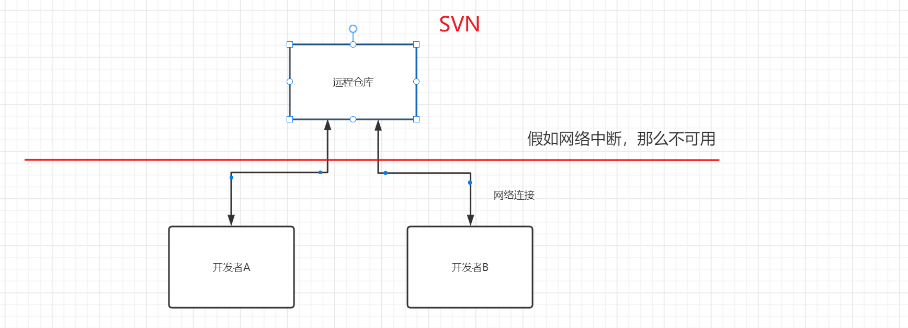


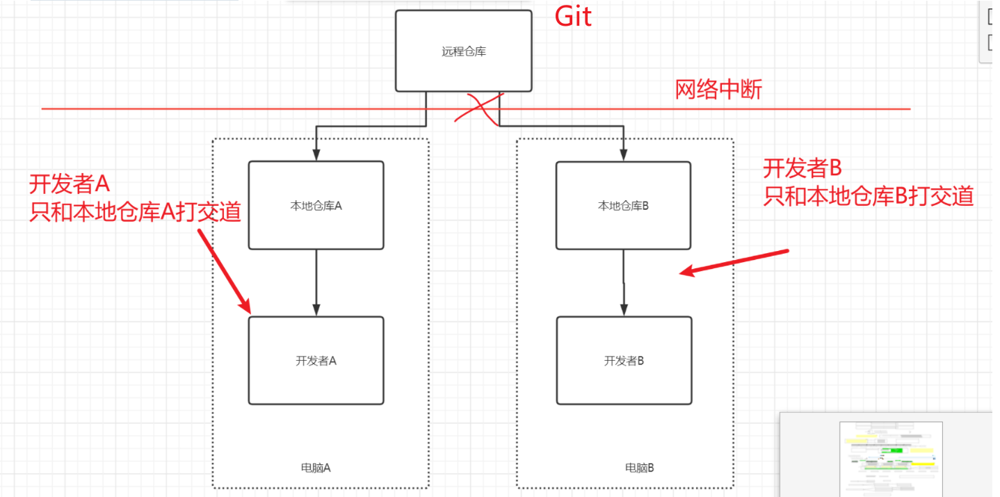


git学了 svn也会用。因为命令基本类似。

## 安装Git

### 下载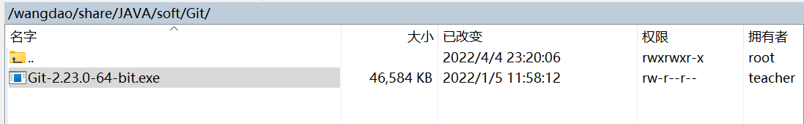

[官方下载地址](https://git-scm.com/downloads)

### 安装

直接傻瓜式安装即可。

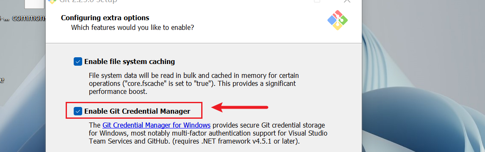

安装的时候，要注意 让Windows 记住登录凭证


## Git的使用

### Git核心流程

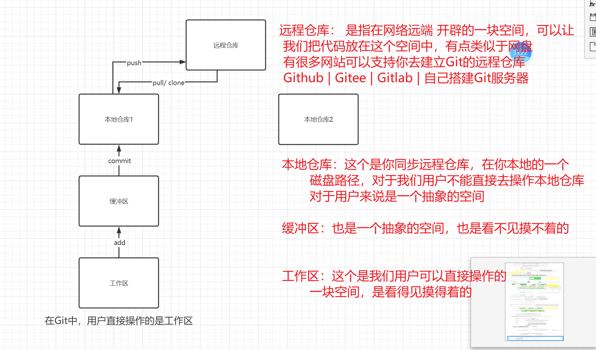

### Git 命令

#### 注册相关网站

以Gitee为例。

- 记住注册的时候 使用的 
  - 用户名（推荐使用英文）
  - 密码
  - 手机号
  - 邮箱(可以注册后自行设置)

密码一定要记得。

#### 建立远程仓库

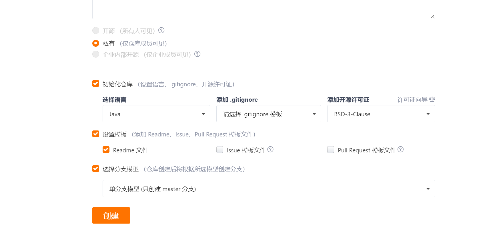

#### clone

把远程仓库，克隆到本地。（一定是第一次）

.git文件夹，是git自己的元信息的一个文件夹，大家不要动。

```shell
# 下载远程仓库的内容，并且在本地创建一个和远程仓库名同名的文件夹
git clone https://gitee.com/common-zhou/test_50th.git

# 克隆远程仓库，到本地，文件夹的名字叫做  test53th1。如果文件夹不存在，会创建一个。
# 如果文件夹存在，会使用这个文件夹。（有个前提，一定是空的。如果不是空的，会报错）
git clone https://gitee.com/common-zhou/test53th.git test53th1

# 指定的文件夹， 存在或者不存在都可以。 但是在，文件夹存在的前提下， 文件夹一定要是空的。
git clone https://gitee.com/ciggar/test-40th.git dirName
```


在git中管理文件的版本，需要使用文本文件。（绝大部分都是文本文件。 其他的文件也可以用git追踪。 ）

.txt .md ;  不要使用docx pptx

比如 properties   html   


在git中，对比文件的变化，是一行一行来进行比较的。所以我们需要追踪文本文件，docx是类似压缩包的文件，没有办法对比每一行。

对于空文件夹， git是忽略的。 

#### status

这个命令可以帮助我们查看工作区和缓冲区中的变化。

<span style='color:red;background:yellow;font-size:文字大小;font-family:字体;'>**工作区中的变化**</span>

<span style='color:green;background:yellow;font-size:文字大小;font-family:字体;'>**缓冲区中的变化**</span>

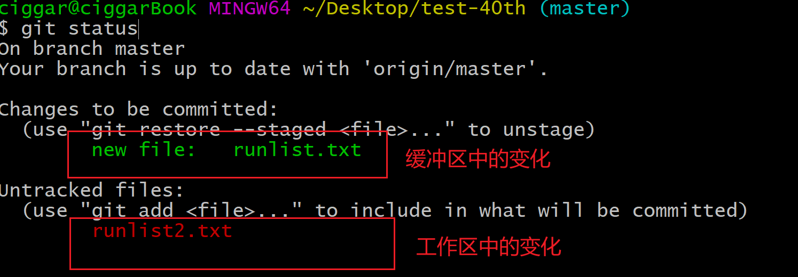

#### add

这个命令可以帮助我们把工作区中的变化提交到缓冲区。

```shell
# 有以下的三种提交方式

# 文件的名字
git add fileName

# 文件的类型，通配符添加
# 只添加 .java文件结尾的文件 。从工作空间提交到缓冲区
git add *.java

# 所有文件
git add .
```

#### commit

我们这个commit，和我们在写论文的时候，什么比较像？提交了一个版本。


commit这个命令可以帮助我们把git仓库中 缓冲区中的内容提交到本地仓库。

<span style=color:red;background:yellow>**第一次提交的时候，需要设置 用户名和邮箱**</span>

有两种设置的方式

- 直接去用户目录下，设置 .gitconfig 这个文件,假如没有这个文件，就创建一个

  ```ini
  [user]
  	name = ciggar
  	email = 291136733@qq.com
  ```

- 执行命令去设置

  ```shell
  # 邮箱
  git config --global user.email 222@qq.com
  git config --global user.name xxx
  ```

设置完之后，就可以提交了，会产生一个版本信息

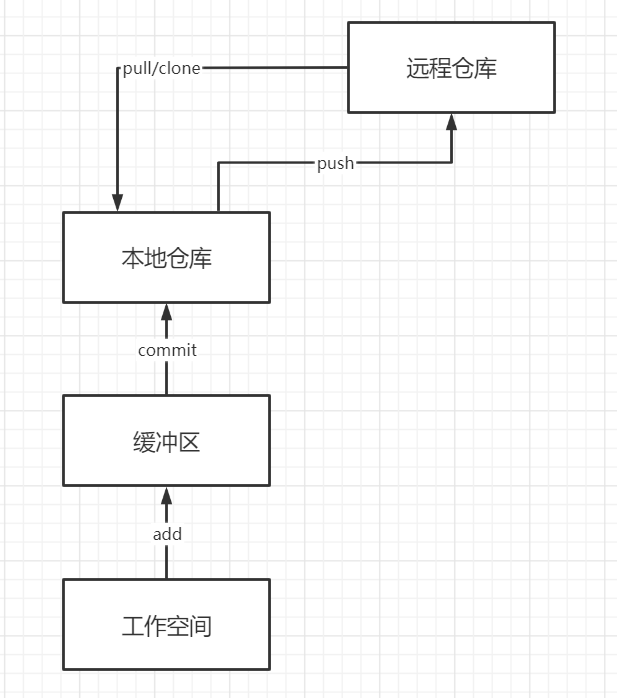


这一步需要大家注意几件事情：

- 这一步会产生一个文件的版本号，只是前7位。
- <span style=color:red;background:yellow>**如果是第一次commit，需要设置用户名和邮件地址**</span>
- 只会把缓冲区中的变化提交到本地仓库，不会把工作区中的变化提交到本地仓库
- commit的时候需要指定提交的信息，提交的信息一般要去设置模板


```shell
# 提交
git commit -m "msg"
## msg:msg信息一般要有统一的格式 例如：描述信息 (issue号)
# 1.描述信息 (issue号)
# 2.(issue号) 描述信息

git commit -m "某某bug的修改"
git commit -m "HashMap的练习"

# 尽量做到，见到描述信息可以知道这次提交是干什么的。
# 不要写什么 1 abc 
```

- 设置完之后，就可以提交了，会产生一个版本信息

  

  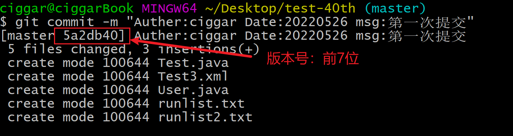

#### push


push这个命令可以帮助我们把本地仓库中的<span style='color:red;background:yellow;font-size:文字大小;font-family:字体;'>**所有变化**</span> 推送到远程仓库。

- 这一步在第一次操作的时候，需要去填写对应用户名和密码(手机号和密码 )

  

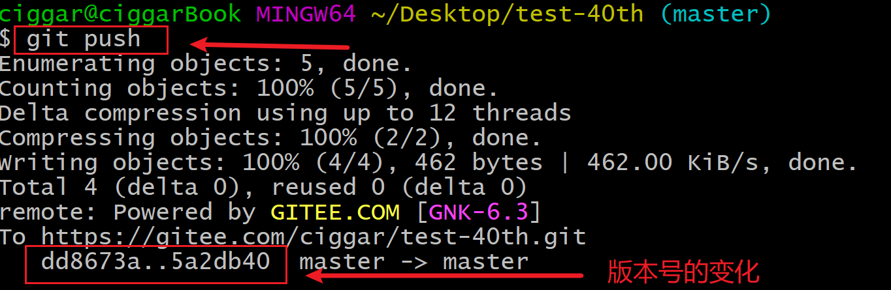

> push的时候，能不能指定文件去 push呢？ 不能

> 只有当本地仓库中的版本领先于远程仓库的时候，才可以push


#### pull

会拉取远程仓库中的所有的变化到本地。并且会显示出版本号

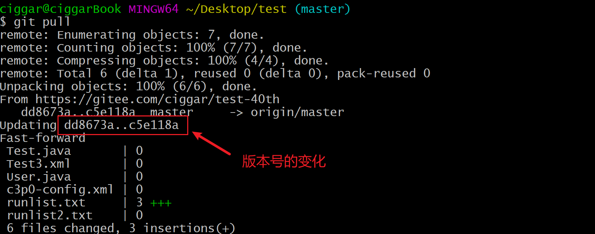

> 当本地仓库中的版本落后于远程仓库的时候，就要pull
>
> “ 落后就要pull”

#### log

查看仓库中的所有的版本信息

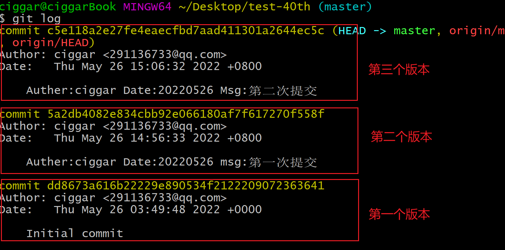


### 协作开发

#### 邀请成员加入仓库

> 不管是 开源的仓库，还是私有的仓库，都是 只有仓库中的成员才能去修改仓库中的代码。
>
> -  开源：所有人都可以访问到
> - 私有：只有仓库指定的成员才能看到

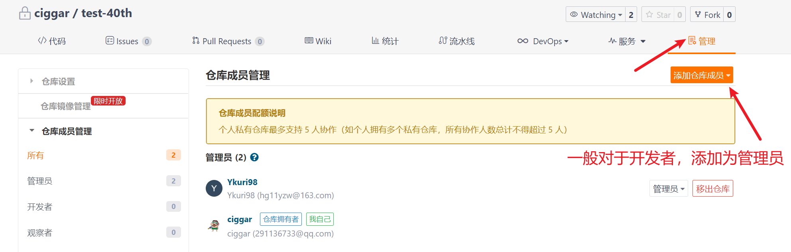


私有仓库只能添加总共五个管理员（带主账号）。所以如果想把整个小组都拉进来，可以把仓库设置成公开仓库，可以添加小组全部成员。


#### 处理冲突

模拟冲突处理流程：

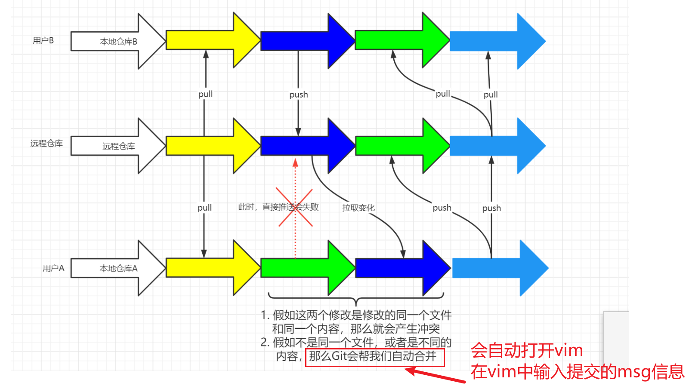


> 总结：
>
> 1.  先push的人不处理冲突，后push的人要处理 冲突
> 2.  和组员一起开发的时候，尽量不要开发同一个文件，很容易产生冲突
> 3.  push之前最好先pull一下，不然可能会push失败
> 4.  - 早上上班之后，第一件事情，拉取最新的代码（pull）
>     - 晚上下班之前，最后一件事情，把最新的本地代码推送上去（push）。<span style=color:yellow;background:red>**代码一定要能编译通过**</span>有没有bug无所谓。


Vim怎样使用

```
1.点击i 表示是编辑。才能输入
2.保存的时候，怎么保存呢？
 点击esc; 输入一个冒号  shift+: (英文状态下) ; 输入wq（保存并退出）
```


冲突的处理

```JAVA
<<<<<<<< HEAD
    
===============
 
>>>>>>>>> fgfskljasdljdlkasjksalk
    
    
// 左到=。就是你自己的代码版本   <<<<<<<<<       -->        ============
    // =到>  是远端的版本      =========       -->        >>>>>>>>>>>>
    
需要告诉git，如果保留代码。 比如是留你的版本，还是留你同事版本。 
 1.留代码
 2.删除分隔符
 3. 处理好所有的冲突之后， git  add . ;  git commit -m "处理和同事1的冲突"
 4. push 。 需要抓紧push，防止别人又push了代码    
```


- 当两个人修改的文件不同。git非常聪明，留最新的。所以我们只用输入一个提交信息，剩下的就交给git完成。 
- 当两个人修改的文件相同，这时候git不知道怎么处理，所以需要你来处理。

### 后悔药

Git给我们提供了一些可以回退的措施，也叫作后悔药。

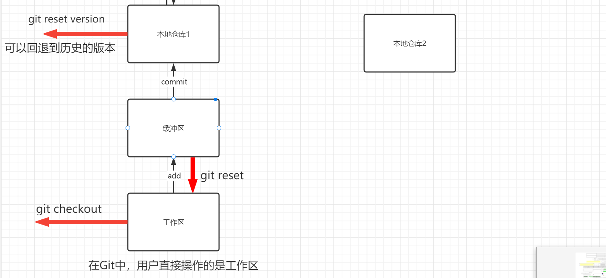


- git checkout

  > 需要指定需要回退的文件
  >
  > ```shell
  > $ git checkout text.txt
  > $ git checkout .
  > ```

  <span style=color:red;background:yellow>**这个命令，危险吗？ 危险！慎用**</span>

  > 注意：回退的内容，是找不回来的，要慎用。比如你写了一天的代码，都是在工作区的。

- git reset

  > <span style='color:red;background:yellow;font-size:文字大小;font-family:字体;'>**把缓冲区中的变化，回退到工作区。注意：git reset不会改变文件中的内容**</span>

  > 问题：能不能指定文件reset呢？ 能

- git reset --hard  version

  

  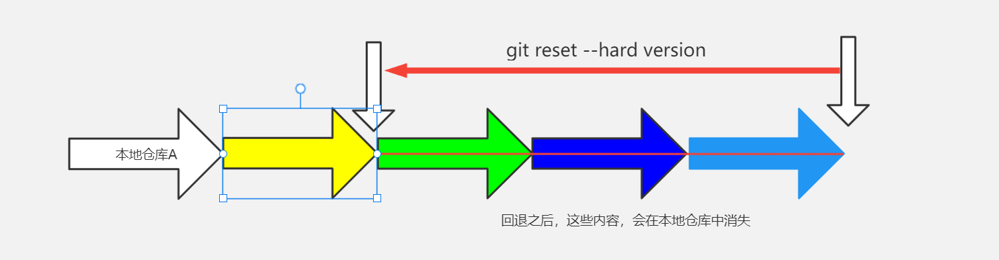


后悔药用的多不多。 

### 忽略文件

git在做版本控制的时候，可以让我们忽略一些文件，不去追踪这个仓库中这些文件的变化。

怎么做呢？

- 可以在Git仓库的根目录下 添加 一个 `.gitignore` 这个名字的文件，可以在这个文件中声明哪些文件不被git追踪版本信息

对于Java项目来说，我们可以忽略哪些内容呢？

```ini
# 单个文件
xxx.txt

# 配置文件夹
.idea

# 配置文件的类型
# idea里面的一个配置文件。 这个也不要。
*.iml

target/*.class

target/
```


> 注意事项：
>
> 1. 忽略文件最好是在创建这个远程仓库的时候，就应该自动创建出来
>
>    
>
> 2. <span style='color:red;background:yellow;font-size:文字大小;font-family:字体;'>**一旦一个文件已经被追踪并且提交到远程仓库中去了，那么再在.gitignore 这个文件中去忽略它的变化，是无效的**</span>


有时候，确实添加的时候忘记了。这时候我还是想忽略它的变化。怎么办？我还想要这个文件。 

- 先删掉（剪切）。 add  commit 。一定要提交一次
- 再把它粘贴回来，这时候，git就不会追踪它的变化了。


## 分支管理

Git分支是Git版本控制系统中的一种重要概念，用于在同一个Git仓库中独立开发多个功能或特性。在Git中，每个分支都代表着仓库中的一个完整版本，并且可以在分支上进行独立的开发和提交。

使用分支的好处是可以让多个人在同一个仓库中同时进行开发，不会相互干扰，同时也可以随时回到之前的某个状态进行修复或重新开发。当一个分支的开发完成后，可以将其合并到主分支或其他分支上。

Git默认创建一个主分支，通常称为“master”或“main”，其他分支可以基于主分支或其他分支创建，每个分支都有一个唯一的名称。在开发过程中，可以在不同的分支之间进行切换，以便进行不同的工作。例如，可以创建一个分支来解决某个bug，同时在另一个分支上开发一个新的功能，而不会影响彼此之间的工作。

总之，Git分支是一种非常有用的功能，可以帮助开发人员更好地管理代码并提高开发效率。

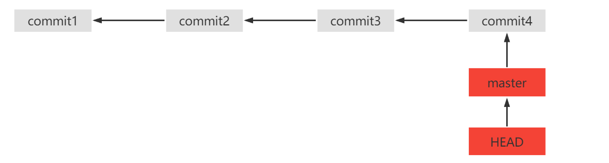


分支操作

```shell
# 查看所有分支
$ git branch

# 创建分支并切换 iss53
$ git checkout -b iss53

# 切换分支
$ git checkout iss53

# 合并分支
$ git merge iss53
```

<span style=color:red;background:yellow>**工作过程中的一般使用步骤**</span>

```SHELL
#  一般会有一个master 主分支
#  会有一个dev分支

# 1. 如果有需求，会从dev拉一个分支，比如 dev-feature1，所有的提交都提交在这个分支上
# 1.1 从dev拉取一个分支，并切换到这个分支
git checkout -b dev-feature1

# 2. 等到开发完成，会把这个分支合并到dev。 dev经过测试，会合并到master
# 2.1先切换到dev分支
git checkout dev 

# 2.2合并刚刚的分支
git merge dev-feature1
```

 

不认识的命令，不要随意去执行。

sudo rm -rf / 

git push -f 


merged的命令。 

## 在idea上进行git操作

首先配置好git路径

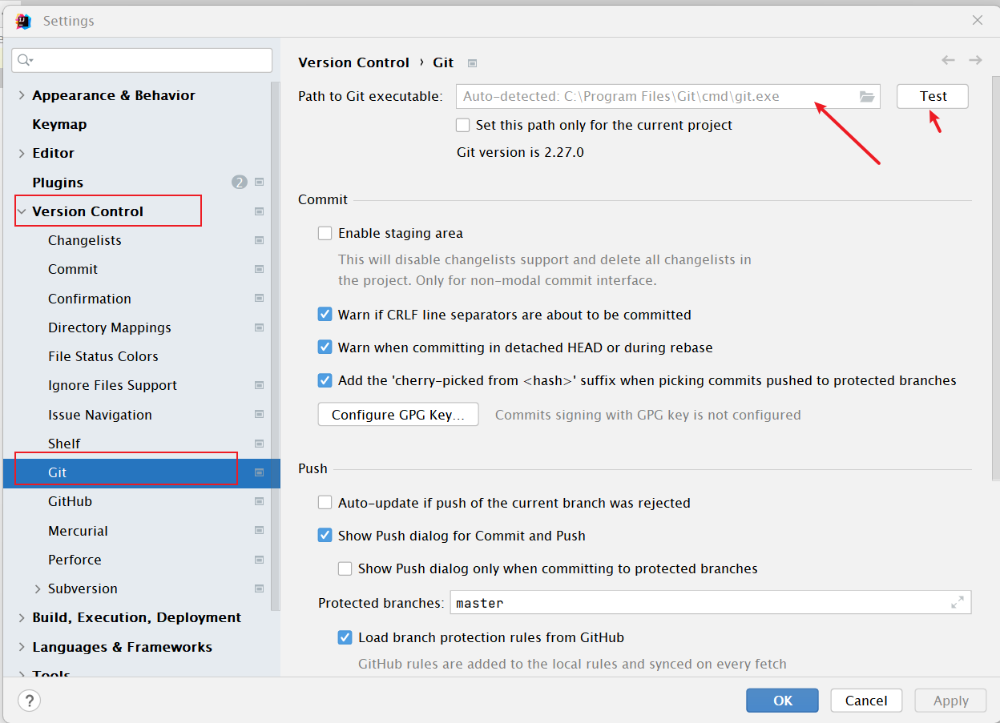

点击Test有版本。就代表配置没问题。 


<font color=red>**如果项目被git追踪了，则idea中会有对应的颜色提示。**</font>

红色代表是新增的文件

蓝色代表是文件有改动

绿色代表已经提交。其他的操作与git基本操作一致。


在文件中，可以看到文件的变动

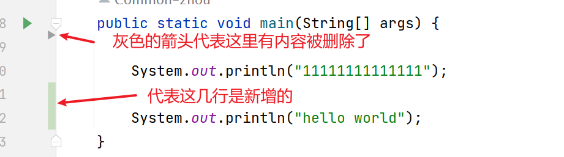


git可以右键，然后add commit 提交信息。


备注：

- 学完之后，要多练习git。把日常的代码，使用git管理起来。因为后面写项目的时候，要大量使用git。
- 先使用命令行，不要使用idea中的可视化。用命令行，你可以清楚的知道发生了什么。
- 多练习一下分支
- 冲突处理一定要会。


可以先在远端建立一个远程仓库，然后拉到本地。然后将自己的项目放进去。 

初始化的方式。 自己搜一下。 


```SHELL
在本地创建一个新的Git仓库，或者如果本地文件夹已经是一个Git仓库，跳过这一步。
cd /path/to/your/local/folder
git init
    
将本地文件夹中的文件添加到Git仓库中。
git add .
提交你的更改。

git commit -m "Initial commit"
在远程Git仓库（如GitHub、GitLab、Bitbucket等）中创建一个新的空仓库，或者如果已有远程仓库，跳过这一步。

将本地Git仓库与远程仓库进行关联。

git remote add origin <remote_repository_URL>
请确保将<remote_repository_URL>替换为远程仓库的URL。

推送本地仓库的更改到远程仓库。

git push -u origin master
这里假设你是在主分支上进行操作。如果你在其他分支上工作，请将master替换为你当前所在的分支名称。

完成以上步骤后，你的本地文件夹和远程Git仓库就已经成功地链接在一起了。
```


如果push分支的时候，出现没有远端分支与之对应。这时候设置一下。 

```JAVA
git push --set-upstream origin dev-1.7
```


**常见问题**

如果在git配置中报错fatal: Authentication failed for ''，其实就是**凭证失败**的意思

解决办法如下：[凭证失败解决](https://blog.csdn.net/TanMengyi/article/details/108623908)

