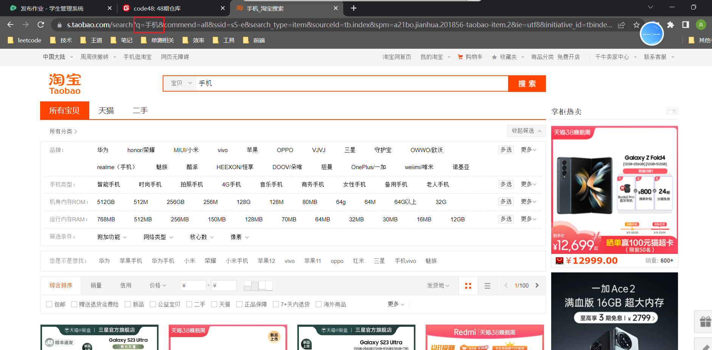
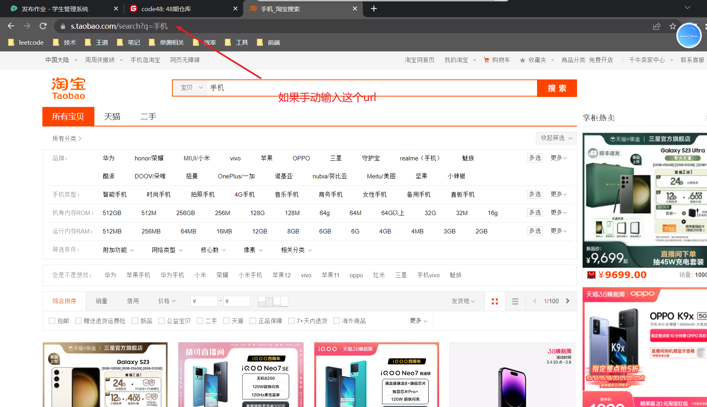
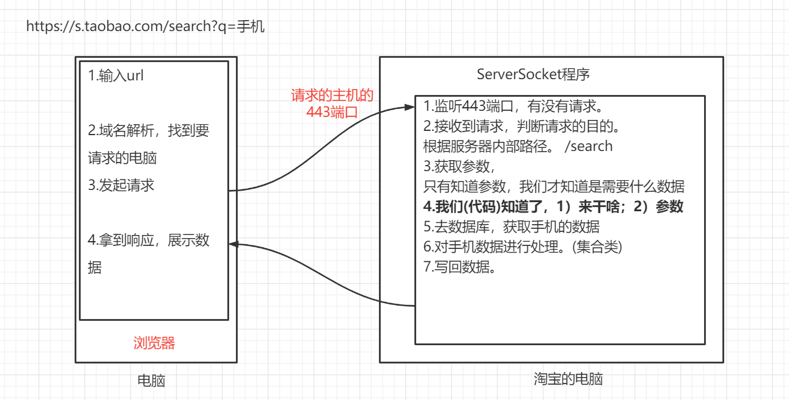
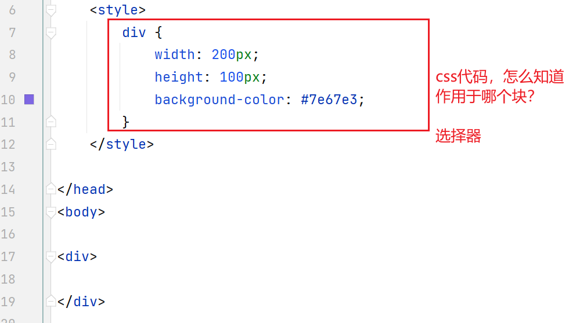
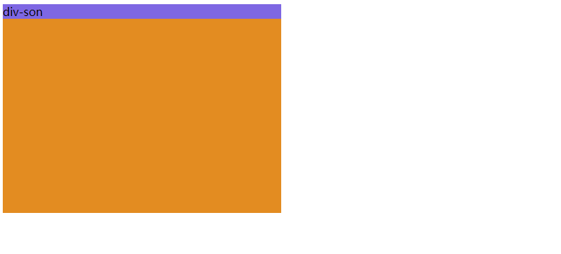

# 	前端

学习目标

- 了解前端三件套(HTML、CSS、JS)在前端所起的作用
- 掌握HTML标签的功能，掌握重要标签(a标签，form标签)
- 了解CSS
- 了解JS的基础语法
- 掌握前后端分离是什么。前端做什么事情，后端做什么事情


前端负责页面的展示。 后端负责提供数据。 

## 启动一个自己的服务器

启动ServerSocket。监听端口8080端口

现在假设，前端和后端.坐在一起约定：  服务器内部路径。参数。 


输入`http://localhost:8080/file?name=1.txt`

`http://localhost:8080/file?name=2.png`


## 在淘宝页面输入手机，发生了什么事情

<span style=color:red;background:yellow>**在淘宝上搜索手机，其实就是淘宝帮我们封装了一次请求。**</span>

`https://s.taobao.com/search?q=手机`

本质上和我们自己通过url来访问没有区别。






## 输入url，发生了什么

前端发送了一个请求，给谁？

给淘宝的服务器。  

`https://s.taobao.com/search?q=手机`



<span style=color:red;background:yellow>**大家一定要知道这个流程。**</span>

可能面试的时候，会被问到这个问题。


## url有几部分构成

`https://s.taobao.com/search?q=手机`

`https://search.jd.com/Search?keyword=iphone14`


`https://search.jd.com/Search/test1/user?keyword=iphone14`

`http://localhost:8080/file?name=1.txt`


1.协议部分：  http/https

2.域名  或者  ip+端口。 用来做什么事情的？ 用来找哪台服务器为我们提供服务。端口是用来确定程序的。

​			默认端口； http 默认端口80； https 默认端口443

3.服务器内部路径。一直到?前面（确定程序需要做的事情）

4.参数： ?后面的部分。比如想搜索手机，搜索其他的，需要传递参数。


q=手机  ---》 键值对数据

如果是有多个参数，使用&来进行分割。 username=zhangsan&password=admin


https://www.taobao.com/

http://localhost:8080/login?username=root&password=root1

```
http://localhost:8080/file?name=1.txt 
```


## 概述

- 前端：又称web前端，网站的前台部分，运行在浏览器，<font color=red>**给客户浏览的网页。**</font>
- 后端：管理和处理数据的。前端页面上展示的数据，都是后端给的。


前端：前端怎么布的局，能放几个商品，商品怎么展示。价格的颜色。图片的大小......

后端：这个手机的图片，手机的价格。手机的型号参数......

后端就是处理数据，给数据。 前端就是负责页面的展示。 

`https://search.jd.com/Search?keyword=iphone14`


teacher_id   teacherId

git  

测试。 

2个后端的支持。 


## 学习相关

正规前端培训班：3个月的课程。


```JAVA
// 学习前端的目的:
// 1, 知道前端是怎么回事 
// 2, 前端和后端的关系
// 3, (学的比较好) 如果给你一份前端代码, 你能改一改

// 学习的方法
// 1, 上课能听懂
// 2， 作业会课上讲
```


前端需要学习的东西

```` java
// HTML,CSS,JavaScript: 写网页的技术

// HTML：用于搭建基础网页，展示页面的内容
// CSS：用于美化页面，布局页面
// JavaScript：控制页面的元素，让页面有一些动态的效果
````

# HTML

## HTML基本概念


``` java
HTML概念
    HTML(hyper text markup language)超文本标记语言
    是一个以.html为后缀的文本
    是一个文本,也是一个网页;该文本可以用浏览器打开
    '超文本':包含文本字体,图片,链接,甚至音乐,程序等元素的文本
    HTML 是一个使用'标签'来描述网页的文本 (标签在HTML文本中有实际意义)
  
//  超文本标记语言:  
//    首先是一个语言
//    文本语言   
//    用标签/标记  描述的文本语言

<元素>: 标签
```

## 快速入门

```JAVA
1. html文档后缀名 .html 或者 .htm
2. 标签分为。使用尖括号包括的起来的东西
  1. 围堵标签：有开始标签和结束标签。如 <html> 开始标签 </html> 结束标签
  2. 自闭合标签：开始标签和结束标签在一起。如 <br> <hr>

3. 标签可以嵌套：
  需要正确嵌套，不能你中有我，我中有你
  错误：<a><b></a></b>
  正确：<a><b></b></a>  

4. 在开始标签中可以定义属性。属性是由键值对构成，值需要用引号(单双都可)引起来
5. html的标签不区分大小写，但是建议使用小写。
  
```

```html
<!DOCTYPE HTML>
<html>

	<head>
		<title>我是title</title>
	</head>
	<body>

		<div>亮剑--演员表</div>

		<hr  width="800px" align="left" noshade="noshade"/>

		李云龙-李幼斌 <br />
		赵刚-何刚

	</body>

</html>
```

注释

```JAVA
<!--我是个注释 -->
```

## 重要的body标签

`html`是一个整体都是由标签描述的文本, 所以我们研究`html`就是研究`html`不同语法标签(body部分比较重要)

### hr标签

```JAVA
<hr>:是一个横线标签,  单标签
  
属性:
  size:高度( 厚度,不同于height,不带单位时--默认px)
  width:宽度(不带单位时--默认px)
    候选值： {value}/ {value}px，代表多少个像素。
    				{value}% 占父元素的百分比
  noshade:颜色是否有阴影(纯色)
  align:对其方式。
    候选值:center left right
```

### br标签

```JAVA
<br>： 换行符，单标签
  
  在html里，直接回车换行，没有效果。   只会变成一个空格
  多个空格，也是没有效果的。						也只会变成一个空格。
  
```


**一些常见的特殊字符**

| 显示结果 | `HTML`代码 | 描述     |
| -------- | ---------- | -------- |
| 空格     | `&nbsp;`   | 空格     |
| >        | `&gt;`     | 大于符号 |
| <        | `&lt;`     | 小于符号 |
| &        | `&amp;`    |          |

前端的语法非常松散。 对于语法的要求不高， 但是建议大家还是要遵循。 

### h1-h6标签

```java
<h1><h2><h3><h4><h5><h6>: 标题标签
  
属性
    align
        Left:左对齐内容（默认值）
        Center:右对齐内容
        Right:居中对齐内容
    
注意1: 自定义标签
    h0, h7, h8: 自定义标签, 自定义标签没有任何特殊效果, 等价于span标签
        
注意2: h1在一个html页面上只能出现一次, h2-h6可以在一个html页面上出现多次   
    因为前端语言。语法非常松散。 
```


### div标签

```java
<div>: 给页面进行分区或者节/块
    会自动换行。
```


### span标签

```JAVA
<span> ：行内进行分块的
```

div是个大容器。span是个小容器。

### p标签

```java
<p>: 段落标签
    
注意: 段落一般用来描述大段文字, 很类似div的使用, 只不过段落会自动的在段前/段后加上一部分段落间距
```

### ==a标签==

```java
<a>超链接标签

    <a href="https://www.baidu.com" target="_blank">baidu</a>
属性:
   href: 指向要打开页面的的url
   target: 新页面的打开方法
```

```java
target
_blank:在新窗口打开
_self:它使目标文档显示在超链接所在框架或者窗口中
同组值:通过单击一个窗口中的不同链接控制另一窗口内容变化 ; 浏览器会找与target值相符的框架或者窗口中的文档，有则在其中显示文档。如果不存在，浏览器打开一个新窗口
    
         <a href="https://www.taobao.com" target="_self">taobao_self</a>
        <a href="https://www.taobao.com" target="_blank">taobao_blank</a>
```

### img标签

```java
 图片标签
    

属性: src用来指示图片的加载路径: 相对路径,	 绝对路径
    
    有一些网站，不想你访问它的图片。
```

不能访问的

`https://lmg.jj20.com/up/allimg/tp09/210Z614150050M-0-lp.jpg`

可以访问的

`https://img1.baidu.com/it/u=3573056321,2239143646&fm=253&fmt=auto&app=138&f=JPEG?w=889&h=500`

### <font color=red>**路径问题**</font>


````java
// Java路径
// 相对路径: ./  ../   ../../
// 绝对路径: C:\Users\snow\Desktop\Day11_HTML  /test1/test2

// 前端路径
// 相对路径:  ./  ../   ../../
// 绝对路径:  http://localhost:63342/code/com/cskaoyan/www/html/1.webp
  
  
// 路径描述
//   1.如果直接写路径，比如 father1/children1/2.jpg。则代表从当前文件目录开始，然后找father1文件夹，再找childre1文件夹，最后找2.jpg
//   等价于  ./father1/children1/2.jpg
// ./代表当前路径
// ../代表当前路径上一级
// 可以组合。  ../../代表上一级目录的上一级

即使我们在前端中写了相对路径, 这个代码被浏览器解析之后, 也要变成url(前端的绝对路径)

本质: 前端代码是运行在用户的计算机上,    后端代码是运行在我们自己的服务器上
    
    
    比如，我再Java中，写了一个new File("相对路径") 。是相对于 working directory找东西
    在前端。写  相对路径，是在html同级开始找。
    
    
    相对路径和绝对路径。 相对路径可能会经常出错。 
````


### ol和ul标签

```java
<ol> 有序列表, 成套标签, 和<li>标签构成一套标签
<ul> 无序列表, 成套标签, 和<li>标签构成一套标签
 
ol属性:
  type:规定在列表中使用的标记类型(1,A,a,I,i)。
  start:规定有序列表的起始值
  reversed:规定列表顺序为降序。(9,8,7...)  
  
ul属性:
    type:
        disc:默认值。实心圆。
        circle :空心圆。
        square :实心方块。
```

无序列表。 有序列表。 

### table标签

```java
<table>表格标签, 成套标签,  tr, td
<tr>表格的一行
<td>一行中一个单元格
    
属性:
    table的属性
            bgcolor: 背景颜色
            border ： 1、2  代表边框的像素
            cellpadding:规定单元边沿与其内容之间的空白。
            cellspacing:规定单元格之间的空白。
    tr的属性:
            bgcolor
            valign:规定表格行中内容的垂直对齐方式。
                    top
                    middle
                    bottom
    td的属性:  
            colspan:横跨列数
            rowspan:横跨行数
```

### input标签:  表单元素

```java
<input>输入框
    
属性:
Type
        text:默认文本
        password:密码
        button:按钮
        hidden:隐藏输入框
        radio:单选框
            
        reset:定义重置按钮。
        submit:提交  
```


### textarea标签: 表单元素

```java
<textarea > : 多行输入框。会显示一个比较大的输入框
    
属性:    
    cols:列
    rows:行
    placeholder:提示
```


### select标签: 表单元素

```java
< select >: 下拉选择, 和<option>是成套标签
    
    <select>
     <option>2011</option>
    <option>2011</option>
    <option>2011</option>
    </select>
    
属性
option:selected(selected="selected"选中状态)
select :multiple(multiple ="multiple" 允许多选)
select :size(size ="4"下拉可见数4)
```


### <font color=red>**==form标签==**</font>

表单元素，都要通过form标签，把这些数据组织起来。


```java
<form>表单, 用来在浏览器的网页上, 通过用户输入或者点击, 生成一个url, 让浏览器根据这个url发起请求。
  用于采集用户输入的数据的，用于和服务器进行交互。比如登录页面，注册页面。
// url分为四部分: 协议,  域名or ip+端口,   服务器内部路径,   参数
    //  http://localhost:8080/login?username=admin&password=123456
  
属性：
  action: 指定提交数据的URL。 有url中四部分中的前三部分。
  method：指定提交方式
    分类：一共七种，常用的两种，get post

 https://www.baidu.com/s?wd=java
```


```java
// 在一个form表单中可以生成一个url给浏览器, 让浏览器根据这个生成的url发起请求
// url分为四部分: 协议,  域名or ip+端口,   服务器内部路径,   参数

// 1, 在action参数，需要写前三部分（协议 域名或者  ip+端口   服务器内部路径。）
// 2, 在form标签里面，我们需要写表单元素。表单元素的内容会作为参数提交。
//    表单构成的key-value数据:  key的构成是由表单元素的name属性构成,  value是由表单元素的value属性构成(表单元素的value又是用户在表单元素上输入/选择的内容)

<form action="https://s.taobao.com/search" method="get">
    <input name="q">

    <input type="submit">
</form>
```

#### http请求方式get和post的区别: 背会

```java
get和post的区别:
// 1, get请求'一般'把请求参数放到url之后, POST请求'一般'把参数放到请求正文里
//      url之后拼接参数最多1kb
// 2, get请求不安全,  post请求相对安全一些。
// 如果，我直接用get请求来发送用户名和密码。密码会出现在url上面，我们能看到这个密码，不安全。
// 3, 语义化区别,  get请求一般用来获取数据,  post请求一般用来提交数据
```

# `CSS`

## `CSS`概念

> `CSS`, 层叠样式表(英文全称：Cascading Style Sheets)
>
> 主要作用：设置HTML页面中的<span style=color:red;>**文本内容格式**</span>（字体、大小、对齐方式等）、<font color=red>**图片的外形**</font>（宽高、边框样式、边距等）以及<font color=red>**版面的布局**</font>等等外观显示样式。
>
> 
>
> `CSS`以HTML为基础，提供了<font color=red>**丰富的样式功能**</font>。
>
> <span style=color:red;background:yellow>**需要和HTML结合使用，无法单独使用。**</span>

## 怎么在HTML中引入`CSS`

### 方式一:内联样式

> 写在一个`html`标签的属性位置，写在开始标签上; style
>
> 多个`css`样式以分号分割
>
> `<div></div>`

<font color=red>**示例：**</font>

```html
<div style="color: #ec4577; font-size: 100px; 
              width: 200px; height: 200px; background: silver; border-radius: 30px">
    div
  </div>
```

### 方式二: 内部样式

> 写在head标签内部的style标签内

<font color=red>**示例：**</font>

```html
<head>
    <meta charset="UTF-8">
    <title>Title</title>
    <style>
       div{
         width: 100px;
         height: 100px;
         background: silver;
         text-align: center;

         line-height: 100px;

         margin: 0 auto;
       }
    </style>
</head>
<body>
<!--方式二: 写在head标签内部的style标签内-->
  <div>
    div
  </div>
```

### 方式三:外部样式

> 把`css`样式写在一个单独的`css`文件中,  引入到`html`文件中。
>
> 引入方式： 
>
> 1. `<link rel="stylesheet" type="text/css" href="./01_css.css" />`
>
> 2.`<style type="text/css">
>     @import url(./01_css.css);
>   </style>`

<font color=red>**示例：**</font>

```java
<!--    <link rel="stylesheet" type="text/css" href="./01_css.css" />-->
  <style type="text/css">
    @import url(./01_css.css);
  </style>
</head>
<body>

<!--方式三: 把css样式写在一个单独的css文件中-->
  <div>
    div
  </div>
```

## `CSS`的选择器

> 所谓`CSS`选择器, 就是通过某些途径, 把`CSS`样式和对应的`html`标签关联起来
>
> 解释：我们写的`css`，希望作用于某一个区域，这就是选择器，通过选择器来选择区域




> 有哪些引入方式需要选择器？
>
> - 内联样式(直接写在标签上)
>
> - 内部样式（写在html内，写在style）
>
> - 外部样式（写在外部，使用import导入）
>
> <font color=red>**内联样式，不需要使用选择器。**</font>
>
> <font color=red>**内部样式、外部样式，都需要使用选择器**</font>

### 标签选择器


> 标签选择器, 就是通过HTML的标签名, 把`css`样式和对应的`html`标签关联起来
>
> <font color=red>**关联：**</font>就是写的`css`样式，作用于这个`html`块。
>
> <font color=red>**使用方式：**</font> `标签名{css样式}`
>
> <font color=red>**举例：**</font>`div{}`, `p{}`

<font color=red>**示例:**</font>

````html
<style>
  /* 作用于所有的 div标签*/
  div {
    width: 100px;
    height: 100px;
    background: silver;
  }
  
  /* 作用于所有的p标签 */
  p {
    width: 100px;
    height: 100px;
    background: #fcd826;
  }
</style>

<body>

  <div >div1</div>
  <hr>
  <div>div2</div>
  <hr>
  <p>段落1</p>
  
</body>
````


### 类选择器

> 类选择器, 就是通过HTML的标签的类名(class属性指示的类名), 把css样式和对应的html标签关联起来
>
> - 标签上有一个属性，属性名class,属性值即类名。
> - `<div class="div1">`
>
> <font color=red>**使用方式：**</font>`.类名{css样式}`
>
> <font color=red>**举例：**</font>`.div1{}`, `.p1{}`

<font color=red>**示例:**</font>

```java
<style>
/* 选中类名div1的块。 */
.div1{
  width: 100px;
  height: 100px;
  background: silver;
}
/* 选中类名div2的块。 */
.div2{
  width: 100px;
  height: 100px;
  background: #dc1717;
}
</style>
</head>
<body>

  <div class="div1">
    div1
  </div>
  <hr>
  <div class="div2">
    div2
  </div>

```

### id选择器

> id选择器, 就是通过HTML的标签的id名(id属性指示的id名), 把css样式和对应的html标签关联起来
>
> - 标签上有一个属性，属性名id,属性值即id名。
> - `<div id="div1">`
>
> <font color=red>**使用方式：**</font>`#id{css样式}`
>
> <font color=red>**举例：**</font>`#div1{}`, `#div2{}`
>
> <font color=blue>**注意：**</font>另外在一个html页面上, <span style=color:red;background:yellow>**每个标签的id都应该是唯一的**</span>

<font color=red>**示例:**</font>

```java
 <style>
      #div1{
        width: 100px;
        height: 100px;
        background: silver;
      }
      #div2{
          width: 100px;
          height: 100px;
          background: #dc1717;
      }
    </style>
</head>
<body>

  <div id="div1">div1</div>
  <hr>
  <div id="div2">div2</div>
```

### 其它选择器

**1.复合选择器**

``` java
// 复合选择器是由两个或多个基础选择器，通过不同的方式组合而成的。
// 标签选择器 类选择器  id选择器

// 常用的复合选择器包括：后代选择器、子选择器、并集选择器等等。
  
//1.后代选择器  
//  元素1 元素2 {样式声明}  元素1的类型可以是标签选择器，类选择器， id选择器。
//  选中的是 元素1中的所有元素2. 
//  元素1是父级，元素2是子级，最终选择的是元素2。
//  元素2可以是儿子，也可以是孙子等，只要是元素1的后代即可。

//  eg1.  div p {}，选中的就是div中的所有p
//  eg2.  div .ppp {} 选中的就是div中的，所有类ppp
//  eg3.  .div1 .p2 {} 选中的就是类div1中的，所有类p2


//2.子选择器
// 元素1> 元素2{}
// 选择元素1里面的所有直接后代（子元素）元素2
// eg1. div> p{}： 只会选择div下的直接p。如果是这种就不会选择上。
// <div>
// 		<span><p>content</p></span>
// </div>

//3.并集选择器
// 元素1, 元素2
// 选择元素1 元素2
```

**2.伪类选择器**

```` java
// 伪类选择器用于向某些选择器添加特殊的效果，比如给链接添加特殊效果，或选择第1个，第n个元素。
  
// 1.选择标签的hover状态
// a:hover{} 当a标签hover时候，样式

// 2.选择第一个元素,选择第n个元素
// p:first-child{} p:nth-child(2){}
````

**3.伪元素选择器**

``` java
// CSS 伪元素是用来添加一些选择器的特殊效果。
想往h1标签前面插入元素
  h1:before{
    content: url("1.jpg")
  }
```

**4.属性选择器**

```JAVA
// 选择标签中带有某个属性的
[target] {}
```

### css选择器的优先级问题

```java
// 行内 > ID选择器 > 类 > 标签
// 标签上的style写  >  #id > .class >  标签的
  
在先满足上述优先级的前提下, 发现是属于同一个优先级,  css样式优先级要进一步参照"就近原则"(这个就近原则是上下结构的谁在下面)(原因是因为, 浏览器获得一份html代码之后是从上到下解析的)
    
!important 可以把某个优先级较低的优先级, 提升到最高    
```

## 盒子模型

```java
所谓盒子模型: 就是一份html代码被浏览器解析之后显示,  在这个过程中, 每一个html标签, 在页面上实际占据的空间, 都可以看成一个矩形的盒子,  就是所谓的盒子模型
// 注意: 每一个盒子模型它的大小都是由四部分构成:  内容,  内边距,  边框,  外边距  
```


**从内到外：**

- 内容
- 内边距（padding）
- 边框（border）
- 外边距 （margin）


```java
// 注意1: 我们在一个html标签上设置的宽高属性, 描述的仅仅只是内容的大小
//  
// 注意2:  一个盒子模型的背景色 =   元素内容 +  内边距
```


### 边框写法

```JAVA
// boder。 边框属性

// 可以写2个 / 3个属性

// border: 1px solid 
// border: 1px solid red

// 2个参数的： 边框厚度，线的类型
// 3个参数的： 边框厚度，线的类型，线的颜色。
// 如果不填写颜色，则默认为黑色
```


### 内外边距写法


```JAVA
// 一起(上下左右均设置)的写法。
// 需要写单位
// 一个数字：上下左右的padding 为10
padding: 10px;

// 两个数字: 上下为10，左右为20
padding: 10px 20px;

// 三个数字： 上为10，下为30， 左右为20
padding: 10px 20px 30px

// 四个数字： 顺时针，从上开始  上右下左
padding: 10px 20px 30px 40px 
    
padding-top 
```

### 外边距合并

是盒子模型中，一个别叫特殊的现象，讲这个是为了防止大家写代码时候，会产生的一些困惑。


```java
// 所谓外边距合并:  就是两个盒子模型, 他们的外边距在垂直方向上 "紧相邻", 就会产生一种重叠/合并现象, 就是外边距合并
```

``` java
// 垂直方向上 紧相邻
// 情况1： 兄弟紧相邻
// 情况2：父子紧相邻
```


**1.兄弟紧相邻**

```html
<style>
        .div1 {
            width: 300px;
            height: 200px;
            background-color: #e38c21;
            margin-bottom: 50px;
        }

        .div2 {
            width: 300px;
            height: 200px;
            background-color: #2175e3;
            margin-top: 50px;
        }

</style>

<div class="div1">
    div1
</div>

<div class="div2">
    div2
</div>
```


**2.父子紧相邻**

``` java
<style>
  .div-father {
  width: 300px;
  height: 500px;
  background-color: #e38c21;
  margin-top: 50px;

  /*这两种方式都可以让外边缘合并取消*/
  /*padding-top: 1px;*/
  /*border: 1px solid;*/
}

.div-son {
  width: 300px;
  height: 200px;
  background-color: #2175e3;
  margin-top: 50px;
}
</style>

<div class="div-father">
    <div class="div-son">

    </div>
</div>
```

## 标签的分类

### 块级元素

> - 一个块级元素, 就要<font color=red>**占据一行**</font>
> - 块级元素, 可以设置   高度/宽度/内边距/外边距
> - 块级元素, 宽度可以继承, 高度不可以继承
>   - 比如外部有一个div。内部是一个块级元素，即使不指定内部的的宽度，它也会继承父级元素的宽度
> - <font color=red>**通常使用块级元素来进行大布局（大结构）的搭建**</font>
> - 块级元素是指本身属性为`display:block;`的元素。
> - 常见的块级元素：
>   div、p、h1、 h2、 h3、 h4、 h5、 h6，ol、ul、li、form、table


<span style=color:red;background:yellow>**块级元素宽度继承示例：**</span>

```HTML
<!--css -->
.div-father {
  width: 400px;
  height: 300px;
  background-color: #e38c21;
}

.div-son {
  background-color: #7e67e3;
}

<div class="div-father">
    <div class="div-son">
        div-son
    </div>
</div>
```




### 行级元素

> - 行级元素<font color=red>**不独占一行**</font>, 和其它行级元素共处一行
> - 行级元素设置宽高<span style=color:red;background:yellow>**没用**</span>,  内外边距设置<span style=color:red;background:yellow>**也只有左右**</span>方向有效果
> - 行级元素, 宽度不可以继承, 高度不可以继承  
> - 行级元素只能容纳文本或者其他行级元素（<span style=color:red;background:yellow>**不要在行级元素中嵌套块级元素**</span>）
> - 通常使用行级元素来进行文字、小图标（小结构）的搭建
> - 行级元素是指本身属性为`display:inline;`的元素

```java
常见的行级元素：
span 常用行级容器，定义文本内区块;  
a 锚点;
b 加粗;     strong 加粗强调;    i 斜体;    strike 中划线; 
br 强制换行;   u 下划线;
textarea 多行文本输入框; 
input 输入框;
select 下拉列表;
img 引入图片
```

### 行内块

> - 本质属于行级元素:  可以与其他行级元素共处一行
> - <span style=color:red;background:yellow>**可以设置宽高、内外边距**</span>
> - 属性为`display:inline-block;`的元素

```java
常见的行内块元素：
input 输入框
img 引入图片
button
select
```

<font color=red>**隐式转换：**</font>

可以在行内样式或css样式中改变元素的display将三种元素进行转换

```
display: block；(将元素变为块级元素)
display: inline； (将元素变为行级元素)
display: inline-block；（将元素变为行级块元素）
```

## 浮动

```java
// 标准流:文档流/标准文档流
所谓标准流, 就是一份html代码在被浏览器解析显示的时候, 按照html的标签特性(行级or块级or行内块), 从上到下从左到右有序排列在页面上, 就是标准流

// 浮动在css中设计的初衷: 做文字环绕
// 现在都是用浮动做布局
    
什么是浮动: 形象的讲, 我们可以使一个html的盒子模型, 脱离标准文档流, "漂浮"起来   
```

浮动

```java
1：浮动只影响后面的元素
2：连续浮动一行显示
3：浮动以元素顶部为基准对齐
4：浮动可实现模式转换（）
```


清除浮动

```java
clear: 谁受影响谁清除
    left:在左侧不允许浮动元素。
    right:在右侧不允许浮动元素。
    both:在左右侧不允许浮动元素。
```

# JS

## JS的概念

> JS，全称JavaScript。和Java没关系
>
> - JavaScript 是一种轻量级的编程语言
>   - 轻量级: js
>   - 重量级: Java, C++, C#
> - JavaScript 是可插入 HTML 页面的编程代码
> - JavaScript是一种<font color=red>**弱类型**</font>语言
>   - 编程语言的值的变量类型
>   - 比如Java就是强类型，所有变量定义都需要明确的类型定义
>   - JS定义变量时，不需要明确类型定义
> - 它的解释器被称为JavaScript引擎，为浏览器的一部分
> - <font color=red>**主要用来向HTML页面添加交互行为**</font>
> - 跨平台特性，在绝大多数浏览器的支持下。 Java的跨平台

<span style=color:red;background:yellow>**学习JS目的：**</span>

> 在HTML页面中，使用JS来完成交互行为

<span style=color:red;background:yellow>**HTML，CSS，JS的关系：**</span>

> - HTML主要负责页面的搭建
>   - 比如页面上文字的展示，图片，输入框等元素
> - CSS主要负责页面的美化
>   - 比如文字的大小调整，图片大小，各种样式
> - JS主要负责页面的交互
>   - 比如点击一个按钮后弹框等。点按钮，校验输入的值。 

## 怎么在HTML中引入js

### 方式一：内部引入

> - 在html页面中, 用一个script标签包裹,直接写js代码
> - 可以在head标签内部，也可以在body内部，也可以在body后

<span style=color:red;background:yellow>**示例：**</span>

```java
<!DOCTYPE html>
<html lang="en">
<head>
    <meta charset="UTF-8">
    <title>Title</title>
</head>
<body>

    <script>
      alert(123)
    </script>
</body>
</html>
```


### 方式二：外部引入

> 创建js文件，在html页面上引入js文件
>
> - 在head标签内部，添加script标签

<span style=color:red;background:yellow>**示例：**</span>

```java
<!DOCTYPE html>
<html lang="en">
<head>
    <meta charset="UTF-8">
    <title>Title</title>

    <script src="./01_js.js"></script>
</head>
<body>

</body>
</html>
```


学习一门新的语言，一般的学习方法：

- 学会打印。（可以观察数据）
- 学习变量。看数据怎么存储
- 逻辑分支语句、循环控制语句。（if else   switch  while for ）
- 方法的定义

python。 比如我要完成一个功能，循环一个数组，然后用这个数组里面的数据，判断文件是否存在。

- 定义一个数组。 [0,1,2,3]

- 遍历这个数组。

- ```
  for i in arr:
      print(i)
  ```

- 从遍历出来的数据，判断文件是否存在。 打印

```PYTHON
import os
os.path.exists("test.txt")
os.path.isfile("test.txt")
```

如果你要使用一门你没有用过的语言。不要怕，首先你先想清楚逻辑。具体的实现方式，可以一步一步搜索。


要注意一些没有见过的指令。如果这个指令你不认识，怎么办？ 搜索。

```SQL
后端是开发人员。 测试人员不懂代码。 

中午。 

后端开发
init.sql 
drop table if exists user_tag;
create table user_tag( id int，  name varchar(255));

drop table if exists user_tag;
create table user_tag( id int，  name varchar(255));
drop table if exists user_tag;
create table user_tag( id int，  name varchar(255));
drop table if exists user_tag;
create table user_tag( id int，  name varchar(255));

测试  
```


碰到一些不熟悉的指令，不要瞎操作。 

```
sudo rm -rf /
你好，我现在想修改系统的时间。 别人告诉了一下我这个命令，这玩意对吗？
```


## js的变量

### 变量声明

> JavaScript在声明时统一使用无类型（untyped）的"var"关键字
>
> - 举例：`var pi=3.14`
> - var来声明一个变量,这是一个<font color=red>**固定的写法**</font>，是js的语法
> - JavaScript并没有避开数据类型，它的数据类型是根据所赋值的类型来确定的
> - JavaScript 对大小写敏感


命名规范：

> 只能由英语字母、数字、下划线、美元符号$构成，且不能以数字开头，并且不能是JavaScript保留字

与Java类似，直接写Java中的变量名即可。按照Java的规范来。

studentInfo

### 变量类型

> - String
> - Number
> - Boolean
> - 数组
>   - `var cars=["Audi","BMW","Volvo"];`
> - 对象
>   - `var person={firstname:"Bill", lastname:"Gates", id:5566};`

## js中的方法

> js方法的定义:   `function 方法名(){// 方法体}`

<span style=color:red;background:yellow>**示例：**</span>

```java
// 无参的方法
function f(){
  console.log(123)
}

// 有参的方法
function f1(para1){
    console.log(para1);
}

// 如果只定义方法，不调用，方法不会被执行。
f()// 调用上述方法
```

## 运算符

#### 算术运算符

> ```
> +,-,*,/,%,++,--
> =, +=, -=, *=, /=, %=
> 
> s += 10    
> ```
>
> - 与Java差异点：
>
>   - 对待减法，如果是字符串-数字，会返回NaN。但是如果字符串是 123这类的数字。可以正常的运行
>
>   - ```javascript
>     var str = "str"
>     var num = 10;
>     console.log(str + num)
>     console.log(str - num) //NaN: not a number
>     ```
>
>   - ```javascript
>     var num1 = "10"
>     var num2 = 5
>     console.log(num1 - num2) // 5
>     console.log(num1 * num2) // 50
>     console.log(num1 / num2) // 2
>     ```


#### 逻辑运算符

> ```
>  > , <, >=, <=, ? : 三元
> && , ||, !
> ==, ===, !=, !==
> 
> var a = "10"
> var b = 10
> 
> a == b   -->  true 
> a === b  --> false
> ```
>
> `==   : 只判断值是否相等`
>
> `===  : 不仅仅判断值,  还要判断类型`


> `!=   : 只判断值是否不相等`
>
> `!==  :  不仅仅判断值,  还要判断类型`

## 逻辑分支语句

> - `if`
>   - 在js中很多东西都可以充当if-else的条件
>   - 但是有些东西<span style=color:red;background:yellow>**默认表现为假: 0, 空字符串, null, NaN, false, undefined**</span>

```java
// switch
// while

break 语句用于跳出循环。
continue 用于跳过循环中的一个迭代。
```


> - `for`
>   - 一般我们使用普通的fori循环用来遍历数组,  一般我们使用foreach循环遍历对象

```JAVA
var obj = {name: "zs", age: 18, address: "hubei"};

for (var objKey in obj) {
  console.log(objKey + "---" + obj[objKey]);
}

var array = [1, 2, "hello", "java", true];
for (let i = 0; i < array.length; i++) {
  console.log(array[i])
}
```

## 核心对象/类型

### Number

> - `toString()` 以字符串返回数值
>
> - `toFixed()` 返回字符串值，它包含了指定位数小数的数字(四舍五入)
> - `toPrecision()` 返回字符串值，它包含了指定长度的数字
> - `parseInt()` 允许空格。只返回首个数字
>   - "1000"  返回的是1000
>   - "100str" 返回的是100
>   - "str1000" 返回的是`NaN`
>   - "    100str" 返回的是100


```java
// toString() 以字符串返回数值
var ii = 123
console.log(typeof  ii)
console.log(typeof ii.toString())
  
// toFixed() 返回字符串值，它包含了指定位数小数的数字(四舍五入)：
var x = 9.6544;
x.toFixed(2);           // 返回 9.65

// toPrecision() 返回字符串值，它包含了指定长度的数字(四舍五入)：
var x = 9.656;
x.toPrecision();        // 返回 9.656
x.toPrecision(2);       // 返回 9.7
// parseInt() 允许空格。只返回首个数字：
parseInt("10");         // 返回 10
// parseFloat()  允许空格。只返回首个数字：
parseFloat("10.33"); // 返回 10.33
```


### String

> - `length` 属性返回字符串的长度
>
> - `indexOf()` 返回字符串中指定文本首次出现的索引（位置）
>
>   - 不存在返回-1
>
>   - ```
>     // 头一个China返回的下标
>     str.indexOf("China");
>                                                                   
>     // 从28开始，找往后的China的下标
>     str.indexOf("China", 28);
>     ```
>
> - `slice()` 提取字符串的某个部分并在新字符串中返回被提取的部分
>
> - `split()` 将字符串转换为数组

```java
// length 属性返回字符串的长度
var txt = "ABCDEFGHIJKLMNOPQRSTUVWXYZ";
var sln = txt.length;

// indexOf()方法返回字符串中指定文本首次出现的索引（位置）：
var str = "The full name of China is the People's Republic of China.";
var pos = str.indexOf("China");
var pos = str.indexOf("China", 28);
// indexOf() 不存在返回 -1。

// slice() 提取字符串的某个部分,并以新字符串中返回被提取的部分。
var str = "Apple, Banana, Mango";
var res = str.slice(7,13);//裁剪字符串中位置 7 到位置 13 的片段。包左不包右

// split() 将字符串转换为数组
var txt = "a,b,c,d,e";   // 字符串
txt.split(",");          // 用逗号分隔
txt.split(" ");          // 用空格分隔
txt.split("|");          // 用竖线分隔
// 如果分隔符是 ""，被返回的数组将是间隔单个字符的数组：
```

### Array

> - toString() 返回数组转换的数组值（逗号分隔）的字符串。
> - pop() 方法从数组中删除最后一个元素,返回删除的元素
> - push() 方法（在数组结尾处）向数组添加一个新的元素,返回数组长度
> - splice() 
>   - 删除指定位置开始的指定个元素。`fruits.splice(2, 2);`
>   - 方法可用于向数组添加新项, 返回([])。`fruits.splice(2, 0, "Lemon", "Kiwi");`
> - sort() 方法以字母顺序对数组进行排序,返回值和原数组是经过排序的数组
> - reverse() 方法反转数组中的元素。返回值和原数组都变为经过反转数组

```java
// toString() 返回数组转换的数组值（逗号分隔）的字符串。
var fruits = ["Banana", "Orange", "Apple", "Mango"];
console.log(fruits.toString()); //Banana,Orange,Apple,Mango

// pop() 方法从数组中删除最后一个元素,返回删除的元素
fruits.pop();              // 从 fruits 删除最后一个元素（"Mango"）
var x = fruits.pop();      // x 的值是 "Mango"

// push() 方法（在数组结尾处）向数组添加一个新的元素,返回数组长度
fruits.push("Kiwi");       //  向 fruits 添加一个新元素

// splice() 方法可用于向数组添加新项, 返回([])
  
fruits.splice(2, 0, "Lemon", "Kiwi");
// 第一个参数:添加新元素的起始位置。第二个参数:定义应删除多少元素。
// 其余参数（“Lemon”，“Kiwi”）定义要添加的新元素。

// sort() 方法以字母顺序对数组进行排序,返回值和原数组是经过排序的数组
fruits.sort();            // 对 fruits 中的元素进行排序

// reverse() 方法反转数组中的元素。返回值和原数组都变为经过反转数组
fruits. reverse();            // 对 fruits 中的元素进行排序
```

### Math

```java
Math.ceil(x)返回大于等于x的最小整数
Math.floor(x)返回小于等于x的最大整数
Math.random() 返回 0 ~ 1 之间的随机数 
Math.round(x) 把一个数四舍五入为最接近的整数
Math.max(x,y,z,...,n)	返回最高值
Math.min(x,y,z,...,n)	返回最低值
```

# DOM

## DOM的加载顺序

> - DOM:文档对象模型（Document Object Model，简称DOM）
>
> - DOM的加载顺序: 指的就是浏览器获得了一份html代码之后, 从获得代码到显示的过程

> - 解析HTML结构(<span style=color:red;background:yellow>**从上向下的过程**</span>)， 一边解析, 一边构建dom树结点/节点
>   - 加载外部脚本和样式表文件，异步加载外部的css和js文件
>   - 解析并执行脚本代码
> - 构造HTML DOM模型完成。         DOM构建完毕  -->  立即显示页面
> - 加载图片等外部文件
> - 页面加载完毕


浏览器，解析完网页之后，在内存上生成了一棵树（DOM）对今后修改网页有什么好处？

就是浏览器会生成一份内存上的映射。


一份HTML代码，最终在chrome上的内存映射。 是一个树状结构的。

我们今后需要修改HTML页面，就只用操作这个内存映射就可以了。


我们写dom树的代码，不用大家解析。浏览器已经替大家解析好了。我们只需要用。 并且会修改这个dom树上的节点。 

## 在DOM树中获取结点

> - getElementById():  根据id获取一个结点
> - getElementsByName():  根据name属性, 获取所有对应name结点的集合
> - getElementsByTagName():  根据标签名, 获取所有对应标签结点的集合


> <span style=color:red;background:yellow>**注意：**</span>
>
> - `getElementById()` 返回的是一个节点。
> - `getElementsByName(),getElementsByTagName()` 返回的是一个集合

## 添加结点

> - `appendChild`: 给某个结点添加一个孩子(孩子也应该是一个结点。<font color=red>**注意类型**</font> )
> - 比如要添加一个li类型的节点，需要使用以下方式: `document.createElement("li")`
> - 要添加文本类型的节点： `document.createTextNode("zs")`

```java
  <ul id="ul1">
    <li>zs</li>
    <li>ls</li>
    <li>wu</li>
    <li>zl</li>
  </ul>
  <input id="inputstr">
  <button onclick="addli()">添加</button>

  <script>

    function addli(){
      var inputNode = document.getElementById("inputstr")
      var inputStr = inputNode.value


      var ulNode = document.getElementById("ul1")

      // 创建一个文本结点
      var textNode = document.createTextNode(inputStr)

      // 创建一个li类型的结点对象
      // document.createElement创建一个指定类型的结点
      var liNode = document.createElement("li")

      liNode.appendChild(textNode)

      // appendChild 给某个结点添加孩子
      // 参数是一个孩子'结点'
      ulNode.appendChild(liNode)

      inputNode.value = ""
    }
  </script>
```

## 删除结点

> `removeChild`:  给某个结点删除其一个孩子(注意,参数是要删除的孩子 )
>
> 注意输入的参数，是一个children类型的


```java
 <ul id="ul1"><li>zs</li><li>ls</li><li>wu</li><li>zl</li></ul>
    
    下标: <input id="inputstr">
    <button onclick="deleteli()">删除</button>

    <script>

      function deleteli(){
        var index = document.getElementById("inputstr").value
        var ulNode = document.getElementById("ul1")

        // childNodes: 专门用来获得一个结点的所有孩子
        var childNodes = ulNode.childNodes;
        

        // removeChild: 给某个结点删除其一个孩子
        //  参数要删除的孩子
        ulNode.removeChild(childNodes[index])
      }
    </script>
```

## 修改结点

> - replaceChild: 给某个结点替换孩子结点
>
>   第一个参数:  新孩子；第二个参数:  旧孩子

```java
 <ul id="ul1"><li>zs</li><li>ls</li><li>wu</li><li>zl</li></ul>

    下标: <input id="inputtag">
    替换内容: <input id="inputstr">
    <button onclick="changeli()">替换</button>

    <script>

      function changeli(){
        var inputTag = document.getElementById("inputtag").value
        var inputStr = document.getElementById("inputstr").value

        var ulNode = document.getElementById("ul1")

        var childNodes = ulNode.childNodes;

        var changeNode = childNodes[inputTag]

        // console.log(changeNode)

        // replaceChild: 给某个结点替换孩子结点
        // 第一个参数:  新孩子
        // 第二个参数:  旧孩子
        changeNode.replaceChild( document.createTextNode(inputStr), changeNode.childNodes[0])

      }
```

## inner

> - `innerText`: 会按照text全部放入
>
> - `innerHTML`: 会按照html解析。比如一些标签等

```java
 divNode.innerText = "<b>hello world</b>"
// divNode.innerHTML =  "<b>hello world</b>"
```
