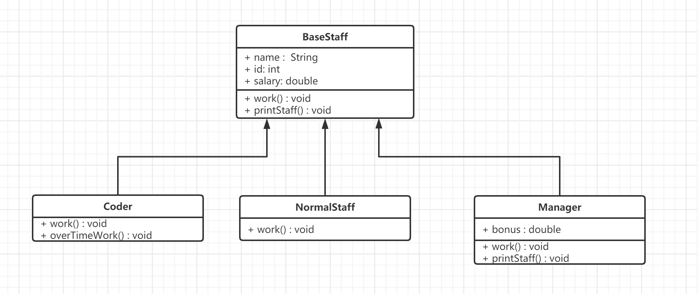

[TOC]


# 抽象类

学习目标:

- 掌握抽象类的定义
- 掌握抽象类的特点与使用

## 引例(introduct)

以下猫狗继承案例，是一个非常基础的继承语法的代码。思考一下Animal类的继承体系，有什么问题吗？

从以下两个角度分析：

1. 从代码角度上，有没有冗余代码？
2. 从设计角度上，在这个案例中，会存在一个动物对象吗？

``` java
class Animal {
    public void shout() {
        System.out.println("动物叫");
    }
}

class Cat extends Animal {
    @Override
    public void shout() {
        System.out.println("猫叫");
    }
}
class Dog extends Animal {
    @Override
    public void shout() {
        System.out.println("狗叫");
    }
}
```

分析一下

1. 单纯从代码角度上，有没有冗余代码？

   实际上是有的。从方法调用的角度考虑，Animal类当中的shout方法从来没有被调用过。该方法单纯就是让子类继承并重写的，它实际上没有被调用的需求。从最理想的角度上来说，它的方法体是可以去掉的，仅保留一个声明让子类去重写就可以了。

2. 当然代码多几行少几行并不重要，重要是：从设计角度出发，Animal类是一个抽象的概念，用于指代所有动物。程序中根本不需要创建它的对象。而且对于一个抽象的概念，也不应该、也不可能去描述它的行为。

综上，我们提出两个改进的方向：

1. Animal类就是作为顶层抽象祖先类而存在的，不需要创建对象，于是干脆不要创建对象了。
2. Animal类当中的shout方法不需要方法体，仅用于作为被继承和重写一个方法声明。


**当父类的某些方法, 需要声明, 但是又不确定如何实现时, 可以将其声明为抽象方法, 那么这个类就是抽象类**

## 定义(define)

首先把方法的方法体去掉，这样就得到一个抽象方法。它的语法是：

``` java
[修饰符列表] abstract 返回值类型 方法名(形参列表);


```

注：

1. 抽象方法没有方法体，只有方法的声明（方法头）。但是不要忘记写分号";"。
2. <span style=color:red;background:yellow>**抽象方法必须写在一个抽象类中。**</span>

接下来，我们定义抽象类。它的语法是：

``` java
[修饰符列表] abstract class 类名{
    //类体
}
```

抽象类不能创建对象，但抽象类可以继承，存在子类。并且抽象类作为父类，多态现象仍然存在。

<span style=color:red;background:yellow>**在继承体系中，从祖先类开始，随着一个个子类的定义，子类变得越来越具体，而祖先类则更具有一般性和抽象性。在这种情况下，为了体现祖先类在设计上的抽象性，我们只将该类作为派生其他类的父类，而不能创建对象实例。这个时候，这样的类，我们称之为抽象类。**</span>


**上层的类越来越抽象，下层的类越来越具体。**

## 特点与使用

**特点（feature）**

抽象类的特点我们主要从以下角度：

1. 类名命名特点是什么?
2. 能用哪些修饰符？  --> 不能使用修饰符（final）
3. 成员特点
   1. 普通成员
   2. 静态成员
   3. 抽象方法
4. 构造器
5. 代码块


- 抽象类仍然是一个类，它的命名仍然需要遵循大驼峰的命名规范。当然，它比较特殊，许多公司的开发规范中，会要求将抽象类命名为`AbstracXxx`或`BaseXxx`，用于表示该类是一个抽象类。

- 类class在定义时，本身可以使用的修饰符就比较少，除了访问权限修饰符之外，几乎就只有final、abstract等少数修饰符。但是但是final和abstract在修饰类时是冲突的，不能放在一起使用。final是阻止继承而abstract是抽象类，如果不继承抽象类没有任何意义。

- 抽象类的成员特点：

  1. 成员变量。抽象类可以定义普通类中能够定义的所有成员变量，在这一点上，和普通类是一样的。

  2. 成员方法。抽象类可以定义普通类中能够定义的所有成员方法，包括普通成员方法和静态成员方法，在这一点上，和普通类仍然是一样的

     注：抽象类虽然不能创建对象，但是它有子类，这些具体实现方法可以让子类继承，子类可以选择直接使用，也可以选择重写，选择的权力在子类手上（假如一个方法在抽象类的多个子类中都需要被使用，那么就可以提取到抽象类中作为一个默认实现）

     综上，不能发现： <span style=color:red;background:yellow>**普通类中能够定义的成员，在抽象类中都是可以定义的。**</span>

  3. 抽象方法。首先抽象类可以没有抽象方法，但是如果一个抽象类没有抽象方法，那么它就没有必要声明为抽象，直接声明为普通类就够了。<font color=red>**定义出一个抽象类，就是为了定义抽象方法的。**</font>抽象方法最重要的作用是起到 <span style=color:red;background:yellow>**"占位"**</span> 的作用，任何普通类继承了该抽象类，都必须实现该抽象方法（强制的）

     如果子类不想实现抽象父类中的抽象方法，可以把子类也设置为抽象类，抽象类就不需要实现父类中的抽象方法了。

- 构造器。构造器除了可以自己用，创建对象时给成员变量赋值，还可以给子类用，在子类对象初始化过程中，可以调用父类的构造方法给父类的成员变量赋值。所以抽象类虽然不能创建对象，但它也是有构造器的。实际上，<span style=color:red;background:yellow>**在Java中，任何一个类都有构造器。**</span>

- 代码块，无论是构造代码块，还是静态代码块，都有。

综上：抽象类实际上和普通类能够定义的成员是一样的，普通类中有的东西它都有，只不过多了一个抽象方法。<span style=color:red;background:yellow>**在不考虑创建对象的情况下，直接把一个类声明为abstract，是不会编译报错的。**</span>

---

**使用**

**抽象类的使用，我们主要探讨，它的子类特点。**

抽象类的子类可以有两种情况：

1. 子类是普通类，普通类继承抽象类，必须实现所有的抽象方法。
2. 子类是抽象类，抽象子类不需要实现抽象方法，抽象子类可以自由选择实现（或实现或不实现）。

注：抽象类还可以继承一个普通类, 实际上如果一个抽象类, 它没有直接父类, 那它就直接继承Object


```JAVA
/**
 * 在抽象类中，可以定义成员变量。可以定义成员方法。可以定义构造器方法。
 * 普通类有的，虚拟类都有。
 * 就是比普通类，多了一个抽象方法。
 */
abstract class Person3 {
    String name;

    public Person3(String name) {
        this.name = name;
    }

    public String getName() {
        return name;
    }

    public void setName(String name) {
        this.name = name;
    }

    // public abstract void showInfo();
}
```


## 注意事项

1. abstract关键字，不能用来修饰构造器、属性、代码块等结构。<font color=red>**只能修饰类或者方法。**</font>

2. abstract修饰类时，类的修饰符不能有final。

3. abstract修饰方法时，该方法不能有修饰符：

     1. private
     2. static
     3. final
4. 一个抽象类中可以没有抽象方法，但是没有意义

## 练习

1. 抽象类编码练习

> 公司正在开发一套员工管理系统，需要对公司内部存在的员工进行管理
>
> 公司将员工分为三类，普通员工负责杂项工作，程序员负责技术开发，经理负责统筹规划
>
> 普通员工包含3个属性：姓名、工号以及工资，行为是工作
>
> 程序员包含3个属性：姓名、工号以及工资，行为是工作和加班（overtime work）
>
> 经理包含4个属性：姓名、工号、工资以及奖金（bonus），行为是工作

- 请使用所学的知识设计该员工系统
- 要求类中提供必要的方法进行属性访问（description）

类图结构




2. 抽象类的作用是：做为继承体系中的顶层父类、祖先类而存在的。说白了所有继承了该抽象类的对象，都应该是一个该抽象类的对象。比如我定义了一个抽象的Person类，那么Student、Teacher等继承它是没问题的，但是让一个Cat继承就不行了（即便有成员可以复用）。<font color=red>**只要是继承，就必须考虑"is-a"关系。**</font>

```java
// 抽象的员工类
abstract class BaseStaff {
    private String name;
    private int id;
    private double salary;

    public BaseStaff(String name, int id, double salary) {
        this.name = name;
        this.id = id;
        this.salary = salary;
    }

    public abstract void work();

    // 定义打印属性的方法,子类可以选择直接使用,也可以选择重写
    public void printStaff() {
        System.out.println("id是" + id + "的员工,姓名是" + name + ",Ta的工资是" + salary);
    }

    public String getName() {
        return name;
    }

    public int getId() {
        return id;
    }

    public double getSalary() {
        return salary;
    }
}

class NormalStaff extends BaseStaff {
    public NormalStaff(String name, int id, double salary) {
        super(name, id, salary);
    }

    @Override
    public void work() {
        System.out.println("负责杂项工作");
    }


}

class Coder extends BaseStaff {
    public Coder(String name, int id, double salary) {
        super(name, id, salary);
    }

    @Override
    public void work() {
        System.out.println("负责技术开发");
    }

    public void overTimeWork() {
        System.out.println("996福报,蹭公司电,蹭公司网!");
    }
}

class Manager extends BaseStaff {
    double bonus;

    public Manager(String name, int id, double salary, double bonus) {
        super(name, id, salary);
        this.bonus = bonus;
    }

    @Override
    public void work() {
        System.out.println("负责统筹规划");
    }

    @Override
    public void printStaff() {
        System.out.println("id是" + getId() + "的员工,姓名是" + getName() + ",Ta的工资是" + (getSalary() + bonus));
    }
}

```


<span style=color:red;background:yellow>**面试题**</span>：**普通类和抽象类有什么区别？**

- 普通类不能包含抽象方法，抽象类可以包含抽象方法。

- 抽象类不能直接实例化，普通类可以直接实例化。

# 接口

学习目标:

- 掌握接口的定义
- 掌握接口的特点与使用

## 引例

接口（interface）关键字，使抽象类的概念向前迈进了一步。抽象类中允许存在没有方法体的方法，接口中的方法默认就是抽象的。

比如，现在需要定义一种顶级动物类，这个动物类，我们知道能行动，能觅食，能叫。但是因为太过顶级，我们不知道它怎样行动的，怎样觅食的。我们可以使用抽象类来完成，也就是三个抽象方法。我们也可以使用接口来完成。

```JAVA
package com.cskaoyan.day6_abs_interface._02_interface._01introduct;

/**
 * 使用抽象类来完成方法的定义。
 * 在这个抽象类中，有很多方法，移动，吃饭，大叫 都是抽象方法。
 * 缺点： Java中的类，是单继承的。如果还有一个其他的就没有办法
 *
 * @author Common-zhou
 * @since 2023-11-02 10:47
 */
public abstract class Animal1 {
    public abstract void move();

    public abstract void eat();

    public abstract void shout();
}


package com.cskaoyan.day6_abs_interface._02_interface._01introduct;

/**
 * 使用接口来完成方法的定义
 *
 * @author Common-zhou
 * @since 2023-11-02 10:51
 */
public interface Animal2 {
    public abstract void move();

    public abstract void eat();

    public abstract void shout();
}
```


接口比抽象类的好处在哪里呢？

- 类只能单继承。也就是只有一个父类。接口则不受限制

这种全新的数据类型，就是**接口（interface）**。

## 定义

接口是一种表示对行为抽象的，不受Java多继承限制的，用来作为功能扩展标准的一种引用数据类型。它的定义语法如下：

``` java
[访问权限修饰符] interface 接口名{
    // 在这里只写方法定义
}

interface Animal{
    String shout();
}
```

注：

- 接口的访问权限修饰符也只有两种：

  1. public 
  2. 默认缺省的

- 接口名和类名一样，遵循大驼峰式的书写规范，接口名最好起的见名知意。有些程序员喜欢在接口前加一个大写字母I来直接，表示该类型是一个接口，可以借鉴。

- 接口中可以定义抽象方法，和抽象类中定义抽象方法没有区别。(public abstract可省略)

- 接口是可以被一个类"继承"的，接口的"继承"，更准确、常见的叫法称之为接口的实现。当然它也不再使用extends关键字，而是使用 implements 关键字。一个普通类实现接口必须实现所有抽象方法。它的语法是：

  ``` java
   [访问权限修饰符] class 类名 extends 类名 implements 接口名 {}
  
  // 接口的“继承” 使用implements关键字
  class Brid implements Fly{}
  
  class Sparrow extends Animal2 implements Fly{}
  ```

  细节问题：如果一个类实现接口并继承别的类，要"先继承再实现"。关键字位置不要写反了。

- 在接口的实现中，可以称呼接口为"父接口"，接口的实现类为"子类"，它们仍然是父子关系。当然多态现象仍然能够发生。

- 接口不受多继承限制，一个类可以在继承别的类的同时实现接口，而且可以实现多个接口。


```JAVA
/**
 * 接口的访问权限修饰符，可以是public，也可以不写（默认）
 * 接口的命名，和类名保持一致。 大驼峰  StudentConverter  FileFilter
 */
public interface Converter {
    abstract String convert(Integer num);
    
    // 在接口中，abstract可省略。
    String convert1();
}
```


## 优点

使用接口有如下优点：

- 接口不受单继承限制，这是接口非常重要的优点。
- 接口不是类，它和它的实现类，也不需要存在"is-a"关系，接口比抽象类的使用更加灵活。
  - 程序开发中将接口和它的实现类之间的关系，称之为"like-a"关系。只要是实现了Xxx的功能，就像Xxx。
- 接口表示一种开发标准，一种规范。表示对功能的扩展，它只关注行为，不关注属性。


<span style=color:red;background:yellow>**继承关系的本质：**</span> 注意，继承本质上是is-a的关系。 也只有有is-a关系的时候，才能使用继承。 

举例来说，现在有一个Animal 里面有name，有age，能运动。 我们写Dog可以继承，但是写Ship这种类，就不能继承Animal。因为它不是一个Animal。

<span style=color:red;background:yellow>**接口的本质：**</span>接口的本质是like-a的关系。 也就是有某种能力就可以使用接口，

举例来说，现在有一个接口叫做可移动的（Movable），里面有一个move方法。

对人来说，可以移动，可以实现这个接口

对船来说，可以移动，也可以实现这个功能。

也就是，只要有这种能力就符合接口的定义。


接口更灵活一点。 


## 特点和使用

**接口的特点我们主要研究以下方面**

1. 接口的声明特点
   1. 接口能不能创建对象?
   2. 接口能不能用final修饰?
2. 接口的实现类的书写格式（包名，类名）
3. 成员特点
   1. 能否定义属性(成员变量, 静态成员变量, 全局常量)?
   2. 能否定义方法/行为?
4. 构造器
5. 代码块

**测试后，我们的结论是：**

- **接口的声明特点**
  
  - 接口能不能创建对象?
    - 不能创建对象,实际上接口是抽象的. 因为接口的声明修饰符中隐含了关键字abstract
  - 接口能不能用final修饰?
    - 不能,接口定义出来目的就是为了被实现. final天生和接口矛盾
- **接口的命名特点(非强制)**
  
  - 接口在命名时,为了体现接口的特殊性,表示它是一个接口. 某些程序员会在接口的命名前加大写字母"I"
- **接口的实现类的书写格式(非强制)**
  
  - 某些程序员会在接口的所在位置,定义一个全新的包,叫"impl"
  - 然后在该包下写接口的实现类,命名为"接口名 + Impl"
- **成员特点**
  
  - 能不能定义属性?(成员变量,静态成员变量,全局常量)
    - 可以定义,但是接口中的属性默认都是"public static final"修饰的公共的全局常量
    - 这些隐含的修饰符不要写出来, 接口能够定义的所有结构的访问权限都是public, 而且public是隐含的修改不了
    - 接口中没有静态代码块,接口中的全局常量,必须显式赋值
    - 接口表示对功能的扩展,所以接口往往只有对行为的抽象(接口往往只有方法),接口是非常少见定义属性的, 只有当接口的所有实现类,都需要一个共同的全局常量时才考虑在接口中定义属性.
  - 能不能定义方法/行为?
    - 可以定义方法,但是接口中的方法默认都是"public abstract"修饰的公共的抽象方法
     - 实际上,在Java8之前,接口中没有任何实现方法,接口中只能定义抽象方法
     - 特别强调: 实际开发中,99%的情况下,接口就只有光秃秃的抽象方法定义,没有其他任何内容
- **构造器**
  
  - 接口是没有构造器的,接口自己用不到构造器
- **代码块**
  
  - 没有静态代码块
   *          没有构造器就没有构造代码块
- **以上总结,接口能定义的结构特点:**
  
  - 可以定义全局常量
   *          可以定义抽象方法(Java8以后允许实现默认方法)
   - 实际上,接口往往只有抽象方法定义,它表示对行为的抽象, 表示制定标准和规范


**注意两个问题:**

1. 实现接口的类，如果没有明确继承一个其他类，那么子类对象的隐式初始化super()指向Object类。
2. 接口虽然不是类，但是它也继承了Object类。


**接口的使用，我们主要探讨它的子类特点。**

接口的子类可以是什么？

1. 普通类实现接口，必须实现所有的抽象方法。

2. 抽象类实现接口，按需实现抽象方法。

3. 接口可以继承一个接口，并且接口在继承接口后，可以重写父接口中的抽象方法和默认方法。

   参考如下代码（了解即可）：

   ``` java
   interface A {
       Object test();
      
       default void test2() {
       }
   }
      
   interface B extends A {
       /*
               重写父接口抽象方法
               只有在父接口的方法返回值类型是父类类型时
               子接口中可以将抽象方法返回值类型重写为子类类型
               其余地方都不可变。
        */
       @Override
       Demo test();
      
       @Override
       default void test2() {
           System.out.println();
       }
   }
   ```


**extends VS implements：**

继承（extends）只能是类和类继承，接口和接口继承。接口和类之间没有继承关系。
1. 普通类继承一个抽象类，需要实现里面的所有抽象方法。
2. 抽象类继承一个抽象类，按需实现里面的抽象方法。
3. 抽象类继承一个普通类，是可以的。
4. 接口在继承一个接口后，会得到接口的所有抽象方法。
5. 类的继承是单继承的，接口的继承是多继承的。

实现（implements），必须发生在类与接口之间。
1. 普通类实现接口，必须实现所有抽象方法
2. 抽象类实现接口，按需实现抽象方法


在工作中， 99%，只会定义抽象方法。 

接口，里面可以定义变量（定义了变量，自动变成常量）

接口中，可以定义抽象方法。在Java8之后，可以定义带方法体的方法。 


## 默认方法和静态方法

**Java8中接口的语法迎来了大的变动，新增了两种具有方法体的实现方法：**

- 默认方法
- 静态方法

1. 默认方法。

   ``` java
   // 默认方法的语法:
   default 返回值类型 方法名(形参列表){
       //方法体
   }
   ```

   - 接口中的默认方法的访问权限修饰符是public，不可更改。
   - 默认方法的作用：
      - 抽象类中的实现方法是用来作为子类的默认实现的，但是接口不具备这个功能。接口表示对功能的扩展，它更多的是一种标准和规范，多数情况下它不需要实现方法。
      - Java8仍然新增了默认方法，主要是两个角度考虑:
        - 接口中一旦有了默认实现方法，程序设计接口的灵活性就增加了。在没有默认方法时，接口中一旦新增任何方法，子类都必须实现它。而现在有了默认方法，就不需要这么做：需要实现的就自己重写，不需要的就直接继承。代码的兼容性和灵活性就增加了。
        - Java8中引入了Lambda表达式和StreamAPI，接口中的默认方法可以作为它们的实现，完成函数式编程。（这个仅了解，后面会讲Lambda表达式）
      - 接口中的默认方法，还可以配合接口的"多实现"，实现真正意义上的多继承。

2. 静态方法。

   ``` java
   static 返回值类型 方法名(形参列表){
       //方法体
   }
   ```
   
     - 接口中的静态方法也是默认public修饰的，不可更改。
  - 它的调用方式是用接口名.静态方法名。
     - 接口中的静态方法也是为了配合Lambda表达式和StreamAPI使用的，其余场景不多见。
     - **接口中的静态实现方法，只能自己用，不能用实现类类名调用。**

---

**上面两种方法仅供了解，实际开发中，可能会偶尔见到它，但自己写的概率非常小。**

## 练习

1. 教练（Coach）和运动员（Sportsman）案例

> 小试牛刀请用所学知识分析：这个案例中有哪些抽象类，哪些接口，哪些具体类。

现在有乒乓球运动员和篮球运动员，乒乓球教练和篮球教练。为了能够出国交流，跟乒乓球相关的人员都需要学习英语。

## 方法的形参和返回值类型

### 方法传值

方法的形参在方法调用传入实参时，不一定要求数据类型完全一致。

- **基本类型：**对于基本数据类型的方法形参，存在自动类型提升。（long num）  int
- **引用类型：** 对于引用数据类型的方法传参，存在自动向上转型。
  1. 形参如果写一个普通类：调用方法时需要传入的是该类的对象或者该类的子类对象
  2. 形参如果写一个抽象类：调用方法时需要传入的是该抽象类的子类对象
  3. 形参如果写一个接口：调用方法时需要传入的是该接口的子类对象


### 方法的返回值

方法的返回值类型，和在方法体中返回具体值（对象）时，不一定要求数据类型完全一致。

- **基本类型：**方法体中，返回一个具体的值不要求和返回值类型完全一致，存在自动类型提升。
- **引用类型：** 在方法体中，返回一个对象时不要求就是返回值类型的对象，存在自动向上转型。
  1. 返回值类型如果写一个普通类：可以返回该类的对象或者该类的子类对象
  2. 返回值类型如果写一个抽象类：返回该抽象类的子类对象。
  3. 返回值类型如果写一个接口：返回该接口的子类对象。

### 方法重写中的返回值类型问题

父子类方法重写中，方法声明中返回值类型的书写。

1. **基本类型和void：**必须保持一模一样，不存在类型提升。
2. **引用类型：**不必保持一模一样，存在自动向上转型。
   1. 类：父类中的方法返回一个普通类类型
      - 子类方法中可以返回该类型
      - 也可以返回该类的子类类型
   2. 抽象类：父类中的方法返回一个抽象类类型
      - 子类方法可以返回该类型
      - 也可以返回抽象类的实现类类型
   3. 接口：父类中的方法返回一个接口类型
      - 子类方法可以返回该类型
      - 也可以返回接口的实现类类型

## 链式调用

链式调用，在Java代码中是很常见的。当然它不是一个语法，这里讲一下它的形式，大家知道即可。

对于类Studnet：

``` java
class Student{

 public Student getStudent(){
     return new Student();
 }

 public Teacher getTeacher(){
    return new Teacher();
 }
}
class Teacher{
 public void show(){
     System.out.println("秀一波~~~");
 }
}
```

假如在main方法中写以下代码（不使用链式调用）：

``` java
StudentDemo sd = new StudentDemo();
Student s = sd.getStudent();
s.show();
// 链式调用： 就是方法的调用形式，像一个链条，一串调用下来。这个就是链式调用
```

使用链式调用的形式为：

``` java
new StudentDemo().getStudent().show();
```

<span style=color:red;background:yellow>**链式调用的本质在于：前面方法的返回值是一个对象。**</span>


# 接口 VS 抽象类

接口和抽象类的异同：

| 编号 | **区别点** |                          **抽象类**                          |                 **接口**                  |
| :--: | :--------: | :----------------------------------------------------------: | :---------------------------------------: |
|  1   |    定义    |                       包含抽象方法的类                       |         抽象方法和全局常量的集合          |
|  2   |    组成    |           构造方法、抽象方法、普通方法、常量、变量           | 常量、抽象方法、(jdk8:默认方法、静态方法) |
|  3   |    使用    |                   子类继承抽象类(extends)                    |         子类实现接口(implements)          |
|  4   |    关系    |                  抽象类可以实现多个接口（）                  |  接口不能继承抽象类，但允许继承多个接口   |
|  5   |    对象    |                 不能创建对象，但是有构造方法                 |       不能创建对象，也没有构造方法        |
|  6   |    局限    |                      抽象类不能被多继承                      |       接口之间能多继承，能被多实现        |
|  7   |    思想    |             作为模板或对共性属性和行为抽象，is-a             |     作为标准或对共性行为抽象，like-a      |
|  8   |  访问权限  |              抽象类的成员，写访问权限比较自由。              |      接口的成员，必须是public修饰的       |
|  9   |    选择    | **如果抽象类和接口都可以使用的话，优先使用接口，避免单继承的局限** |                                           |

总之，抽象类和接口除了都是抽象外，区别相当明显。抽象类是作为继承层次中的顶层父类存在的，接口则比较自由。 

抽象类和具体类。   is-a关系


比如，对于一个抽象类，AbstractPerson .   WhitePerson   YellowPerson 

is-a   类和抽象类之间，是  is-a关系。

关于接口和类，   Moveable   Fly      

class Sparrow  implements Moveable ,Fly :  实现了之后，是 like-a关系

在企业开发过程中，使用接口比较多一点。因为接口能多实现，但是抽象类只能单继承。 


内部类：定义在别的类内部的类。 

只是用来对语法进行增强的。 它不是必不可少的。 


# 内部类

- 熟悉不同内部类的语法
- 熟悉不同内部类的访问特点

## 引例

引例	

> 我们现在做一个应用程序，需要描述一台电脑中的CPU，对于电脑而言，该怎么去描述这个CPU呢？

分析：

我们可以创建两个类，一个描述Computer，一个描述CPU。但这样明显是有问题的：

1. CPU是电脑中最重要的组件，但它脱离电脑存在就是一粒沙子。这意味着CPU对象，应仅存在于Computer内部。
2. CPU可以控制计算机的一切硬件资源。这意味CPU对象能够操控，Computer类中的所有成员，无论私有。

定义普通类CPU是不能完成需求的，因为：

1. 普通类没有私有概念，不可能控制仅能在Computer内部创建对象。
2. 普通类不可能直接访问，其它类的私有成员。

**显然CPU类不应该是一个普通类，不应该是一个独立的类 ---> 不再将CPU类定义为一个独立的类，而是将它放入Computer类的类体中，可以近似的看成是一个Computer类的成员 ---> CPU类近似看成Computer类的成员，于是：** 

1.  在其它类内部的类，就有了私有概念，就有了四种访问权限。只需要在内部私有化一个类，那么在外界就无法创建它的对象了。
2.  既然已经成为了成员，成为了"自己人"，那么就不再受限于权限控制了，内部类就可以访问包裹它的类的所有成员，包括私有。

上述两条，其实就是（成员）内部类的主要特点。也说明了使用内部类的主要场景：

1. 内部类是一种比类更加极致的封装思想体现，内部类的成员不仅被类自身保护，还被包裹着它的类保护。
2. 内部类和包裹它的类互相成为了"好兄弟"，互相访问成员都不受访问权限限制。

当你有以上使用场景时，就可以考虑使用内部类。

## 定义与分类

**基本概念:** 

在Java语言中类可以嵌套定义，广义的内部类指的是定义在另一类当中的一个类。


**分类:**

根据内部类在类中定义的位置不同:

- **成员位置**
  - 成员内部类
  - 静态内部类
- **局部位置**
  - 局部内部类
  - 匿名内部类
  - Lambda表达式

但是我们在学习的时候，不按定义位置来学习。我们按照它是一个类，还是一个对象来分类：

1.  语法定义了一个类，包括成员内部类、静态内部类和局部内部类。既然是定义了一个类，使用时还需要创建对象才能用。
2.  语法直接创建了一个对象，包括匿名内部类和Lambda表达式。由于已经通过语法创建了对象，可以直接使用。

```java
// 外部类
class Computer{
	// 内部类
    class CPU{
        
    }
}

// 外部其他类
class Demo{
    
}
```

为了上课方便，我们需要统一口径，在内部类课程当中，我们统一规定：

1. 像CPU这种，定义在别的类的内部的类，我们称之为内部类.
2. 像Computer这种，包裹内部类的，我们称之为外部类.
3. Demo这种类我们称之为外部其他类.

## 成员内部类

成员内部类是最普通的内部类，它定义在另一个类的成员位置， 可以看成**该类的一个成员。**

语法：

```java
//外部类
[访问权限修饰符] class OuterClazz{ 
	//成员内部类
	[访问权限修饰符] class InnerClazz{
 }
}
```


### 自身特点

#### 访问权限修饰符

**成员内部类可以看成另一个类的成员，它和类中成员一样，有四种访问权限级别：**

- public
- protected
- 缺省的，默认访问权限
- private

注：

1. 外部类可以保护成员内部类，如果想要访问一个成员内部类。首先需要外部类权限，然后还需要成员内部类权限。
2. 都定义成员内部类了，多数情况下，应该私有化它。

#### 成员特点

1. 可以定义普通成员变量，成员方法。但没有静态声明（包括静态变量，静态方法，静态代码块）。在JDK16之后，允许定义静态声明。
2. 有构造器，有构造代码块。
3. 可以有静态全局常量。


#### 继承和实现

- 内部类可以继承和实现外部的类和接口。
- 也可以在类中定义多个普通类、抽象内部类和接口用来自己继承和实现。


### 成员内部类的访问特点

在具体了解成员内部类的使用之前,我们要搞清楚成员内部类和外部类之间,到底什么关系?

- 成员内部类可以看成外部类的一个成员
- 类中的成员变量,必须依赖于类的对象而存在, 那么成员内部类的对象,也必须依赖于外部类对象而存在

- 也就是说,要想得到成员内部类对象,必须在外部类对象的基础上创建,成员内部类对象不能单独创建, 成员内部类依赖于外部类,反过来,没有依赖关系

之所以存在这样的依赖关系:

是因为成员内部类对象的成员变量列表中,都会持有外部类对象的引用(成员内部类对象中保存了一个它所寄生的外部类对象的引用)


#### 成员内部类内部访问外部类(重点)

<font color=red>**首先，访问不受权限限制，即便是私有private，也阻止不了访问。**</font>

在成员内部类的成员方法中访问外部类成员，因为外部类对象已经存在，所以可以直接访问，直接写成员的名字就可以了。在特殊情况下，当成员内部类成员和外部类成员同名时，如果仍然用成员名直接访问，访问的结果是成员内部类自身成员（就近原则），这时：

1. 在成员内部类的成员方法中，自身对象用this指向，用this点访问到的一定是自身成员。
2. 在成员内部类的成员方法中，外部类对象用外部类类名.this指向，用外部类类名.this点访问到的一定是外部类成员。

极限情况下，出现局部变量，成员内部类成员变量，外部类成员变量三者都同名的情况：

1. 就近原则直接写成员名字，访问的是局部变量的。
2. 用this.访问的成员内部类自己的成员变量。
3. 用外部类类名.this.访问的是外部类的成员变量。

最后，如果全局常量同名了，就用类名去区分好了。


```JAVA
/**
 * 内部类访问外部类的成员特点。
 * 遵循就近原则。
 * 结论： 按照就近原则访问。 比如外部类有，内部类有，局部变量有。
 * 则访问的时候，访问的是局部变量的。  如果想访问外部类的，使用 外部类类名.this.变量； 如果想访问内部类的，使用 this.变量
 */
class Outer31 {
    String f1 = "outer f1";
    String f2 = "outer f2";
    String m1 = "outer m1";

    class Inner31 {
        String f2 = "inner f2";
        String m1 = "inner m1";

        public void test1() {
            String m1 = "test1 m1";
            // 访问外部类成员，直接写名字即可。即使是private修饰符。
            // 就近原则。局部变量有这个变量，就使用成员变量的； 如果成员变量有这个就使用的是成员变量； 否则就使用外部类的
            System.out.println(f1); // outer f1
            System.out.println(f2); // inner f2
            System.out.println(m1); // test1 m1
        }

        public void test2() {

            String m1 = "test1 m1";

            // 如果想使用外部类的。 在内部类或者局部变量没有这个变量的时候，可以直接使用变量名即可
            // 可以使用  外部类类名.this.变量名 去访问外部类的成员变量
            System.out.println(Outer31.this.f2); // outer f2
            System.out.println(this.m1); // inner m1

        }
    }
}
```


使用内部类，因为内部类是外部类的成员变量位置的东西。所以必须要依赖于外部类对象存在。---》 使用内部类，需要先创建外部类对象。

```JAVA
public class Demo4 {
    public static void main(String[] args) {
        // 内部类和外部类。 内部类是依赖与外部类存在的。也就是只有新建外部类，才能创建内部类
        Outer31.Inner31 inner31 = new Outer31().new Inner31();

        inner31.test1();
        System.out.println("========================");
        inner31.test2();
    }
}
```

#### 外部类访问成员内部类成员(重点)

<font color=red>**首先，访问不受权限限制，即便是私有private，也阻止不了访问。**</font>

第二，外部类访问成员内部类成员，要分两种情况：

- 外部类的成员方法中访问成员内部类成员：

  1. 因为这时成员内部类对象不存在，就需要先创建它的对象。
  2. 成员内部类对象依赖外部类对象而存在， 所以得先存在外部类对象才行。而恰好成员方法中隐含自身对象，所以这里创建成员内部类对象的方式就是—— <span style=color:red;background:yellow>**直接new创建。**</span>

  创建对象后，直接用对象名点访问即可。如果有同名的情况，用成员内部类对象名访问的就是内部类的成员，反之不写对象名或者写this访问的都是外部类的成员。

- 外部类的静态成员方法中访问成员内部类成员：

  1. 成员内部类对象不存在，就需要先创建它的对象。

  2. 成员内部类对象依赖外部类对象而存在， 所以得先存在外部类对象才行。但静态方法中什么对象都没有，就需要先创建外部类对象，再创建成员内部类对象。

     语法：

     ``` java
     OuterClazz outer = new OuterClazz();
     InnerClazz inner = outer.new InnerClazz();
     // 上面等价于下面
     InnerClazz inner = new OuterClazz().new InnerClazz();
     ```
     
     得到两个对象后，用谁的对象名访问的就是谁的成员。


```JAVA
class Outer4 {

    String i1 = "outer i1";

    public void test1() {
        // 在外部类成员方法中，去访问内部类成员。因为需要有内部类对象。所以需要创建
        // 怎么创建， 直接用new就可以。
        Inner4 inner4 = new Inner4();
        System.out.println(inner4.i1); // inner i1

        System.out.println(i1); // outer i1
    }

    class Inner4 {
        private String i1 = "inner i1";
    }
}
```


```JAVA
class Outer41 {

    String i1 = "outer i1";

    private static void test1() {
        System.out.println("this is outer static method");

        // 在静态方法中，直接去创建内部类。new Inner41() 不行。
        // 因为内部类需要依靠外部类对象存在， static中没有，需要先创建外部类对象，再使用这个对象创建内部类

        Outer41 outer41 = new Outer41();
        Inner41 inner41 = outer41.new Inner41();
        // 后续，使用什么类型的对象获取数据，就是拿到的是什么数据。


        Inner41 inner411 = new Outer41().new Inner41();
    }

    class Inner41 {
        String i1 = "inner i1";
    }
}
```

#### 外部其他类访问成员内部类成员(了解)

外部其他类要访问成员内部类成员，条件要苛刻的多。由于成员内部类属于外部类的一个成员，所以首先外部其他类需要有外部类的访问权限，再次还需要成员内部类的访问权限。

``` java
public class Demo6 {
    public static void main(String[] args) {
        Outer41.Inner41 inner41 = new Outer41().new Inner41();

        // 如果这个i1是个private。则无法访问到。
        String i1 = inner41.i1;
    }
}
```

**创建对象后，用对象名访问成员即可。**

#### 成员内部类访问外部其他类成员(了解)

在成员内部类中访问外部类成员，和在普通类中访问其它类成员别无二致：

1. 静态成员直接类名点访问。
2. 普通成员需创建外部类对象去访问。
3. <font color=red>**受访问权限控制。**</font>

### 练习


内部类访问外部类： 无权限； 外部类访问内部类： 无权限


1. 试着说一说下述访问，能否进行，怎么进行，是否受访问权限限制。

   1. 成员内部类的成员方法中，去访问外部类的成员。`能，直接访问，如果同名，外部类类名.this.成员变量名`
   2. 外部类的成员方法中，去访问成员内部类的成员。`能，创建内部类对象，用对象名点 `
   3. 外部类的静态成员方法中，去访问成员内部类的成员。`能， 先创建外部类对象，再创建内部类对象，再去访问。`
   4. 外部其他类的成员方法中，访问成员内部类的成员。`不一定，需要外部类权限，内部类权限。`
   5. 外部其他类的静态成员方法中，访问成员内部类的成员。

2. 补全程序，使得可以输出三个num

   ```java
   class Outer {
       public int num = 10;
       class Inner {
           public int num = 20;
           public void show() {
               int num = 30;
               
                // 想访问外部类成员变量： 外部类名.this.成员变量名
               System.out.println("OuterClazz9.this.num = " + OuterClazz9.this.num);
   
               // 想访问内部类成员变量： this.成员变量名
               System.out.println("this.num = " + this.num);
   
               // 想访问 局部变量。 直接写。 
               System.out.println("num = " + num);
               
             
           }
       }
   }
   ```


## 静态内部类

​		有时候, 使用内部类只是为了把一个类隐藏在另外一个类的内部, 并不需要内部类有外部类对象的一个引用, 如果使用static来修饰一个成员内部类, 就不会生成那个引用, 则这个内部类就属于外部类本身, 而不是属于外部类的某个对象, 这就是所谓的静态内部类.

```java
//外部类
[访问权限修饰符] class OuterClazz{ 
// 静态内部类访问权限修饰符，有四个，和普通成员一样
	[访问权限修饰符] static class StaticInnerClazz{
 }
}
```


### 自身特点

依然主要从以下几个角度分析：

1. 访问权限修饰符
2. 成员特点
3. 继承和实现

#### 访问权限修饰符

**静态内部类和成员内部类一样，有四种访问权限级别：**

1. public
2. protected
3. 缺省的，默认访问权限
4. private

注：

1. 外部类可以保护静态内部类，如果想要访问一个静态内部类。首先需要外部类权限，然后还需要静态内部类权限。
2. 既然定义内部类，仍然建议私有化。当然具体情况具体分析

#### 成员特点

要理解静态内部类的成员有什么特点，就要像成员内部类那样，搞清楚，静态内部类到底和外部类是什么关系。**在Oracle公司官网有一段文字解释静态内部类和成员内部类的区别：**

> Nested classes that are declared static are called static nested classes. Non-static nested classes are called inner classes.

这句话直白的翻译过来就是：

> 声明为static的嵌套类称为静态嵌套类，非static嵌套类才被成为内部类。

理解这句话，关键点就在于nested和inner的区别：

1. nested，嵌套，指的是：直接把一个类丢到另一个类中，两个类其实没太大关系。
2. inner，内部，指的是：某个类本身就是另一个类的一部分，在内部。

这其实就已经说明白了，成员内部类和静态内部类的区别：

1.  **成员内部类必须依赖外部类存在，创建成员内部类对象必须持有外部类对象的引用。**
2.  **静态内部类和外部类就是独立的两个类，只不过静态内部类借用外部类来保护自己罢了。**

相比较而言，成员内部类和外部类的关系是：心脏——身体，CPU——计算机

而静态内部类和外部类的关系是：寄居蟹——螺壳

---

搞清楚上面这个问题，其实你已经学会了静态内部类。<span style=color:red;background:yellow>**它本身就该是一个独立的类，所以它和普通类的成员毫无二致！！！**</span>


#### 继承和实现

​		静态内部类的继承与实现和成员内部类并没有太大不同，区别在于，静态内部类只能继承一个静态内部类，而不能继承成员内部类。而且由于静态内部类的独立性很强，在外部，也可以在有权限的情况下，轻松继承一个静态内部类。

#### 总结

​		静态内部类很特殊, 因为静态内部类对象和外部类对象完全独立， <span style=color:red;background:yellow>**静态内部类对象不会持有外部类对象引用**</span>，所以它是内部类中的异类。实际开发中，你就将它作为一个可以定义在类的内部，隐藏自身存在的一个普通类，去使用就可以了。

### 静态内部类访问特点

在研究具体的访问前，仍先明确以下两点：

1. 内部类和外部类是"好兄弟"，它们之间的访问不受访问权限限制，包括私有。
2. 静态内部类对象完全不依赖于部围类对象而存在，这意味着，互相访问，不管在哪都要创建对方对象。

#### 静态内部类内部访问外部类

​	不管是静态内部类中的静态方法还是成员方法，都没有外部类对象存在，需要创建对象访问。语法就直接new对象就可以了。创建好对象以后，用对象名访问即可。如果同名，有谁的引用访问的就是谁的。

#### 外部类访问静态内部类成员

​	不管是静态内部类中的静态方法还是成员方法，都没有内部类对象存在，需要创建对象访问。语法就直接new对象就可以了。创建好对象以后，用对象名访问即可。如果同名，有谁的引用访问的就是谁的。

#### 外部其他类访问静态内部类成员

​		主要就是考虑权限，先要有外部类权限，再要有静态内部类权限。有权限后就可以创建对象了，但是创建对象时，需要指出外部类是谁（毕竟你住人家房子里），语法是：

``` java
OuterClazz.StaticInnerClazz inner = new OuterClazz.StaticInnerClazz();
```

创建对象后，用对象名访问成员即可。**当然这个访问受权限限制。**

#### 静态内部类访问外部其他类成员

​		创建对象访问即可，受权限控制

### 注意事项

内部类也是类,也需要类加载, 静态内部类和外部类之间的类加载,它们会互相影响吗?

是不会的, 静态内部类和外部类之间本身没有依赖关系

它们的类加载,new对象,都是没有关系的

### 练习

试着说一说下述访问，能否进行，怎么进行，是否受访问权限限制。

1. 静态内部类的成员方法中，去访问外部类的成员。
2. 外部类的成员方法中，去访问静态内部类的成员。
3. 外部类的静态成员方法中，去访问静态内部类的成员。
4. 外部其他类的成员方法中，访问静态内部类的成员。
5. 外部其他类的静态成员方法中，访问静态内部类的成员。

总结一下，成员内部类和静态内部类的用途：

首要用途是隐藏类，当你在某个位置需要一个对象来完成需求，而你又不希望外界知道这个类时，可以用内部类, 用的时候优先用静态内部类，因为它限制比较少

## 局部内部类

​		局部内部类是定义在一个方法或者一个作用域里面的类，简单来说，将局部内部类看成是局部变量即可，该类的有效范围仅在作用域内部。（这意味着要创建它的对象，必须在作用域内部创建）

从语法和具体使用上看，局部内部类和成员内部类很相似，有点类似于直接把一个成员内部类放进局部位置，语法是：

```java
// 局部位置
class Inner{

}
// 局部位置
```


### 自身特点

#### 访问权限修饰符

​		局部内部类和局部变量一样，没有访问修饰权限。因为这毫无意义，大括号已经限制了它的访问范围。同样，局部内部类不能用static关键字修饰，原因和局部变量一样。


#### 成员特点

局部内部类的成员特点和成员内部类一模一样，不再赘述：

1. 没有静态static声明，但可以创建全局常量
2. 有构造方法和构造代码块。

#### 继承和实现

局部内部类可以继承和实现外部的类或者接口，这是局部内部类的一个重要用途。

### 局部内部类的访问特点

1.  外部类仍然把局部内部类当"好兄弟"，局部内部类访问外部类成员仍不受权限限制。但局部内部类的作用域已被限制死了，外部类中只有装着局部内部类的作用域内，能访问到该局部内部类。
2.  外部其他类已经完全无法访问到局部内部类了。

#### 局部内部类在外部类的成员方法中

外部类的成员方法中，是隐含自身类对象的引用的，并且这个引用编译器会自动加入到局部内部类中。也就是说， **处在外部类成员方法中的局部内部类，会持有外部类对象的引用。**

于是：

1. 可以直接在局部内部类的成员方法中，访问外部类的成员。
2. 如果出现同名，仍然用外部类类名.this指向外部类成员变量
3. 如果全局常量同名，就用类名点区分。

#### 局部内部类在外部类的静态成员方法中

静态方法中就不存在任何对象了，其中的局部内部类也就不会持有引用了。想要访问外部类成员，就需要创建对象了。

### 局部内部类的经典使用

局部内部类经常使用在以下两个场景中：

1. 方法需要返回一个对象，返回值类型是引用数据类型时。

   方法需要返回一个对象时，可以在方法的局部位置写一个 局部内部类 继承/实现外部的类/接口，创建对象后作为返回值。这是因为方法的返回值可以是返回值类型的对象，也可以是子类对象（当返回值类型是引用数据类型时）。

2. 方法需要传入一个对象，形参数据类型是引用数据类型时。

   方法需要传入一个对象实参时，可以在调用方法的位置定义一个 局部内部类 来继承/实现外部的类/接口，创建对象后作为方法的实参传入。这是因为方法的实参可以是形参类型的对象，也可以子类对象（当返回值类型是引用数据类型时）。

使用局部内部类的优点：

1. 绝对对外界隐藏，封装。
2. 相比较于传统的定义类，然后创建对象，它相对更加简洁省事。

缺点：

1. 这个类是一次性的。

综上，假如在局部位置需要一次性的使用某个对象，可以使用局部内部类创建它，但是如果多次在不同的方法中使用，使用局部内部类就得不偿失了。

### 注意事项

一. 在局部内部类的成员方法中，如果想要访问作用域内部的局部变量，那么该变量：

1.  要么直接就用final修饰，是一个局部常量。
2.  要么就是一个事实上的常量，即只能赋值一次，相当于用final修饰它。

在Java8之前版本的JDK中，如果不给能在局部内部类内部，访问的局部变量直接加上final修饰，会编译报错。

在最后，特别强调一点。后面学习的 <span style=color:red;background:yellow>**匿名内部类**</span> 和 <span style=color:red;background:yellow>**Lambda表达式**</span> 本质依然是局部内部类，这一条注意事项仍然生效。

二. 局部内部类对象作为方法的返回值, 返回值类型必须是其父类型

## 内部类的优缺点和使用场景

- **场景一：无条件地访问外部类的所有元素（优点）**
  - <font color=red>**无论是成员内部类、静态内部类、局部内部类还是匿名内部类都可以无条件访问包裹着它的外部类的成员。**</font>
- **场景二：隐藏类**
  1. 可以用private、protected修饰内部类。
  2. private修饰内部类、外界感受不到该类存在。
- **场景三：实现多继承**
  1. 可以创建多个成员内部类继承外部多个类
  2. 然后创建内部类对象，实际上就是外部类继承了多个类的成员
- **场景四：通过匿名内部类来优化简单的接口实现/Lambda表达式更简洁**
  - **重点：内部类要说使用频率 最高的肯定是匿名内部类和Lambda表达式**

在这些场景下，可以考虑使用内部类，来写代码。 


内部类的缺点

1. 内部类的缺点也是显而易见，语法很复杂，在类中定义内部类也会导致类的结构变复杂，影响代码可读性。

2. 除此之外，不合理使用内部类还可能导致内存泄漏（了解）

   > 持有外部类对象引用的内部类对象，如果始终被使用而没有释放：
   >
   > <font color=red>**那么连带着外部类对象，也不会被销毁和释放内存。**</font>
   >
   > 这在极端的场景下，会导致堆内存溢出，存在一定的风险。
   
   垃圾回收的时候会遇到。 

## 内部类对象

**学习目标**

- 熟练掌握匿名内部类使用
- 熟练掌握lambda表达式使用

### 概述

本节内部类对象，**本质**上还是属于定义在别的类内部的一个类。

但区别是： 成员内部类、静态内部类和局部内部类都属于定义了一个类，后续使用还需要基于内部类创建对象。而本节中的匿名内部类和Lambda表达式都是直接通过语法创建了对象。

最后，在学习匿名内部类和Lambda表达式之前，我们还是要清楚——它们都是特殊的局部内部类。所以一旦访问方法的局部变量，该局部变量需要是一个常量(final 修饰)。

### 匿名内部类

​		我们已经使用过匿名对象了，匿名对象的含义是这个对象是没有名字，没有引用指向它。那么匿名内部类，指的就是这个内部类没有名字。当然成员内部类和静态内部类没法没有名字，所以 匿名内部类指的是"没有名字的局部内部类"。

#### 语法

在方法等局部位置，写下列语法，即表示定义匿名内部类：

```JAVA 
// 局部位置
new 类名或者接口名(){
	// 某类名或接口名的子类的类体
};
// 局部位置
```

解释说明：

1. new表示创建对象，表示创建语法中"类名/接口名"的子类对象。
2. 这个语法结构，我们只知道这是一个子类对象，但这个子类到底叫啥，不知道，所以它是一个匿名类。当然匿名内部类更准确的说法，应该叫匿名内部类对象。
3. 匿名内部类的本质是，一个继承了类或者实现了接口的匿名子类对象。

#### 基本使用

匿名内部类是特殊的局部内部类，它的成员特征、访问特征和局部内部类没有区别。这里不再赘述。

这里我们直接说明一下，匿名内部类对象的两种使用方式：

- 可以直接在后面调用方法，访问它的成员（当一个匿名对象使用）
  1. 优点是：可以访问子类独有的成员。方便快捷，不需要用引用接收再去使用
  2. 缺点是：一次性，仅能用一次
- 可以用（父）引用接收对象，然后再用引用访问成员
  1. 优点是：可以用多次
  2. 缺点是：不能访问子类独有成员（被父类引用限制了访问范围，无法强转，因为子类已经匿名了)

综上，两种使用方式场景不同。如果有多次使用需求，就需要父引用接收；反之如果仅用一次，或者需要访问子类独有成员，就必须直接使用，不能用引用接收。

#### 使用场景

​		匿名内部类实际上就是更简单的局部内部类（直接获取了对象），所以局部内部类的使用场景，可以直接套用过来。

匿名内部类经常使用在以下两个场景中：

1. 方法需要返回一个对象，返回值类型是引用数据类型时。

   方法需要返回一个对象时，可以在方法的局部位置写一个 基于X类或X接口的匿名内部类对象 ，然后直接作为返回值返回给外界。

2. 方法需要传入一个对象，形参数据类型是引用数据类型时。

   方法需要传入一个对象实参时，可以在调用方法的实参位置填入一个 基于X类或X接口的匿名内部类对象，就将它作为一个实参传给方法使用。

使用匿名内部类的优点：

1. 绝对对外界隐藏，封装。
2. 比起局部内部类，它更方便简洁了。所以实际开发中，匿名内部类基本取代了局部内部类的作用。

缺点：

1. 这个对象是一次性的。

总之，酌情使用匿名内部类对象，可以简化代码书写，方便省事。但不要为了使用而使用，假如存在多个场景都需要一个子类对象，那还是直接创建一个子类出来好了。

#### 练习

不修改main方法和接口Inter的前提下，补齐Outer类代码，要求在控制台输出HelloWorld

```java
public class Demo4{
 public static void main(String[] args) {
     Outer.method().show();
 }
}
interface Inter {
 void show();
}
class Outer {
 
}
```

几种实现方式:

- 手写类实现接口
- 局部内部类
- 匿名内部类（匿名内部类对象）
- 静态内部类
- lambda表达式


### lambda表达式

Lambda 表达式是 JDK8 的一个新特性，可以取代接口的匿名内部类，写出更优雅的Java 代码。

1. Lambda表达式仍然是局部内部类，是特殊的局部内部类，仍然定义在局部位置。而且局部内部类的注意事项，也一样存在。
2. Lambda表达式在取代匿名内部类时，不是全部都取代，而是取代**接口**的匿名内部类，而类的匿名内部类Lambda表达式是不能取代的。
3. Lambda表达式是匿名内部类的更进一步， Lambda表达式得到的也不是一个类，而是一个对象，并且是接口的子类对象。

#### 使用前提

Lambda表达式虽然说是取代接口的匿名内部类，但也不是什么接口都能用Lambda表达式创建子类对象。

Lambda表达式要求的接口中，必须有且仅有一个必须要实现的抽象方法。这种接口在Java中，被称之为"功能接口"。功能接口在语法上，可以使用注解@FunctionalInterface标记在接口头上，用于检测一个接口是否是功能接口。

例如：

注解@FunctionalInterface

``` java
@FunctionalInterface
interface IA{
    void test();
}
```

上述代码中`IA`接口就是一个功能接口，注解就不会编译报错，反之就会编译报错。这有点类似于@Override注解对方法重写的检验。

---

看完上述关于功能接口的语法定义，思考两个问题：

1. 功能接口中只能有一个方法吗？
2. 功能接口中只能有一个抽象方法吗？

答：

1. 不是，Java8中的默认方法和静态方法不需要子类实现，功能接口中可以允许有它们存在。

2. 不是，有极个别比较特殊的抽象方法，可以不需要子类实现。

   注：Object类是Java每一个类的父类，所以Object类当中的方法实现就可以作为接口抽象方法的实现。比如：

   功能接口不仅有一个抽象方法

   ``` java
   @FunctionalInterface
   interface IA{
     void test();
     boolean equals(Object obj);
   }
   ```

接口IA仍然是一个功能方法，因为抽象方法boolean equals(Object obj);可以直接使用Object类中的实现，无需子类实现。

所以，再强调一下，**功能接口指的是，有且仅有一个必须要子类实现的抽象方法的接口。**

#### 基本使用

​		功能接口准备完毕后，就可以写Lambda表达式的语法，表示创建功能接口的子类对象了。当然Lambda表达式是特殊的局部内部类对象，仍然要写在局部位置。

它的语法是：

``` java
(形参列表) -> {
// 方法体	
}
```

解释一下：

1. (形参列表)表示功能接口中，必须要重写的抽象方法的形参列表。
2. ->由一个英文横杠 + 英文大于号字符组成，它是Lambda表达式的运算符，读作goes to。
3. { //方法体 }表示功能接口中，必须要重写的抽象方法的，方法体实现。

其实，看完这个Lambda表达式的语法定义，就已经能够解释为什么Lambda表达式，要求接口有且只有一个必须要实现的抽象方法了。因为语法中仅有一套形参列表和方法体，只能重写一个方法。

而且，这个语法写出来，很明显Lambda表达式只能重写父接口中的抽象方法，是不能自己新增成员的！

---

在方法等局部位置，写上述语法后，肯定会报错。原因在于Java是强类型语言，任何变量都有它的数据类型，而直接写Lambda表达式语言，编译器是无从得知它的数据类型的——这个Lambda表达式创建了接口的子类对象，到底是哪个接口的子类对象呢？

所以我们需要帮助编译器，明确Lambda表达式所表示的对象的类型，这个过程称之为 "Lambda表达式的类型推断"。

怎么推断呢？在这个推断过程中，需要给编译器提供额外的信息，告诉它Lambda表达式是哪个接口的子类对象。总得来说，常见和常用的有以下三种方式：

1. 直接用父接口引用接收。由于Lambda表达式表示的子类对象并没有自己独有的成员，所以直接用父类引用接收完全不会有任何问题。

2. 不用引用接收，但是要直接告诉编译器Lambda表达式是哪个接口的子类对象，语法上有点像强转（但不是）。

   语法：

   ((父接口的名字)Lambda表达式).方法名(实参)
   
   这种方式有点类似于匿名对象，所以必须直接调用方法，不然会编译语法报错。

3. 借助方法完成类型推断。

   1. 可以借助方法的返回值数据类型完成类型推断，因为方法的返回值编译器已经知道该返回什么对象。
   2. 可以借助方法的形参的数据类型完成类型推断，因为方法的实参编译器已经知道该传入什么对象。


#### 进阶使用和简化

为了方便语法练习，这里给出六个功能接口：

功能接口案例

``` java
//无返回值无参数的功能接口
@FunctionalInterface
interface INoReturnNoParam {
 void test();
}

//无返回值有一个参数的功能接口
@FunctionalInterface
interface INoReturnOneParam {
 void test(int a);
}

//无返回值两个参数的功能接口
@FunctionalInterface
interface INoReturnTwoParam {
 void test(int a, int b);
}

//有返回值无参数的功能接口
@FunctionalInterface
interface IHasReturnNoParam {
 int test();
}

//有返回值一个参数的功能接口
@FunctionalInterface
interface IHasReturnOneParam {
 int method(int a);
}

//有返回值两个参数的功能接口
@FunctionalInterface
interface IHasReturnTwoParam {
 int test(int a, int b);
}
```

接下来，我们基于上述功能接口，讲解一下Lambda表达式的进阶使用， 主要就是格式的简化


逐个部分简化：

1. (形参列表)能不能简化呢？是可以的，因为功能接口中有且仅有一个必须要实现的抽象方法，那么：

   1. 形参的数据类型是可以省略的，因为方法已经固定死了，形参一定是那些，不需要写出来。但形参的名字是不可省略的（因为要在方法体中使用）
   2. 特殊情况下：
      - 如果形参列表中的形参只有一个，那么()小括号，也是可以省略的。
      - 但是如果形参为空，()小括号是不可以省略的。

2. { //方法体 }方法体能不能简化呢？当然是可以的：

   1. 如果方法重写的方法体只有一条语句的话，那么可以省略大括号。（类似于if/for省略大括号）
   2. 特殊的，如果只有一条语句且这条语句是返回值语句，那么大括号和return可以一起省略。

3. 实际上在多数情况下，都不太可能一句话把方法体写完。多数情况下，Lambda表达式的抽象方法实现都会很复杂，那这样Lambda表达式就会写的很复杂，这就很难受了。而Lambda表达式，本质上就是重写了一个抽象方法的子类对象，所以Java允许Lambda表达式的抽象方法的实现可以直接指向一个已经存在的方法，而不是自己书写实现。这种语法在Java中称之为"方法引用"！

   

   #### 方法引用

   Lambda表达式的主体只有1条语句时, 程序不仅可以省略主体的大括号, 还可以通过英文双冒号::的语法来引用方法, 进一步简化Lambda表达式的书写. 

   什么样的方法，能够作为方法引用指向的功能接口中抽象方法的实现？只看三点：

   1. 返回值类型必须一致。
   2. (方法签名method signature一致)形参列表中的数量，类型，位置必须都对应上，形参名字无所谓。
   3. 方法的名字无所谓。

   **Lambda表达式支持的方法引用**

   | 种类                       | Lambda表达式示例                              | 对应的引用示例                     | 解释说明                                                     |
   | -------------------------- | --------------------------------------------- | ---------------------------------- | ------------------------------------------------------------ |
   | 类名引用静态方法           | (x, y, ...) -> 类名.静态方法名(x, y, ...)     | 类名::静态方法名                   | 功能接口中被实现方法的全部参数传给该类静态方法作为参数       |
   | 对象名引用成员方法         | (x, y, ...) -> 对象名.成员方法名(x, y, ...)   | 对象名::成员方法名                 | 功能接口中被实现方法的全部参数传给该成员方法作为参数         |
   | 类名引用成员方法(**特殊**) | (x, y, ...) -> **对象名x.**成员方法名(y, ...) | 类名::成员方法名(**不是静态方法**) | 功能接口中被实现方法的第一个参数作为调用者, 后面的参数传给该成员方法作为参数 |
   | 构造方法引用               | (x, y, ...) -> new 类名(x, y, ...)            | 类名::new                          | 功能接口中被实现方法的全部参数传给该构造器作为参数           |

   

```java
/*
Lambda表达式的主体只有1条语句时, 程序不仅可以省略主体的大括号,
还可以通过英文双冒号::的语法来引用方法, 进一步简化Lambda表达式的书写.

什么样的方法，能够作为方法引用指向的功能接口中抽象方法的实现？
只看三点：
1. 返回值类型必须一致。
2. (方法签名method signature一致)形参列表中的数量，类型，位置必须都对应上，
形参名字无所谓。
3. 方法的名字无所谓。
 */
/*
1.静态方法引用
2.对象名引用成员方法
3.类名引用成员方法
4.构造方法引用
 */
public class Demo {
    public static void main(String[] args) {
        // 静态方法引用
        // lambda写法
        IA ia2 = () -> System.out.println(111);
        ia2.testA();
        IA ia = () -> A.func1();
        ia.testA();
        // 方法引用
        IA ia1 = A::func1;
        ia1.testA();


        // 对象名引用成员方法
        // lambda
        IC ic2 = (int a) -> {
            System.out.println(a);
        };
        ic2.testC(1);

        IC ic =  a -> new C().func2(a);
        ic.testC(100);
        // 方法引用
        IC ic1 = new C()::func2;
        ic1.testC(200);


        //IB ib = s -> System.out.println(s);
        //ib.testB("aaa");

        // 可以指向源码中的方法或者第三方工具的方法
        IB ib = System.out::println;
        ib.testB("aaa");


        // "abcdef", 希望对字符串进行截取"bc"
        // 主要使用String类中的成员方法
        // subString( int start,int end)  [start,end)
        //String s = "abcdef";
        //String substring = s.substring(1, 3);
        //System.out.println("substring = " + substring);


        // 类名引用成员方法
        // lambda
        ID id = (s, start, end) -> s.substring(start, end);
        String str = id.testD("abcdef", 1, 3);
        System.out.println("str = " + str);


        ID id2 = String::substring;
        String str2 = id2.testD("abcdef", 1, 3);
        System.out.println("str2 = " + str2);


        // 4.构造方法引用
        // lambda表达式
        // 有参构造
        IE ie = (String name, int age) -> new Dog(name, age);
        Dog dog = ie.getDog("小黑", 3);
        System.out.println(dog);
        // 无参构造
        IG ig = () -> new Dog();
        Dog dog1 = ig.getDog();
        System.out.println(dog1);
        // 方法引用
        IE ie2 = Dog::new;
        Dog dog2 = ie2.getDog("小花", 4);
        System.out.println(dog2);

        IG ig2 = Dog::new;
        Dog dog3 = ig2.getDog();
        System.out.println(dog3);


    }
}

@FunctionalInterface
interface IA{
    void testA();
}

class A {
    // 定义一个静态方法 作为IA接口中的testA方法的实现
    static void func1(){
        System.out.println("IA接口中的testA方法的实现");
    }
}

@FunctionalInterface
interface IB{
    void testB(String s);
}

@FunctionalInterface
interface IC{
    void testC(int a);
}

class C {
    void func2(int m){
        System.out.println(m);
    }
}

@FunctionalInterface
interface ID{
    String testD(String s, int start, int end);
}

@FunctionalInterface
interface IE{
    Dog getDog(String a, int b);
}

@FunctionalInterface
interface IG{
    Dog getDog();
}


class Dog{
    String name;
    int age;

    public Dog(String name, int age) {
        this.name = name;
        this.age = age;
    }

    public Dog() {
    }
}
```


#### 注意事项

1. 方法引用所指向的实现方法, 只要是已经存在的就可以, 可以自己写, 可以用源码的方法或者第三方工具类的方法
2. Lambda表达式是特殊的局部内部类，所以它访问方法的局部变量，该变量必须是final的（实际常量）。
3. 除此之外，局部内部类，匿名内部类它们都有自己独立的作用域，能够自定义自己的成员。 <span style=color:red;background:yellow>**但是Lambda表达式没有自身独立的作用域，不能自定义成员，和所在的方法共用同一个作用域。**</span>


#### 优缺点

1. 优点：

   1. **极大得简化了代码，使代码变得更加优雅。**

   2. 函数式编程的代表，可能是未来高端的编程趋势

      - Lambda表达式在Stream API中，配合集合类去使用，代码非常优雅和简洁，并且高效，实际开发中十分常用。

      Stream API代码

      ``` java
      list.
        stream().
      	filter(stu -> stu.getAge() >= 18).
      	map(Student::getScore).
      	forEach(System.out::println);
      ```

      注：该Stream API完成，将学生对象集合中的，所有大于等于18岁的学生的成绩输出的工作。

2. 缺点：

   1. 过于简单的Lambda表达式，显然可读性很低。
   2. 过于简洁也意味着不容易Debug。
   3. 语法难度不低，熟练使用需要时间锻炼。


