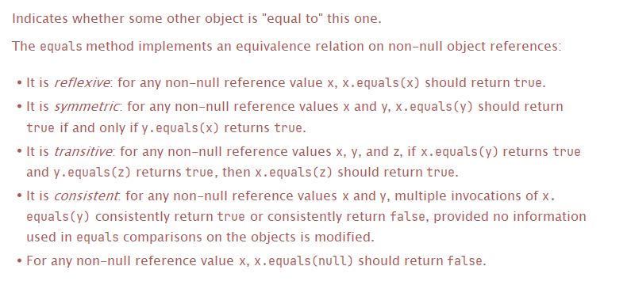

[TOC]

**学习目标**

掌握使用Object中的如下成员方法

- getClass()
- toString()
- equals()
- hashCode()
- clone()


<span style=color:yellow;background:red>**章节在工作、面试过程中作用：**</span>Object作为了一个父类，里面有很多方法，了解这些方法，可以帮助我们今后写代码的时候对代码的结构了解更加清晰，也方便今后使用方法时调用。

主要用途在是在工作中能熟练使用这些API，面试一般问的少。 

面试可能会问到 equals方法 和 hashCode方法。

# API概述

API，全称**Application Programming Interface**，也就是应用程序编程接口。

这里所谓的<font color=red>**接口**</font>，在前面的章节中已经说过了：

此接口并不是Java语法中的<font color=red>**interface**</font>，而是<font color=red>**指一些已经预先定义好的，暴露给外界使用的方法或者工具。**</font>

API的使用者，可以在不关注具体实现细节的前提下，使用这些已经预先定义好的方法和工具实现自己的需求。

这就是API的意义所在，而实际上，在相当多的开发场景中，程序员只需要充分利用这些API就足以完成开发需求。所以很多中低级程序员，都被戏称为<font color=red>**“API caller”**</font>。

学习API，我们应该将学习的重心放在学习**”方法“**上，API使用的本质就是**方法调用**，从这个角度上来说，API的学习是非常简单的。

但要想理清楚其中的逻辑，正确使用API，还需要多加练习.

在学习官方Java API以及其它流行的三方API时，我们可以参考官方文档去学习，也可以利用搜索引擎去了解其中的细节。而以后到了公司中，程序员之间互相交流API，就需要依赖于特定格式的API文档。


别人写好的，给你使用的一些方法或者代码。 

interface .

# Object概述

Object类，我们虽然我们没有详细了解，但我们已经：Object类是所有类继承层次的祖先类，Java中所有类（包括数组）都直接或者间接的继承自该类，都实现了该类的方法。

自定义类时，我们并不需要特别的标注<font color=red>**extends Object**</font>，这是一个隐式的继承。

如果一个类没有明确的指出它的父类是谁，那么Object类就默认是这个类的<font color=red>**直接父类**</font>。

**Object类是没有成员变量定义的，并且由于子类对象的隐式初始化，Object类有且仅有一个默认提供的无参构造方法。**

<span style=color:red;background:yellow>**我们学习Object类，主要关注它的成员方法。**</span>

# Object成员方法

| protected  Object | clone()        创建并返回此对象的一个副本。                  |
| ----------------- | ------------------------------------------------------------ |
| boolean           | equals(Object obj)        指示其他某个对象是否与此对象“相等”。 |
| protected  void   | finalize()        当垃圾回收器确定不存在对该对象的更多引用时，由对象的垃圾回收器调用此方法。 |
| Class<?>          | getClass()        返回此 Object 的运行时类。                 |
| int               | hashCode()        返回该对象的哈希码值。                     |
| void              | notify()        唤醒在此对象监视器上等待的单个线程。         |
| void              | notifyAll()        唤醒在此对象监视器上等待的所有线程。      |
| String            | toString()        返回该对象的字符串表示。                   |
| void              | wait()        在其他线程调用此对象的 notify() 方法或 notifyAll()  方法前，导致当前线程等待。 |

说明: 

像notify()、wait()等成员方法, 它们都和Java的线程有关系，多线程中再学习。


先来一个大致的、笼统的认识：

1. <font color=red>**getClass()方法**</font>，是Java反射的前置知识点，该方法本身作用不大，仅作了解。

2. <font color=red>**toString()方法**</font>，提供了将对象字符串化的方式，很简单但很常用，很重要的一个方法。

3. <span style=color:red;background:yellow>**equals(Object obj)方法用于判断对象相等，很常用、非常重要。**</span>

4. <span style=color:red;background:yellow>**hashCode()方法用于获取哈希值，在集合的场景下使用，也是一个很重要的方法。**</span>

   **注：equals和hashCode这两个方法，关系紧密，要结合起来学习。**

5. finalize()方法，仅作了解，没有实际意义。

   注：该方法在Java9开始，被注解**@Deprecated**标记，表示它是一个被放弃使用的过时方法。

   规范的Java开发中，不应该使用过时方法或者类。

6. clone()方法，克隆，一种创建对象的新方式。该方法并不常用，建议仅作了解。


## getClass方法

### 方法的声明

```java
public final native Class<?> getClass();
```

解释：

1. 首先它的访问权限修饰符是public，可以任意访问，没有访问权限问题。

2. <span style=color:red;background:yellow>**final修饰它，表示它无法被重写。**</span>

3. native表示该方法是一个本地方法，指的是Java调用其它语言（主要是C/C++）的实现来完成功能的方法。本地方法不需要方法体，我们也不会考虑它的实现细节。（该方法的作用可以通过查阅API文档了解）

4. <font color=red>**Class<?>**</font>是返回值类型，表示该方法需要返回一个<font color=red>**Class对象**</font>。

   > 上述<font color=red>**<?>**</font>表示泛型，关于泛型后面会详细讲。
   >

### 作用

通过该方法的方法名，其实不难知道该方法的作用：<font color=red>**通过一个本地方法的实现，去获取Class对象。**</font>

接下来的主要问题是：

1. <font color=red>**什么是Class对象呢？**</font>
2. <font color=red>**对应的Class类是什么？它又有什么作用？**</font>

接下来，我们就主要来研究一下Class类和它的对象。

### Class对象

要想了解什么是Class对象，还需要从类加载的机制开始讲起。

现在我们已经对类加载很熟悉了，在类加载过程中，JVM通过读取某个类的二进制字节码文件，了解该类型。

**也就是说，程序运行期间，JVM通过类加载能够了解某个类型的信息。**

<span style=color:red;background:yellow>**那么如果程序员也想在程序的运行期间，动态获取某个类的类型信息呢？**</span>


既然有需求，那Java语法的设计就要满足它，这时仍然需要JVM来做一些特殊操作：

<span style=color:red;background:yellow>**JVM在类加载某个类的同时，会在堆上自动创建一个“封装了该类所有类型信息”的对象，被称之为该类的运行时类对象。**</span>

具体来说，某个类的运行时类对象，就是该类的Class对象。

某个类的Class对象当中，包含了该类的所有类型信息**（比如类名是啥，有哪些方法、变量、构造器等）**

于是程序员在程序的运行时期，只需要获取该类的Class对象，就能够获取类型信息了。

### 注意事项

1. <span style=color:red;background:yellow>**getClass()方法只是获取Class对象，该方法不负责创建Class对象。**</span>正确来说，某个类的Class对象是JVM在类加载某个类的同时，在堆上创建的，Class对象是JVM创建的。

   > getClass()方法相当于是返回了堆上这个Class对象的引用。
   >
   
2. <span style=color:red;background:yellow>**某个类的类加载在一次程序运行过程中，仅有一次。所以某个类的运行时类对象（Class对象）也必然是唯一的！！**</span>相对应的，不同类型的两个类，它们的Class对象必然是两个不同的独立对象。

   以上特点是Class对象最重要的特点，表现在代码上就是：

   同类型Class对象唯一

   ```` java
   Student s = new Student();
   Class stuClazz = s.getClass();
   Student s2 = new Student();
   Class stuClazz2 = s2.getClass();
   System.out.println(stuClazz == stuClazz2);
   ````

   <font color=red>**结果是：true**</font>

   不同类型Class对象不同

   ```` java
   Student s = new Student();
   Class stuClazz = s.getClass();
   Teacher t = new Teacher();
   Class teacherClazz = t.getClass();
   System.out.println(teacherClazz == stuClazz);
   ````

   <font color=red>**结果是：false**</font>

3. 紧接第二条，在实际开发中，getClass()方法经常用于判断两个引用所指向的对象是否是同一个类型的对象。

   参考以下方法：

   判断两个对象的类型是否一致

   ```` java
   public static boolean judgeObjectType(Object o1, Object o2) {
       return o1.getClass() == o2.getClass();
   }
   ````

   显然上述方法：

   1. 如果返回true，表示o1和o2两个引用指向的对象，是同一种类型的对象。
   2. 如果返回false，表示o1和o2两个引用指向的对象，不是同一种类型的对象。

   特别强调：

   <font color=red>**如果用getClass()方法来判断类型，是非常严格的，必须完全是同一个类型。**</font>而像继承父子关系，都无需考虑。

## toString方法

### 方法的声明

```java
public String toString()
```

没有什么特别需要注意的地方，记住它有返回值，并且返回字符串String就可以了

### 文档解释

关于**toString()方法**的作用，在官方JDK文档中，有详细的说明，主要是以下四点：

1. 返回该对象（调用toString方法的对象）的字符串表示。
2. 通常，**toString()方法**会返回一个<font color=red>**"以文本方式表示"**</font>此对象的字符串。
3. 结果应是一个简明但易于读懂的信息表达式。
4. 建议所有子类都重写此方法。

所以，**toString()方法**的作用非常简单，说白了，把对象转换成字符串，就和它的方法名一样。而且这个字符串要简洁明了，能够用来描述这个对象，而且最后一句话，已经表明了：Java设计者自己都觉得Object类当中的，**toString()方法**的默认实现不是一个最优解，子类可以根据自身情况选择重写它。

现在，我们先来看一看**toString()方法**在Object类当中的默认实现。

### toString的默认实现

**toString()方法**在Object类当中的代码实现，非常简单，如下：

``` java
public String toString() {
	return getClass().getName() + "@" + Integer.toHexString(hashCode());
}
```

该方法会返回一个字符串，这个字符串的组成是：

1. 用当前对象调用<font color=red>**getClass()方法**</font>，获取运行时类对象后，直接调用<font color=red>**getName()方法**</font>，获取该类型的全限定类名。

2. hashCode()方法也是Object类当中的成员方法，我们马上就会学习，这里先了解：

   Object类当中，该方法的默认实现是通过计算对象的地址，转换成一个十进制的数字来实现的。

   <span style=color:red;background:yellow>**所以Object类当中hashCode()方法的默认实现，一般认为它的返回值是该对象的十进制地址值。**</span>

   Integer.toHexString(int)方法虽然没学过，但很明显从方法名不难知道，该方法是将一个十进制整数转换成十六进制字符串

   于是：

   <font color=red>**Integer.toHexString(hashCode())**</font>整体表示的字符串就是：该对象的十六进制地址值。

以上，将内容全部连接起来，该方法的返回值字符串就是：

> <span style=color:red;background:yellow>**全限定类名 +  @  +  对象的十六进制地址值**</span>

这个结果我们再熟悉不过了，所以下面补充一下**toString()方法**的作用。

### 作用

看到这里，你应该已经明白**toString()方法**的作用了：

在Java代码中，如果存在以下两种情况：

1. <font color=red>**直接打印一个对象名（引用）**</font>
2. <font color=red>**对象名（引用）参与字符串拼接**</font>

这时就会隐式调用该对象的<font color=red>**toString()方法**</font>，打印（或拼接）该toString()方法的返回值。

toString()方法的结果又要分成两种情况：

1. 如果类中没有重写该方法，就会去使用Object类的默认实现。在之前，我们看到，打印对象名会打印地址值，就是这么来的。
2. 而如果本类中重写了该方法，那自然会使用子类中的重写实现。

参考以下代码：

```java
// s是一个引用
System.out.println(s);
System.out.println(s + "hello");
```


上述作用弄明白了以后，很显然在多数时候，我们并不关心全限定类名和地址值，所以文档说明中推荐子类重写该方法。

重写没有固定的标准格式，一般来说，我们会以<font color=red>**“返回对象的状态（成员变量的取值）”**</font>作为该方法的重写实现。

参考下列代码：

toString方法的重写

``` java
// Student类中
@Override
public String toString() {
return "Student{" +
      "s=" + s +
      ", id=" + id +
      ", age=" + age +
      ", score=" + score +
      '}';
}
```

这样，我们再去打印对象名，或者用对象名拼接字符串，看到的就不再是地址值了，而是我们重写后<font color=red>**toString()方法**</font>的执行结果。

### 注意事项

toString方法的使用，总体很简单，但我们还是要注意以下几个细节：

1. toString()方法可以快速自动生成，仍然使用IDEA快捷键<span style=color:red;background:yellow>**Alt + Insert**</span>完成。

2. <font color=red>**toString()方法，普遍来说就是为了完成打印成员变量取值的，不要在里面写一些奇怪的代码。**</font>

   比如，业务代码，赋值代码等等。

   尤其是，如果你在toString方法中写赋值或者其它语句，就会<span style=color:red;background:yellow>**导致Debug模式运行下，代码运行结果不正确，但正常run模式启动，结果正常的奇怪情况。**</span>

   比如下列代码：

   ```` java
   public class Demo {
       public static void main(String[] args) {
           Star s = new Star("李四");
           System.out.println(s.name);
       }
   }
   class Star {
       String name;
       public Star(String name) {
           this.name = name;
       }
       @Override
       public String toString() {
           name = "张三";
           return "Star{" +
                   "name='" + name + '\'' +
                   '}';
       }
   }
   ````

   run模式启动程序：控制台打印李四

   Debug模式启动程序：控制台打印张三

   这是因为IDEA的Debug模式下，当代码执行完阴影行，会自动调用该类的toString()方法，在图形界面上展示该对象信息。

   参考下图：

      

   

3. 为了避免空指针异常，<font color=red>**打印对象名或对象名拼接字符串中**</font>的**隐含调用的toString方法**能不写出来就不要写出来，不要画蛇添足。

   因为隐式调用不会空指针异常，但直接调用方法完全可能出现空指针异常。

4. 如果类中有（自定义）引用数据类型成员变量，也需要重写它的toString方法，不然就会打印地址值了。


今后，我们会经常与toString打交道。 

## equals方法

### 方法的声明

``` java
public boolean equals(Object obj)
// 方法的含义是，是否相等。 返回值是boolean。boolean是什么意思？
// true ： 相等
// false: 不相等。
// 要对比，当前对象和传入的obj进行对比。 
```

仅需要注意两点：

1. 该方法是有参数的，需要传入一个对象（任意一个对象就行）
2. 方法是有返回值的，返回一个布尔类型的值，真或假。

### 作用

equals有相同，相等的意思。**所以该方法的作用是，用于指示其他某个对象是否与此对象"相等"。**此对象即调用该equals方法的对象，其它对象即方法实参传入的对象。

既然是比较对象相等，那自然就需要比较的规则才有意义，比较的规则其实就是方法体中的代码，我们先来看一下Object类当中，默认的比较规则，即equals方法的默认实现。

#### equals默认实现

Object类当中的equals方法默认实现，认为的对象相等的比较规则：

``` java
public boolean equals(Object obj) {
 return (this == obj);
}
```

很显然，这个比较规则非常简单。双等号直接连接引用，比较对象的地址，换句话说是比较两个引用是否指向同一个对象。这个相等的规则就非常苛刻了：

- 只有当两个引用完全指向同一个对象时，方法才会返回true，否则都会返回false。

换句话说，<span style=color:red;background:yellow>**Object类当中的equals方法默认实现，仅自己和自己比较时，才会返回true。**</span>在多数情况下，我们不需要这样一个苛刻的规则，所以需要自己重写equals方法的实现。

#### 重写equals方法的注意事项

既然需要重写equals方法，就需要一个重写的规则，我们认为的对象相等的规则：

1. 如果不是相同类型的对象，没有可比性，直接认定为不相等。getClass()方法获取其类型
2. 如果是相同类型的对象，行为是一致的，只有成员变量的取值有差异。所以只要，这两个对象的成员变量的取值（对象的状态）是一致时，就认定这两个对象相等。

对于以上比较规则的equals方法的重写，Java官方为我们提供了官方的要求，称之为equals方法重写的常规协定：

1. 自反性：对于任何非空引用值 x，x.equals(x)都应返回 true
2. 对称性：对于任何非空引用值 x 和 y，当且仅当y.equals(x) 返回 true 时，x.equals(y) 才应返回true
3. 传递性：对于任何非空引用值 x、y 和 z，如果x.equals(y)返回 true，并且 y.equals(z) 返回 true，那么x.equals(z) 应返回 true。
4. 一致性：对于任何非空引用值 x 和 y，多次调用 x.equals(y)始终返回 true 或始终返回 false。
5. 排他性：当比对的不是同种类型的对象或者是一个null时，默认返回false

以上5点常规协定， <span style=color:red;background:yellow>**其中自反性和排它性需要写代码做判断，而对称性，一致性，传递性，只需要用成员变量的取值来判断对象相等，就自动满足它们。**</span>

按照以上规则重写equals方法，就完成了我们的比较规则，两个相同类型的对象成员变量取值完全一致时，它们就是相等的。




只要知道，在重写equals的时候，所有的属性都相同，就认为，是同一个对象； 否则，不是。 

### 重写equals方法的注意事项

1. 在实现排他性时，实际上有两种选择：

   1. 使用getClass方法比较。  这个比较是比较苛刻的，只有在完全是同一个类型时才会返回true

   2. 使用instanceof比较。

      ``` java
      引用 instanceof 类名
      ```

       表示判断引用所指向的对象的具体类型，是否是后面类名的对象或者子类对象，如果是就返回true，如果不是就返回false。

      这个比较的条件就比较宽松了，可以允许传入子类对象。（当子类对象的父类成员和父类对象相同时,equals方法仍然返回true）

2. equals方法也是可以用快捷键自动生成的，使用快捷键alt + insert。而且可以选择在实现排它性时的方式。

3. 浮点数比较特殊，它具有规格化和非规格化的区别，还有非数(NaN)，无穷大，无穷小很多特殊的概念，正常情况下，如果仅仅比较数值，用==比较相等是够用的。但为了避免因浮点数特殊值，而出现的错误。实际开发中，从严谨角度出发，浮点数的比较仍然建议使用，对应包装类型的compare方法去比较浮点数的大小：

   1. Float.compare(float a,float b)
   2. Double.compare(double a,doublet b)

   这两个方法在,a < b时返回-1(负数)，在a>b时，返回1(正数)，只有在两个浮点数相等时，才会返回0

4. 如果类中有引用数据类型成员变量，需要去调用它们的equals方法完成比较。这就意味着还需要重写这个类的equals方法。

5. 财务金额上的运算是不推荐使用浮点数的，会出现精度问题。推荐使用BigDecimal这个类完成运算。

```
构造方法:
BigDecimal(String val)
将 BigDecimal 的字符串表示形式转换为 BigDecimal。

成员方法:
减法
BigDecimal subtract(BigDecimal subtrahend)
加法:
BigDecimal add(BigDecimal augend)
```


## hashCode方法

### 方法的声明

``` java
public native int hashCode();
```

很显然，它是一个本地方法，这个方法也没有任何参数，返回值是一个int类型整数。

### 方法的作用

1. 返回该对象的哈希码值。
2. 支持此方法是为了提高哈希表（例如 java.util.Hashtable  HashMap提供的哈希表）的性能。

关于哈希表、哈希码值等相关的概念。后续会讲到。


### 默认实现

Object默认的hashCode方法，是一个本地方法，我们没办法直接看代码分析方法的实现。在JDK文档中，是这么描述的（原话）：

>  实际上，由 Object 类定义的 hashCode 方法确实会针对不同的对象返回不同的整数。（这一般是通过将该对象的内部地址转换成一个int整数来实现的，然而，Java编程语言规范并没有强制要求使用这种特定的实现技巧。）

这说明什么呢？默认情况下，哈希值是通过计算对象的地址值来获取的。**这样的话，一般两个独立的对象的哈希值是不同的，而同一个对象（用两个引用调用方法）它们的哈希值必然是相同的。**


hashCode其实就是这个对象的地址。 

### 方法的重写

在很多时候，我们都需要重写hashCode方法，JDK文档中给我们标注了重写的规则和什么时候进行重写，如下：

1. 在 Java 应用程序执行期间，在对同一对象多次调用 hashCode 方法时，必须一致地返回相同的整数，前提是将对象进行 equals比较时所用的信息没有被修改。
2. 如果根据 equals(Object)方法，两个对象是相等的，那么对这两个对象中的每个对象调用hashCode方法都必须生成相同的整数结果。
3. 如果根据 equals(java.lang.Object)方法，两个对象不相等，那么对这两个对象中的任一对象上调用hashCode方法不要求一定生成不同的整数结果。但是，程序员应该意识到，为不相等的对象生成不同整数结果可以提高哈希表的性能。

上述三条，告诉了我们：

1. hashCode方法和equals方法是息息相关的，要重写必须一起重写。
   1. 一起重写后，必须符合equals方法返回true，那么这两个对象的哈希值必须相同的规则。
   2. 这是因为equals是判断对象相等的，对象相等后，就相当于是上述映射定义中，集合A中的同一个元素，那么它们哈希映射的结果必然相同。这是映射定义强制要求的。
   3. 哈希冲突是允许存在（不允许也不可能）的，但是我们要清楚，设计出更好的哈希算法，尽量避免哈希冲突，可以提升哈希表性能。

最后，还是要强调一下，hashCode方法和equals方法要重写必须一起重写，而且重写的依据必须是一样的，这样才能保证两个方法的结果具有一致性。<span style=color:red;background:yellow>**比如一个Student类，如果equals方法依据其中的成员变量age和name重写的，那么hashCode方法也必须要依赖于这两个成员变量重写！！**</span>

hashCode是这样要求的。 跟这个对象里面的 成员变量有关。 

name  age   address.


#### 如何重写

知道重写的原则后，就是具体算法的设计了，这个就主要靠自己开动脑筋了。好在IDEA知道程序员们都不愿动脑筋，IDEA也给hashCode方法的重写提供快速生成，即使用快捷键Alt + Insert。

按下快捷键选择重写hashCode方法后，会要求你选择重写依据的成员变量，这时要注意，<span style=color:red;background:yellow>**一定要保持和equals方法一致的重写依据。**</span>

具体代码这里不再贴出，实际开发中，使用IDEA自动生成的哈希算法。

### 注意事项

1. 一旦重写hashCode方法后，默认的toString方法就不会再打印地址值了。这是因为toString方法，默认调用的是本地方法的hashCode方法获取地址值，重写后不再是地址值了。
2. 如果类中有引用数据类型成员变量，那么就继续调用它的hashCode方法，也就需要重写它的hashCode方法。


```JAVA
// Arrays.hashCode() 方法。
// name  age  address 
public static int hashCode(Object a[]) {
    if (a == null)
        return 0;

    int result = 1;

    for (Object element : a)
        // result = 31 * result + element.hashCode();
        result = 31 * result + (element == null ? 0 : element.hashCode());

    return result;
}

// hashCode和谁有关？
// name   zhangsan;    age   10 ;    address  hubei 
//           5                10                15
// result = (31) + 5
// result = (36 * 31) + 10
// result = (A) * 31 + 15
// hashCode 目前，和每一个成员变量的值有关。 它希望做到一个事情，属性如果不相同，hashCode应该尽量不相同。 

// 也可以思考一下，为什么要乘 31 这个数。
```

## finalize方法(了解)

### 方法的声明

``` java
protected void finalize() throws Throwable { }
```

首先注意访问权限是protected，这说明在不重写访问权限的情况下，仅能够在自身类中创建自身对象，才能调用这个方法。

其次它的方法体是空的，功能没有实现，这种设计的目的是为了让子类自己去重写该方法的实现。这种做法比起抽象方法的强制子类实现，要更加灵活，而且可以用在普通类中。

最后，它的方法声明中有一个`throws Throwable`， 这是方法抛出异常列表的声明，现在不用管它，后面会讲。

### 方法的作用

> finalize方法是用来在对象销毁时，给对象的死亡做"善后"工作，
>
> 所以要搞明白finalize方法的作用，理解何为对象死亡的"善后"工作。

### 对象资源占用的情况

一个对象在内存中都普遍占用两种资源：

1. 对象在内存中存在，本身就是要占用内存的，这个内存在对象销毁时就会随之释放。这个释放的过程在不同的语言当中，形式是不同的，比如C++是程序员手动释放的，Java依赖是GC自动完成释放。但不管是什么形式，这些对象所占用的内存都是可以准确释放的。

2. 对象在存在时，很多时候不仅自身要占用内存，还可以需要去使用一些系统资源，占用一些系统资源，比如：

   1. 做I/O操作时，需要占用系统的I/O资源。
   2. 做网络操作，要占用网络资源。
   3. ...

   那么这些系统资源，在对象使用后，也要被释放掉，不然就会一直被占用，可能就会产生问题。

   程序员将释放资源的语句写进析构函数中，在对象销毁时，该函数自动被调用，自动去释放对象占用的系统资源。

----

**Java当中的finalize方法就是"模仿"析构函数设计的，finalize方法也会在对象销毁时自动被调用，我们Java程序员只需要把释放资源的代码放在finalize方法中，就可以完成对象销毁的"善后"工作。**

理想是很美好的，因为有这个finalize方法后，Java的资源释放代码，就可以统一地写进一个方法中，还会自动调用，多么方便的一种设计啊。

可惜现实是很骨感的，实际上根本达不成这种目的。

这里就体现了`Java GC`自动垃圾回收的缺点：程序员缺乏对对象销毁的控制，对象的垃圾回收具有不确定性，没有时效性。**那么连带着finalize方法的执行也是不确定的。**在这段不确定长度的时间里，对象其实早就已经没用了，但系统资源还是一直被占用着，造成资源的浪费。 <span style=color:red;background:yellow>**显然释放系统资源这么一件重要的事情，不能依赖于一个不稳定的机制。**</span>

从Java9开始，Java官方正式将该方法标记为`@Deprecated`，表示这个方法已经被放弃使用了。

### 测试finalize方法

如果你仍然感兴趣finalize方法，为什么不靠谱。这里给出一个测试代码，感兴趣自己玩一下：

``` java
public class Demo {
 public static void main(String[] args) {
   	// 匿名对象,理论上很快成为垃圾对象
     new Student();
     // 通知GC进行垃圾回收
     System.gc();
 }
}
class Student{
 @Override
 protected void finalize() throws Throwable {
     System.out.println("模拟释放资源");
 }
}
```

上述代码执行，你就会发现`模拟释放资源`一会打印了，说明方法执行了；一会又不打印，说明方法没有调用。

<span style=color:red;background:yellow>**在Java中，所有的资源释放，都必须依赖程序员手动完成，所以以后大家做I/O操作，网络操作，数据库操作等需要占用系统资源的操作时，一定不要忘记在用完后，释放系统资源！**</span>

## clone方法

### 方法的声明

clone方法的方法声明为：

``` java
protected native Object clone() throws CloneNotSupportedException;
```

这里需要注意的地方有：

1. 首先注意访问权限，它的访问权限是protected。这意味着：

   1. 只有在子类或者同包才能访问到这个方法。
2. 它是一个本地native方法，没有方法体。（依赖本地方法实现创建对象，不同于new对象）
3. 返回值类型是Object。

4. **throws CloneNotSupportedException**是方法抛出异常的声明，这里我们先不管，后面异常的章节会讲解。

### 方法的作用

这个方法的名字，其实已经很明显的告诉了你它的作用：

克隆，生物学意义上的克隆，是用生物的体细胞，经过无性繁殖，得到相同基因型后代的过程。

Java当中的**克隆方法clone()**有类似的作用，当你在程序中有这种需求，即希望：

1. 得到一个和原先对象，完全独立的新对象。成员仍和原先对象一致。

<span style=color:red;background:yellow>**所以Object类当中的clone方法默认实现，就是得到一个独立的，和原先对象成员一致的新对象。**</span>

### 方法使用步骤

现在，我们已经知道clone方法的作用了，那么怎么使用这个方法呢？

直接调用的话，肯定是有些问题的，这里我们就来研究一下clone方法的使用步骤：

1. 第一步，首先就要解决的就是访问权限的问题。

   ```JAVA
   // 将protected 权限改为public。
   // protected只能在当前包或者子类使用，如果在外部就访问不到这个方法。
   ```

2. 第二步，一个类想要做克隆操作，必须要先实现一个接口<font color=red>**java.lang.Cloneable**</font>，表示该类允许进行克隆。

   如果一个类没有实现接口<font color=red>**java.lang.Cloneable**</font>，又要强行进行克隆操作，就会抛出异常**CloneNotSupportedException**。 

   <span style=color:red;background:yellow>**一个类实现了接口java.lang.Cloneable，是一个类能够调用clone方法的标志。**</span>

3. 完成以上两步，就可以在需要的地方去完成一个对象的克隆了。

```JAVA
// 第二步，实现 Cloneable 接口。
class Dog implements Cloneable {

    String name;

    public Dog(String name) {
        this.name = name;
    }

    // 第一步， 重写clone方法。 并且将protected改成public
    @Override
    public Object clone() throws CloneNotSupportedException {
        return super.clone();
    }

    @Override
    public String toString() {
        return "Dog{" +
                "name='" + name + '\'' +
                '}';
    }
}
```


### 克隆使用中的细节问题

#### Cloneable接口

​		一般情况下，因为接口中往往有抽象方法，某个普通类实现一个接口往往会报错，会要求该类必须实现抽象方法。

但是某个类实现接口`java.lang.Cloneable`却不会报错，这是因为这个接口并没有抽象方法。实际上当你查看源码时就会发现：

<span style=color:red;background:yellow>**Cloneable接口是一个空接口，里面没有任何内容。**</span>

那么让类去实现一个空接口，有什么意义呢？ 

实现空接口虽然没有得到任何成员，但这个类的数据类型就发生了一些变化。

让这个类从原先不是这个接口的子类，变成了接口的子类。一旦成为接口的子类，就可以使用`instanceof`关键字进行类型的判断，判断到底是否该接口。

从而就可以根据不同的情况，做出不同的处理。比如下列代码，Cloneable接口的底层也是这么判断的：

空接口的作用

```Java
public class Demo {
public static void main(String[] args) {
  judgeInstanceImplEmptyInterface(new A());
}
//用于判断传入的对象是否是接口的子类对象
public static void judgeInstanceImplEmptyInterface(Object o) {
  if (o instanceof EmptyInterface) {
      System.out.println("实现了空接口,可以做一些操作");
      return;
  }
  System.out.println("没有实现空接口,抛出异常");
}
}
interface EmptyInterface {
}
class A implements EmptyInterface {
}
```

上述代码中，由于A已经实现了接口，所以`instanceof`的结果就是true。程序会输出：

> 实现了空接口,可以做一些操作

<span style=color:red;background:yellow>**像Cloneable这种没有声明定义任何成员的，一个空接口，它其实就起到一个标记的作用，称之为"标记接口"。**</span>

被Cloneable标记的类是允许做克隆操作的，反之不允许。JDK中的标记接口，我们在后面还会见到。

#### 创建对象的方式

clone方法是一种新的创建对象的方式，和new对象的方式是平行的关系，是独立的关系。

<span style=color:red;background:yellow>**调用clone方法得到对象的过程，是依赖于本地方法实现的，不会去调用构造器。**</span>

#### 方法体的重写

上面我们已经说过了，在进行克隆操作时，正常情况下，我们使用Object类当中的默实现就足够了，不需要重写实现。但假如你真的有需求，对于某个对象的引用`x`，JDK文档中也规定了一些重写的原则：

> 1. x.clone() != x 为 true
> 2. x.clone().getClass() == x.getClass() 一般也为true
> 3. x.clone().equals(x) 一般情况下也为true

上述规定告诉我们：

1. 克隆必须是一个新的独立的对象
2. 克隆最好不要改变数据类型，除非你真的有需要。
3. 克隆后的两个对象调用equals方法，应该返回true。前提是，必须按照成员变量的取值重写equals方法。


#### 深度克隆

如果类中有引用数据类型的成员变量，那么clone方法的使用就要格外注意了：

1. Java当中，Object类的clone方法的默认实现是完全直接拷贝一份成员变量。
   1. 对于基本数据类型的成员变量来说，没有任何问题，直接拷贝值。
   2. 但对于引用数据类型而言，拷贝的是引用。这意味着克隆后的引用和原先的引用指向同一个对象。
2. 这样的话，使用任何一个引用去修改对象的状态，都会互相影响，**这样的两个对象就不是完全独立的了。**

像以上Object类当中的clone方法的实现，直接拷贝一份成员变量，不管引用数据类型成员变量引用，所指向的对象。

我们称之为"浅克隆"。

 <span style=color:red;background:yellow>**对应的，如果能够让引用数据类型成员变量之间也能相互独立，克隆后获取真正独立的两个对象。我们称之为"深度克隆"。**</span>

深度克隆怎么做呢？

其实非常简单，浅克隆之所以两个对象没有真正独立，是因为拷贝引用和原先的引用指向了同一个对象，现在只需要：

1. 将引用指向的对象，也克隆一份。
2. 然后让克隆后的引用指向它。

参考下图：


当然，这个过程中，需要在类中重写clone方法，参考代码如下：

``` java
 //重写clone方法的访问权限
 @Override
 public Student clone() throws CloneNotSupportedException {
     //仍然选择调用父类默认实现
     //深度克隆的步骤
     //1.深度克隆是在浅克隆基础上玩的
     Student cloneStu = (Student) super.clone();
     //2.需要把Dog对象克隆一份
     Dog cloneDog = cloneStu.d.clone();
     //3.将拷贝引用指向拷贝对象
     cloneStu.d = cloneDog;
     return cloneStu;
     //return ((Student) super.clone());
 }
```

以上完毕！
