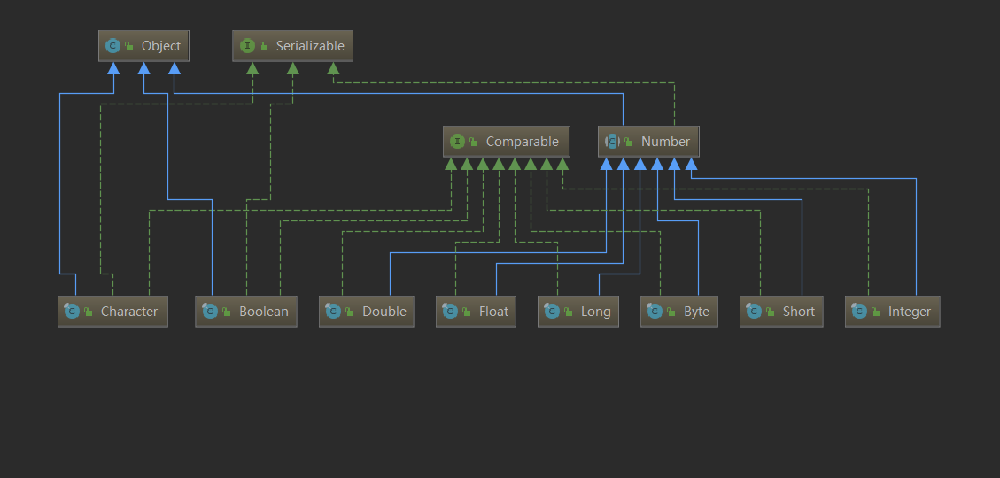

<span style=color:yellow;background:red>**章节在工作、面试过程中作用：**</span>在工作过程中，可能会有一些特殊需求，本节将带大家了解这些特殊的类，后续如果有这些需求，可以考虑使用这些类完成。

# Java包装类型

查看下列代码，请回答下列代码的执行结果是什么？

包装类相关引例

``` java
package com.cskaoyan.day10_other._01wrapper;

/**
 * @author Common-zhou
 * @since 2023-11-06 15:58
 */
public class Demo1 {

    static int end = Integer.MAX_VALUE;
    static int start = end - 5;

    public static void main(String[] args) {
        int count = 0;
        // Non-static field 'start' cannot be referenced from a static context
        for (int i = start; i <= end; i++) {
            count++;
        }

        System.out.println(count);
    }
}

```

首先查看一个经典报错：

> Non-static field 'start' cannot be referenced from a static context

意译过来，就是在一个静态（static）的方法中无法访问一个非静态的成员变量。

我们早就学习过static关键字了，在static修饰的静态成员方法中，是不能直接访问类的成员变量的。

上述代码，可以在end和start两个变量的声明前,加上static就不会再报错了。


当然，这个题目更重要的一点在于：

有符号数的最大值：

1. Integer.MAX_VALUE的二进制是0111 1111 1111 1111 1111 1111 1111 1111
2. Integer.MIN_VALUE的二进制是 1000 0000 0000 0000 0000 0000 0000 0000
3. Integer.MAX_VALUE + 1 = Integer.MIN_VALUE

所以很明显，上述代码，循环会从int类型最大值循环到int类型最小值，再循环到int类型最大值....<span style=color:red;background:yellow>**这是一个死循环！**</span>

当然，让这个代码不死循环也很简单，只需要修改循环条件即可。

**像上述代码中的类Integer其实就是包装类，下面具体讲解一下包装类型。**


## 定义

什么是包装类？

大家都知道：Java是面向对象的语言，Java当中万物皆对象。

但这句话并不严谨，因为Java不是完全面向对象的编程语言。

**因为Java还有基本数据类型变量，它们不是对象。**

所以为了弥补基本数据类型变量非对象的尴尬境地，并且我们确有需求把基本数据类型变量也当成一个对象使用。

Java引入<font color=red>**包装类**</font>的技术。

**所谓包装类，就是把基本数据类型包装成引用数据类型，变成一个个对象, 就可以调用类中的方法**

以下包装类和八种基本数据类型对应关系：

包装类型对照表

| 基本数据类型 |     对应包装类      | 包装类的直接父类 |
| :----------: | :-----------------: | :--------------: |
|     byte     |   java.lang.Byte    |      Number      |
|    short     |   java.lang.Short   |      Number      |
|     int      |  java.lang.Integer  |      Number      |
|     long     |   java.lang.Long    |      Number      |
|    float     |   java.lang.Float   |      Number      |
|    double    |  java.lang.Double   |      Number      |
|   boolean    |  java.lang.Boolean  |      Object      |
|     char     | java.lang.Character |      Object      |

**继承关系**



## 包装类型特点

**包装类型对象不可变**

1. 所有数值包装类型和Boolean类，**都是使用一个对应类型的value成员来存储它的基本数据类型变量的取值的。**

   比如Integer之于int类型，源码如下：

   ```java
   /**
    * The value of the {@code Integer}.
    *
    * @serial
    */
   private final int value;
   ```

2. 这个value都是final修饰的，这就意味着是修改不了的。

3. **所有包装类型都是final修饰的，不能通过继承破坏value的设计体系。**

总之，包装类型中有value成员变量的对象，都是不可变的。

## 基本数据类型与包装类型的相互转换

​		包装类型对象在使用上，在绝大多数情况下，是和它对应的基本数据类型是没有区别的。这依赖于Java"**自动拆装箱**"机制。

拆箱和装箱的概念：

1. 在Java当中，把基本数据类型变量，转换为其对应包装类的引用数据类型变量，称之为"装箱"。
2. 在Java当中，把包装类的引用数据类型类型变量，转换为其对应基本数据类型变量，称之为"拆箱"。

```JAVA
public class Demo2 {
    public static void main(String[] args) {
        // 对于数值类型的包装类。 底层都使用的final修饰。 所以都是不可修改的
        Integer integer = new Integer(10);

        // 对于包装类来说，使用起来和我们使用基础类型差不多，因为jvm有一个自动拆装箱
        // 拆箱： 把包装类转换为基本类型.
        int num = integer;

        // 装箱： 把基本类型转换为包装类型。
        Integer integer1 = 5;
    }
}
```


**手动装箱/拆箱与自动装箱/拆箱**

```java 
@Test
public void testBox() {
    // 1.手动装箱
    int i1 = 1;
    Integer integer1 = new Integer(i1);
    Integer integer2 = Integer.valueOf(i1);

    // 2.手动拆箱。 i1.intValue()
    int i3 = integer1.intValue();

    // 3.自动装箱
    Integer integer4 = 10;

    // 4.自动拆箱
    int i5 = integer4;
}
```


**自动装箱与拆箱**

自动装箱和拆箱其实是一种语法糖，在底层自动调用了方法而已：

1. **自动装箱依赖于，包装类型类名.valueOf(对应基本数据类型值)**

   比如：

   ``` java
   Integer i = Integer.valueOf(123);
   
   Integer i = 123;
   ```

   在代码中出现上述写法，就会警告：

   > Unnecessary boxing 'Integer.valueOf(123)'

   即装箱是自动，无需再手动调用方法。

2. **自动拆箱依赖于，包装类型对象名.基本数据类型名Value()**

   比如：

   <font color=red>**注：这里的i就是上面出现的Integer i引用。**</font>

   ``` java
   int num = i.intValue();
   ```

   在代码中出现上述写法，也一样会警告：

   > // Unnecessary unboxing 'i.intValue()'

   即拆箱是自动，无需再手动调用方法。


需要知道自动拆装箱的概念，在面试的时候要能答出来。 

## 包装类型和String类型的相互转换

**包装类--->String**

```java
/**
 * 包装类转换为String
 * 方式1： 使用toString()
 * 方式2：使用字符串拼接
 * 方式3： 使用String.valueOf()
 */
@Test
public void testWrapper2String() {
    Integer integer = 10;

    // 方式1： 使用toString()
    String s1 = integer.toString();
    System.out.println("s1 = " + s1);

    // 方式2：使用字符串拼接。加上一个空字符串，会变成String
    String s2 = integer + "";
    System.out.println("s2 = " + s2);

    // 方式3： 使用String里的api: valueOf(int i)
    String s3 = String.valueOf(integer);
    System.out.println("s3 = " + s3);
}
```


**String--->包装类**

```java
/**
 * 将String转换为包装类，以Integer举例。其余的类似
 * 方式1： parseInt()  parseXxx()
 * 方式2： Integer.valueOf()
 * 方式3： 使用Integer的构造方法
 */
@Test
public void testString2Wrapper() {
    // 方式1： parseInt
    int i = Integer.parseInt("10");
    // Double.parseDouble()

    // 方式2： Integer.valueOf()
    Integer integer = Integer.valueOf("10");

    // 方式3： 使用构造方法
    Integer integer1 = new Integer("123");
}
```

## 包装类的常用方法

把String字符串转换成各种基本数据类型，普遍使用包装类型类名.parseXxx("字符串数值")

其中Xxx是对应基本数据类型

```java
比如：
String --> int，使用Integer.parseInt("123")
String --> double，使用Double.parseDouble("0.1");
......
```

字符(Character)相关的

```java
// 转换为小写
static char toLowerCase(char ch) 
// 转换为大写
static char toUpperCase(char ch) 
// 确定指定字符是否为大写字母
static boolean isUpperCase(char ch) 
// 确定指定字符是否为小写字母
static boolean isLowerCase(char ch) 
// 否为空格    
static boolean isWhitespace(char ch) 
// 确定指定字符是否为字母或数字
static boolean isLetterOrDigit(char ch) 
// 确定指定字符是否为字母
static boolean isLetter(char ch)
// 确定指定字符是否为数字。
static boolean isDigit(char ch) 
```

```JAVA
@Test
public void testCharacter() {
    Character character = 'a';

    char c1 = Character.toLowerCase(character);
    char c2 = Character.toUpperCase(character);
}
```

## Integer的缓存机制

经典问题, 回答输出结果, 为什么?

```java
@Test
public void testIntegerCache() {
    Integer integer1 = new Integer(1);
    Integer integer2 = new Integer(1);

    System.out.println("(integer1 == integer2) : " + (integer1 == integer2)); // false 。这是两个对象

    Integer integer3 = 1; // 底层使用valueOf(int i)方法
    Integer integer4 = 1; //底层使用valueOf(int i)方法

    System.out.println("(integer3 == integer4) : " + (integer3 == integer4)); // true

    Integer integer5 = Integer.valueOf(1);
    Integer integer6 = Integer.valueOf(1);
    System.out.println("(integer5 == integer6) : " + (integer5 == integer6)); // true
}

@Test
public void testIntegerOf() {
    Integer integer = Integer.valueOf(10);
}
```

原因:

Integer源代码

Integer中有缓存, low=-128   high=127

范围-128-127 , 在这个范围内, 返回同一个

不在范围内, new一个新的对象返回

```java
public static Integer valueOf(int i) {
    if (i >= IntegerCache.low && i <= IntegerCache.high)
        return IntegerCache.cache[i + (-IntegerCache.low)];
    return new Integer(i);
}
```

## Integer的一些面试问题

回答输出结果? 为什么?

**Q1**

```java
@Test
public void test1() {
    // 面试题1：
    Object obj = true ? new Integer(1) : new Double(2.0);
    // 是多少。  --> 1.0
    System.out.println(obj);
    // 是什么类型。  --》 Double
    System.out.println(obj.getClass());
    // 1.0  三目运算符取决于最大范围的double
}
```

**Q2**

```java
@Test
public void test2() {
    Object obj;
    if (true) obj = new Integer(1);
    else obj = new Double(2.0);
    // 1
    System.out.println(obj);
    // Integer
    System.out.println(obj.getClass());
    // 跟上面那个不一样,这是if语句。没有三元表达式的类型强转 
}
```

**Q3**

```java
@Test
public void test3() {
    Integer integer1 = new Integer(127);
    Integer integer2 = new Integer(127);
    System.out.println("(integer1 == integer2) = " + (integer1 == integer2));  // false
    // 这是新建的两个对象，对象地址不一样。 所以为false

    Integer integer3 = 127;
    Integer integer4 = 127;
    System.out.println("(integer3 == integer4) = " + (integer3 == integer4));// true
    // Integer.valueOf() 内部有一个缓存。 只要是[-128,127]，返回的都是同一个Integer
    // Integer.valueOf(10)

    Integer integer5 = 128;
    Integer integer6 = 128;
    System.out.println("(integer5 == integer6) = " + (integer5 == integer6));// false
    // 128 不在这个范围里，所以是返回的一个新的。  所以是false
}
```

## 注意事项

包装类始终是一个类，它是一个引用数据类型，始终是不同于基本数据类型的，所以要注意以下：

1. 使用包装类要注意空指针异常，而基本数据类型没有这个烦恼。
2. <span style=color:red;background:yellow>**包装类对象在比较对象相等时，不能再像基本数据类型一样用"=="比较了！而是要使用"equals"方法。**</span>

在以上注意事项中，尤其注意不能使用"=="比较大小，这里我们做一下原理的讲解。

包装类型在比较对象相等时，要分三种情况：

1. 整型包装类型对象之间的比较
2. 浮点型包装类型对象之间的比较
3. Boolean对象之间的比较

### 整型包装类型对象相等的比较

简单来说，整型的包装类型对象：

1. 当它的取值在一个byte即[-128,127]的取值范围内时，会从缓存（cache）中共享同一个对象。

   这样的话，这个范围的整型包装类型对象，用"=="判断就是true。

2. 但是一旦它的取值超出了一个byte的取值范围，那么就会重新创建一个对象。

   这样的话，用"=="判断就是false。

不同的整型包装类型对象，一个byte的取值范围的对象缓存生成时机是不同的：

1. Integer对象是在JVM启动时就把对象放入缓存。
2. 其余整型对象是在具体使用时把对象放入缓存。

```JAVA
public static Byte valueOf(byte b) {
    final int offset = 128;
    return ByteCache.cache[(int)b + offset];
}
```


### 浮点型包装类型对象相等的比较

浮点型包装类型对象是没有缓存存在的，查看浮点型包装类的valueOf方法可以发现：

**Double的valueOf方法**

``` java
public static Double valueOf(double d) {
 return new Double(d);
}
```

所以浮点型包装类型如果直接用字面值赋值，一定会创建新对象，不能用"=="比较大小

```java
Double d3 = 2.0;
Double d4 = 2.0;
System.out.println(d3 == d4);// false
```

### 布尔型对象相等的比较

查看Boolean包装类的valueOf方法可以发现：

**Boolean的valueOf方法**

``` java
public static Boolean valueOf(boolean b) {
 return (b ? TRUE : FALSE);
}
```

那么TRUE和FALSE又是什么呢？

**Boolean的全局常量**

``` java
/**
 * The {@code Boolean} object corresponding to the primitive
 * value {@code true}.
 */
public static final Boolean TRUE = new Boolean(true);
/**
 * The {@code Boolean} object corresponding to the primitive
 * value {@code false}.
 */
public static final Boolean FALSE = new Boolean(false);
```

**注:**

**建议包装类型对象比较内容还是使用equals方法, 不要使用==**


## 使用场景

包装类的使用场景还是比较多的，最常见的：

1. 包装类把基本数据类型变为一个对象，并且存在自动拆装箱，有些时候这本身就是一个用途
2. 集合当中使用，集合只能存储对象，所以集合中就要用包装类型替代基本数据类型
3. 获取一些最值之类的常量。（`Integer.MAX_VALUE`）
4. 做进制转换，类型转换等操作(`Integer.parseInt("777", 8);`)
5. 后续做项目, 写接口的时候也建议使用包装类型(需要判断null)

# Java枚举类型

## 引入

需求:

>定义一个表示星期的类WeekDay, 定义2个属性
>
>String name: 表示是周几
>
>int  id: 表示编号(1-7)
>
>创建并打印相应的对象

```java
package com.cskaoyan.day10_other._02enum;

/**
 * 现在想用代码表示 周一 ~ 周日。
 * 里面有两个属性，name和id。 name (周一、周二。。。)； id(1-7)
 * 传统做法： 新建一个类，然后创建周一 ~ 周日
 *
 * @author Common-zhou
 * @since 2023-11-06 19:39
 */
public class Demo1 {
    public static void main(String[] args) {
        Weekday day1 = new Weekday(1, "周一");
        Weekday day2 = new Weekday(2, "周二");
        // ...
        Weekday day7 = new Weekday(7, "周日");

        // 以上是正常的使用，但是我们发现，还可以错误的使用
        Weekday day8 = new Weekday(8, "周八");
    }
}

class Weekday {
    int id;
    String name;

    public Weekday(int id, String name) {
        this.id = id;
        this.name = name;
    }
}

```

​		经过测试, 我们发现不仅能够创建周一到周日的对象, 还能够创建其他的对象, 但是实际上我们的需求只需要7个固定的对象, 其余的不需要, 不满足我们的需求

这种情况下,我们需要**枚举类型(enumeration)**(一个个的列举) , 一个特殊的类用来存放固定的几个常量对象(周一到周日)

## 枚举的两种实现方式

- 自定义类实现枚举
- 使用Enum关键字实现枚举

### 自定义类实现枚举

1. 构造方法私有, 不允许外部创建对象, 类内部可以创建, 保证数量是固定的
2. 枚举对象名通常使用大写
3. 对枚举对象(属性)使用static final修饰, 保证是常量, 能够通过类名去访问(暴露给外部访问的一个入口)
4. 不需要提供setXXX()方法, 枚举对象通常为只读


```java 
class WeekDay2 {
    public static final WeekDay2 MONDAY = new WeekDay2(1, "周一");
    public static final WeekDay2 TUESDAY = new WeekDay2(2, "周二");
    public static final WeekDay2 WEDNESDAY = new WeekDay2(3, "周三");
    public static final WeekDay2 THURSDAY = new WeekDay2(4, "周四");
    public static final WeekDay2 FRIDAY = new WeekDay2(5, "周五");
    public static final WeekDay2 SATURDAY = new WeekDay2(6, "周六");
    public static final WeekDay2 SUNDAY = new WeekDay2(7, "周日");

    int id;
    String name;

    // 构造方法私有
    private WeekDay2(int id, String name) {
        this.id = id;
        this.name = name;
    }

    public int getId() {
        return id;
    }

    public String getName() {
        return name;
    }

    @Override
    public String toString() {
        return "WeekDay2{" + "id=" + id + ", name='" + name + '\'' + '}';
    }
}

```


### 使用enum关键字实现枚举

#### 语法

枚举类型的定义使用关键字<span style=color:red;background:yellow>**enum**</span>，语法如下：

**枚举的定义语法**

``` java
[访问权限修饰符] enum 枚举类型名字{
// 枚举体
}

```

解释：

1. 枚举类型的访问权限修饰符和class类是一致的。

2. enum是枚举定义关键字，等同于关键字class。

3. 枚举类型的名字可以看成类名，同样需要大驼峰书写，同样“见名知意”。

4. 枚举体的定义，实际上就是定义一个一个的常量，用"逗号,"隔开。枚举体中的单个常量的名字应该全部大写。并且放在枚举体的最上面


按照上述的规则，我们定义一个包含周一到周日的常量的一个枚举类型：

**枚举的定义举例**

``` java
// 枚举类型，使用关键字enum
enum WeekDay {
    // 常量对象
    MONDAY("周一", 1),
    TUESDAY("周二", 2),
    WEDNESDAY("周三", 3),
    THURSDAY("周四", 4),
    FRIDAY("周五", 5),
    SATRUDAY("周六", 6),
    SUNDAY("周日", 7);

    private String name;
    private int id;

    // 构造方法私有
    private WeekDay(String name, int id) {
        this.name = name;
        this.id = id;
    }

    public String getName() {
        return name;
    }

    public int getId() {
        return id;
    }

    @Override
    public String toString() {
        return "WeekDay{" +
                "name='" + name + '\'' +
                ", id=" + id +
                '}';
    }
}
```

**注意:**

- 常量对象需要写在枚举体的首位


#### 基本使用

我们仍然以上述的星期常量为案例，使用枚举类型来改写一下这个方法：

注：switch当中是可以使用枚举类型的。

**使用枚举类型来替代常量**

``` java
public class Demo3 {
    public static void main(String[] args) {
        test(WeekDay3.MONDAY);

        test(WeekDay3.SUNDAY);
    }

    private static void test(WeekDay3 weekDay) {
        switch (weekDay) {
            case MONDAY:
                System.out.println("星期一");
                break;
            case TUESDAY:
                System.out.println("星期二");
                break;
            // ...
            case SUNDAY:
                System.out.println("星期日");
                break;

        }
    }
}
```


#### 原理(了解)

枚举类型是一种引用数据类型，那么它和class类有什么关系呢？所谓枚举类型是一个什么类型呢？

这个问题的答案很简单，枚举类型就是一个class类，只不过它比较特殊，编译器在<font color=red>**“背地里偷偷做了一些事情”**</font>。为了还原编译器对枚举类型做的“特殊操作”，我们需要<font color=red>**反编译工具**</font>来协助我们。

请按照以下步骤进行操作：

1. 定义一个枚举类型，比如：

   枚举类型

   ```` java
   enum WeekDayNum {
   MONDAY, TUESDAY, WEDNESDAY,
   THURSDAY, FRIDAY, SATURDAY, SUNDAY
   }
   ````

2. 编译以上代码，得到WeekDayNum.class文件，并通过Xjad反编译工具就可以得到编译器特殊处理后的代码：

   编译器特殊处理后的枚举类型

   ```` java
   package com.cskaoyan.javase.test;
   final class WeekDayNum extends Enum<WeekDayNum> {
       public static final /* enum */ WeekDayNum MONDAY = new WeekDayNum("MONDAY", 0);
       public static final /* enum */ WeekDayNum TUESDAY = new WeekDayNum("TUESDAY", 1);
       public static final /* enum */ WeekDayNum WEDNESDAY = new WeekDayNum("WEDNESDAY", 2);
       public static final /* enum */ WeekDayNum THURSDAY = new WeekDayNum("THURSDAY", 3);
       public static final /* enum */ WeekDayNum FRIDAY = new WeekDayNum("FRIDAY", 4);
       public static final /* enum */ WeekDayNum SATURDAY = new WeekDayNum("SATURDAY", 5);
       public static final /* enum */ WeekDayNum SUNDAY = new WeekDayNum("SUNDAY", 6);
       private static final /* synthetic */ WeekDayNum[] $VALUES;
         
       public static WeekDayNum[] values() {
           return (WeekDayNum[])$VALUES.clone();
       }
         
       public static WeekDayNum valueOf(String name) {
           return Enum.valueOf(WeekDayNum.class, name);
       }
         
       private WeekDayNum(String string, int n) {
           super(string, n);
       }
           
       static {
           $VALUES = new WeekDayNum[]{MONDAY, TUESDAY, WEDNESDAY, THURSDAY, FRIDAY, SATURDAY, SUNDAY};
       }
   }
   ````

根据以上反编译代码，我们可以得出以下结论（枚举类型的原理）：

1. 使用enum关键字定义枚举类型并编译后，编译器会为我们生成一个相关的final类，这个类继承了<font color=red>**java.lang.Enum类**</font>, 所以枚举类型就不能再继承其他类了, 实现接口可以.

2. <span style=color:red;background:yellow>**枚举类型当中定义的常量，实际上都是这个枚举类型的“public static final”修饰的全局常量对象。**</span>

   所以，下列代码就可以写出来了：

   枚举类型使用代码

   ```` java
   WeekDayNum monday = WeekDayNum.MONDAY;
   // test方法需要一个枚举类型作为参数，实际上是需要传入该枚举类型的对象。而枚举类型当中定义的常量都是该类型的全局常量对象。
   test(WeekDayNum.TUESDAY);
   ````

3. 构造方法是private的

4. 实际上编译器还自己创建了一个values[]对象数组来存放所有的常量对象，一个values( )方法，一个valueOf(String name )方法, 返回该字符串对应的常量对象

所以枚举类型就是一个普通类，只不过编译器对使用enum关键字定义的类有特殊处理。


其实就是帮助我们写了一些常量对象。 

#### 练习

**需求:**

一个支付场景, 假设某个APP只支持支付宝, 微信, 银联, ApplePay 这四种固定支付方式, 需要记录用户使用的支付方式, 以便于统计用户支付习惯进行数据分析(用户画像)

我们可以使用枚举类型来描述这几种固定支付方式


> 定义枚举类型enum PayType来进行描述, 根据用户选择的支付方式进行记录
>
> 定义4个支付常量
>
> ALIPAY, 支付宝支付
>
> WECHATPAY, 微信支付
>
> BANKPAY, 银联支付
>
> APPLEPAY , 苹果支付

Code

```java
public enum PaymentTypeEnum {
    ZFB(1,"zfb","支付宝支付"),
    WECHAT(2,"wechat","微信支付"),
    BANK(3, "bank", "银联支付");

    private int id;
    private String code;
    private String label;

    PaymentTypeEnum(int id, String code, String label) {
        this.id = id;
        this.code = code;
        this.label = label;
    }

    public int getId() {
        return id;
    }

    public String getCode() {
        return code;
    }

    public String getLabel() {
        return label;
    }

    // 根据id查找支付类型
    public static PaymentTypeEnum findById(int id) {
        for (PaymentTypeEnum type : PaymentTypeEnum.values()) {
            if (type.getId() == id) {
                return type;
            }
        }
        return null;
    }

}


public class Demo {
    public static void main(String[] args) {
        // 支付类型测试
        // 假设前端给我传过来一个支付类型id为2
        int id = 2;
        // 需要查找类型id为2的支付方式
        PaymentTypeEnum type = PaymentTypeEnum.findById(id);
        if (type != null) {
            testPayment(type);
        }
    }

    public static void testPayment(PaymentTypeEnum type) {
        switch (type) {
            case ZFB:
                System.out.println("采用支付宝支付,支付id=" + type.getId());
                break;
            case WECHAT:
                System.out.println("采用采用微信支付,支付id=" + type.getId());
                break;
            case BANK:
                System.out.println("采用采用银联信支付,支付id=" + type.getId());
                break;
        }

    }

}
```

#### 使用枚举的场景

- 表示订单状态(已完成, 已支付, 未支付, 进行中, 已取消......)
- 表示支付方式(微信, 支付宝, 银行卡, 信用卡, ApplyPay , GooglePay, Paypal.....)
- 表示物流状态(已揽收, 运送中, 派件, 已签收......)
- 表示用户等级(普通用户, VIP, SVIP.......)
- ......

在企业中，有时候会有这种枚举的需求。 

# Date日期类

> 在JDK版本的迭代中，Java对<font color=red>**日期表示**</font>的设计，可谓是改了又改，提供了很多个类来表示日期：
>
> 在JDK1.0版本时，就在java.util包下提供了 Date 类来表示日期，随着JDK版本迭代，这个类当中的方法大多已过时。但作为Java中基础的表示时间和日期的类，它仍然是常用类之一，非常有学习的必要。
>
> 而到了Java 8以后，Java中又提供了新的日期表示，提供了诸如：LocalDate、Calendar等新的日期类。
>
> 在绝大多数普通开发场景当中，表示时间，使用基础的Date类足够了，这里我们就来学习一下这个Date类，至于Java8之后提供的新日期类，大家可以根据实际情况，再去选择学习一下。

首先，提出一个问题，作为引子：Date类作为一个表示时间和日期的类，是如何表示时间和日期的呢？

Date类的对象表示一个特定的时刻瞬间，精确到毫秒，更具体一点来说，<span style=color:red;background:yellow>**Date类的对象中是通过存储一个long类型的时间戳进而来存储时间的。**</span>


Date是怎么存储日期和时间的？   

是存储时间戳来表示时间的。  比如，现在是  `2024.1.17 10:24:01`。直接算，到  `1970.1.1 00:00:00`的时间。 

## 时间戳

时间戳本身是一个比较复杂的概念，而Java语言当中所使用的时间戳主要是指Unix时间戳，它的涵义是：

> 从格林威治时间（GMT时间，世界时的起点）1970年01月01日00时00分00秒（**北京时间是1970年01月01日08时00分00秒**）到现在的秒数（毫秒数）。

在Java中存储的时间戳是一个long类型的毫秒数，即Date类当中的成员变量：

```java
class Date{
    // 就是用来存储 毫秒数的
    private transient long fastTime;
    
    public Date(long date) {
        fastTime = date;
    }
}
```

## 构造方法

我们来看一下Date类目前还能够使用的，没有过时的两个构造方法：

```java
// 该构造函数使用当前日期和时间来创建对象	
Date()
// 使用一个时间戳来创建对应时间的日期对象
Date(long date)
```

该类的构造器源码如下：

```` java
public Date() {
 this(System.currentTimeMillis());
}
public Date(long date) {
 fastTime = date;
}
````

所以实际上，Date类只有一个构造器，那就是给<font color=red>**fastTime**</font>成员变量赋值的构造器。

无参构造器当中使用了以下代码来获取一个毫秒值：

> System.currentTimeMillis()

这个方法是一个本地方法，该方法会根据操作系统时间来获取当前的时间戳。该方法还是挺有用的，大家可以记一下。

比较有用。 后续在计时的时候可以使用。 

```JAVA
long startTime = System.currentTimeMillis();
test1();
long endTime = System.currentTimeMillis();
```

## 成员方法

首先，我们先介绍一下Date类的toString方法，该方法的作用是输出该Date对象所表示的时间，格式是：

> 星期 月份 天数 hh：mm：ss 时区缩写 年份
>
> 中国的时区缩写是CST（China Standard Time）

Date类的成员方法也大多过时了，需要大家了解的<font color=red>**成员方法**</font>只有两个：

用一个时间戳来设置Date对象：

```` java
void setTime(long time)
````

获取当前Date对象的时间戳的毫秒值：

```` java
long getTime()
````

以上方法大家在使用时，必然会觉得时间戳和现实的时间格式差距比较大，难以转换。这里提供一个时间戳的转换网站：

[时间戳(Unix timestamp)转换工具 - 在线工具 (tool.lu)](https://tool.lu/timestamp/)

最后，再啰嗦一点就是：中国处在东八区，格林威治时间1970 年 1 月 1 日 00:00:00是中国的1970 年 1 月 1 日 08:00:00

比如我们使用以下方式设置一个Date对象：

```` java
date.setTime(0);
````

打印这个对象，会得到以下输出结果：

> Thu Jan 01 08:00:00 CST 1970

# SimpleDateFormat日期格式类

用来格式化或者将String转换为Date的。 

格式化： 将Date对象转换为你想要的格式输出，最终得到一个字符串

解析： 将String类型的时间，转换为Date对象。 

## 构造方法

**SimpleDateFormat构造器**

```` java
// 以传入的字符串格式进行解析或者格式化日期
public SimpleDateFormat(String pattern)
````

该构造器的参数pattern用来表示日期字符串的格式，但这个格式不是乱写的，请参考以下格式：

- y：表示年，例如yyyy，表示千年年份
- M：表示月份，例如MM，表示月份（最多12，两位数）
- d：表示月份中的天数，例如dd，表示天数（最多31，两位数）
- H：表示一天中的小时数，例如HH，表示小时数（最多24，两位数）
- m：表示小时中的分钟数，例如mm，表示分钟数（最大59，两位数）
- s：表示分钟里的秒数，例如ss，表示秒数（最大59，两位数）

举一个例子来说，假如你希望按照下列格式表示时间：

> 2022/10/10 10:10:10（2022年10月10日 十时十分十秒）

这个pattern参数就应该写作：

> yyyy/MM/dd HH:mm:ss


```JAVA
2022/10/10 10:10:10   --->  yyyy/MM/dd HH:mm:ss
2022-10-10 10:10:10   --->  yyyy-MM-dd HH:mm:ss
```

## 成员方法

这里特别要强调的一点是：SimpleDateFormat对象是日期格式对象，它仅仅只是描述时间和日期的格式，并不能代表时间和日期。表示时间和日期我们仍然需要Date类来协助！

在使用日期格式类时，我们仅需要关注下面两个成员方法就足够了：

1. 将Date对象转换成对应日期字符串表示，该方法需要传入一个Date对象，然后返回一个日期字符串String对象。(Date ----> String)

   这个过程，一般称呼为“格式化”，使用以下方法：

   ```` java
   public final String format(Date date)
   ````

2. 将日期表示的字符串转换成对应的Date对象，该方法需要传入一个<span style=color:red;background:yellow>**“按照pattern格式编写的日期字符串”**</span>，然后返回一个Date对象。(String ----> Date)

   这个过程，一般称呼为“解析”，使用以下方法：

   ```` java
   public Date parse(String source)
   ````

上述两个方法在使用时都可能抛出异常，使用时按照规范使用即可。

# 格式化输出

如果不使用格式化输出，就需要进行字符串连接，如果变量比较多，拼接就会显得繁琐
使用占位符进行格式化输出，就可以简洁明了

## 常用的占位符

| 转换符 | 说明                       | 示例               |
| ------ | -------------------------- | ------------------ |
| %s     | 字符串类型                 | "hello"            |
| %c     | 字符类型                   | 'a'                |
| %n     | 换行符                     |                    |
| %d     | 整数类型(10进制)           | 99                 |
| %f     | 浮点类型                   | 99.9999            |
| %.xf   | 浮点类型(.x表示小数的位数) | 99.99(保留2位小数) |

## 使用输出

### printf/format

占位符的使用主要结合**printf**和**format**方法

```java
//使用指定格式字符串和参数将格式化字符串写入此输出流中。
// 参数解释: format为需要被格式化的字符串 args为实际被替换的值
format(String format, Object... args) 
printf(String format, Object ... args)
```

- System.out.format()
- System.out.printf()
- String.format()


Demo1

```java 
@Test
public void test1() {
    // 格式化输出。 如果不使用格式化，需要进行大量的字符串拼接，才能得到我们想要的结果。
    // 格式化输出就是帮助我们完成这个事情。
    String name = "黄鹤";
    int money = 100;

    String s = "好消息，好消息，江南皮革厂倒闭了，老板%s欠了%d万，带着小姨子跑了%n";

    String formattedString = String.format(s, name, money);

    System.out.println(formattedString);
    System.out.format(s, name, money);
    System.out.printf(s, name, money);
}
```


Demo2

```java
@Test
public void test2() {
    int year = 2022;
    double num = 3.1415;

    // 直接输出数字
    System.out.format("|%d|%n", year);

    // 总长度是8，默认右对齐
    System.out.format("|%8d|%n", year);

    // 左对齐
    System.out.format("|%-8d|%n", year);

    // 总长度为8，不够补0
    System.out.format("|%08d|%n", year);
    System.out.println(num);

    System.out.format("|%.2f|%n", num);
}
```

### MessageFormat

除了printf与format方法外, 还可以使用MessageFormat类, 它提供了更为简单的格式化的方式, 主要使用其静态方法format()

```java
static String format(String pattern, Object... arguments) 
// 创建具有给定模式的 MessageFormat，并用它来格式化给定的参数。 
```


Dmeo

需要被格式化的字符串中, 使用{index}进行占位, 从0开始, 使用format方法时, 实际的值要与每个index相对应

```java 
@Test
public void test3() {
    // 使用MessageFormat  使用 {0} {1} 等来表示下标元素
    String s = "hello {0}, 我是{1}, 今年{2}岁, 我有{3}元";
    String format = MessageFormat.format(s, "zs", "ls", 25, 99.9);

    System.out.println(format);
}
```

