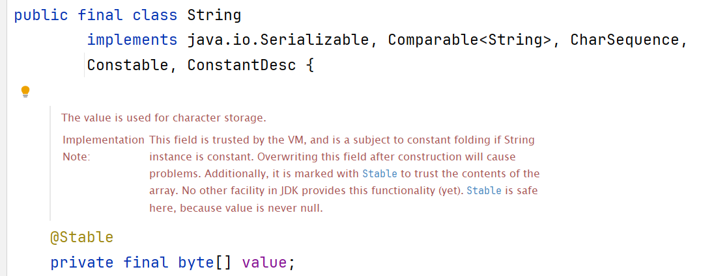
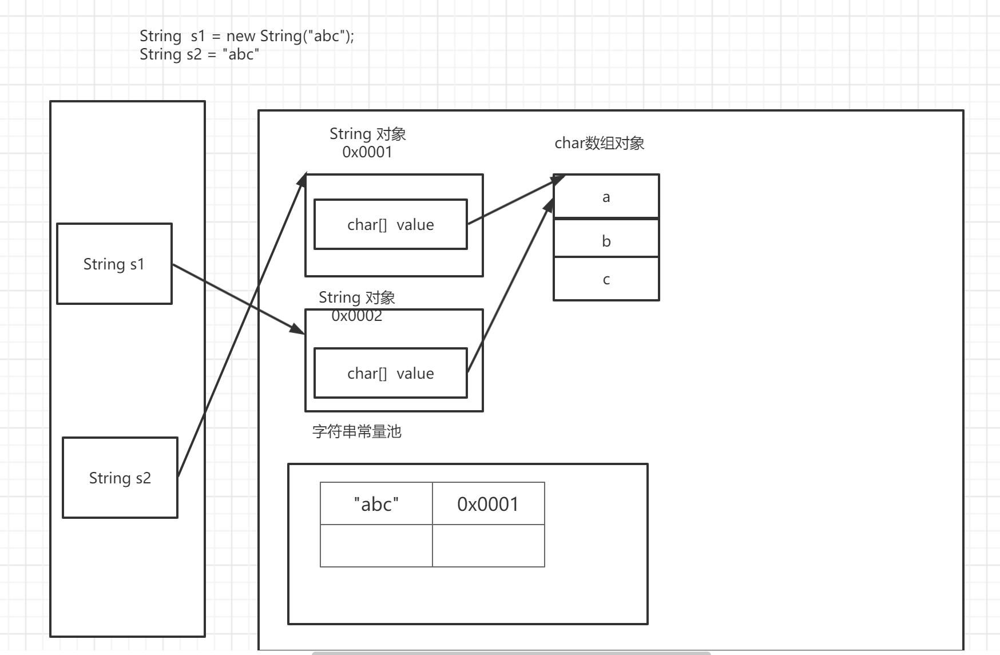
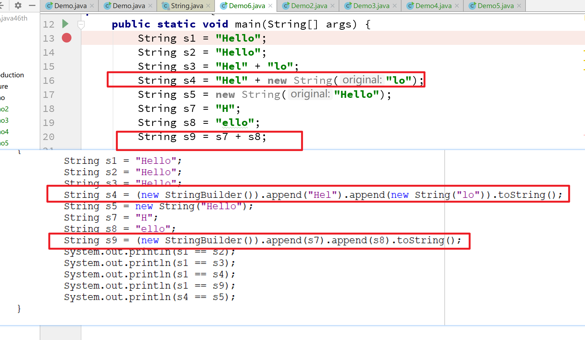

[TOC]

学习目标:

- 熟悉String构造方法
- 掌握String特点
- 熟悉String常用API
- 掌握自然排序
- 掌握可变长字符串的特点与使用


<span style=color:yellow;background:red>**章节在工作、面试过程中作用：**</span>String是工作过程中，最常使用的一个类。在面试过程中，也会问到该块的内容，所以熟练掌握本节，非常有必要。

# String概述

## 基本介绍

基本介绍

- 一个字符串是由多个字符组成的一串数据(字符序列,字符数组)

- String类代表字符串,Java 程序中的所有字符串字面值（如 "abc" ,"你好","の"）都作为此类的实例实现

- 在java.lang包下,是java核心类,最常用类,但是不属于基本数据类型,引用类型

- String类提供了字符串表示、比较、查找、截取、大小写转换等各种针对字符串的操作

## 构造方法

- 空字符串""
- byte[] -----> String
- char[] -----> String 

```java
//空字符串 ""  
public String()  

//利用字节数组，创建字节数组所表示的字符串
// 1. 字符 -> 数值形式  'a' -> 97
// 2. 所以可以用多个字节值，表示多个字符——>即字符序列 public
String(byte[] bytes)

//利用字节数数组的一部分，创建字符序列, 从byte数组的offset开始的length个字节值
public String(byte[] bytes,int offset,int length)

//利用一个字符数组创建字符数组，代表的字符序列
public String(char[] value)

// 创建value字符数组中，从第offset位置开始的count个字符，所代表的字符串对象
public String(char[] value,int offset,int count)

//知道即可
public String(String original)  
```


Demo 

```java 
package com.cskaoyan.day11_string._01introduct;

import org.junit.Test;

/**
 * String 字符串类，是Java中用来表示字符串非常重要的一个类。
 * - 一个字符串是由多个字符组成的一串数据(字符序列,字符数组)
 * - String类代表字符串,Java 程序中的所有字符串字面值（如 "abc" ,"你好","の"）都作为此类的实例实现
 * - 在java.lang包下,是java核心类,最常用类,但是不属于基本数据类型,引用类型
 * - String类提供了字符串表示、比较、查找、截取、大小写转换等各种针对字符串的操作
 * @author Common-zhou
 * @since 2023-11-07 11:50
 */
public class Demo1 {

    @Test
    public void testConstructor1() {
        // String的构造方法。空字符串
        String s1 = new String();
        System.out.println(s1);

        // 传入一个字符串。知道即可
        String s2 = new String("zhangsan");
        System.out.println(s2);
    }

    /**
    
     */
    @Test
    public void testConstructor2() {
        // 利用字节数组，创建字节数组所表示的字符串
        // 1. 字符 -> 数值形式  'a' -> 97
        // 2. 所以可以用多个字节值，表示多个字符——>即字符序列 public
        // String(byte[] bytes)
        byte[] bytes = {97, 98, 99, 100};
        String s = new String(bytes);
        System.out.println(s);

        // 利用字节数数组的一部分，创建字符序列, 从byte数组的offset开始的length个字节值
        // public String(byte[] bytes,int offset,int length)
        String s1 = new String(bytes, 0, 2);
        System.out.println(s1);
    }

    /**
     * public String(char[] value)
     * public String(char[] value,int offset,int count)
     */
    @Test
    public void testConstructor3() {
        // 利用一个字符数组创建字符数组，代表的字符序列
        // public String(char[] value)
        char[] chars = {'h', 'e', 'l', 'l', 'o'};
        String s3 = new String(chars);
        System.out.println("s3 = " + s3);

        // 创建value字符数组中，从第offset位置开始的count个字符，所代表的字符串对象
        // public String(char[] value,int offset,int count)
        String s = new String(chars, 1, 2);
        System.out.println(s);
    }

}
```

# String特点(重点)

## String对象不可变

对象一旦被创建后，对象所有的状态及属性在其生命周期内不会发生任何变化。

1.请键盘录入一个任意字符串s，并用一个temp字符串引用也指向它
这个时候修改temp字符串的内容，请问s字符串的内容会随之改变吗？

```java 
package com.cskaoyan.day11_string._02trait;

import java.util.Scanner;

/**
 * 1.将一个字符串指向 zhangsan
 * 这个时候修改temp字符串的内容，请问s字符串的内容会随之改变吗？
 * @author Common-zhou
 * @since 2023-11-07 14:59
 */
public class Demo1 {
    public static void main(String[] args) {
       
        String temp = "zhangsan";
        
        String s = temp;
        // 改变temp内容
        temp = "lisi";

        // 现在s的值变了没有？
        System.out.println("s = " + s);
        System.out.println("temp = " + temp);
    }
}
```


2

```java 
@Test
public void test2() {
    String s = "张三";
    System.out.println("s = " + s);

    s = "hello 张三";
    System.out.println("s = " + s);
}
```

输出结果是多少?原因是什么?


**原因与本质**

- String是一个final类,不能被继承, 代表不可变的字符序列
- 字符串是常量,用双引号引起来,他们的值在创建之后不可更改
- String对象的内容是存储在字符数组value[ ]中的。（JDK9将其改为了字节数组）





## 字符串常量池

字符串的分配和其他对象分配一样，是需要消耗高昂的时间和空间的，而且字符串使用的非常多

JVM为了提高性能和减少内存的开销，在实例化字符串对象的时候进行了一些优化：

**使用字符串常量池。**

首先要明确，Java的双引号引起来的字面值常量字符串，它们都是对象。这些对象比较特殊，程序在编译时期就能确定它们的值

<span style='color:red;background:yellow;font-size:文字大小;font-family:字体;'>**每当创建字符串常量对象时，JVM会首先检查字符串常量池，如果该字符串对象引用已经存在常量池中，那么就直接返回常量池中的实例引用。如果字符串对象引用不存在于常量池中，就会实例化该字符串并且将其引用放到常量池中。**</span>


```JAVA
// 什么叫做常量
"abc"
    
new String("abc")
```


```java
// 当常量池中已有字符串对象的引用时,不会在堆上再创建, 而使用同一引用
String s1 = "abc";
String s2 = "abc";
```


### String两种实例化方式

两种方式

- 直接赋值 String s = "abc"
- 构造方法 String s = new String("abc")


第一种 先直接赋值 再构造

```java 
String s = "abc";
String s1 = new String("abc")
```


第二种 先构造 再直接赋值

```java
String s1 = new String("abc")
String s2 = "abc";
```




总结:

- 先String s = new String("abc"), 再String s1 = "abc".  new String 的时候会创建2个对象, 直接赋值的时候, 直接用的是常量池的引用
- String s1 = "abc", 再String s = new String("abc"),  直接赋值的方式会创建一个对象, new String的时候会创建1个对象

大家要知道，创建了几个对象出来。 

面试题：

```JAVA
case1:  
String s1 = "abc";
String s2 = new String("abc");   
现在，创建了几个对象出来？ 
    
case2:
String s1 = new String("abc");
String s2 = "abc";
```

### 字符串常见问题与练习

#### 字符串比较

```java
@Test
public void test1() {
    String s1 = new String("hello");
    String s2 = new String("hello");
    System.out.println(s1 == s2); // false
    System.out.println(s1.equals(s2)); // true

    String s3 = new String("hello");
    String s4 = "hello";
    System.out.println(s3 == s4); // false
    System.out.println(s3.equals(s4)); // true

    String s5 = "hello";
    String s6 = "hello";
    System.out.println(s5 == s6); // true
    System.out.println(s5.equals(s6)); // true
}
```

==与equals方法有什么区别?

- == ,对于基本数据类型而言,比较的是内容,对于引用数据类型而言,比较的是引用变量,即所指向的地址
- equals方法是Object的方法,默认是比较2个对象的地址,若要比较内容,应当重写父类方法

String中重写的equals方法:挨个比较每一个字符，如果有一个不相等，为false。


```JAVA
// JDK17的实现。 
// String s = new String("abc");
// s.equals("abc");
public boolean equals(Object anObject) {
    if (this == anObject) {
        return true;
    }
    return (anObject instanceof String aString)
            && (!COMPACT_STRINGS || this.coder == aString.coder)
            && StringLatin1.equals(value, aString.value);
}

// 就是挨个比较每一位。
StringLatin1.equals(value, aString.value);

// JDK8的写法类似。 
```

<span style=color:yellow;background:red>**后续，在比较引用数据类型的时候，一定要用equals方法。 可以避免很多bug。 **</span>

即使是String, 有常量池的存在。  

```JAVA
String s = "hello";

String s1 = new String("hello");

if(s == s1){
    
}
```

#### 字符串拼接

```java
@Test
public void test2() {
    String s1 = "Hello";
    String s2 = "Hello";
    String s3 = "Hel" + "lo";
    String s4 = "Hel" + new String("lo");
    String s5 = new String("Hello");

    System.out.println("[s1 == s2] : " + (s1 == s2));// true
    System.out.println("[s1 == s3] : " + (s1 == s3));// ?
    System.out.println("[s1 == s4] : " + (s1 == s4));// false
    System.out.println("[s4 == s5] : " + (s4 == s5));// false

    String s7 = "H";
    String s8 = "ello";
    String s9 = s7 + s8;
    String s10 = "Hello";

    System.out.println("[s9 == s10] : " + (s9 == s10));// false
}
```




**进行字符串拼接的时候有2种情况**

- 当参与字符串拼接对的2个字符串,只要有1个引用变量的形式出现时,则会在堆上创建新的字符串对象.
  - 原因是因为参与了运算,无法在编译期确定其值,就不能在编译时期加入常量池
- 只有参与字符串拼接的2个字符串都是字面值常量的时候
  - 如果常量池中已有该字符串对象的引用,则返回常量池中的引用
  - 如果常量池中没有,则在堆上创建,并把引用放入常量池

# String API

## 判断功能

```java
用来比较字符串的内容，注意区分大小写
boolean equals(Object obj)
    
忽略字符串大小写比较字符串内容，常见用于比较网址URL
boolean equalsIgnoreCase(String str)
    
判断一个字符串，是不是空字符串 
boolean isEmpty()
    
判断当前字符串对象是否包含，目标字符串的字符序列 
boolean contains(String str)
    
判断当前字符串对象，是否已目标字符串的字符序列开头
boolean startsWith(String str)
    
判断当前字符串，是否以目标字符串对象的字符序列结尾，常用于确定文件后缀名格式
boolean endsWith(String str)
```


```JAVA
@Test
public void test1() {
    // boolean equals(Object obj)
    // boolean equalsIgnoreCase(String str)
    String s1 = "abc";
    String s2 = new String("abc");
    String s3 = new String("ABc");
    // 比较两个字符串是否相等。
    System.out.println(s1.equals(s2)); // true
    System.out.println(s1.equals(s3)); // false
    System.out.println(s1.equalsIgnoreCase(s3)); // true

    System.out.println(s1.isEmpty());
    System.out.println("".isEmpty());
}
@Test
public void test2() {
    // 判断当前字符串对象是否包含，目标字符串的字符序列
    // boolean contains(String str)

    String s1 = "abc";
    System.out.println(s1.contains("a"));
    System.out.println(s1.contains("ab"));
    System.out.println(s1.contains("ac"));

    // 判断当前字符串对象，是否已目标字符串的字符序列开头
    // boolean startsWith(String str)
    System.out.println(s1.startsWith("a"));
    System.out.println(s1.startsWith("b"));

    // 判断当前字符串，是否以目标字符串对象的字符序列结尾，常用于确定文件后缀名格式
    // boolean endsWith(String str)
    System.out.println(s1.endsWith("c"));
    System.out.println(s1.endsWith("bc"));
}
```

## 获取功能

```java 
获取当前字符串对象中，包含的字符个数 "abcd"
int length()
    
获取字符串对象代表字符序列中，指定位置的字符 从0开始"abcd"
char charAt(int index)
    
在当前字符串对象中查找指定的字符，如果找到就返回字符，首次出现的位置，如果没找到返回-1
也可以填字符   "abcdb"
int indexOf(int ch)
    
指定从当前字符串对象的指定位置开始，查找首次出现的指定字符的位置，(如果没找到返回-1)
可以填入字符
int indexOf(int ch,int fromIndex) 
    
查找当前字符串中，目标字符串首次出现的位置(如果包含)，找不到，返回-1
这里的位置是指目标字符串的第一个字符,在当前字符串对象中的位置  "abcdefg"
int indexOf(String str) 

指定，从当前字符串对象的指定位置开始,查找首次出现的指定字符串的位置(如果没找到返回-1)
这里的位置是指目标字符串的第一个字符,在当前字符串对象中的位置
int indexOf(String str,int fromIndex)

返回字符串，该字符串只包含当前字符串中，从指定位置开始(包含指定位置字符)到结束的那部分字符串  "abcdef"
String substring(int start)   
    
返回字符串，只包含当前字符串中，从start位置开始(包含)，到end(不包含)指定的位置的字符串  [ , )
String substring(int start,int end) 
```

Demo 

```java 
public class Demo2 {
    /**
     * 使用的比较多的API
     * int length()
     * char charAt(int index)
     */
    @Test
    public void test1() {
        // int length()
        // char charAt(int index)
        String name = "zhangsan";
        // 获取字符串的长度。
        System.out.println(name.length());
        // 获取指定下标的字符
        System.out.println(name.charAt(0));
        System.out.println(name.charAt(1));
    }

    @Test
    public void test2() {
        // 获取字符出现的下标；或者指定从什么下标往后找
        // int indexOf(int ch)
        // int indexOf(int ch, int fromIndex)
        // int indexOf(String str)
        // int indexOf(String str,int fromIndex)

        String str = "abcdefgaab";
        System.out.println(str.indexOf('b')); // 1
        System.out.println(str.indexOf('a', 2));
        System.out.println(str.indexOf("ab"));
        System.out.println(str.indexOf("ab", 1));
    }

    @Test
    public void test3() {
        // 截取字符串； （是创建一个新的字符串）
        // String substring(int start)
        // String substring(int start, int end)
        String str = "abcdefg";

        System.out.println(str.substring(2));
        System.out.println(str.substring(2, 4));
    }

}
```


课堂练习：

 	1. 统计"abc"在字符中"abcdabcfgh"出现的次数
 	借助于int indexOf(String str,int fromIndex)

```java
package com.cskaoyan.day14_string._03api;

/**
 * @author Common-zhou
 * @since 2023-11-07 20:34
 */
public class Demo3 {
    public static void main(String[] args) {
        // 统计"abc"在字符中"abcdabcfgh"出现的次数
        // 借助于int indexOf(String str,int fromIndex)

        String s = "abcdabcfgh";
        String needSearchString = "abc";

        // 计数器
        int count = 0;
        // 从什么下标开始找
        int fromIndex = 0;

        // 一个核心的思想就是，不断往前找，如果找到了（不为-1）。 就从这个下标+1 继续找
        while ((fromIndex = s.indexOf(needSearchString, fromIndex)) != -1) {
            // 不等于-1，就代表找到了
            count++;
            fromIndex = fromIndex + 1;
        }

        System.out.println(count);

    }
}

```


课堂练习：
	1：遍历获取字符串中的每一个字符
	"abc001DEF"
	2：统计一个字符串中大写字母字符，小写字母字符，数字字符出现的次数。(不考虑其他字符)

```java
package _14string.com.cskaoyan._03api;

/**
 * @description:
 * @author: 景天
 * @date: 2022/10/13 16:10
 **/
/*
课堂练习：
	1：遍历获取字符串中的每一个字符
	"abc001DEF"
	2：统计一个字符串中大写字母字符，小写字母字符，数字字符出现的次数。(不考虑其他字符)
 */
public class Demo3 {
    public static void main(String[] args) {
        // 定义字符串
        String s = "abc001DEF";
        // 定义3个计数器
        // digitalCount
        int digitalCount = 0;

        // upperCount
        int upperCount = 0;

        // lowerCount
        int lowerCount = 0;

        // 循环
        for (int i = 0; i < s.length(); i++) {
            char c = s.charAt(i);
            // a-z 小写 A-Z 大写 0-9数字
            // 计数器+1
            if (c >= 'a' && c <= 'z') {
                lowerCount++;
            }
            else if (c >= 'A' && c <= 'Z') {
                upperCount++;
            }else {
                digitalCount++;
            }
        }

        // 循环结束
        // 输出结果
        System.out.println("数字:"+digitalCount);
        System.out.println("大写:"+upperCount);
        System.out.println("小写:"+lowerCount);

    }
}
```

## 转换功能

```java
获取一个用来表示字符串对象字符序列的，字节数组
byte[] getBytes()
    
获取的是用来表示字符串对象字符序列的，字符数组
char[] toCharArray() 

把字符数组转换成字符串
static String valueOf(char[] chs)

把各种基本数据类型和对象转换成字符串  100---> "100"
static String valueOf(int i/double...)

把字符串全部转化为小写
String toLowerCase() 
    
把字符串全部转换为大写
String toUpperCase()

字符串拼接，作用等价于 + 实现的字符串拼接
String concat(String str) 
```

```java
/**
 * @author Common-zhou
 * @since 2023-11-08 09:28
 */
public class Demo5Convert {
    @Test
    public void testConvert1() {
        // byte[] getBytes(): 获取一个用来表示字符串对象字符序列的，字节数组
        // char[] toCharArray(): 获取的是用来表示字符串对象字符序列的，字符数组

        // 将字符串转换为字节数组/字符数组
        String s = "abcd";

        byte[] bytes = s.getBytes();
        System.out.println(Arrays.toString(bytes));

        String s1 = "张三";
        byte[] bytes1 = s1.getBytes();
        System.out.println(Arrays.toString(bytes1));

        char[] chars = s1.toCharArray();
        System.out.println(Arrays.toString(chars));
    }

    @Test
    public void testValueOf() {
        // byte[] getBytes(): 获取一个用来表示字符串对象字符序列的，字节数组
        // char[] toCharArray(): 获取的是用来表示字符串对象字符序列的，字符数组
        // static String valueOf(char[] chs): 把字符数组转换成字符串
        // static String valueOf(int i/double...): 把各种基本数据类型和对象转换成字符串

        String s = String.valueOf(1);
        System.out.println(s);

        String s2 = String.valueOf('a');
        System.out.println(s2);

        char[] chars = {'a', 'b', 'c'};
        String s3 = String.valueOf(chars);
        System.out.println(s3);
    }

    @Test
    public void testConvert2() {
        // String toLowerCase(): 把字符串全部转化为小写
        // String toUpperCase(): 把字符串全部转换为大写

        String s = "abCdEFG";

        String s1 = s.toLowerCase();
        System.out.println(s1);

        String s2 = s.toUpperCase();
        System.out.println(s2);
    }

    @Test
    public void testConvert3() {
        // String concat(String str): 字符串拼接，作用等价于 + 实现的字符串拼接
        String s2 = "abc";

        String aaa = s2.concat("aaa");
        System.out.println(aaa);

    }
}
```


课堂练习：
	1:字符串helloWORLD
	2:第一个字符转为大写,其余字符转为小写     →   Helloworld

```java
package _14string.com.cskaoyan._03api;

/**
 * @description:
 * @author: 景天
 * @date: 2022/10/13 16:25
 **/
/*
课堂练习：
	1:字符串helloWORLD
	2:第一个字符转为大写,其余字符转为小写     →   Helloworld
 */
public class Ex3 {
    public static void main(String[] args) {
        // 定义字符串
        String s = "helloWORLD";

        //func(s);

        String str = s.substring(0, 1).toUpperCase().
                concat(s.substring(1).toLowerCase());
        System.out.println(str);


    }

    private static void func(String s) {
        // 第一个字符取出来 转换大写
        String head = s.substring(0, 1);
        String headStr = head.toUpperCase();

        // 把剩余的字符串取出来 转为小写的
        String remind = s.substring(1);
        String remindStr = remind.toLowerCase();

        // 把转换后的2部分进行拼接
        String newStr = headStr + remindStr;
        System.out.println(newStr);
    }
}
```


课堂练习：
	1:字符串反转
	2:举例: 
	键盘输入abc,反转后结果为cba 

```java
package _14string.com.cskaoyan._03api;

import java.util.Scanner;

/**
 * @description:
 * @author: 景天
 * @date: 2022/10/13 16:32
 **/
/*

课堂练习：
	1:字符串反转
	2:举例:
	键盘输入abc,反转后结果为cba
 */
public class Ex4 {
    public static void main(String[] args) {
        // 键盘接收数据abc
        Scanner scanner = new Scanner(System.in);
        String s = scanner.nextLine();
        // 字符串--->char[]  转为字符数组
        char[] chars = s.toCharArray();
        // 定义空字符串
        String str = "";
        // 倒着遍历字符数组
        for (int i = chars.length -1 ; i >= 0 ; i--) {
            // 重写拼接
            str += chars[i];
        }

        // 输出结果
        System.out.println(str);
    }
}

```


后续在写代码的时候，应该写得代码尽量简单。 leetcode的一些做法，能把题做出来，但是1.不好懂。 2.查问题的时候，不好查。 

一定要注意代码可读性问题。 

代码可读性非常差，效率高一点点。

代码可读性很好，效率不是特别高。 

## 其他功能

```java
String类的替换功能
在新的字符串中，用新(new)字符，替换旧(old)字符  "abcd" 
String replace(char old,char new)  

在新的字符串中，用新的字符串(new), 替换旧(old)字符串
String replace(String old, String new) 

在新的字符串中，去掉开头和结尾的空格字符 "abc"  "abc "
String trim()

分隔功能
将字符串按照符号分隔成字符串数组  "a,b,c,d"
String[] split(String re) 

String类的比较功能
int compareTo(String str)
int compareToIgnoreCase(String str)
```


```JAVA
/**
 * @author Common-zhou
 * @since 2023-11-08 10:04
 */
public class Demo6Other {
    @Test
    public void test1() {
        // String replace(char old,char new): 在新的字符串中，用新(new)字符，替换旧(old)字符  "abcd"
        // String replace(String old, String new): 在新的字符串中，用新的字符串(new), 替换旧(old)字符串

        String s = "abcbcef";

        String replacedStr = s.replace("bc", "dd");
        System.out.println(replacedStr);

        String replacedStr2 = s.replace('a', 'd');
        System.out.println(replacedStr2);
    }

    @Test
    public void test2() {
        // String trim(): 在新的字符串中，去掉开头和结尾的空格字符 "abc"  "abc "
        // trim只会去掉开头和结尾的空格
        String str1 = "abc   ";
        String str2 = "   abc   ";
        String str3 = "   ab  c   ";

        System.out.println(str1.trim());
        System.out.println(str2.trim());
        System.out.println(str3.trim());
    }

    @Test
    public void test3() {
        // 拆分。将字符串按照拆分。
        String str = "a,b,c";
        String[] split = str.split(",");
        System.out.println(Arrays.toString(split));
    }

}
```


课堂练习：
	1:给出一句英文句子： "i want a bing dun dun"
	2:每个单词的首字母都转换为大写并输出
	3.使用split方法

```java 
/**
 * 1:给出一句英文句子： "i want a bing dun dun"
 * 2:每个单词的首字母都转换为大写并输出
 * 3.使用split方法
 *
 * @author Common-zhou
 * @since 2023-11-08 10:38
 */
public class Demo7Exercise {
    @Test
    public void test1() {

        String s = "i want a bing dun dun";
        String[] eachWordArray = s.split(" ");

        // 使用一个新的字符串来存储结果。
        String formattedStr = "";

        for (String word : eachWordArray) {
            String firstChar = word.substring(0, 1);
            String otherChars = word.substring(1);

            String s1 = firstChar.toUpperCase() + otherChars.toLowerCase();
            formattedStr += (s1 + " ");
        }

        String result = formattedStr.trim();

        System.out.println(result);
    }
}
```


**字符串的大小如何比较？**
按照字典序，比较字符串的大小。字典序原本的含义实质，英文单词在字典中出现的先后顺序
(在字典中，先出现的字符串小，后出现的字符串大).compareTo方法就是按照字典序进行比较的.

**关于compareTo方法**

1. 字符串长度一样,逐一比较返回第一个不一样字符的编码值的差值(调用者-参数)
2. 字符串长度不一样,并且前面的字符都相同,返回数组长度的差值(调用者-参数)
3. 长度一样,逐位字符也一样,返回0,表示相等


# 自然排序

Comparable和Comparator是Java中用于比较对象的接口，它们都用于排序和比较对象，但在实现上有一些不同。

比如，我们说一个Student和另一个Student比较大小。 数字我们可以比较，但是这种对象，无法直接比较。 需要实现接口，告诉Java，怎样比较大小。


课堂练习：
	1:字符串bdcaegf
	2:对字符串中的字符进行排序,最终得到结果 →  abcdefg

```java 
import java.util.Arrays;

/**
 * 1:字符串bdcaegf
 * 2:对字符串中的字符进行排序,最终得到结果 →  abcdefg
 *
 * @author Common-zhou
 * @since 2023-11-08 10:59
 */
public class Demo8Sort {
    public static void main(String[] args) {
        sort1();

        sort2();
    }

    private static void sort2() {
        String s = "bdcaegf";

        char[] chars = s.toCharArray();

        Arrays.sort(chars);
        System.out.println(Arrays.toString(chars));
    }

    private static void sort1() {
        String s = "bdcaegf";
        char[] chars = s.toCharArray();
        bubbleSort(chars);

        System.out.println(Arrays.toString(chars));
    }

    private static void bubbleSort(char[] chars) {
        int length = chars.length;
        // 冒泡排序 两两交换 大的放后面
        for (int i = 0; i < length; i++) {
            for (int j = 0; j < length - 1 - i; j++) {
                if (chars[j] > chars[j + 1]) {
                    char temp = chars[j];
                    chars[j] = chars[j + 1];
                    chars[j + 1] = temp;
                }
            }
        }
    }
}
```

## Comparable接口

此接口强行对实现它的每个类的对象进行整体排序。这种排序被称为类的*自然排序*，类的 `compareTo`  方法被称为它的*自然比较方法*

实现此接口的对象列表（和数组）可以通过 [`Collections.sort`](../../java/util/Collections.html#sort(java.util.List))（和  [`Arrays.sort`](../../java/util/Arrays.html#sort(java.lang.Object[]))）进行自动排序

- 实现此接口的类，其对象数组（array）或对象容器（collection）
  - 就可以通过**Arrays.sort()**或**Collections.sort()**进行自动排序
- 对于实现该接口的A类来说，其对象a1.compareTo(a2)方法返回值
  - 小于0，表示a1对象小于a2，在自然排序中处于前面的位置
  - 大于0，表示a1对象大于a2，在自然排序中处于后面的位置
  - 等于0，表示a1对象等于a2

自定义类实现自然排序：

- 实现Comparable接口
- 重写compareTo方法

练习：
定义一个学生类，让其按照学生的年龄的大小，从小到大进行排序

```java
package _14string.com.cskaoyan._04sort;

import java.util.Arrays;

/**
 * @description:
 * @author: 景天
 * @date: 2022/10/13 17:44
 **/

public class ComparableTest {
    public static void main(String[] args) {
        // 创建学生对象
        Student s1 = new Student("zs", 22, 77);
        Student s2 = new Student("ls", 21, 88);
        Student s3 = new Student("ww", 25, 66);
        Student s4 = new Student("zl", 22, 99);
        Student s5 = new Student("长风", 26, 59);
        // 填充数组
        Student[] students = {s1, s2, s3, s4, s5};
        // 排序前
        System.out.println("排序前");
        System.out.println(Arrays.toString(students));
        // 排序 sort方法
        Arrays.sort(students);
        // 排序后
        System.out.println("排序后");
        System.out.println(Arrays.toString(students));
    }
}
/*
自定义类实现自然排序：

- 实现Comparable接口
- 重写compareTo方法
 */
class Student implements Comparable<Student>{
    String name;
    int age;
    int score;

    public Student(String name, int age, int score) {
        this.name = name;
        this.age = age;
        this.score = score;
    }

    public String getName() {
        return name;
    }

    public int getAge() {
        return age;
    }

    public int getScore() {
        return score;
    }

    @Override
    public String toString() {
        return "Student{" +
                "name='" + name + '\'' +
                ", age=" + age +
                ", score=" + score +
                '}';
    }

    @Override
    public int compareTo(Student o) {
        // 排序规则
        // 按照年龄从小到大进行排序
        // 按照年龄从大到小进行排序
        //return this.getAge()-o.getAge();
        // 年龄相同的情况下,按照分数从高到低排序
        if (this.getAge() == o.getAge()) {
            return o.getScore() - this.getScore();
        }

        return this.getAge()-o.getAge();
    }

    //@Override
    //public int compareTo(Object o) {
    //    return 0;
    //}
}
```


## Comparator接口

在排序时需要注意一个比较特殊的方法，带比较器的Arrays.sort方法,
即sort(T[] a, Comparator<? super T> c) 
根据指定比较器产生的顺序对指定对象数组进行排序。其中Comparator接口的实现类对象就是比较器,该对象通过compare方法传入比较的规则

表示传入比较规则的int compare(T o1, T o2)方法:
该方法可以看成是o1-o2,如果方法返回负数,o1< o2,相反则大于,只有当方法返回0时,才表示对象相等

**三种方式去实现自然排序：**

- 手写接口类实现
- 匿名内部类
- lambda表达式

```java 
package _14string.com.cskaoyan._04sort;

import java.util.Arrays;
import java.util.Comparator;

/**
 * @description:
 * @author: 景天
 * @date: 2022/10/13 17:44
 **/

public class ComparatorTest {
    public static void main(String[] args) {
        // 创建学生对象
        Student2 s1 = new Student2("zs", 22, 77);
        Student2 s2 = new Student2("ls", 21, 88);
        Student2 s3 = new Student2("ww", 25, 66);
        Student2 s4 = new Student2("zl", 22, 99);
        Student2 s5 = new Student2("长风", 26, 59);
        // 填充数组
        Student2[] students = {s1, s2, s3, s4, s5};
        // 排序前
        System.out.println("排序前");
        System.out.println(Arrays.toString(students));
        // 排序 使用带比较器的sort方法
        //Arrays.sort(students, new MyComparator());

        // 使用匿名内部类
        Arrays.sort(students, new Comparator<Student2>() {
            @Override
            public int compare(Student2 o1, Student2 o2) {
                return o1.getScore() - o2.getScore();
            }
        });

        // 使用lambda
        Arrays.sort(students, (stu1, stu2) -> stu2.getScore() - stu1.getScore());

        // 排序后
        System.out.println("排序后");
        System.out.println(Arrays.toString(students));
    }
}


class Student2{
    String name;
    int age;
    int score;

    public Student2(String name, int age, int score) {
        this.name = name;
        this.age = age;
        this.score = score;
    }

    public String getName() {
        return name;
    }

    public int getAge() {
        return age;
    }

    public int getScore() {
        return score;
    }

    @Override
    public String toString() {
        return "Student2{" +
                "name='" + name + '\'' +
                ", age=" + age +
                ", score=" + score +
                '}';
    }

}

// 手写实现类
class MyComparator implements Comparator<Student2> {

    @Override
    public int compare(Student2 o1, Student2 o2) {
        // 按照年龄从小到大进行排序
        //return o1.getAge() - o2.getAge();
        return o2.getAge() - o1.getAge();
    }
}
```


# 可变长字符串

如果一个空字符串””,让其拼接10000次,效率怎么样?
我们如果对字符串进行拼接操作，每次拼接，都会构建一个新的String对象，既耗时，又浪费空间。

```java 
package _14string.com.cskaoyan._05stringbuffer;

/**
 * @description:
 * @author: 景天
 * @date: 2022/10/14 9:47
 **/
/*
如果一个空字符串””,让其拼接10000次,效率怎么样?
我们如果对字符串进行拼接操作，每次拼接，都会构建一个新的String对象，既耗时，又浪费空间。
 */
public class Demo {
    public static void main(String[] args) {
        String str = "";

        StringBuffer sb = new StringBuffer();
        // 获取当前时间戳
        long start = System.currentTimeMillis();
        //int sum = 0;
        for (int i = 0; i < 1000000; i++) {
            //str += "a";
           // sum+=i;
            sb.append("a");
        }
        long end = System.currentTimeMillis();
        // 7s
        // 4ms
        System.out.println(end - start);
    }
}
```

在Java中，因为String是一个不可变对象。所以，只要对它进行拼接，就会产生一个新的对象。 String的拼接效率比较差。  

如果在一些需要拼接字符串的地方，我们可以使用StringBuilder。 


推荐使用StringBuilder。 

## StringBuffer构造方法

```java 
public StringBuffer() // 默认容量是16
public StringBuffer(int capacity)// 容量是capacity
public StringBuffer(String str)// str的长度+16
```


## StringBuffer成员方法

```java
获取功能
public int capacity() 返回当前容量,数组的长度,理论值
public int length() 返回长度(字符的个数),实际值    
添加功能
public StringBuffer append(String s) 将指定的字符串(其他类型有重载方法)追加到此字符序列的尾部
在指定位置把任意类型的数据插入到字符串缓冲区里面
public StringBuffer insert(int offset,String str) 
删除功能
public StringBuffer deleteCharAt(int index)：删除指定位置的字符
public StringBuffer delete(int start,int end)：删除从指定位置开始指定位置结束的内容
替换功能
使用给定String中的字符替换词序列的子字符串中的字符
public StringBuffer replace(int start,int end,String str)
反转功能
public StringBuffer reverse()：将此字符序列用其反转形式取代，返回对象本身
```


```java
@Test
public void apiTest() {
    // 获取功能
    //public int capacity() 返回当前容量,数组的长度,理论值
    //public int length() 返回长度(字符的个数),实际值
    //添加功能
    //public StringBuffer append(String s) 将指定的字符串(其他类型有重载方法)追加到此字符序列的尾部
    //在指定位置把任意类型的数据插入到字符串缓冲区里面
    StringBuffer sb = new StringBuffer();
    sb.append("abc");
    System.out.println("sb = " + sb);
    sb.append("def");
    System.out.println("sb = " + sb);

    //public StringBuffer insert(int offset,String str)
    //删除功能
    //public StringBuffer deleteCharAt(int index)：删除指定位置的字符
    //public StringBuffer delete(int start,int end)：删除从指定位置开始指定位置结束的内容
    //替换功能
    //使用给定String中的字符替换词序列的子字符串中的字符
    //public StringBuffer replace(int start,int end,String str)
    //反转功能
    //public StringBuffer reverse()：将此字符序列用其反转形式取代，返回对象本身
    System.out.println("sb.reverse() = " + sb.reverse());
}
```

## 常见问题

String, StringBuffer之间的相互转换。 StringBuilder也是一样的。 

```java
@Test
public void transfer() {
    // String---->StringBuffer
    String s = "abc";
    StringBuffer sb = new StringBuffer(s);
    System.out.println(sb.reverse());

    // StringBuffer---->String
    String s1 = sb.toString();
    System.out.println(s1);
}
```

面试问题： String, StringBuffer和StringBuilder有啥区别

String是不可变的，StringBuffer是可变的。  如果我们需要对字符串进行很多的拼接操作，使用StringBuffer。


StringBuffer是线程安全（加了锁）的，StringBuilder是线程不安全的。（没加锁） 


在工作过程中，绝大部分场景都是单线程的， 所以，使用StringBuilder更多一点。 

StringBuffer(锁)和StringBuilder从效率上来说哪个更快？


- 和 String 类不同的是，StringBuffer 和 StringBuilder 类的对象能够被多次的修改
  - 并且不产生新的未使用对象，不会产生效率问题和空间浪费问题
- StringBuffer是线程安全的，StringBuilder是线程不安全的
  - StringBuilder的效率会比StringBuffer效率更高，单线程的程序推荐使用StringBuilder
  - 在多线程的程序中，应该优先考虑使用StringBuffer，安全性要更重要
  - 它们的效率都比String高很多（涉及到拼接的时候。 ）
  


如果今后，只是要表示一个字符串，使用String即可， 对这个字符串没啥操作。

如果今后，要对字符串进行多轮拼接，或者一些删除操作，推荐使用StringBuilder。 

如果是多线程的情况，推荐使用StringBuffer。


String, StringBuffer和StringBuilder有啥区别。先大后小。 

String是Java中表示字符串的。 它是不可变的。 

StringBuffer和StringBuilder，是一个可变的字符串。 

String在一些字符串拼接的时候，效率不高； StringBuffer和StringBuilder效率高。 

StringBuffer是线程安全的，StringBuilder是线程不安全的。 


