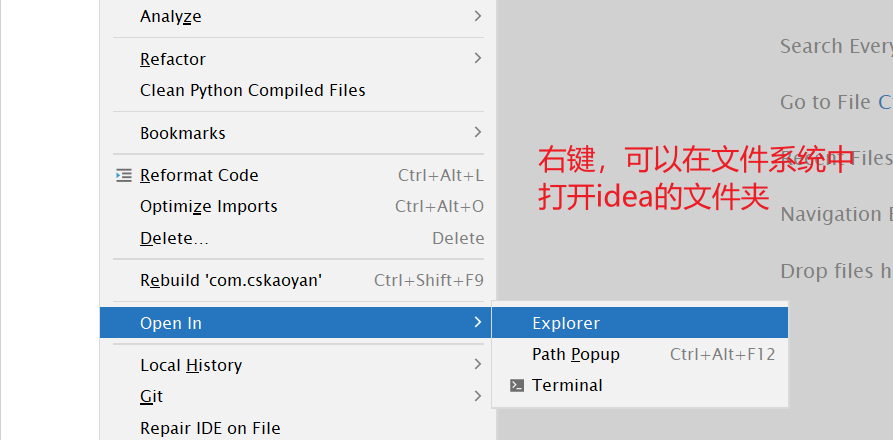

1.在idea中写代码。需要在src里面。 src就是项目的源代码路径

2.在src底下，不要直接写代码。 先写包名。 

```JAVA
// 一般公司内部的习惯是这样的。   www.baidu.com
// 公司域名反转。    com.baidu com.geetest  com.sensorsdata 
```


在idea中，有的.看起来是个点。 其实不是点。 是多级目录。 


com.cskaoyan 有时候是  com/cskaoyan  在文件系统中是两级包。 


- 如果想在idea中，打开文件系统。 或者直接跳转到到指定的位置。右键   open in  explorer




3.打开项目的时候，不要open  java-58-course-meterials 。

这里面的东西非常多。后期如果全部老师的资料都简历之后，可能会出现各种报错。 

