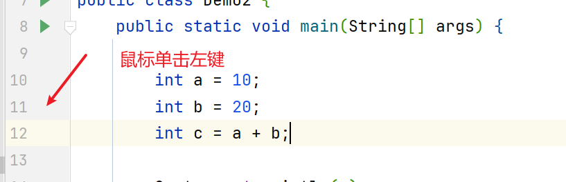
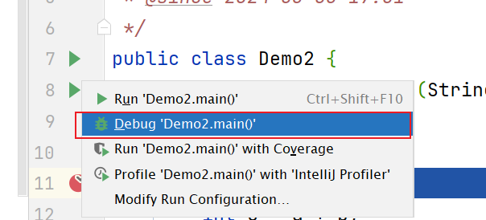
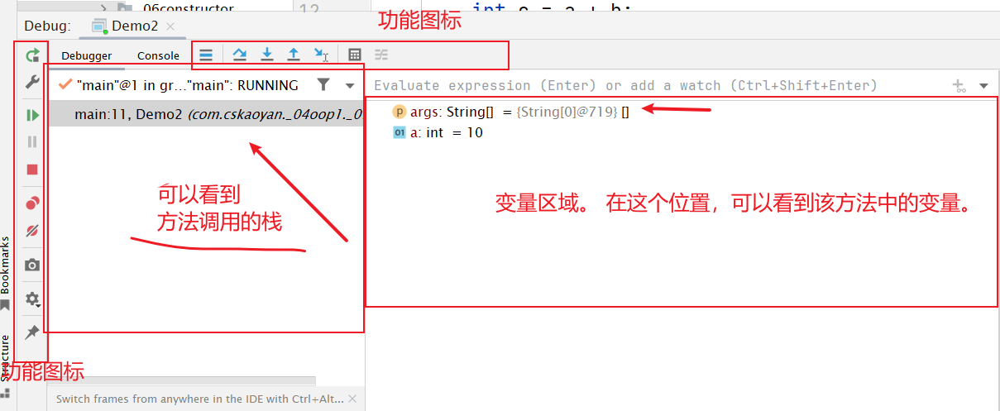
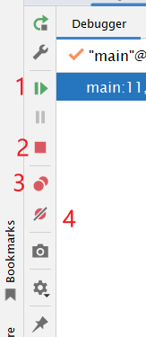
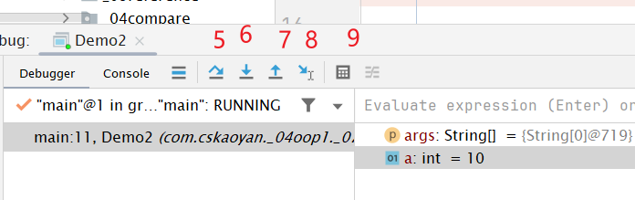

# 打开debug

- 在你需要暂停的位置。 打一个断点。 （让程序在这等一等）

  - 在idea中，在你需要暂停的这一行。 单击鼠标左键。 会出现一个红色的点。

   

- 运行代码。 但是运行的时候，不能选run。<span style=color:yellow;background:red>**一定要选debug启动。 **</span>




# debug页面初识



可以看到， 有几大功能区域，可以看到方法的执行栈。 

也可以看到里面的变量。 


# 小图标的含义





<span style=color:red;background:yellow>**一号图标。 **</span>代表让代码一直跑，知道碰到下一个断点。 

从当前位置，使劲跑。 知道跑到下一个断点。   下一个断点一定要能跑到，别人才会等。 

这个断点一定要是在你的执行路径上的。 


二号图标： 中止当前程序的运行


三号图标： 查看所有的断点。可以看到代码在哪，代码写得啥。 


四号图标：mute breakPoints 。 静音。  就是先暂时，不让这些断点生效。 先让所有的断点失效。 

这种一般用在，比如，你想观察一下执行效果。 





<span style=color:yellow;background:red>**五号图标： **</span>就是一行一行执行。 碰到方法不会进去让你一行一行看。 


<span style=color:yellow;background:red>**六号图标：**</span>进行这个方法执行。 但是，只会进入你写的方法。 


debug的时候，写得代码，不会生效。 直到下一次运行的时候才会生效。 


idea2018的时候，有一个红色的，向下的图标。force step into . 强制进入方法内部。还会进入jdk写的代码内部。 


<span style=color:yellow;background:red>**八号图标**</span>：run to  cursor.跳到光标位置。 


<span style=color:yellow;background:red>**九号图标：**</span> Evaluate Expression。 计算表达式的值。  

在计算器里面，可以直接运行你想执行的代码。或者你想观察的变量。 在这计算器里面都可以写。 

可以写，你想观察的一些结果。 

还可以给一些，你期望的值。 


出了bug，去调试一下。 看，程序的运行，是否和你的预期保持一致。 

```
// String判断相等。 用equals。
//  ==
```


debug一定要练一下。 

