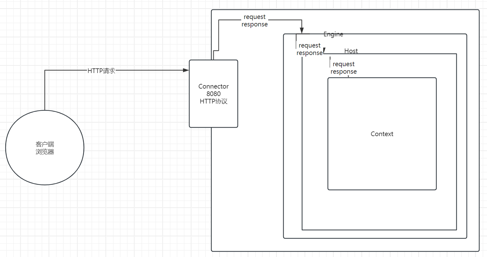

# Day1 服务器开发

## 概念

服务器：提供网络访问服务的一台机器。提及服务器，一般有两层含义，一层指的是硬件层面，指的是一台性能比较高效的计算机主机；另外一层指的是软件层面，可以将本地的资源发布到网络中，供网络上面的其他用户来访问。在没有特殊说明的情况下，我们指的都是软件层面。

静态web资源：一成不变的，无论任何人、任何时间看到的内容都是完全一致的。早期的互联网上面的资源基本都是这种形式。访问静态web资源时，实际上访问的就是这个页面。

动态web资源：具有交互性、变化性。不同时间、不同人看到的内容可能都是完全不同的。目前互联网上面的资源主要就是动态web资源。访问动态web资源时，实际上访问是程序。在java语言中，开发动态web资源的技术便是叫做Servlet。


## 手写简易web服务器(了解)

通过这个案例，我们并不是要求开发一个服务器产品，而是通过该案例，能够让大家对于服务器的原理、概念有所了解即可。另外一方面，对HTTP协议去做一个复习总结。

web服务器：软件，这个软件可以干什么？可以将本地的资源发布到网络中，供网络上面的其他用户来访问。如果用户访问的是一个不存在的资源，需要返回404状态码。

### v1

最简易的v1版本。可以接收到了客户端发送过来的数据。

```java
public class Server1 {

    public static void main(String[] args) {
        ServerSocket serverSocket = null;
        try {
            //当前计算机中创建一个应用程序 ，持续不断地去监听8080端口号
            serverSocket = new ServerSocket(8080);
            //每当有一个客户端连接进来，那么便会创建一个Socket，java语言中对应的封装形式就是Socket对象
            Socket client = serverSocket.accept();
            //如果想要获取客户端发送过来的数据信息，使用下面的代码
            InputStream inputStream = client.getInputStream();
            byte[] bytes = new byte[1024];
            //如果没有数据过来的情况下，也会阻塞在这一行
            int length = inputStream.read(bytes);
            String request = new String(bytes, 0, length);
            System.out.println(request);
            //如果希望给客户端返回响应信息
            OutputStream outputStream = client.getOutputStream();

        } catch (IOException e) {
            throw new RuntimeException(e);
        }


    }
}

```


### v2

服务器程序不应该结束；在一个循环中accept以及read均是阻塞步骤，那么如果有一个客户端建立了tcp连接，但是不发送数据，会一致阻塞在read步骤，后续客户端就无法建立tcp连接，服务器便不可用了，使用多线程。

```java
public class Server2 {

    public static void main(String[] args) {
        ServerSocket serverSocket = null;
        try {
            //当前计算机中创建一个应用程序 ，持续不断地去监听8080端口号
            serverSocket = new ServerSocket(8080);
            while (true){
                //每当有一个客户端连接进来，那么便会创建一个Socket，java语言中对应的封装形式就是Socket对象
                Socket client = serverSocket.accept();
                new Thread(new Runnable() {
                    @Override
                    public void run() {
                        //如果想要获取客户端发送过来的数据信息，使用下面的代码
                        InputStream inputStream = null;
                        try {
                            inputStream = client.getInputStream();
                            byte[] bytes = new byte[1024];
                            //如果没有数据过来的情况下，也会阻塞在这一行
                            int length = inputStream.read(bytes);
                            String request = new String(bytes, 0, length);
                            System.out.println(request);
                            //如果希望给客户端返回响应信息
                            OutputStream outputStream = client.getOutputStream();
                        } catch (IOException e) {
                            throw new RuntimeException(e);
                        }
                    }
                }).start();
            }
        } catch (IOException e) {
            throw new RuntimeException(e);
        }
    }
}
```

### v3

在这一版本，我们就需要进一步去解析请求报文了.

这一版本的代码有一些难度，但是需要大家重点关注的部分就是协议解析的部分。

```java
public class Server3 {

    public static void main(String[] args) {
        ServerSocket serverSocket = null;
        try {
            //当前计算机中创建一个应用程序 ，持续不断地去监听8080端口号
            serverSocket = new ServerSocket(8080);
            while (true){
                //每当有一个客户端连接进来，那么便会创建一个Socket，java语言中对应的封装形式就是Socket对象
                Socket client = serverSocket.accept();
                new Thread(new Runnable() {
                    @Override
                    public void run() {
                        //如果想要获取客户端发送过来的数据信息，使用下面的代码
                        InputStream inputStream = null;
                        OutputStream outputStream = null;
                        try {
                            inputStream = client.getInputStream();
                            byte[] bytes = new byte[1024];
                            //如果没有数据过来的情况下，也会阻塞在这一行
                            int length = inputStream.read(bytes);
                            //请求报文
                            String request = new String(bytes, 0, length);
                            //获取请求资源部分（获取第一个换行符，利用空格分割，取出中间部分），查看该文件是否存在
                            int index = request.indexOf("\r\n");
                            //substring:截取部分字符串信息，里面的参数表示的开始、结束的位置
                            String line = request.substring(0, index);
                            //split:分割
                            String[] parts = line.split(" ");
                            //表示的是请求资源部分
                            String requesturi = parts[1];
                            //如果文件存在，将文件响应出去，返回200状态码
//                            System.out.println(requesturi);
                            //拿到请求资源之后，希望去到当前项目的根目录中去查找对应的文件是否存在
                            //特别说明一点：如果路径中以/开头，那么file会把这个路径当做一个绝对的路径去解析，linux里面的路径就是这样的  /usr/local/app/xxx,需要将第一个/去掉
                            StringBuffer stringBuffer = new StringBuffer();
                            outputStream = client.getOutputStream();
                            File file = new File(requesturi.substring(1));
                            if(file.exists() && file.isFile()){
                                //文件存在，并且不是目录  200
                                stringBuffer.append("HTTP/1.1 200 OK\r\n");
                                stringBuffer.append("Content-Type:text/html\r\n");
                                //空行
                                stringBuffer.append("\r\n");
                                //目前只是把响应行、响应头、空行写出去了，但是响应体还没有写
                                outputStream.write(stringBuffer.toString().getBytes("utf-8"));

                                //响应体
                                FileInputStream fileInputStream = new FileInputStream(file);
                                int read = 0;
                                byte[] bs = new byte[1024];
                                while ((read = fileInputStream.read(bs)) != -1){
                                    outputStream.write(bs, 0, read);
                                }
                            }else {
                                //404
                                stringBuffer.append("HTTP/1.1 404 File Not Found\r\n");
                                stringBuffer.append("Content-Type:text/html\r\n");
                                stringBuffer.append("Server:kongling\r\n");
                                stringBuffer.append("\r\n");
                                stringBuffer.append("<div>File Not Found</div>");
                                outputStream.write(stringBuffer.toString().getBytes("utf-8"));
                            }
                            //如果文件不存在，返回404状态码
                            //如果希望给客户端返回响应信息
                        } catch (IOException e) {
                            throw new RuntimeException(e);
                        }finally {
                            if(outputStream != null){
                                try {
                                    outputStream.close();
                                } catch (IOException e) {
                                    throw new RuntimeException(e);
                                }
                            }
                        }
                    }
                }).start();
            }
        } catch (IOException e) {
            throw new RuntimeException(e);
        }
    }
}
```


### v4

思考题：这一次，我们获取的是请求报文的请求资源部分，下一次我希望获取referer请求头，意味着我需要重新再次解析一遍嘛？能否一次性将整个请求报文解析封装成为一个对象，每次获取哪个部分，直接从对象中获取指定的位置即可。思路：数据解析封装到一个request对象中，里面存储请求行、请求头的各部分数据。


## 常见web服务器

**JavaEE规范**：规范如何理解呢？其实就是一个标准，说的更加直白一些，就是一系列的接口。

JavaEE规范其实就是sun公司制定了一系列的接口，供各个服务器生产厂商去实现。比如针对请求报文的封装对象request，有这样的一个接口，叫做ServletRequest接口。用于规定了获取请求报文的各个方面、各个部分。对于开发者来说，无论使用的是服务器A产品，还是服务器B产品，这两个服务器产品均实现了ServletRequest接口，所以对于开发者来说，我们只需要去调用统一的代码便可以在不同的产品中进行使用。


## Tomcat

### 下载安装

直接下载压缩版，直接进行解压缩即可。建议放置在盘符根目录即可，不要放置在很深的目录下，也不要放置在含有空格、中文的目录下。

### 目录结构

**bin目录**：二进制文件的存放目录，启停tomcat所需要的文件就是位于该目录下。

**conf目录**：配置文件的存放目录，tomcat可以进行诸多的配置，这些文件都是位于该目录下

lib目录：类库，tomcat运行需要依赖的类库文件存放的目录

**logs目录**：日志文件的存放目录。错误日志会记录在logs中，所以排查故障很有用

temp：临时文件的存放目录

work：tomcat的工作目录

**webapps**：tomcat部署资源的目录。


### 启停

windows：

启动：

1.bin目录：双击startup.bat文件即可。

2.在bin目录下唤出cmd控制台，输入startup

启动成功的标志：http://localhost:8080可以看到一只猫就ok了

停止：

1.bin目录：双击shutdown.bat文件即可。

2.在bin目录下唤出cmd控制台，输入shutdown

3.tomcat启动成功之后的对话框点击叉号


macos、linux：

启动

在shell(命令行)进入到bin目录中，去执行./startup.sh

停止

在shell(命令行)进入到bin目录中，去执行./shutdown.sh


### 部署资源(掌握)

将本地的资源发布到网络中，供网络上面的其他用户来访问，这个称之为部署资源。在tomcat中部署资源有两种方式，一种叫做直接部署，一种叫做虚拟映射。

直接部署：直接将需要发布的资源放置在tomcat的webapps目录下

虚拟映射：资源文件可以在任意的目录下

#### 直接部署(掌握)

1.需要在tomcat的webapps目录下新建一个目录，用来去存放资源文件。

2.将希望发布的资源文件放置到新建的目录中

3.访问   http://localhost:8080/{目录的名称}/{文件相对于目录的相对路径}

> 注意：一定要在webapps目录下新建目录，不要把文件放置在webapps中。


原理：

实际上，在tomcat中有很多的功能性的组件对象(组件就是一个一个的class类对应的对象，取了一个高大上的名字)

在tomcat中最小的功能单位是应用(类比为行政区域中的村、街道)，任何资源都必须得放置在应用中。如果我们使用直接部署，那么需要再webapps目录下新建一个目录，该目录便会被tomcat解析成为一个应用。

**应用有两个属性：一个叫做应用的名称，一个叫做应用对应的硬盘路径。应用的名称是用来进行网络访问中使用的，硬盘路径是在查找某个文件的时候使用的**。

直接部署的时候，输入的目录的名称便是应用的名称；应用的硬盘路径无需我们进行设置，因为是放置在tomcat的webapps目录下，所以tomcat可以自行计算得到。

> 例子：昙华林、华西村。称呼的时候称呼华西村的东大街张三，但是如果希望去到华西村找张三这个人，那么就需要将华西村转换成地理上面的坐标位置，随后再拼接上东大街张三，便是这个人的位置。
>
> 称呼：华西村东大街张三--------------------找这个人-------> 江苏省无锡市华西村东大街张三
>
> 同样，对于网络访问也是如此
>
> http://localhost:8080/58th/2.jpg  网络称呼--------->服务器需要做的事情就是需要把这个路径转换成硬盘路径，去查找该文件是否存在--------------> /58th--------> D:/apache-tomcat-8.5.37/webapps/58th  + /2.jpg


#### 虚拟映射(掌握)

还有一种部署方式，资源文件没有放置在tomcat中，而是可以放置在任意盘符、任意目录下，这种方式叫做虚拟映射。

如何操作呢？

**方式一：**

1.在tomcat的conf/Catalina/localhost目录下，新建一个xml文件(tomcat会获取xml文件的名称当做应用的名称)

2.在xml文件中配置Context节点，配置docBase属性(这个就是应用的硬盘路径)

注意：我们配置的这个映射 xml文件名称叫做th58.xml，内容如下：

```xml
<?xml version="1.0" encoding="UTF-8"?>
<Context docBase="D:\app"/>
```

如何访问呢？

http://localhost:8080/{应用名}/{文件相对于应用路径的相对路径}


### Tomcat组件及请求处理流程(熟悉)

**最好，后续整个课程学完之后，写简历的时候可以把这部分掌握**

掌握Tomcat直接部署、虚拟映射等资源部署方式；熟悉Tomcat组件以及请求处理流程


Tomcat本身是由一系列可以进行配置的组件所组成的，组件的配置可以在server.xml文件中进行。

Tomcat主要的组件如下：

Connector：连接器，主要的功能是负责去接收客户端的请求，并且对客户端的请求做出响应。里面有一个port属性，指的是当前tomcat服务器监听的端口号。如果希望修改端口号，则可以修改此处。会将请求报文解析成为request对象，传递给Engine。

Engine：引擎，对于tomcat来说，也是比较重要的一个组件，起着承上启下的作用，负责去接收Connector处理结果，进一步向后传递给Host

Host：虚拟主机。Host的职责主要是负责去接收Engine传递过来的数据，进一步传递给Context。

Context：应用。(无论是直接部署、还是虚拟映射最终都会被解析成为一个应用).负责去接收Host传递过来的request和response对象


以访问http://localhost:8080/th58/2.jpg为例

1.域名解析，得到对应的ip地址

2.和服务端的ip地址以及对应的端口号建立TCP连接

3.客户端发送HTTP请求报文

4.HTTP请求报文在网络中中转传输，到达服务器，被监听着8080端口号Connector接收到

5.Connector会将请求报文解析封装成为request对象，还会提供一个response对象，传递给Engine

6.Engine接收到这两个对象之后，进一步传递给Host

7.Host接收到这两个对象之后，进一步去挑选一个合适的Context进行进一步传递(此时请求的资源路径是/th58/2.jpg,会将/th58当做应用名去查找是否有匹配的应用)

8./th58对应的这个应用得到了request和response之后，此时有效的路径部分变成了/2.jpg，利用docBase和/2.jpg进行拼接，得到文件的绝对路径，查找该文件是否存在

9.如果存在，则将文件的数据写入到response对象中；如果不存在，将404信息写入到response中(超市购物小推车)

10.处理完毕之后，最终Connector会读取response里面的数据，生成HTTP响应报文，传输给客户端




### Tomcat设置(掌握)

1.设置端口号

我们访问http://www.cskaoyan.com时，没有端口号，为什么呢？

如果没有端口号，不是说没有使用端口号，而是使用了当前协议的默认端口号，对于http协议来说，默认端口号是80.所以我们需要让tomcat去监听80端口号才可以。修改server.xml文件中的此处即可，修改成80端口号，那么在访问的时候便不用输入端口号。

```xml
<Connector port="80" protocol="HTTP/1.1"
               connectionTimeout="20000"
               redirectPort="8443" />
```


2.设置缺省应用

访问http://localhost:8080时，其实并没有应用名，那么我们访问的是哪个应用呢？实际上访问的是一个默认应用，如果我们也希望访问我们的文件时，不携带应用名，则需要将应用设置为默认应用即可。

如何设置默认应用呢？

1.在tomcat的webapps目录下新建一个ROOT目录，里面存放资源文件

2.在tomcat的conf/Catalina/localhost目录下新建一个xml文件，文件名称叫做ROOT.xml文件


3.设置欢迎页面（默认加载页面）

比如在之前的案例中，输入http://localhost:8080时，没有填写应用名，说明访问的是ROOT默认应用；没有设置访问的页面，那么访问的是哪个页面呢？实际上访问的便是设置的默认欢迎页面，或者默认加载页面。

在conf/web.xml文件中进行配置

如果我们访问的地址没有指向一个具体的文件，那么便会从上往下依次去加载当前应用下的这些文件，如果文件存在，则响应对应的文件，如果文件不存在，则404.

比如http://localhost:8080，那么访问的是ROOT缺省应用，那么加载的是哪个页面呢？依次去查找位于根目录下index.html、index.htm、index.jsp是否存在，如果某个文件存在，则加载该文件；如果都不存在，则显示404.

```xml
 <welcome-file-list>
        <welcome-file>index.html</welcome-file>
        <welcome-file>index.htm</welcome-file>
        <welcome-file>index.jsp</welcome-file>
</welcome-file-list>
```


