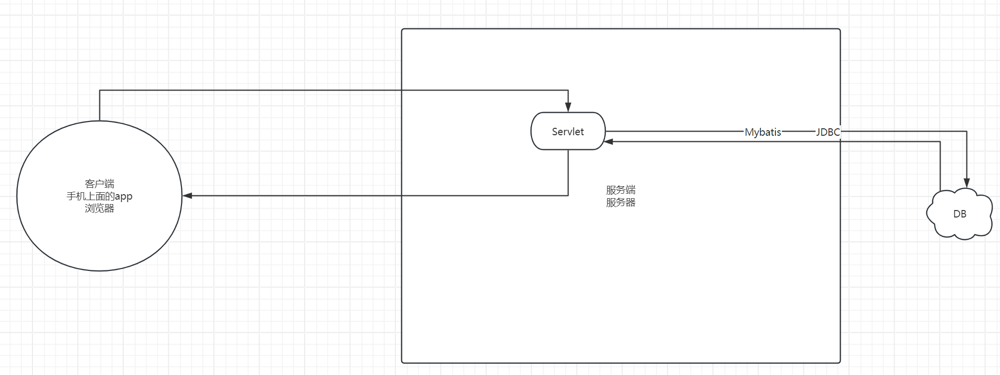
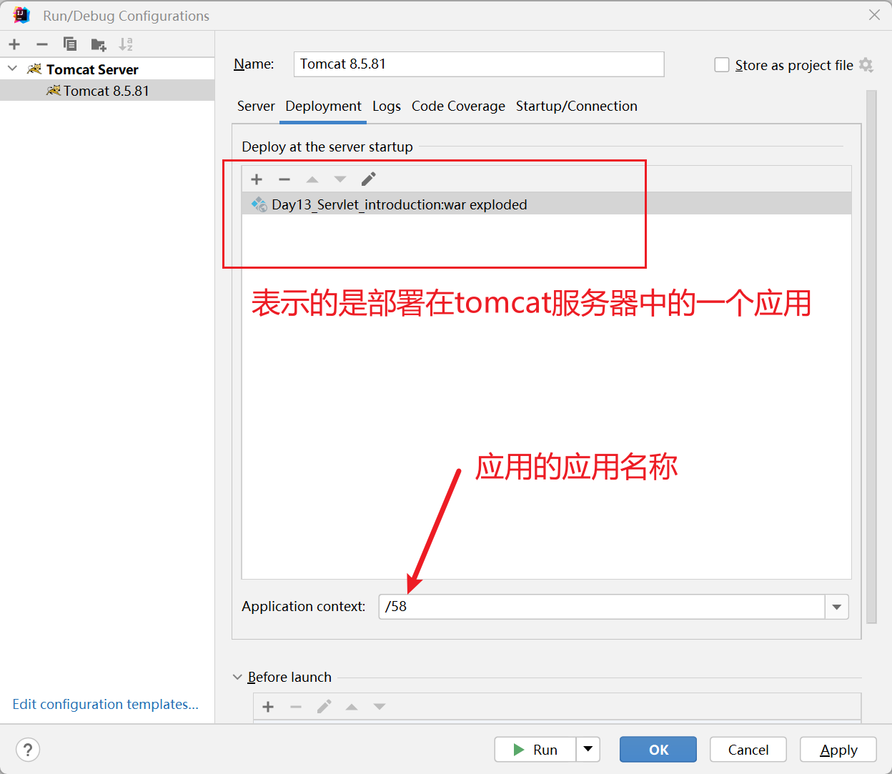
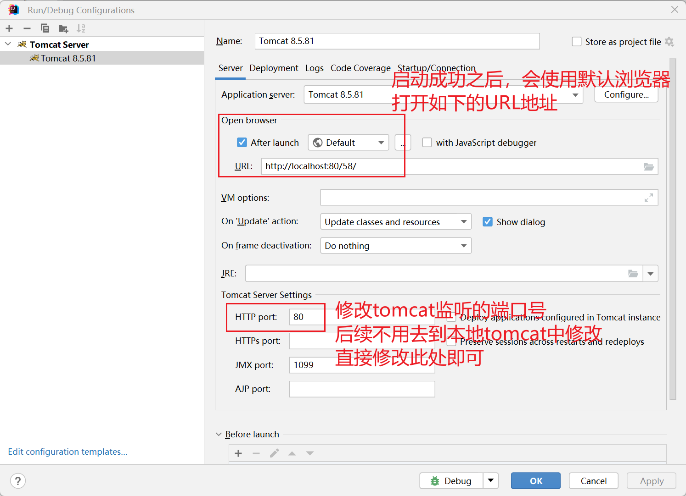
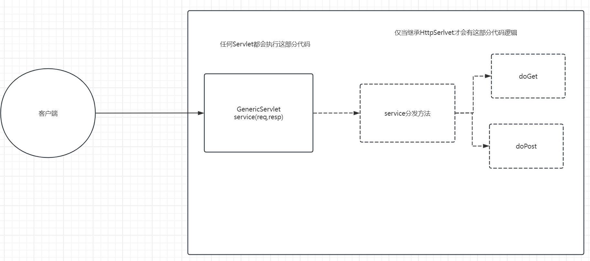

# Day13 Servlet

## 概念

Servlet是什么？为什么要学习Servlet？

Serlvet = Server + applet.运行在服务器上面的小程序，也就是运行在服务器上面的代码片段。希望可以在服务器中运行代码。

希望在服务器中运行代码，那么就得学习Servlet。

JavaEE阶段。企业版开发。企业中，开发一个项目的基本架构模式是什么样的呢？

下图可以理解为是一个简化版的java ee项目的模式图。



## 开发Servlet

To implement this interface, you can write a generic servlet that extends `javax.servlet.GenericServlet` or an HTTP servlet that extends `javax.servlet.http.HttpServlet`.

上述介绍了编写Servlet的两种方式。

### 继承GenericServlet

```java
import javax.servlet.*;
import java.io.IOException;

public class Servlet1 extends GenericServlet{

    public void service(ServletRequest req, ServletResponse resp) throws ServletException,IOException{
        System.out.print("hello world");
    }
}
```

### 编译

编译会报错，显示无法识别符号，原因在于GenericServlet不在jdk中，此时无法解析这个类究竟是什么。实际上javax.servlet里面的所有的类都是位于一个第三方的jar包中的。所以我们需要做的事情就是将这个jar包加载到内存中。需要借助于类加载器来完成这个事情。我们需要做的事情便是提供这个jar包的路径  

javac -classpath xxxx.jar xxx.java


### 运行(失败了)

使用java指令来运行对应的class文件，提示无法找到主类。没有main方法。根据Servlet的定义，它是运行在服务器里面的小程序，所以首先需要将Servlet部署在tomcat中。


### 部署

tomcat中部署资源有两种方式：一种是直接部署、一种是虚拟映射。

虚拟映射：配置一个应用；一个叫做应用名，一个叫做应用路径

conf/Catlalina/localhost目录下：新建一个58.xml

```xml
<?xml version="1.0" encoding="UTF-8" ?>
<Context docBase="D:\app"/>
```

部署完毕之后，通过路径去访问Servlet，会发现此时是下载文件，而不是运行文件


### 配置

针对服务器上面的资源可以被下载到本地，需要在应用的根目录下新建一个WEB-INF目录，该目录用来去保护服务器上面的资源。也就是任何文件只要放在WEB-INF目录下，均不可能通过直接访问的方式访问到。

虽然此时Servlet源代码文件安全了，但是程序依然没有运行。如何运行Servlet呢?实际上，这里面做了一个映射关系。

比如设置/ss1和Servlet1的映射关系，只要后续用户在浏览器地址栏输入/ss1，那么服务器就去运行Serlvet1的代码。

应该如何进行配置呢？

**下面的内容一定要记住，这是规定**：

应用根目录/WEB-INF/classes/全限定类名(源代码文件)

应用根目录/WEB-INF/lib/运行时需要的jar包(依赖的第三方的jar包类库)

应用根目录/WEB-INF/web.xml(用来配置访问的路径和全限定类名的映射关系)

```xml
<?xml version="1.0" encoding="UTF-8"?>
<web-app xmlns="http://xmlns.jcp.org/xml/ns/javaee"
  xmlns:xsi="http://www.w3.org/2001/XMLSchema-instance"
  xsi:schemaLocation="http://xmlns.jcp.org/xml/ns/javaee
                      http://xmlns.jcp.org/xml/ns/javaee/web-app_3_1.xsd"
  version="3.1"
  metadata-complete="true">

  <servlet>
    <servlet-name>s1</servlet-name>
    <servlet-class>Servlet1</servlet-class>
  </servlet>
  
  <servlet-mapping>
    <servlet-name>s1</servlet-name>
    <url-pattern>/ss1</url-pattern>
  </servlet-mapping>
 
</web-app>
```

### 访问

http://localhost:8080/{应用名}/{url-pattern}


## Servlet原理(熟悉)

以访问http://localhost:8080/58/ss1为例

1.域名解析

2.建立TCP连接

3.浏览器发送HTTP请求

4.监听8080端口号的Connector接收到，将请求报文解析成为request对象，与此同时还会提供一个response对象。

5.Connector进一步将这两个对象传递给Engine，Engine进一步传递给Host

6.Host会将这两个对象传递给Context(/58)，Context接收到这两个对象之后进行进一步的解析处理，此时有效的路径部分为/ss1.

7.根据我们在web.xml中配置的映射关系，/ss1--------Servlet1，找到了需要执行的全限定类叫做Servlet1.通过反射去调用Serlvet的service方法。service方法执行时，需要传递两个参数request、response，刚刚好之前的这两个对象传递了进去。

8.service方法执行，我们其实可以往response里面写入数据；最终服务器会读取response里面的数据，生成HTTP响应报文

9.HTTP响应报文传输到客户端，客户端进行解析渲染


## 使用IDEA开发Servlet

参考预习资料

> javaEE在2018年进行了改名。改名成了Jakarta EE。但是里面的内容是没有变的。虽然里面的内容没有变，但是包名变了javax.servlet后续改成了Jakarta.servlet.






## 开发Servlet-继承HttpServlet

我们编写一个类继承GenericServlet和编写一个类继承HttpServlet二者之间的关系是什么样的呢？

HttpServlet继承自GenericServlet。所以之前有的，在继承HttpServlet中也都有。

Provides an abstract class to be subclassed to create an HTTP servlet suitable for a Web site. A subclass of `HttpServlet` must override at least one method, usually one of these:

- `doGet`, if the servlet supports HTTP GET requests
- `doPost`, for HTTP POST requests
- `doPut`, for HTTP PUT requests
- `doDelete`, for HTTP DELETE requests
- `init` and `destroy`, to manage resources that are held for the life of the servlet
- `getServletInfo`, which the servlet uses to provide information about itself
- 继承HttpServlet而开发的Servlet，如果希望可以支持get请求，那么应该重写doGet；如果希望可以支持post请求，那么应当重写doPost

```java
public class Servlet2 extends HttpServlet {

    //发送get请求时，会调用当前servlet的doget方法
    @Override
    protected void doGet(HttpServletRequest req, HttpServletResponse resp) throws ServletException, IOException {
//        super.doGet(req, resp);
        System.out.println("servlet2 doGet");
    }

    //发送post请求时，会调用当前servlet的dopost方法
    @Override
    protected void doPost(HttpServletRequest req, HttpServletResponse resp) throws ServletException, IOException {
//        super.doPost(req, resp);
        System.out.println("servlet doPost");
    }
}
```

web.xml文件中配置映射关系

```xml
<?xml version="1.0" encoding="UTF-8"?>
<web-app xmlns="http://xmlns.jcp.org/xml/ns/javaee"
         xmlns:xsi="http://www.w3.org/2001/XMLSchema-instance"
         xsi:schemaLocation="http://xmlns.jcp.org/xml/ns/javaee http://xmlns.jcp.org/xml/ns/javaee/web-app_4_0.xsd"
         version="4.0">

    <servlet>
        <servlet-name>s1</servlet-name>
        <servlet-class>com.cskaoyan.th58.Servlet1</servlet-class>
    </servlet>

    <servlet-mapping>
        <servlet-name>s1</servlet-name>
        <url-pattern>/ss1</url-pattern>
    </servlet-mapping>


    <servlet>
        <servlet-name>s2</servlet-name>
        <servlet-class>com.cskaoyan.th58.Servlet2</servlet-class>
    </servlet>

    <servlet-mapping>
        <servlet-name>s2</servlet-name>
        <url-pattern>/ss2</url-pattern>
    </servlet-mapping>
</web-app>
```

问题：如何调用doPost？

只需要以post请求访问当前servlet即可。最简单的方式便是使用form表单来发送。点击表单的提交按钮，那么便会往对应的地址发送post请求。

```html
<form action="http://localhost/58/ss2" method="post">
    <input type="text" name="username"><br>
    <input type="password" name="password"><br>
    <input type="submit">
</form>
```


问题：继承GenericServlet需要实现service方法，为什么继承HttpServlet不需要？

因为HttpServlet已经实现了该方法。


问题：Servlet的请求处理流程是什么样的呢？

为什么在继承GenericServlet中执行的是service方法，但是在继承HttpServlet中，确实doGet或者doPost？

首先需要明确一点：程序的入口始终是service方法。和继承哪个servlet没有关系。

```java
public void service(ServletRequest req, ServletResponse res)
        throws ServletException, IOException
    {
        HttpServletRequest  request;
        HttpServletResponse response;
        //校验工作
        if (!(req instanceof HttpServletRequest &&
                res instanceof HttpServletResponse)) {
            throw new ServletException("non-HTTP request or response");
        }
		//向下转型
        request = (HttpServletRequest) req;
        response = (HttpServletResponse) res;
		//调用了service方法
        service(request, response);
    }
```

这里面的逻辑是啥？

获取当前HTTP请求的请求方法，如果是get则调用doGet方法；如果是post则调用doPost方法。

```java
protected void service(HttpServletRequest req, HttpServletResponse resp)
        throws ServletException, IOException
    {
    //可以看一下Day1 Server的代码
        String method = req.getMethod();
		//判断字符串是否匹配
        if (method.equals(METHOD_GET)) {
            long lastModified = getLastModified(req);
            if (lastModified == -1) {
                // servlet doesn't support if-modified-since, no reason
                // to go through further expensive logic
                doGet(req, resp);
            } else {
                long ifModifiedSince = req.getDateHeader(HEADER_IFMODSINCE);
                if (ifModifiedSince < lastModified) {
                    // If the servlet mod time is later, call doGet()
                    // Round down to the nearest second for a proper compare
                    // A ifModifiedSince of -1 will always be less
                    maybeSetLastModified(resp, lastModified);
                    doGet(req, resp);
                } else {
                    resp.setStatus(HttpServletResponse.SC_NOT_MODIFIED);
                }
            }

        } else if (method.equals(METHOD_HEAD)) {
            long lastModified = getLastModified(req);
            maybeSetLastModified(resp, lastModified);
            doHead(req, resp);

        } else if (method.equals(METHOD_POST)) {
            doPost(req, resp);
            
        } else if (method.equals(METHOD_PUT)) {
            doPut(req, resp);
            
        } else if (method.equals(METHOD_DELETE)) {
            doDelete(req, resp);
            
        } else if (method.equals(METHOD_OPTIONS)) {
            doOptions(req,resp);
            
        } else if (method.equals(METHOD_TRACE)) {
            doTrace(req,resp);
            
        } else {
            //
            // Note that this means NO servlet supports whatever
            // method was requested, anywhere on this server.
            //

            String errMsg = lStrings.getString("http.method_not_implemented");
            Object[] errArgs = new Object[1];
            errArgs[0] = method;
            errMsg = MessageFormat.format(errMsg, errArgs);
            
            resp.sendError(HttpServletResponse.SC_NOT_IMPLEMENTED, errMsg);
        }
    }
```




