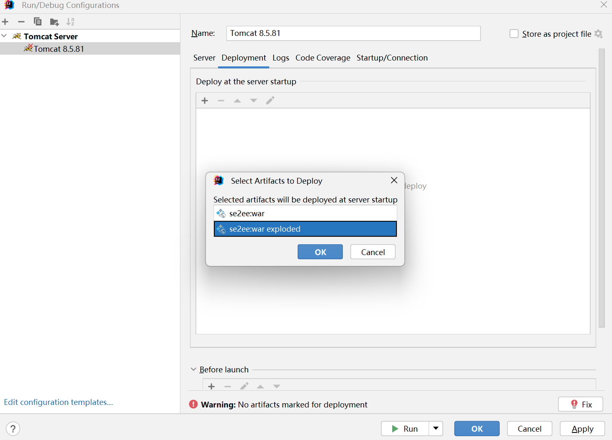

# Day13 Servlet

## 概念

Servlet是什么？为什么要学习Servlet？

Serlvet = Server + applet.运行在服务器上面的小程序，也就是运行在服务器上面的代码片段。希望可以在服务器中运行代码。

希望在服务器中运行代码，那么就得学习Servlet。

JavaEE阶段。企业版开发。企业中，开发一个项目的基本架构模式是什么样的呢？

下图可以理解为是一个简化版的java ee项目的模式图。


## 开发Servlet

To implement this interface, you can write a generic servlet that extends `javax.servlet.GenericServlet` or an HTTP servlet that extends `javax.servlet.http.HttpServlet`.

上述介绍了编写Servlet的两种方式。

### 继承GenericServlet

```java
import javax.servlet.*;
import java.io.IOException;

public class Servlet1 extends GenericServlet{

    public void service(ServletRequest req, ServletResponse resp) throws ServletException,IOException{
        System.out.print("hello world");
    }
}
```

### 编译

编译会报错，显示无法识别符号，原因在于GenericServlet不在jdk中，此时无法解析这个类究竟是什么。实际上javax.servlet里面的所有的类都是位于一个第三方的jar包中的。所以我们需要做的事情就是将这个jar包加载到内存中。需要借助于类加载器来完成这个事情。我们需要做的事情便是提供这个jar包的路径  

javac -classpath xxxx.jar xxx.java


### 运行(失败了)

使用java指令来运行对应的class文件，提示无法找到主类。没有main方法。根据Servlet的定义，它是运行在服务器里面的小程序，所以首先需要将Servlet部署在tomcat中。


### 部署

tomcat中部署资源有两种方式：一种是直接部署、一种是虚拟映射。

虚拟映射：配置一个应用；一个叫做应用名，一个叫做应用路径

conf/Catlalina/localhost目录下：新建一个58.xml

```xml
<?xml version="1.0" encoding="UTF-8" ?>
<Context docBase="D:\app"/>
```

部署完毕之后，通过路径去访问Servlet，会发现此时是下载文件，而不是运行文件


### 配置

针对服务器上面的资源可以被下载到本地，需要在应用的根目录下新建一个WEB-INF目录，该目录用来去保护服务器上面的资源。也就是任何文件只要放在WEB-INF目录下，均不可能通过直接访问的方式访问到。

虽然此时Servlet源代码文件安全了，但是程序依然没有运行。如何运行Servlet呢?实际上，这里面做了一个映射关系。

比如设置/ss1和Servlet1的映射关系，只要后续用户在浏览器地址栏输入/ss1，那么服务器就去运行Serlvet1的代码。

应该如何进行配置呢？

**下面的内容一定要记住，这是规定**：

应用根目录/WEB-INF/classes/全限定类名(源代码文件)

应用根目录/WEB-INF/lib/运行时需要的jar包(依赖的第三方的jar包类库)

应用根目录/WEB-INF/web.xml(用来配置访问的路径和全限定类名的映射关系)

```xml
<?xml version="1.0" encoding="UTF-8"?>
<web-app xmlns="http://xmlns.jcp.org/xml/ns/javaee"
  xmlns:xsi="http://www.w3.org/2001/XMLSchema-instance"
  xsi:schemaLocation="http://xmlns.jcp.org/xml/ns/javaee
                      http://xmlns.jcp.org/xml/ns/javaee/web-app_3_1.xsd"
  version="3.1"
  metadata-complete="true">

  <servlet>
    <servlet-name>s1</servlet-name>
    <servlet-class>Servlet1</servlet-class>
  </servlet>
  
  <servlet-mapping>
    <servlet-name>s1</servlet-name>
    <url-pattern>/ss1</url-pattern>
  </servlet-mapping>
 
</web-app>
```

### 访问

http://localhost:8080/{应用名}/{url-pattern}


## Servlet原理(熟悉)

以访问http://localhost:8080/58/ss1为例

1.域名解析

2.建立TCP连接

3.浏览器发送HTTP请求

4.监听8080端口号的Connector接收到，将请求报文解析成为request对象，与此同时还会提供一个response对象。

5.Connector进一步将这两个对象传递给Engine，Engine进一步传递给Host

6.Host会将这两个对象传递给Context(/58)，Context接收到这两个对象之后进行进一步的解析处理，此时有效的路径部分为/ss1.

7.根据我们在web.xml中配置的映射关系，/ss1--------Servlet1，找到了需要执行的全限定类叫做Servlet1.通过反射去调用Serlvet的service方法。service方法执行时，需要传递两个参数request、response，刚刚好之前的这两个对象传递了进去。

8.service方法执行，我们其实可以往response里面写入数据；最终服务器会读取response里面的数据，生成HTTP响应报文

9.HTTP响应报文传输到客户端，客户端进行解析渲染


## 使用IDEA开发Servlet

参考预习资料

> javaEE在2018年进行了改名。改名成了Jakarta EE。但是里面的内容是没有变的。虽然里面的内容没有变，但是包名变了javax.servlet后续改成了Jakarta.servlet.


## 开发Servlet-继承HttpServlet

我们编写一个类继承GenericServlet和编写一个类继承HttpServlet二者之间的关系是什么样的呢？

HttpServlet继承自GenericServlet。所以之前有的，在继承HttpServlet中也都有。

Provides an abstract class to be subclassed to create an HTTP servlet suitable for a Web site. A subclass of `HttpServlet` must override at least one method, usually one of these:

- `doGet`, if the servlet supports HTTP GET requests
- `doPost`, for HTTP POST requests
- `doPut`, for HTTP PUT requests
- `doDelete`, for HTTP DELETE requests
- `init` and `destroy`, to manage resources that are held for the life of the servlet
- `getServletInfo`, which the servlet uses to provide information about itself
- 继承HttpServlet而开发的Servlet，如果希望可以支持get请求，那么应该重写doGet；如果希望可以支持post请求，那么应当重写doPost

```java
public class Servlet2 extends HttpServlet {

    //发送get请求时，会调用当前servlet的doget方法
    @Override
    protected void doGet(HttpServletRequest req, HttpServletResponse resp) throws ServletException, IOException {
//        super.doGet(req, resp);
        System.out.println("servlet2 doGet");
    }

    //发送post请求时，会调用当前servlet的dopost方法
    @Override
    protected void doPost(HttpServletRequest req, HttpServletResponse resp) throws ServletException, IOException {
//        super.doPost(req, resp);
        System.out.println("servlet doPost");
    }
}
```

web.xml文件中配置映射关系

```xml
<?xml version="1.0" encoding="UTF-8"?>
<web-app xmlns="http://xmlns.jcp.org/xml/ns/javaee"
         xmlns:xsi="http://www.w3.org/2001/XMLSchema-instance"
         xsi:schemaLocation="http://xmlns.jcp.org/xml/ns/javaee http://xmlns.jcp.org/xml/ns/javaee/web-app_4_0.xsd"
         version="4.0">

    <servlet>
        <servlet-name>s1</servlet-name>
        <servlet-class>com.cskaoyan.th58.Servlet1</servlet-class>
    </servlet>

    <servlet-mapping>
        <servlet-name>s1</servlet-name>
        <url-pattern>/ss1</url-pattern>
    </servlet-mapping>


    <servlet>
        <servlet-name>s2</servlet-name>
        <servlet-class>com.cskaoyan.th58.Servlet2</servlet-class>
    </servlet>

    <servlet-mapping>
        <servlet-name>s2</servlet-name>
        <url-pattern>/ss2</url-pattern>
    </servlet-mapping>
</web-app>
```

问题：如何调用doPost？

只需要以post请求访问当前servlet即可。最简单的方式便是使用form表单来发送。点击表单的提交按钮，那么便会往对应的地址发送post请求。

```html
<form action="http://localhost/58/ss2" method="post">
    <input type="text" name="username"><br>
    <input type="password" name="password"><br>
    <input type="submit">
</form>
```


问题：继承GenericServlet需要实现service方法，为什么继承HttpServlet不需要？

因为HttpServlet已经实现了该方法。


问题：Servlet的请求处理流程是什么样的呢？

为什么在继承GenericServlet中执行的是service方法，但是在继承HttpServlet中，确实doGet或者doPost？

首先需要明确一点：程序的入口始终是service方法。和继承哪个servlet没有关系。

```java
public void service(ServletRequest req, ServletResponse res)
        throws ServletException, IOException
    {
        HttpServletRequest  request;
        HttpServletResponse response;
        //校验工作
        if (!(req instanceof HttpServletRequest &&
                res instanceof HttpServletResponse)) {
            throw new ServletException("non-HTTP request or response");
        }
		//向下转型
        request = (HttpServletRequest) req;
        response = (HttpServletResponse) res;
		//调用了service方法
        service(request, response);
    }
```

这里面的逻辑是啥？

获取当前HTTP请求的请求方法，如果是get则调用doGet方法；如果是post则调用doPost方法。

```java
protected void service(HttpServletRequest req, HttpServletResponse resp)
        throws ServletException, IOException
    {
    //可以看一下Day1 Server的代码
        String method = req.getMethod();
		//判断字符串是否匹配
        if (method.equals(METHOD_GET)) {
            long lastModified = getLastModified(req);
            if (lastModified == -1) {
                // servlet doesn't support if-modified-since, no reason
                // to go through further expensive logic
                doGet(req, resp);
            } else {
                long ifModifiedSince = req.getDateHeader(HEADER_IFMODSINCE);
                if (ifModifiedSince < lastModified) {
                    // If the servlet mod time is later, call doGet()
                    // Round down to the nearest second for a proper compare
                    // A ifModifiedSince of -1 will always be less
                    maybeSetLastModified(resp, lastModified);
                    doGet(req, resp);
                } else {
                    resp.setStatus(HttpServletResponse.SC_NOT_MODIFIED);
                }
            }

        } else if (method.equals(METHOD_HEAD)) {
            long lastModified = getLastModified(req);
            maybeSetLastModified(resp, lastModified);
            doHead(req, resp);

        } else if (method.equals(METHOD_POST)) {
            doPost(req, resp);
            
        } else if (method.equals(METHOD_PUT)) {
            doPut(req, resp);
            
        } else if (method.equals(METHOD_DELETE)) {
            doDelete(req, resp);
            
        } else if (method.equals(METHOD_OPTIONS)) {
            doOptions(req,resp);
            
        } else if (method.equals(METHOD_TRACE)) {
            doTrace(req,resp);
            
        } else {
            //
            // Note that this means NO servlet supports whatever
            // method was requested, anywhere on this server.
            //

            String errMsg = lStrings.getString("http.method_not_implemented");
            Object[] errArgs = new Object[1];
            errArgs[0] = method;
            errMsg = MessageFormat.format(errMsg, errArgs);
            
            resp.sendError(HttpServletResponse.SC_NOT_IMPLEMENTED, errMsg);
        }
    }
```


## 开发Servlet-使用注解

开发Servlet的步骤可以分为：1.编写代码继承GenericServlet或者继承HttpServlet  2.配置映射关系，其中配置映射关系可以使用web.xml方式，也可以使用注解的方式。

```java
//@WebServlet(name = "s3", urlPatterns = "/ss3")
//还可以进一步简化，将name属性去掉，也就是可以不用给name属性赋值
//@WebServlet(urlPatterns = "/ss3")
//如果注解内只有一个单一的值，其实默认就是赋值给value的，而value和urlPatterns可以理解为是相互的别名的关系
@WebServlet("/ss3")
public class Servlet3 extends HttpServlet {

    @Override
    protected void doGet(HttpServletRequest req, HttpServletResponse resp) throws ServletException, IOException {
        System.out.println("doGet");
    }
}
```

> 注解可以发挥功能，也可以完全没有任何功能，全部取决于业务程序有没有编写代码去解析、处理
>
> 解析注解需要使用到反射相关的内容。
>
> 关于注解这部分的内容，建议大家掌握。后续学习Spring框架，会接触到一个概念，面向注解编程。
>
> ```java
> @Test
>     public void test(){
>         //如果我们需要解析注解，那么需要使用反射，而反射需要借助于Class对象
>         Map<String ,String > map = new HashMap<String ,String >();
>         try {
>             String className = "com.cskaoyan.th58.Servlet3";
>             Class<?> aClass = Class.forName(className);
>             //查看当前类的头上有没有标注该注解
>             WebServlet webServlet = aClass.getAnnotation(WebServlet.class);
>             String[] urls = webServlet.urlPatterns();
>             String[] value = webServlet.value();
>             System.out.println(Arrays.toString(urls));
>             System.out.println(Arrays.toString(value));
>             map.put(value[0], className);
>             System.out.println("==============");
> 
>             Constructor<?> constructor = aClass.getConstructor();
>             //创建了一个servlet实例对象
>             Object o = constructor.newInstance();
>             Method method = aClass.getMethod("service", ServletRequest.class, ServletResponse.class);
>             // tomcat：通过反射去调用servlet的service方法
>             Object invoke = method.invoke(o, null, null);
>             
>         } catch (ClassNotFoundException e) {
>             throw new RuntimeException(e);
>         } catch (NoSuchMethodException e) {
>             throw new RuntimeException(e);
>         } catch (InvocationTargetException e) {
>             throw new RuntimeException(e);
>         } catch (InstantiationException e) {
>             throw new RuntimeException(e);
>         } catch (IllegalAccessException e) {
>             throw new RuntimeException(e);
>         }
>     }
> ```
>
> 


## IDEA配置项

open module settings(project stucture):


特别注意：当前目录不是我们的应用根目录。


最终，将这个目录放置在tomcat中进行部署


## 将SE项目改造成EE项目

1.新建一个常规的maven项目

2.导入servlet的依赖

3.maven的pom.xml文件设置packaging war

4.在src\main目录下新建一个webapp，此时应该会自动标注一个小蓝点

5.新建一个tomcat配置项，配置tomcat，利用tomcat部署war exploded





## Servlet生命周期

This interface defines methods to initialize a servlet, to service requests, and to remove a servlet from the server. These are known as life-cycle methods and are called in the following sequence:

1. The servlet is constructed, then initialized with the `init` method.
2. Any calls from clients to the `service` method are handled.
3. The servlet is taken out of service, then destroyed with the `destroy` method, then garbage collected and finalized.

从创建到销毁的整个过程：

init：当servlet被创建(实例化，也就是创建一个对象)的时候会被调用。通过日志，我们可以发现，servlet在运行期间只被创建了一个对象出来，众多客户端请求的时候，如果使用成员变量来存储用户的特有信息，那么便会有安全问题。所以针对用户的特有数据， 慎用serlvet的成员变量来存储数据。关于init，正常情况下，服务器启动成功是不会被调用的，在客户端第一次访问的时候，会被调用。**但是可以设置一个load-on-startup=非负数，init方法便会随着tomcat的启动而调用，执行时机提前**。

service：客户端的请求都会交给service来处理。tomcat把客户端的请求转换成了方法的一次调用。是被调用最频繁的一个方法。客户端的每次请求都会调用service方法。

destroy：当servlet被销毁的时候，会调用destory来完成销毁工作。应用卸载、服务器关闭的时候会调用destroy。

```java
@WebServlet(value = "/life",loadOnStartup = 1)
public class LifeCycleServlet extends HttpServlet {

    private String username;

    @Override
    public void init() throws ServletException {
        System.out.println("init");
    }

    //该方法可以看做是service方法
    @Override
    protected void doGet(HttpServletRequest req, HttpServletResponse resp) throws ServletException, IOException {
        System.out.println("service");
    }

    //一般在继承HttpServlet中，没有必要去重写service方法，如果重写，那么doGet、doPost可能就无法调用

//    @Override
//    public void service(ServletRequest req, ServletResponse res) throws ServletException, IOException {
//
//    }


    @Override
    public void destroy() {
        System.out.println("destroy");
    }
}
```


## Url-pattern注意事项

**问题1：一个Servlet可以配置多个url-pattern吗？可以**

```java
@WebServlet(value = {"/life","/life2"},loadOnStartup = 1)
```


**问题2：多个serlvet可不可以映射到同一个url-pattern？**

不可以。tomcat便不知道该调用哪个servlet。

```
	Caused by: java.lang.IllegalArgumentException: 鍚嶄负 [com.cskaoyan.th58.life.LifeCycleServlet]鍜� [com.cskaoyan.th58.life.LifeCycleServlet2] 鐨剆ervlet涓嶈兘鏄犲皠涓轰竴涓猽rl妯″紡(url-pattern) [/life2]
		at org.apache.tomcat.util.descriptor.web.WebXml.addServletMappingDecoded(WebXml.java:340)
		at org.apache.tomcat.util.descriptor.web.WebXml.addServletMapping(WebXml.java:333)
		at org.apache.catalina.startup.ContextConfig.processAnnotationWebServlet(ContextConfig.java:2348)
		at org.apache.catalina.startup.ContextConfig.processClass(ContextConfig.java:2027)
		at org.apache.catalina.startup.ContextConfig.processAnnotationsStream(ContextConfig.java:2016)
		at org.apache.catalina.startup.ContextConfig.processAnnotationsWebResource(ContextConfig.java:1917)
		at org.apache.catalina.startup.ContextConfig.processAnnotationsWebResource(ContextConfig.java:1911)
		at org.apache.catalina.startup.ContextConfig.processAnnotationsWebResource(ContextConfig.java:1911)
		at org.apache.catalina.startup.ContextConfig.processAnnotationsWebResource(ContextConfig.java:1911)
		at org.apache.catalina.startup.ContextConfig.processAnnotationsWebResource(ContextConfig.java:1911)
		at org.apache.catalina.startup.ContextConfig.processClasses(ContextConfig.java:1176)
		at org.apache.catalina.startup.ContextConfig.webConfig(ContextConfig.java:1093)
		at org.apache.catalina.startup.ContextConfig.configureStart(ContextConfig.java:779)
		at org.apache.catalina.startup.ContextConfig.lifecycleEvent(ContextConfig.java:299)
		at org.apache.catalina.util.LifecycleBase.fireLifecycleEvent(LifecycleBase.java:123)
		at org.apache.catalina.core.StandardContext.startInternal(StandardContext.java:5130)
		at org.apache.catalina.util.LifecycleBase.start(LifecycleBase.java:183)

```


**问题3：url-pattern的合法写法有哪些？**

只有两种写法是合法的。比如是/xxxx，\*.xxxx(x指的是任意字符，\*指的就是需要输入这个字符)

比如：/ss1 合法的

比如：*.html合法的

但是: ss1非法的

排查故障的一个原则：找到自己认识的代码部分。

```
	Caused by: java.lang.IllegalArgumentException: servlet鏄犲皠涓殑<url pattern>[ss4]鏃犳晥
		at org.apache.catalina.core.StandardContext.addServletMappingDecoded(StandardContext.java:3211)
		at org.apache.catalina.core.StandardContext.addServletMappingDecoded(StandardContext.java:3196)
		at org.apache.catalina.startup.ContextConfig.configureContext(ContextConfig.java:1338)
		at org.apache.catalina.startup.ContextConfig.webConfig(ContextConfig.java:1115)
		at org.apache.catalina.startup.ContextConfig.configureStart(ContextConfig.java:779)
		at org.apache.catalina.startup.ContextConfig.lifecycleEvent(ContextConfig.java:299)
		at org.apache.catalina.util.LifecycleBase.fireLifecycleEvent(LifecycleBase.java:123)
		at org.apache.catalina.core.StandardContext.startInternal(StandardContext.java:5130)
		at org.apache.catalina.util.LifecycleBase.start(LifecycleBase.java:183)

```


## Url-pattern优先级

既然前面的案例中，我们提及url-pattern可以写*.xxxx，比如

*.html可以匹配/1.html也可以匹配/2.html

但是如果此时还有一个Servlet的url-pattern叫做/1.html

这个请求究竟交给谁来处理呢？涉及到优先级的问题。

```
//定义4个servlet，url-pattern分别为： /abc/*    /*     /abc    *.do
//依次去访问如下的几个请求，最终查看页面中显示的是哪个servlet里面的内容？
//
// /abc : /abc被调用了（/*     /abc）
// /abc/a.do： /abc/*    （/abc/*   /*     *.do）
// /xxx/a.do:   /*          （/*    *.do）
```

url-pattern的优先级满足什么规律？

**1./开头的优先级要高于*.xxx**

**2.都是/开头的url-pattern，满足匹配程度越高，优先级越高。**


## 缺省Servlet(掌握)

前面的课程中，我们提及到url-pattern可以设置*.html，那么当访问/1.html时，究竟访问的是serlvet还是访问的是静态资源页面呢？Servlet。即便此时能够显示出页面的内容，也是由缺省Servlet来处理的。

场景：

项目中配置了两个servlet，一个是\*.html   一个是/\*

随后访问/1.html，究竟显示的是谁的内容？  /*

随后将/\*注释，再次去访问/1.html，显示的是谁的内容呢？  \*.html

进一步将*.html注释，再次去访问/1.html,显示的是谁的内容呢？显示的是页面里面的内容了。


**实际上，tomcat中，任何一个请求的处理都会交给一个servlet来处理。如果一个请求有多个serlvet可以处理，那么会选择一个优先级最高的来处理；如果没有找到合适的Servlet来处理，那么会交给缺省Servlet来处理，缺省Servlet的主要业务逻辑其实就是将用户的请求资源当做一个静态资源文件去处理解析，查找该文件是否存在，将文件响应出去**。

> 即便没有配置serlvet或者没有找到合适的servlet，也会交给一个servlet来处理，那么该servlet被称之为缺省Serlvet。最低的保障。

**其实，关于缺省Servlet，tomcat中还提供了一个重写机制，只要你的项目中重新实现了一个新的缺省Servlet，那么便会将tomcat提供的缺省Servlet覆盖。最终调用的时候，使用的是自己编写缺省Servlet。如何去重写缺省Servlet呢？只需要配置一个servlet，url-pattern为/即可**。

```java
@WebServlet("/")
public class MyDefaultServlet extends HttpServlet {

    @Override
    protected void doGet(HttpServletRequest req, HttpServletResponse resp) throws ServletException, IOException {
        //按理来说，缺省servlet应该实现io流的逻辑
        System.out.println("MyDefaultServlet doGet");
    }
}
```


