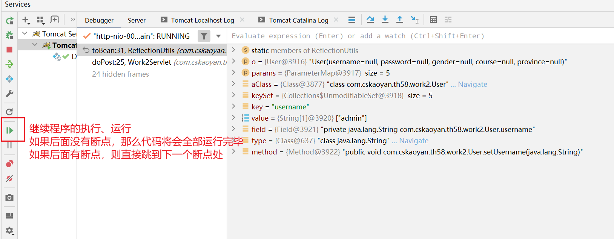
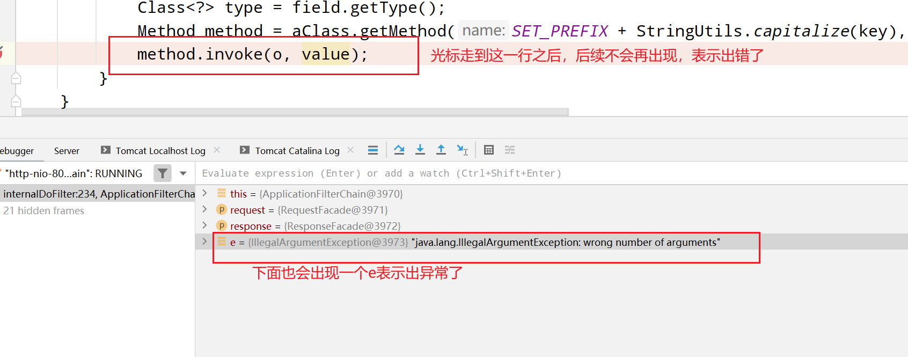

# Day14 ServletRequest

## API

| 方法名称                 | 参数               | 返回值                          | 说明                                                         |
| ------------------------ | ------------------ | ------------------------------- | ------------------------------------------------------------ |
| getMethod()              | -                  | 当前请求报文的请求方法          |                                                              |
| getRequestURI()          | -                  | 请求报文的请求资源部分          |                                                              |
| getRequestURL()          | -                  | 请求报文的请求资源部分          | 二者的区别在于这个比上面一个多出来一部分访问协议、主机、端口号部分 |
| getProtocol()            | -                  | 请求报文的版本协议部分          |                                                              |
| getHeader(name)          | 请求头的名称       | 请求头对应的value值             |                                                              |
| getHeaderNames()         | -                  | 请求报文中所有请求头的key值集合 |                                                              |
| getInputStream()         | -                  | 获取的是请求报文的请求体部分    | 一般情况下，如果是key=value&key=value这种类型的数据，是无需开发人员自行去解析请求体；后续进行文件上传时，我们需要自己去处理 |
| getParameter(name)       | 请求参数的name名称 | 返回的是请求参数对应的value值   | 需要注意的是：该方法适用于key=value&key=value；无论get请求方法参数位于请求行还是post时请求参数位于请求体，只要是这种模式均可以进行处理；无需开发人员自行去处理解析 |
| getParameterNames()      | -                  | 返回的是请求参数的name集合      |                                                              |
| getParameterValues(name) | 请求参数的name名称 | 返回的是请求参数对应的value值   | 需要注意的是，和getParameter的区别在于：getParameter只适用于提交了一个参数的情况；如果提交了多个参数，需要使用当前方法。比如id=1&id=2&id=3 |
| getParameterMap()        | -                  | 返回的是请求参数的键值对形式    |                                                              |


## 概念

1.是什么？ServletRequest是一个提供给servlet的关于客户端请求信息的封装对象。Servlet容器也就是tomcat服务器创建了该对象，并且在调用servlet的service方法时，将其传递了进去。ServletRequest其实就是对于客户端请求信息的封装。

Defines an object to provide client request information to a servlet. The servlet container creates a `ServletRequest` object and passes it as an argument to the servlet's `service` method.

为什么是interface？设计成接口的好处是什么？规范、统一。不同的服务器针对该接口做不同的实现。只需要写一份通用的代码，那么便可以在不同的服务器中运行。

2.为什么要学习它？处理请求信息时更加的方便。如果没有servletRequest，那么我们得到的是一个字符串的请求报文，如果想获取某个部分，需要自己去解析，非常的麻烦。借助于servletRequest，可以将请求报文预先先拆解封装到一个对象中，使用的时候，直接从对象中获取即可。


3.ServletRequest和HttpServletRequest有什么关系？父子接口的关系。

ServletRequest你可以理解为是对应请求报文的封装。

HttpServletRequest你可以理解为是对于HTTP请求报文的封装。

二者之间的区别在于协议的不同。

一般情况下，我们发送请求时，都发送的是HTTP请求报文，所以二者可以看做是等价的。

## 常用功能

1.获取请求报文的各个部分

请求行：请求方法 请求资源 版本协议

请求头

请求体

```java
@WebServlet("/req1")
public class RequestServlet1 extends HttpServlet {

    @Override
    protected void doGet(HttpServletRequest req, HttpServletResponse resp) throws ServletException, IOException {
        //希望可以打印处访问当前servlet的请求的请求报文

        //获取请求行
        //请求方法
        String method = req.getMethod();
        //请求资源
        //二者之间有什么样的区别？？？？？ URL是一个完整的路径；uri是去掉访问协议、主机、端口号部分
        String requestURI = req.getRequestURI();
        StringBuffer requestURL = req.getRequestURL();
        //版本协议
        String protocol = req.getProtocol();
        //GET /app/req1 http://localhost:8080/app/req1 HTTP/1.1
        System.out.println(method + " " + requestURI + " " + requestURL + " " + protocol);
        //获取请求头
        String host = req.getHeader("Host");
        //获取所有的请求头
        Enumeration<String> headerNames = req.getHeaderNames();
        //遍历所有的header的name
        while (headerNames.hasMoreElements()){
            String name = headerNames.nextElement();
            String value = req.getHeader(name);
            //所有的请求头键值对
            System.out.println(name + ":" + value);
        }

        //请求体：今天不需要自己去解析处理，知道这么一回事即可
//        req.getInputStream();
    }
}
```


2.还可以获取客户端和服务器主机的一些信息。比如获取客户端的ip地址、端口号，服务器的ip地址，服务器监听的端口号

有什么使用场景？获取客户端的来源、地域信息；加入黑名单等功能

```java
@WebServlet("/req2")
public class RequestServlet2 extends HttpServlet {

    @Override
    protected void doGet(HttpServletRequest req, HttpServletResponse resp) throws ServletException, IOException {
        //获取客户端的ip地址
        String remoteAddr = req.getRemoteAddr();
        int remotePort = req.getRemotePort();

        //服务器的ip地址、端口号
        String localAddr = req.getLocalAddr();
        int localPort = req.getLocalPort();
        System.out.println("client info:" + remoteAddr + ":" + remotePort + " visit server: " + localAddr + ":" + localPort);
    }
}
```


## 获取请求参数

比如下面的登录页面：

我们在页面中输入用户名、密码登信息，随后这些信息会被提交到服务器(借助于HTTP请求报文)，被服务器接收到，服务器进行解析处理(从HTTP请求报文中获取用户名、密码信息)，和数据库中存储的数据进行比对校验如果一致，则通过；如果不一致，则失败


最常用的用于提交客户端请求信息的方式便是借助于form表单。

form表单:客户端的一种用于向服务器提交数据的工具

input：输入框，可以有不同的类型type=text/password/radio/checkbox;分别表示的是文本输入框、密码输入框、单选框、复选框;如果input输入框希望被提交到服务器，那么必须得有一个name属性。关于input，其中text和password要求我们必须手动输入数据；radio和checkbox只需要用户进行勾选即可，所以针对这两个input必须要有value属性才可以。

首先先访问html页面，将form表单加载出来，后续点击提交按钮，那么会往action地址发送一个post请求；会被我们的程序所处理。

```html
<!DOCTYPE html>
<html lang="en">
<head>
    <meta charset="UTF-8">
    <title>Title</title>
</head>
<body>
    <form action="http://localhost:8080/app/param1" method="post">
        <input type="text" name="username"><br>
        <input type="password" name="password"><br>
        <input type="radio" name="gender" value="male">男
        <input type="radio" name="gender" value="female">女<br>
        <input type="checkbox" name="course" value="java">java
        <input type="checkbox" name="course" value="c++">c++
        <input type="checkbox" name="course" value="python">python<br>
        <input type="submit">
    </form>
</body>
</html>
```

抓包：

form表单里面的请求参数是以key=value&key=value形式来进行提交的；key其实就是form表单里面的name属性。

用户提交的请求参数位于请求体里面，但是并不需要开发人员自行去解析请求体，而是服务器已经预先封装好了。**只要请求参数满足key=value&key=value，那么便可以使用下面介绍的方法来获取请求参数**。

```
POST http://localhost:8080/app/param1 HTTP/1.1
Host: localhost:8080
Connection: keep-alive
Content-Length: 77
Cache-Control: max-age=0
sec-ch-ua: "Chromium";v="124", "Google Chrome";v="124", "Not-A.Brand";v="99"
sec-ch-ua-mobile: ?0
sec-ch-ua-platform: "Windows"
Upgrade-Insecure-Requests: 1
Origin: http://localhost:8080
Content-Type: application/x-www-form-urlencoded
User-Agent: Mozilla/5.0 (Windows NT 10.0; Win64; x64) AppleWebKit/537.36 (KHTML, like Gecko) Chrome/124.0.0.0 Safari/537.36
Accept: text/html,application/xhtml+xml,application/xml;q=0.9,image/avif,image/webp,image/apng,*/*;q=0.8,application/signed-exchange;v=b3;q=0.7
Sec-Fetch-Site: same-origin
Sec-Fetch-Mode: navigate
Sec-Fetch-User: ?1
Sec-Fetch-Dest: document
Referer: http://localhost:8080/app/form.html
Accept-Encoding: gzip, deflate, br, zstd
Accept-Language: zh-CN,zh;q=0.9
Cookie: JSESSIONID=BA8C3908C5031E5670127705371CD1FF

username=admin&password=admin23123&gender=female&course=c%2B%2B&course=python
```

```java
@WebServlet("/param1")
public class ParamServlet1 extends HttpServlet {

    @Override
    protected void doPost(HttpServletRequest req, HttpServletResponse resp) throws ServletException, IOException {
        //使用方法来获取请求参数
        //key其实就是form表单的name属性
        //无需开发人员自行去解析请求体，服务器会帮助我们解析好
        String username = req.getParameter("username");
        String password = req.getParameter("password");
        String gender = req.getParameter("gender");
        //如果我们提交的是类似checkbox这种多个值的场景，那么需要使用下面这个方法
        //  course=java&course=c++
        String[] courses = req.getParameterValues("course");
//        String course = req.getParameter("course");
        System.out.println(username);
        System.out.println(password);
        System.out.println(gender);
        System.out.println(Arrays.toString(courses));
    }
}
```


## 获取请求参数2

如果此时页面中又增加了一些表单项，那么服务端的代码也需要同步发生修改，但是如果我希望页面发生修改的时候，服务端代码可以不用修改，应该怎么办呢？

```java
@WebServlet("/param2")
public class ParamServlet2 extends HttpServlet {

    @Override
    protected void doPost(HttpServletRequest req, HttpServletResponse resp) throws ServletException, IOException {
        //使用方法来获取请求参数
        //key其实就是form表单的name属性
        //无需开发人员自行去解析请求体，服务器会帮助我们解析好
        //请求参数的key值集合：注意和getHeaderNames的区分？？获取的位置不同
        //getParameterNames：获取的是位于请求行或者请求体里面的请求参数
        //getHeaderNames：获取的是请求头里面的键值对
        Enumeration<String> parameterNames = req.getParameterNames();
        while (parameterNames.hasMoreElements()){
            String paramKey = parameterNames.nextElement();
            String[] paramValues = req.getParameterValues(paramKey);
            System.out.println(paramKey + " : " + Arrays.toString(paramValues));
        }
    }
}
```


## 获取请求参数-封装数据

在开发过程中，有时候，需要将请求参数进一步封装到一个对象中。

为什么要封装成对象呢？比如保存到数据库

```SQL
void insertOne(String username, String password, String gender......)


void insertOne(User user);
```

```java
@WebServlet("/param3")
public class ParamServlet3 extends HttpServlet {

    //使用反射来进行处理的思路：

    /**
     * 目前有一个请求参数的键值对 username:xxx;password:xxxx;gender:xxxx;course:xxxx;province:xxxxx
     * 还有一个user对象，里面有对应的成员变量，变量的名称和请求参数的key的值是相同的
     * 需要做的事情便是利用Class对象，去查找到对应的成员变量或者set方法(set + key首字母大写)，利用反射去赋值，赋什么值呢？请求参数键值对的value值
     * 成员变量进行赋值：  field.set(obj, args);
     * set方法进行赋值：  method.invoke(obj, args);
     */
    @Override
    protected void doPost(HttpServletRequest req, HttpServletResponse resp) throws ServletException, IOException {
        //把获取到的请求参数的数据封装到一个user对象中
        User user = new User();
//        Class<? extends User> aClass = user.getClass();
//        Method method = aClass.getMethod("setUsername", String.class);
//        method.invoke(user, args);
        Enumeration<String> parameterNames = req.getParameterNames();
        while (parameterNames.hasMoreElements()){
            String paramKey = parameterNames.nextElement();
            String[] paramValues = req.getParameterValues(paramKey);
            System.out.println(paramKey + " : " + Arrays.toString(paramValues));
        }
    }
}

```

可以使用一个工具类库来完成数据的封装工作。BeanUtils

```java
@WebServlet("/param3")
public class ParamServlet3 extends HttpServlet {

    //使用反射来进行处理的思路：

    /**
     * 目前有一个请求参数的键值对 username:xxx;password:xxxx;gender:xxxx;course:xxxx;province:xxxxx
     * 还有一个user对象，里面有对应的成员变量，变量的名称和请求参数的key的值是相同的
     * 需要做的事情便是利用Class对象，去查找到对应的成员变量或者set方法(set + key首字母大写)，利用反射去赋值，赋什么值呢？请求参数键值对的value值
     * 成员变量进行赋值：  field.set(obj, args);
     * set方法进行赋值：  method.invoke(obj, args);
     */
    @Override
    protected void doPost(HttpServletRequest req, HttpServletResponse resp) throws ServletException, IOException {
        //把获取到的请求参数的数据封装到一个user对象中
        User user = new User();
        //工具类的这个方法就是把第二个参数map里面的键值对封装到第一个参数object对象中
        try {
            BeanUtils.populate(user, req.getParameterMap());
        } catch (IllegalAccessException e) {
            throw new RuntimeException(e);
        } catch (InvocationTargetException e) {
            throw new RuntimeException(e);
        }
        System.out.println(user);
    }
}
```

> 
>
> debug:调试代码，必须具备的一项技能。
>
> 1.选择debug模式，才可以进行调试
>
> 
>
> 2.需要调试的代码处添加断点
>
> 



## 中文乱码

如果我们使用post请求方式提交了表单数据，如果含有中文，那么服务器解析过后正常情况会有中文乱码问题。

void setCharacterEncoding([String](https://docs.oracle.com/javase/7/docs/api/java/lang/String.html) encoding)：

**Overrides the name of the character encoding used in the body of this request.** This method must be called prior to reading request parameters or reading input using getReader().

重写请求体里面的编码格式；该方法必须要在读取请求参数之前调用才有效

```
//如果username=空灵乱码了，不可以使用上述的方法去解决。
GET /app/1.html?username=空灵  HTTP/1.1
Host:localhost:8080
....
...
...

```


