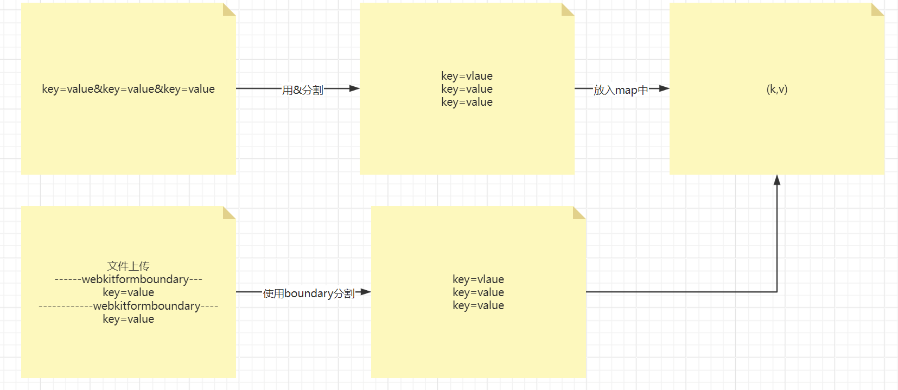

# Day15 FileUpload

## 概述(掌握)

文件上传：顾名思义，就是将客户端本地的资源文件借助于**HTTP请求报文(将文件的数据放置于HTTP请求报文的请求体中，这个过程由谁来完成呢？浏览器)**提交到服务器上面去。**被服务器解析封装到ServletRequest对象中**，所以对于我们业务开发人员来说，我们需要做的事情便是接力，**需要从SerlvetRequest对象中获取文件的数据，将文件存储到硬盘上**。

使用场景：微信更换头像、百度网盘备份资料

## 操作流程(掌握)

1.需要准备一个form表单，action地址、mthod=post

2.input type=file输入框，用来将文件的数据放置在HTTP请求报文的请求体中

3.form表单还需要一个属性enctype=multipart/form-data

4.编写Servlet进一步去处理文件数据

```java
@WebServlet("/upload")
public class UploadServlet1 extends HttpServlet {

    @Override
    protected void doPost(HttpServletRequest req, HttpServletResponse resp) throws ServletException, IOException {
        //首先应该做的事情是获取位于req对象中的文件数据
        ServletInputStream inputStream = req.getInputStream();

        //写入到硬盘上面
        //存储到应用根目录下的image目录中
        String realPath = getServletContext().getRealPath("image");
        String path = realPath + "/1.png";
        File file = new File(path);
        if(!file.getParentFile().exists()){
            //父目录不存在 则创建所有的父目录
            file.getParentFile().mkdirs();
        }
        FileOutputStream fileOutputStream = new FileOutputStream(file);
        int length = 0;
        byte[] bytes = new byte[1024];
        while ((length = inputStream.read(bytes)) != -1){
            fileOutputStream.write(bytes, 0, length);
        }
        inputStream.close();
        fileOutputStream.close();
    }
}
```


但是，最终文件是损坏的，无法打开。为什么会损坏呢？此时可以使用一个文本文件来验证。


通过上述案例，我们可以发现，文件的损坏原因在于上传过后，文件多出了一部分的字符数据，这部分字符数据进入到二进制文件中，导致了文件的损坏。

## 文件损坏原因(掌握)

为什么会有这些字符呢？此时，我们可以在原先的form表单基础上再次引入一些常规的表单项，同时提交。

如果把enctype=multiprart/form-data属性去掉，我们进行上传，此时的请求报文：

```html
<form action="http://localhost:8080/app/upload" method="post">
        <input type="text" name="username"><br>
        <input type="password" name="password"><br>
        <input type="file" name="image"><br>
        <input type="submit">
    </form>
```

```
POST http://localhost:8080/app/upload HTTP/1.1
Host: localhost:8080
Connection: keep-alive
Content-Length: 42
Cache-Control: max-age=0
sec-ch-ua: "Chromium";v="124", "Google Chrome";v="124", "Not-A.Brand";v="99"
sec-ch-ua-mobile: ?0
sec-ch-ua-platform: "Windows"
Upgrade-Insecure-Requests: 1
Origin: http://localhost:8080
Content-Type: application/x-www-form-urlencoded
User-Agent: Mozilla/5.0 (Windows NT 10.0; Win64; x64) AppleWebKit/537.36 (KHTML, like Gecko) Chrome/124.0.0.0 Safari/537.36
Accept: text/html,application/xhtml+xml,application/xml;q=0.9,image/avif,image/webp,image/apng,*/*;q=0.8,application/signed-exchange;v=b3;q=0.7
Sec-Fetch-Site: same-origin
Sec-Fetch-Mode: navigate
Sec-Fetch-User: ?1
Sec-Fetch-Dest: document
Referer: http://localhost:8080/app/upload.html
Accept-Encoding: gzip, deflate, br, zstd
Accept-Language: zh-CN,zh;q=0.9
Cookie: JSESSIONID=8C46CEC02872D2AC9A5E4998E361698D

username=admin&password=asdsad&image=1.txt
```

如果把enctype=multiprart/form-data添加上，此时再次进行上传：

```
POST http://localhost:8080/app/upload HTTP/1.1
Host: localhost:8080
Connection: keep-alive
Content-Length: 404
Cache-Control: max-age=0
sec-ch-ua: "Chromium";v="124", "Google Chrome";v="124", "Not-A.Brand";v="99"
sec-ch-ua-mobile: ?0
sec-ch-ua-platform: "Windows"
Upgrade-Insecure-Requests: 1
Origin: http://localhost:8080
Content-Type: multipart/form-data; boundary=----WebKitFormBoundaryAsCHMGsetOVd9MsS
User-Agent: Mozilla/5.0 (Windows NT 10.0; Win64; x64) AppleWebKit/537.36 (KHTML, like Gecko) Chrome/124.0.0.0 Safari/537.36
Accept: text/html,application/xhtml+xml,application/xml;q=0.9,image/avif,image/webp,image/apng,*/*;q=0.8,application/signed-exchange;v=b3;q=0.7
Sec-Fetch-Site: same-origin
Sec-Fetch-Mode: navigate
Sec-Fetch-User: ?1
Sec-Fetch-Dest: document
Referer: http://localhost:8080/app/upload.html
Accept-Encoding: gzip, deflate, br, zstd
Accept-Language: zh-CN,zh;q=0.9
Cookie: JSESSIONID=8C46CEC02872D2AC9A5E4998E361698D

------WebKitFormBoundaryAsCHMGsetOVd9MsS
Content-Disposition: form-data; name="username"

asad
------WebKitFormBoundaryAsCHMGsetOVd9MsS
Content-Disposition: form-data; name="password"

asdasd
------WebKitFormBoundaryAsCHMGsetOVd9MsS
Content-Disposition: form-data; name="image"; filename="1.txt"
Content-Type: text/plain

hello world!!!!!!!!!!!!!
------WebKitFormBoundaryAsCHMGsetOVd9MsS--

```

通过上述实验，我们可以发现，这些字符实际上是起到分隔符的作用，相当于之前提交表单数据时&的功能。

因为需要进行文件上传，所以不可能再次使用key=value&key=value格式来传输数据。此时字符起到分隔符的作用。两段字符中间包裹的这块区域是属于某个input输入框的，利用这个字符来进行分割的。

**所以，我们需要将这些字符正确地剔除出去，才能够保障二进制文件的完整性**。


## 文件上传解决方案(熟悉)


有两种方案可以供选择：

**1.使用服务器在Servlet3.1版本之后提供的功能，服务器可以帮助我们进行解析处理。**

2.利用第三方的框架jar包，commons-fileupload

```java
@WebServlet("/upload2")
@MultipartConfig
public class UploadServlet2 extends HttpServlet {

    @Override
    protected void doPost(HttpServletRequest req, HttpServletResponse resp) throws ServletException, IOException {
        //使用服务器提供的功能来处理的话，操作非常简单：
        //1.处理的servlet类头上标注一个@MultipartConfig注解
        //2.通过req.getPart()来调用即可，里面输入提交的文件的name属性即可
        Part part = req.getPart("image");
        String filename = part.getSubmittedFileName();
        String contentType = part.getContentType();
        String realPath = getServletContext().getRealPath("image");
        String path = realPath  + "/" + filename;
        File file = new File(path);
        if(!file.getParentFile().exists()){
            //父级目录不存在，则创建所有的父级目录
            file.getParentFile().mkdirs();
        }
        part.write(path);
    }
}
```


## 昨天作业回顾

```java
@WebServlet("/")
public class MyDefaultServlet extends HttpServlet {

    @Override
    protected void doGet(HttpServletRequest req, HttpServletResponse resp) throws ServletException, IOException {
        //不能被其他servlet所处理的请求都会交给当前servlet来进行处理
        //需要做的事情就是识别出用户请求的是哪个资源
        //  /2.png  /link.html  /3.html
        String servletPath = req.getServletPath();
        //确认输入的路径部分对应的硬盘路径
        String realPath = getServletContext().getRealPath(servletPath);
        File file = new File(realPath);
        if(file.exists() && file.isFile()){
            //文件存在，并且不是目录，、将文件响应出去
            FileInputStream fileInputStream = new FileInputStream(file);
            ServletOutputStream outputStream = resp.getOutputStream();
            int length = 0;
            byte[] bytes = new byte[1024];
            while ((length = fileInputStream.read(bytes)) != -1){
                outputStream.write(bytes, 0, length);
            }
            fileInputStream.close();
            outputStream.close();
            return;
        }
        //文件不存在
        resp.setStatus(404);
        resp.getWriter().println("<div>File Not Found</div>");
    }
}
```


## 获取常规表单数据(掌握)

在进行文件上传时，还能不能获取常规的表单数据呢？可以的。

虽然此时提交文件时，表单的数据已经不再是key=value&key=value，但是依然可以使用之前的API来获取请求参数。你可以理解为是服务器去做了向前版本的兼容性。

下面这个图示给大家解释了为什么不再是key=value&key=value格式，依然可以使用原来的API来获取请求参数的原因。



```java
@WebServlet("/upload3")
@MultipartConfig
public class UploadServlet3 extends HttpServlet {

    @Override
    protected void doPost(HttpServletRequest req, HttpServletResponse resp) throws ServletException, IOException {

        //获取常规的表单数据
        String username = req.getParameter("username");
        String password = req.getParameter("password");
        System.out.println(username);
        System.out.println(password);
        Part part = req.getPart("image");
        String filename = part.getSubmittedFileName();
        String contentType = part.getContentType();
        String realPath = getServletContext().getRealPath("image");
        String path = realPath  + "/" + filename;
        File file = new File(path);
        if(!file.getParentFile().exists()){
            //父级目录不存在，则创建所有的父级目录
            file.getParentFile().mkdirs();
        }
        part.write(path);
    }
}
```


## 常见问题(熟悉、了解)

**1.如果文件重名，那么应该怎么办？**

应该改名，如何改名呢？这里面如何改名，没有标准的答案。只要觉得合理，都是可以的。

最简单的方式就是加上时间戳；也可以使用哈希值；完全随机；利用时间戳 + 用户编号

我们这里面给大家介绍的是一种完全随机的方案，叫做UUID。虽然最后我们可能并不会去使用UUID，但是可以以这个为契机，给大家介绍一下这个理念。

```java
@WebServlet("/upload4")
@MultipartConfig
public class UploadServlet4 extends HttpServlet {

    @Override
    protected void doPost(HttpServletRequest req, HttpServletResponse resp) throws ServletException, IOException {

        Part part = req.getPart("image");
        String filename = part.getSubmittedFileName();
        //对文件名去做一个设置、修改
        String uuid = UUID.randomUUID().toString();
        filename = uuid + filename;
        System.out.println(filename);
        String contentType = part.getContentType();
        String realPath = getServletContext().getRealPath("image");
        String path = realPath  + "/" + filename;
        File file = new File(path);
        if(!file.getParentFile().exists()){
            //父级目录不存在，则创建所有的父级目录
            file.getParentFile().mkdirs();
        }
        part.write(path);
    }
}
```

> 对于网盘来说，文件重名应该怎么办？或者说资源重复应该怎么处理？如何识别是相同的资源？
>
> 如果资源重复，应该怎么办？比如A用户上传了一份权利的游戏高清收藏版，B用户也上传了一份同样的资源，对于百度网盘来说，需要给每个人都存储一份吗？只需要存储一份到硬盘的特定位置，将这个地址发送给其他的用户。
>
> 如何识别是否是相同的资源？对于文件的数据取哈希值。


2.目录内文件数过多导致访问速度变慢，应该怎么办？

有一个非常简单的策略：按照时间来划分，年、月、日对应的目录;目录内的文件数目可能依然不均匀，有的目录内文件数依然非常多

(image/2024/03/30/xxx-xx.jpg)

还有一个策略：对文件名取哈希值，得到hashcode，转换成十六进制  0x123456af,将这个字符串的每一位当做目录的名称，文件放置在最后一级目录内，比如image/1/2/3/4/5/6/a/f/xxx-xxx.jpg


## 案例(熟悉)

案例：有一个注册页面，用户输入相应的注册信息(需要上传头像)之后，进行页面跳转，跳转到一个新的页面，要求可以将用户刚刚注册的信息再次回显给用户， 但是头像需要显示出来。

```html
<!DOCTYPE html>
<html lang="en">
<head>
    <meta charset="UTF-8">
    <title>Title</title>
</head>
<body>
    <form action="/app/user/register" enctype="multipart/form-data" method="post">
        <input type="text" name="username"><br>
        <input type="password" name="password"><br>
        <input type="file" name="image"><br>
        <input type="submit">
    </form>
</body>
</html>
```

```java
@WebServlet("/user/*")
//该注解的功能是让服务器帮助我们去解析请求里面的文件数据，处理过之后再次封装回req对象中
@MultipartConfig
public class UserServlet extends HttpServlet {

    @Override
    protected void doPost(HttpServletRequest req, HttpServletResponse resp) throws ServletException, IOException {
        //不要着急，上来就在doPost里面写注册逻辑，因为后面可能还会有其他方法也需要使用doPost来分发
        //因为这里面含有*，所以不可以使用
//        req.getServletPath()
        String requestURI = req.getRequestURI();
        String op = requestURI.replace(req.getContextPath() + "/user/", "");
        if("register".equals(op)){
            register(req, resp);
        }
    }

    //注册的业务逻辑
    //获取接收用户提交过来的请求参数信息（借助于请求报文）；初步校验比对，保证信息的唯一性，存储到数据库，给页面一个回执信息
    //如何和另外一个servlet共享数据？
    //以用户名作为key------对象作为value放入context域中；要求保障用户名唯一
    //再把用户名传递给info  /user/info?username=xxx
    //在info中，获取用户名，从context域里面获取数据，取出来里面的内容
    private void register(HttpServletRequest req, HttpServletResponse resp) throws ServletException, IOException {
        //使用request.getPart获取文件的数据;使用request.getParameter来获取表单数据
        resp.setContentType("text/html;charset=UTF-8");
        req.setCharacterEncoding("utf-8");
        String username = req.getParameter("username");
        String password = req.getParameter("password");

        //判断用户名是否唯一
        ServletContext servletContext = getServletContext();
        Object u = servletContext.getAttribute("username");
        if(u != null){
            //用户名已经被占用了
            resp.getWriter().println("当前用户名已经被占用");
            return;
        }

        Part part = req.getPart("image");
        String filename = part.getSubmittedFileName();
        filename = UUID.randomUUID() + filename;
        //D:/xxx/xxx/xxx/xxx
        String relativePath = "image/" + filename;
        String realPath = servletContext.getRealPath(relativePath);
        //file就是对于硬盘上某个文件的封装
        File file = new File(realPath);
        //如果父级目录不存在，则创建所有的父级目录
        if(!file.getParentFile().exists()){
            file.getParentFile().mkdirs();
        }
        part.write(realPath);
        //todo image
        User user = new User(username, password, relativePath);

        servletContext.setAttribute(username, user);

        resp.getWriter().println("注册成功，即将跳转至信息预览页面");
        resp.setHeader("refresh", "2;url=" + req.getContextPath() + "/user/info?username=" + username);
    }

    @Override
    protected void doGet(HttpServletRequest req, HttpServletResponse resp) throws ServletException, IOException {
        String requestURI = req.getRequestURI();
        String op = requestURI.replace(req.getContextPath() + "/user/", "");
        if("info".equals(op)){
            info(req, resp);
        }
    }

    private void info(HttpServletRequest req, HttpServletResponse resp) throws IOException {
//        register里面包含的数据需要和当前info进行共享
        String username = req.getParameter("username");
        ServletContext servletContext = getServletContext();
        User user = (User) servletContext.getAttribute(username);
        resp.getWriter().println("<div>" + user.getUsername() + "</div>");
        resp.getWriter().println("<div>" + user.getPassword() + "</div>");
        //   /app/image/xxxx.jpg
        resp.getWriter().println("<div></div>");

    }
}
```


思考题：

1.尝试使用年月日来完成多级目录

2.尝试将图片的存储目录设定为任意盘符目录下，而不是位于应用根目录中

