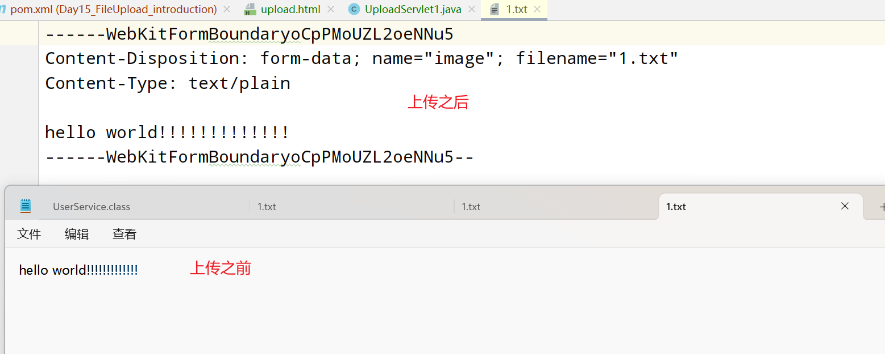

# Day15 FileUpload

## 概述(掌握)

文件上传：顾名思义，就是将客户端本地的资源文件借助于**HTTP请求报文(将文件的数据放置于HTTP请求报文的请求体中，这个过程由谁来完成呢？浏览器)**提交到服务器上面去。**被服务器解析封装到ServletRequest对象中**，所以对于我们业务开发人员来说，我们需要做的事情便是接力，**需要从SerlvetRequest对象中获取文件的数据，将文件存储到硬盘上**。

使用场景：微信更换头像、百度网盘备份资料

## 操作流程(掌握)

1.需要准备一个form表单，action地址、mthod=post

2.input type=file输入框，用来将文件的数据放置在HTTP请求报文的请求体中

3.form表单还需要一个属性enctype=multipart/form-data

4.编写Servlet进一步去处理文件数据

```java
@WebServlet("/upload")
public class UploadServlet1 extends HttpServlet {

    @Override
    protected void doPost(HttpServletRequest req, HttpServletResponse resp) throws ServletException, IOException {
        //首先应该做的事情是获取位于req对象中的文件数据
        ServletInputStream inputStream = req.getInputStream();

        //写入到硬盘上面
        //存储到应用根目录下的image目录中
        String realPath = getServletContext().getRealPath("image");
        String path = realPath + "/1.png";
        File file = new File(path);
        if(!file.getParentFile().exists()){
            //父目录不存在 则创建所有的父目录
            file.getParentFile().mkdirs();
        }
        FileOutputStream fileOutputStream = new FileOutputStream(file);
        int length = 0;
        byte[] bytes = new byte[1024];
        while ((length = inputStream.read(bytes)) != -1){
            fileOutputStream.write(bytes, 0, length);
        }
        inputStream.close();
        fileOutputStream.close();
    }
}
```


但是，最终文件是损坏的，无法打开。为什么会损坏呢？此时可以使用一个文本文件来验证。



通过上述案例，我们可以发现，文件的损坏原因在于上传过后，文件多出了一部分的字符数据，这部分字符数据进入到二进制文件中，导致了文件的损坏。

## 文件损坏原因(掌握)

为什么会有这些字符呢？此时，我们可以在原先的form表单基础上再次引入一些常规的表单项，同时提交。

如果把enctype=multiprart/form-data属性去掉，我们进行上传，此时的请求报文：

```html
<form action="http://localhost:8080/app/upload" method="post">
        <input type="text" name="username"><br>
        <input type="password" name="password"><br>
        <input type="file" name="image"><br>
        <input type="submit">
    </form>
```

```
POST http://localhost:8080/app/upload HTTP/1.1
Host: localhost:8080
Connection: keep-alive
Content-Length: 42
Cache-Control: max-age=0
sec-ch-ua: "Chromium";v="124", "Google Chrome";v="124", "Not-A.Brand";v="99"
sec-ch-ua-mobile: ?0
sec-ch-ua-platform: "Windows"
Upgrade-Insecure-Requests: 1
Origin: http://localhost:8080
Content-Type: application/x-www-form-urlencoded
User-Agent: Mozilla/5.0 (Windows NT 10.0; Win64; x64) AppleWebKit/537.36 (KHTML, like Gecko) Chrome/124.0.0.0 Safari/537.36
Accept: text/html,application/xhtml+xml,application/xml;q=0.9,image/avif,image/webp,image/apng,*/*;q=0.8,application/signed-exchange;v=b3;q=0.7
Sec-Fetch-Site: same-origin
Sec-Fetch-Mode: navigate
Sec-Fetch-User: ?1
Sec-Fetch-Dest: document
Referer: http://localhost:8080/app/upload.html
Accept-Encoding: gzip, deflate, br, zstd
Accept-Language: zh-CN,zh;q=0.9
Cookie: JSESSIONID=8C46CEC02872D2AC9A5E4998E361698D

username=admin&password=asdsad&image=1.txt
```

如果把enctype=multiprart/form-data添加上，此时再次进行上传：

```
POST http://localhost:8080/app/upload HTTP/1.1
Host: localhost:8080
Connection: keep-alive
Content-Length: 404
Cache-Control: max-age=0
sec-ch-ua: "Chromium";v="124", "Google Chrome";v="124", "Not-A.Brand";v="99"
sec-ch-ua-mobile: ?0
sec-ch-ua-platform: "Windows"
Upgrade-Insecure-Requests: 1
Origin: http://localhost:8080
Content-Type: multipart/form-data; boundary=----WebKitFormBoundaryAsCHMGsetOVd9MsS
User-Agent: Mozilla/5.0 (Windows NT 10.0; Win64; x64) AppleWebKit/537.36 (KHTML, like Gecko) Chrome/124.0.0.0 Safari/537.36
Accept: text/html,application/xhtml+xml,application/xml;q=0.9,image/avif,image/webp,image/apng,*/*;q=0.8,application/signed-exchange;v=b3;q=0.7
Sec-Fetch-Site: same-origin
Sec-Fetch-Mode: navigate
Sec-Fetch-User: ?1
Sec-Fetch-Dest: document
Referer: http://localhost:8080/app/upload.html
Accept-Encoding: gzip, deflate, br, zstd
Accept-Language: zh-CN,zh;q=0.9
Cookie: JSESSIONID=8C46CEC02872D2AC9A5E4998E361698D

------WebKitFormBoundaryAsCHMGsetOVd9MsS
Content-Disposition: form-data; name="username"

asad
------WebKitFormBoundaryAsCHMGsetOVd9MsS
Content-Disposition: form-data; name="password"

asdasd
------WebKitFormBoundaryAsCHMGsetOVd9MsS
Content-Disposition: form-data; name="image"; filename="1.txt"
Content-Type: text/plain

hello world!!!!!!!!!!!!!
------WebKitFormBoundaryAsCHMGsetOVd9MsS--

```

通过上述实验，我们可以发现，这些字符实际上是起到分隔符的作用，相当于之前提交表单数据时&的功能。

因为需要进行文件上传，所以不可能再次使用key=value&key=value格式来传输数据。此时字符起到分隔符的作用。两段字符中间包裹的这块区域是属于某个input输入框的，利用这个字符来进行分割的。

**所以，我们需要将这些字符正确地剔除出去，才能够保障二进制文件的完整性**。


## 文件上传解决方案(熟悉)


有两种方案可以供选择：

**1.使用服务器在Servlet3.1版本之后提供的功能，服务器可以帮助我们进行解析处理。**

2.利用第三方的框架jar包，commons-fileupload

```java
@WebServlet("/upload2")
@MultipartConfig
public class UploadServlet2 extends HttpServlet {

    @Override
    protected void doPost(HttpServletRequest req, HttpServletResponse resp) throws ServletException, IOException {
        //使用服务器提供的功能来处理的话，操作非常简单：
        //1.处理的servlet类头上标注一个@MultipartConfig注解
        //2.通过req.getPart()来调用即可，里面输入提交的文件的name属性即可
        Part part = req.getPart("image");
        String filename = part.getSubmittedFileName();
        String contentType = part.getContentType();
        String realPath = getServletContext().getRealPath("image");
        String path = realPath  + "/" + filename;
        File file = new File(path);
        if(!file.getParentFile().exists()){
            //父级目录不存在，则创建所有的父级目录
            file.getParentFile().mkdirs();
        }
        part.write(path);
    }
}
```


