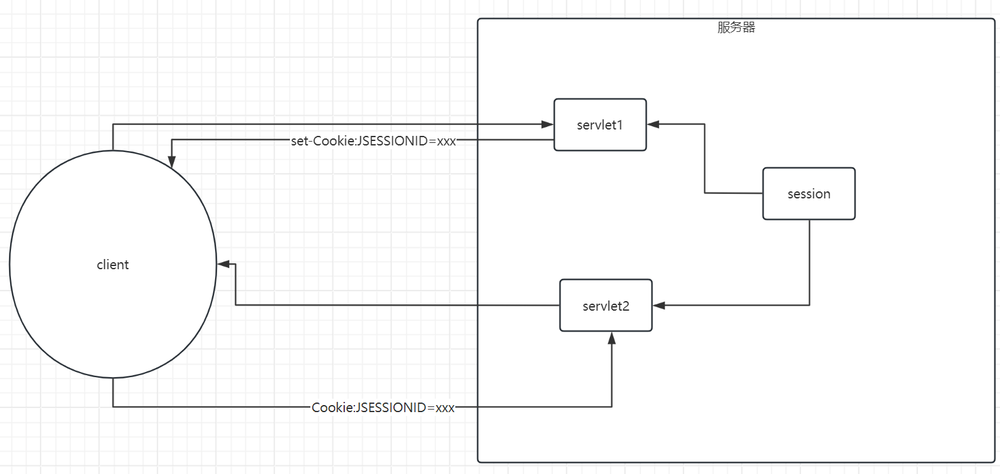
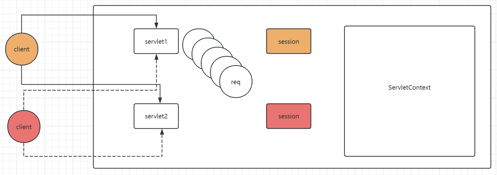
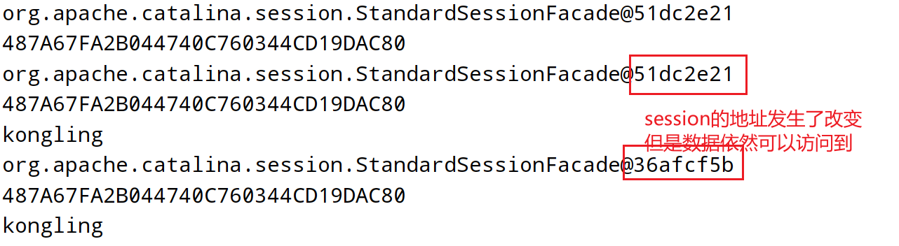

# Day16 会话技术

## API

| 方法名称                   | 参数                         | 返回值                             | 说明                                                         |
| -------------------------- | ---------------------------- | ---------------------------------- | ------------------------------------------------------------ |
| Cookie(name,value)         | Cookie的键值对               | 服务器会创建一个Cookie对象         | 服务器上面的Cookie对象其实只是为了服务器处理Cookie 的数据方便，和客户端上面的Cookie其实并没有本质的联系 |
| response.addCookie(cookie) | 需要返回给客户端的Cookie数据 | -                                  | 利用该方法，可以将服务器上面的一个Cookie对象里面的数据，以set-Cookie响应头的形式返回给客户端；客户端会随即保存下来 |
| request.getCookies()       | -                            | 当前请求携带过来的所有的Cookie信息 |                                                              |
| cookie.setMaxAge(age)      | 单位为秒的时间               |                                    |                                                              |
| cookie.setPath(path)       | 设置一个路径                 |                                    | 仅当访问指定路径时才会携带cookie                             |
| cookie.setDomain(domain)   | 域名                         |                                    | 仅当访问当前域名以及子域名时会携带cookie                     |
| request.getSession()       | -                            | 返回当前请求相关联的session对象    | 看当前请求报文中是否携带了一个有效的Cookie:JSESSIONID=XXX.如果有携带一个有效的编号，那么便可以定位到session对象；如果没有携带，则会创建一个新的session对象 |
| session.invliadte()        | -                            |                                    | 主动销毁session域里面的数据                                  |


## HTTP协议无状态性(掌握)

接下来，通过一个实验案例来展示一下HTTP协议无状态性。

案例：要求在访问Servlet时，可以打印处客户端对应的请求报文信息以及客户端的ip地址信息。

```java
@WebServlet("/status")
public class HttpStatusServlet extends HttpServlet {

    @Override
    protected void doGet(HttpServletRequest req, HttpServletResponse resp) throws ServletException, IOException {
        //打印一下客户端的ip地址
        String remoteAddr = req.getRemoteAddr();
        System.out.println("client address: " + remoteAddr + " visit this page: ");

        //要求：可以打印处当前请求报文
        String requestURI = req.getRequestURI();
        String method = req.getMethod();
        String protocol = req.getProtocol();
        System.out.println(method + " " + requestURI + " " + protocol);

        //请求头
        Enumeration<String> headerNames = req.getHeaderNames();
        while (headerNames.hasMoreElements()){
            String headerName = headerNames.nextElement();
            String headerValue = req.getHeader(headerName);
            System.out.println(headerName + " " + headerValue);
        }
    }
}
```


```
client address: 192.168.102.23 visit this page: 
GET /app/status HTTP/1.1
host 192.168.102.23:8080
connection keep-alive
upgrade-insecure-requests 1
user-agent Mozilla/5.0 (Windows NT 10.0; Win64; x64) AppleWebKit/537.36 (KHTML, like Gecko) Chrome/124.0.0.0 Safari/537.36
accept text/html,application/xhtml+xml,application/xml;q=0.9,image/avif,image/webp,image/apng,*/*;q=0.8,application/signed-exchange;v=b3;q=0.7
accept-encoding gzip, deflate
accept-language zh-CN,zh;q=0.9
===========================================================================
client address: 192.168.102.124 visit this page: 
GET /app/status HTTP/1.1
host 192.168.102.23:8080
connection keep-alive
upgrade-insecure-requests 1
user-agent Mozilla/5.0 (Windows NT 10.0; Win64; x64) AppleWebKit/537.36 (KHTML, like Gecko) Chrome/122.0.0.0 Safari/537.36 Edg/122.0.0.0
accept text/html,application/xhtml+xml,application/xml;q=0.9,image/avif,image/webp,image/apng,*/*;q=0.8,application/signed-exchange;v=b3;q=0.7
accept-encoding gzip, deflate
accept-language zh-CN,zh;q=0.9,en;q=0.8,en-GB;q=0.7,en-US;q=0.6
```

通过上面的案例，我们可以发现，不同客户端发送过来的HTTP请求报文基本上是一模一样的。对于服务器来说，不可能通过请求报文区分出彼此才对。这个称之为HTTP协议无状态性。

但是，在实际的web访问过程中，你会发现，这个现象其实并不存在：实际上服务器是可以区分客户端的。它是怎么做到的呢？实际上便是借助了会话技术。

https://shopping.dangdang.com/shoppingcart/shopping_cart.aspx?product_ids=0&referer=null&prev_referer=null

## 什么是会话技术(掌握)

会话技术主要是为了去解决HTTP协议无状态性的一种解决方案。引入会话技术，就是为了去解决HTTP协议的无状态性。

会话如何理解呢？你可以理解为交谈的上下文。因为HTTP协议无状态性，所以对于服务器的程序来说，是无法理解"我",”这个商品“等这些字样代表的含义的。

会话技术一共有两种，一种是客户端技术，一种是服务器技术。关键在于数据存储在哪，如果存储在客户端，那么便是客户端技术；如果存储在服务器，那么便是服务器技术。

客户端技术的典型代表是Cookie

服务器技术的典型代表是HttpSession

## Cookie

### 概念(掌握)

Cookie是一个客户端技术。数据的产生是位于服务器，但是**数据的存储是位于客户端**。此时需要借助于**HTTP响应报文(set-Cookie:key=value响应头)**，将Cookie数据发送给客户端；客户端随即会将该Cookie数据保存下来，当客户端下一次再次访问服务器时，那么便会借助于**HTTP请求报文(Cookie:key=value)**把这个数据再次携带回去；服务器通过取出里面的值，便可以知道数据来自于哪个客户端。

**所以，Cookie的本质其实就是在HTTP请求报文和HTTP响应报文中额外再次引入了两个头信息**。

我和大家的区别主要在于我执行了加入购物车操作，服务器将Cookie信息返回给了我；而大家是没有这步操作的。


### 使用(掌握)

1.利用构造函数创建一个Cookie对象

2.利用response.addCookie(cookie)将产生的Cookie信息传递给客户端

3.利用request.getCookies()接收客户端提交过来的Cookie信息

```java
@WebServlet("/cookie1")
public class CookieServlet1 extends HttpServlet {

    @Override
    protected void doGet(HttpServletRequest req, HttpServletResponse resp) throws ServletException, IOException {
        //去接收客户端携带回来的Cookie信息
        //Cookie的本质是会携带一个Cookie请求头回来，可以直接获取Cookie请求头
        //但是ee规范同样不希望你直接去操作，而是使用ee规范封装过之后的方法
        Cookie[] cookies = req.getCookies();
        if(cookies != null){
            for (Cookie cookie : cookies) {
                System.out.println(cookie.getName() + "=" + cookie.getValue());
            }
        }


        //Cookie是一个class，具有构造函数
        //接下来，将由servlet发送给客户端，会被客户端所保留下来，下次访问时，再次把cookie给携带回来
        Cookie cookie = new Cookie("username", "kongling");
        //Cookie的本质其实就是引入了set-Cookie响应头以及Cookie请求头
//        resp.setHeader("set-Cookie","username=kongling");
        //实际上，ee规范希望你使用下面的方式来去使用cookie
        //利用下面这行代码，我们将需要发送给客户端的cookie信息传递给服务器，服务器会帮助我们去生成对应的响应头
        //后续，我们需要通过抓包验证一下，是否有set-Cookie响应头
        resp.addCookie(cookie);
    }
}
```


### 案例1(熟悉)

要求，使用Cookie显示上一次访问当前页面的时间

```java
@WebServlet("/last")
public class LastLoginServlet extends HttpServlet {

    @Override
    protected void doGet(HttpServletRequest req, HttpServletResponse resp) throws ServletException, IOException {
        //需要去接收客户端传递过来的Cookie信息
        Cookie[] cookies = req.getCookies();
        if(cookies != null){
            for (Cookie cookie : cookies) {
                if(cookie.getName().equals("last")){
                    String mills = cookie.getValue();
                    resp.getWriter().println(new Date(Long.parseLong(mills)));
                }
            }
        }


        //cookie的value值只可以接收字符串类型，不可以是其他数据类型；value值中不可以包含空格等字符
        long millis = System.currentTimeMillis();
        Cookie cookie = new Cookie("last", millis + "");
        //将产生的Cookie信息以set-Cookie响应头的形式返回给客户端
        resp.addCookie(cookie);
    }
}
```


### 案例2(掌握)

有一个登录页面，用户在页面中输入用户名、密码等信息，跳转到一个个人中心页面，要求在该页面中可以显示出当前登录用户的用户名。不同用户看到的内容是不同的。

```java
@WebServlet("/user/*")
public class UserServlet extends HttpServlet {

    //这里面不可以使用username成员变量来存储用户的信息，为什么？？？？？？？？
    //因为UserServlet在整个程序运行期间只有一个实例对象，所以username只有一份，如果多个用户同时访问当前servlet
    //他们是共享的，但是这部分数据很明显是不可以进行共享的
   // private String username;

    @Override
    protected void doPost(HttpServletRequest req, HttpServletResponse resp) throws ServletException, IOException {
        //  /app/user/login------>  login(/app/user/去掉)
        String requestURI = req.getRequestURI();
        String op = requestURI.replace(req.getContextPath() + "/user/", "");
        if("login".equals(op)) {
            login(req, resp);
        }
    }

    //登录的业务逻辑：接收用户提交过来的请求参数信息，在系统中进行比对校验，校验通过，则跳转到一个新的页面
    private void login(HttpServletRequest req, HttpServletResponse resp) throws IOException {
        String username = req.getParameter("username");
        String password = req.getParameter("password");
        //做一些校验 判空等操作

        //和系统中的数据进行比对：和数据库中的进行比对校验
        //直接登录成功

        //跳转页面----直接复制我的代码即可
        resp.setHeader("refresh", "2;url=" + req.getContextPath() + "/user/info");

        //创建一个Cookie
        Cookie cookie = new Cookie("username", username);
        resp.addCookie(cookie);

        resp.getWriter().println("login success");
    }

    @Override
    protected void doGet(HttpServletRequest req, HttpServletResponse resp) throws ServletException, IOException {
        String requestURI = req.getRequestURI();
        String op = requestURI.replace(req.getContextPath() + "/user/", "");
        if("info".equals(op)) {
            info(req, resp);
        }
    }

    private void info(HttpServletRequest req, HttpServletResponse resp) throws IOException {
        //再次把cookie信息携带了回来
        Cookie[] cookies = req.getCookies();
        if(cookies != null){
            for (Cookie cookie : cookies) {
               if("username".equals(cookie.getName())){
                   resp.getWriter().println("welcome " + cookie.getValue());
               }
            }
        }
    }
}
```


### 设置(熟悉)

#### 设置存活时间

如果默认情况下，没有设置，则默认存在于浏览器的内存中；关闭浏览器，则cookie失效。如果希望cookie可以在硬盘上持续一段时间，可以设置一个正数单位为秒的时间。

设置一个正数表示的是在硬盘上面存活多少秒

设置一个负数表示的是存在于浏览器的内存中，默认情况下就是负数

设置0表示删除cookie

```java
@WebServlet("/time1")
public class SetTimeServlet extends HttpServlet {

    @Override
    protected void doGet(HttpServletRequest req, HttpServletResponse resp) throws ServletException, IOException {
        Cookie cookie = new Cookie("time", "abcd");

        //设置一个存活时间 单位是秒
        cookie.setMaxAge(180);

        resp.addCookie(cookie);
    }
}
```

```java
@WebServlet("/time2")
public class SetTimeServlet2 extends HttpServlet {


    @Override
    protected void doGet(HttpServletRequest req, HttpServletResponse resp) throws ServletException, IOException {
        //接收cookie

        Cookie[] cookies = req.getCookies();
        if(cookies != null){
            for (Cookie cookie : cookies) {
                if(cookie.getName().equals("time")){
                    //删除cookie
                    //仅仅设置一个maxage=0是无法删除cookie的，为什么呢？
                    //因为cookie是存储在客户端的；而我们这个的代码的意义是服务器上面的一个cookie对象设置了一个属性maxage=0仅此而已
                    //我们需要做的事情是将需要修改的cookie同步给客户端，让客户端把这个cookie给删除了
                    cookie.setMaxAge(0);
                    resp.addCookie(cookie);
                    System.out.println(cookie.getValue());
                }
            }
        }
    }
}
```


#### 设置路径

如果没有设置的情况下，仅当访问当**前路径以及当前路径的子路径**时才会携带Cookie，设置了路径之后，可以更改其范围。

比如在访问/a/b/c/servlet1时，创建了一个Cookie对象，那么访问后续地址时，会不会携带Cookie呢？

1.访问/a/b/c/d/serlvet2 会携带

2.访问/a/b/servlet3  不会携带

3.访问/a/serlvet4  不会携带

4.访问/servlet5  不会携带

上述案例中，我们可以给cookie设置一个了路径，可以更改其作用范围。

Cookie设置路径最大的意义在于可以实现同一个tomcat部署的多个应用之间进行数据共享。比如可以把一个商城拆分成若干个功能模块，分别进行部署，各自部署在一个单独的应用中。使用这个特性便可以实现多个应用之间数据共享。


```java
@WebServlet("/a/b/c/s1")
public class PathServlet extends HttpServlet {

    @Override
    protected void doGet(HttpServletRequest req, HttpServletResponse resp) throws ServletException, IOException {
        Cookie cookie = new Cookie("path", "abc");
        cookie.setPath(req.getContextPath() + "/a/");
        resp.addCookie(cookie);
    }
}
```


还有一点需要指出的是，如果cookie设置了路径，那么删除cookie时，需要把路径再次填写一遍，否则客户端不会删除cookie。

需要保证设置的path和创建时设置的一致。

```java
@WebServlet("/a/s2")
public class PathServlet2 extends HttpServlet {

    @Override
    protected void doGet(HttpServletRequest req, HttpServletResponse resp) throws ServletException, IOException {
        Cookie[] cookies = req.getCookies();
        if(cookies != null){
            for (Cookie cookie : cookies) {
                if("path".equals(cookie.getName())){
                    System.out.println(cookie.getValue());
                    cookie.setMaxAge(0);
                    //删除cookie时，需要把创建时设置的path再写一遍，否则不会删除
                    cookie.setPath(req.getContextPath() + "/a/");
                    resp.addCookie(cookie);
                }
            }
        }
    }
}
```


#### 设置域名(掌握)

首先，浏览器针对Cookie设置域名有一个大的前提条件：那就是不可以设置和当前域名无关的Cookie。比如当前所在的域名是localhost，但是希望设置一个Cookie的域名为baidu.com,此时是无法设置成功的。


如果我们设置了一个父域名的Cookie，那么当访问子域名时，浏览器会自动携带cookie。最大的意义是可以实现跨主机之间的数据共享。

比如：访问京东之后，登录成功之后，生成了一个Cookie，对应的域名为jd.com

后续当访问item.jd.com、miaosha.jd.com等这些域名时，浏览器均会默认携带cookie。


演示该案例，过程略有一些复杂：

1.需要在hosts文件中配置域名和本地ip地址的映射关系

2.需要再对应的域名所在的环境下去执行代码，那么浏览器才会将Cookie给保存下来。

```java
@WebServlet("/dm")
public class DomainServlet extends HttpServlet {

    @Override
    protected void doGet(HttpServletRequest req, HttpServletResponse resp) throws ServletException, IOException {
        Cookie cookie = new Cookie("domain", "ddd");
        //但是这部分代码是不可以在localhost环境下运行的；
        //必须要求在ccc.com环境下才可以运行这段代码；但是这个域名我并没有购买，也没有和本地ip地址关联
        //所以，采取的方式是在hosts文件中去做了映射
        cookie.setDomain("ccc.com");
        resp.addCookie(cookie);
    }
}
```


### Cookie优缺点

优点：客户端存储，减轻服务器压力；小巧轻便；可以实现跨主机、跨应用共享

缺点：只可以存储字符类型；存储在客户端，安全性不是特别的高


## Session

### 概念

服务器技术，数据的创建和存储均是在服务器完成的。客户端访问服务器时，在某个场景下，服务器给当前客户端开辟了一块内存空间，也就是生成了一个对象；当该客户端再次访问服务器上面的其他资源时，如果需要进行数据共享，那么还是使用之前的这个对象来提供服务。



因为HTTP协议无状态性，客户端和Session时如何关联的？客户端访问服务器时，服务器究竟应该安排哪个session对象来提供服务？此时需要借助于Cookie来传输session的编号（相当于理发店使用的是手机号码来传递信息一样）


### 使用(掌握)

Provides a way to identify a user across more than one page request or visit to a Web site and to store information about that user.

HttpSession可以在多个页面的访问过程中唯一标识一个客户端(因为HTTP协议是无状态性)或者说可以给客户端存储一部分数据。

**getSession()**：当前请求有关联的session对象则返回；如果没有关联的session对象，则创建一个

> 怎么判断当前请求有没有关联的session对象？？？？
>
> 就看请求头中有没有携带一个有效的Cookie:JSESSIONID=XXXX

Returns the current session associated with this request, or if the request does not have a session, creates one.

getSession(boolean create)

Returns the current `HttpSession` associated with this request or, if there is no current session and `create` is true, returns a new session.

If `create` is `false` and the request has no valid `HttpSession`, this method returns `null`.


1.利用request.getSession()创建(返回)一个Session对象

2.利用session对象来存取数据

```java
@WebServlet("/ss1")
public class SessionServlet extends HttpServlet {

    @Override
    protected void doGet(HttpServletRequest req, HttpServletResponse resp) throws ServletException, IOException {
        //利用request对象来获取当前请求相关联的session对象
        //第一次访问的时候需要注意什么？第一次访问，因为之前没有相关联的session对象，所以会创建一个
        //创建了session对象，如何和客户端产生关联呢？需要把session的编号通过cookie返回给客户端
        //应该可以看到有一个set-Cookie:JSESSIONID=xxx响应头
        //后续第二次再次访问当前servlet时，或者访问ss2时，还会不会会该响应头呢？不会
        HttpSession session = req.getSession();

        //利用session对象来进行数据共享
        session.setAttribute("username", "kongling");

    }
}
```

```java
@WebServlet("/ss2")
public class SessionServlet2 extends HttpServlet {

    @Override
    protected void doGet(HttpServletRequest req, HttpServletResponse resp) throws ServletException, IOException {
        //利用request对象来获取当前请求相关联的session对象
        HttpSession session = req.getSession();

        //利用session对象来进行数据共享
        Object username = session.getAttribute("username");
        System.out.println(username);

    }
}
```


### Session域和Context域、Request域之间区别(掌握)

session域：使用session对象来实现数据共享。但是session对象在整个程序运行期间不是一个对象。而是一个客户端就会对应一个session对象。只要是同一个客户端访问的不同资源，那么均可以使用session对象来进行数据共享。session域适用于同一个客户端访问不同的资源。

context域：使用serlvetContext对象来进行数据共享。该对象在整个程序的运行期间，有且只有一个实例对象，所以无论是那个客户端，访问的是哪个资源，那么均是访问的是同一个servletContext对象，所以均可以实现数据共享。context域的范围是最广的。

request域：只有转发的时候，是使用的是同一个request对象，所以可以共享request域。




### 常见问题(掌握)

1.关闭浏览器，session对象是否会销毁，是否可以访问到session域里面的数据？？？？

对象没有被销毁；无法访问到session域里面的数据了。原因在于关闭浏览器之后，把凭证丢了，下一次访问的时候，不会携带Cookie:JSESSIONID=xxx,所以服务器获取不到原先的session编号，那么也就无法查找到对应的session对象，会重新创建一个新的session对象。


2.关闭服务器，session对象是否会销毁，是否可以访问到session域里面的数据？

对象会被销毁，但是数据依然可以访问到。主要在于session在应用即将销毁之前进行了持久化操作、序列化操作。




接下来演示一下：使用tomcat提供的应用管理器来卸载应用，重新部署

1.需要保证本地的tomcat的webapps目录下存在manager应用

2.在本地tomcat的conf/tomat-users.xml文件中进行配置

```xml
<role rolename="manager-gui"/>
<user username="tomcat" password="tomcat" roles="manager-gui"/>
```


### Session生命周期(熟悉)

session对象的生命周期和session数据的生命周期是不一致的。

对象

​	创建：第一次调用request.getSession()时候

​	销毁：应用卸载、服务器关闭的时候

数据

​	创建：调用session域setAttribute赋值的时候

​	销毁：（对象的销毁不会导致数据的销毁）**session的有效期到达(默认30min有效期)**;**主动调用session.invalidate()**清空session


### 案例(掌握)

有一个登录页面，用户在页面中输入用户名、密码等信息，跳转到一个个人中心页面，要求在该页面中可以显示出当前登录用户的用户名。同时该页面会有注销按钮，当前用户点击注销按钮时，会退出当前的会话，并且返回登录页面。

```java
@WebServlet("/user/*")
public class UserServlet extends HttpServlet {

    @Override
    protected void doPost(HttpServletRequest req, HttpServletResponse resp) throws ServletException, IOException {
        //分发，分发到login方法中
        String requestURI = req.getRequestURI();
        String op = requestURI.replace(req.getContextPath() + "/user/", "");
        if("login".equals(op)){
            login(req, resp);
        }
    }

    private void login(HttpServletRequest req, HttpServletResponse resp) {
        //接收用户提交过来的请求参数信息
        String username = req.getParameter("username");
        String password = req.getParameter("password");

        //需要跳转到info页面，并且还需要和info页面共享用户名信息，所以此时可以使用session域来存储用户的数据
        HttpSession session = req.getSession();
        session.setAttribute("username", username);

        resp.setHeader("refresh", "2;url=" + req.getContextPath() + "/user/info");
    }

    @Override
    protected void doGet(HttpServletRequest req, HttpServletResponse resp) throws ServletException, IOException {
        String requestURI = req.getRequestURI();
        String op = requestURI.replace(req.getContextPath() + "/user/", "");
        if("info".equals(op)){
            info(req, resp);
        }else if("logout".equals(op)){
            logout(req, resp);
        }
    }

    private void logout(HttpServletRequest req, HttpServletResponse resp) {
        //注销逻辑
        HttpSession session = req.getSession();
        //调用下面的方法来进行注销
        session.invalidate();
        resp.setHeader("refresh", "2;url=" + req.getContextPath() + "/login.html");
    }

    private void info(HttpServletRequest req, HttpServletResponse resp) throws IOException {
        resp.setContentType("text/html;charset=utf-8");
        HttpSession session = req.getSession();
        Object username = session.getAttribute("username");
        resp.getWriter().println("welcome:" + username + "<a href='" + req.getContextPath() + "/user/logout" + "'>点击注销</a>");
    }
}
```


