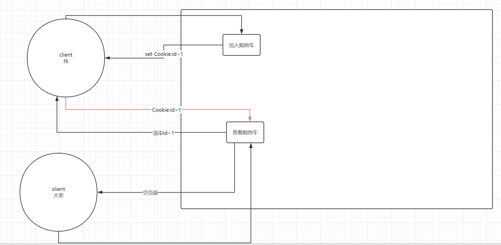

# Day16 会话技术

## HTTP协议无状态性(掌握)

接下来，通过一个实验案例来展示一下HTTP协议无状态性。

案例：要求在访问Servlet时，可以打印处客户端对应的请求报文信息以及客户端的ip地址信息。

```java
@WebServlet("/status")
public class HttpStatusServlet extends HttpServlet {

    @Override
    protected void doGet(HttpServletRequest req, HttpServletResponse resp) throws ServletException, IOException {
        //打印一下客户端的ip地址
        String remoteAddr = req.getRemoteAddr();
        System.out.println("client address: " + remoteAddr + " visit this page: ");

        //要求：可以打印处当前请求报文
        String requestURI = req.getRequestURI();
        String method = req.getMethod();
        String protocol = req.getProtocol();
        System.out.println(method + " " + requestURI + " " + protocol);

        //请求头
        Enumeration<String> headerNames = req.getHeaderNames();
        while (headerNames.hasMoreElements()){
            String headerName = headerNames.nextElement();
            String headerValue = req.getHeader(headerName);
            System.out.println(headerName + " " + headerValue);
        }
    }
}
```


```
client address: 192.168.102.23 visit this page: 
GET /app/status HTTP/1.1
host 192.168.102.23:8080
connection keep-alive
upgrade-insecure-requests 1
user-agent Mozilla/5.0 (Windows NT 10.0; Win64; x64) AppleWebKit/537.36 (KHTML, like Gecko) Chrome/124.0.0.0 Safari/537.36
accept text/html,application/xhtml+xml,application/xml;q=0.9,image/avif,image/webp,image/apng,*/*;q=0.8,application/signed-exchange;v=b3;q=0.7
accept-encoding gzip, deflate
accept-language zh-CN,zh;q=0.9
===========================================================================
client address: 192.168.102.124 visit this page: 
GET /app/status HTTP/1.1
host 192.168.102.23:8080
connection keep-alive
upgrade-insecure-requests 1
user-agent Mozilla/5.0 (Windows NT 10.0; Win64; x64) AppleWebKit/537.36 (KHTML, like Gecko) Chrome/122.0.0.0 Safari/537.36 Edg/122.0.0.0
accept text/html,application/xhtml+xml,application/xml;q=0.9,image/avif,image/webp,image/apng,*/*;q=0.8,application/signed-exchange;v=b3;q=0.7
accept-encoding gzip, deflate
accept-language zh-CN,zh;q=0.9,en;q=0.8,en-GB;q=0.7,en-US;q=0.6
```

通过上面的案例，我们可以发现，不同客户端发送过来的HTTP请求报文基本上是一模一样的。对于服务器来说，不可能通过请求报文区分出彼此才对。这个称之为HTTP协议无状态性。

但是，在实际的web访问过程中，你会发现，这个现象其实并不存在：实际上服务器是可以区分客户端的。它是怎么做到的呢？实际上便是借助了会话技术。

https://shopping.dangdang.com/shoppingcart/shopping_cart.aspx?product_ids=0&referer=null&prev_referer=null

## 什么是会话技术(掌握)

会话技术主要是为了去解决HTTP协议无状态性的一种解决方案。引入会话技术，就是为了去解决HTTP协议的无状态性。

会话如何理解呢？你可以理解为交谈的上下文。因为HTTP协议无状态性，所以对于服务器的程序来说，是无法理解"我",”这个商品“等这些字样代表的含义的。

会话技术一共有两种，一种是客户端技术，一种是服务器技术。关键在于数据存储在哪，如果存储在客户端，那么便是客户端技术；如果存储在服务器，那么便是服务器技术。

客户端技术的典型代表是Cookie

服务器技术的典型代表是HttpSession

## Cookie

### 概念(掌握)

Cookie是一个客户端技术。数据的产生是位于服务器，但是**数据的存储是位于客户端**。此时需要借助于**HTTP响应报文(set-Cookie:key=value响应头)**，将Cookie数据发送给客户端；客户端随即会将该Cookie数据保存下来，当客户端下一次再次访问服务器时，那么便会借助于**HTTP请求报文(Cookie:key=value)**把这个数据再次携带回去；服务器通过取出里面的值，便可以知道数据来自于哪个客户端。

**所以，Cookie的本质其实就是在HTTP请求报文和HTTP响应报文中额外再次引入了两个头信息**。

我和大家的区别主要在于我执行了加入购物车操作，服务器将Cookie信息返回给了我；而大家是没有这步操作的。



### 使用(掌握)

1.利用构造函数创建一个Cookie对象

2.利用response.addCookie(cookie)将产生的Cookie信息传递给客户端

3.利用request.getCookies()接收客户端提交过来的Cookie信息

```java
@WebServlet("/cookie1")
public class CookieServlet1 extends HttpServlet {

    @Override
    protected void doGet(HttpServletRequest req, HttpServletResponse resp) throws ServletException, IOException {
        //去接收客户端携带回来的Cookie信息
        //Cookie的本质是会携带一个Cookie请求头回来，可以直接获取Cookie请求头
        //但是ee规范同样不希望你直接去操作，而是使用ee规范封装过之后的方法
        Cookie[] cookies = req.getCookies();
        if(cookies != null){
            for (Cookie cookie : cookies) {
                System.out.println(cookie.getName() + "=" + cookie.getValue());
            }
        }


        //Cookie是一个class，具有构造函数
        //接下来，将由servlet发送给客户端，会被客户端所保留下来，下次访问时，再次把cookie给携带回来
        Cookie cookie = new Cookie("username", "kongling");
        //Cookie的本质其实就是引入了set-Cookie响应头以及Cookie请求头
//        resp.setHeader("set-Cookie","username=kongling");
        //实际上，ee规范希望你使用下面的方式来去使用cookie
        //利用下面这行代码，我们将需要发送给客户端的cookie信息传递给服务器，服务器会帮助我们去生成对应的响应头
        //后续，我们需要通过抓包验证一下，是否有set-Cookie响应头
        resp.addCookie(cookie);
    }
}
```


### 案例1(熟悉)

要求，使用Cookie显示上一次访问当前页面的时间

```java
@WebServlet("/last")
public class LastLoginServlet extends HttpServlet {

    @Override
    protected void doGet(HttpServletRequest req, HttpServletResponse resp) throws ServletException, IOException {
        //需要去接收客户端传递过来的Cookie信息
        Cookie[] cookies = req.getCookies();
        if(cookies != null){
            for (Cookie cookie : cookies) {
                if(cookie.getName().equals("last")){
                    String mills = cookie.getValue();
                    resp.getWriter().println(new Date(Long.parseLong(mills)));
                }
            }
        }


        //cookie的value值只可以接收字符串类型，不可以是其他数据类型；value值中不可以包含空格等字符
        long millis = System.currentTimeMillis();
        Cookie cookie = new Cookie("last", millis + "");
        //将产生的Cookie信息以set-Cookie响应头的形式返回给客户端
        resp.addCookie(cookie);
    }
}
```


### 案例2(掌握)

有一个登录页面，用户在页面中输入用户名、密码等信息，跳转到一个个人中心页面，要求在该页面中可以显示出当前登录用户的用户名。不同用户看到的内容是不同的。

```java
@WebServlet("/user/*")
public class UserServlet extends HttpServlet {

    //这里面不可以使用username成员变量来存储用户的信息，为什么？？？？？？？？
    //因为UserServlet在整个程序运行期间只有一个实例对象，所以username只有一份，如果多个用户同时访问当前servlet
    //他们是共享的，但是这部分数据很明显是不可以进行共享的
   // private String username;

    @Override
    protected void doPost(HttpServletRequest req, HttpServletResponse resp) throws ServletException, IOException {
        //  /app/user/login------>  login(/app/user/去掉)
        String requestURI = req.getRequestURI();
        String op = requestURI.replace(req.getContextPath() + "/user/", "");
        if("login".equals(op)) {
            login(req, resp);
        }
    }

    //登录的业务逻辑：接收用户提交过来的请求参数信息，在系统中进行比对校验，校验通过，则跳转到一个新的页面
    private void login(HttpServletRequest req, HttpServletResponse resp) throws IOException {
        String username = req.getParameter("username");
        String password = req.getParameter("password");
        //做一些校验 判空等操作

        //和系统中的数据进行比对：和数据库中的进行比对校验
        //直接登录成功

        //跳转页面----直接复制我的代码即可
        resp.setHeader("refresh", "2;url=" + req.getContextPath() + "/user/info");

        //创建一个Cookie
        Cookie cookie = new Cookie("username", username);
        resp.addCookie(cookie);

        resp.getWriter().println("login success");
    }

    @Override
    protected void doGet(HttpServletRequest req, HttpServletResponse resp) throws ServletException, IOException {
        String requestURI = req.getRequestURI();
        String op = requestURI.replace(req.getContextPath() + "/user/", "");
        if("info".equals(op)) {
            info(req, resp);
        }
    }

    private void info(HttpServletRequest req, HttpServletResponse resp) throws IOException {
        //再次把cookie信息携带了回来
        Cookie[] cookies = req.getCookies();
        if(cookies != null){
            for (Cookie cookie : cookies) {
               if("username".equals(cookie.getName())){
                   resp.getWriter().println("welcome " + cookie.getValue());
               }
            }
        }
    }
}
```


### 设置(熟悉)

#### 设置存活时间

如果默认情况下，没有设置，则默认存在于浏览器的内存中；关闭浏览器，则cookie失效。如果希望cookie可以在硬盘上持续一段时间，可以设置一个正数单位为秒的时间。

设置一个正数表示的是在硬盘上面存活多少秒

设置一个负数表示的是存在于浏览器的内存中，默认情况下就是负数

设置0表示删除cookie

```java
@WebServlet("/time1")
public class SetTimeServlet extends HttpServlet {

    @Override
    protected void doGet(HttpServletRequest req, HttpServletResponse resp) throws ServletException, IOException {
        Cookie cookie = new Cookie("time", "abcd");

        //设置一个存活时间 单位是秒
        cookie.setMaxAge(180);

        resp.addCookie(cookie);
    }
}
```

```java
@WebServlet("/time2")
public class SetTimeServlet2 extends HttpServlet {


    @Override
    protected void doGet(HttpServletRequest req, HttpServletResponse resp) throws ServletException, IOException {
        //接收cookie

        Cookie[] cookies = req.getCookies();
        if(cookies != null){
            for (Cookie cookie : cookies) {
                if(cookie.getName().equals("time")){
                    //删除cookie
                    //仅仅设置一个maxage=0是无法删除cookie的，为什么呢？
                    //因为cookie是存储在客户端的；而我们这个的代码的意义是服务器上面的一个cookie对象设置了一个属性maxage=0仅此而已
                    //我们需要做的事情是将需要修改的cookie同步给客户端，让客户端把这个cookie给删除了
                    cookie.setMaxAge(0);
                    resp.addCookie(cookie);
                    System.out.println(cookie.getValue());
                }
            }
        }
    }
}
```


