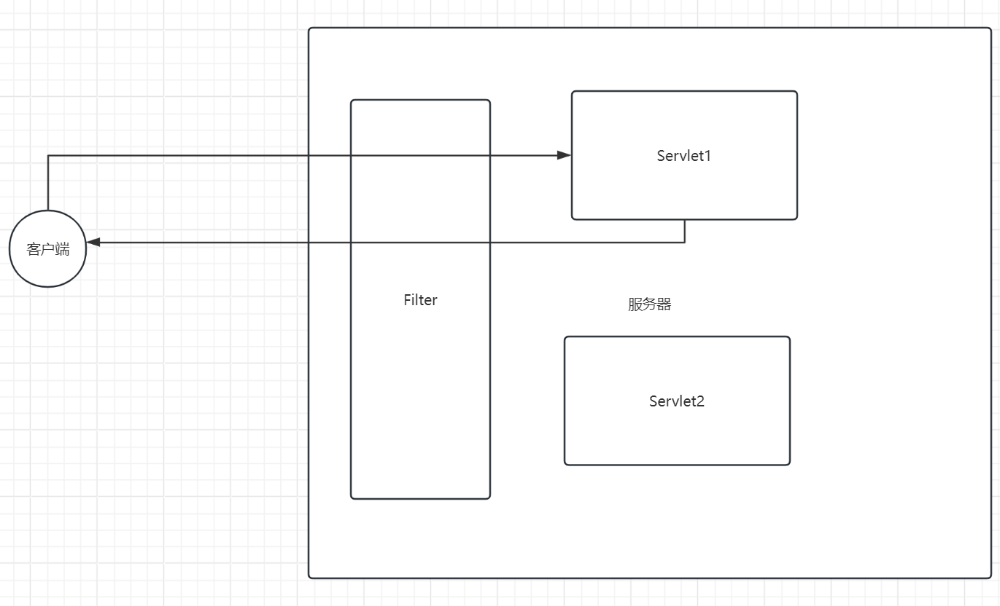

# Day17 Web组件

指的是java ee规范体系中一共制定了三个标准组件用于去进行web开发工作，分别是Listener、Filter、Servlet。

Servlet：主要作用是用于去开发动态web资源。

Listener：一共有三大类，8种，但是使用最多的其实只有ServletContextListener，主要负责去监听SerlvetContext对象的创建和销毁工作，主要用于项目启动时、项目卸载时的一些配置工作。

Filter：过滤器、拦截器。主要做的事情是用于权限的控制。比如哪些人能够访问哪些页面等。


## Listener

监听器，比如监听ServletContext对象的创建和销毁。

ServletContext对象被创建的时候是在什么时候？应用启动的时候

ServletContext对象被销毁的时候是在什么时候？应用卸载的时候

所以，我们编写一个Listener，可以监听应用启动时、应用卸载时状态。如果我们有这样的一个需求，我们需要再应用启动、应用销毁时做一些事情，那么便可以把代码逻辑写在该listener中。

Listener所做的事情和Serlvet的init方法所做的事情的确有一些相似之处。为什么还需要listener呢？

比如购物车案例中，进行了商品的初始化工作，我们的代码逻辑写在IndexServlet中的，可能部分同学会有疑问，为什么不能够写在ItemServlet中呢？也是可以写在ItemSerlvet中的，在维护的时候其实并不会特别容易维护。所以，**listener的出现其实就是希望开发者可以将全局性的代码逻辑写在listener中**。比如读取配置文件，进行全局配置等工作。

Servlet的init方法专门用来去写和当前servlet的功能具有强相关性的代码。

比如有一个用户模块，编写了一个UserServlet,希望能够去进行用户信息的统计等处理，那么可以写在Serlvet的init方法中。


### 使用

1.编写一个类实现ServletContextListener接口

2.向容器中去注册该Listener(一种是web.xml或者注解)

```java
@WebListener
public class AppListener implements ServletContextListener {
    @Override
    public void contextInitialized(ServletContextEvent sce) {
        //应用启动时，会调用当前方法
        //如果希望在项目启动时读取配置文件，那么便可以将代码写在当前方法中
        System.out.println("context init");
        ServletContext servletContext = sce.getServletContext();
        // context域   获取绝对路径
    }

    @Override
    public void contextDestroyed(ServletContextEvent sce) {
        //应用卸载时，会调用该方法
    }
}
```


### 原理(了解)

涉及到多态。

在ServletContext对象的内部其实是持有ServletContextListener接口的引用，在ServletContext对象创建和销毁的时候，会分别调用接口的contextInitialized以及contextDestroyed方法。

```
public class ServletContext{

//ServletContext对象的内部持有一个接口的引用
List<ServletContextListener> listeners;

//该方法可以理解为tomcat会调用，解析到一个listener之后，会将listener添加到list中
void addListener(ServletContextListener listner){
	listeners.add(listener);
}

//servletContext对象的创建和销毁
 void init(){
     listeners.for{
     	listener.contextInitialized();
     }
 }
 
 void destroy(){
 listeners.for{
     	listener.contextDestroyed();
     }
 }


}
```


## Filter

过滤器，也叫做拦截器。主要作用是负责去拦截客户端的请求或者对服务器产生的响应进行校验，设置等。

比如：设定订单页面、个人中心页面没有登录的情况下不允许访问；屏蔽一些脏话；


### 原理图

Filter的功能定位位于客户端和Servlet等资源之间的。对于与过滤器关联的Servlet来说，Filter可以在请求到达Servlet之前检查修改request对象，也可以在响应到达客户端之前检查修改response对象。

相当于城门的作用。



### 使用

1.编写类实现Filter接口

2.向容器中去注册当前配置的Filter

```java
/**
 * @Author 远志 zhangsong@cskaoyan.onaliyun.com
 * @Date 2024/5/2 15:08
 * 类比Servlet来进行学习：需要关注的是哪些和servlet时一致的；哪些和servlet时不同的
 * @Version 1.0
 */
@WebFilter("/f1")
public class Filter1 implements Filter {

    //应用启动的时候便会调用init方法；当前filter被创建的时候会调用init；说明了filter在运行期间也只有一个实例对象
    @Override
    public void init(FilterConfig filterConfig) throws ServletException {
        System.out.println("filter init");
    }

    //该方法类似于servlet的service方法
    @Override
    public void doFilter(ServletRequest request, ServletResponse response, FilterChain chain) throws IOException, ServletException {
        System.out.println("filter doFilter");
    }

    //应用卸载的时候会调用destroy方法
    @Override
    public void destroy() {
        System.out.println("filter destroy");
    }
}
```


### 思考题

1.filter如何和Serlvet产生关联？最简单的方式便是通过url-pattern产生关联。也就是将servlet的url-pattern赋值给filter即可。filter和servlet设置相同的url-pattern。

> 正常情况下来说，filter和servlet产生关联之后，默认情况下，filter执行的是拦截功能；如果希望filter执行的是放行功能，需要设置一行代码。
>
> ```java
> @Override
>     public void doFilter(ServletRequest request, ServletResponse response, FilterChain chain) throws IOException, ServletException {
>         System.out.println("filter doFilter");
> 
>         //具有这行代码，那么便是放行；如果没有这行代码，那么便是拦截
>         chain.doFilter(request, response);
>     }
> ```
>
> 


2.filter可以设置和Serlvet相同的url-pattern，那么filter可以(推荐)设置/*吗？可以，并且非常推荐。因为设置了

/*之后，便可以实现filter和servlet之间一对多的关系。那么后续在设定哪些人能够访问哪些页面时就会非常的方便，或者说设置编码格式也会非常的轻松。


3.多个filter之间可不可以设置相同的url-pattern呢？可以的。


