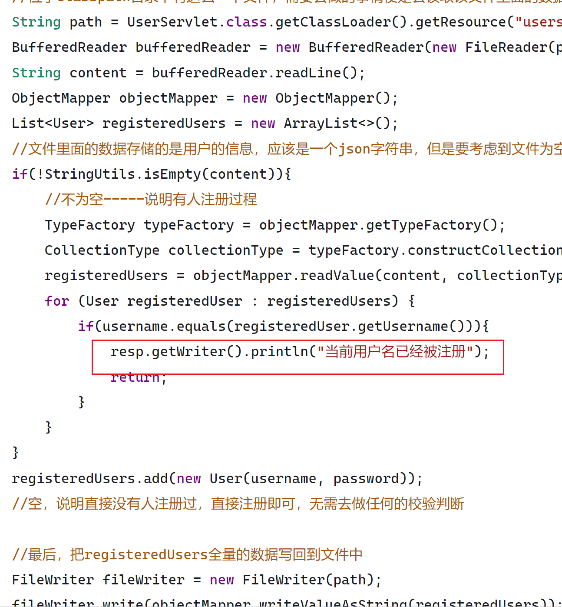
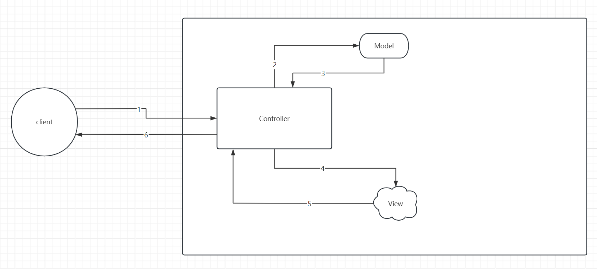
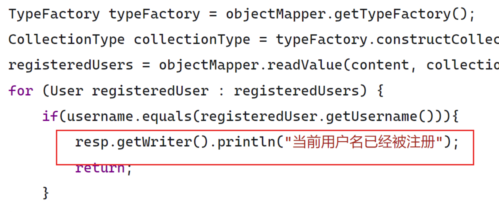
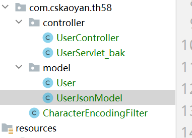
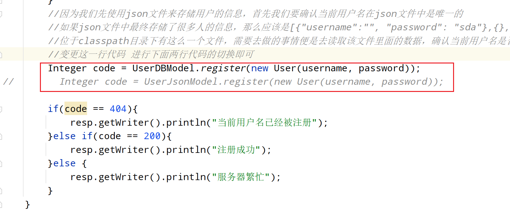
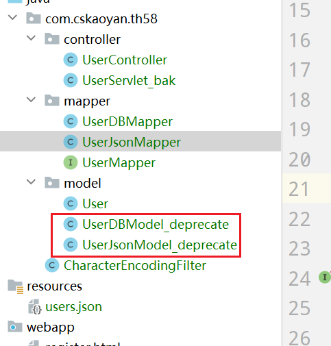
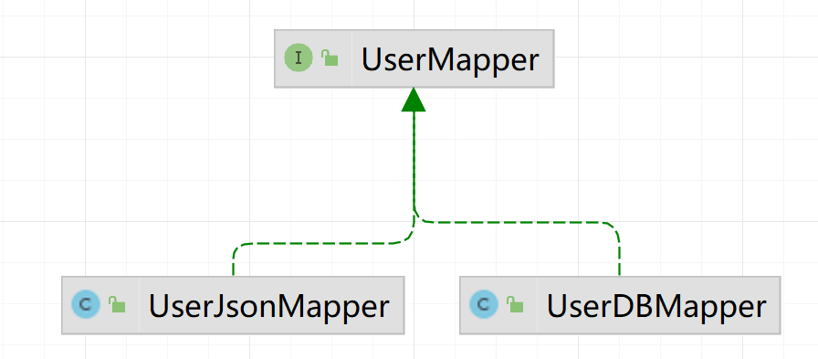
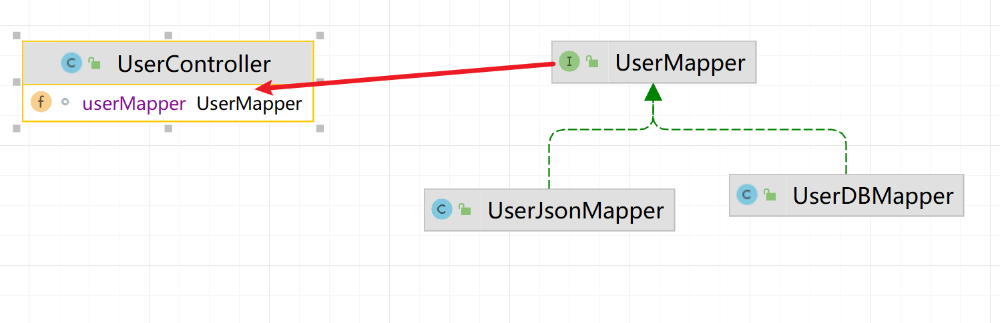

# Day18 MVC

## JSON

### 概念

JSON:JavaScript Object Notation.翻译成中文就是js里面的对象。JSON并不从属于js语言，很多编程语言都有针对json的解析器。

JSON主要使用场景是用于数据传输过程中特定的数据格式。

比如说前后端分离的情况下，前端使用的是js语言，后端使用的是java语言。二者之间需要进行通讯，应该传递什么类型的数据呢？

之前，主要使用xml文件来进行存储，后续主要使用json文件来进行存储。使用json主要的原因在于json更加的高效。

**综上所述：JSON是一个数据传输的格式。用于去指定传输的数据的格式类型。**

### 为什么学习JSON

之前也是有学过一个数据传输格式的，key=value&key=value，那为什么现在又学习json了呢？

json其实是js里面的对象。对象里面包含的属性是可以有嵌套关系的，那么便可以表示出数据和数据之间的关系。

比如目前进行商品的发布，有商品的信息，还有规格的信息，商品和规格之间是一对多的关系，那么如果此时使用key=value能否表示出数据和数据之间的关系呢？

此时在服务器端能否确定specName和unitPrice哪个组合是相互对应的

``` 
name=iphone15&description=newIphone&specName=蓝色&unitPrice=5888&specName=红色&unitPrice=6899
```

如果此时使用json呢，能否表示出数据和数据之间的关系呢？

{"name":"iphone14","description":"newIphone",specs:[{"specName":"蓝色","unitPrice":5888},{"specName":"红色","unitPrice":6899}]}

**综上所述：JSON可以理解为是对于key=value&key=value数据格式的一个额外补充，可以描述处数据和数据本身之间的关系，但是如果使用key=value&key=value，此时就具有很大的局限性，没法表示出数据和数据之间的关系。**


### JSON语法

**1.如果是一个对象，那么使用{}来表示**

**2.如果是一个数组或者集合，则使用[]来表示**

**3.属性使用key:value来表示，多个属性之间使用,来进行分割**


下面是使用Java语言来描述的一个类，利用类可以创建一个对象。

```java
public class Student1 {
    
    private String username;
    
    private String password;
}
```

在js中，如何定义一个对象呢？也就是写一个json

```javasc
var student = {username:"admin13",password:"admin123445"}
```


如果使用java语言来描述一个类，该类的内部进一步持有了另外一个对象

```java
public class Student2 {
    
    private String username;
    
    private String password;
    
    //持有了一个爱好
    private Hobby hobby;
}

public class Hobby {

    private String name;

    private String description;
}

```

如果我们使用js来表示上述的关系，应该如何描述呢？

```js
var student2 = {username:"admin123",password:"admin1231",hobby:{name:"swim",description:"adads"}}
```


如果一个对象的内部持有了一个对象的集合，使用java语言按照下面的方式来进行描述

```java
public class Student3 {
    
    private String username;
    
    private String password;
    
    private List<Hobby> hobbyList;
}
```

如果使用js语言应该怎么描述呢？

```js
var student3 = {usernmae:"admin123", password:"admin1221323", hobbyList:[{name:"",description:""},{}]}
```


其中，上述关于json一共有两种写法，一种是：

```
var student3 = {usernmae:"admin123", password:"admin1221323", hobbyList:[{name:"",description:""},{}]}
```

另外一种是

```
{"name":"iphone14","description":"newIphone",specs:[{"specName":"蓝色","unitPrice":5888},{"specName":"红色","unitPrice":6899}]}
```

二者之间的区别，可以理解为是对象和对象的toString打印的结果。上述两种形式分别称之为**json对象**以及**json字符串**。

**我们在数据传输过程中，使用的是json字符串**。


### JSON使用场景

今后在没有特殊说明的情况下，我们指的json都是指的是json字符串。

json的使用场景主要是用于前后端分离的场景下。主要是两个场景：

1.页面中用户输入的数据，需要以json字符串的形式提交给服务端，对应服务端来说，我们需要做的事情便是接收传递过来的json字符串，进一步将其转换成java对象，进行后续的处理


2.页面中需要的数据来自于后端，后端使用java语言来实现的，后端查询得到的java对象需要转换成json字符串，再次响应给客户端


### Java语言中操作json

```java
public class JsonTest {

    @Test
    public void test1(){
        Student1 student1 = new Student1();
        student1.setPassword("admin123");
        student1.setUsername("admin");

        //把student对象转换成json字符串
        //使用一些json校验网站校验json格式是否合理
        String jsonStr = "{\"username\":\"" + student1.getUsername() + "\",\"password\":\"" + student1.getPassword() + "\"}";
        System.out.println(jsonStr);
    }

    //自己进行json字符串和java对象的想换转换工作，其实非常的麻烦，可以使用一些专业化的工具来实现
    //常用的json解析类库：gson（google的json解析工具）、jackson（spring框架默认的json解析工具）、fastjson（alibaba的json解析工具）
    //将使用jackson来进行json字符串和java对象之间的相互转换工作

    @Test
    public void test2() throws JsonProcessingException {
        Student1 student1 = new Student1();
        student1.setPassword("admin123");
        student1.setUsername("admin");

        ObjectMapper objectMapper = new ObjectMapper();
        //可以把一个java对象转换成json字符串
        String s = objectMapper.writeValueAsString(student1);
        System.out.println(s);
    }

    @Test
    public void test3() throws JsonProcessingException {
        Student1 student1 = new Student1();
        student1.setPassword("admin123");
        student1.setUsername("admin");

        Student1 student2 = new Student1();
        student2.setPassword("admin12213");
        student2.setUsername("jjjjjj");


        //如果是List<Student>类型呢？
        List<Student1> list = new ArrayList<>();
        list.add(student1);
        list.add(student2);

        ObjectMapper objectMapper = new ObjectMapper();
        //可以把一个java对象转换成json字符串
        // [{"username":"admin","password":"admin123"},{"username":"jjjjjj","password":"admin12213"}]
        String s = objectMapper.writeValueAsString(list);
        System.out.println(s);
    }

    //反方向：json字符串转换成java对象
    @Test
    public void test4() throws JsonProcessingException {
        String jsonStr = "{\"username\":\"admin\",\"password\":\"admin123\"}";

        ObjectMapper objectMapper = new ObjectMapper();
        Student1 student1 = objectMapper.readValue(jsonStr, Student1.class);
        System.out.println(student1);
    }

    @Test
    public void test5() throws JsonProcessingException {
        String jsonStr = "[{\"username\":\"admin\",\"password\":\"admin123\"},{\"username\":\"jjjjjj\",\"password\":\"admin12213\"}]";
        ObjectMapper objectMapper = new ObjectMapper();
//        List list = objectMapper.readValue(jsonStr, List.class);
        //构建一个复杂的类型
        TypeFactory typeFactory = objectMapper.getTypeFactory();
        //里面需要传递两个参数：构造一个集合的类型，集合用什么来充当，集合内部的元素是什么元素，也就是泛型的部分
        CollectionType collectionType = typeFactory.constructCollectionType(List.class, Student1.class);
        List<Student1> student1List = objectMapper.readValue(jsonStr, collectionType);
        for (Student1 student1 : student1List) {
            System.out.println(student1);
        }
    }
}
```


## MVC

是一个设计模式。编程经验的总结。如何编写代码，能够使得程序更加的稳健、更加的高效。

其实就是一个代码经验的总结。

先不去介绍MVC的概念，先去写一个案例：

要求大家去实现一个注册登录案例，最开始时，要求大家使用json文件来存储用户的数据；后续进行需求的变更切换，切换到使用数据库，大家需要思考一个问题，代码究竟应该如何设计，能够让程序业务切换时，所做的改动尽可能小。

```java
@WebServlet("/user/*")
public class UserServlet extends HttpServlet {

    @Override
    protected void doPost(HttpServletRequest req, HttpServletResponse resp) throws ServletException, IOException {
        //首先先进行方法的分发
        String requestURI = req.getRequestURI();
        String op = requestURI.replace(req.getContextPath() + "/user/", "");
        if("register".equals(op)){
            register(req, resp);
        }else if("login".equals(op)){
            login(req, resp);
        }
    }

    private void login(HttpServletRequest req, HttpServletResponse resp) {

    }

    //注册的业务逻辑：
    //接收用户提交过来的请求参数信息，进行校验，保障用户信息的唯一性，存储到系统中，给用户返回回执信息
    private void register(HttpServletRequest req, HttpServletResponse resp) throws IOException {
        //接收用户提交过来的请求参数信息：还是使用的是form表单，依然是key=value&key=value
        String username = req.getParameter("username");
        String password = req.getParameter("password");
        String confirmPass = req.getParameter("confirmPass");
        //保障数据都不为空
        if(StringUtils.isEmpty(username)){
            resp.getWriter().println("用户名不能为空");
            return;
        }
        if(StringUtils.isEmpty(password)){
            resp.getWriter().println("密码不能为空");
            return;
        }
        if(StringUtils.isEmpty(confirmPass)){
            resp.getWriter().println("确认密码不能为空");
            return;
        }
        //确认密码和确认密码一致
        if(!password.equals(confirmPass)){
            resp.getWriter().println("两次密码不一致");
            return;
        }
        //因为我们先使用json文件来存储用户的信息，首先我们要确认当前用户名在json文件中是唯一的
        //如果json文件中最终存储了很多人的信息，那么应该是[{"username":"", "password": "sda"},{},{}]------》 List<User>
        //位于classpath目录下有这么一个文件，需要去做的事情便是去读取该文件里面的数据，确认当前用户名是否唯一
        String path = UserServlet.class.getClassLoader().getResource("users.json").getPath();
        BufferedReader bufferedReader = new BufferedReader(new FileReader(path));
        String content = bufferedReader.readLine();
        ObjectMapper objectMapper = new ObjectMapper();
        List<User> registeredUsers = new ArrayList<>();
        //文件里面的数据存储的是用户的信息，应该是一个json字符串，但是要考虑到文件为空的情况
        if(!StringUtils.isEmpty(content)){
            //不为空-----说明有人注册过程
            TypeFactory typeFactory = objectMapper.getTypeFactory();
            CollectionType collectionType = typeFactory.constructCollectionType(List.class, User.class);
            registeredUsers = objectMapper.readValue(content, collectionType);
            for (User registeredUser : registeredUsers) {
                if(username.equals(registeredUser.getUsername())){
                    resp.getWriter().println("当前用户名已经被注册");
                    return;
                }
            }
        }
        registeredUsers.add(new User(username, password));
        //空，说明直接没有人注册过，直接注册即可，无需去做任何的校验判断

        //最后，把registeredUsers全量的数据写回到文件中
        FileWriter fileWriter = new FileWriter(path);
        fileWriter.write(objectMapper.writeValueAsString(registeredUsers));
        fileWriter.flush();
        fileWriter.close();
        resp.getWriter().println("注册成功");
    }

    @Override
    protected void doGet(HttpServletRequest req, HttpServletResponse resp) throws ServletException, IOException {

    }
}
```

上述案例，我们使用json文件来存储用户的注册数据。现在，我们进行需求的切换变更，要求大家使用数据库来完成上述功能，大家需要分析一下，哪些代码需要变动，哪些代码保持不变？

下图中所示的便是需要变动的代码，但是矩形中包含的部分缺又是不需要变动的部分。两部分代码此时紧密的耦合在一起。

如果我们需要进行需求的变更，切换，由于代码可能是由其他开发人员编写的，所以导致维护起来成本比较高。很容易出现问题。



我们究竟应该如何设计我们的业务代码，才能够更加的高效、稳健呢？

正式引出MVC的概念。MVC是一个设计模式，是一个代码设计经验的总结，借助于这个设计模式，可以让我们编写出非常高效的、稳健的代码。

MVC的全称叫做Model-View-Controller简写。也就是模型、视图、控制器的简写。

Model：数据模型和所以基于对这些数据模型的操作。在我们的当前案例中，**User**就是属于model模型的，对于user的操作，比如**注册、登录**等功能就是属于model的。

View：视图，通俗的来说，也就是页面，也就是响应给客户端的部分。

Controller：控制器的作用。控制器主要起的作用是用于接触Model和View之间的耦合，起着松散耦合的作用。**请求到达Controller之后，Controller负责去调用模型的代码，根据模型的代码返回结果，调用不同的视图**。其实我们此时编写的Servlet充当的便是Controller的功能。



通过下图可以看到，此时模型和视图的代码是紧密耦合在一起的，一个变动，势必会对另外一个产生影响。




### 第一次代码改造



将Servlet进行改名，放入controller包中

将user放入model包中，同时将之前的注册的代码逻辑封装在一个叫做UserJsonModel的类中


```java
@WebServlet("/user/*")
public class UserController extends HttpServlet {

    @Override
    protected void doPost(HttpServletRequest req, HttpServletResponse resp) throws ServletException, IOException {
        //首先先进行方法的分发
        String requestURI = req.getRequestURI();
        String op = requestURI.replace(req.getContextPath() + "/user/", "");
        if("register".equals(op)){
            register(req, resp);
        }else if("login".equals(op)){
            login(req, resp);
        }
    }

    private void login(HttpServletRequest req, HttpServletResponse resp) {

    }

    //注册的业务逻辑：
    //接收用户提交过来的请求参数信息，进行校验，保障用户信息的唯一性，存储到系统中，给用户返回回执信息
    private void register(HttpServletRequest req, HttpServletResponse resp) throws IOException {
        //接收用户提交过来的请求参数信息：还是使用的是form表单，依然是key=value&key=value
        String username = req.getParameter("username");
        String password = req.getParameter("password");
        String confirmPass = req.getParameter("confirmPass");
        //保障数据都不为空
        if(StringUtils.isEmpty(username)){
            resp.getWriter().println("用户名不能为空");
            return;
        }
        if(StringUtils.isEmpty(password)){
            resp.getWriter().println("密码不能为空");
            return;
        }
        if(StringUtils.isEmpty(confirmPass)){
            resp.getWriter().println("确认密码不能为空");
            return;
        }
        //确认密码和确认密码一致
        if(!password.equals(confirmPass)){
            resp.getWriter().println("两次密码不一致");
            return;
        }
        //因为我们先使用json文件来存储用户的信息，首先我们要确认当前用户名在json文件中是唯一的
        //如果json文件中最终存储了很多人的信息，那么应该是[{"username":"", "password": "sda"},{},{}]------》 List<User>
        //位于classpath目录下有这么一个文件，需要去做的事情便是去读取该文件里面的数据，确认当前用户名是否唯一
        Integer code = UserJsonModel.register(new User(username, password));

        if(code == 404){
            resp.getWriter().println("当前用户名已经被注册");
        }else if(code == 200){
            resp.getWriter().println("注册成功");
        }else {
            resp.getWriter().println("服务器繁忙");
        }
    }

    @Override
    protected void doGet(HttpServletRequest req, HttpServletResponse resp) throws ServletException, IOException {

    }
}
```

```java
public class UserJsonModel {

    //制定了三个状态码：200表示注册成功；404表示用户名已经被占用；500表示服务器繁忙
    public static Integer register(User user){
        String path = UserController.class.getClassLoader().getResource("users.json").getPath();
        BufferedReader bufferedReader = null;
        try {
            bufferedReader = new BufferedReader(new FileReader(path));
            String content = bufferedReader.readLine();
            ObjectMapper objectMapper = new ObjectMapper();
            List<User> registeredUsers = new ArrayList<>();
            //文件里面的数据存储的是用户的信息，应该是一个json字符串，但是要考虑到文件为空的情况
            if(!StringUtils.isEmpty(content)){
                //不为空-----说明有人注册过程
                TypeFactory typeFactory = objectMapper.getTypeFactory();
                CollectionType collectionType = typeFactory.constructCollectionType(List.class, User.class);
                registeredUsers = objectMapper.readValue(content, collectionType);
                for (User registeredUser : registeredUsers) {
                    if(user.getUsername().equals(registeredUser.getUsername())){
                        return 404;
                    }
                }
            }
            registeredUsers.add(user);
            //空，说明直接没有人注册过，直接注册即可，无需去做任何的校验判断

            //最后，把registeredUsers全量的数据写回到文件中
            FileWriter fileWriter = new FileWriter(path);
            fileWriter.write(objectMapper.writeValueAsString(registeredUsers));
            fileWriter.flush();
            fileWriter.close();
            return 200;
        } catch (Exception e) {

        }
        return 500;
    }
}
```

此时，我们编写的代码就已经符合MVC设计模式思想了，那么有没有可以进一步优化的空间呢？

大家思考一下：如果今后我需要使用数据库了，那么此时应该怎么办？



只需要切换这两行代码即可。这么去做有没有问题？

其实我们肯定是希望今后去扩展新的功能时，代码的改动尽可能少，或者做到和前面的兼容性，所以，我们希望如果使用DBModel时，那么也应该具有如下特性：

1.注册方法名称也叫做register

2.方法的形参都叫做User类型

3.方法的返回结果都是Integer类型，不可以一个是Integer，一个是boolean类型

**如果具备了上述三个要求，那么今后只需要去修改类名即可。但是上述三点其实就是接口的特性**。

所以第二次改造，我们将会把Model设计成接口，不同的类实现该接口。

### 第二次代码改造

将Model设计成接口，JsonModel和DBModel分别实现该接口，又由于他们是数据操作相关的功能，所以也可以进一步改名叫做Dao(Data Access Object).所以这两个类可以进一步改名为JsonDao和DBDao，或者你叫做JsonMapper和DBMapper也可以。(这里面的mapper就是mybatis里面提到的mapper)



上图中的DBModel和JsonModel需要进行改名操作，改成Mapper；按理来说，这俩文件应该不存在了，为了方便大家追踪， 保留了下来。需要新建一个新的包mapper，设计一个接口UserMapper，这两个类需要实现UserMapper接口。



```java
@WebServlet("/user/*")
public class UserController extends HttpServlet {

    //思考一个问题：如果注册时候使用的是json文件，那么登录的时候也应该要使用json文件
    //那么是否意味着下面的这一个接口指向之类实现，可以写成成员变量
    //写成成员变量之后，那么方法内部还有没有需要变更的部分？？？？？？？？
    UserMapper userMapper = new UserJsonMapper();


    @Override
    protected void doPost(HttpServletRequest req, HttpServletResponse resp) throws ServletException, IOException {
        //首先先进行方法的分发
        String requestURI = req.getRequestURI();
        String op = requestURI.replace(req.getContextPath() + "/user/", "");
        if("register".equals(op)){
            register(req, resp);
        }else if("login".equals(op)){
            login(req, resp);
        }
    }

    private void login(HttpServletRequest req, HttpServletResponse resp) {
        //UserMapper userMapper = new UserJsonMapper();
    }

    //注册的业务逻辑：
    //接收用户提交过来的请求参数信息，进行校验，保障用户信息的唯一性，存储到系统中，给用户返回回执信息
    private void register(HttpServletRequest req, HttpServletResponse resp) throws IOException {
        //接收用户提交过来的请求参数信息：还是使用的是form表单，依然是key=value&key=value
        String username = req.getParameter("username");
        String password = req.getParameter("password");
        String confirmPass = req.getParameter("confirmPass");
        //保障数据都不为空
        if(StringUtils.isEmpty(username)){
            resp.getWriter().println("用户名不能为空");
            return;
        }
        if(StringUtils.isEmpty(password)){
            resp.getWriter().println("密码不能为空");
            return;
        }
        if(StringUtils.isEmpty(confirmPass)){
            resp.getWriter().println("确认密码不能为空");
            return;
        }
        //确认密码和确认密码一致
        if(!password.equals(confirmPass)){
            resp.getWriter().println("两次密码不一致");
            return;
        }
        //因为我们先使用json文件来存储用户的信息，首先我们要确认当前用户名在json文件中是唯一的
        //如果json文件中最终存储了很多人的信息，那么应该是[{"username":"", "password": "sda"},{},{}]------》 List<User>
        //位于classpath目录下有这么一个文件，需要去做的事情便是去读取该文件里面的数据，确认当前用户名是否唯一
        //变更这一行代码 进行下面两行代码的切换即可

        Integer code = userMapper.register(new User(username, password));

//        Integer code = UserDBModel_deprecate.register(new User(username, password));
//        Integer code = UserJsonModel.register(new User(username, password));

        if(code == 404){
            resp.getWriter().println("当前用户名已经被注册");
        }else if(code == 200){
            resp.getWriter().println("注册成功");
        }else {
            resp.getWriter().println("服务器繁忙");
        }
    }

    @Override
    protected void doGet(HttpServletRequest req, HttpServletResponse resp) throws ServletException, IOException {

    }
}
```




