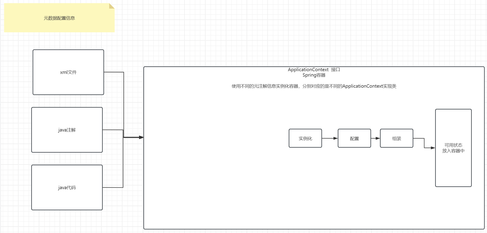

# Day25 SpringIoC

## 介绍

Spring的核心特性之一便是IoC或者说是DI，翻译成中文便是控制反转(依赖注入).这是同一个功能的两种不同角度的称呼。

控制反转：何为控制，何为反转？？？控制其实就是指的是对于某个对象的创建控制权，也就是说对象是由开发人员自主去创建的。反转指的什么意思呢？指的是这个权利由由开发人员转交给Spring框架。通俗的来说，就是将对象的创建过程交给Spring去创建。

依赖注入：使用这个对象时，我们只需要从Spring中获取即可。比如说之前项目一种，我们编写的Controller中持有一个Service的引用。

```java
public class GoodsController extends HttpServlet{
    
    private GoodsService goodsService = new GooodsServiceImpl();
}
```

首先，这里面是开发人员自己去创建一个GoodsService实现类对象，如果在其他功能模块中，我也需要使用当前的Service，怎么办？只能够再创建一个。但是，思考一个问题：必须得再创建吗？用同一个不行吗？可以的，但是在项目一中不太好实现。

再次，上述的代码也就是Controller层其实是和Service层之间是有耦合的。耦合的代码便是接口指向子类实现。如果今后Service实现类变更，那么controller也需要同步发生修改。那么能不能做到service实现类变更的同时，controller不需要做任何的改动呢？可以的。今后借助于Spring，可以实现如下的效果。

```java
public class GoodsController extends HttpServlet{
    
    private GoodsService goodsService;
}
```


> 这一点其实和tomcat服务器中的Servlet有些类似，但是比Servlet要高级的多，为什么呢？因为tomcat中的Servlet其实并不是完全只能够由tomcat来创建，我们依然可以自主去创建Serlvet对象。并且tomcat也并没有对于Servlet对象做进一步的处理。

Spring的核心特性之二便是AOP，AOP需要借助于Spring的IoC的功能。简单解释便是面向切面编程。其实就是我们之前的写的代理的进一步优化简化。后续，学完了Spring之后，我们希望保障事务，只需要添加一个注解即可。


关于IoC或者DI，其实底层原理便是Spring内部有一个容器(map)，Spring帮助开发人员去创建好实例对象(IoC)，并且把这些对象放入到Spirng容器中。后续使用的时候，直接从容器中取出来即可(DI).


## 入门案例

关于入门案例，我们使用xml来介绍，但是只是一个过渡，后续我们基本不会再去使用xml形式。目前主要流行的方式是java代码去配置。注解、java配置类的形式。

> 我们今天需要解决的事情就是把对象的创建工作交给Spring来进行，把创建好的对象放入到Spring容器中。



1.导包

```xml
<dependencies>
        <dependency>
            <groupId>org.springframework</groupId>
            <artifactId>spring-context</artifactId>
            <version>5.3.30</version>
        </dependency>

        <dependency>
            <groupId>junit</groupId>
            <artifactId>junit</artifactId>
            <version>4.12</version>
            <scope>test</scope>
        </dependency>
    </dependencies>
```


2.在resources目录下新建app.xml文件，编写如下内容：

```xml
<?xml version="1.0" encoding="UTF-8"?>
<beans xmlns="http://www.springframework.org/schema/beans"
       xmlns:xsi="http://www.w3.org/2001/XMLSchema-instance"
       xsi:schemaLocation="http://www.springframework.org/schema/beans http://www.springframework.org/schema/beans/spring-beans.xsd">
    
    <!--放入spring容器中的对象称之为bean；id是指的是放入容器中的对象的编号；class是其全限定类名-->
    <bean id="userService" class="com.cskaoyan.th58.service.UserServiceImpl"/>

    <bean id="userMapper" class="com.cskaoyan.th58.mapper.UserMapperImpl"/>
    
</beans>
```


3.编写单元测试用例，编写如下测试代码：

```java
public class SpringTest {

    @Test
    public void test1(){
        //1.使用Spring容器去管理对象，前提是需要有一个Spring容器
        //Spring容器在spring框架中是由ApplicationContext来充当的.ApplicationContext是一个接口，具体的子类实现我们此处选择的是读取xml来实例化容器
        //输入一个位于classpath目录下xml文件的信息
        ApplicationContext context = new ClassPathXmlApplicationContext("app.xml");

        //Spring会帮助我们去创建对应的实例对象，并且放入到spring容器中

        //只需要利用容器的方法来获取位于容器中的组件对象即可
        //key值是什么呢？就是刚刚注册的时候设置的编号，编号要求唯一
        UserService userService = (UserService) context.getBean("userService");
        UserMapper userMapper = (UserMapper) context.getBean("userMapper");
        System.out.println(userService);
        System.out.println(userMapper);
    }
}
```


但是在上述案例中，其实对象和对象之间没有产生关联。需要进一步做如下设置：

```java
public class UserServiceImpl implements UserService{

    //希望从Spring容器中奖当前service实现类取出来的时候，mapper是有值的，不是null
    UserMapper userMapper;

    //如果希望spring帮助我们进行注入，那么需要提供一个set方法，暂时需要，后续学完注解之后就不再需要了
    public void setUserMapper(UserMapper userMapper) {
        this.userMapper = userMapper;
    }

}
```


```xml
<?xml version="1.0" encoding="UTF-8"?>
<beans xmlns="http://www.springframework.org/schema/beans"
       xmlns:xsi="http://www.w3.org/2001/XMLSchema-instance"
       xsi:schemaLocation="http://www.springframework.org/schema/beans http://www.springframework.org/schema/beans/spring-beans.xsd">

    <!--放入spring容器中的对象称之为bean；id是指的是放入容器中的对象的编号；class是其全限定类名-->
    <bean id="userService" class="com.cskaoyan.th58.service.UserServiceImpl">
        <!--第一个name里面的值指的是成员变量的名称；第二个ref指的是bean的id-->
        <property name="userMapper" ref="userMapper1"/>
    </bean>

    <bean id="userMapper1" class="com.cskaoyan.th58.mapper.UserMapperImpl"/>

</beans>
```


## 实例化Bean

### 构造函数

虽然Spring会借助于反射来创建出Bean对象，其实本质上来说依然是要借助于构造函数，绝大多数的情况下，使用的是无参构造函数。

### 静态工厂以及实例工厂

关于在xml文件中使用构造函数、静态工厂、实例工厂创建bean对象的方式了解即可，知道有这么一回事即可，后续基本不会用到，因为后面基本都会使用基于注解、配置类的方式。


### FactoryBean(掌握)

其中，有一种方式，是基于FactoryBean的方式，需要大家重点关注、重点掌握。

如果某个类实现了FactoryBean接口，那么直接利用其编号取出来的并不是该对象本身，而是getObject()返回值结果。

比如：

利用DBFactoryBean的编号，从容器中获取，其实并不能够获取DBFactoryBean对象，而是获取的是getObject()返回值，也就是db。

```java
public class DBFactoryBean implements FactoryBean{
    
    public Object getObject(){
        return db;
    }
}
```

配置：

```xml
    <bean id="userfb" class="com.cskaoyan.th58.factorBean.UserFactorBean"/>

```

代码：

```java
public class UserFactorBean implements FactoryBean<User> {
    @Override
    public User getObject() throws Exception {
        return new User();
    }

    @Override
    public Class<?> getObjectType() {
        return User.class;
    }
}
```

单元测试：

```java
@Test
    public void test2(){
        ApplicationContext context = new ClassPathXmlApplicationContext("app.xml");
        //思考：类型究竟是什么类型？？？？是UserFactoryBean类型还是User类型？？？？？？User类型
        Object userfb = context.getBean("userfb");
        System.out.println(userfb);
    }
```

最终，我们利用编号取出来的却是User，而不是UserFactoryBean。

> 使用场景：
>
> 后续mybatis整合Spring需要导入一个jar包，叫做mybatis-spring jar包，里面有一个类叫做SqlSessionFactoryBean。
>
> 


## 组件注册方式

> 把一个大象放入冰箱需要几步？？？打开冰箱、放入大象、关上冰箱。
>
> 把一个对象放入spring容器中需要几步？？？需要创建对象，创建好的对象放入到spring容器中，但是其实在开发过程中，这两步基本是一起的。

### xml文件

也就是入门案例中，我们给大家介绍的这种方式。后续使用的场景不是特别多了，只是入门案例起到一个过渡作用即可。


### 配置类  + @Bean注解方式(掌握)

在前面的课程中，我们提及过ApplicationContext可以通过读取xml文件，也可以通过读取配置类、注解的方式来实例化Spring容器。这种方式是后续开发过程中使用的比较多的使用场景。

操作步骤：

1.新建一个config包，新建一个配置类，标注@Configuration注解，声明其是一个配置类

2.在配置类中去编写一个一个的方法，方法的要求如下：

原理：凡是配置类中标注了@Bean注解的方法，那么Spring会依次去扫描，依次去运行，得到一个实例对象，把该实例对象放入到spring容器中。

> 之前不是说，使用spring之后，不需要自己再去new对象了吗？为什么此处还是自己去new？？？？
>
> 不是说使用spring之后，绝对不会去使用new关键字，而是该对象有没有交给spring去管理维护。

- 编写一个方法，方法的修饰符要求是public
- 方法的返回值类型便是注册到Spring容器中的组件类型，一般建议使用父接口类型来接收
- 方法的名称便是注册到Spring容器中该组件的编号
- **如果需要注入依赖，那么使用@Bean注解的话非常简单：直接在方法的形参中编写你需要从容器中取出来的组件的类型，Spring容器便会自动从容器中取出对应的类型的组件。**

如果不需要维护对象和对象之间的依赖关系，那么下面的写法就ok了

```java
@Configuration
public class SpringConfig {

    //你希望向spring容器中去注册哪个组件，那么便编写哪个对象的创建语句
    @Bean
    public UserService userService(){
        UserServiceImpl userService = new UserServiceImpl();
        //userService.setUserMapper();
        return userService;
    }

    @Bean
    public OrderService orderService(){
        OrderServiceImpl orderService = new OrderServiceImpl();
       // orderService.setUserMapper();
        return orderService;
    }

    @Bean
    public UserMapper userMapper(){
        UserMapper userMapper = new UserMapperImpl();
        return userMapper;
    }
}
```

但是如果需要维护对象和对象之间的关系：

```java
//声明其是一个配置类
@Configuration
public class SpringConfig {

    //你希望向spring容器中去注册哪个组件，那么便编写哪个对象的创建语句
    @Bean
    public UserService userService(UserMapper userMapper){
        UserServiceImpl userService = new UserServiceImpl();
        //service实现类需要提供set方法即可
        userService.setUserMapper(userMapper);
        return userService;
    }

    //Spring处理过程：1.根据方法的返回值类型，得知最终注入到Spring容器中的是OrderService类型的对象
    //2.方法的名称叫做orderService，所以注册到spring容器中的对象的编号为orderService
    //3.方法的形参列表有一个叫做UserMapper，所以spring会扫描容器，从容器中取出一个UserMapper实例对象，在调用当前方法时传递进来
    @Bean
    public OrderService orderService(UserMapper userMapper){
        OrderServiceImpl orderService = new OrderServiceImpl();
        orderService.setUserMapper(userMapper);
        return orderService;
    }

    @Bean
    public UserMapper userMapper(){
        UserMapper userMapper = new UserMapperImpl();
        return userMapper;
    }
}
```

使用场景：

主要用在整合第三方框架时，把第三方框架里面的类库放入到spring容器中。


> 关于注解、反射的补充
>
> 注解可以有功能，也可以没有功能，和注释一样的效果。完全取决于开发人员有没有去编写代码去处理这个注解。
>
> 如果编译之后的class文件在运行时，依然存在该注解，那么利用Class对象(Class对象就是用来去记录每个class文件的信息的)是可以获取该注解的信息的。
>
> 如果某个class文件的类头上、方法的头上标注了某个注解，那么都会体现在Class对象里面。
>
> Class对象也可以扫描所有的方法，去查看某个方法上面有没有标注该注解
>

如果希望从容器中获取指定的对象，可以使用@Qualifier

```java
//声明其是一个配置类
@Configuration
public class SpringConfig {

    //你希望向spring容器中去注册哪个组件，那么便编写哪个对象的创建语句
    @Bean
    public UserService userService(UserMapper userMapper){
        UserServiceImpl userService = new UserServiceImpl();
        userService.setUserMapper(userMapper);
        return userService;
    }

    //Spring处理过程：1.根据方法的返回值类型，得知最终注入到Spring容器中的是OrderService类型的对象
    //2.方法的名称叫做orderService，所以注册到spring容器中的对象的编号为orderService
    //3.方法的形参列表有一个叫做UserMapper，所以spring会扫描容器，从容器中取出一个UserMapper实例对象，在调用当前方法时传递进来

    //如果某个类型的实例对象有多个的话，并且希望指定从容器中获取对应的实例对象，那么可以使用Qualifier注解即可，里面写上bean编号即可
    @Bean
    public OrderService orderService(@Qualifier("userMapper2") UserMapper userMapper){
        OrderServiceImpl orderService = new OrderServiceImpl();
        orderService.setUserMapper(userMapper);
        return orderService;
    }

    @Bean
    public UserMapper userMapper(){
        UserMapper userMapper = new UserMapperImpl();
        return userMapper;
    }

    @Bean
    public UserMapper userMapper2(){
        UserMapper userMapper = new UserMapperImpl2();
        return userMapper;
    }
}
```


### 配置类 + @ComponentScan注解(掌握)

1.编写一个配置类，标注@Configuration注解

2.配置类还需要标注一个注解@ComponentScan注解，设定扫描的包目录

> 关于组件，如何理解？？？？就是对象，就是java里面的bean对象，这里面称之为组件主要原因在于它具有特殊的功能，比如MVC设计模式中以及三层架构中出现的对象，比如Controller、Service、Mapper等，是不是对象？？是，只不过它具有特殊的功能含义，所以我们也称之为组件


```java
/**
 * @Author 远志 zhangsong@cskaoyan.onaliyun.com
 * @Date 2024/5/13 9:57
 * @Version 1.0
 */
//首先声明它是一个配置类
    //添加一个@ComponentScan注解：设定扫描的包目录(可以递归的方式扫描到所有的类，那么哪些需要放入到spring容器中呢)，需要放入到Spring容器中的组件对象设定对应的注解即可
    //我们需要将那些需要放入到spring容器中的类头上标注@Component注解，凡是标注了该注解，那么便会被spring所处理，因为spring得知所有类的全限定类名，根据标注了该注解，通过反射实例化对象，放入spring容器中
    //关于@Component注解有一个额外的说明：为了能够很形象地表示出这些组件的功能定位，spring额外制定了一系列的其他注解，比如@Controller、@Service、@Repository注解，这几个注解其实就是对应的是三层架构中的三个组件
    //使用上述三个注解和@Component注解的功能完全等价；不在三层架构组件中的对象，直接标注@Component即可
    //使用这种方式，如何将对象和对象之间产生关联呢？需要使用一个叫做@Autowired注解，表示的是从容器中获取指定类型的对象
    //如果符合同一个类型的实例对象有多个，那么使用@Qualifier(id)，这种方式注册的组件的编号是什么呢？类名的首字母小写
@Configuration
@ComponentScan("com.cskaoyan.th58")
public class SpringConfig {
}
```


```java
@Service
public class OrderServiceImpl implements OrderService{

    @Autowired
    @Qualifier("userMapperImpl2")
    UserMapper userMapper;

    //下面这种方式其实有一些繁琐，我们可以将set方法省略，直接利用属性进行赋值

//    @Autowired
//    public void setUserMapper(@Qualifier("userMapperImpl2") UserMapper userMapper) {
//        this.userMapper = userMapper;
//    }
}

```

**使用场景：项目中编写的业务代码，使用的是这种方式。**


## 组件获取方式

说白了便是从spring容器中获取指定的实例对象。


### getBean方法

利用容器的getBean方法，可以从容器中获取指定类型的实例对象。

关于容器，我们前面提及的一个类叫做ApplicationContext，是一个接口，但是它并不是最顶层接口，向上还有一个BeanFactory接口，那么该接口其实也是容器的实现。

ApplicationContext继承自BeanFactory，BeanFactory其实就是最初的容器实现，ApplicationContext继承自它，又做了进一步的扩展。


所以，BeanFactory具有的功能，ApplicationContext都具有，并且ApplicationContext还具有一些额外的扩展功能。

问题：BeanFactory和FactoryBean之间有什么区别？？？

其实二者没什么关系。BeanFactory强调的是factory，其实指的是容器；FactoryBean强调的是bean，其实是一种创建对象的方式。

### 注解(掌握)

使用注解来获取容器中的组件对象。

最常用的注解便是**@Autowired注解**。背后的原理其实是spring会帮助我们在背后调用getBean方法，将获取到的组件对象，注入到当前的引用类型变量中。

除此之外，还有一个注解也可以使用**@Resource注解**。


## Spring整合Junit

如果我们希望在进行单元测试用例的时候，可以直接利用注解来获取指定的实例对象，那么需要做以下的配置：

0.导包。spring-test jar

1.添加@RunWith注解

2.添加@ContextConfiguration注解

3.直接使用@Autowired注解来获取指定类型的实例对象即可

```xml
<properties>
        <maven.compiler.source>17</maven.compiler.source>
        <maven.compiler.target>17</maven.compiler.target>
        <project.build.sourceEncoding>UTF-8</project.build.sourceEncoding>
        <spring.version>5.3.30</spring.version>
    </properties>

    <dependencies>
        <dependency>
            <groupId>org.springframework</groupId>
            <artifactId>spring-context</artifactId>
            <version>${spring.version}</version>
        </dependency>

        <dependency>
            <groupId>org.springframework</groupId>
            <artifactId>spring-test</artifactId>
            <version>${spring.version}</version>
        </dependency>
```

```java
//spring整合junit的环境所必须要处理的步骤
    //实例化容器
@RunWith(SpringJUnit4ClassRunner.class)
//用来进行读取配置类或者读取xml配置文件的，用于实例化容器
//@ContextConfiguration(classes = {SpringConfig.class})
//但是上述写法可以进一步优化，如果数组里面只有一个值，可以不用写大括号
@ContextConfiguration(classes = SpringConfig.class)
public class SpringTest2 {

    //如果希望在某个类中可以直接通过autowired来获取容器中的对象，那么当前类对象也必须要交给spring来进行管理
    @Autowired
    UserService userService;


    @Test
    public void test1(){
        System.out.println(userService);
    }
}
```

## 组件的生命周期

提及生命周期，前面的课程中，对于Serlvet有介绍过，指的是Servlet从创建到销毁的整个过程阶段会触发的事件。

对于组件的生命周期来说，也是差不多如此。

指的是一个配置的组件对象从创建一直到可以使用的状态，最终到被销毁整个这个阶段所触发的事件。

过程如下：

1.容器启动。

```java
ApplicationContext context = new ClassPathXmlApplicationContext(xml);

ApplicationContext context = new AnnotationConfigApplicationContext(配置类 class);
```

2.实例化Bean对象

主要是借助于反射来进行对象的实例化。反射所需要的信息可以从xml配置文件中获取，也可以从配置类中获取。IoC的体现。


3.设置对象的属性值

这一步其实主要就是在维护对象和对象之间的关系。DI主要就是在这一步体现的。


4.根据当前对象是否实现aware接口，去调用接口对应的方法

spring会根据当前bean对象是否实现了那三个aware接口，调用对应的方法。这个操作最大的意义是什么呢？

可以将容器的引用传递给当前的bean对象，所以容器的所有方法，在当前bean对象中都是可以使用到的。

关于第4步骤，我们开发过程中，其实用的并不是特别多，但是很多框架的内部可能会用到，所以你需要知道它在干什么即可。


5.BeanPostProcessor对bean对象进行处理

如果需要演示该功能，那么我们需要自己创建一个BeanPostProcessor来进行验证。**BeanPostProcessor的功能非常类似于拦截器的功能，会对所有创建出来的bean对象进行处理，处理过后才会放入到Spring容器中，所以便有了可以操作的空间。在处理之前是委托类对象，但是处理过后放入容器中的便是代理类对象。**

```java
/**
 * @Author 远志 zhangsong@cskaoyan.onaliyun.com
 * @Date 2024/5/13 14:39
 * @Version 1.0
 * beanPostProcessor的功能非常像filter的功能，可以针对创建出来的其他的bean对象进行前置和后置处理
 * 至于究竟应该吧代码逻辑写在前置还是后置中，取决于你的bean对象有没有init逻辑，如果有init逻辑，并且处理的逻辑也要求和init有关，那么必须得使用后置
 */
@Component
public class MyBeanPostProcessor implements BeanPostProcessor {

    //前置处理
    @Override
    public Object postProcessBeforeInitialization(Object bean, String beanName) throws BeansException {
        System.out.println(bean + "====" + beanName);
        //狸猫换太子，也就是说在进行前置处理之前呢，是委托类对象，经过处理之后变成了代理类对象，继续向后传递
        //这个便是AOP的理论基石
        return bean;
    }

    //后置处理
    @Override
    public Object postProcessAfterInitialization(Object bean, String beanName) throws BeansException {
        return bean;
    }
}
```


6.init阶段

类似于servlet的init方法。但是要比servlet的init要复杂一些。

会根据当前的bean对象是否实现了InitializingBean接口，调用对应的方法；或者实现了自定义的init方法，调用对应的自定义init方法，可以去做一些初始化的业务逻辑。

```java
@Component
public class LifeCycleBean implements InitializingBean {

    //需要用到userService的功能，如何引入userService呢？从容器中获取userService对象
   // @Autowired
    UserService userService;

    //在开发过程中，其实没必要这么去写，直接给属性写@Autowired即可，这里面只是为了给大家做一个演示，能够看到过程
    @Autowired
    public void setUserService(UserService userService) {
//        System.out.println("调用了setUserService设置属性值");
        this.userService = userService;
    }

    private ApplicationContext context;

    private BeanFactory beanFactory;

    private String beanName;

    public LifeCycleBean() {
//        System.out.println("调用了LifeCycleBean无参构造函数实例化对象");
    }


    //还有一种自定义init的方式，我们可以不用实现InitializingBean接口，只需要去实现自定义的init方法即可
    @Override
    public void afterPropertiesSet() throws Exception {
        System.out.println("Initializing Bean...初始化的业务逻辑");
    }
}

```


```java
@Component
public class LifeCycleBean2 {

    //需要用到userService的功能，如何引入userService呢？从容器中获取userService对象
   // @Autowired
    UserService userService;

    //在开发过程中，其实没必要这么去写，直接给属性写@Autowired即可，这里面只是为了给大家做一个演示，能够看到过程
    @Autowired
    public void setUserService(UserService userService) {
//        System.out.println("调用了setUserService设置属性值");
        this.userService = userService;
    }

    private ApplicationContext context;

    private BeanFactory beanFactory;

    private String beanName;

    public LifeCycleBean2() {
//        System.out.println("调用了LifeCycleBean无参构造函数实例化对象");
    }
    

    //还有一种自定义init的方式，我们可以不用实现InitializingBean接口，只需要去实现自定义的init方法即可
    //1.导包：javax.annotation  2.添加该注解  spring会帮助我们调用包含该注解的方法
    @PostConstruct
    public void myinit(){
        System.out.println("my init");
    }
}
```

init阶段完成之后，再次经过beanPostsProcessor后置处理，处理过后便放入到spring容器中，便是可使用的状态了。


## 案例

要求：将之前的mapper优化案例整合到spring中


