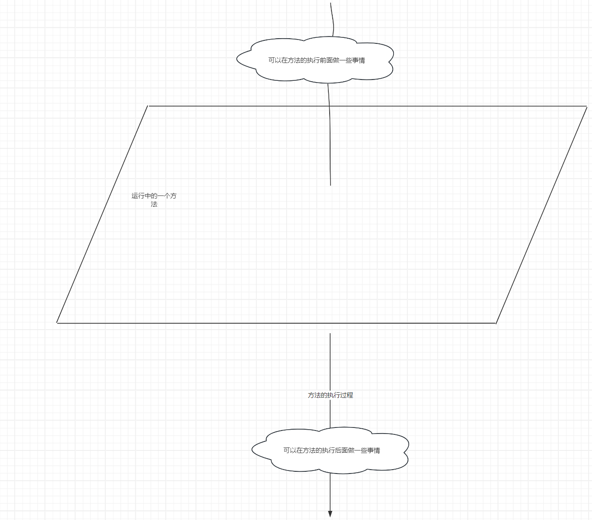
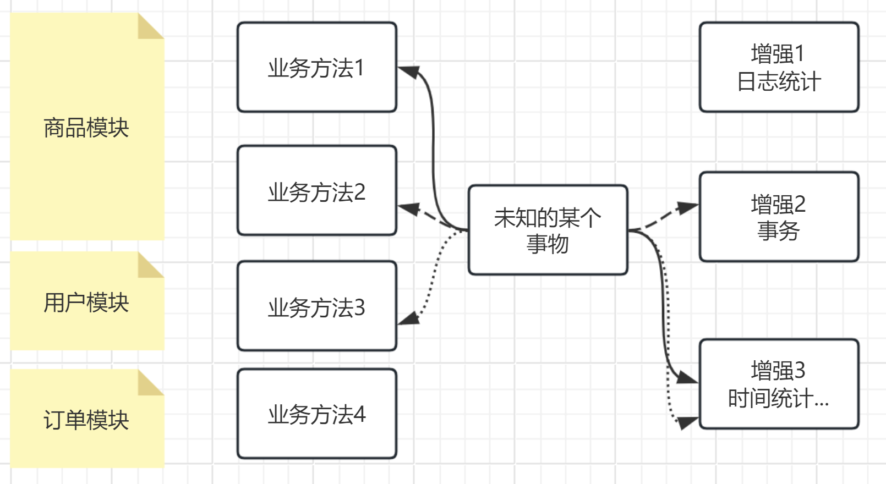
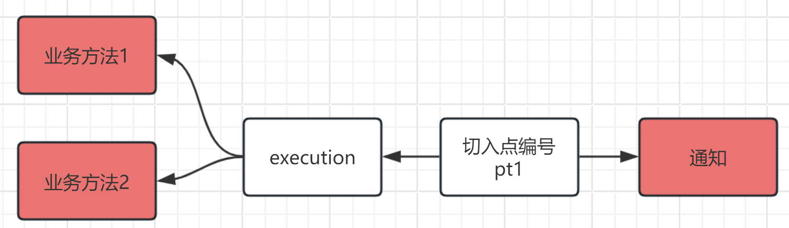

# Day26 Spring AOP

## 概念

AOP：Aspect Oriented Programing.面向切面编程。你可以理解为将一个运行中的方法看做时一个空间上的一个切面。在方法的执行前后做一些事情、增强，叫做面向切面编程。面向切面编程的侧重点侧重的就是一个运行中的方法。



## 为什么要学习AOP

其实通过前面的介绍，面向切面编程其实就类似于动态代理设计模式。为什么还需要去学习AOP呢？动态代理不好吗？

动态代理的出现，其实已经极大地简化了开发工作，但是在处理一些具体的事项上面，依然不是特别的完美。可以进一步的优化。哪些地方可以进一步优化？？？？？

需要增强的委托类的方法和需要增强的逻辑的关联上面不是特别的方便。

比如目前的method1需要具有增强1，method2需要具有增强2；但是后续随着开发工作的进行，那么这些增强的逻辑可能会有调整。假如目前生产环境遇到一个问题，那么我们需要新增一个日志打印功能，统计时间功能增强，但是这个增强逻辑只是暂时性地需要，后续一旦问题确认，那么该增强便不再需要了；或者说刚开始排查的时候，那么我们设定的范围应当是全业务代码，但是随着排查工作的进行，那么可能只需要去关联特定的业务逻辑即可。

针对前面的案例，我们的增强逻辑实际上是写在代理工具类中的，如果一个项目中，需要多个增强的逻辑，那么必须得在代理工具类中进行分发。随着业务逻辑的变更，分发的逻辑也是时钟需要变更的。下面这段代码，不同的增强分发逻辑是紧密的关联耦合在一起的，需要使用分发逻辑来进行分发。后续只要业务变更，那么我就需要再次进行修改。

```java
    public static Object getProxy(Object target){
        Class<?> targetClass = target.getClass();
        return Proxy.newProxyInstance(targetClass.getClassLoader(), targetClass.getInterfaces(), new InvocationHandler() {
            @Override
            public Object invoke(Object proxy, Method method, Object[] args) throws Throwable {

                //代理类对象的方法调用时，都会调用invocationHandler.invoke方法
                //所以我们需要做的事情便是进一步去调用委托类的方法
                String methodName = method.getName();
                if(methodName.equals("xxx")){
                    enhancer1();
                }else if(methodName.equals("yyy")){
                    enhancer2();
                }
            }
        });
    }

```

希望能够有一种非常理想、非常简单的方式：业务方法和增强逻辑是彼此单独存在的；如果希望业务方法1和增强1产生关联，那么直接在某处进行一个配置即可；如果今后不希望二者再关联一起，那么接触关联即可。



最终，我们希望业务和增强的关联方式可以实现上述的效果。他们如果需要关联在一起，进行配置即可；如果不需要关联在一起，直接接触关联即可。

**总结：AOP究竟要干什么？？？？？？AOP其实做的事情和动态代理做的事情是差不多的，只不过在动态代理的方案下，关于增强的分发逻辑有一些不太友好，如果后续业务逻辑变更，那么分发逻辑也需要同步去修改；改动还是比较大的**。


## AOP中的专业术语

Aspect：切面。切面是一个封装体。是切入点 + 通知组合在一起的封装形式，叫做切面。

切入点Pointcut：需要从哪个地方切入进来。关联哪个业务方法。使用某种技术来匹配某个连接点的过程。

通知Advice：就是增强。你需要做的何种增强，比如事务、日志、时间打印等等。

连接点Join Point：就是指的是一个一个的业务方法。

target object：委托类对象。

AOP Proxy：代理类对象。

织入Weaving：是一个过程，将连接点也通知关联在一起的过程称之为织入。

关于通知，在spring中有如下的通知形式：

前置通知：业务方法执行之前触发的增强逻辑

后置通知：业务方法执行之后触发的增强逻辑

环绕通知：业务方法的执行前后都会触发的增强逻辑

异常通知：业务方法执行产生异常时会触发得到逻辑

结果通知：业务方法正常执行完毕，返回的结果


## 入门案例(熟悉)

入门案例，我们将会介绍一种半自动的方式给大家入门。

使用半自动的AOP方式，需要向容器中去注册一个ProxyFactoryBean对象。

1.编写一个通知类，需要实现MethodInterceptor接口，实现里面的方法，里面的方法形参其实就是对于method.invoke的进一步封装调用;同时注册为Spring容器中的组件对象

```java
@Component
public class LogAdvice implements MethodInterceptor {
    @Override
    public Object invoke(MethodInvocation invocation) throws Throwable {

//        MethodInvocation你可以理解为就是对于动态代理设计模式中的method的进一步封装
        //下面这行代码就是对于method.invoke()又做了进一层的封装，原理和之前是完全等价的 委托类方法的调用
        System.out.println("log before");
        Object proceed = invocation.proceed();
        System.out.println("log after");
        return proceed;
    }
}
```


2.向容器中去注册ProxyFactoryBean对象，用于关联委托类对象和通知，产生代理类对象

```java
@Configuration
@ComponentScan("com.cskaoyan.th58")
public class SpringConfig {

    //写@Bean注解的方式
    //需要关注一下这类有没有实现FactoryBean接口，如果实现了该接口，那么直接取出来的并不是该对象本身，而是getObject方法的返回值
    //因为ProxyFactoryBean实现了FactoryBean接口，所以注册到容器中，利用编号取出来的是getObject返回值，通过查看方法说明可以得知，返回的是一个proxy代理类对象
    //现在我需要对GoodsServiceImpl进行增强，所以需要借助于ProxyFactoryBean对于GoodsServiceImpl进行处理，产生代理类对象
    @Bean
    public ProxyFactoryBean goodsServiceProxy(GoodsService goodsService){
        ProxyFactoryBean bean = new ProxyFactoryBean();
        //设置委托类 GoodsService
        bean.setTarget(goodsService);
        //通知：何种增强-----日志打印
        //这里面直接设置通知类的编号即可关联在一起，为什么？？？？
        //因为ProxyFactoryBean实现了FactoryBean接口，内部持有容器的引用，可以利用容器.getBean(id)来获取指定的对象
        bean.setInterceptorNames("logAdvice");
        return bean;
    }
}

```


3.直接从容器中取出代理类对象使用即可，需要使用@Qualifier注解

```jaVA
@RunWith(SpringJUnit4ClassRunner.class)
@ContextConfiguration(classes = SpringConfig.class)
public class AOPTest {

    @Autowired
    @Qualifier("goodsServiceProxy")
    GoodsService goodsService;

    @Test
    public void test1(){
        goodsService.addOne();
    }
}

```


```
NoUniqueBeanDefinitionException: No qualifying bean of type 'com.cskaoyan.th58.service.GoodsService' available:expected single matching bean but found 2: goodsServiceImpl,goodsServiceProxy
```

总结：比较一下半自动的方式相较于之前的动态代理有哪些改进，以及此时存在哪些不足之处？？？？

之前的动态代理，我们的不同的增强通知都是堆积在ProxyUtils工具类中的；耦合性有些高。

使用半自动的方式时，通知是一个一个单独彼此独立存在的；借助于ProxyFactoryBean对象，将委托类和通知关联在一起，产生代理类对象。

此时有哪些不足呢？？？？此时是将委托类对象和通知类对象产生关联，并不是将方法和通知方法产生关联，因为在一个类的内部，可能增强的逻辑也是不同的。


## AOP全自动

实际上，如果我们希望使用全自动的方式，那么需要借助于一个第三方的jar包类库aspectj框架。

aspectj提供的全自动的aop解决方案，一共有两种方案：

1.一种是基于advisor的方案，没有提供配置类的方式，所以我们就直接放弃。

2,另外一种是基于aspect的方案(课程介绍的是这种方案)

aspectj框架是可以实现业务方法和通知方法的关联的。这里面是如何产生关联的呢？

切入点提供了两种方案：

1.切入点表达式execution：相当于一套规则，利用这个规则去匹配对应的连接点方法。

2.自定义注解：编写一个自定义注解，只要连接点方法上面标注了该注解，那么便建立了联系。


### execution(掌握)

1.导包，导入aspectj依赖

2.编写一个切面类，标注@Component注解以及@Aspect注解

3.在当前切面类中编写一个方法，方法的修饰符public，返回值void，标注@Pointcut注解，里面设置value属性，value属性里面编写execution的语法

4.编写方法，方法修饰符public，返回值暂时没有要求，返回void即可，标注@Before等注解，表示的是前置通知；@Before注解里面需要填写value值，需要关联切入点的编号

5.配置类的头上标注@EnableAspectJAutoProxy注解，表示的是开启spring对于aspectj支持的开关。


```
execution(修饰符匹配? 返回值匹配 类路径匹配? 方法名匹配(参数匹配) 异常类型匹配?)
其中?表示该选项是可选的
```



配置类，需要开启对于aspectj的支持

```java
@Configuration
@ComponentScan("com.cskaoyan.th58")
//开启对于aspectj的支持 开关打开
@EnableAspectJAutoProxy
public class SpringConfig {
}
```

委托类对象，只需要增强add方法

```java
@Service
public class GoodsServiceImpl implements GoodsService{
    @Override
    public void addOne() {
        System.out.println("goods service addOne");
    }

    @Override
    public void selectOne() {
        System.out.println("goods service selectOne");
    }
}
```

切面= 切入点 + 通知

```java
//注册为spring容器中的一个组件
@Component
//编写的是一个切面，所以需要额外添加一个aspect注解
@Aspect
public class LogAspect {
    //切面 = 切入点(匹配连接点的过程 execution) + 通知(增强)


    //新建一个空的方法，修饰符public，返回值void
    //这里面只会去取当前方法的名称作为当前切入点的编号 ------GoodsServiceImpl.addOne ------beforeAdvice
    @Pointcut("execution(* com.cskaoyan..service.*ServiceImpl.add*(..))")
    public void pt1(){}


    //before注解就表示的是当前是一个前置通知
    @Before("pt1()")
    public void beforeAdvice(){
        System.out.println("前置通知");
    }
}
```


### @annotation(掌握)

使用切入点表达式来匹配业务方法，除了可以使用上述的execution之外，还可以去自定义一个注解，只要业务方法上面标注了该注解，那么便表示关联了当前业务方法。

这两种方式的区别在哪？？？？？

execution：进行大范围的匹配，能够匹配一系列的具有某些特征的方法。

@annotation：进行小范围的精准匹配。如果业务方法没有明显的特征，可以使用这种方案。

自定义一个注解：

```java
//注解需要一些元数据：1.注解可以写在哪些上面：类、方法、成员变量；2保留期：源码、class存在、运行时存在
    //表示的是当前注解可以写在方法的上面
@Target(ElementType.METHOD)
//运行时依然保留存在，只有设置runtime，那么才可以发挥功能  java------class--------运行(RUNTIME)
@Retention(RetentionPolicy.RUNTIME)
public @interface Log {
}
```


在切面类中进行配置：

```java
@Component
@Aspect
public class LogAspect {


    //切入点 ----表达式关联的是一个自定义注解，只要哪个业务方法上面标注了该注解，那么便关联了当前的业务方法
    @Pointcut("@annotation(com.cskaoyan.th58.annotation.Log)")
    public void pt1(){}

    //通知通过切入点编号关联了切入点，进一步关联了业务方法
    @Before("pt1()")
    public void beforeAdvice(){
        System.out.println("这是一个前置通知");
    }
}
```


业务代码中需要增强的方法上面添加注解即可

```java
@Service
public class GoodsServiceImpl implements GoodsService{
    //对于当前方法进行增强
    @Log
    @Override
    public void addOne() {
        System.out.println("goods service addOne");
    }

    @Override
    public void selectOne() {
        System.out.println("goods service selectOne");
    }
}

```

```java
@Service
public class UserServiceImpl implements UserService{
    @Log
    @Override
    public void addOne() {
        System.out.println("userServiceImpl addOne");
    }

    @Override
    public void selectOne() {
        System.out.println("userServiceImpl selectOne");
    }
}
```


### 通知类型(掌握)

在Spring中有如下的通知(增强)类型：

前置通知：业务方法执行之前触发的增强逻辑

后置通知：业务方法执行之后触发的增强逻辑

环绕通知：业务方法的执行前后都会触发的增强逻辑

异常通知：业务方法执行产生异常时会触发得到逻辑

结果通知：业务方法正常执行完毕，返回的结果


切面： 切入点  + 通知（各种不同的通知类型）

```java
@Component
@Aspect
public class LogAspect {

    @Pointcut("@annotation(com.cskaoyan.th58.annotation.Log)")
    public void pt1(){}


    //说明：在开发过程中，没有场景需要把所有的通知都写一遍，我们这里面是给大家做演示
    //大家在开发过程中，需要选择一个合适的通知类型

    //通知 前置通知
    @Before("pt1()")
    public void beforeAdvice(){
        System.out.println("这是一个前置通知");
    }

    //后置通知
    @After("pt1()")
    public void afterAdvice(){
        System.out.println("这是一个后置通知");
    }

    //环绕通知比较特殊：返回值结果不可以是void，必须是object
    //对于混绕通知来说，需要去调用委托类的方法，必须要传递一个形参ProceedingJoinPoint
    @Around("pt1()")
    public Object aroundAdvice(ProceedingJoinPoint joinPoint){
        System.out.println("这是环绕通知前");
        //调用委托类的方法
        Object proceed = null;
        try {
            proceed = joinPoint.proceed();
        } catch (Throwable e) {
            throw new RuntimeException(e);
        }
        System.out.println("这是环绕通知后");
        return proceed;
    }

    //异常通知
    //当发生异常时，会把异常的信息，赋值给当前的通知中的形参exp
    @AfterThrowing(value = "pt1()",throwing = "exp")
    public void expAdvice(Exception exp){
        System.out.println("异常通知" + exp);
    }

    //返回结果通知:会把委托类方法的运行结果赋值给当前通知的形参result
    @AfterReturning(value = "pt1()", returning = "result")
    public void resultAdvice(Object result){
        System.out.println("接收结果通知：" + result);
    }
}
```

注意：

1.不需要去记住前置通知和环绕通知前顺序哪个在前、哪个在后，没有意义。你需要记住的是这些通知和委托类的方法之间的顺序。

2.关于除了环绕通知之外的其他通知，如果希望能够在通知中获取委托类方法的信息，那么可以直接在通知方法的形参中写一个JoinPoint即可，如果有多个 参数，那么JoinPoint必须要求在第一位。

```java
@Before("pt1()")
    public void beforeAdvice(JoinPoint joinPoint){
        //获取委托类信息
        Object target = joinPoint.getTarget();
        //获取的是代理类对象信息
        Object aThis = joinPoint.getThis();
        //签名-----需要获取方法的信息，进行向下转型，转换成方法签名
        Signature signature = joinPoint.getSignature();
        MethodSignature methodSignature = (MethodSignature) signature;
        String name = methodSignature.getName();

        System.out.println("这是一个前置通知");
    }
```


## 面向注解编程思想

业务类方法上面标注对应的注解，注解里面写上对应的值。

```java
@Service
public class MarketAdminServiceImpl implements MarketAdminService{

    //项目二再去写这个接口，只需要面向接口编程即可
    @Log(type = "安全操作", action = "登录")
    @Override
    public MarketAdmin login(String username, String password) {


        return null;
    }

    /*public MarketAdmin login() {


        return null;
    }*/


    @Log(type = "安全操作", action = "注销")
    @Override
    public void logout() {

    }
}

```


在切面中，获取这些注解中的属性值

```java
@Component
@Aspect
public class LogAspect {

    //spring会自动帮你进入注入
    @Autowired
    LogService logService;

    @Pointcut("@annotation(com.cskaoyan.th58.annotation.Log)")
    public void pt(){}


    //接收结果通知
    @AfterReturning(value = "pt()", returning = "result")
    public void result(JoinPoint joinPoint, Object result){
        //获取当前方法上面的Log注解里面的type以及action的值
        //如何获取注解里面的值呢？借助于反射 Class

        //拿到委托类对象
        Object target = joinPoint.getTarget();
        //获取委托类对象对应的Class对象信息
        Class<?> targetClass = target.getClass();

        //joinPoint就是对于当前运行的方法的封装体，里面会包含方法的信息
        Signature signature = joinPoint.getSignature();
        String methodName = signature.getName();
        //因为目前我们这是一个方法，所以可以强转成MethodSignature
        MethodSignature methodSignature = (MethodSignature) signature;

        Class<?>[] parameterTypes = methodSignature.getMethod().getParameterTypes();
        //拿到方法:java语言里面允许方法同名，定位一个方法不仅需要方法的名称，还需要参数签名，也就是参数类型
        Method method = null;
        try {
            method = targetClass.getMethod(methodName, parameterTypes);
        } catch (NoSuchMethodException e) {
            throw new RuntimeException(e);
        }
        Log log = method.getAnnotation(Log.class);
        String type = log.type();
        String action = log.action();
        System.out.println(type + ":" + action);
        logService.addLog();
    }
}
```


## AOP演进过程

1.最开始的时候，我们引入了动态代理设计模式(代理设计模式--------> 静态代理---------> 动态代理设计模式)

原理便是在运行期间，内存中生成字节码的一种技术。

> Maven父子工程
>
> 1.新建一个maven项目，将src目录删除，只保留pom.xml文件即可，这个作为父工程，作用就是用来去管理依赖
>
> 2.新建子工程(选中父工程，new module)，子工程可以继承得到父工程的依赖信息，这样就无需反复去导入依赖了
>
> 3.除了maven父子工程之外，其他的项目不应该会存在嵌套关系。
>
> 4.此时查看子工程的pom.xml文件，会多出来一个parent标签
>
> 5.此时再去查看父工程的pom.xml文件，会多出来modules标签


