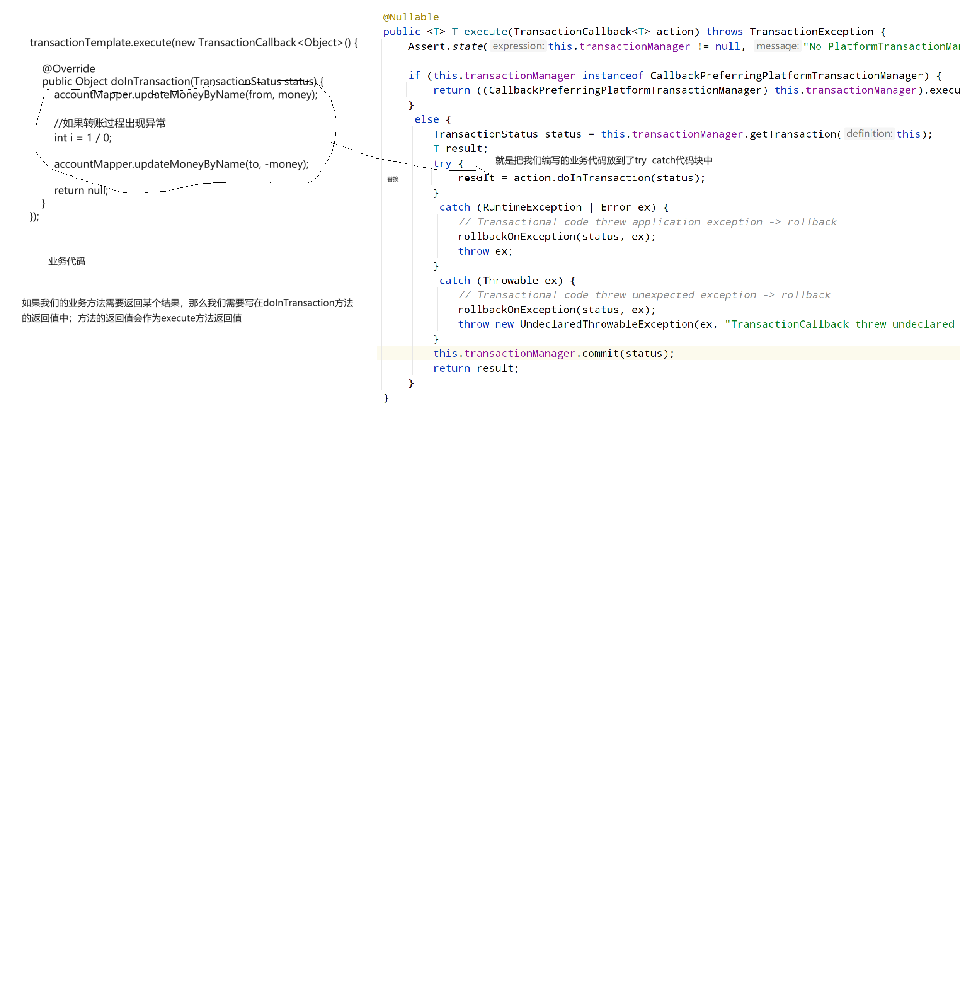

# Day26 Spring AOP

## 概念

AOP：Aspect Oriented Programing.面向切面编程。你可以理解为将一个运行中的方法看做时一个空间上的一个切面。在方法的执行前后做一些事情、增强，叫做面向切面编程。面向切面编程的侧重点侧重的就是一个运行中的方法。


## 为什么要学习AOP

其实通过前面的介绍，面向切面编程其实就类似于动态代理设计模式。为什么还需要去学习AOP呢？动态代理不好吗？

动态代理的出现，其实已经极大地简化了开发工作，但是在处理一些具体的事项上面，依然不是特别的完美。可以进一步的优化。哪些地方可以进一步优化？？？？？

需要增强的委托类的方法和需要增强的逻辑的关联上面不是特别的方便。

比如目前的method1需要具有增强1，method2需要具有增强2；但是后续随着开发工作的进行，那么这些增强的逻辑可能会有调整。假如目前生产环境遇到一个问题，那么我们需要新增一个日志打印功能，统计时间功能增强，但是这个增强逻辑只是暂时性地需要，后续一旦问题确认，那么该增强便不再需要了；或者说刚开始排查的时候，那么我们设定的范围应当是全业务代码，但是随着排查工作的进行，那么可能只需要去关联特定的业务逻辑即可。

针对前面的案例，我们的增强逻辑实际上是写在代理工具类中的，如果一个项目中，需要多个增强的逻辑，那么必须得在代理工具类中进行分发。随着业务逻辑的变更，分发的逻辑也是时钟需要变更的。下面这段代码，不同的增强分发逻辑是紧密的关联耦合在一起的，需要使用分发逻辑来进行分发。后续只要业务变更，那么我就需要再次进行修改。

```java
    public static Object getProxy(Object target){
        Class<?> targetClass = target.getClass();
        return Proxy.newProxyInstance(targetClass.getClassLoader(), targetClass.getInterfaces(), new InvocationHandler() {
            @Override
            public Object invoke(Object proxy, Method method, Object[] args) throws Throwable {

                //代理类对象的方法调用时，都会调用invocationHandler.invoke方法
                //所以我们需要做的事情便是进一步去调用委托类的方法
                String methodName = method.getName();
                if(methodName.equals("xxx")){
                    enhancer1();
                }else if(methodName.equals("yyy")){
                    enhancer2();
                }
            }
        });
    }

```

希望能够有一种非常理想、非常简单的方式：业务方法和增强逻辑是彼此单独存在的；如果希望业务方法1和增强1产生关联，那么直接在某处进行一个配置即可；如果今后不希望二者再关联一起，那么接触关联即可。


最终，我们希望业务和增强的关联方式可以实现上述的效果。他们如果需要关联在一起，进行配置即可；如果不需要关联在一起，直接接触关联即可。

**总结：AOP究竟要干什么？？？？？？AOP其实做的事情和动态代理做的事情是差不多的，只不过在动态代理的方案下，关于增强的分发逻辑有一些不太友好，如果后续业务逻辑变更，那么分发逻辑也需要同步去修改；改动还是比较大的**。


## AOP中的专业术语

Aspect：切面。切面是一个封装体。是切入点 + 通知组合在一起的封装形式，叫做切面。

切入点Pointcut：需要从哪个地方切入进来。关联哪个业务方法。使用某种技术来匹配某个连接点的过程。

通知Advice：就是增强。你需要做的何种增强，比如事务、日志、时间打印等等。

连接点Join Point：就是指的是一个一个的业务方法。

target object：委托类对象。

AOP Proxy：代理类对象。

织入Weaving：是一个过程，将连接点也通知关联在一起的过程称之为织入。

关于通知，在spring中有如下的通知形式：

前置通知：业务方法执行之前触发的增强逻辑

后置通知：业务方法执行之后触发的增强逻辑

环绕通知：业务方法的执行前后都会触发的增强逻辑

异常通知：业务方法执行产生异常时会触发得到逻辑

结果通知：业务方法正常执行完毕，返回的结果


## 入门案例(熟悉)

入门案例，我们将会介绍一种半自动的方式给大家入门。

使用半自动的AOP方式，需要向容器中去注册一个ProxyFactoryBean对象。

1.编写一个通知类，需要实现MethodInterceptor接口，实现里面的方法，里面的方法形参其实就是对于method.invoke的进一步封装调用;同时注册为Spring容器中的组件对象

```java
@Component
public class LogAdvice implements MethodInterceptor {
    @Override
    public Object invoke(MethodInvocation invocation) throws Throwable {

//        MethodInvocation你可以理解为就是对于动态代理设计模式中的method的进一步封装
        //下面这行代码就是对于method.invoke()又做了进一层的封装，原理和之前是完全等价的 委托类方法的调用
        System.out.println("log before");
        Object proceed = invocation.proceed();
        System.out.println("log after");
        return proceed;
    }
}
```


2.向容器中去注册ProxyFactoryBean对象，用于关联委托类对象和通知，产生代理类对象

```java
@Configuration
@ComponentScan("com.cskaoyan.th58")
public class SpringConfig {

    //写@Bean注解的方式
    //需要关注一下这类有没有实现FactoryBean接口，如果实现了该接口，那么直接取出来的并不是该对象本身，而是getObject方法的返回值
    //因为ProxyFactoryBean实现了FactoryBean接口，所以注册到容器中，利用编号取出来的是getObject返回值，通过查看方法说明可以得知，返回的是一个proxy代理类对象
    //现在我需要对GoodsServiceImpl进行增强，所以需要借助于ProxyFactoryBean对于GoodsServiceImpl进行处理，产生代理类对象
    @Bean
    public ProxyFactoryBean goodsServiceProxy(GoodsService goodsService){
        ProxyFactoryBean bean = new ProxyFactoryBean();
        //设置委托类 GoodsService
        bean.setTarget(goodsService);
        //通知：何种增强-----日志打印
        //这里面直接设置通知类的编号即可关联在一起，为什么？？？？
        //因为ProxyFactoryBean实现了FactoryBean接口，内部持有容器的引用，可以利用容器.getBean(id)来获取指定的对象
        bean.setInterceptorNames("logAdvice");
        return bean;
    }
}

```


3.直接从容器中取出代理类对象使用即可，需要使用@Qualifier注解

```jaVA
@RunWith(SpringJUnit4ClassRunner.class)
@ContextConfiguration(classes = SpringConfig.class)
public class AOPTest {

    @Autowired
    @Qualifier("goodsServiceProxy")
    GoodsService goodsService;

    @Test
    public void test1(){
        goodsService.addOne();
    }
}

```


```
NoUniqueBeanDefinitionException: No qualifying bean of type 'com.cskaoyan.th58.service.GoodsService' available:expected single matching bean but found 2: goodsServiceImpl,goodsServiceProxy
```

总结：比较一下半自动的方式相较于之前的动态代理有哪些改进，以及此时存在哪些不足之处？？？？

之前的动态代理，我们的不同的增强通知都是堆积在ProxyUtils工具类中的；耦合性有些高。

使用半自动的方式时，通知是一个一个单独彼此独立存在的；借助于ProxyFactoryBean对象，将委托类和通知关联在一起，产生代理类对象。

此时有哪些不足呢？？？？此时是将委托类对象和通知类对象产生关联，并不是将方法和通知方法产生关联，因为在一个类的内部，可能增强的逻辑也是不同的。


## AOP全自动

实际上，如果我们希望使用全自动的方式，那么需要借助于一个第三方的jar包类库aspectj框架。

aspectj提供的全自动的aop解决方案，一共有两种方案：

1.一种是基于advisor的方案，没有提供配置类的方式，所以我们就直接放弃。

2,另外一种是基于aspect的方案(课程介绍的是这种方案)

aspectj框架是可以实现业务方法和通知方法的关联的。这里面是如何产生关联的呢？

切入点提供了两种方案：

1.切入点表达式execution：相当于一套规则，利用这个规则去匹配对应的连接点方法。

2.自定义注解：编写一个自定义注解，只要连接点方法上面标注了该注解，那么便建立了联系。


### execution(掌握)

1.导包，导入aspectj依赖

2.编写一个切面类，标注@Component注解以及@Aspect注解

3.在当前切面类中编写一个方法，方法的修饰符public，返回值void，标注@Pointcut注解，里面设置value属性，value属性里面编写execution的语法

4.编写方法，方法修饰符public，返回值暂时没有要求，返回void即可，标注@Before等注解，表示的是前置通知；@Before注解里面需要填写value值，需要关联切入点的编号

5.配置类的头上标注@EnableAspectJAutoProxy注解，表示的是开启spring对于aspectj支持的开关。


```
execution(修饰符匹配? 返回值匹配 类路径匹配? 方法名匹配(参数匹配) 异常类型匹配?)
其中?表示该选项是可选的
```


配置类，需要开启对于aspectj的支持

```java
@Configuration
@ComponentScan("com.cskaoyan.th58")
//开启对于aspectj的支持 开关打开
@EnableAspectJAutoProxy
public class SpringConfig {
}
```

委托类对象，只需要增强add方法

```java
@Service
public class GoodsServiceImpl implements GoodsService{
    @Override
    public void addOne() {
        System.out.println("goods service addOne");
    }

    @Override
    public void selectOne() {
        System.out.println("goods service selectOne");
    }
}
```

切面= 切入点 + 通知

```java
//注册为spring容器中的一个组件
@Component
//编写的是一个切面，所以需要额外添加一个aspect注解
@Aspect
public class LogAspect {
    //切面 = 切入点(匹配连接点的过程 execution) + 通知(增强)


    //新建一个空的方法，修饰符public，返回值void
    //这里面只会去取当前方法的名称作为当前切入点的编号 ------GoodsServiceImpl.addOne ------beforeAdvice
    @Pointcut("execution(* com.cskaoyan..service.*ServiceImpl.add*(..))")
    public void pt1(){}


    //before注解就表示的是当前是一个前置通知
    @Before("pt1()")
    public void beforeAdvice(){
        System.out.println("前置通知");
    }
}
```


### @annotation(掌握)

使用切入点表达式来匹配业务方法，除了可以使用上述的execution之外，还可以去自定义一个注解，只要业务方法上面标注了该注解，那么便表示关联了当前业务方法。

这两种方式的区别在哪？？？？？

execution：进行大范围的匹配，能够匹配一系列的具有某些特征的方法。

@annotation：进行小范围的精准匹配。如果业务方法没有明显的特征，可以使用这种方案。

自定义一个注解：

```java
//注解需要一些元数据：1.注解可以写在哪些上面：类、方法、成员变量；2保留期：源码、class存在、运行时存在
    //表示的是当前注解可以写在方法的上面
@Target(ElementType.METHOD)
//运行时依然保留存在，只有设置runtime，那么才可以发挥功能  java------class--------运行(RUNTIME)
@Retention(RetentionPolicy.RUNTIME)
public @interface Log {
}
```


在切面类中进行配置：

```java
@Component
@Aspect
public class LogAspect {


    //切入点 ----表达式关联的是一个自定义注解，只要哪个业务方法上面标注了该注解，那么便关联了当前的业务方法
    @Pointcut("@annotation(com.cskaoyan.th58.annotation.Log)")
    public void pt1(){}

    //通知通过切入点编号关联了切入点，进一步关联了业务方法
    @Before("pt1()")
    public void beforeAdvice(){
        System.out.println("这是一个前置通知");
    }
}
```


业务代码中需要增强的方法上面添加注解即可

```java
@Service
public class GoodsServiceImpl implements GoodsService{
    //对于当前方法进行增强
    @Log
    @Override
    public void addOne() {
        System.out.println("goods service addOne");
    }

    @Override
    public void selectOne() {
        System.out.println("goods service selectOne");
    }
}

```

```java
@Service
public class UserServiceImpl implements UserService{
    @Log
    @Override
    public void addOne() {
        System.out.println("userServiceImpl addOne");
    }

    @Override
    public void selectOne() {
        System.out.println("userServiceImpl selectOne");
    }
}
```


### 通知类型(掌握)

在Spring中有如下的通知(增强)类型：

前置通知：业务方法执行之前触发的增强逻辑

后置通知：业务方法执行之后触发的增强逻辑

环绕通知：业务方法的执行前后都会触发的增强逻辑

异常通知：业务方法执行产生异常时会触发得到逻辑

结果通知：业务方法正常执行完毕，返回的结果


切面： 切入点  + 通知（各种不同的通知类型）

```java
@Component
@Aspect
public class LogAspect {

    @Pointcut("@annotation(com.cskaoyan.th58.annotation.Log)")
    public void pt1(){}


    //说明：在开发过程中，没有场景需要把所有的通知都写一遍，我们这里面是给大家做演示
    //大家在开发过程中，需要选择一个合适的通知类型

    //通知 前置通知
    @Before("pt1()")
    public void beforeAdvice(){
        System.out.println("这是一个前置通知");
    }

    //后置通知
    @After("pt1()")
    public void afterAdvice(){
        System.out.println("这是一个后置通知");
    }

    //环绕通知比较特殊：返回值结果不可以是void，必须是object
    //对于混绕通知来说，需要去调用委托类的方法，必须要传递一个形参ProceedingJoinPoint
    @Around("pt1()")
    public Object aroundAdvice(ProceedingJoinPoint joinPoint){
        System.out.println("这是环绕通知前");
        //调用委托类的方法
        Object proceed = null;
        try {
            proceed = joinPoint.proceed();
        } catch (Throwable e) {
            throw new RuntimeException(e);
        }
        System.out.println("这是环绕通知后");
        return proceed;
    }

    //异常通知
    //当发生异常时，会把异常的信息，赋值给当前的通知中的形参exp
    @AfterThrowing(value = "pt1()",throwing = "exp")
    public void expAdvice(Exception exp){
        System.out.println("异常通知" + exp);
    }

    //返回结果通知:会把委托类方法的运行结果赋值给当前通知的形参result
    @AfterReturning(value = "pt1()", returning = "result")
    public void resultAdvice(Object result){
        System.out.println("接收结果通知：" + result);
    }
}
```

注意：

1.不需要去记住前置通知和环绕通知前顺序哪个在前、哪个在后，没有意义。你需要记住的是这些通知和委托类的方法之间的顺序。

2.关于除了环绕通知之外的其他通知，如果希望能够在通知中获取委托类方法的信息，那么可以直接在通知方法的形参中写一个JoinPoint即可，如果有多个 参数，那么JoinPoint必须要求在第一位。

```java
@Before("pt1()")
    public void beforeAdvice(JoinPoint joinPoint){
        //获取委托类信息
        Object target = joinPoint.getTarget();
        //获取的是代理类对象信息
        Object aThis = joinPoint.getThis();
        //签名-----需要获取方法的信息，进行向下转型，转换成方法签名
        Signature signature = joinPoint.getSignature();
        MethodSignature methodSignature = (MethodSignature) signature;
        String name = methodSignature.getName();

        System.out.println("这是一个前置通知");
    }
```


## 面向注解编程思想

业务类方法上面标注对应的注解，注解里面写上对应的值。

```java
@Service
public class MarketAdminServiceImpl implements MarketAdminService{

    //项目二再去写这个接口，只需要面向接口编程即可
    @Log(type = "安全操作", action = "登录")
    @Override
    public MarketAdmin login(String username, String password) {


        return null;
    }

    /*public MarketAdmin login() {


        return null;
    }*/


    @Log(type = "安全操作", action = "注销")
    @Override
    public void logout() {

    }
}

```


在切面中，获取这些注解中的属性值

```java
@Component
@Aspect
public class LogAspect {

    //spring会自动帮你进入注入
    @Autowired
    LogService logService;

    @Pointcut("@annotation(com.cskaoyan.th58.annotation.Log)")
    public void pt(){}


    //接收结果通知
    @AfterReturning(value = "pt()", returning = "result")
    public void result(JoinPoint joinPoint, Object result){
        //获取当前方法上面的Log注解里面的type以及action的值
        //如何获取注解里面的值呢？借助于反射 Class

        //拿到委托类对象
        Object target = joinPoint.getTarget();
        //获取委托类对象对应的Class对象信息
        Class<?> targetClass = target.getClass();

        //joinPoint就是对于当前运行的方法的封装体，里面会包含方法的信息
        Signature signature = joinPoint.getSignature();
        String methodName = signature.getName();
        //因为目前我们这是一个方法，所以可以强转成MethodSignature
        MethodSignature methodSignature = (MethodSignature) signature;

        Class<?>[] parameterTypes = methodSignature.getMethod().getParameterTypes();
        //拿到方法:java语言里面允许方法同名，定位一个方法不仅需要方法的名称，还需要参数签名，也就是参数类型
        Method method = null;
        try {
            method = targetClass.getMethod(methodName, parameterTypes);
        } catch (NoSuchMethodException e) {
            throw new RuntimeException(e);
        }
        Log log = method.getAnnotation(Log.class);
        String type = log.type();
        String action = log.action();
        System.out.println(type + ":" + action);
        logService.addLog();
    }
}
```


## AOP演进过程

1.最开始的时候，我们引入了动态代理设计模式(代理设计模式--------> 静态代理---------> 动态代理设计模式)

原理便是在运行期间，内存中生成字节码的一种技术。

2.随后将动态代理技术和Spring加以整合，需要使用到BeanPostProcessor来对创建出来的bean对象进行处理，处理过后的代理类对象放入到spring容器中，此时并没有明显的改进，只是做到代理和Spring加以整合。

3.引入了AOP半自动的方式。半自动的方式相较于之前的改进在于：1.此时无需编写BeanPostProcessor;2.通知是单独的一个一个类存在的，没有在ProxyUtils工具类中进行分发；此时依然存在的问题：如果一个委托类中只有部分方法需要增强，那么此时指定不是特别灵活。

4.引入了AOP全自动的方式。需要借助于AspectJ框架。需要用到一个Pointcut，里面需要编写切入点表达式(可以是execution、@annotation)，另外一部分还需要和通知进行关联。所以最终借助于Pointcut，可以实现通知和业务方法的关联。随后Spring会在运行期间，产生代理类对象。


> Maven父子工程
>
> 1.新建一个maven项目，将src目录删除，只保留pom.xml文件即可，这个作为父工程，作用就是用来去管理依赖
>
> 2.新建子工程(选中父工程，new module)，子工程可以继承得到父工程的依赖信息，这样就无需反复去导入依赖了
>
> 3.除了maven父子工程之外，其他的项目不应该会存在嵌套关系。
>
> 4.此时查看子工程的pom.xml文件，会多出来一个parent标签
>
> 5.此时再去查看父工程的pom.xml文件，会多出来modules标签


## Spring整合Mybatis

Spring作为一个bean的容器，希望能够将所有的功能性组件全部放入到spring容器中进行管理。这个也就是IoC容器。

想一下，之前学习mybatis时，接触到了哪些对象？？？？

SqlSessionFactory、各种Mapper接口实现类对象，希望可以将这些对象放入到spring容器中


1.将SqlSessionFactory放入Spring容器中。（后续整合了spring之后，无需自己再去编写MybatisUtils工具类了）

因为考虑到SqlSessionFactory是一个interface，所以开发人员不太容易去处理，需要mybatis的官方对于spring提供支持。也就此时需要额外导入一个jar包，叫做mybatis-spring，该jar包里面提供了一个SqlSessionFactoryBean对象


2.需要向容器中去注册一个mapperScannerConfigurer组件对象，可以扫描mapper包目录，创建对应的mapper实例对象，并且将其放入到spring容器中。随后，我们在service业务层中，可以直接通过@Autowired取出mapper实例对象

配置类：

```java
@Configuration
//因为我们自己编写了service组件，也需要放入到spring容器中，所以需要配置这一行注解
@ComponentScan("com.cskaoyan.th58")
public class SpringConfig {

    //向容器中注册了一个DataSource对象 数据源
    @Bean
    public DataSource dataSource(){
        DruidDataSource druidDataSource = new DruidDataSource();
        //关于这部分配置信息，应当写入到配置文件中，但是考虑到spring的配置文件和springboot略有一些差异
        //为了减轻大家的负担，并且后续使用springboot更为多一些，所以我们先不去放置到配置文件中
        druidDataSource.setDriverClassName("com.mysql.cj.jdbc.Driver");
        druidDataSource.setUrl("jdbc:mysql://localhost:3306/tx?characterEncoding=utf-8&useSSL=false");
        druidDataSource.setUsername("root");
        druidDataSource.setPassword("123456");
        return druidDataSource;
    }

    //向容器中去注册当前对象，利用编号取出来的就是SqlSessionFactory；mybatis官方提供的支持
    //使用这种方式的时候，有没有使用mybatis.xml文件？？？没有，需要提供数据库的连接信息
    //所以，我们需要提供数据源信息------》 进一步向容器中去注册一个数据源对象
    @Bean
    public SqlSessionFactoryBean sqlSessionFactory(DataSource dataSource){
        SqlSessionFactoryBean factoryBean = new SqlSessionFactoryBean();
        factoryBean.setDataSource(dataSource);
        return factoryBean;
    }


    //还需要去向容器中去注册一个MapperScannerConfigurer组件
    //这个组件的主要功能是会设定扫描包目录，然后创建对应的mapper实例对象，并且把创建好的mapper实例对象放入到spring容器中
    //那么我们便可以直接使用@Autowired取出来
    @Bean
    public MapperScannerConfigurer mapperScannerConfigurer(){
        MapperScannerConfigurer configurer = new MapperScannerConfigurer();
        //设定扫描的包目录
        configurer.setBasePackage("com.cskaoyan.th58.mapper");
        //还需要去关联sqlSessionFactory；因为sqlSessionFactory mybatis的核心组件，其他的功能都需要借助于该对象展开

        //此处直接去写编号即可，为什么可以通过写编号就可以关联？？？？
        configurer.setSqlSessionFactoryBeanName("sqlSessionFactory");
        return configurer;
    }
}
```

Service业务类：

```java
@Service
public class UserServiceImpl implements UserService {

    @Autowired
    UserMapper userMapper;


    @Override
    public User getUserById(int id) {
        //先获取session   session.getMapper     session.commit()/close()
        //spring整合mybatis之后，会自动进行增强处理，我们无需编写上述代码逻辑
        return userMapper.selectOne(id);
    }

    @Override
    public void addUser(User user) {
        //关于事务的提交、关闭这些代码无需我们进行处理，会自动进行增强代理 AOP
        userMapper.insertOne(user);
    }
}
```


但是如果此时，进行转账案例，那么会发现：存在一些小问题。


## SpringTX

在Spring中，使用平台事务管理器对象来进行事务的管理。

### PlatformTransactionManager

这里面提及了两个额外的对象：

TransactionDefinition：事务的定义对象。比如定义隔离级别、超时时间等信息。

TransactionStatus：事务的状态对象。比如事务是否是只读等。

下面还有两个方法，一个是commit，用来进行提交事务；一个是rollback用来进行回滚事务。

在提交事务以及回滚事务时，需要传递一个形参叫做TransactionStatus，这个对象应该如何获取？？？？

我们根据第一个方法getTransaction，只需要传递进来一个TransactionDefinition，那么便可以得到一个TransactionStatus。

总结：

**归根结底，我们想要在Spring中进行事务的管理，那么需要提供如下两个对象：**

**1.平台事务管理器的实现类对象PlatformTransactionManager实现类对象**

**2.事务定义对象TransactionDefinition实现类对象**

```java
public interface PlatformTransactionManager extends TransactionManager {

	TransactionStatus getTransaction(@Nullable TransactionDefinition definition) throws TransactionException;

	void commit(TransactionStatus status) throws TransactionException;

	void rollback(TransactionStatus status) throws TransactionException;

}

```

### TransactionDefinition

事务定义对象里面提供了一系列的关于事务的定义信息。其中spring针对事务提出了一个新的概念，叫做事务的传播行为。

事务的传播行为：是指的是多个事务之间如何共享事务。通俗的来说就是多个事务所属的方法之间存在着调用关系，当发生异常时，哪些方法应该提交，哪些方法应该回滚。按照事务原本的定义来说，应该都遵循着同时成功，同时失败。但是Spring认真这种方式可能太过于绝对了，有的场景可能不需要这么去做。比如注册成功之后，发放新人优惠券， 但是优惠券发放失败了，此时需要进行全部回滚吗？？？在这个场景下，其实可以不用回滚。

如果method1调用了method2，那么method1就称之为外部，method2称之为内部。

- **REQUIRED**：默认的传播行为，使用最为广泛。如果外部不包含事务，则内部新增一个新的事务。如果外部包含事务，则加入到该事务中来。**该行为的特征是要么全部提交，要么全部回滚。**
- **REQUIRES_NEW**：如果外部不包含事务，则内部新增一个新的事务。如果外部包含事务，则内部新增一个新的事务。**该行为的特征是内部可以影响外部，但是外部不会影响内部。**也就是说method2发生异常，会导致全部都回滚；但是如果method1发生异常，仅method1回滚，method2提交事务。
- **NESTED**：如果外部不包含事务，则内部新增一个新的事务。如果外部包含事务，则以嵌套的方式运行。**该行为的特征是内部不会影响外部，但是外部可以影响内部。**该场景的一个典型案例就是注册网站成功之后，会发放新人优惠券。注册失败，肯定不会发放优惠券；但是发放优惠券失败，肯定不会导致新账号注册失败。
- 但是，在真实的开发过程中，其实我们并不是在很多场景下真正地去用它。但是，面试的时候，可能作为一个面试的知识点来加以提问。所以针对上述部分的内容，大家需要简单了解，面试的时候可以说几句。

```java
public interface TransactionDefinition {

	int PROPAGATION_REQUIRED = 0;

	 
	int PROPAGATION_SUPPORTS = 1;

	
	int PROPAGATION_MANDATORY = 2;

	
	int PROPAGATION_REQUIRES_NEW = 3;

	
	int PROPAGATION_NOT_SUPPORTED = 4;

	
	int PROPAGATION_NEVER = 5;

	
	int PROPAGATION_NESTED = 6;


	//默认是-1表示的是使用的是数据库的默认隔离级别，如果使用的是mysql，在没有设置的情况下，是repeatable read
	int ISOLATION_DEFAULT = -1;

	
	int ISOLATION_READ_UNCOMMITTED = 1;  // same as java.sql.Connection.TRANSACTION_READ_UNCOMMITTED;

	
	int ISOLATION_READ_COMMITTED = 2;  // same as java.sql.Connection.TRANSACTION_READ_COMMITTED;

	
	int ISOLATION_REPEATABLE_READ = 4;  // same as java.sql.Connection.TRANSACTION_REPEATABLE_READ;

	
	int ISOLATION_SERIALIZABLE = 8;  // same as java.sql.Connection.TRANSACTION_SERIALIZABLE;


	
	int TIMEOUT_DEFAULT = -1;


	
	default int getPropagationBehavior() {
		return PROPAGATION_REQUIRED;
	}


	default int getIsolationLevel() {
		return ISOLATION_DEFAULT;
	}


	default int getTimeout() {
		return TIMEOUT_DEFAULT;
	}


	default boolean isReadOnly() {
		return false;
	}

	@Nullable
	default String getName() {
		return null;
	}

	static TransactionDefinition withDefaults() {
		return StaticTransactionDefinition.INSTANCE;
	}

}
```


### 编程式事务(熟悉)

接下来，我们需要再开发过程中，需要合适的平台事务管理器实现类对象以及事务定义实现类对象。

如果需要保障事务，则需要再Spring配置类中额外再添加如下两个配置

```java
  //======================上述的设置是没办法保障事务的=============================
    
    //需要向容器中再额外注册两个组件：平台事务管理器对象、事务定义对象
    @Bean
    public PlatformTransactionManager transactionManager(DataSource dataSource){
        return new DataSourceTransactionManager(dataSource);
    }
    
    //注册一个事务定义对象
    @Bean
    public TransactionTemplate transactionTemplate(PlatformTransactionManager transactionManager){
        return new TransactionTemplate(transactionManager);
    }
```


后续，在我们使用过程中，只需要用transactionTemplate将需要保障事务的代码包裹起来即可。

```java
@Service
public class TransferServiceImpl implements TransferService{

    //因为之前已经做了配置，已经将创建好的mapper实例放入到spring容器中了，所以此处可以直接从容器中取出
    @Autowired
    AccountMapper accountMapper;

    @Autowired
    TransactionTemplate transactionTemplate;

    @Override
    public void transfer(String from, String to, Double money) {
        //execute需要传递一个参数，TransactionCallback，传递进来的是一个匿名内部类对象
        //将保障事务的代码用doInTransaction包裹起来即可
        transactionTemplate.execute(new TransactionCallback<Object>() {

            @Override
            public Object doInTransaction(TransactionStatus status) {
                accountMapper.updateMoneyByName(from, money);

                //如果转账过程出现异常
                int i = 1 / 0;

                accountMapper.updateMoneyByName(to, -money);

                return null;
            }
        });
    }
}
```


上述service业务类中的代码虽然写起来不是特别复杂，但是理解起来比较难以理解，可以稍微看一下源码。



总结：

我们编写的业务代码，最终会嵌套在一个try catch代码块中，如果出现了异常，则进入到回滚过程；如果没有出现异常，则最终进行了提交事务。


### 声明式事务(掌握)

1.向容器中去注册平台事务管理器实现类对象DataSourceTransactionManager

2.在需要保障事务的代码上面，添加一个注解@Transactional

3.在配置类的头上标注@EnableTransactionManagement


问题：编程式事务和声明式事务之间存在着什么联系？？？？

使用编程式事务可以实现声明式事务。（编程式事务  + AOP = 声明式事务）

