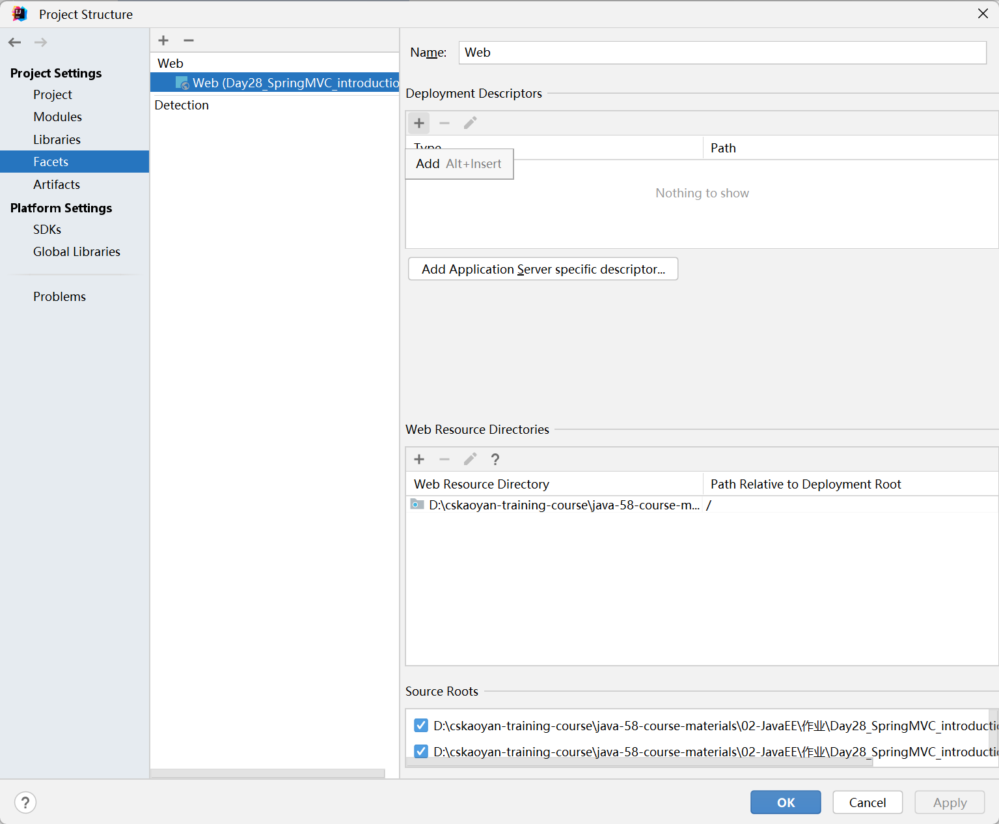
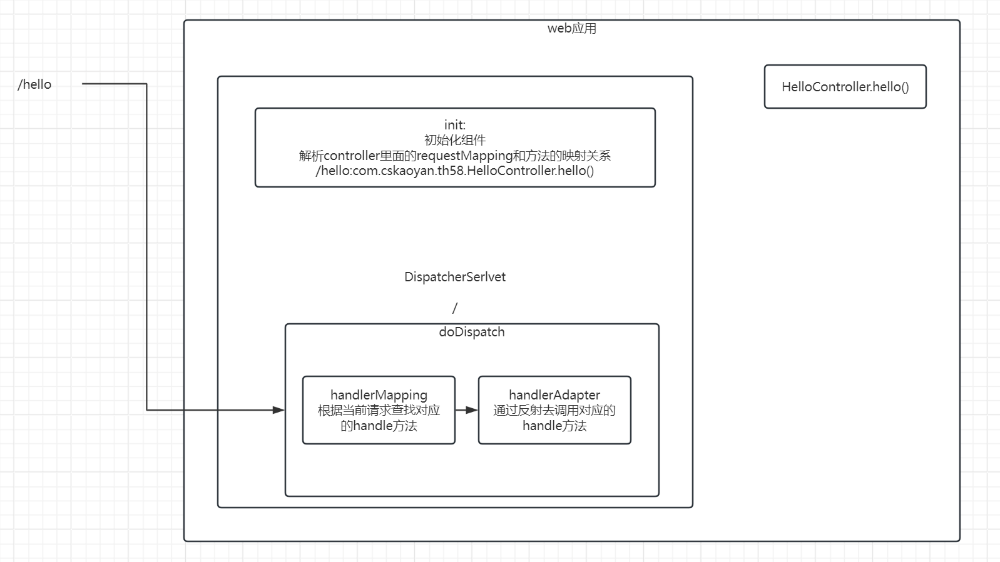
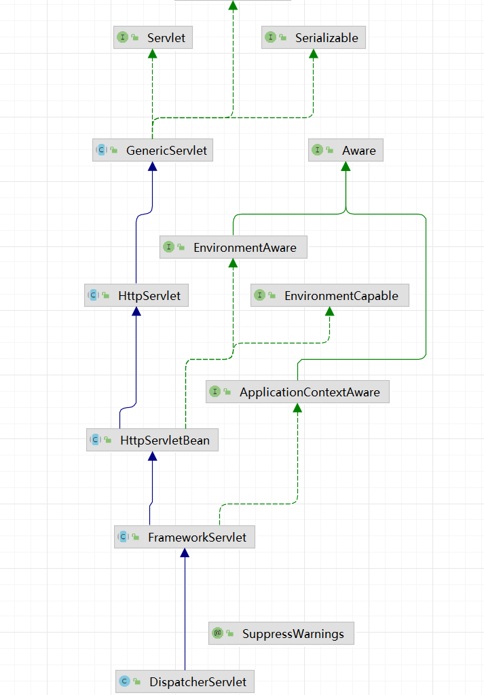
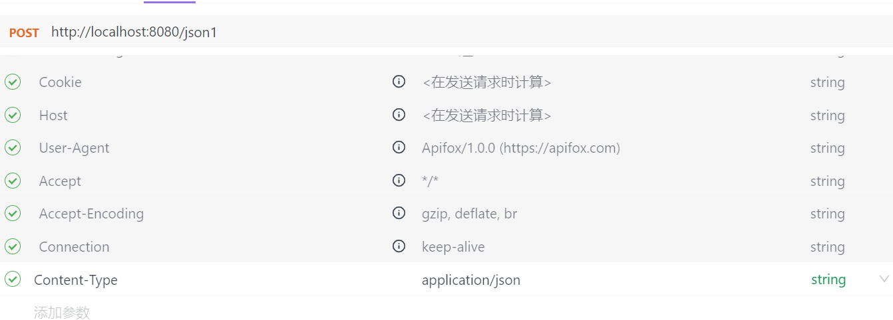
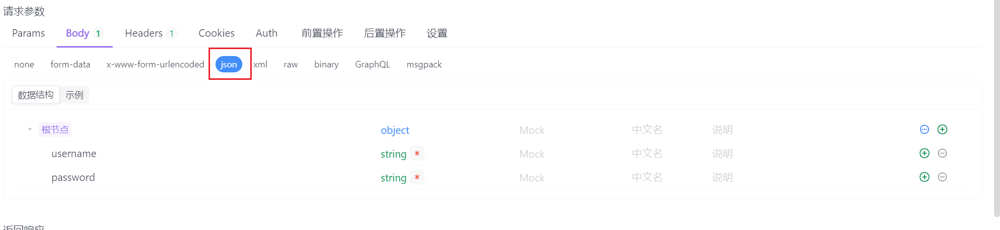

# Day28 SpringMVC

## 概念

Spring是用于处理什么组件的框架？？？是不是Service？？？不是Service。Spring主要做的事情是去搭建一个框架的平台。无论各种框架类库，都可以运行在Spring体系内。

在前面的课程中，我们将三层架构中的功能模块的serivce组件以及mapper组件放入到spring容器中了，肯定希望将controller也放入到spring容器中。数据共享会非常方便。

针对展示层，也就是处理controller部分，spring提供的一个框架叫做SpringMVC。

SpringMVC有什么功能，为什么要去学习SpringMVC？项目一java web项目开发过程中的痛点

1.请求参数的接收过程中，比较繁琐，如果是json字符串，那么需要我们开发人员自行去解析处理

2.响应也不是特别的方便，尤其是结合着之前学习的Spring中的AOP之后，发现可以进行很大的优化(response.getWriter().println(new ObjectMapper.writeValueAsString(obj)));-----完全可以使用切面来实现

3.请求参数校验过程中也比较的繁琐。需要判断是否为空，需要判断是否是整数等。

4.项目一的controller中的doGet或者doPost中，都有分发的代码，着实有一些繁琐。

5.借助于SpringMVC框架，其实可以和其他的位于Spring容器中的组件共享spring容器的功能。


## SpringMVC入门案例(熟悉)

入门案例使用xml文件配置的方式，熟悉即可，后续主要使用配置类。

1.导入依赖


2.改造成java ee项目，pom.xml文件设置<packaging>war</packaging>,在src\main目录下新建webapp目录；

open module settings----选择+号，根据提示创建对应的web.xml文件

设置完之后，在webapp/WEB-INF目录下会有一个web.xml文件




3.在web.xml文件中进行如下的配置：

配置了一个serlvet的url-pattern为/，所以其是一个缺省Servlet，如果当前web项目中只有这一个serlvet的话，那么所有的请求都会交给当前serlvet来进行处理。

其中init-param定义了一组键值对的初始化参数，后续DispatcherServlet启动之后会读取该初始化参数，这组参数实际上是配置了配置文件的存放位置位于classpath目录下的application.xml

```xml
<servlet>
        <servlet-name>dispatcher</servlet-name>
        <servlet-class>org.springframework.web.servlet.DispatcherServlet</servlet-class>
        <init-param>
            <param-name>contextConfigLocation</param-name>
            <param-value>classpath:application.xml</param-value>
        </init-param>
    </servlet>

    <servlet-mapping>
        <servlet-name>dispatcher</servlet-name>
        <url-pattern>/</url-pattern>
    </servlet-mapping>
```


4.需要在resources目录下新建一个application.xml文件

```xml
<?xml version="1.0" encoding="UTF-8"?>
<beans xmlns="http://www.springframework.org/schema/beans"
       xmlns:xsi="http://www.w3.org/2001/XMLSchema-instance"
       xmlns:mvc="http://www.springframework.org/schema/mvc"
       xmlns:context="http://www.springframework.org/schema/context"
       xsi:schemaLocation="http://www.springframework.org/schema/beans http://www.springframework.org/schema/beans/spring-beans.xsd http://www.springframework.org/schema/mvc http://www.springframework.org/schema/mvc/spring-mvc.xsd http://www.springframework.org/schema/context https://www.springframework.org/schema/context/spring-context.xsd">

    <!--开启对于web项目的支持，主要就是初始化组件，用于去处理web请求-->
    <mvc:annotation-driven/>

    <!--设定扫描的包目录-->
    <context:component-scan base-package="com.cskaoyan"/>

</beans>
```


5编写Controller即可

需要特别注意的是：controller不需要去继承HttpSerlvet；

```java
@Controller
public class HelloController {

    //希望当前请求方法时，可以返回一个json字符串
    //实现请求和方法的映射
    @RequestMapping("/hello")
    //返回一个json字符串
    @ResponseBody
    public Object hello(){

        Result ok = new Result(200, "OK", null);

        //之前在项目一种返回一个json字符串非常麻烦；需要把对象转换成json字符串；需要利用response放置在响应体中
        return ok;
    }
}
```

最后配置一个tomcat来部署当前的应用即可。

http://localhost:8080/{应用名}/hello


## SpringMVC执行原理(掌握)

在浏览器地址栏输入http://localhost:8080/app/hello时，处理过程如何？？？？

当请求到达应用之后，有效的路径部分为/hello，这个请求有没有servlet可以处理？？？只能够交给缺省Servlet来进行处理。而我们的项目中有配置一个新的缺省Serlvet，叫做DispatcherServlet。

**所以请求会交给当前DispatcherServlet.service(req,resp)来进行处理。经过一系列的调用之后，最终会调用DispatcherSerlvet.doDispatch(request,response)方法。这个也是DispatcherServlet处理业务逻辑的核心。**

进入到doDispatch方法中之后，会根据当前的请求资源路径，查找有没有对应的handle方法可以匹配当前的请求，确定应该由哪个handle方法来处理这个请求；最终利用反射去调用对应的handle方法。

> 在很多的框架里面，如果看到了doXXX方法，那么这些方法才是真正干活的方法。





> DispatcherServlet.service(req,resp)程序执行入口：
>
> ```java
> public void service(ServletRequest req, ServletResponse res)
>         throws ServletException, IOException
>     {
>         HttpServletRequest  request;
>         HttpServletResponse response;
>         
>         if (!(req instanceof HttpServletRequest &&
>                 res instanceof HttpServletResponse)) {
>             throw new ServletException("non-HTTP request or response");
>         }
> 
>         request = (HttpServletRequest) req;
>         response = (HttpServletResponse) res;
> 		//关注这一行代码，分析的时候应该分析的是DispatcherServlet.serivce(request,response)注意此时的参数是HttpServletRequest和HttpServletResponse
>     //后续分析的时候，需要注意：在HttpServlet之后的子类中有没有对service(request,response)进行过重写
>         service(request, response);
>     }
> ```
>
> FrameServlet.service:
>
> ```java
> protected void service(HttpServletRequest request, HttpServletResponse response)
> 			throws ServletException, IOException {
> 		//解析出请求方法
> 		HttpMethod httpMethod = HttpMethod.resolve(request.getMethod());
> 		if (httpMethod == HttpMethod.PATCH || httpMethod == null) {
> 			processRequest(request, response);
> 		}
> 		else {
>             //我们使用的get和post会走到这
> 			super.service(request, response);
> 		}
> 	}
> ```
>
> HttpServlet.service(request,response):这里面的逻辑就是根据请求方法的不同，进入到不同的doXXX方法中。
>
> 但是此时我们分析的是DispatcherSerlvet，所以需要查看当前serlvet中有没有重写doGet或者doPost
>
> ```java
> protected void service(HttpServletRequest req, HttpServletResponse resp)
>         throws ServletException, IOException
>     {
>         String method = req.getMethod();
> 
>         if (method.equals(METHOD_GET)) {
>             long lastModified = getLastModified(req);
>             if (lastModified == -1) {
>                 // servlet doesn't support if-modified-since, no reason
>                 // to go through further expensive logic
>                 doGet(req, resp);
>             } else {
>                 long ifModifiedSince = req.getDateHeader(HEADER_IFMODSINCE);
>                 if (ifModifiedSince < lastModified) {
>                     // If the servlet mod time is later, call doGet()
>                     // Round down to the nearest second for a proper compare
>                     // A ifModifiedSince of -1 will always be less
>                     maybeSetLastModified(resp, lastModified);
>                     doGet(req, resp);
>                 } else {
>                     resp.setStatus(HttpServletResponse.SC_NOT_MODIFIED);
>                 }
>             }
> 
>         } else if (method.equals(METHOD_HEAD)) {
>             long lastModified = getLastModified(req);
>             maybeSetLastModified(resp, lastModified);
>             doHead(req, resp);
> 
>         } else if (method.equals(METHOD_POST)) {
>             doPost(req, resp);
>             
>         } else if (method.equals(METHOD_PUT)) {
>             doPut(req, resp);
>             
>         } else if (method.equals(METHOD_DELETE)) {
>             doDelete(req, resp);
>             
>         } else if (method.equals(METHOD_OPTIONS)) {
>             doOptions(req,resp);
>             
>         } else if (method.equals(METHOD_TRACE)) {
>             doTrace(req,resp);
>             
>         } else {
>             //
>             // Note that this means NO servlet supports whatever
>             // method was requested, anywhere on this server.
>             //
> 
>             String errMsg = lStrings.getString("http.method_not_implemented");
>             Object[] errArgs = new Object[1];
>             errArgs[0] = method;
>             errMsg = MessageFormat.format(errMsg, errArgs);
>             
>             resp.sendError(HttpServletResponse.SC_NOT_IMPLEMENTED, errMsg);
>         }
>     }
> ```
>
> FrameServlet.doGet(request,response):
>
> ```java
> @Override
> 	protected final void doGet(HttpServletRequest request, HttpServletResponse response)
> 			throws ServletException, IOException {
> 
> 		processRequest(request, response);
> 	}
> ```
>
> FrameServlet.processRequest(request,response):这里面的代码大多数大家不用去关注
>
> ```java
> protected final void processRequest(HttpServletRequest request, HttpServletResponse response)
> 			throws ServletException, IOException {
> 
> 		long startTime = System.currentTimeMillis();
> 		Throwable failureCause = null;
> 
> 		LocaleContext previousLocaleContext = LocaleContextHolder.getLocaleContext();
> 		LocaleContext localeContext = buildLocaleContext(request);
> 
> 		RequestAttributes previousAttributes = RequestContextHolder.getRequestAttributes();
> 		ServletRequestAttributes requestAttributes = buildRequestAttributes(request, response, previousAttributes);
> 
> 		WebAsyncManager asyncManager = WebAsyncUtils.getAsyncManager(request);
> 		asyncManager.registerCallableInterceptor(FrameworkServlet.class.getName(), new RequestBindingInterceptor());
> 
> 		initContextHolders(request, localeContext, requestAttributes);
> 
> 		try {
>             //这个方法时我们感兴趣的方法
> 			doService(request, response);
> 		}
> 		catch (ServletException | IOException ex) {
> 			failureCause = ex;
> 			throw ex;
> 		}
> 		catch (Throwable ex) {
> 			failureCause = ex;
> 			throw new NestedServletException("Request processing failed", ex);
> 		}
> 
> 		finally {
> 			resetContextHolders(request, previousLocaleContext, previousAttributes);
> 			if (requestAttributes != null) {
> 				requestAttributes.requestCompleted();
> 			}
> 			logResult(request, response, failureCause, asyncManager);
> 			publishRequestHandledEvent(request, response, startTime, failureCause);
> 		}
> 	}
> ```
>
> FrameServlet.doService(request,response);
>
> ```java
> protected void doService(HttpServletRequest request, HttpServletResponse response) throws Exception {
> 		logRequest(request);
> 
> 		// Keep a snapshot of the request attributes in case of an include,
> 		// to be able to restore the original attributes after the include.
> 		Map<String, Object> attributesSnapshot = null;
> 		if (WebUtils.isIncludeRequest(request)) {
> 			attributesSnapshot = new HashMap<>();
> 			Enumeration<?> attrNames = request.getAttributeNames();
> 			while (attrNames.hasMoreElements()) {
> 				String attrName = (String) attrNames.nextElement();
> 				if (this.cleanupAfterInclude || attrName.startsWith(DEFAULT_STRATEGIES_PREFIX)) {
> 					attributesSnapshot.put(attrName, request.getAttribute(attrName));
> 				}
> 			}
> 		}
> 
> 		// Make framework objects available to handlers and view objects.
> 		request.setAttribute(WEB_APPLICATION_CONTEXT_ATTRIBUTE, getWebApplicationContext());
> 		request.setAttribute(LOCALE_RESOLVER_ATTRIBUTE, this.localeResolver);
> 		request.setAttribute(THEME_RESOLVER_ATTRIBUTE, this.themeResolver);
> 		request.setAttribute(THEME_SOURCE_ATTRIBUTE, getThemeSource());
> 
> 		if (this.flashMapManager != null) {
> 			FlashMap inputFlashMap = this.flashMapManager.retrieveAndUpdate(request, response);
> 			if (inputFlashMap != null) {
> 				request.setAttribute(INPUT_FLASH_MAP_ATTRIBUTE, Collections.unmodifiableMap(inputFlashMap));
> 			}
> 			request.setAttribute(OUTPUT_FLASH_MAP_ATTRIBUTE, new FlashMap());
> 			request.setAttribute(FLASH_MAP_MANAGER_ATTRIBUTE, this.flashMapManager);
> 		}
> 
> 		RequestPath previousRequestPath = null;
> 		if (this.parseRequestPath) {
> 			previousRequestPath = (RequestPath) request.getAttribute(ServletRequestPathUtils.PATH_ATTRIBUTE);
> 			ServletRequestPathUtils.parseAndCache(request);
> 		}
> 
> 		try {
>             //重点关注这个方法
> 			doDispatch(request, response);
> 		}
> 		finally {
> 			if (!WebAsyncUtils.getAsyncManager(request).isConcurrentHandlingStarted()) {
> 				// Restore the original attribute snapshot, in case of an include.
> 				if (attributesSnapshot != null) {
> 					restoreAttributesAfterInclude(request, attributesSnapshot);
> 				}
> 			}
> 			if (this.parseRequestPath) {
> 				ServletRequestPathUtils.setParsedRequestPath(previousRequestPath, request);
> 			}
> 		}
> 	}
> ```
>
> 


## SpringMVC配置类使用形式(重点掌握)

使用配置类时，默认是整合了spring和springmvc的。spring内部有一个容器，springmvc内部也有一个容器。针对web开发项目中的组件，我们遵循的原则是如果是web需要用到的组件，那么放入到springmvc容器中，也就是在springmvc配置类中编写；如果是非web的组件，那么放入到spring的配置类中，比如serivce、mapper等，也就是在spring配置类中进行配置。

但是，大家无需担心，放置在两个容器中会不会有屏蔽。不需要担心，访问的时候依然是可以访问到的。

1.新建一个启动类继承自AACDSI，新建Spring配置类及SpringMVC配置类

```java
public class AppInitializer extends AbstractAnnotationConfigDispatcherServletInitializer {
    //配置Spring的启动类
    @Override
    protected Class<?>[] getRootConfigClasses() {
        return new Class[]{SpringConfig.class};
    }

    //配置SpringMVC启动类
    @Override
    protected Class<?>[] getServletConfigClasses() {
        return new Class[]{SpringMVCConfig.class};
    }

    //配置SpringMVC核心控制器DispatcherSerlvet的url-pattern
    @Override
    protected String[] getServletMappings() {
        return new String[]{"/"};
    }
}
```

```java
@Configuration
//需要扫描除了controller之外的其他的组件,需要将controller和SpringMVC配置类排除在外
@ComponentScan(value = "com.cskaoyan.th58",excludeFilters = {@ComponentScan.Filter(value = {Controller.class, EnableWebMvc.class})})
public class SpringConfig {
    //之前整合mybatis涉及到的所有的组件，写在这里面
}

```

```java
//进行组件的实例化，用来去处理web请求
@EnableWebMvc
//springmvc中的controller组件交给springmvc去扫描
@ComponentScan("com.cskaoyan.th58.controller")

//此时还可以先实现一个接口，后续去配置一个web组件时，比较方便
public class SpringMVCConfig implements WebMvcConfigurer {
    //今后需要去设置文件上传组件，那么应该写在这个配置类中
}

```


## @RequestMapping

该注解的功能和@WebServlet的注解的功能非常类似，但是要比后者强大的多。

### 窄化路径(掌握)

```java
@Target({ElementType.TYPE, ElementType.METHOD})
```

当前注解可以写在类的头上，也可以写在方法的头上。

如果写在方法的头上，那么用法和昨天介绍的用法是完全一致的。

如果写在类的头上，那么需要同时再类的头上和方法的头上都标注（不可以只标注在类的头上）

此时可以起到窄化路径的效果。

比如项目一，管理员登录的请求资源路径为/admin/auth/login，管理员注销为/admin/auth/logout,项目一我们是如何进行处理的呢？

1.@WebServlet("/admin/auth/*")

2.获取请求资源路径，然后将前面的部分替换为空，保留最后一部分路径，进行匹配判断

使用@RequestMapping注解，那么可以按照如下的方式来进行编写

```java
//声明其是一个controller组件
@Controller
@RequestMapping("/admin/auth")
public class AdminAuthController {

	//类上面的和方法上面的拼接在一起
    @RequestMapping("/login")
        @ResponseBody
    public Object login(){
        System.out.println("auth login");
        return null;
    }

    @RequestMapping("/logout")
        @ResponseBody
    public Object logout(){
        System.out.println("auth logout");
        return null;
    }
}

```


补充：

> 在@RequestMapping注解中，url-pattern写法相对来说比较灵活，不需要一定要以/开头等。
>
> 比如@RequestMapping("logout")这个是完全合法的。
>
> 在    @RequestMapping注解中，基本没有任何理由再去写/*了。


### method属性(掌握)

可以限定发往当前controller的handle方法的请求方法类型，比如限定必须是post请求；之前项目一是如何做的呢？

把对应的代码逻辑写在doPost或者doGet方法中，如果发送的不是对应的请求，则不会有任何的响应。

```java
@Controller
@RequestMapping("admin/user")
public class AdminUserController {
    
    //去处理/admin/user/login的请求，但是请求方法必须时post请求方法
    @RequestMapping(value = "login",method = RequestMethod.POST)
    public Object login(){
        return null;
    }
}
```

此时想发送一个post请求，应该怎么操作呢？可以使用一些接口调试工具，比如postman、apifox


其中，针对method=get或者post，有一个额外的补充说明，

引申出额外的两个注解

```
@GetMapping= @RequestMapping(method=get)
@PostMapping= @RequestMapping(method=post)
```


### param属性(了解)

param属性表示的是发往当前handle方法的请求，必须要携带特定的请求参数key=

```java
@Controller
public class ParamController {

    // /param1?username=admin&password=admin123要求必须要携带username、password请求参数
    @RequestMapping(value = "/param1",params = {"username", "password"})
    @ResponseBody
    public Object param1(){
        return null;
    }
}
```


### header属性(了解)

表示的是发往当前handle方法的请求必须要携带特定的请求头，否则请求发送失败。比如在一个电商购物平台，去统计主播带来的流量，那么必须要携带一个referer请求头。可以限定某个请求必须要求具备当前请求头。

```java
@Controller
public class HeaderController {

    //必须要携带一个叫做username的请求头，否则请求发送失败
    @GetMapping(value = "/header1",headers = "username")
    @ResponseBody
    public Object header1(){

        return null;
    }
}
```


### consumes和produces(了解)

produces指的是是当前handle方法产生的数据类型，会和请求中Accept请求头接受的类型进行比对，如果二者不一致，则请求发送失败；

consumes指的是可以消费的资源类型，会和请求头中content-type类型进行比对，如果二者不一致，也会导致请求发送失败


## handle方法的返回结果类型

### JSON类型(掌握)

对于前后端分离的项目而言，我们后端主要做的事情便是返回json数据。

如果我们希望Handler方法的返回值是JSON类型，那么需要满足如下三个条件：

1.需要引入jackson-databind依赖

2.需要设置@EnableWebMvc

3.在Handler方法上面添加注解@ResponseBody(原理：AOP 切面 + 自定义注解的方式)

满足上述三点之后，Handler方法的返回值对象会转换成json字符串。

如果当前Controller里面的所有的handle方法的返回值都是json类型，那么意味着每个handle方法的上面都需要添加@ResponseBody注解，着实有一些繁琐。此时可以使用另外一个注解来代替：

**@RestController注解 (标注在类的头上),表示的是当前类是一个Controller，并且当前类的所有的handle方法返回值均是json字符串类型**。

```java
@RestController
public class JsonResponseController {

    @GetMapping("resp1")
    //此时就不需要再方法的上面添加@ResponseBody注解了
    public Object resp1(){
       return new Result(200, "OK", null);
    }

    @GetMapping("resp2")
    public Object resp2(){
        return new Result(404, "Error", null);
    }
}
```

### 返回视图(了解)

```java
@Controller
public class ModelAndViewController {

    @GetMapping("mav")
    public ModelAndView hello(){
        ModelAndView modelAndView = new ModelAndView();
        modelAndView.setViewName("/1.jsp");
        //本质便是往request域里面填充数据-----本质便是转发
        modelAndView.addObject("username", "admin123");
        return modelAndView;
    }
}
```


## 接收请求参数

### 常规key=value类型(掌握)

原则：直接在handle方法的形参中使用同名的参数来接收即可

```java
@RestController
public class KeyValueController {

    // /param1?username=admin&password=admin123&gender=male&age=25&course=java&course=python
    //如果发送的是上述的这样的请求，那么在java ee阶段，需要使用request.getParameter/getParameterValues来获取接收
    //无关是get还是post请求，只要满足key=value&key=value数据类型，那么均可以使用上述的方法
    //在springmvc中，无需使用上述的方式来操作；只需要在handle方法中编写对应的名称的形参来接收即可；形参的类型不要求一定是String类型，使用可以接受的类型来接收即可
    @GetMapping("/param1")
    public Object param1(String username, String password, String gender, Integer age, String[] course){
        System.out.println(username + " " + password + " " + gender + " " + age + " " + Arrays.toString(course));
        return null;
    }
    // /param2?birthday=1999/10/01
    //如果时间格式不是上述的时间格式，而是yyyy-MM-dd格式，那么应该怎么办？？？？
    @GetMapping("/param2")
    public Object param2(Date birthday){
        System.out.println(birthday);
        return null;
    }

    // /param3?birthday=1999-10-01
    @GetMapping("/param3")
    public Object param3(@DateTimeFormat(pattern = "yyyy-MM-dd") Date birthday){
        System.out.println(birthday);
        return null;
    }
}
```

除了使用上述的方式之外，还可以使用一种方式，直接使用一个引用类型的对象来接收：要求对象里面的属性要求和请求参数的name属性保持一致，并且提供get和set方法即可。

```java
  // /param4?username=admin&password=admin123&gender=male&age=25&course=java&course=python&birthday=1999-10-01
    @GetMapping("/param4")
    public Object param4(User user){
        System.out.println(user);
        return null;
    }
```

```java
@Data
@NoArgsConstructor
@AllArgsConstructor
public class User {

    private String username;

    private String password;

    private String gender;

    private Integer age;

    private String[] course;

    @DateTimeFormat(pattern = "yyyy-MM-dd")
    private Date birthday;
}
```


### 文件上传(掌握)

1.导包，导入commons-fileuplaod 

```xml
<dependency>
            <groupId>commons-fileupload</groupId>
            <artifactId>commons-fileupload</artifactId>
            <version>1.4</version>
        </dependency>
```

2.向springmvc配置类中去注册一个文件上传解析器

```java
@EnableWebMvc
@ComponentScan("com.cskaoyan.th58.controller")
public class WebConfig implements WebMvcConfigurer {
    
    //向容器中去注册一个文件上传解析器
    //这里面需要特别指出的是方法的名称必须叫做multipartResolver
    @Bean
    public MultipartResolver multipartResolver(){
       return new CommonsMultipartResolver();
    }
}
```

3.编写对应的handle方法来接收即可，形参要求是MultipartFile类型，形参的名称要求和上传的文件的name属性一致。

### JSON数据类型

如果用户提交过来的是json字符串，应该如何接收呢？？？？？

> 项目一中如何处理json数据的呢？
>
> 1.解析请求体，获取请求体里面的json字符串
>
> 2.使用jackson来对json字符串进行解析，解析成为java对象 objectMapper.readValue();

在SpringMVC中如何进行处理呢？有三种方式。


对于后端工程师来说，应该如何去发送post请求，并且携带json字符串呢？

> 1.请求方法是post
>
> 2.请求头里面的content-type:application/json类型
>
> 
>
> 

#### 方案一(熟悉)

直接使用一个字符串来接收

```java
@RestController
public class JsonController {

    //发送json字符串，那么一定要在请求体里面，所以不可以是get请求
    // {"username":"admin123","password":"admin123"}发送的便是这个json字符串
    //形参的名称可以随意，但是要求添加一个注解
    //表示的含义是把请求体里面的数据封装到一个叫做requestBody名称的变量中
    @PostMapping("json1")
    public Object json1(@RequestBody String requestBody){
        System.out.println(requestBody);
        return null;
    }
}
```


#### 方案二(掌握)

使用一个引用类型的对象来接收

```java
 // {"username":"admin123","password":"admin123"}发送的便是这个json字符串
    //能够进行封装的前提条件是：形参对象里面的属性值要求和json字符串里面的属性保持一致
    @PostMapping("json2")
    public Object json2(@RequestBody MarketAdmin admin){
        System.out.println(admin);
        return null;
    }
```


#### 方案三(熟悉)

可以使用一个map来接收

```java
  //发送过来的请求依然下面这个：
    // {"username":"admin123","password":"admin123"}发送的便是这个json字符串
    @PostMapping("json3")
    public Object json3(@RequestBody Map map){
        String username = (String) map.get("username");
        String password = (String) map.get("password");
        System.out.println(username + " " + password);
        return null;
    }
```


总结：使用引用类型对象和使用map之间的区别

什么时候使用对象，什么时候使用map？？？

1.如果json字符串里面的属性、数据结构非常复杂时，建议使用对象，不要去使用map

2.如果json字符串里面仅有几个属性，并且不想再额外创建一个类时，可以直接使用一个map来接收{"id":1}

3.如果json字符串里面包含有数字1，但是我们希望接收到的数字类型是double、float等类，可以使用对象来接收，如果使用map，那么会自行封装解析成为整形。


## 接收EE对象(熟悉)

```java
@RestController
public class EEObjectController {

    //接收request response
    //如果希望在handle方法中去接收request、response，那么依然是使用同类型的形参变量去接收即可
    @GetMapping("ee1")
    public Object ee1(HttpServletRequest request, HttpServletResponse response){
        System.out.println(request + " " + response);
        return null;
    }

    //获取ServletContext对象 getServletContext()-----现在还可以调用吗？？？不可以了因为controller没有继承GenericServlet
    // request.getServletContext---filter中就是这么去获取的
    @GetMapping("ee2")
    public Object ee1(HttpServletRequest request){
        ServletContext servletContext = request.getServletContext();
        String realPath = servletContext.getRealPath("");
        System.out.println(realPath);
        return null;
    }

    //session对象???怎么办呢？1.方法形参使用HttpServletRequest来接收  2.直接使用HttpSession来接收
    @GetMapping("ss1")
    public Object session1(HttpServletRequest request){
        HttpSession session = request.getSession();
        session.setAttribute("username","kongling");
        return null;
    }

    @GetMapping("ss2")
    public Object session2(HttpSession session){
        Object attribute = session.getAttribute("username");
        System.out.println(attribute);
        return null;
    }


    //获取Cookie？如何获取位于请求头中的Cookie数据，老老实实地用request来接收
    @GetMapping("cookie")
    public Object cookie(HttpServletRequest request){
        Cookie[] cookies = request.getCookies();
        if(cookies != null){
            for (Cookie cookie : cookies) {
                System.out.println(cookie.getName() + "::::" + cookie.getValue());
            }
        }
        return null;
    }
}
```


## RESTful

其实指的便是符合REST风格的接口，具体便是指的是在设计接口的请求资源时，应当满足  资源  + 操作的形式


## 使用注解来获取各种属性


###  @PathVariable(掌握)

获取请求资源

https://blog.csdn.net/csdnnews/article/details/138890455

https://blog.csdn.net/QbitAI/article/details/138637841

满足：

https://blog.csdn.net/{username}/article/details/{articleId}

希望可以获取username以及articleId的值，应该怎么办呢？？？？？？

```java
@RestController
public class PathVariableController {

    //设计一个请求的资源路径：
    // localhost:8080-----> /QbitAI/article/details/138637841
    //1.在编写url时，需要获取参数的位置的地方使用一个{}来占位
    //2.在方法的形参中使用变量来接收,表示的含义是获取username和articleId的值，赋值给对应的形参
    @GetMapping("/{username}/article/details/{articleId}")
    public Object v1(@PathVariable("username") String param1,@PathVariable("articleId") String param2){
        System.out.println(param1 + ":" + param2);
        return null;
    }

    //比如jd的商品详情页面有这样一个地址;item.jd.com/10067897654.html,希望能够获取.html前面的这部分数字
    //如果不借助于当前注解，那么我们需要自行去处理请求资源，将.html替换成空字符串
    @GetMapping("{goodsId}.html")
    public Object v2(@PathVariable("goodsId") String param){
        System.out.println(param);
        return null;
    }
    
}
```

### @RequestParam注解(熟悉)

```
?username=xxx&password=xxx
```

如果携带了上述的请求 参数，那么其实可以不用去写任何注解，也是可以接受上述的请求参数的，只需要保障handle方法的形参变量的名称和请求参数的名称保持一致。

使用了该注解的好处便是handle方法的形参可以写成任意的名称。

```java
@RestController
public class RequestParamController {

    //携带了请求参数/p1?username=admin&password=admin123
    //不使用注解
    @GetMapping("p1")
    public Object param1(String username, String password){
        System.out.println(username + ":" + password);
        return null;
    }

    //使用注解
    @GetMapping("p2")
    public Object param2(@RequestParam("username") String u,@RequestParam("password") String p){
        System.out.println(u + ":" + p);
        return null;
    }

    //该注解也是有一些功能的，比如设置在没有传递参数的时候，设置一个默认值
    //比如之前的项目一种/admin/goods/list?page=1&limit=20&sort=add_time&order=desc
    //其实可以理解这个注解设置上述page limit sort order的默认值，如果没有传递的情况下，设置一个默认值，也不会使得程序出错
    //可以设置一个默认值，/admin/goods/list没有携带请求参数，但是此时依然可以获取到值，便是设置的默认值
    @GetMapping("admin/goods/list")
    public Object param3(@RequestParam(value = "page",defaultValue = "1") Integer page,
                         @RequestParam(value = "limit",defaultValue = "20") Integer limit,
                         @RequestParam(value = "sort",defaultValue = "add_time") String sort,
                         @RequestParam(value = "order", defaultValue = "desc") String order){
        System.out.println(page + " " + limit + " " + sort + " " + order);
        return null;
    }

}
```


### @RequestHeader(熟悉)

利用这个注解，可以非常轻松获取位于请求头里面的值；如果没有这个注解，也可以去做这个事情，只是稍微麻烦了一些。

```java
@RestController
public class RequestHeaderController {

    //希望可以获取Host请求头；Accept请求头
    //在接收请求头时，我们直接使用字符串来接收即可，也可以使用一个字符串数组来接收，默认情况下，springmvc会按照,来进行分割，将分割过之后的数据赋值给对应的形参
    @GetMapping("head")
    public Object header(@RequestHeader("Host") String host,@RequestHeader("Accept") String[] accept){
        System.out.println(host + ":::" + Arrays.toString(accept));
        return null;
    }
    
    //如果没有上述注解，我们可以如何操作？？？？？
    @GetMapping("head2")
    public Object header2(HttpServletRequest request){
        String host = request.getHeader("Host");
        
        return null;
    }
}
```


### @CookieValue(了解)

利用该注解，可以获取Cookie中指定key对应的value值

```java
@RestController
public class CookieValueController {

    //为了防止请求头中没有携带cookie数据，获取不到信息的情况
    //在访问当前handle方法时，创建、产生cookie信息
    @GetMapping("cookie1")
    public Object cookie1(HttpServletResponse response){
        //如何创建cookie？？？？？？
        Cookie cookie = new Cookie("username", "kongling");
        response.addCookie(cookie);
        return null;
    }

    //访问下面的代码时，接收客户端传递过来的cookie 先不去使用注解
    @GetMapping("cookie2")
    public Object cookie2(HttpServletRequest request){
        Cookie[] cookies = request.getCookies();
        if(cookies != null){
            for (Cookie cookie : cookies) {
                if("username".equals(cookie.getName())){
                    System.out.println(cookie.getValue());
                }
            }
        }
        return null;
    }


    //使用注解 获取名称叫做username的cookie的值，把值赋值给形参value
    @GetMapping("cookie3")
    public Object cookie3(@CookieValue("username") String value){
        System.out.println(value);
        return null;
    }

}
```


### @SessionAttribute

利用该注解，可以非常轻松获取位于session域里面指定key对应的value数据。

```java
@RestController
public class SessionAttributeController {

    //往session域里面写入数据 两种方式：1.形参使用HttpServletRequest来接收  2.使用HttpSession来接收
    @GetMapping("ss1")
    public Object ss1(HttpSession session){
        session.setAttribute("username", "kongling");
        return null;
    }

    //从session域里面获取数据
    @GetMapping("ss2")
    public Object ss2(HttpSession session){
        Object attribute = session.getAttribute("username");
        System.out.println(attribute);
        return null;
    }

    //从session域里面获取数据 注解表示的是从session域里面获取一个key=username的值
    @GetMapping("ss3")
    public Object ss3(@SessionAttribute("username") String value){
        System.out.println(value);
        return null;
    }
    
}
```


