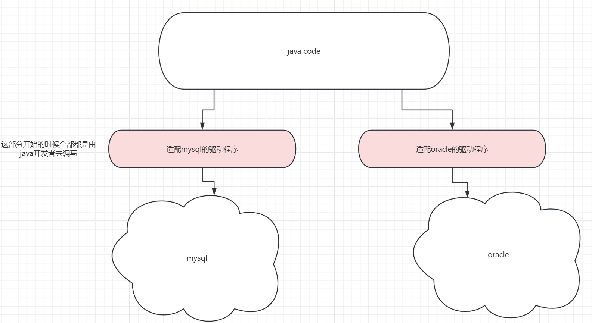
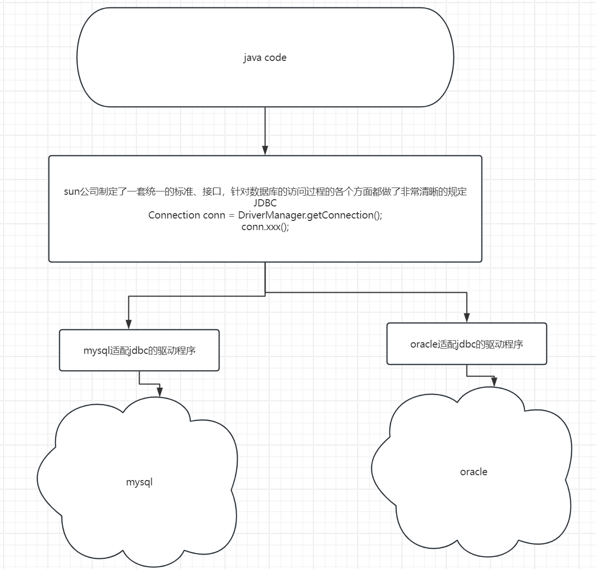
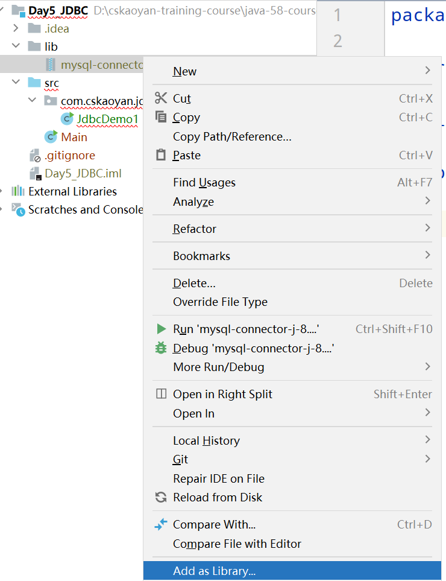
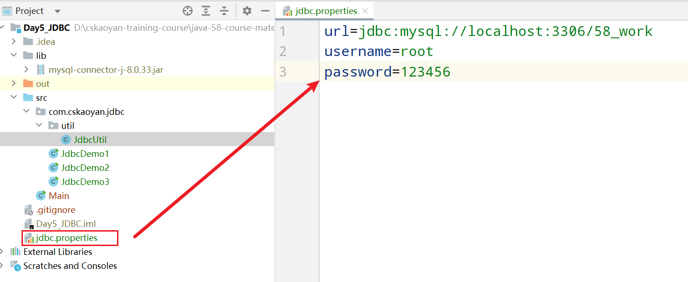

# Day5 JDBC


## 概念

JDBC全称其实叫做java database connectivity.便是使用java语言来访问连接数据库的方式。

> 在前面的课程中，我们都是使用命令行的方式来操作数据库，但是这个肯定不能够在企业中使用这种方式来进行开发工作。比如当前用户在注册页面中输入了信息，点击注册按钮，提交了注册信息，服务器需要做的事情便是将这些信息存储到数据库中。总不能安排一个程序员，自己用命令行方式去录入这些信息吧？
>
> 需要使用程序去访问数据库。

### 数据库访问过程

回顾一下，数据库通用的访问过程。

1.我们在命令行中输入mysql -u root -p 123456，背后发生了什么事情？当我们在控制台输入mysql指令时，实际上此时调用了mysql的客户端，mysql的客户端会向mysql服务器建立tcp连接(客户端ip地址、客户端端口号、服务器ip地址、服务器端口号)

2.进入到mysql的控制台之后，我们输入一条sql语句，背后发生了什么事情？mysql客户端会获取到我们输入的sql语句，将sql语句传输到mysql服务器，mysql服务器进行解析处理，将数据再次返回给客户端

3.当我们输入exit指令时，发生了什么事情呢？断开当前的连接。


既然mysql的通用访问方式如上所述，那么如果我们有办法能够自己编写一个客户端，然后将上述的这些过程进行封装， 那么能不能通过代码来访问数据库呢？所以，从理论上来说，是完全可行的。

### JDBC规范

只要我使用java语言编写一套驱动程序，那么便可以和数据库进行通讯。只要能够把sql语句传输给数据库，并且可以接收并解析数据库返回的数据内容，那么便可以正常和数据库进行通讯。

如果最开始的时候，我编写了一套驱动程序，可以和mysql数据库进行通讯；后续公司发展壮大之后，mysql数据库性能上有一些不足，此时我需要更换为使用oracle，那么是否意味着我需要重新编写一套驱动程序？是的，因为mysql和oracle其实是不同公司发明的产品，所以无法进行兼容很正常。

此时会有一个什么问题？对于使用java语言的创业公司来说，维护成本比较高；对于整个生态来说，也是不利的。基于这样的考虑，sun公司制定了一套统一的标准规范，叫做JDBC规范。本质来说，JDBC规范便是一套接口。由数据库的生产厂商来去适配，来去实现对应的驱动程序。

没有规范时：



有规范：开发者只需要面向接口编程即可。



所以，今后，如果我们使用java语言访问不同的数据库，那么其实只需要导入不同的驱动程序即可。


## JDBC入门案例

概括一下数据库的连接过程：

0.注册驱动---导包

如何导包？

1.在idea的项目中，新建一个lib目录，将jar包复制到lib目录中

2.点击右键，选择add as library.这一步操作的作用是将jar包添加到classpath目录中



> 类加载：
>
> 我们编写的是java代码，java代码能否直接运行？不可以，需要先进行编译，编译成class文件。
>
> 我们编译过后的class文件位于硬盘上面，但是这个代码如果想要运行，是否意味着需要进入到内存中？需要
>
> 那么我们的class文件是怎么进入到内存中的呢？是由类加载器负责将硬盘上面的class文件加载到内存中。
>
> 如果有一个第三方的jar包程序，如果我们希望运行该jar包里面的代码，你觉得应该怎么办？也要借助于类加载器负责将其加载到内存中。
>
> classpath和类加载器又有什么关联呢？classpath就是指的是类加载器默认会去加载类的位置。

1.获取连接

2.发送sql语句

3.解析结果

4.关闭连接

```java
public class JdbcDemo1 {

    public static void main(String[] args) {
        Connection connection = null;
        Statement statement = null;
        ResultSet resultSet = null;
        try {
            //0.导入驱动程序
            DriverManager.registerDriver(new Driver());
            //        1.获取连接 建立tcp连接 mysql -u root -p 提供信息：用户名、密码、服务器的ip地址、端口号
            connection = DriverManager.getConnection("jdbc:mysql://localhost:3306/58_work", "root", "123456");
            //        2.发送sql语句
            //在jdbc规范中，我们希望发送sql语句，则需要使用一个叫做statement对象
            statement = connection.createStatement();
            //statement专门用来去发送sql语句
            resultSet = statement.executeQuery("select * from mentor");
            //resultSet里面包含的便是我们需要的数据结果
            //对于开发者来说，我们需要做的事情便是去解析获取里面的数据
            //        3.解析结果
            //resultSet内部有一个结果集，相当于excel表格一样；内部有一个指针，默认指向第一行数据之前，移动一次指针，可以取出当前行数据
            //相当于移动一次指针
            resultSet.next();
            int id = resultSet.getInt("id");
            String name = resultSet.getString("name");
            String title = resultSet.getString("title");
            String direction = resultSet.getString("direction");
            System.out.println(id + " " + name + " " + title + " " + direction);

        } catch (SQLException e) {
            throw new RuntimeException(e);
        }finally {
            //        4.关闭连接 释放资源
            try {
                if(connection != null){
                    connection.close();
                }
                if(statement != null){
                    statement.close();
                }
                if(resultSet != null){
                    resultSet.close();
                }
            }catch (Exception e){

            }
        }
    }
}
```


## 入门案例优化

1.关于获取connection连接以及最终的关闭连接、释放资源等操作，在不同的场景中代码基本上都是完全一致的。所以我们希望可以将这部分代码进行优化。抽提一个工具类，调用工具类。

```java
public class JdbcUtil {

    //工具类里面的异常其实可以放心的抛出来，谁调用，谁处理这个异常
    //获取连接
    public static Connection getConnection() throws SQLException {
        DriverManager.registerDriver(new Driver());
        //获取连接 url:固定写法 jdbc协议  mysql子协议 localhost:3306服务器的ip地址以及端口号 /58_work指的是通讯的数据库
        Connection connection = DriverManager.getConnection("jdbc:mysql://localhost:3306/58_work", "root", "123456");
        return connection;
    }


    //释放资源
    public static void close(Connection connection, Statement statement, ResultSet resultSet) throws SQLException {
        if(connection != null){
            connection.close();
        }
        if(statement != null){
            statement.close();
        }
        if(resultSet != null){
            resultSet.close();
        }
    }
}

```


```java
public class JdbcDemo3 {

    public static void main(String[] args) {
        //关于jdbc的过程，希望大家能够做到非常非常熟练
        //1注册驱动
        Connection connection = null;
        Statement statement = null;
        ResultSet resultSet = null;
        try {
            //发送sql语句
            connection  = JdbcUtil.getConnection();
            statement = connection.createStatement();
            resultSet = statement.executeQuery("select * from student");
            //解析结果集
            resultSet.next();
            int id = resultSet.getInt("id");
            String name = resultSet.getString("name");
            int gender = resultSet.getInt("gender");
            Date entryDate = resultSet.getDate("entry_date");
            int mid = resultSet.getInt("mid");
            System.out.println(id + " " + name + " " + gender + " " + entryDate + " " + mid);
        } catch (SQLException e) {
            throw new RuntimeException(e);
        }finally {
            //关闭连接
            try {
                JdbcUtil.close(connection,statement, resultSet);
            }catch (Exception e){

            }

        }
    }
}
```


2.关于获取连接的各种配置信息，其实可以将这部分信息写到配置文件中，从配置文件中统一地进行读取。properties配置文件。



后续需要去读取该配置文件里面的数据。

```java
public class JdbcUtil {

    private static String url;

    private static String username;

    private static String password;

    static {
        //因为properties配置文件的改动并没有那么地频繁，所以不用每次获取连接时都去读取一遍
        Properties properties = new Properties();
        try {
            properties.load(new FileInputStream("jdbc.properties"));
        } catch (IOException e) {
            throw new RuntimeException(e);
        }
        url = properties.getProperty("url");
        username = properties.getProperty("username");
        password = properties.getProperty("password");
    }

    //工具类里面的异常其实可以放心的抛出来，谁调用，谁处理这个异常
    //获取连接
    public static Connection getConnection() throws SQLException {


        DriverManager.registerDriver(new Driver());
        //获取连接 url:固定写法 jdbc协议  mysql子协议 localhost:3306服务器的ip地址以及端口号 /58_work指的是通讯的数据库
        Connection connection = DriverManager.getConnection(url, username, password);
        return connection;
    }


    //释放资源
    public static void close(Connection connection, Statement statement, ResultSet resultSet) throws SQLException {
        if(connection != null){
            connection.close();
        }
        if(statement != null){
            statement.close();
        }
        if(resultSet != null){
            resultSet.close();
        }
    }
}
```

但是如果更换数据库，此时还有一处需要变动(**希望的效果：更换数据库，那么只需要去修改数据库的连接信息以及导包即可，代码无需变动**)

```java
DriverManager.registerDriver(new Driver());
```

通过去查看Driver类的源码，可以发现内部有一个static代码块，里面调用了注册驱动的代码。所以其实我们不需要自己主动去注册驱动，只要能够让static代码块被调用即可。

```java
public class Driver extends NonRegisteringDriver implements java.sql.Driver {
    public Driver() throws SQLException {
    }

    static {
        try {
            DriverManager.registerDriver(new Driver());
        } catch (SQLException var1) {
            throw new RuntimeException("Can't register driver!");
        }
    }
}
```


