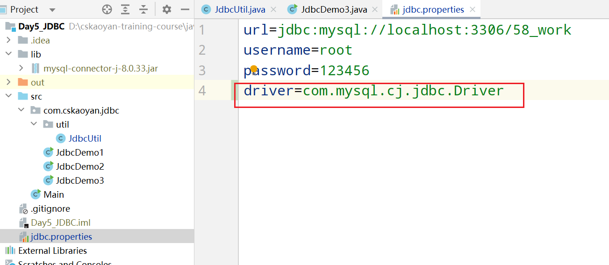
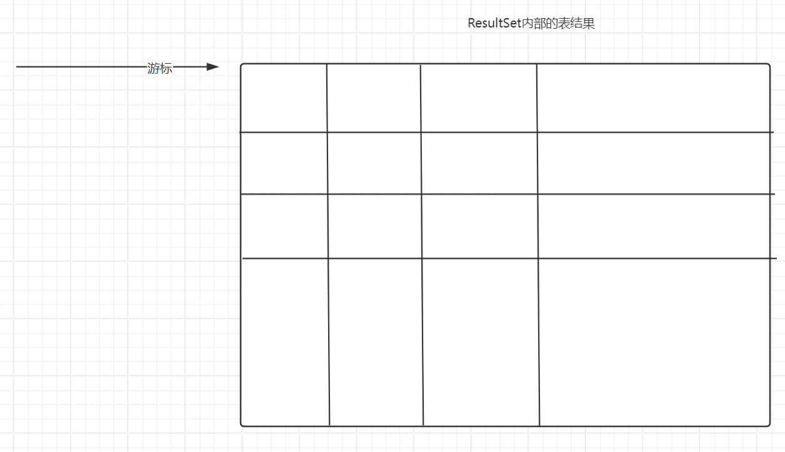
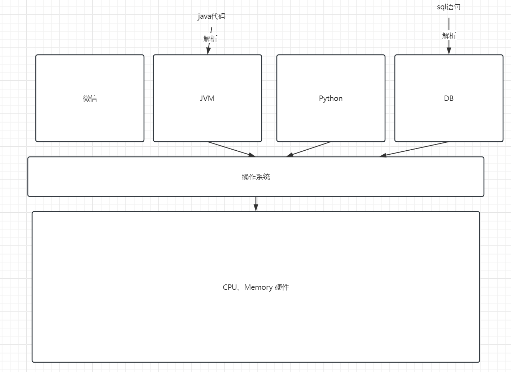
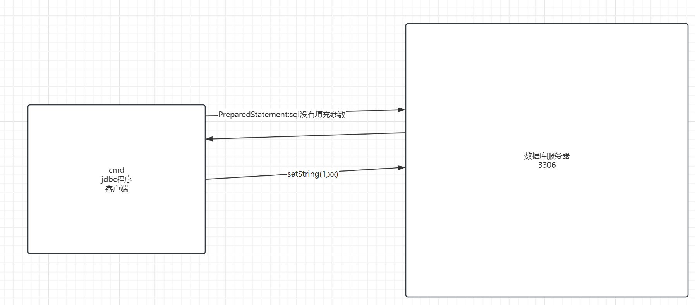

# Day5 JDBC


## 概念

JDBC全称其实叫做java database connectivity.便是使用java语言来访问连接数据库的方式。

> 在前面的课程中，我们都是使用命令行的方式来操作数据库，但是这个肯定不能够在企业中使用这种方式来进行开发工作。比如当前用户在注册页面中输入了信息，点击注册按钮，提交了注册信息，服务器需要做的事情便是将这些信息存储到数据库中。总不能安排一个程序员，自己用命令行方式去录入这些信息吧？
>
> 需要使用程序去访问数据库。

### 数据库访问过程

回顾一下，数据库通用的访问过程。

1.我们在命令行中输入mysql -u root -p 123456，背后发生了什么事情？当我们在控制台输入mysql指令时，实际上此时调用了mysql的客户端，mysql的客户端会向mysql服务器建立tcp连接(客户端ip地址、客户端端口号、服务器ip地址、服务器端口号)

2.进入到mysql的控制台之后，我们输入一条sql语句，背后发生了什么事情？mysql客户端会获取到我们输入的sql语句，将sql语句传输到mysql服务器，mysql服务器进行解析处理，将数据再次返回给客户端

3.当我们输入exit指令时，发生了什么事情呢？断开当前的连接。


既然mysql的通用访问方式如上所述，那么如果我们有办法能够自己编写一个客户端，然后将上述的这些过程进行封装， 那么能不能通过代码来访问数据库呢？所以，从理论上来说，是完全可行的。

### JDBC规范

只要我使用java语言编写一套驱动程序，那么便可以和数据库进行通讯。只要能够把sql语句传输给数据库，并且可以接收并解析数据库返回的数据内容，那么便可以正常和数据库进行通讯。

如果最开始的时候，我编写了一套驱动程序，可以和mysql数据库进行通讯；后续公司发展壮大之后，mysql数据库性能上有一些不足，此时我需要更换为使用oracle，那么是否意味着我需要重新编写一套驱动程序？是的，因为mysql和oracle其实是不同公司发明的产品，所以无法进行兼容很正常。

此时会有一个什么问题？对于使用java语言的创业公司来说，维护成本比较高；对于整个生态来说，也是不利的。基于这样的考虑，sun公司制定了一套统一的标准规范，叫做JDBC规范。本质来说，JDBC规范便是一套接口。由数据库的生产厂商来去适配，来去实现对应的驱动程序。

没有规范时：


有规范：开发者只需要面向接口编程即可。


所以，今后，如果我们使用java语言访问不同的数据库，那么其实只需要导入不同的驱动程序即可。


## JDBC入门案例

概括一下数据库的连接过程：

0.注册驱动---导包

如何导包？

1.在idea的项目中，新建一个lib目录，将jar包复制到lib目录中

2.点击右键，选择add as library.这一步操作的作用是将jar包添加到classpath目录中


> 类加载：
>
> 我们编写的是java代码，java代码能否直接运行？不可以，需要先进行编译，编译成class文件。
>
> 我们编译过后的class文件位于硬盘上面，但是这个代码如果想要运行，是否意味着需要进入到内存中？需要
>
> 那么我们的class文件是怎么进入到内存中的呢？是由类加载器负责将硬盘上面的class文件加载到内存中。
>
> 如果有一个第三方的jar包程序，如果我们希望运行该jar包里面的代码，你觉得应该怎么办？也要借助于类加载器负责将其加载到内存中。
>
> classpath和类加载器又有什么关联呢？classpath就是指的是类加载器默认会去加载类的位置。

1.获取连接

2.发送sql语句

3.解析结果

4.关闭连接

```java
public class JdbcDemo1 {

    public static void main(String[] args) {
        Connection connection = null;
        Statement statement = null;
        ResultSet resultSet = null;
        try {
            //0.导入驱动程序
            DriverManager.registerDriver(new Driver());
            //        1.获取连接 建立tcp连接 mysql -u root -p 提供信息：用户名、密码、服务器的ip地址、端口号
            connection = DriverManager.getConnection("jdbc:mysql://localhost:3306/58_work", "root", "123456");
            //        2.发送sql语句
            //在jdbc规范中，我们希望发送sql语句，则需要使用一个叫做statement对象
            statement = connection.createStatement();
            //statement专门用来去发送sql语句
            resultSet = statement.executeQuery("select * from mentor");
            //resultSet里面包含的便是我们需要的数据结果
            //对于开发者来说，我们需要做的事情便是去解析获取里面的数据
            //        3.解析结果
            //resultSet内部有一个结果集，相当于excel表格一样；内部有一个指针，默认指向第一行数据之前，移动一次指针，可以取出当前行数据
            //相当于移动一次指针
            resultSet.next();
            int id = resultSet.getInt("id");
            String name = resultSet.getString("name");
            String title = resultSet.getString("title");
            String direction = resultSet.getString("direction");
            System.out.println(id + " " + name + " " + title + " " + direction);

        } catch (SQLException e) {
            throw new RuntimeException(e);
        }finally {
            //        4.关闭连接 释放资源
            try {
                if(connection != null){
                    connection.close();
                }
                if(statement != null){
                    statement.close();
                }
                if(resultSet != null){
                    resultSet.close();
                }
            }catch (Exception e){

            }
        }
    }
}
```


## 入门案例优化

1.关于获取connection连接以及最终的关闭连接、释放资源等操作，在不同的场景中代码基本上都是完全一致的。所以我们希望可以将这部分代码进行优化。抽提一个工具类，调用工具类。

```java
public class JdbcUtil {

    //工具类里面的异常其实可以放心的抛出来，谁调用，谁处理这个异常
    //获取连接
    public static Connection getConnection() throws SQLException {
        DriverManager.registerDriver(new Driver());
        //获取连接 url:固定写法 jdbc协议  mysql子协议 localhost:3306服务器的ip地址以及端口号 /58_work指的是通讯的数据库
        Connection connection = DriverManager.getConnection("jdbc:mysql://localhost:3306/58_work", "root", "123456");
        return connection;
    }


    //释放资源
    public static void close(Connection connection, Statement statement, ResultSet resultSet) throws SQLException {
        if(connection != null){
            connection.close();
        }
        if(statement != null){
            statement.close();
        }
        if(resultSet != null){
            resultSet.close();
        }
    }
}

```


```java
public class JdbcDemo3 {

    public static void main(String[] args) {
        //关于jdbc的过程，希望大家能够做到非常非常熟练
        //1注册驱动
        Connection connection = null;
        Statement statement = null;
        ResultSet resultSet = null;
        try {
            //发送sql语句
            connection  = JdbcUtil.getConnection();
            statement = connection.createStatement();
            resultSet = statement.executeQuery("select * from student");
            //解析结果集
            resultSet.next();
            int id = resultSet.getInt("id");
            String name = resultSet.getString("name");
            int gender = resultSet.getInt("gender");
            Date entryDate = resultSet.getDate("entry_date");
            int mid = resultSet.getInt("mid");
            System.out.println(id + " " + name + " " + gender + " " + entryDate + " " + mid);
        } catch (SQLException e) {
            throw new RuntimeException(e);
        }finally {
            //关闭连接
            try {
                JdbcUtil.close(connection,statement, resultSet);
            }catch (Exception e){

            }

        }
    }
}
```


2.关于获取连接的各种配置信息，其实可以将这部分信息写到配置文件中，从配置文件中统一地进行读取。properties配置文件。


后续需要去读取该配置文件里面的数据。

```java
public class JdbcUtil {

    private static String url;

    private static String username;

    private static String password;

    static {
        //因为properties配置文件的改动并没有那么地频繁，所以不用每次获取连接时都去读取一遍
        Properties properties = new Properties();
        try {
            properties.load(new FileInputStream("jdbc.properties"));
        } catch (IOException e) {
            throw new RuntimeException(e);
        }
        url = properties.getProperty("url");
        username = properties.getProperty("username");
        password = properties.getProperty("password");
    }

    //工具类里面的异常其实可以放心的抛出来，谁调用，谁处理这个异常
    //获取连接
    public static Connection getConnection() throws SQLException {


        DriverManager.registerDriver(new Driver());
        //获取连接 url:固定写法 jdbc协议  mysql子协议 localhost:3306服务器的ip地址以及端口号 /58_work指的是通讯的数据库
        Connection connection = DriverManager.getConnection(url, username, password);
        return connection;
    }


    //释放资源
    public static void close(Connection connection, Statement statement, ResultSet resultSet) throws SQLException {
        if(connection != null){
            connection.close();
        }
        if(statement != null){
            statement.close();
        }
        if(resultSet != null){
            resultSet.close();
        }
    }
}
```

但是如果更换数据库，此时还有一处需要变动(**希望的效果：更换数据库，那么只需要去修改数据库的连接信息以及导包即可，代码无需变动**)

```java
DriverManager.registerDriver(new Driver());
```

通过去查看Driver类的源码，可以发现内部有一个static代码块，里面调用了注册驱动的代码。所以其实我们不需要自己主动去注册驱动，只要能够让static代码块被调用即可。

```java
public class Driver extends NonRegisteringDriver implements java.sql.Driver {
    public Driver() throws SQLException {
    }

    static {
        try {
            DriverManager.registerDriver(new Driver());
        } catch (SQLException var1) {
            throw new RuntimeException("Can't register driver!");
        }
    }
}
```

我们实际上只需要让Driver类里面的static代码块能够被调用即可，因为里面会包含注册驱动。如何让static代码库被调用呢？利用反射加载当前类。

Class.forName(com.mysql.cj.jdbc.Driver);因为里面写的是全限定类名，所以可以将这部分写到配置文件中去，从配置文件中去读取。

**最终的形式**：



```java
public class JdbcUtil {

    private static String url;

    private static String username;

    private static String password;

    //新增的部分
    private static String driver;

    static {
        //因为properties配置文件的改动并没有那么地频繁，所以不用每次获取连接时都去读取一遍
        Properties properties = new Properties();
        try {
            properties.load(new FileInputStream("jdbc.properties"));
        } catch (IOException e) {
            throw new RuntimeException(e);
        }
        url = properties.getProperty("url");
        username = properties.getProperty("username");
        password = properties.getProperty("password");
        driver = properties.getProperty("driver");
    }

    //工具类里面的异常其实可以放心的抛出来，谁调用，谁处理这个异常
    //获取连接
    public static Connection getConnection() throws SQLException {


        //todo 如果由使用mysql更换为使用oracle，那么不仅上述的url、username、password需要变动，driver也需要变动
//        DriverManager.registerDriver(new Driver());
        try {
            Class.forName(driver);
        } catch (ClassNotFoundException e) {
            throw new RuntimeException(e);
        }
        //获取连接 url:固定写法 jdbc协议  mysql子协议 localhost:3306服务器的ip地址以及端口号 /58_work指的是通讯的数据库
        Connection connection = DriverManager.getConnection(url, username, password);
        return connection;
    }


    //释放资源
    public static void close(Connection connection, Statement statement, ResultSet resultSet) throws SQLException {
        if(connection != null){
            connection.close();
        }
        if(statement != null){
            statement.close();
        }
        if(resultSet != null){
            resultSet.close();
        }
    }
}
```


## JDBC对象详解

### DriverManager

驱动管理器，主要的功能有两个：1.注册驱动  2.获取连接

注册驱动

```java
//但是需要注意的是这里面new的Driver必须是实现类，不可以是jdbc中的规范接口
DriverManager.registerDriver(new Driver());
//实际上，后面我们并不会直接去写这部分代码，而是通过下面的代码来代替
//为什么能够代替上述代码呢？因为com.mysql.cj.jdbc.Driver内部有一个static代码块，当我们运行下面代码时，会触发static代码块，代码块里面会进行驱动的注册
Class.forName("com.mysql.cj.jdbc.Driver");
```

获取连接

```java
//这行代码你可以理解为就是对于 mysql -u root -p 这条指令的封装
Connection conn = DriverManager.getConnection(url,username,password);
```

其中关于获取连接中url部分的写法：它是一个相对固定的写法，并且使用不同的数据库，写法不是完全相同的，对于大家的要求是尽量熟悉mysql数据库连接信息的写法

url=jdbc:mysql://localhost:3306/db_name

其中关于url的后面还是可以去拼接一些参数的。比如常见的设置字符集的参数信息。

jdbc:mysql://localhost:3306/db_name?characterEncoding=utf-8&useUnicode=true&useSSL=false

useSSL=false表示的是不使用https进行连接。也就是用不用证书。

### Connection

其实就是指的是客户端和数据库之间建立的一个连接的抽象封装。比如，之前使用命令行输入mysql -u root -p之后，便进入到了一个mysql的会话窗口，那个便是一个连接。

Connection的功能只要如下：

1.获取操作sql语句的Statement对象

```java

Statement smt = connection.createStatement();

//下面这个和上面的是父子关系，功能非常接近
PreparedSatatement psmt = connection.prepareStatement();
```


2.事务相关操作(TBD)


### Statement

主要的功能是用来发送sql语句

```java
//这个方法只可以用于进行查询操作，不可以进行增删改
ResultSet rs = statement.executeQuery(sql);

//如果希望进行增删改操作，则需要使用下面的方法;返回值表示的是影响的行数
int rows = statement.executeUpdate(sql);
```


### ResultSet

表示的是结果集，改对象内部相当于封装了一个表格。内部会有一个游标、指针，默认情况下是指向第一行数据之前。

当我们调用一次next()方法，那么游标会移动一次，会把这一行对应的数据获取到，所以，如果我希望获取全部的数据，应该怎么办？

循环往复去调用next方法

```java
public class ResultSetDemo {

    public static void main(String[] args) {
        Connection connection = null;
        Statement statement = null;
        ResultSet resultSet = null;
        try {
            connection = JdbcUtil.getConnection();
            statement = connection.createStatement();
            resultSet = statement.executeQuery("select * from student");
            //改方法返回值类型为boolean，表示的是是否有下一行数据
//            resultSet.next()
            //新增的部分代码
            while (resultSet.next()){
                //resultSet.next()和iterator的方法非常类似，只不过相较于iterator更加简单，只需要调用next这一个方法即可
                int id = resultSet.getInt("id");
                String name = resultSet.getString("name");
                System.out.println(id + " " + name);
            }
        } catch (SQLException e) {
            throw new RuntimeException(e);
        }finally {
            try {
                JdbcUtil.close(connection,statement,resultSet);
            } catch (SQLException e) {
                throw new RuntimeException(e);
            }
        }
    }
}
```




说明：

Connection、Statement、ResultSet对象，这些对象应当在使用完之后及时地进行关闭，释放资源。**尤其是Connection对象，它是一个非常稀缺的资源，应当遵循尽量晚创建，尽量早释放的原则**。


## 增删改查

使用JDBC来进行数据库的增晒改查操作。

### 新增

```java
public class InsertDemo {

    public static void main(String[] args) {
        Connection connection = null;
        Statement statement = null;
        try {
            connection = JdbcUtil.getConnection();
            statement = connection.createStatement();
            //里面写入insert语句
            int rows = statement.executeUpdate("insert into student(id,name) values (null,'阿齐')");
            System.out.println(rows);
        } catch (SQLException e) {
            throw new RuntimeException(e);
        }finally {
            try {
                JdbcUtil.close(connection, statement, null);
            } catch (SQLException e) {
                throw new RuntimeException(e);
            }
        }

    }
}
```


### 删除

```java
public class DeleteDemo {

    public static void main(String[] args) {
        Connection connection = null;
        Statement statement = null;
        try {
            connection = JdbcUtil.getConnection();
            statement = connection.createStatement();
            int rows = statement.executeUpdate("delete from student where id = 7");
        } catch (SQLException e) {
            throw new RuntimeException(e);
        }finally {
            try {
                JdbcUtil.close(connection, statement, null);
            } catch (SQLException e) {
                throw new RuntimeException(e);
            }
        }

    }
}
```


### 修改

```java
public class UpdateDemo {

    public static void main(String[] args) {
        Connection connection = null;
        Statement statement = null;
        try {
            connection = JdbcUtil.getConnection();
            statement = connection.createStatement();
            int i = statement.executeUpdate("update student set name='kongling' where id = 6");
            System.out.println(i);
        } catch (SQLException e) {
            throw new RuntimeException(e);
        }finally {
            try {
                JdbcUtil.close(connection, statement, null);
            } catch (SQLException e) {
                throw new RuntimeException(e);
            }
        }
    }
}
```


### 查询

在查询的时候，会调用resultSet.getXXX()方法，那么应当调用哪个方法呢？

实际上，关于数据库的数据类型和java的数据类型以及jdbc中的getXXX方法有一个对应关系：


```java
public class QueryDemo {

    public static void main(String[] args) {
        Connection connection = null;
        Statement statement = null;
        ResultSet resultSet = null;
        try {
            connection = JdbcUtil.getConnection();
            statement = connection.createStatement();
            resultSet = statement.executeQuery("select * from student where id >= 2");
            //查询全部的数据
            while (resultSet.next()){
                //是否有下一行数据，和iterator的用法基本是一致的，只不过比iterator少调用一个方法
                int id = resultSet.getInt("id");
                String name = resultSet.getString("name");
                int gender = resultSet.getInt("gender");
                Date entryDate = resultSet.getDate("entry_date");
                int mid = resultSet.getInt("mid");
                System.out.println(id + "`" + name + "`" + gender + "`" + entryDate + "`" + mid + "`");
            }
        } catch (SQLException e) {
            throw new RuntimeException(e);
        }finally {
            try {
                JdbcUtil.close(connection, statement, resultSet);
            } catch (SQLException e) {
                throw new RuntimeException(e);
            }
        }
    }
}
```

小案例：

希望大家去新建一个Student类，将数据库查询出来的数据封装成为List<Student>集合类型。

```java
public class QueryDemo {

    public static void main(String[] args) {
        Connection connection = null;
        Statement statement = null;
        ResultSet resultSet = null;
        List<Student> studentList = new ArrayList<>();
        try {
            connection = JdbcUtil.getConnection();
            statement = connection.createStatement();
            resultSet = statement.executeQuery("select * from student where id >= 2");
            //查询全部的数据
            while (resultSet.next()){
                //是否有下一行数据，和iterator的用法基本是一致的，只不过比iterator少调用一个方法
                int id = resultSet.getInt("id");
                String name = resultSet.getString("name");
                int gender = resultSet.getInt("gender");
                Date entryDate = resultSet.getDate("entry_date");
                int mid = resultSet.getInt("mid");
                studentList.add(new Student(id, name, gender, entryDate, mid));
                System.out.println(id + "`" + name + "`" + gender + "`" + entryDate + "`" + mid + "`");
            }
        } catch (SQLException e) {
            throw new RuntimeException(e);
        }finally {
            try {
                JdbcUtil.close(connection, statement, resultSet);
            } catch (SQLException e) {
                throw new RuntimeException(e);
            }
        }
        //后续可以进一步去处理studentList里面的数据
    }
}
```

## Sql注入问题

先使用一个案例，演示一个现象，利用这个现象给大家讲解sql注入问题。

写一个案例，来模拟用户的登录行为，用户输入用户名、密码信息，传输到数据库之后，数据库需要对用户的用户名、密码进行校验。

> JDBC过程中遇到问题，应该如何解决？
>
> 需要排除究竟是sql语句本身的问题还是jdbc过程的问题。怎么办？
>
> 有一个比较容易量化的方式，那就是直接将sql语句放到命令行中去执行，如果有问题，那么便是sql语句有问题；如果没有问题，那么便是jdbc过程中有问题。

输入注释中写出来的密码，会导致sql注入问题。何为sql注入问题呢？

用户输入的一些字符被当做了sql的关键字来进行解析；产生了一些和业务本身无关的操作。比如额外进行了查询，甚至严重产生了删除修改操作等。xxxx;delete from user;

对于系统来说，是一个极大的风险。

如何避免sql注入问题呢？

```java
public class MockLogin {

    public static void main(String[] args) {
        //模拟用户的登录行为
        //使用scanner来模拟用户输入的用户名、密码信息
        Scanner scanner = new Scanner(System.in);
        //去构造一个伪造的用户名、密码信息，用户名随便写；密码 : 1234' or '1' = '1
        String username = scanner.nextLine();
        String password = scanner.nextLine();


        //获取到了用户输入的用户名、密码，需要校验用户名、密码是否匹配
        //select * from user where username = xxx and password = xxx
        Connection connection = null;
        Statement statement = null;
        ResultSet resultSet = null;
        try {
            connection = JdbcUtil.getConnection();
            statement = connection.createStatement();
            String sql = "select * from user where name = '" + username + "' and password = '" + password + "'";
            System.out.println(sql);
            resultSet = statement.executeQuery(sql);
            if(resultSet.next()){
                //用户名、密码匹配
                System.out.println("用户名密码匹配");
            }else {
                //用户名、密码不匹配
                System.out.println("用户名密码错误");
            }
        } catch (SQLException e) {
            throw new RuntimeException(e);
        }finally {
            try {
                JdbcUtil.close(connection, statement, resultSet);
            } catch (SQLException e) {
                throw new RuntimeException(e);
            }
        }

    }
}

```

sql注入问题产生的根源？

回顾一下数据库执行sql语句的过程：客户端将sql语句传递给数据库服务器，数据库会对这条sql语句进行解析处理，解析成为一个机器语言(最终一个功能的调用，最终肯定是调用了操作系统的某个方法，操作系统又向硬件申请了对应的权限)。**sql注入产生的根源是否就是用户输入的一些字符被当做了sql的关键字进行了解析，产生了意想不到的功能。**如果我希望避免sql注入问题，那是否意味着我不把用户输入的这些字符进行解析就可以了？？？？？？

所以，我们可以这么去做：

**1.先将用户输入参数的位置先用占位符先占着，把没有填充参数的sql语句先发送到数据库进行解析操作**

**2.再填充上对应的参数(用户输入的参数)**



```java
//解决sql注入问题
public class MockLogin2 {

    public static void main(String[] args) {
        //模拟用户的登录行为
        //使用scanner来模拟用户输入的用户名、密码信息
        Scanner scanner = new Scanner(System.in);
        //去构造一个伪造的用户名、密码信息，用户名随便写；密码 : 1234' or '1' = '1
        String username = scanner.nextLine();
        String password = scanner.nextLine();


        //获取到了用户输入的用户名、密码，需要校验用户名、密码是否匹配
        //select * from user where username = xxx and password = xxx
        Connection connection = null;
        PreparedStatement preparedStatement = null;
        ResultSet resultSet = null;
        try {
            connection = JdbcUtil.getConnection();
//            connection.createStatement();
            //为什么prepareStatement需要提供一个sql，而createStatement不需要？原因在于prepareStatement需要进行预编译
            //先创建一个preparedStatement，第一次通讯：将sql语句发送到数据库进行预编译
           preparedStatement = connection.prepareStatement("select * from user where name = ? and password = ?");
            //第二次通讯：再次填充对应的参数信息
           preparedStatement.setString(1, username);
           preparedStatement.setString(2, password);
           resultSet = preparedStatement.executeQuery();
            if(resultSet.next()){
                //用户名、密码匹配
                System.out.println("用户名密码匹配");
            }else {
                //用户名、密码不匹配
                System.out.println("用户名密码错误");
            }
        } catch (SQLException e) {
            throw new RuntimeException(e);
        }finally {
            try {
                JdbcUtil.close(connection, preparedStatement, resultSet);
            } catch (SQLException e) {
                throw new RuntimeException(e);
            }
        }

    }
}
```

使用预编译的statement对象，也就是**preparedStatement会执行一次操作，和数据库通讯两次，相较于statement有一些劣势，但是它带来了安全上的提升，所以是非常有必要的**。



**所以，今后开发过程中，尽量去写PreparedStatement**。

