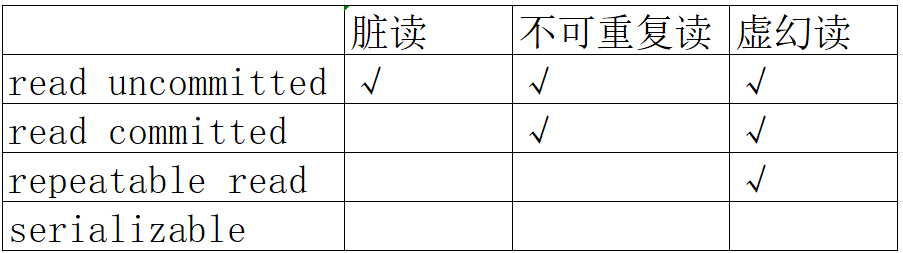
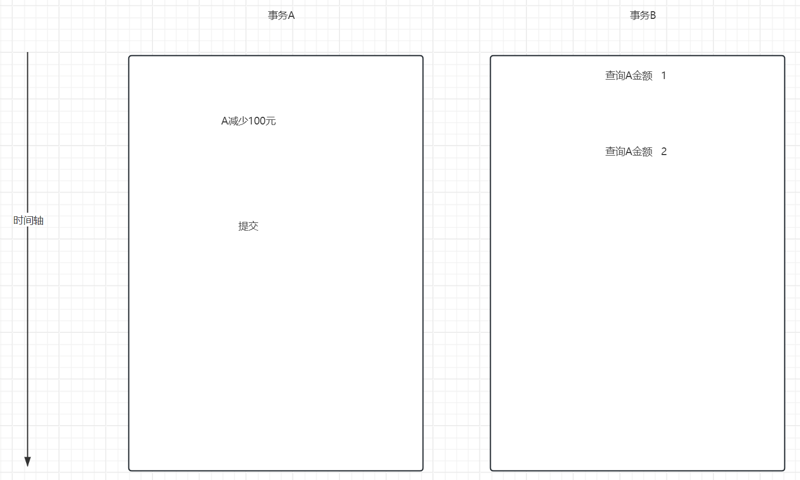
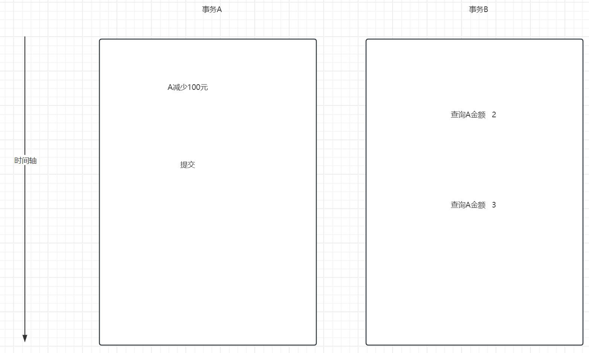
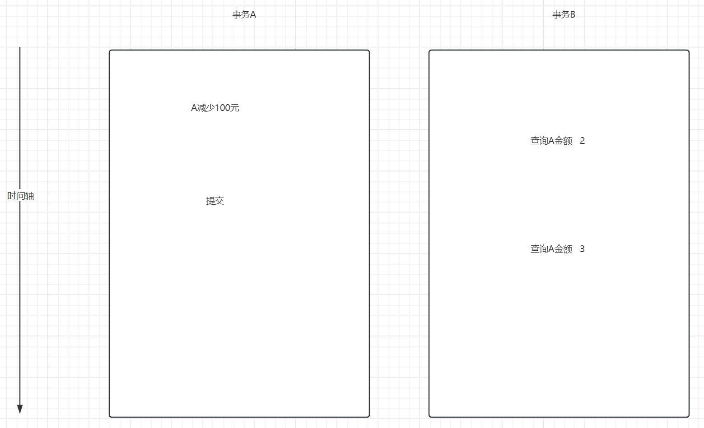
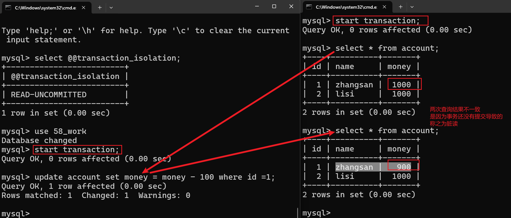
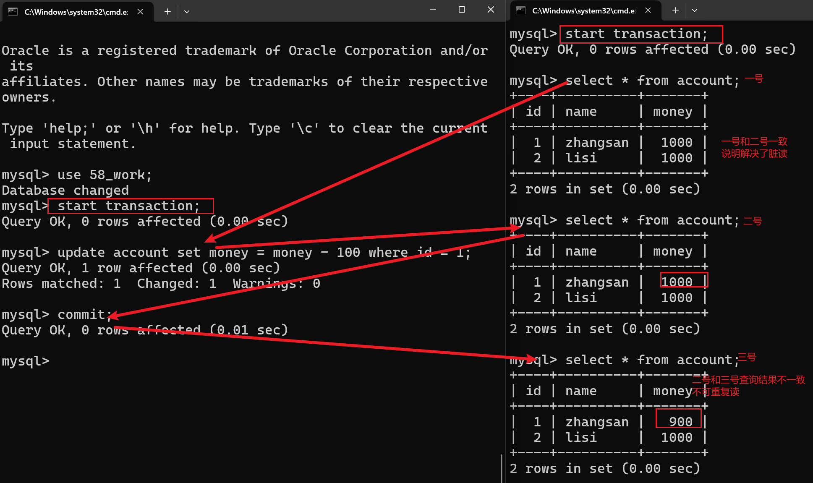
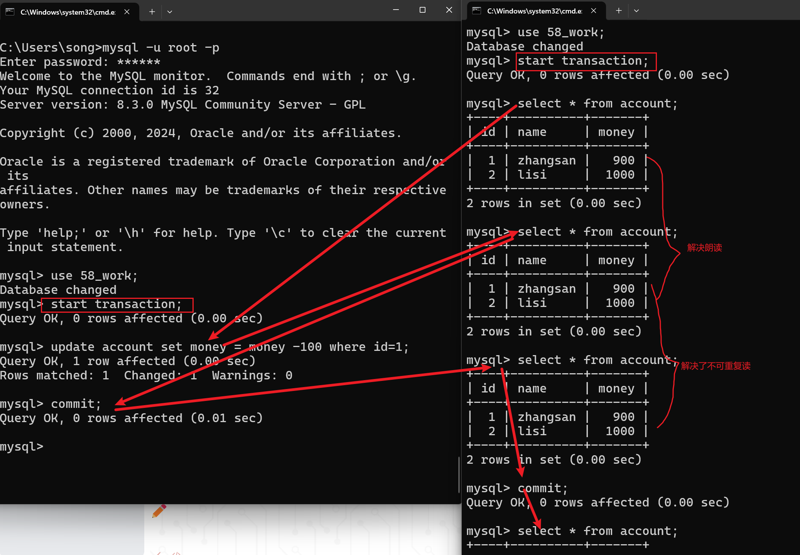
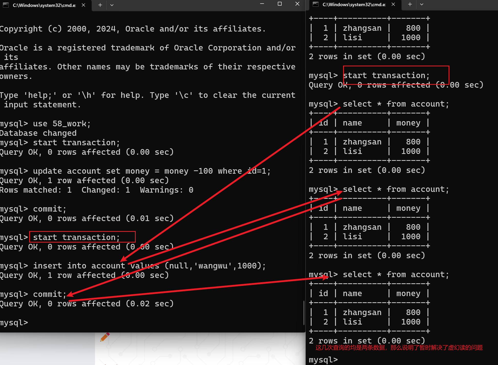

# Day6 TX

## 概念

事务：指的是组成这个操作的若干个单元，要么全部成功，要么全部不成功，不可以有第三种状态。

非常典型的一个案例便是转账。事务其实就是用来保障多个操作必须要同时成功，同时失败，不可以有第三种中间状态。


## 特点

事务具有以下几个特点：

ACID

原子性Atomic：组成事务的这一个操作是一个不可分割的最小单元。必须遵守一致的状态。

一致性Consistency：事务必须使得数据库从一个一致性状态转变成另一个一致性状态。比如甲乙双方刚开始的时候二人金额总和是2000元，经过若干次转账之后，二人的金额总和依然需要保持2000元（不存在手续费）

**隔离性Isolation**：多个事务访问数据库时，彼此之间互不干扰，称之为隔离性。数据库可以设置不同的隔离级别，使得不同的事务所能够看到的内容是不同的。

持久性Duration：事务一旦提交，对于数据库的修改应当是永久的。


其中上述四个特性中，又以隔离性最为重要。隔离性又会引出两个概念：

隔离级别：数据库设置不同程度的隔离，使得不同的事务能够看到的内容是不同的。隔离级别分为：read uncommitted、read committed、repeatable read、serializable

隔离问题：因为隔离级别设置的不同，那么事务之间所看到的内容也是不同的，会有一定的影响，这些影响称之为隔离问题。脏读、不可重复度、虚幻读

sql标准委员会针对上述提及的隔离级别以及隔离问题是有一个标准的：

需要特别指出一点，mysql的repeatable read的隔离级别和sql标准委员会设定的标准规范略有一些不同，它似乎解决了虚幻读的问题，但是似乎又没有彻底地解决。



### 隔离问题

脏读：一个事务读取到了另外一个事务没有提交的数据，称之为脏读。

不可重复读：一个事务在事务内进行两次查询，读取的结果不一致，和脏读的区别在于它读取到的事务已经提交的数据。

虚幻读：一个事务在前后两次进行了查询，查询到的记录数不一致（数目不一致）


不同的隔离级别分别是用于去解决不同的隔离问题，如上图所示。

需要特别指出一点，mysql的repeatable read的隔离级别和sql标准委员会设定的标准规范略有一些不同，它似乎解决了虚幻读的问题，但是似乎又没有彻底地解决。


脏读：

查询1和查询2查询到的金额不一致，原因是由于事务A还没有提交导致的，这个称之为脏读。




不可重复读：

查询2和查询3查询到的结果不一致，是由于提交了事务导致的。称之为不可重复读。




虚幻读：

前后两次进行查询，查询的记录数目不一致。第一次查询9条数据，第二次查询10条数据。

查询2和查询3进行两次数量的统计，两次查询出来的数量不一致，称之为虚幻读问题。




## 代码演示

事务操作的sql语句：

开启事务  start transaction


提交事务 commit


回顾事务 rollback


查看当前数据库的隔离级别

select @@transaction_isolation;


设置数据库的隔离级别

set global transaction isolation level read uncommitted;

> 之前我们没有写这些指令，直接去编写对应的update语句执行，多条sql语句之间没有任何关联，一条sql语句的执行成功与否和另外一条sql语句执行的成功与否没有任何关系。
>
> 如果希望将多条sql语句保障同时成功、同时失败，那么必须得放置在一个事务中。如何放置在一个事务中呢？
>
> 用start transaction.........commit/rollback包裹起来

```sql
 create table account(id int primary key auto_increment, name varchar(20), money double);
 
 insert into account values (null,'zhangsan',1000);
 insert into account values (null,'lisi',1000);
```


### 脏读演示

set global transaction isolation level read uncommitted;

1.设置当前数据库的隔离级别，但是要注意的是，一定要把当前的连接关闭了重新再连接才会生效。

2.需要开启两个cmd窗口，用来去模拟两个事务操作




### 不可重复读演示

set global transaction isolation level read committed;

设置数据库全局的隔离级别为read committed，在该隔离级别下，会解决脏读，但是依然会出现不可重复读。

> 关于不可重复读的讨论
>
> 不可重复读会出现在一个事务内前后两次查询结果不一致的情况。如果你要求数据的一致性，那么我们可以将隔离级别稍微调大一点，解决不可重复读问题；
>
> 如果你希望保证数据的最新时效性，那么可以让其出现不可重复读问题，但是此时数据的一致性便会受到影响。所以需要我们开发过程中进行评估，你究竟是想要时效性还是一致性。




### 虚幻读演示

set global transaction isolation level repeatable read.

演示解决了不可重复读



演示虚幻读：




## JDBC事务

上述是给大家介绍了如何使用命令行来操作事务。在开发过程中，我们需要使用代码来完成事务操作功能。

JDBC事务其实本质上来说，便是对于事务sql指令的进一步封装。

start transaction----------connection.setAutoCommit(false)

commit----------------connection.commit()

rollback----------------connection.rollback()


案例：使用JDBC来完成转账案例


