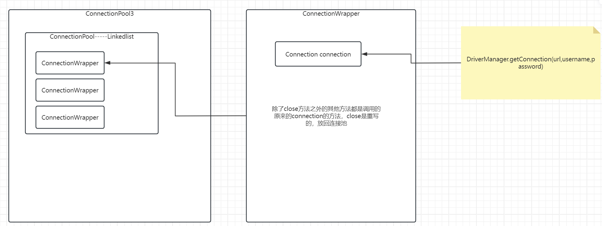

# Day7 ConnectionPool

## 概念

在前面的课程中，我们有提及过，数据库的连接是一个非常稀缺的资源。尽量遵循着晚创建、早释放的原则。数据库的连接创建过程也是比较消耗性能、消耗资源的步骤，如果在某一个时间点，大量的请求去访问数据库，创建多个连接，极易容易导致系统的宕机。所以基于上面这两部分考虑，我们引入了数据库连接池。

数据库连接池是什么？在系统空闲的时候，预先先将数据库的连接创建出来，等后续使用时，直接从池子中取出来一个连接来使用，而不是去创建。因为如果并发比较多的情况下，去创建很容易导致系统的宕机。

为什么要使用它？提升操作性能、提升效率。避免进行频繁地数据库连接的创建工作，减少系统宕机的风险。

今天介绍的数据库连接池和之前的JDBC又有什么样的区别和联系？之前我们是使用DriverManager.getConnection在使用的时候直接去创建连接，但是现在是提前先创建好，使用的时候直接从连接池中获取，而不是再去创建。


## 自己实现简易数据库连接池

### v1

我们根据自己对于数据库连接池的理解，自己去实现一个非常简易的数据库连接池。

```java
public class MyConnectionPool1 {

    //连接池，使用什么来充当池子呢？容器 list 存放的是什么呢？Connection
    //使用linkedlist来充当池子
    private static LinkedList<Connection> connectionPool = new LinkedList<>();

    static {
        //预先先创建好10个连接，放入池子中，后续客户端使用的时候，直接从池子中获取
        for (int i = 0; i < 10; i++) {
            Connection connection = null;
            try {
                //创建连接，自己封装编写的工具类
                connection = JdbcUtils.getConnection();
            } catch (Exception e) {
                throw new RuntimeException(e);
            }
            connectionPool.addFirst(connection);
        }
    }


    public static Connection getConnection(){
        return connectionPool.pollLast();
    }

    public static void returnConnection(Connection connection){
        connectionPool.addFirst(connection);
    }
}
```


### v2

上述呢，是一个非常简易的连接池版本。其实sun公司针对数据库连接池这部分其实也是有一个标准规范的，叫做DataSource。所以，如果我们希望能够编写出一个符合JDBC规范的数据库连接池，那么我们应当实现DataSource接口。

```java
public class MyConnectionPool2 implements DataSource {

    private static LinkedList<Connection> connectionPool = new LinkedList<>();


    static {
        for (int i = 0; i < 10; i++) {
            try {
                connectionPool.addFirst(JdbcUtils.getConnection());
            } catch (Exception e) {
                throw new RuntimeException(e);
            }
        }
    }

    //只去实现接口中的这个方法
    @Override
    public Connection getConnection() throws SQLException {

        return connectionPool.removeLast();
    }

    @Override
    public Connection getConnection(String username, String password) throws SQLException {
        return null;
    }

    @Override
    public PrintWriter getLogWriter() throws SQLException {
        return null;
    }

    @Override
    public void setLogWriter(PrintWriter out) throws SQLException {

    }

    @Override
    public void setLoginTimeout(int seconds) throws SQLException {

    }

    @Override
    public int getLoginTimeout() throws SQLException {
        return 0;
    }

    @Override
    public Logger getParentLogger() throws SQLFeatureNotSupportedException {
        return null;
    }

    @Override
    public <T> T unwrap(Class<T> iface) throws SQLException {
        return null;
    }

    @Override
    public boolean isWrapperFor(Class<?> iface) throws SQLException {
        return false;
    }
}
```


但是实现了DataSource接口的这个数据库连接池版本也会有一个问题，那就是接口中并没有定义回收连接的方法。为什么接口中没有定义该方法呢？

因为即使定义了该方法，也没有太大的意义，因为用户可以不去调用该方法，而是直接调用了close方法。导致了你做的一切白费。所以sun公司希望你采用另外一种方式去解决该问题。


### v3

包装设计模式。思想：Connection重写close方法，将连接放回连接池，而不是关闭。

```java
public class MyConnectionPool3 implements DataSource {

    private static LinkedList<Connection> connectionPool = new LinkedList<>();


    static {
        for (int i = 0; i < 10; i++) {
            //创建10个连接
            Connection connection = null;
            try {
                connection = JdbcUtils.getConnection();
            } catch (Exception e) {
                throw new RuntimeException(e);
            }
            Connection connectionWrapper = new ConnectionWrapper(connection, connectionPool);
            //应该将connectionWrapper放入连接池中，而不是将connection放入连接池，因为wrapper将会对close方法进行重写
            connectionPool.addFirst(connectionWrapper);
        }
    }


    @Override
    public Connection getConnection() throws SQLException {
        return connectionPool.removeLast();
    }

    @Override
    public Connection getConnection(String username, String password) throws SQLException {
        return null;
    }

    @Override
    public PrintWriter getLogWriter() throws SQLException {
        return null;
    }

    @Override
    public void setLogWriter(PrintWriter out) throws SQLException {

    }

    @Override
    public void setLoginTimeout(int seconds) throws SQLException {

    }

    @Override
    public int getLoginTimeout() throws SQLException {
        return 0;
    }

    @Override
    public Logger getParentLogger() throws SQLFeatureNotSupportedException {
        return null;
    }

    @Override
    public <T> T unwrap(Class<T> iface) throws SQLException {
        return null;
    }

    @Override
    public boolean isWrapperFor(Class<?> iface) throws SQLException {
        return false;
    }
}
```


```java
//对于原来jdbc过程中使用的connection连接继承，重写close方法
//如果采取继承的方式，有几个问题：
//1.不知道父类是谁？  2.如果数据库更换版本或者更换为oracle，要不要变？
//2. 实现Connection接口
public class ConnectionWrapper implements Connection {

    //这里面如果我使用ConnectionImpl还是会有更换数据库无法使用的问题,所以使用父类接口来接收
//    ConnectionImpl connection;
    Connection connection;

    //connection的包装类中需要去持有池子的引用，否则无法将本身放回连接池
    LinkedList<Connection> connectionPool;

    //利用构造函数把真正会干活的connection对象传进来，让它来干活
//    public ConnectionWrapper(ConnectionImpl connection) {
//        this.connection = connection;
//    }

    public ConnectionWrapper(Connection connection, LinkedList<Connection> connectionPool) {
        this.connection = connection;
        this.connectionPool = connectionPool;
    }

    @Override
    public Statement createStatement() throws SQLException {
        return connection.createStatement();
    }

    @Override
    public PreparedStatement prepareStatement(String sql) throws SQLException {
        return connection.prepareStatement(sql);
    }

    @Override
    public CallableStatement prepareCall(String sql) throws SQLException {
        return connection.prepareCall(sql);
    }

    @Override
    public String nativeSQL(String sql) throws SQLException {
        return "";
    }

    @Override
    public void setAutoCommit(boolean autoCommit) throws SQLException {
        connection.setAutoCommit(autoCommit);
    }

    @Override
    public boolean getAutoCommit() throws SQLException {
        return connection.getAutoCommit();
    }

    @Override
    public void commit() throws SQLException {
        connection.commit();
    }

    @Override
    public void rollback() throws SQLException {
        connection.rollback();
    }

    @Override
    public void close() throws SQLException {
        //放回连接池
        connectionPool.addFirst(this);
    }

    @Override
    public boolean isClosed() throws SQLException {
        return connection.isClosed();
    }

    @Override
    public DatabaseMetaData getMetaData() throws SQLException {
        return null;
    }

    @Override
    public void setReadOnly(boolean readOnly) throws SQLException {

    }

    @Override
    public boolean isReadOnly() throws SQLException {
        return false;
    }

    @Override
    public void setCatalog(String catalog) throws SQLException {

    }

    @Override
    public String getCatalog() throws SQLException {
        return "";
    }

    @Override
    public void setTransactionIsolation(int level) throws SQLException {

    }

    @Override
    public int getTransactionIsolation() throws SQLException {
        return 0;
    }

    @Override
    public SQLWarning getWarnings() throws SQLException {
        return null;
    }

    @Override
    public void clearWarnings() throws SQLException {

    }

    @Override
    public Statement createStatement(int resultSetType, int resultSetConcurrency) throws SQLException {
        return null;
    }

    @Override
    public PreparedStatement prepareStatement(String sql, int resultSetType, int resultSetConcurrency) throws SQLException {
        return null;
    }

    @Override
    public CallableStatement prepareCall(String sql, int resultSetType, int resultSetConcurrency) throws SQLException {
        return null;
    }

    @Override
    public Map<String, Class<?>> getTypeMap() throws SQLException {
        return Map.of();
    }

    @Override
    public void setTypeMap(Map<String, Class<?>> map) throws SQLException {

    }

    @Override
    public void setHoldability(int holdability) throws SQLException {

    }

    @Override
    public int getHoldability() throws SQLException {
        return 0;
    }

    @Override
    public Savepoint setSavepoint() throws SQLException {
        return null;
    }

    @Override
    public Savepoint setSavepoint(String name) throws SQLException {
        return null;
    }

    @Override
    public void rollback(Savepoint savepoint) throws SQLException {

    }

    @Override
    public void releaseSavepoint(Savepoint savepoint) throws SQLException {

    }

    @Override
    public Statement createStatement(int resultSetType, int resultSetConcurrency, int resultSetHoldability) throws SQLException {
        return null;
    }

    @Override
    public PreparedStatement prepareStatement(String sql, int resultSetType, int resultSetConcurrency, int resultSetHoldability) throws SQLException {
        return null;
    }

    @Override
    public CallableStatement prepareCall(String sql, int resultSetType, int resultSetConcurrency, int resultSetHoldability) throws SQLException {
        return null;
    }

    @Override
    public PreparedStatement prepareStatement(String sql, int autoGeneratedKeys) throws SQLException {
        return null;
    }

    @Override
    public PreparedStatement prepareStatement(String sql, int[] columnIndexes) throws SQLException {
        return null;
    }

    @Override
    public PreparedStatement prepareStatement(String sql, String[] columnNames) throws SQLException {
        return null;
    }

    @Override
    public Clob createClob() throws SQLException {
        return null;
    }

    @Override
    public Blob createBlob() throws SQLException {
        return null;
    }

    @Override
    public NClob createNClob() throws SQLException {
        return null;
    }

    @Override
    public SQLXML createSQLXML() throws SQLException {
        return null;
    }

    @Override
    public boolean isValid(int timeout) throws SQLException {
        return false;
    }

    @Override
    public void setClientInfo(String name, String value) throws SQLClientInfoException {

    }

    @Override
    public void setClientInfo(Properties properties) throws SQLClientInfoException {

    }

    @Override
    public String getClientInfo(String name) throws SQLException {
        return "";
    }

    @Override
    public Properties getClientInfo() throws SQLException {
        return null;
    }

    @Override
    public Array createArrayOf(String typeName, Object[] elements) throws SQLException {
        return null;
    }

    @Override
    public Struct createStruct(String typeName, Object[] attributes) throws SQLException {
        return null;
    }

    @Override
    public void setSchema(String schema) throws SQLException {

    }

    @Override
    public String getSchema() throws SQLException {
        return "";
    }

    @Override
    public void abort(Executor executor) throws SQLException {

    }

    @Override
    public void setNetworkTimeout(Executor executor, int milliseconds) throws SQLException {

    }

    @Override
    public int getNetworkTimeout() throws SQLException {
        return 0;
    }

    @Override
    public <T> T unwrap(Class<T> iface) throws SQLException {
        return null;
    }

    @Override
    public boolean isWrapperFor(Class<?> iface) throws SQLException {
        return false;
    }
}
```



总结：

**1.利用DriverManager.getConnection(url,username,password)获得的Connection对象是真正会干活的对象，但是该对象的close方法是关闭，而不是放回连接池，所以需要对当前的close方法进行重写**

**2.不可以通过编写一个类继承该Connection类的方式，因为后续版本变更，或者说切换数据库都会导致这部分代码不可用。所以应该重新编写一个新的Connection包装类实现Connection接口，但是里面的代码不会写，所以将上步中会写逻辑的对象传递进来，调用它的对应的方法，只不过close方法不需要调用。**

**3.需要将包装过后的Connection放入连接池中，从连接池中取出来的也是包装过之后的，那么调用close方法时，应该把它放回连接池中**


## 开源数据库连接池

对于我们开发者来说，如果使用一个新的第三方数据源，应该怎么开始呢？

1.导包

2.查看官方文档。如何能够获取DataSource数据源，借助于数据源，那么便可以得到连接。


