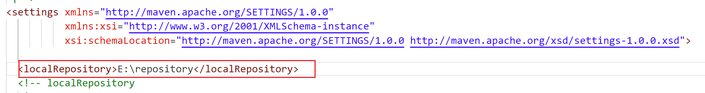

# Day7 Maven

## 概念

Maven是一个项目构建工具和依赖管理工具。

**项目构建**：项目构建指的是从编写代码开始，到后面的编译、测试、部署、运行等这一整套流程。

在我们的整个软件开发过程中，存在着各种各样的难题问题，比如编写代码之后需要进行编译，虽然使用一些专业化的集成开发环境，可以帮助我们进行编译，但是无法替代各个环节。比如打包部署等环节，比如我希望将代码打成jar包，idea打包不是特别的方便。还比如说编写好的代码需要进行测试，需要提前编写好测试用例，需要运行测试用例。这些环节其实都不是特别的省心。maven是一个非常好用的项目构建工具，**借助于maven，我们如果希望进行编译、测试、打包等，只需要输入一个对应的指令即可，非常的简单**。

> 如果面试的时候问到你，你的团队有多少人，多少比较合理？6-7人左右是比较合理的。
>
> 项目经理(1名)、产品经理(1名)、前端开发人员(1-2名)、后端开发人员(2-3名)、测试人员(1名)

**依赖管理**：依赖其实就是指的是我们引入的第三方的jar包、类库。我们希望在我们的项目中使用第三方的jar包、类库，那么必须得保障该jar包、类库会被加载到内存中。将jar包放入到classpath目录下，随后会有类加载器负责将jar包加载到内存中。

在之前的开发过程中，我们每创建一个项目，就需要复制一份jar包到当前项目中，执行add as library，将jar包添加到classpath目录中。其实，**我们根本没有必要每次都去复制一份jar包，我们其实只需要jar包的坐标位置即可，即可将其加载到内存中**。

**所以，其实对于我们开发的项目来说，根本没有必要每次都去新建一个新的项目，然后复制一份jar包过去，add as library。其实只需要将jar包统一放在一个位置，使用的时候，直接去提供该jar包的路径位置即可**。


此外，还有另外一点，那就是maven会自动帮助我们去管理依赖和依赖之间的关系。比如我们的项目中使用dbcp数据源，maven会自动帮助我们去查找dbcp jar包是否需要其他的依赖jar包，如果需要，则会将其他的jar包也加加载到内存中，这样便可以减少我们项目开发过程中，导包遇到的很多的坑。

> 需要明白一点：我们最终的目的就是要把jar包加载到内存中。该过程是由类加载器去做的，也就是说只要类加载可以知道当前jar包的位置路径，那么是可以将当前jar包加载到内存中。
>
> javac -classpath D:\apache-tomcat-8.5.81\lib\servlet-api.jar Servlet1.java
>
> 当前指令 -classpath属性其实背后就是调用了类加载器负责将后面地址的jar包加载到内存中


## 安装

software目录中有对应的安装包，直接下载到本地进行解压缩即可。不建议大家将软件放置在很深的目录结构下、不要放在含有空格的目录、中文的目录下。

> 如果今后大家在企业中进行开发，需要学习新的内容，如何去查找资料，去下载软件？官网
>
> 下载软件的时候，最新版慎用。


随后进行环境变量的配置


## 配置

Maven是一个项目构建工具以及依赖管理工具，可以帮助我们去维护管理jar包，究竟是如何维护的呢？

以下配置都是需要去修改conf/settings.xml文件

1.配置中央仓库的国内镜像

在mirrors节点下新增一个mirror节点

```xml
<mirror>
        	<id>nexus-aliyun</id>
        	<mirrorOf>central</mirrorOf>
        	<name>Nexus aliyun</name>
        	<url>http://maven.aliyun.com/nexus/content/groups/public</url>
        </mirror>
```


2.配置本地仓库（其实可以不用配置，因为会默认选择一个位置，但是该位置默认是c盘，可以更换一下本地仓库的路径）

```xml
<localRepository>E:\repository</localRepository>
```



3.配置profile信息----设置maven编译的默认版本信息(要求和大家使用的jdk版本保持一致)如果你使用的是jdk8，那么下面配置jdk8的配置；如果你使用的是jdk17，那么配置jdk17的。**一定记得要去配置，如果不去配置，maven的默认编译器是1.5的，可能很多特性都是无法处理的。**

jdk17:

```xml
 <profile>
                <id>jdk-17</id>
                <activation>
                    <activeByDefault>true</activeByDefault>
                    <jdk>17</jdk>
                </activation>
                <properties>
                    <maven.compiler.source>17</maven.compiler.source>
                    <maven.compiler.target>17</maven.compiler.target>
                    <maven.compiler.compilerVersion>17</maven.compiler.compilerVersion>
                </properties>
        </profile>
```


jdk8:

```xml
 <profile>
                <id>jdk-1.8</id>
                <activation>
                    <activeByDefault>true</activeByDefault>
                    <jdk>1.8</jdk>
                </activation>
                <properties>
                    <maven.compiler.source>1.8</maven.compiler.source>
                    <maven.compiler.target>1.8</maven.compiler.target>
                    <maven.compiler.compilerVersion>1.8</maven.compiler.compilerVersion>
                </properties>
        </profile>
```


## 项目构建

1.新建一个目录，作为当前的项目。

2.在项目中，我们编写一个HelloWorld.java代码

```java
public class HelloWorld{

    public static void main(String[] args){
        System.out.println("hello world");
    }
}
```

随后，我们希望进行编译操作；如果没有maven，此时我们应该怎么办？使用javac指令来进行编译

如果借助于maven，我们应该怎么办呢？非常简单，直接输入一条指令即可。

3.如果希望使用maven来进行项目构建，那么需要创建一个pom.xml配置文件

```xml
<?xml version="1.0" encoding="UTF-8"?>
<project xmlns="http://maven.apache.org/POM/4.0.0"
         xmlns:xsi="http://www.w3.org/2001/XMLSchema-instance"
         xsi:schemaLocation="http://maven.apache.org/POM/4.0.0 http://maven.apache.org/xsd/maven-4.0.0.xsd">
    <modelVersion>4.0.0</modelVersion>
    <groupId>com.cskaoyan</groupId>
    <artifactId>cp</artifactId>
    <version>1.0-SNAPSHOT</version>

</project>
```

4.maven项目中文件的存储有着严格的要求：

​	源代码文件放置在src\main\java目录下

​	配置文件放置在src\man\resources目录下

​	测试文件放置在src\test\java目录下

​	测试配置文件放置在src\test\resources目录下


### 常见指令

1.mvn compile

可以帮助我们进行编译操作。maven会帮助我们开发者将所有的源代码文件全部进行编译。


2.mvn clean

可以帮助我们将编译的产物全部删除，也就是删除target目录


3.mvn package

默认情况下，maven会帮助我们进行打jar包操作，如果我们希望打war包，可以在pom.xml文件中设置<packaging>war</packaging>


4.mvn test

maven还可以帮助我们开发者进行单元测试。如果希望maven帮助我们进行测试，那么需要满足如下几个要求：

1.导入junit依赖(该jar包专门用于进行单元测试的)。

```xml
<?xml version="1.0" encoding="UTF-8"?>
<project xmlns="http://maven.apache.org/POM/4.0.0"
         xmlns:xsi="http://www.w3.org/2001/XMLSchema-instance"
         xsi:schemaLocation="http://maven.apache.org/POM/4.0.0 http://maven.apache.org/xsd/maven-4.0.0.xsd">
    <modelVersion>4.0.0</modelVersion>
    <groupId>com.cskaoyan</groupId>
    <artifactId>helloworld</artifactId>
    <version>1.0-SNAPSHOT</version>

    <dependencies>
        <dependency>
            <groupId>junit</groupId>
            <artifactId>junit</artifactId>
            <version>4.12</version>
            <scope>test</scope>
        </dependency>
    </dependencies>
</project>
```

2.编写对应的代码去测试即可(测试类一般情况下命名叫做XXXTest,里面的方法一般叫做testXXX)

3.测试类的测试方法的头上需要标注@Test注解

```java
import org.junit.*;

public class StudentTest{

    @Test
    public void testAge(){
         Student student = new Student();
         Assert.assertEquals(18, student.age());
    }
}
```

一切代码准备就绪，编写完毕，运行mvn test指令，那么maven便会帮助我们运行所有标注@Test注解的方法。


## 依赖管理

### 坐标

在maven项目中，如果我们进行依赖管理，是不需要再次去导入jar包的。只需要在maven项目的pom.xml文件中去配置对应的依赖说明即可。

<dependencies></dependencies>表示的是所有的依赖。<dependency></dependency>指的是其中的某一个依赖。依赖有以下几个属性所组成，分别是groupId、artifactId、version

> groupId、artifactId、version不知道怎么写？不用去记，直接去mvnrepository.com去查看

groupId：指的是公司的名称、组织的名称

artifactId：指的是公司内部项目的名称

version：当前项目的版本号


此外，还有一个属性，叫做<scope></scope>。可以理解为是当前依赖的作用范围。

比如说juni依赖,里面有一个 scope test，表示的是maven不会对主程序代码提供该依赖；仅仅只会给测试代码提供该依赖。

也就是src\test\java目录下编写的代码可以使用该依赖，但是src\main\java目录下的代码无法使用该依赖。

```xml
<dependency>
            <groupId>junit</groupId>
            <artifactId>junit</artifactId>
            <version>4.12</version>
            <scope>test</scope>
        </dependency>
```


我们编写的业务逻辑代码位于src\main\java目录下的；而测试代码位于src\test\java目录下

当我们执行编译指令时，maven会分别帮助我们进行编译。如果我们一个junit的依赖设置的scope为test，那么意味着当maven给src\main\java目录下的代码进行编译时，不会提供jar包的路径，对应的代码便无法使用该依赖。

> javac -classpath xxx.jar xxx.java

关于scope，有如下取值：

1.compile：该依赖不仅主程序代码可以使用，测试代码也可以使用；不仅编译时可以使用，运行也可以使用，如果没有设置scope，则默认scope的值便是compile。

**2.provided：该依赖仅在编译时提供，但是运行时不提供，记住唯一的一个特例：servlet-api.jar**。记住Servlet必须写成provided

3.test:该依赖仅针对测试代码有效；主程序代码无效，也就是主程序代码无法使用。junit

4.runtime：该依赖仅针对运行时有效，编译时无效，也就是说，编译的时候不会提供该依赖。mysql-connector-java.jar

### IDEA开发Maven项目


接下来，还需要做一些配置才可以使用：

File-settings


上述设置仅仅针对当前项目是生效的，接下来还需要做进一步设置，对新场景的项目也生效:

settings for new projects


再次搜索maven，设置新项目的maven配置也生效。


### 依赖传递(了解、熟悉)

项目A依赖了项目B，项目B依赖了项目C。正常情况下来说，项目A不需要再直接去引入项目C，可以直接使用项目C里面的代码。但是也并不是全部的依赖都可以进行传递，有些依赖是无法进行传递的。但是对于大家来说，也不用去记忆，哪些可以传递，哪些不可以传递，你需要做的事情就是如果遇到没法进行传递的，那么自己再手动引入该依赖即可。

transmission2--------transmission1-----------junit、druid、mysql-connector-java

2的pom.xml文件

```xml
<?xml version="1.0" encoding="UTF-8"?>
<project xmlns="http://maven.apache.org/POM/4.0.0"
         xmlns:xsi="http://www.w3.org/2001/XMLSchema-instance"
         xsi:schemaLocation="http://maven.apache.org/POM/4.0.0 http://maven.apache.org/xsd/maven-4.0.0.xsd">
    <modelVersion>4.0.0</modelVersion>

    <groupId>com.cskaoyan.th58</groupId>
    <artifactId>Day8_Dependency_transmission2</artifactId>
    <version>1.0-SNAPSHOT</version>

    <properties>
        <maven.compiler.source>17</maven.compiler.source>
        <maven.compiler.target>17</maven.compiler.target>
        <project.build.sourceEncoding>UTF-8</project.build.sourceEncoding>
    </properties>

    <dependencies>
        <dependency>
            <groupId>com.cskaoyan.th58</groupId>
            <artifactId>Day8_Dependency_transmission1</artifactId>
            <version>1.0-SNAPSHOT</version>
        </dependency>
    </dependencies>
</project>
```


1的pom.xml文件

```xml
<?xml version="1.0" encoding="UTF-8"?>
<project xmlns="http://maven.apache.org/POM/4.0.0"
         xmlns:xsi="http://www.w3.org/2001/XMLSchema-instance"
         xsi:schemaLocation="http://maven.apache.org/POM/4.0.0 http://maven.apache.org/xsd/maven-4.0.0.xsd">
    <modelVersion>4.0.0</modelVersion>

    <groupId>com.cskaoyan.th58</groupId>
    <artifactId>Day8_Dependency_transmission1</artifactId>
    <version>1.0-SNAPSHOT</version>

    <properties>
        <maven.compiler.source>17</maven.compiler.source>
        <maven.compiler.target>17</maven.compiler.target>
        <project.build.sourceEncoding>UTF-8</project.build.sourceEncoding>
    </properties>

    <dependencies>
        <dependency>
            <groupId>com.alibaba</groupId>
            <artifactId>druid</artifactId>
            <version>1.2.8</version>
        </dependency>

        <dependency>
            <groupId>junit</groupId>
            <artifactId>junit</artifactId>
            <version>4.12</version>
            <scope>test</scope>
        </dependency>

        <dependency>
            <groupId>mysql</groupId>
            <artifactId>mysql-connector-java</artifactId>
            <version>8.0.33</version>
            <scope>runtime</scope>
        </dependency>
    </dependencies>
</project>
```

那么，通过实验我们可以发现，在2中可以使用druid的代码，但是无法使用junit和mysql-connector-java的代码。如果希望在2中使用上述的依赖，那么直接再引入即可。


### 依赖冲突

比如当前项目中引入了项目B，项目B引入了项目C的1.0版本

但是当前项目也引入了项目D，项目D也引入了项目C的1.1版本

此时，项目中根据依赖的传递特性，在当前项目中同时会存在1.0和1.1版本，比如说此时maven默认选择了1.0版本，但是我希望使用1.1版本，那么就需要你对于maven的依赖冲突策略有所了解，后续才能够有针对性的去解决这样的问题。


#### 声明优先策略

比如当前项目中引入了spring-jdbc v5.3.22版本，该依赖进一步引入了spring-beans v5.3.22版本

当前项目也引用了spring-context v5.3.23版本，该依赖进一步引入了spring-beans v5.3.23版本，

此时，如果我希望最终我项目中生效的spring-beans的版本为5.3.23，如果不是该版本，应该如何调整呢？

通过调节下面两个依赖的关系，最终可以发现在external libraries中生效的spring-beans会发生对应的切换。


```xml
 <dependency>
            <groupId>org.springframework</groupId>
            <artifactId>spring-context</artifactId>
            <version>5.3.29</version>
        </dependency>

        <dependency>
            <groupId>org.springframework</groupId>
            <artifactId>spring-jdbc</artifactId>
            <version>5.3.30</version>
        </dependency>
```


#### 就近原则

上述我们提到的声明优先原则是指的是依赖路径的长度是相同的情况下。

当前项目------spring-jdbc-----spring-beans

当前项目------spring-context----spring-beans

上述两个依赖的路径长度是相等。相等的情况下会选择声明优先。**但是如果我们采取一个最短路径，那么可以覆盖**。

当前项目------spring-jdbc-----spring-beans v5.3.30

当前项目-----spring-beans   v5.3.29   

哪个会生效呢？下面的会生效  v5.3.29


#### 排除依赖

比如当前项目中引入了spring-jdbc v5.3.22版本，该依赖进一步引入了spring-beans v5.3.22版本

当前项目也引用了spring-context v5.3.23版本，该依赖进一步引入了spring-beans v5.3.23版本

如果我们希望最终生效的是5.3.23版本的spring-beans，除了使用上述方式之外，还可以使用一种方式：

将5.3.22的spring-beans的依赖排除在外。

```xml
<dependency>
            <groupId>org.springframework</groupId>
            <artifactId>spring-jdbc</artifactId>
            <version>5.3.30</version>
            <exclusions>
                <exclusion>
                    <groupId>org.springframework</groupId>
                    <artifactId>spring-beans</artifactId>
                </exclusion>
            </exclusions>
        </dependency>

        <dependency>
            <groupId>org.springframework</groupId>
            <artifactId>spring-context</artifactId>
            <version>5.3.29</version>
        </dependency>
```


#### 提取常量

在 处理版本冲突的时候，还有一种方式，尤其是针对全家桶的框架，建议的是使用同一个版本号，将这个版本号使用一个常量来进行维护。

```xml
    <properties>
        <!--定义的spring的版本信息，也就是一组key=value键值对-->
        <sprign.version>5.3.30</sprign.version>
    </properties>


<dependency>
            <groupId>org.springframework</groupId>
            <artifactId>spring-jdbc</artifactId>
            <version>${sprign.version}</version>
        </dependency>

        <dependency>
            <groupId>org.springframework</groupId>
            <artifactId>spring-context</artifactId>
            <version>${sprign.version}</version>
        </dependency>
```


## Maven项目配置文件

**在Maven项目中，建议大家把配置文件放置在src\main\resources目录中**。不要放置在项目的根目录中了。因为我们使用maven的话，后续如果使用maven的指令来进行打包操作，那么无论是放置在根目录下的哪个文件，均不会被打包到jar包或者war包中。所以，**在maven项目中，配置文件一定得放置在src\main\resources目录中**。

说明：

1.放置在src\main\resources目录下的文件，经过编译之后，会和src\main\java目录下的文件存放在一起。

3.打包之后，很多API将会无法使用；比如File相对路径可能就无法使用了，所以为了今后打包之后还可以继续使用，我们使用类加载器去获取配置文件的路径

2.放置在src\main\resources目录下的文件，应该如何获取文件的路径、file、流信息呢？

经过之前的演示，我们可以发现：放置在resources目录下的文件和放置在java目录下的文件，经过编译之后，还是在一起的。位于一个叫做classes目录中。这个目录是什么呢？这个目录其实就是当前项目的classpath。既然类加载器可以将类加载到内存中，那么你觉得类加载器知不知道我们的类位于哪个目录中？肯定知道。如果类加载器向外暴露一个方法给开发人员，那么我们能否获取classpath的路径呢？可以。知道了classpath的路径之后，再去获取某个配置文件的路径，那就是非常轻松了。

> classpath:path是环境变量。只要把某一个目录丢到环境变量中，那么我们便可以在任意的目录下输入该指令。也就是我们输入一条指令时，会到哪个地方去查找该指令。
>
> classpath是什么呢？仿照着path环境变量来进行设计的一个东西。把所有的类存放的目录设置在一个地方进行保存，后续输入对应的全限定类名的时候，那么直接利用这些目录和全限定类名进行拼接匹配。也就是指的是我们输入一个全限定类名，那么类加载器会到哪个目录下去加载当前的全限定类名。
>
> 另一个角度去思考：编写的java代码首先进行编译成class文件。class文件位于硬盘上面，但是运行的时候要求class文件时位于内存中的，这个时候就需要有类加载器负责将class文件加载到内存中。如果类加载器无法得知当前class文件的硬盘路径，如何加载到内存中？所以类加载器肯定是知道class文件的硬盘路径的。
>
> 类加载器加载类的时候，是有一个基础路径的，也就是classpath，所以classpath其实就是全限定类名所在的目录


> Class对象是什么？
>
> 如果我们现在有几个学生，那么我们会创建一个Student类，利用类创建对象，也就是有了一个一个的Student对象，Student对象里面会包含学生的信息；
>
> 现在我们有很多的.class文件，希望能够知道这些class文件里面有哪些东西(属性、构造函数、成员变量、修饰符.....)，那么，这个时候应该怎么办？定义一个Class类，每当有一个.class文件，那么我们便创建一个Class对象，该Class对象里面会包含当前.class文件里面的描述的所有的内容信息。比如Student.class这个文件对应的Class对象里面会包含当前class文件里面包含哪些构造函数、哪些成员变量、哪些方法、接口信息、权限修饰符信息等等.......
>
> 

```java
package com.cskaoyan.th58;

import java.io.File;
import java.io.FileInputStream;
import java.io.IOException;
import java.io.InputStream;
import java.util.Properties;
// baseDir(classpath) + com/cskaoyan/th58/JdbcProperties.class
public class JdbcProperties {

    public static void main(String[] args) {
        //读取jdbc.properties配置文件里面的数据，应该如何读取呢？
        Properties properties = new Properties();
        try {
            //往期同学有使用这种方式来获取位于src\main\resources目录下的文件的路径，可以吗？可以是可以，但是不要用，否则今后项目只要更换地址或者打包，代码无法运行
//            properties.load(new FileInputStream("D:\\cskaoyan-training-course\\java-58-course-materials\\02-JavaEE\\code\\Day9_MavenResources\\src\\main\\resources\\jdbc.properties"));

            //打包之后，这个也是无法使用的
            File file = new File("src\\main\\resources\\jdbc.properties");
            //获取加载当前类的类加载器 当前类的类加载器在Class对象里面也有记录
            ClassLoader classLoader = JdbcProperties.class.getClassLoader();
            //参数：要求输入一个相对于classpath的相对路径，返回一个文件的输入流信息
            InputStream inputStream = classLoader.getResourceAsStream("jdbc.properties");
//

            String path = classLoader.getResource("jdbc.properties").getPath();


            properties.load(inputStream);
            String username = properties.getProperty("username");
            String password = properties.getProperty("password");
            System.out.println(username);
            System.out.println(password);

        } catch (Exception e) {
            throw new RuntimeException(e);
        }
    }
}
```

| 方法名称                              | 参数                                  | 返回值                                                | 说明                                                         |
| ------------------------------------- | ------------------------------------- | ----------------------------------------------------- | ------------------------------------------------------------ |
| 类名.class                            | -                                     | 当前类对应的Class对象                                 | 每一个.class文件被加载到内存中之后，都会创建一个Class对象，该对象就是对于当前.class文件的信息的所有封装 |
| JdbcProperties.class.getClassLoader() | -                                     | 返回的是加载当前类的类加载器                          | Class里面记录当前类是由哪个类加载器负责加载的                |
| classLoader.getResourceAsStream       | 要求输入一个相对于classpath的相对路径 | 该文件的输入流信息                                    | 该方法其实本质上来说，便是对于classpath目录做了一层封装。    |
| classLoader.getResource               | 要求输入一个相对于classpath的相对路径 | 返回的是一个URL对象，该对象内部会封装地址、file等信息 |                                                              |

