# Day9 Mybatis

## 概念

Mybatis是什么？为什么要学习Mybatis？

基于java语言的一个持久层的框架。什么叫做持久层？存储到硬盘。java代码都是在内存中进行运行的，无论你创建的是什么对象，都是存在于内存中的。如果断电，则数据就丢失了。希望数据可以以一种持久化的形式存储到本地硬盘。在没有学习Mybatis之前，我们是怎么做的？使用数据库，那么java语言是如何访问数据库的？JDBC。

为什么今天又要学习Mybatis呢？因为JDBC过程还是太过于繁琐了。我们希望可以使用一种更加方便的方式来处理。

下面，我们将使用jdbc来进行查询，并将查询的结果封装为对象。

## JDBC回顾

```java
public class DruidUtils {

    private static DataSource dataSource;


    static {
        Properties properties = new Properties();
        //可以直接使用类加载器来获取位于classpath目录下的文件输入流
        InputStream inputStream = DruidUtils.class.getClassLoader().getResourceAsStream("druid.properties");
        try {
            properties.load(inputStream);
            dataSource = DruidDataSourceFactory.createDataSource(properties);
        } catch (Exception e) {
            throw new RuntimeException(e);
        }
    }

    public static Connection getConnection() throws SQLException {
        return dataSource.getConnection();
    }
}
```

```java
public class JdbcDemo {

    public static void main(String[] args) {
        //查询一张表的数据，将数据结果封装成为一个对象 salary
        Connection connection = null;
        PreparedStatement preparedStatement = null;
        ResultSet resultSet = null;
        List<Salary> salaries = new ArrayList<>();
        try {
            connection = DruidUtils.getConnection();
            preparedStatement = connection.prepareStatement("select * from salary");
            resultSet = preparedStatement.executeQuery();
            while (resultSet.next()){
                int id = resultSet.getInt("id");
                String name = resultSet.getString("name");
                double salary = resultSet.getDouble("salary");
                salaries.add(new Salary(id, name, salary));
            }
        } catch (SQLException e) {
            throw new RuntimeException(e);
        }finally {
            try {
                if(connection != null){
                    connection.close();
                }
                if(preparedStatement != null){
                    preparedStatement.close();
                }
                if(resultSet != null){
                    resultSet.close();
                }
            }catch (Exception e){

            }
        }

        //打印一下list的数据
        for (Salary salary : salaries) {
            System.out.println(salary);
        }

    }
}
```

上述代码，是我们根据jdbc的执行流程，而编写的用于封装数据到java对象的形式。使用起来非常繁琐。如果今后我需要查询另外一张表，封装成为另外一个对象，那么这些代码完全不可以进行复用。还需要再次编写一遍。

使用mybatis其实可以帮助我们极大地简化开发工作。mybatis你可以理解为是使用了反射等原理，将上述过程又进行了进一步的封装。使得我们的业务开发流程更加的简洁、开发难度变得更低。

下面，我们将使用一段jdbc代码来给大家简单讲解mybatis的原理。

```java
public class JdbcDemo2 {

    public static void main(String[] args) throws Exception {
        //查询salary表，把数据封装成为List<Salary>形式

        Connection connection = DruidUtils.getConnection();
        List<Salary> salaryList = (List<Salary>) MockMybatis.query(connection, "select * from salary", Salary.class);
        for (Salary salary : salaryList) {
            System.out.println(salary);
        }

        //我们写的这段代码不仅可以用来封装salary表，也可以用来封装log表
        List<Log> logList = (List<Log>) MockMybatis.query(connection, "select * from log", Log.class);

        for (Log log : logList) {
            System.out.println(log);
        }
        connection.close();
    }
}
```

```java
//这个类用来去模拟mybatis的简单原理
public class MockMybatis {

    //定义了一个查询方法
    //接收三个参数：1.connection对象，数据库的连接  2.执行的sql语句   3.封装的结果数据类型
    public static Object query(Connection connection,String sql, Class clazz) throws SQLException, NoSuchMethodException, InvocationTargetException, InstantiationException, IllegalAccessException, NoSuchFieldException {
        PreparedStatement preparedStatement = connection.prepareStatement(sql);
        //为了简单起见，我们就不去处理参数了
        ResultSet resultSet = preparedStatement.executeQuery();
        ResultSetMetaData metaData = preparedStatement.getMetaData();
        //找到无参构造函数
        List list = new ArrayList<>();
        Constructor constructor = clazz.getConstructor();
        while (resultSet.next()){
            //每调用一次next，那么便是处理一行数据，一行数据便对应着一个对象
            Object o = constructor.newInstance();
            //不清楚表的列名以及对应的类型是什么类型
            //实际上，里面会存储一些元数据，何为元数据呢？元数据指的便是数据的数据，比如表中存储了一行数据，这个是数据，元数据指的是这个数据对应的列的信息
            //比如列名叫什么、类型是什么类型
            //列名是什么呢？在元数据里面是有的
            int columnCount = metaData.getColumnCount();
            for (int i = 0; i < columnCount; i++) {
                //索引是从1开始的，不是从0开始的
                String columnLabel = metaData.getColumnLabel(i + 1);
                //查询到的列名对应的值，应该赋值给谁？赋值给对应的对象中的同名的属性
                Object columnValue = resultSet.getObject(columnLabel);
                System.out.println(columnLabel + ":" + columnValue);
                //这里面需要做的事情便是去封装数据，利用名称对应来进行封装，比如salary表里面的id、name、salary对应的是Salary类里面的id、name、salary
                //其实便是查找对应的属性，利用属性的名称去查找对应的属性；属性的名称刚好和列的列名是一致的
                Field field = clazz.getDeclaredField(columnLabel);
                //暴力访问
                field.setAccessible(true);
                //利用反射直接给属性进行赋值操作
                field.set(o, columnValue);
            }
            list.add(o);
        }
        preparedStatement.close();
        resultSet.close();
        return list;
    }
}
```

## Mybatis入门案例(熟悉)

官方网站：https://mybatis.org/mybatis-3/zh_CN/index.html


**1.导入依赖**

```xml
<dependencies>
        <dependency>
            <groupId>org.mybatis</groupId>
            <artifactId>mybatis</artifactId>
            <version>3.5.9</version>
        </dependency>

        <dependency>
            <groupId>mysql</groupId>
            <artifactId>mysql-connector-java</artifactId>
            <version>8.0.33</version>
            <scope>runtime</scope>
        </dependency>
    </dependencies>
```

**2.准备mybatis的主配置文件(xml文件)**

> 提一句：后面可能会经常需要创建mybatis的项目，考虑到配置文件不会写，建议大家把xml配置文件写成一个模板，后续去修改模板即可。
>
> File-settings-Editior-File and code templates
>
> 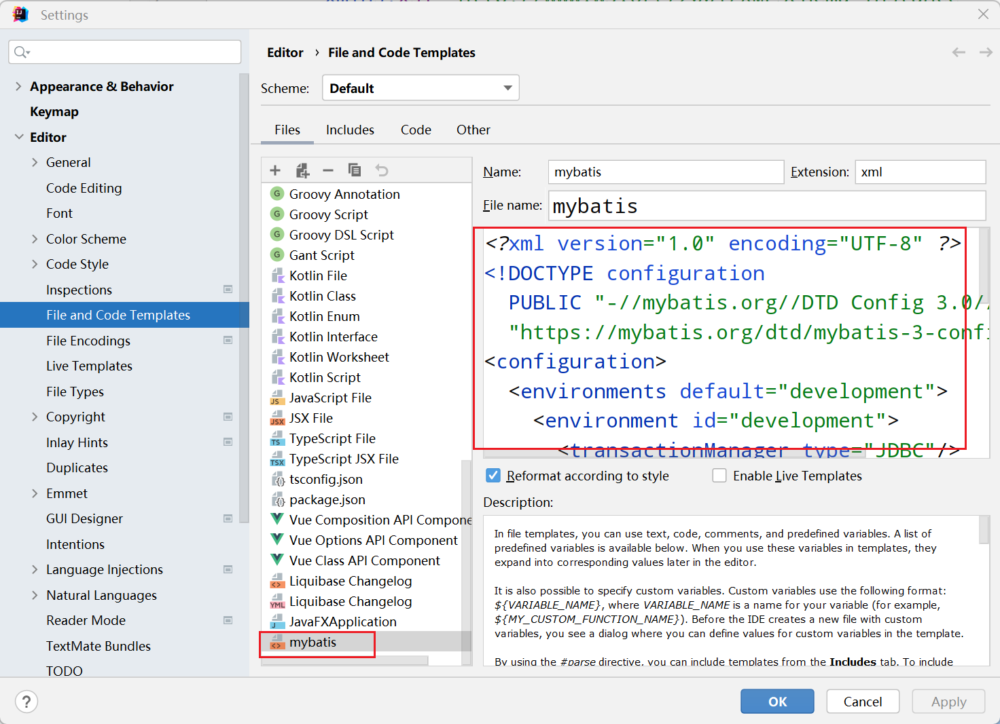


**3.准备mapper映射文件(xml文件,作用就是用来去映射sql语句的)**

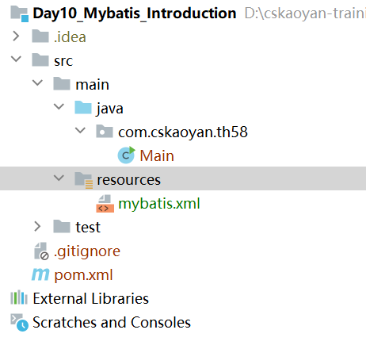

随后我们需要去编写mapper.xml文件，那么我们建议再resources目录下新建com/cskaoyan/th58/mapper目录，将mapper映射文件放置在该处(特别需要注意一点的是：在resources目录下不可以用com.cskaoyan.th58来创建多级目录)，也就是我们要求大家mapper映射文件所在的目录要和代码的包目录名称一致

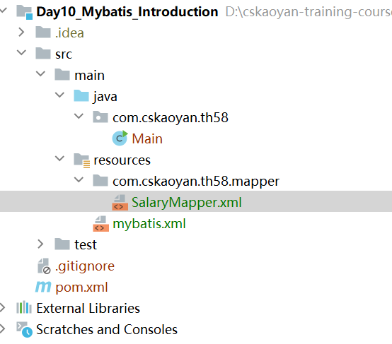

随后需要再mybatis的主配置文件中去注册当前mapper映射文件

```xml
<?xml version="1.0" encoding="UTF-8" ?>
<!DOCTYPE configuration
        PUBLIC "-//mybatis.org//DTD Config 3.0//EN"
        "https://mybatis.org/dtd/mybatis-3-config.dtd">
<configuration>
    <environments default="development">
        <environment id="development">
            <transactionManager type="JDBC"/>
            <dataSource type="POOLED">
                <property name="driver" value="com.mysql.cj.jdbc.Driver"/>
                <property name="url" value="jdbc:mysql://localhost:3306/tx?characterEncoding=utf-8&amp;useSSL=false"/>
                <property name="username" value="root"/>
                <property name="password" value="123456"/>
            </dataSource>
        </environment>
    </environments>
    <mappers>
        <mapper resource="com/cskaoyan/th58/mapper/SalaryMapper.xml"/>
    </mappers>
</configuration>
```


**4.编写mapper映射文件里面的内容**

```xml
<?xml version="1.0" encoding="UTF-8" ?>
<!DOCTYPE mapper
        PUBLIC "-//mybatis.org//DTD Mapper 3.0//EN"
        "https://mybatis.org/dtd/mybatis-3-mapper.dtd">
<mapper namespace="com.cskaoyan.th58.mapper.SalaryMapper">
    <select id="selectOne" resultType="com.cskaoyan.th58.bean.Salary">
        select * from salary where id = #{id}
    </select>
</mapper>
```


**5.编写代码来处理**

```java
public class MybatisDemo1 {

    public static void main(String[] args) {

        //获取SqlSessionFactory
        //mybatis.xml文件的输入流
        //获取该文件的输入流，可以使用我们昨天介绍的classloader.getResourceAsStream也可以使用今天介绍的
        InputStream inputStream = MybatisDemo1.class.getClassLoader().getResourceAsStream("mybatis.xml");
//        InputStream inputStream = Resources.getResourceAsStream("mybatis.xml");
        SqlSessionFactory sessionFactory = new SqlSessionFactoryBuilder().build(inputStream);
        SqlSession sqlSession = sessionFactory.openSession();
        //此处不需要去写sql语句，而是直接去写sql语句对应的编号(namespace + id)
        Salary salary = sqlSession.selectOne("com.cskaoyan.th58.mapper.SalaryMapper.selectOne", 1);
        System.out.println(salary);
        //查询的时候可以不用commit也可以，但是增晒改的时候一定得记得commit
        //下面两行代码就可以理解为是对于jdbc的进一步封装
        //对于connection.commit()封装
        sqlSession.commit();
        //对于connection、preparedStatement、ResultSet.close的封装
        sqlSession.close();
    }
}
```


## Mybatis原理

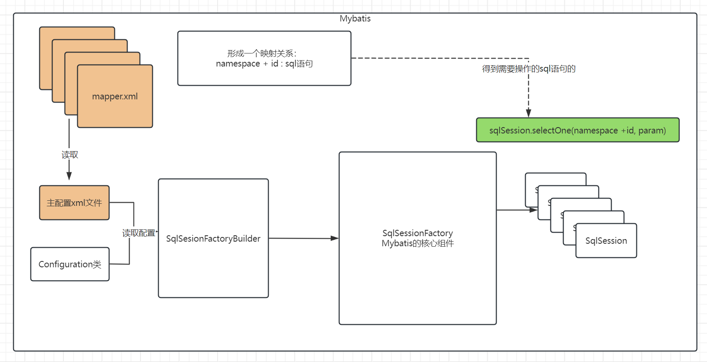

1.对于Mybatis来说，其核心组件是SqlSessionFactory，它是一切功能的前提。

2.SqlSessionFactory翻译可以翻译成为SqlSession的工厂，那么顾名思义就是批量生产SqlSession的地方。SqlSession又是什么东西呢？sql的会话，你可以理解为就是之前的一个一个的连接。

3.SqlSessionFactory需要借助于SqlSessionFactoryBuilder来获取；SqlSessionFactoryBuilder可以通过读取xml文件或者读取Configuration配置类的方式来获取。


对于mybatis来说，核心组件是SqlSessionFactory，SqlSessionFactory可以由SqlSessionFactoryBuilder通过去读取mybatis.xml主配置文件来创建，读取主配置文件时，也会进一步去扫描读取mapper映射文件，可以在内部形成那么namespace + id和sql语句的一个映射关系。后续我们利用SqlSessionFactory创建出SqlSession时，利用SqlSession来操作sql语句时，输入对应的编号，那么便可以对应着这条sql语句，便可以执行这条sql语句。


## 对象的作用域及生命周期

SqlSessionFactoryBuilder：使用过后就可以直接丢弃了，不会再使用了。

SqlSessionFactory：SqlSessionFactory 一旦被创建就应该在应用的运行期间一直存在，没有任何理由丢弃它或重新创建另一个实例。

SqlSession：每个线程都应该有它自己的 SqlSession 实例。SqlSession 的实例不是线程安全的，因此是不能被共享的，所以它的最佳的作用域是请求或方法作用域。 绝对不能将 SqlSession 实例的引用放在一个类的静态域，甚至一个类的实例变量也不行。简而言之，一句话，**那就是sqlSession只可以在局部变量中使用，绝对不能够去写静态成员变量或者成员变量**。

受上述启发，我们可以编写一个工具类：

```java
public class MybatisUtils {

    private static SqlSessionFactory factory;

    static {
        InputStream inputStream = MybatisUtils.class.getClassLoader().getResourceAsStream("mybatis.xml");
        factory = new SqlSessionFactoryBuilder().build(inputStream);
    }
    
    public static SqlSession getSqlSession(){
        return factory.openSession();
    }
}
```


## 动态代理方式(重点)

在上面的案例中，我们使用mybatis来操作数据库，使用的是sqlSession.selectOne(编号，参数)这种方式来操作数据库。除了使用这种方式之外，还可以使用另外一种方式，那就是程序运行期间，动态地去产生一个代理类对象，通过操作代理类对象的方法来操作数据库。使用动态代理方式，对于后续整合其他框架非常的方便。

在上述案例的基础上，我们只需要做略微改动即可：

1.在前面的SalaryMapper.xml文件中，当前mapper的namespace关联了一个SalaryMapper，那么我们需要做的事情便是在该处创建一个SalaryMapper接口

```xml
<?xml version="1.0" encoding="UTF-8" ?>
<!DOCTYPE mapper
        PUBLIC "-//mybatis.org//DTD Mapper 3.0//EN"
        "https://mybatis.org/dtd/mybatis-3-mapper.dtd">
<mapper namespace="com.cskaoyan.th58.mapper.SalaryMapper">
    <select id="selectOne" resultType="com.cskaoyan.th58.bean.Salary">
        select * from salary where id = #{id}
    </select>
</mapper>
```

2.需要在SalaryMapper接口中定义方法，方法的名称要求和mapper映射文件里面的id保持相同。方法的返回值类型要求和resultType要求的类型保持一致。参数的类型便是根据具体情况去传递即可。

> 注意：如果我们执行的是查询全部数据，查询得到的是一个Lsit<Salary>，那么在写resultType时，依然是写Salary
>
> 如果是增晒改，那么接口中的方法的返回值写什么呢？可以写void或者int，表示的是影响的行数
>
> 最终经过编译之后，Mapper接口文件和Mapper映射文件应该在一个地方，如果后续出现异常，需要确认一下，二者是否在一起。并且Mapper接口的名称和mapper映射文件的名称应该是一致的。

```java
public interface SalaryMapper {

    Salary selectOne(Integer id);

    List<Salary> selectAll();
    
    Integer insertOne(String name);

    Integer updateOne(String name);

    Integer deleteOne(Integer id);
}
```

3.编写代码

```java
public class MybatisDemo3 {

    public static void main(String[] args) {
        //之前封装的一个工具类，每次操作数据库的时候，都要调用一次
        //这个sqlSession就相当于一个连接connection
        SqlSession sqlSession = MybatisUtils.getSqlSession();
        //使用一种基于动态代理的方式，提供了一个接口；后续mybatis会在程序运行期间，动态地产生一个类对象
        SalaryMapper salaryMapper = sqlSession.getMapper(SalaryMapper.class);
        List<Salary> salaries = salaryMapper.selectAll();
        for (Salary salary : salaries) {
            System.out.println(salary);
        }

        Integer rows = salaryMapper.insertOne("阿齐");
        System.out.println(rows);

        salaryMapper.updateOne("aqi");

        salaryMapper.deleteOne(1);

        sqlSession.commit();
        sqlSession.close();
    }
}
```

## 动态代理方式的原理

1.程序运行期间，动态地产生一个类对象，该对象需要去实现SalaryMapper接口，那么也就需要实现接口里面的方法。

2.实现接口中的方法，应该如何实现呢？简单来说便是使用jdbc的代码将mapper映射文件里面的sql语句包装起来，根据接口的返回值，返回对应的对象即可


## 增删改查及转账案例

### CRUD

Mapper接口

```java
public interface SalaryMapper {

    Salary selectOne(Integer id);

    List<Salary> selectAll();

    Integer insertOne(Salary salary);

    Integer updateByPrimaryKey(Salary salary);

    Integer deleteByPrimaryKey(Integer id);
}
```

mapper.xml映射文件

```xml
<mapper namespace="com.cskaoyan.th58.mapper.SalaryMapper">
    <select id="selectOne" parameterType="java.lang.Integer" resultType="com.cskaoyan.th58.bean.Salary">
        select * from salary where id = #{id}
    </select>

    <select id="selectAll" resultType="com.cskaoyan.th58.bean.Salary">
      select * from salary
    </select>

  <insert id="insertOne" parameterType="com.cskaoyan.th58.bean.Salary">
    insert into salary values (null, #{name}, #{salary})
  </insert>

  <update id="updateByPrimaryKey" parameterType="com.cskaoyan.th58.bean.Salary">
    update salary set name = #{name}, salary = #{salary} where id = #{id}
  </update>

  <delete id="deleteByPrimaryKey" parameterType="java.lang.Integer">
    delete from salary where id = #{id}
  </delete>

</mapper>
```

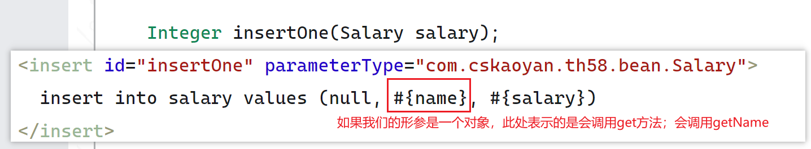

单元测试：

```java
public class CRUDTest {

    @Test
    public void testQuery(){
        //获取操作数据库的一个连接
        SqlSession session = MybatisUtils.getSession();
        //程序运行期间动态地产生一个mapper实例对象，该对象内部封装了对应的sql语句，我们可以直接使用对象的方法来进行操作
        SalaryMapper salaryMapper = session.getMapper(SalaryMapper.class);
        Salary salary = salaryMapper.selectOne(2);
        System.out.println(salary);
        session.commit();
        session.close();
    }


    @Test
    public void testQuery2(){
        //获取操作数据库的一个连接
        SqlSession session = MybatisUtils.getSession();
        //程序运行期间动态地产生一个mapper实例对象，该对象内部封装了对应的sql语句，我们可以直接使用对象的方法来进行操作
        SalaryMapper salaryMapper = session.getMapper(SalaryMapper.class);
        List<Salary> salaries = salaryMapper.selectAll();
        for (Salary salary : salaries) {
            System.out.println(salary);
        }
        session.commit();
        session.close();
    }


    @Test
    public void testInsert(){
        SqlSession session = MybatisUtils.getSession();
        SalaryMapper salaryMapper = session.getMapper(SalaryMapper.class);
        Salary salary = new Salary();
        salary.setName("空灵");
        salary.setSalary(12000.0);
        Integer rows = salaryMapper.insertOne(salary);
        Assert.assertEquals(1,rows.longValue());
        //增删改一定得记得提交
        session.commit();
        //无论查询还是增删改都必须得close
        session.close();
    }

    @Test
    public void testUpdate(){
        SqlSession session = MybatisUtils.getSession();
        SalaryMapper salaryMapper = session.getMapper(SalaryMapper.class);
        Salary salary = new Salary();
        salary.setId(7);
        salary.setName("kongling");
        salary.setSalary(15000.0);
        Integer rows = salaryMapper.updateByPrimaryKey(salary);
        Assert.assertEquals(1, rows.longValue());
        session.commit();
        session.close();
    }

    @Test
    public void testDelete(){
        SqlSession session = MybatisUtils.getSession();
        SalaryMapper salaryMapper = session.getMapper(SalaryMapper.class);
        Integer rows = salaryMapper.deleteByPrimaryKey(2);
        Assert.assertEquals(1, rows.longValue());
        session.commit();
        session.close();
    }
}
```

### 转账

接口文件

```java
public interface AccountMapper {


    void updateMoneyByName(Account account);
}
```


xml映射文件

```xml
<?xml version="1.0" encoding="UTF-8" ?>
<!DOCTYPE mapper
        PUBLIC "-//mybatis.org//DTD Mapper 3.0//EN"
        "https://mybatis.org/dtd/mybatis-3-mapper.dtd">
<mapper namespace="com.cskaoyan.th58.mapper.AccountMapper">

  <update id="updateMoneyByName" parameterType="com.cskaoyan.th58.bean.Account">
    update account set money = money - #{money} where name = #{name}
  </update>
</mapper>
```

转账代码：

```java
public class TransaferTest {


    @Test
    public void testTransfer(){
        SqlSession session = MybatisUtils.getSession();
        AccountMapper mapper = session.getMapper(AccountMapper.class);
        //此时就不需要再去开启事务之类的操作了，因为sqlSession封装的connection默认就是不会自动提交事务
        Account fromAccount = new Account();
        fromAccount.setName("boss");
        fromAccount.setMoney(12000.0);

        Account toAccount = new Account();
        toAccount.setName("zhangsan");
        toAccount.setMoney(-12000.0);

        try {
            mapper.updateMoneyByName(fromAccount);
            int i = 1 / 0;
            mapper.updateMoneyByName(toAccount);
            //session的commit其实就是对于jdbc的commit的封装
            session.commit();
        }catch (Exception e){
            e.printStackTrace();
            session.rollback();
        }finally {
            session.close();
        }
    }
}
```


## 事务解决方案

一共有三种，但是建议使用的时候还是使用我们之前的课程中演示的方式

session.commit()这种方式。


## Mybatis配置


### Properties(熟悉)

如果你习惯于在properties配置文件中去编写连接信息，那么使用下面的这种方式；如果不习惯这种方式，直接忽略即可。

```properties
jdbc.driver=com.mysql.cj.jdbc.Driver
jdbc.url=jdbc:mysql://localhost:3306/tx?characterEncoding=utf-8&useSSL=false
jdbc.username=root
jdbc.password=123456
```

```xml
<?xml version="1.0" encoding="UTF-8" ?>
<!DOCTYPE configuration
        PUBLIC "-//mybatis.org//DTD Config 3.0//EN"
        "https://mybatis.org/dtd/mybatis-3-config.dtd">
<configuration>

  <!--引入一个外部的配置文件,会读取位于classpath目录下的jdbc.properties文件-->
  <properties resource="jdbc.properties"/>
  
  
    <environments default="development">
        <environment id="development">
            <transactionManager type="JDBC"/>
            <dataSource type="POOLED">
                <property name="driver" value="${jdbc.driver}"/>
                <property name="url" value="${jdbc.url}"/>
                <property name="username" value="${jdbc.username}"/>
                <property name="password" value="${jdbc.password}"/>
            </dataSource>
        </environment>
    </environments>
    <mappers>
        <mapper resource="com/cskaoyan/th58/mapper/SalaryMapper.xml"/>
    </mappers>
</configuration>
```

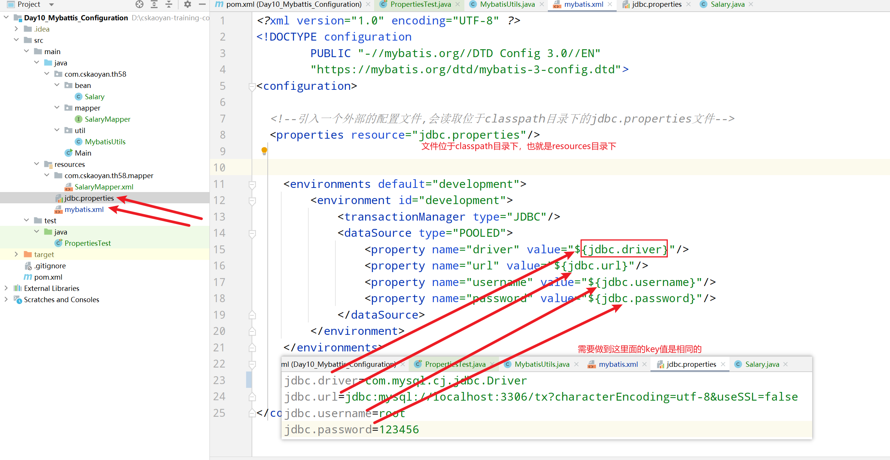


### settings(掌握)

settings配置信息，非常非常的多， 后续陆续给大家介绍；其中有一个关于日志的配置，非常非常非常有用。建议一定要开启。

```xml
<?xml version="1.0" encoding="UTF-8" ?>
<!DOCTYPE configuration
        PUBLIC "-//mybatis.org//DTD Config 3.0//EN"
        "https://mybatis.org/dtd/mybatis-3-config.dtd">
<configuration>

  <!--引入一个外部的配置文件,会读取位于classpath目录下的jdbc.properties文件-->
  <properties resource="jdbc.properties"/>
  
  <settings>
      <!--建议大家把日志的配置信息写入到你的模板文件中；打印mybatis执行sql时的情形；对于开发阶段非常有帮助-->
      <setting name="logImpl" value="STDOUT_LOGGING"/>
  </settings>
    
    <environments default="development">
        <environment id="development">
            <transactionManager type="JDBC"/>
            <dataSource type="POOLED">
                <property name="driver" value="${jdbc.driver}"/>
                <property name="url" value="${jdbc.url}"/>
                <property name="username" value="${jdbc.username}"/>
                <property name="password" value="${jdbc.password}"/>
            </dataSource>
        </environment>
    </environments>
    <mappers>
        <mapper resource="com/cskaoyan/th58/mapper/SalaryMapper.xml"/>
    </mappers>
</configuration>
```


### typeAlias(了解)

即给类取别名，一般情况下，我们是不建议大家在开发过程中使用的。但是mybatis内部有使用到别名，我们在填写对应的参数类型时，其实可以输入别名。比如常见的数据类型Integer、String，因为mybatis内部设置了别名机制，所以我们只需要写非常简单的字符比如int、string即可。

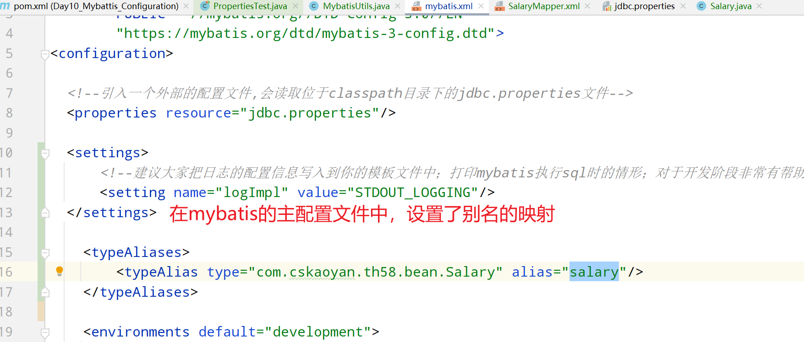

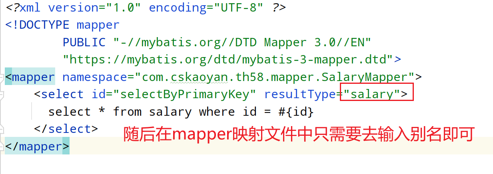


比如mybatis内部配置了Integer的别名,那么我们在使用的时候，直接去简写，写别名即可

```xml
<delete id="deleteByPrimaryKey" parameterType="int">
        delete from salary where id = #{id}
    </delete>
```

**关于详细的别名映射表，大家可以参考预习资料中的笔记**


### environments(了解)

是可以进行配置不同的环境，比如可以配置开发环境、测试环境、生产环境。使用的时候，直接进行切换即可。

如下所示：分别配置了三个环境，开发时，选择development；测试的时候切换为test；部署上线之后，切换为prod。只需要去更改default的值便可以进行切换。

按理来说，其实挺有用的，但是后续mybatis会整合spring框架来一起使用。后面会有其他的配置文件使用，所以这部分内容仅作为一个了解的部分即可。但是这里面涉及到的理想、理念可以学习一下。

```xml
<environments default="development">
        <environment id="development">
            <transactionManager type="JDBC"/>
            <dataSource type="POOLED">
                <property name="driver" value="${jdbc.driver}"/>
                <property name="url" value="${jdbc.url}"/>
                <property name="username" value="${jdbc.username}"/>
                <property name="password" value="${jdbc.password}"/>
            </dataSource>
        </environment>

        <environment id="test">
            <transactionManager type="JDBC"/>
            <dataSource type="POOLED">
                <property name="driver" value="${jdbc.driver}"/>
                <property name="url" value="${jdbc.url}"/>
                <property name="username" value="${jdbc.username}"/>
                <property name="password" value="${jdbc.password}"/>
            </dataSource>
        </environment>

        <environment id="prod">
            <transactionManager type="JDBC"/>
            <dataSource type="POOLED">
                <property name="driver" value="${jdbc.driver}"/>
                <property name="url" value="${jdbc.url}"/>
                <property name="username" value="${jdbc.username}"/>
                <property name="password" value="${jdbc.password}"/>
            </dataSource>
        </environment>
    </environments>
```


### mappers(掌握)

在mybatis主配置文件中去包含mapper映射文件。

如果mapper映射文件只有几个，那么使用前面的方式去开发的话还是可以接受的，但是如果mapper映射文件非常多的话，那么会非常痛苦。

如下所示，如果mapper映射文件非常多的话，那么建议设置一个包名，mybatis统一扫描一整个包里面的mapper映射文件。

```xml
<mappers>
        <package name="com.cskaoyan.th58.mapper"/>
    </mappers>
```


如果文件比较少的话，那么写成下面的这种方式也是ok的：

```xml
<mappers>
        <mapper resource="com/cskaoyan/th58/mapper/SalaryMapper.xml"/>
    </mappers>
```


## 输入映射

其实就是指的是参数的处理匹配过程。在mapper接口中如何定义一个形参变量，那么它是如何和mapper映射文件里面的占位符关联在一起的呢？

### 一个参数(非对象)

比如可以是整数、字符串等类型。

如果当前的形参只有一个的情况下，mapper映射文件中#{}里面的值其实可以：

1.写任意的值，但是写任意值可读性会比较差

2.一般情况下，我们就建议和形参的变量名称保持一致即可。

3.设置一个@Param("名称")，mapper接口中，那么我们需要和注解里面的名称保持一致

Mapper接口

```java
public interface SalaryMapper {

    Salary selectOneById(Integer id);

    Salary selectOneByName(String name);
}
```

mapper映射文件,注意此时id = 后面的值

```xml
<?xml version="1.0" encoding="UTF-8" ?>
<!DOCTYPE mapper
        PUBLIC "-//mybatis.org//DTD Mapper 3.0//EN"
        "https://mybatis.org/dtd/mybatis-3-mapper.dtd">
<mapper namespace="com.cskaoyan.th58.mapper.SalaryMapper">
    <select id="selectOneById" parameterType="int" resultType="com.cskaoyan.th58.bean.Salary">
        select * from salary where id = #{amaoagou}
    </select>

  <select id="selectOneByName" parameterType="string" resultType="com.cskaoyan.th58.bean.Salary">
        select * from salary where name = #{name}
  </select>
</mapper>
```


> 说明：#{}可以理解为是mybatis里面相对固定的一个写法，表示的是取值
>
> 还需要注意一点的是，在很多配置文件中，叫做${}写法


设置注解：

```java
public interface SalaryMapper {

    Salary selectOneById(Integer id);

    Salary selectOneByName(String name);


    Salary selectOneById2(@Param("id") Integer param);
}
```

注意：selectOneById2方法的#{}里面的值必须是id，因为注解设置的值是id，二者必须要求保持一致。

```xml
<?xml version="1.0" encoding="UTF-8" ?>
<!DOCTYPE mapper
        PUBLIC "-//mybatis.org//DTD Mapper 3.0//EN"
        "https://mybatis.org/dtd/mybatis-3-mapper.dtd">
<mapper namespace="com.cskaoyan.th58.mapper.SalaryMapper">
    <select id="selectOneById" parameterType="int" resultType="com.cskaoyan.th58.bean.Salary">
        select * from salary where id = #{amaoagou}
    </select>

  <select id="selectOneByName" parameterType="string" resultType="com.cskaoyan.th58.bean.Salary">
        select * from salary where name = #{name}
  </select>

    <select id="selectOneById2" parameterType="int" resultType="com.cskaoyan.th58.bean.Salary">
        select * from salary where id = #{id}
    </select>
</mapper>
```

总结：一个参数的情况下，在没有设置注解的情况下，可以写任意值，但是建议和形参保持一致；如果设置了注解，那么必须要求和注解的值一模一样。


> 注解回顾
>
> 注解可以有功能，也可以没有功能，完全取决于我们有没有去编写代码去处理该注解里面的内容。
>
> 注解可以设置元注解信息，比如设置改注解的生命周期：是在源码中生效、在class文件中生效，在运行时也生效
>
> 也可以设置编写的位置，比如可以设置在类的头上，也可以在方法的头上
>
> ```java
> //表示的是存在于哪个阶段，我们设置的是运行期间该注解还是存在的
> @Retention(RetentionPolicy.RUNTIME)
> //注解可以写在哪个头上；设置的是可以写在类的头上
> @Target(ElementType.TYPE)
> public @interface Log {
> 
>     String name() default "";
> }
> ```
>
> ```java
> @Log(name = "管理员登录")
> public class AdminLogin {
> }
> ```
>
> ```java
> public class AnnotationTest {
> 
>     @Test
>     public void test1(){
>         //如果我们希望对注解进行处理，那么需要借助于反射
>         try {
>             Class<?> aClass = Class.forName("com.cskaoyan.th58.annotation.AdminLogin");
>             Log log = aClass.getAnnotation(Log.class);
>             System.out.println(log.name());
>         } catch (ClassNotFoundException e) {
>             throw new RuntimeException(e);
>         }
>     }
> }
> ```
>
> 
>
> 


### 多个参数(掌握)

此时必须得添加@Param注解

接口：

```java
    Salary selectByNameAndSalary(@Param("name") String nm,@Param("salary") Double sl);

```

映射文件

```xml
 <select id="selectByNameAndSalary" resultType="com.cskaoyan.th58.bean.Salary">
        select * from salary where name = #{name} and salary = #{salary}
    </select>
```


### 对象传值(重点关注)

1.如果传递的参数是一个引用类型的对象，并且没有设置注解的情况。

接口：

```java
void insertOne(Salary salary);
```


映射文件：

```xml
<insert id="insertOne" parameterType="com.cskaoyan.th58.bean.Salary">
        insert into salary values (null, #{name}, #{salary});
    </insert>
```

注意，此时#{}里面的值，要求和对象里面的属性值是对应的，也就是mybatis通过set方法可以找到对应的属性


2.如果传递的是一个引用类型的对象，并且设置了注解。

接口：

```java
    void insertOne2(@Param("s") Salary salary);
```

映射文件；

```xml
<insert id="insertOne2" parameterType="com.cskaoyan.th58.bean.Salary">
        insert into salary values (null, #{s.name}, #{s.salary})
    </insert>
```


3.如果传递了多个对象呢？

接口：

```java
    void insertOne3(@Param("s") Salary salary,@Param("a") Account account);

```


映射文件：

```xml
<insert id="insertOne3">
        insert into salary values (null, #{s.name}, #{a.money})
    </insert>
```


### map

map传值，不建议，大家知道可以使用map传值就行了，也不用去练习。


### #和$区别(掌握)

#{}:相当于对于preparedStatement的sql语句预填充的封装形式。其实就相当于占位符。可以避免sql注入问题。

${}:相当于statement的拼接。可能会有sql注入的风险的。

使用的时候如何选择呢？

如果我们需要去接收用户输入的数据，可以使用#{}

如果我们不去接收用户输入的数据，开发人员自己去处理，那么可以使用${}


案例：假如现在有一个电商网站，用户注册的用户表，一共有3张表，业务设定了一个规则，根据用户注册的名字去取哈希值，根据哈希值的结果，进行运算，将数据存储在对应的表中。

接口

```java
public interface UserMapper {

    //注册
    void insertUser(@Param("u") User user, @Param("tb_name") String tbName);
    //登录

    User selectUser(@Param("name") String name,@Param("password") String password,@Param("tb_name") String tbName);
}
```

映射文件

```xml
<?xml version="1.0" encoding="UTF-8" ?>
<!DOCTYPE mapper
        PUBLIC "-//mybatis.org//DTD Mapper 3.0//EN"
        "https://mybatis.org/dtd/mybatis-3-mapper.dtd">
<mapper namespace="com.cskaoyan.th58.mapper.UserMapper">

  <insert id="insertUser" parameterType="com.cskaoyan.th58.bean.User">
    insert into ${tb_name} values (null, #{u.name}, #{u.password})
  </insert>
  <select id="selectUser" resultType="com.cskaoyan.th58.bean.User">
    select * from ${tb_name} where name = #{name} and password = #{password}
  </select>
</mapper>
```

测试代码：

```java
public class UserTest {


    @Test
    public void testRegister(){
        SqlSession sqlSession = MybatisUtils.getSqlSession();
        UserMapper userMapper = sqlSession.getMapper(UserMapper.class);
        User user = new User();
        user.setName("zhangsan");
        user.setPassword("zhangsan123");

        //准备表名
        int index = user.getName().hashCode() % 3;
        System.out.println(index);
        userMapper.insertUser(user, "user" + index);
        sqlSession.commit();
        sqlSession.close();
    }


    @Test
    public void testLogin(){
        SqlSession sqlSession = MybatisUtils.getSqlSession();
        UserMapper userMapper = sqlSession.getMapper(UserMapper.class);
        String name = "zhangsan";
        String password = "zhangsan123";

        int index = name.hashCode() % 3;

        User user = userMapper.selectUser(name, password, "user" + index);
        sqlSession.commit();
        sqlSession.close();
        Assert.assertNotNull(user);
    }
}
```


## 输出映射

### 一条结果(掌握)

比如查询用户的姓名。

```java
    String selectNameById(Integer id);

```


```xml
 <select id="selectNameById" resultType="string" parameterType="int">
      select name from user0 where id = #{id}
    </select>
```


### 多条结果(掌握)

```java
    //查询用户所有的姓名
    List<String> selectNames();

```


```xml
<select id="selectNames" resultType="string">
        select name from user0
    </select>
```


### 一行数据(掌握)

希望去接收一行数据，最常用的使用方式，是将这一行数据封装到一个对象中。

```java

    //查询一行数据------> 封装到一个对象中
    User selectById(Integer id);

```


```xml
  <select id="selectById" parameterType="int" resultType="com.cskaoyan.th58.bean.User">
        select * from user0 where id = #{id}
    </select>
```


### 多行数据(掌握)

```java
    List<User> selectAll();

```


```xml
 <select id="selectAll" resultType="com.cskaoyan.th58.bean.User">
        select * from user0
    </select>
```


注意：在封装一行数据到一个对象或者多个对象时，如果对象中的属性名称和数据库里面的字段属性名称对应不上，那么可能会无法封装，此时应该怎么办呢？


数据库中的表：

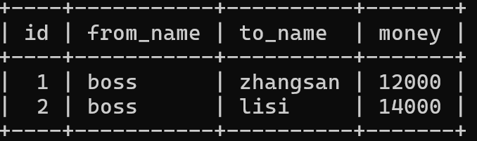


```java
public interface LogMapper {

    List<Log> selectAll();
}
```

```java
public class Log {

    private Integer id;

    private String fromName;

    private String toName;

    private Double money;

}
```


```xml
<?xml version="1.0" encoding="UTF-8" ?>
<!DOCTYPE mapper
        PUBLIC "-//mybatis.org//DTD Mapper 3.0//EN"
        "https://mybatis.org/dtd/mybatis-3-mapper.dtd">
<mapper namespace="com.cskaoyan.th58.mapper.LogMapper">
    <select id="selectAll" resultType="com.cskaoyan.th58.bean.Log">
      select * from log
    </select>
</mapper>
```

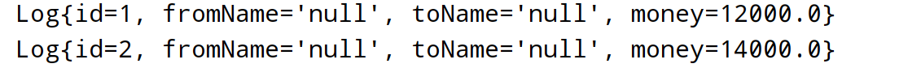


此时，数据因为字段的名称不同，没法封装成功。为什么呢？如何解决？

封装的时候主要利用反射来进行处理的，如果字段名称匹配不上，那么便无法封装成功；如何解决呢？

1.给列取别名

```xml
<select id="selectAll" resultType="com.cskaoyan.th58.bean.Log">
      select id, from_name as fromName, to_name as toName, money from log
    </select>
```

2.使用resultMap来进行封装


### ResultMap(掌握)

处理封装结果集的时候，可以选择resultType或者resultMap；如果数据库里面的字段和java对象里面的属性值是一样的话， 那么区别不是特别的大；但是如果java字段名称和数据库里面的字段名称差异比较大的时候，那么此时除了可以设置别名之外，还可以使用resultMap来进行处理

其实resultMap可以处理的事情，不仅仅还是上述介绍的如此，还可以帮助我们进行关联的查询等操作。

```xml
    List<Log> selectAll2();
```


```xml
<?xml version="1.0" encoding="UTF-8" ?>
<!DOCTYPE mapper
        PUBLIC "-//mybatis.org//DTD Mapper 3.0//EN"
        "https://mybatis.org/dtd/mybatis-3-mapper.dtd">
<mapper namespace="com.cskaoyan.th58.mapper.LogMapper">

  <!--定义一个resultMap，用来处理数据库和java类字段不匹配的问题，编号为baseMap1，使用的时候引用它-->
  <!--当前baseMap处理的对象时Log对象，也就是type的类型-->
  <resultMap id="baseMap1" type="com.cskaoyan.th58.bean.Log">
    <!--id列表示的是处理主键的信息 column表示的是在数据库中列的名称；property表示的是在java类对象中的属性名称-->
    <id column="id" property="id"/>
    <!--result用来去处理非主键列-->
    <result column="from_name" property="fromName"/>
    <result column="to_name" property="toName"/>
    <result column="money" property="money"/>
  </resultMap>

    <select id="selectAll" resultType="com.cskaoyan.th58.bean.Log">
      select id, from_name as fromName, to_name as toName, money from log
    </select>

  <select id="selectAll2" resultMap="baseMap1">
    select * from log
  </select>
</mapper>
```


## 插件介绍

### Lombok

在之前的开发过程中，我们频繁的做一件事情，那就是生成对应类的get和set方法；提供toString。这些步骤虽然有idea帮助我们生成，但是依然非常的繁琐。

之前的课程中，大家有接触过字节码技术，也就是程序运行期间，动态地产生字节码文件数据。lombok其实采用的也是类似的效果。在编译的时候，帮助我们去生成对应的get和set方法、以及toString、无参构造函数等等.....

我们其实只需要去引入一些注解即可完成。


使用步骤：

1.导包  导入依赖

```xml
<dependency>
            <groupId>org.projectlombok</groupId>
            <artifactId>lombok</artifactId>
            <version>1.18.30</version>
        </dependency>
```


2.在编写的java类对象头上标注对应的注解即可

@Data注解：会帮助我们生成对应的get和set方法，以及重写toString方法

```
@AllArgsConstructor：生成全参构造函数
@NoArgsConstructor：生成无参构造函数
```


### MybatisCodeHelperPro

可以帮助我们关联mapper接口和mapper映射文件，可以提供非常好用的提示、补全功能。

File-settings-plugins-

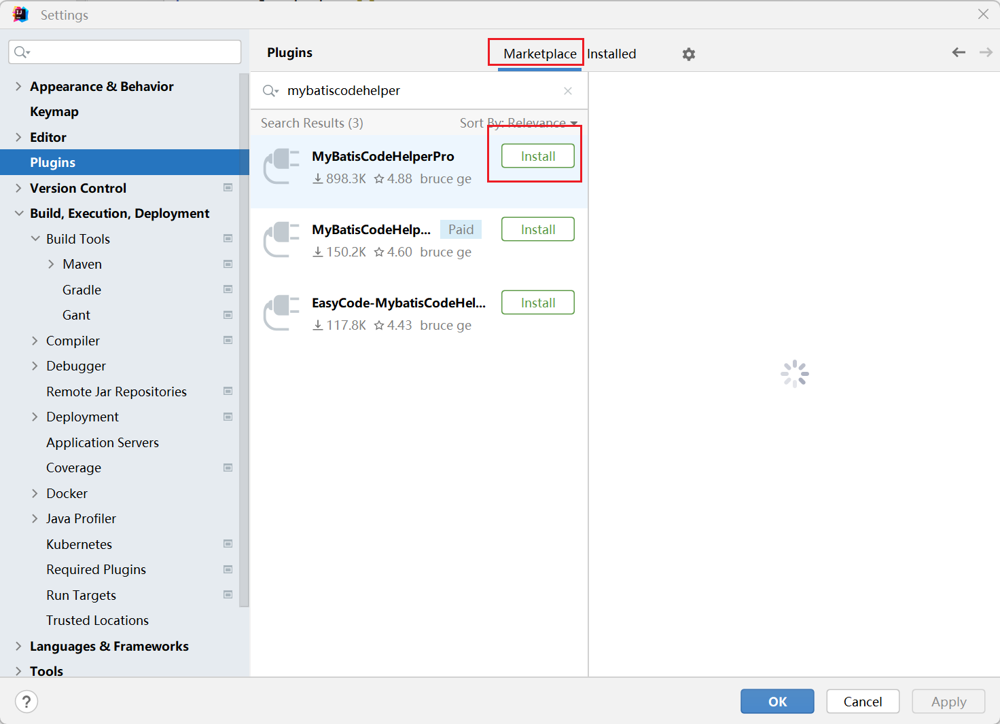


## 动态sql

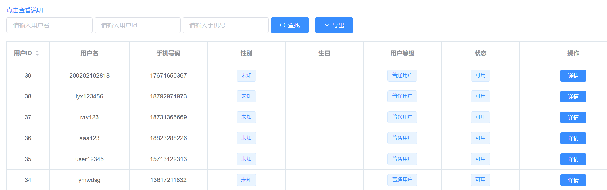

如上所述的这个页面，用户可以在输入框处输入对应的字符，那么便会搜索到指定的数据；如果多个输入框同时输入数据，那么应当满足且的关系。如果不使用mybatis，我们看一下应该如何来实现。

```sql
create table user(
	id int primary key auto_increment,
    username varchar(30),
    phone varchar(20)
);

insert into user values (null,'aaa123','18823288226');
insert into user values (null,'ray123','18976578965');
insert into user values (null,'user12345','15776536578');
insert into user values (null,'ymwdsg','18977865534');
```

```java
public class DynamicSqlDemo {

    public static void main(String[] args) throws SQLException {
        //先不使用mybatis，使用jdbc的代码来实现动态sql的功能
        //需要先思考一个问题：sql语句是固定的吗？
        //想到的解决方案是穷举：遍历所有的条件：3个条件 C3,1 c3,2 c3,3  3 + 3 + 1 + 1 = 8种
        //select * from user where id = ? and username = ? and phone = ?
        //综上所述，使用穷举法，如果面对的条件非常多的话，那么是不太可行的
        //这里面的思路：其实是根据传递的条件不同，动态地去拼接对应的sql语句

        //模拟从用户接收到的用户名、编号、手机等信息
        String username = "aaa123";
        Integer id = 1;
        String phone = "18823288226";

        Connection connection = DriverManager.getConnection("jdbc:mysql://localhost:3306/dynamic_table?characterEncoding=utf-8&useSSL=false", "root", "123456");
        dynamicSql(connection, username, id, phone);
        connection.close();
    }

    //因为用户输入的条件不是固定，或者说不是一定会输入对应的条件，所以sql语句也是不固定的
    private static void dynamicSql(Connection connection, String username, Integer id, String phone) throws SQLException {
        String sql = "select * from user ";
        String condition = "";
        //如果三者均是null，则condition是null，那么最终的sql语句就是sql
        //如果这三者之中有一个不是null，那么我们需要拼接一个where，并且将这三个condition最前面的and去掉
        List<Object> params = new ArrayList<>();
        if(username != null){
            condition += "and username = ? ";
            params.add(username);
        }
        if(id != null){
            condition += "and id = ? ";
            params.add(id);
        }
        if(phone != null){
            condition += "and phone = ? ";
            params.add(phone);
        }

        if(!condition.equals("")){
            //需要先将condition前面的and去掉
            condition = condition.substring(3);
            sql = sql + " where " + condition;
        }
        PreparedStatement preparedStatement = connection.prepareStatement(sql);
        //填充参数
        for (int i = 0; i < params.size(); i++) {
            preparedStatement.setObject( i + 1, params.get(i));
        }
        ResultSet resultSet = preparedStatement.executeQuery();
        while (resultSet.next()){
            int id1 = resultSet.getInt("id");
            String name = resultSet.getString("username");
            String phone1 = resultSet.getString("phone");
            User user = new User(id1, name, phone1);
            System.out.println(user);
        }
    }
}
```

上述过程，实现起来其实非常的繁琐。借助于框架提供的标签，可以非常轻松地实现上述的功能。

### where、if(掌握)

where标签和if标签本身二者之间并没有什么特殊的关联，但是在使用的时候，二者经常是一起来使用的。

我们可以在mapper映射文件中去编写诸如<where></where>标签或者<if></if>标签等。这些标签可以发挥很大的功能。比如以where条件为例：

**<where></where>:表示的是如果where标签里面的内容不为null(空的话)，则会在此处拼接一个where关键字;并且还会去除最开头以及末尾的and或者or**

**<if test='条件语句'>内容</if>表示的是如果test里面的条件语句返回值是true的话，那么会拼接if标签里面的内容。**

二者最常用的使用方式是二者组合在一起进行使用。

```sql
<where>
	<if test="条件语句">
		and username = xxx
	</if>
	<if test="条件语句">
		and id = xxx
	</if>
</where>

============>   where (and(where标签还会把最开头的and标签去掉)) username = xxx
```

```xml
<select id="selectByCondition" resultType="com.cskaoyan.th58.bean.User">
    select * from user
    <where>
      <!--此处写了一个where标签，不代表最终此处一定会有where，还取决于where标签内部有没有数据，如果为空，最终不会拼接where-->
      <!--if标签的test里面需要构建一个条件语句，最终要求返回true or false；如果返回的是true，则会在此处拼接上if标签里面的内容-->
      <!--where标签最终还会帮助我们将前缀、后缀的and 或者or去除-->
      <!--什么叫前缀、后缀？以什么开头、以什么结尾-->
      <if test="username != null and username != ''">
        and username = #{username}
      </if>
      <if test="id != null">
        and id = #{id}
      </if>
      <if test="phone != null and phone != ''">
        and phone = #{phone}
      </if>
    </where>
  </select>
```


### choose、when、otherwise

这个标签和java语言中的if.....else if....else if.....else的功能基本是一模一样的

该标签相较于上述的if标签最大的区别在哪呢？如果该标签的某个分支返回结果是true，则其他条件分支不会再处理了，但是if标签不是。

给上述表增加几列

```sql
alter table user add column email varchar(30);
alter table user add column password varchar(100);
```


