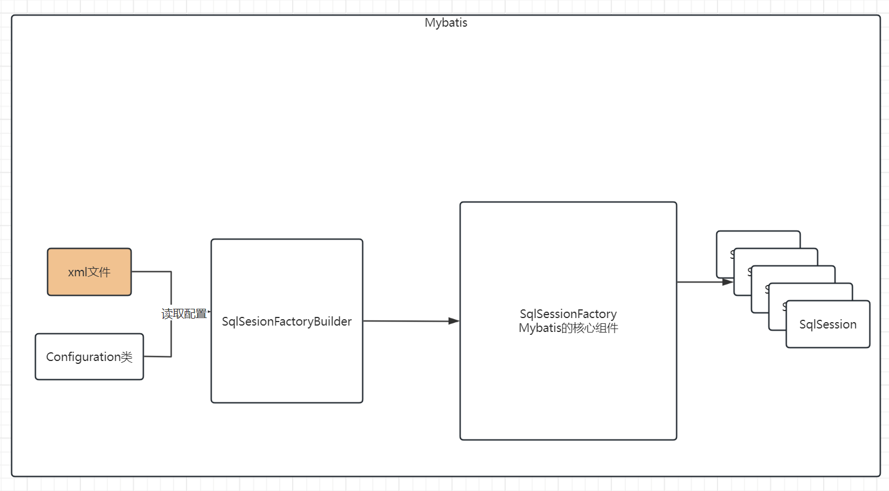

# Day9 Mybatis

## 概念

Mybatis是什么？为什么要学习Mybatis？

基于java语言的一个持久层的框架。什么叫做持久层？存储到硬盘。java代码都是在内存中进行运行的，无论你创建的是什么对象，都是存在于内存中的。如果断电，则数据就丢失了。希望数据可以以一种持久化的形式存储到本地硬盘。在没有学习Mybatis之前，我们是怎么做的？使用数据库，那么java语言是如何访问数据库的？JDBC。

为什么今天又要学习Mybatis呢？因为JDBC过程还是太过于繁琐了。我们希望可以使用一种更加方便的方式来处理。

下面，我们将使用jdbc来进行查询，并将查询的结果封装为对象。

## JDBC回顾

```java
public class DruidUtils {

    private static DataSource dataSource;


    static {
        Properties properties = new Properties();
        //可以直接使用类加载器来获取位于classpath目录下的文件输入流
        InputStream inputStream = DruidUtils.class.getClassLoader().getResourceAsStream("druid.properties");
        try {
            properties.load(inputStream);
            dataSource = DruidDataSourceFactory.createDataSource(properties);
        } catch (Exception e) {
            throw new RuntimeException(e);
        }
    }

    public static Connection getConnection() throws SQLException {
        return dataSource.getConnection();
    }
}
```

```java
public class JdbcDemo {

    public static void main(String[] args) {
        //查询一张表的数据，将数据结果封装成为一个对象 salary
        Connection connection = null;
        PreparedStatement preparedStatement = null;
        ResultSet resultSet = null;
        List<Salary> salaries = new ArrayList<>();
        try {
            connection = DruidUtils.getConnection();
            preparedStatement = connection.prepareStatement("select * from salary");
            resultSet = preparedStatement.executeQuery();
            while (resultSet.next()){
                int id = resultSet.getInt("id");
                String name = resultSet.getString("name");
                double salary = resultSet.getDouble("salary");
                salaries.add(new Salary(id, name, salary));
            }
        } catch (SQLException e) {
            throw new RuntimeException(e);
        }finally {
            try {
                if(connection != null){
                    connection.close();
                }
                if(preparedStatement != null){
                    preparedStatement.close();
                }
                if(resultSet != null){
                    resultSet.close();
                }
            }catch (Exception e){

            }
        }

        //打印一下list的数据
        for (Salary salary : salaries) {
            System.out.println(salary);
        }

    }
}
```

上述代码，是我们根据jdbc的执行流程，而编写的用于封装数据到java对象的形式。使用起来非常繁琐。如果今后我需要查询另外一张表，封装成为另外一个对象，那么这些代码完全不可以进行复用。还需要再次编写一遍。

使用mybatis其实可以帮助我们极大地简化开发工作。mybatis你可以理解为是使用了反射等原理，将上述过程又进行了进一步的封装。使得我们的业务开发流程更加的简洁、开发难度变得更低。

下面，我们将使用一段jdbc代码来给大家简单讲解mybatis的原理。

```java
public class JdbcDemo2 {

    public static void main(String[] args) throws Exception {
        //查询salary表，把数据封装成为List<Salary>形式

        Connection connection = DruidUtils.getConnection();
        List<Salary> salaryList = (List<Salary>) MockMybatis.query(connection, "select * from salary", Salary.class);
        for (Salary salary : salaryList) {
            System.out.println(salary);
        }

        //我们写的这段代码不仅可以用来封装salary表，也可以用来封装log表
        List<Log> logList = (List<Log>) MockMybatis.query(connection, "select * from log", Log.class);

        for (Log log : logList) {
            System.out.println(log);
        }
        connection.close();
    }
}
```

```java
//这个类用来去模拟mybatis的简单原理
public class MockMybatis {

    //定义了一个查询方法
    //接收三个参数：1.connection对象，数据库的连接  2.执行的sql语句   3.封装的结果数据类型
    public static Object query(Connection connection,String sql, Class clazz) throws SQLException, NoSuchMethodException, InvocationTargetException, InstantiationException, IllegalAccessException, NoSuchFieldException {
        PreparedStatement preparedStatement = connection.prepareStatement(sql);
        //为了简单起见，我们就不去处理参数了
        ResultSet resultSet = preparedStatement.executeQuery();
        ResultSetMetaData metaData = preparedStatement.getMetaData();
        //找到无参构造函数
        List list = new ArrayList<>();
        Constructor constructor = clazz.getConstructor();
        while (resultSet.next()){
            //每调用一次next，那么便是处理一行数据，一行数据便对应着一个对象
            Object o = constructor.newInstance();
            //不清楚表的列名以及对应的类型是什么类型
            //实际上，里面会存储一些元数据，何为元数据呢？元数据指的便是数据的数据，比如表中存储了一行数据，这个是数据，元数据指的是这个数据对应的列的信息
            //比如列名叫什么、类型是什么类型
            //列名是什么呢？在元数据里面是有的
            int columnCount = metaData.getColumnCount();
            for (int i = 0; i < columnCount; i++) {
                //索引是从1开始的，不是从0开始的
                String columnLabel = metaData.getColumnLabel(i + 1);
                //查询到的列名对应的值，应该赋值给谁？赋值给对应的对象中的同名的属性
                Object columnValue = resultSet.getObject(columnLabel);
                System.out.println(columnLabel + ":" + columnValue);
                //这里面需要做的事情便是去封装数据，利用名称对应来进行封装，比如salary表里面的id、name、salary对应的是Salary类里面的id、name、salary
                //其实便是查找对应的属性，利用属性的名称去查找对应的属性；属性的名称刚好和列的列名是一致的
                Field field = clazz.getDeclaredField(columnLabel);
                //暴力访问
                field.setAccessible(true);
                //利用反射直接给属性进行赋值操作
                field.set(o, columnValue);
            }
            list.add(o);
        }
        preparedStatement.close();
        resultSet.close();
        return list;
    }
}
```

## Mybatis入门案例

官方网站：https://mybatis.org/mybatis-3/zh_CN/index.html


1.导入依赖

```xml
<dependencies>
        <dependency>
            <groupId>org.mybatis</groupId>
            <artifactId>mybatis</artifactId>
            <version>3.5.9</version>
        </dependency>

        <dependency>
            <groupId>mysql</groupId>
            <artifactId>mysql-connector-java</artifactId>
            <version>8.0.33</version>
            <scope>runtime</scope>
        </dependency>
    </dependencies>
```

2.准备mybatis的主配置文件(xml文件)

> 提一句：后面可能会经常需要创建mybatis的项目，考虑到配置文件不会写，建议大家把xml配置文件写成一个模板，后续去修改模板即可。
>
> File-settings-Editior-File and code templates
>
> 


3.准备mapper映射文件(xml文件,作用就是用来去映射sql语句的)


随后我们需要去编写mapper.xml文件，那么我们建议再resources目录下新建com/cskaoyan/th58/mapper目录，将mapper映射文件放置在该处(特别需要注意一点的是：在resources目录下不可以用com.cskaoyan.th58来创建多级目录)，也就是我们要求大家mapper映射文件所在的目录要和代码的包目录名称一致


随后需要再mybatis的主配置文件中去注册当前mapper映射文件

```xml
<?xml version="1.0" encoding="UTF-8" ?>
<!DOCTYPE configuration
        PUBLIC "-//mybatis.org//DTD Config 3.0//EN"
        "https://mybatis.org/dtd/mybatis-3-config.dtd">
<configuration>
    <environments default="development">
        <environment id="development">
            <transactionManager type="JDBC"/>
            <dataSource type="POOLED">
                <property name="driver" value="com.mysql.cj.jdbc.Driver"/>
                <property name="url" value="jdbc:mysql://localhost:3306/tx?characterEncoding=utf-8&amp;useSSL=false"/>
                <property name="username" value="root"/>
                <property name="password" value="123456"/>
            </dataSource>
        </environment>
    </environments>
    <mappers>
        <mapper resource="com/cskaoyan/th58/mapper/SalaryMapper.xml"/>
    </mappers>
</configuration>
```


4.编写mapper映射文件里面的内容

```xml
<?xml version="1.0" encoding="UTF-8" ?>
<!DOCTYPE mapper
        PUBLIC "-//mybatis.org//DTD Mapper 3.0//EN"
        "https://mybatis.org/dtd/mybatis-3-mapper.dtd">
<mapper namespace="com.cskaoyan.th58.mapper.SalaryMapper">
    <select id="selectOne" resultType="com.cskaoyan.th58.bean.Salary">
        select * from salary where id = #{id}
    </select>
</mapper>
```


5.编写代码来处理


## Mybatis原理



1.对于Mybatis来说，其核心组件是SqlSessionFactory，它是一切功能的前提。

2.SqlSessionFactory翻译可以翻译成为SqlSession的工厂，那么顾名思义就是批量生产SqlSession的地方。SqlSession又是什么东西呢？sql的会话，你可以理解为就是之前的一个一个的连接。

3.SqlSessionFactory需要借助于SqlSessionFactoryBuilder来获取；SqlSessionFactoryBuilder可以通过读取xml文件或者读取Configuration配置类的方式来获取。