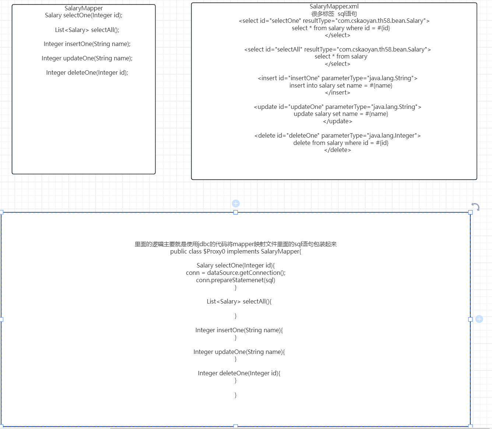

# Day9 Mybatis

## 概念

Mybatis是什么？为什么要学习Mybatis？

基于java语言的一个持久层的框架。什么叫做持久层？存储到硬盘。java代码都是在内存中进行运行的，无论你创建的是什么对象，都是存在于内存中的。如果断电，则数据就丢失了。希望数据可以以一种持久化的形式存储到本地硬盘。在没有学习Mybatis之前，我们是怎么做的？使用数据库，那么java语言是如何访问数据库的？JDBC。

为什么今天又要学习Mybatis呢？因为JDBC过程还是太过于繁琐了。我们希望可以使用一种更加方便的方式来处理。

下面，我们将使用jdbc来进行查询，并将查询的结果封装为对象。

## JDBC回顾

```java
public class DruidUtils {

    private static DataSource dataSource;


    static {
        Properties properties = new Properties();
        //可以直接使用类加载器来获取位于classpath目录下的文件输入流
        InputStream inputStream = DruidUtils.class.getClassLoader().getResourceAsStream("druid.properties");
        try {
            properties.load(inputStream);
            dataSource = DruidDataSourceFactory.createDataSource(properties);
        } catch (Exception e) {
            throw new RuntimeException(e);
        }
    }

    public static Connection getConnection() throws SQLException {
        return dataSource.getConnection();
    }
}
```

```java
public class JdbcDemo {

    public static void main(String[] args) {
        //查询一张表的数据，将数据结果封装成为一个对象 salary
        Connection connection = null;
        PreparedStatement preparedStatement = null;
        ResultSet resultSet = null;
        List<Salary> salaries = new ArrayList<>();
        try {
            connection = DruidUtils.getConnection();
            preparedStatement = connection.prepareStatement("select * from salary");
            resultSet = preparedStatement.executeQuery();
            while (resultSet.next()){
                int id = resultSet.getInt("id");
                String name = resultSet.getString("name");
                double salary = resultSet.getDouble("salary");
                salaries.add(new Salary(id, name, salary));
            }
        } catch (SQLException e) {
            throw new RuntimeException(e);
        }finally {
            try {
                if(connection != null){
                    connection.close();
                }
                if(preparedStatement != null){
                    preparedStatement.close();
                }
                if(resultSet != null){
                    resultSet.close();
                }
            }catch (Exception e){

            }
        }

        //打印一下list的数据
        for (Salary salary : salaries) {
            System.out.println(salary);
        }

    }
}
```

上述代码，是我们根据jdbc的执行流程，而编写的用于封装数据到java对象的形式。使用起来非常繁琐。如果今后我需要查询另外一张表，封装成为另外一个对象，那么这些代码完全不可以进行复用。还需要再次编写一遍。

使用mybatis其实可以帮助我们极大地简化开发工作。mybatis你可以理解为是使用了反射等原理，将上述过程又进行了进一步的封装。使得我们的业务开发流程更加的简洁、开发难度变得更低。

下面，我们将使用一段jdbc代码来给大家简单讲解mybatis的原理。

```java
public class JdbcDemo2 {

    public static void main(String[] args) throws Exception {
        //查询salary表，把数据封装成为List<Salary>形式

        Connection connection = DruidUtils.getConnection();
        List<Salary> salaryList = (List<Salary>) MockMybatis.query(connection, "select * from salary", Salary.class);
        for (Salary salary : salaryList) {
            System.out.println(salary);
        }

        //我们写的这段代码不仅可以用来封装salary表，也可以用来封装log表
        List<Log> logList = (List<Log>) MockMybatis.query(connection, "select * from log", Log.class);

        for (Log log : logList) {
            System.out.println(log);
        }
        connection.close();
    }
}
```

```java
//这个类用来去模拟mybatis的简单原理
public class MockMybatis {

    //定义了一个查询方法
    //接收三个参数：1.connection对象，数据库的连接  2.执行的sql语句   3.封装的结果数据类型
    public static Object query(Connection connection,String sql, Class clazz) throws SQLException, NoSuchMethodException, InvocationTargetException, InstantiationException, IllegalAccessException, NoSuchFieldException {
        PreparedStatement preparedStatement = connection.prepareStatement(sql);
        //为了简单起见，我们就不去处理参数了
        ResultSet resultSet = preparedStatement.executeQuery();
        ResultSetMetaData metaData = preparedStatement.getMetaData();
        //找到无参构造函数
        List list = new ArrayList<>();
        Constructor constructor = clazz.getConstructor();
        while (resultSet.next()){
            //每调用一次next，那么便是处理一行数据，一行数据便对应着一个对象
            Object o = constructor.newInstance();
            //不清楚表的列名以及对应的类型是什么类型
            //实际上，里面会存储一些元数据，何为元数据呢？元数据指的便是数据的数据，比如表中存储了一行数据，这个是数据，元数据指的是这个数据对应的列的信息
            //比如列名叫什么、类型是什么类型
            //列名是什么呢？在元数据里面是有的
            int columnCount = metaData.getColumnCount();
            for (int i = 0; i < columnCount; i++) {
                //索引是从1开始的，不是从0开始的
                String columnLabel = metaData.getColumnLabel(i + 1);
                //查询到的列名对应的值，应该赋值给谁？赋值给对应的对象中的同名的属性
                Object columnValue = resultSet.getObject(columnLabel);
                System.out.println(columnLabel + ":" + columnValue);
                //这里面需要做的事情便是去封装数据，利用名称对应来进行封装，比如salary表里面的id、name、salary对应的是Salary类里面的id、name、salary
                //其实便是查找对应的属性，利用属性的名称去查找对应的属性；属性的名称刚好和列的列名是一致的
                Field field = clazz.getDeclaredField(columnLabel);
                //暴力访问
                field.setAccessible(true);
                //利用反射直接给属性进行赋值操作
                field.set(o, columnValue);
            }
            list.add(o);
        }
        preparedStatement.close();
        resultSet.close();
        return list;
    }
}
```

## Mybatis入门案例(熟悉)

官方网站：https://mybatis.org/mybatis-3/zh_CN/index.html


**1.导入依赖**

```xml
<dependencies>
        <dependency>
            <groupId>org.mybatis</groupId>
            <artifactId>mybatis</artifactId>
            <version>3.5.9</version>
        </dependency>

        <dependency>
            <groupId>mysql</groupId>
            <artifactId>mysql-connector-java</artifactId>
            <version>8.0.33</version>
            <scope>runtime</scope>
        </dependency>
    </dependencies>
```

**2.准备mybatis的主配置文件(xml文件)**

> 提一句：后面可能会经常需要创建mybatis的项目，考虑到配置文件不会写，建议大家把xml配置文件写成一个模板，后续去修改模板即可。
>
> File-settings-Editior-File and code templates
>
> 


**3.准备mapper映射文件(xml文件,作用就是用来去映射sql语句的)**


随后我们需要去编写mapper.xml文件，那么我们建议再resources目录下新建com/cskaoyan/th58/mapper目录，将mapper映射文件放置在该处(特别需要注意一点的是：在resources目录下不可以用com.cskaoyan.th58来创建多级目录)，也就是我们要求大家mapper映射文件所在的目录要和代码的包目录名称一致


随后需要再mybatis的主配置文件中去注册当前mapper映射文件

```xml
<?xml version="1.0" encoding="UTF-8" ?>
<!DOCTYPE configuration
        PUBLIC "-//mybatis.org//DTD Config 3.0//EN"
        "https://mybatis.org/dtd/mybatis-3-config.dtd">
<configuration>
    <environments default="development">
        <environment id="development">
            <transactionManager type="JDBC"/>
            <dataSource type="POOLED">
                <property name="driver" value="com.mysql.cj.jdbc.Driver"/>
                <property name="url" value="jdbc:mysql://localhost:3306/tx?characterEncoding=utf-8&amp;useSSL=false"/>
                <property name="username" value="root"/>
                <property name="password" value="123456"/>
            </dataSource>
        </environment>
    </environments>
    <mappers>
        <mapper resource="com/cskaoyan/th58/mapper/SalaryMapper.xml"/>
    </mappers>
</configuration>
```


**4.编写mapper映射文件里面的内容**

```xml
<?xml version="1.0" encoding="UTF-8" ?>
<!DOCTYPE mapper
        PUBLIC "-//mybatis.org//DTD Mapper 3.0//EN"
        "https://mybatis.org/dtd/mybatis-3-mapper.dtd">
<mapper namespace="com.cskaoyan.th58.mapper.SalaryMapper">
    <select id="selectOne" resultType="com.cskaoyan.th58.bean.Salary">
        select * from salary where id = #{id}
    </select>
</mapper>
```


**5.编写代码来处理**

```java
public class MybatisDemo1 {

    public static void main(String[] args) {

        //获取SqlSessionFactory
        //mybatis.xml文件的输入流
        //获取该文件的输入流，可以使用我们昨天介绍的classloader.getResourceAsStream也可以使用今天介绍的
        InputStream inputStream = MybatisDemo1.class.getClassLoader().getResourceAsStream("mybatis.xml");
//        InputStream inputStream = Resources.getResourceAsStream("mybatis.xml");
        SqlSessionFactory sessionFactory = new SqlSessionFactoryBuilder().build(inputStream);
        SqlSession sqlSession = sessionFactory.openSession();
        //此处不需要去写sql语句，而是直接去写sql语句对应的编号(namespace + id)
        Salary salary = sqlSession.selectOne("com.cskaoyan.th58.mapper.SalaryMapper.selectOne", 1);
        System.out.println(salary);
        //查询的时候可以不用commit也可以，但是增晒改的时候一定得记得commit
        //下面两行代码就可以理解为是对于jdbc的进一步封装
        //对于connection.commit()封装
        sqlSession.commit();
        //对于connection、preparedStatement、ResultSet.close的封装
        sqlSession.close();
    }
}
```


## Mybatis原理


1.对于Mybatis来说，其核心组件是SqlSessionFactory，它是一切功能的前提。

2.SqlSessionFactory翻译可以翻译成为SqlSession的工厂，那么顾名思义就是批量生产SqlSession的地方。SqlSession又是什么东西呢？sql的会话，你可以理解为就是之前的一个一个的连接。

3.SqlSessionFactory需要借助于SqlSessionFactoryBuilder来获取；SqlSessionFactoryBuilder可以通过读取xml文件或者读取Configuration配置类的方式来获取。


对于mybatis来说，核心组件是SqlSessionFactory，SqlSessionFactory可以由SqlSessionFactoryBuilder通过去读取mybatis.xml主配置文件来创建，读取主配置文件时，也会进一步去扫描读取mapper映射文件，可以在内部形成那么namespace + id和sql语句的一个映射关系。后续我们利用SqlSessionFactory创建出SqlSession时，利用SqlSession来操作sql语句时，输入对应的编号，那么便可以对应着这条sql语句，便可以执行这条sql语句。


## 对象的作用域及生命周期

SqlSessionFactoryBuilder：使用过后就可以直接丢弃了，不会再使用了。

SqlSessionFactory：SqlSessionFactory 一旦被创建就应该在应用的运行期间一直存在，没有任何理由丢弃它或重新创建另一个实例。

SqlSession：每个线程都应该有它自己的 SqlSession 实例。SqlSession 的实例不是线程安全的，因此是不能被共享的，所以它的最佳的作用域是请求或方法作用域。 绝对不能将 SqlSession 实例的引用放在一个类的静态域，甚至一个类的实例变量也不行。简而言之，一句话，**那就是sqlSession只可以在局部变量中使用，绝对不能够去写静态成员变量或者成员变量**。

受上述启发，我们可以编写一个工具类：

```java
public class MybatisUtils {

    private static SqlSessionFactory factory;

    static {
        InputStream inputStream = MybatisUtils.class.getClassLoader().getResourceAsStream("mybatis.xml");
        factory = new SqlSessionFactoryBuilder().build(inputStream);
    }
    
    public static SqlSession getSqlSession(){
        return factory.openSession();
    }
}
```


## 动态代理方式(重点)

在上面的案例中，我们使用mybatis来操作数据库，使用的是sqlSession.selectOne(编号，参数)这种方式来操作数据库。除了使用这种方式之外，还可以使用另外一种方式，那就是程序运行期间，动态地去产生一个代理类对象，通过操作代理类对象的方法来操作数据库。使用动态代理方式，对于后续整合其他框架非常的方便。

在上述案例的基础上，我们只需要做略微改动即可：

1.在前面的SalaryMapper.xml文件中，当前mapper的namespace关联了一个SalaryMapper，那么我们需要做的事情便是在该处创建一个SalaryMapper接口

```xml
<?xml version="1.0" encoding="UTF-8" ?>
<!DOCTYPE mapper
        PUBLIC "-//mybatis.org//DTD Mapper 3.0//EN"
        "https://mybatis.org/dtd/mybatis-3-mapper.dtd">
<mapper namespace="com.cskaoyan.th58.mapper.SalaryMapper">
    <select id="selectOne" resultType="com.cskaoyan.th58.bean.Salary">
        select * from salary where id = #{id}
    </select>
</mapper>
```

2.需要在SalaryMapper接口中定义方法，方法的名称要求和mapper映射文件里面的id保持相同。方法的返回值类型要求和resultType要求的类型保持一致。参数的类型便是根据具体情况去传递即可。

> 注意：如果我们执行的是查询全部数据，查询得到的是一个Lsit<Salary>，那么在写resultType时，依然是写Salary
>
> 如果是增晒改，那么接口中的方法的返回值写什么呢？可以写void或者int，表示的是影响的行数
>
> 最终经过编译之后，Mapper接口文件和Mapper映射文件应该在一个地方，如果后续出现异常，需要确认一下，二者是否在一起。并且Mapper接口的名称和mapper映射文件的名称应该是一致的。

```java
public interface SalaryMapper {

    Salary selectOne(Integer id);

    List<Salary> selectAll();
    
    Integer insertOne(String name);

    Integer updateOne(String name);

    Integer deleteOne(Integer id);
}
```

3.编写代码

```java
public class MybatisDemo3 {

    public static void main(String[] args) {
        //之前封装的一个工具类，每次操作数据库的时候，都要调用一次
        //这个sqlSession就相当于一个连接connection
        SqlSession sqlSession = MybatisUtils.getSqlSession();
        //使用一种基于动态代理的方式，提供了一个接口；后续mybatis会在程序运行期间，动态地产生一个类对象
        SalaryMapper salaryMapper = sqlSession.getMapper(SalaryMapper.class);
        List<Salary> salaries = salaryMapper.selectAll();
        for (Salary salary : salaries) {
            System.out.println(salary);
        }

        Integer rows = salaryMapper.insertOne("阿齐");
        System.out.println(rows);

        salaryMapper.updateOne("aqi");

        salaryMapper.deleteOne(1);

        sqlSession.commit();
        sqlSession.close();
    }
}
```

## 动态代理方式的原理

1.程序运行期间，动态地产生一个类对象，该对象需要去实现SalaryMapper接口，那么也就需要实现接口里面的方法。

2.实现接口中的方法，应该如何实现呢？简单来说便是使用jdbc的代码将mapper映射文件里面的sql语句包装起来，根据接口的返回值，返回对应的对象即可




## 增删改查及转账案例

### CRUD

Mapper接口

```java
public interface SalaryMapper {

    Salary selectOne(Integer id);

    List<Salary> selectAll();

    Integer insertOne(Salary salary);

    Integer updateByPrimaryKey(Salary salary);

    Integer deleteByPrimaryKey(Integer id);
}
```

mapper.xml映射文件

```xml
<mapper namespace="com.cskaoyan.th58.mapper.SalaryMapper">
    <select id="selectOne" parameterType="java.lang.Integer" resultType="com.cskaoyan.th58.bean.Salary">
        select * from salary where id = #{id}
    </select>

    <select id="selectAll" resultType="com.cskaoyan.th58.bean.Salary">
      select * from salary
    </select>

  <insert id="insertOne" parameterType="com.cskaoyan.th58.bean.Salary">
    insert into salary values (null, #{name}, #{salary})
  </insert>

  <update id="updateByPrimaryKey" parameterType="com.cskaoyan.th58.bean.Salary">
    update salary set name = #{name}, salary = #{salary} where id = #{id}
  </update>

  <delete id="deleteByPrimaryKey" parameterType="java.lang.Integer">
    delete from salary where id = #{id}
  </delete>

</mapper>
```


单元测试：

```java
public class CRUDTest {

    @Test
    public void testQuery(){
        //获取操作数据库的一个连接
        SqlSession session = MybatisUtils.getSession();
        //程序运行期间动态地产生一个mapper实例对象，该对象内部封装了对应的sql语句，我们可以直接使用对象的方法来进行操作
        SalaryMapper salaryMapper = session.getMapper(SalaryMapper.class);
        Salary salary = salaryMapper.selectOne(2);
        System.out.println(salary);
        session.commit();
        session.close();
    }


    @Test
    public void testQuery2(){
        //获取操作数据库的一个连接
        SqlSession session = MybatisUtils.getSession();
        //程序运行期间动态地产生一个mapper实例对象，该对象内部封装了对应的sql语句，我们可以直接使用对象的方法来进行操作
        SalaryMapper salaryMapper = session.getMapper(SalaryMapper.class);
        List<Salary> salaries = salaryMapper.selectAll();
        for (Salary salary : salaries) {
            System.out.println(salary);
        }
        session.commit();
        session.close();
    }


    @Test
    public void testInsert(){
        SqlSession session = MybatisUtils.getSession();
        SalaryMapper salaryMapper = session.getMapper(SalaryMapper.class);
        Salary salary = new Salary();
        salary.setName("空灵");
        salary.setSalary(12000.0);
        Integer rows = salaryMapper.insertOne(salary);
        Assert.assertEquals(1,rows.longValue());
        //增删改一定得记得提交
        session.commit();
        //无论查询还是增删改都必须得close
        session.close();
    }

    @Test
    public void testUpdate(){
        SqlSession session = MybatisUtils.getSession();
        SalaryMapper salaryMapper = session.getMapper(SalaryMapper.class);
        Salary salary = new Salary();
        salary.setId(7);
        salary.setName("kongling");
        salary.setSalary(15000.0);
        Integer rows = salaryMapper.updateByPrimaryKey(salary);
        Assert.assertEquals(1, rows.longValue());
        session.commit();
        session.close();
    }

    @Test
    public void testDelete(){
        SqlSession session = MybatisUtils.getSession();
        SalaryMapper salaryMapper = session.getMapper(SalaryMapper.class);
        Integer rows = salaryMapper.deleteByPrimaryKey(2);
        Assert.assertEquals(1, rows.longValue());
        session.commit();
        session.close();
    }
}
```

### 转账

接口文件

```java
public interface AccountMapper {


    void updateMoneyByName(Account account);
}
```


xml映射文件

```xml
<?xml version="1.0" encoding="UTF-8" ?>
<!DOCTYPE mapper
        PUBLIC "-//mybatis.org//DTD Mapper 3.0//EN"
        "https://mybatis.org/dtd/mybatis-3-mapper.dtd">
<mapper namespace="com.cskaoyan.th58.mapper.AccountMapper">

  <update id="updateMoneyByName" parameterType="com.cskaoyan.th58.bean.Account">
    update account set money = money - #{money} where name = #{name}
  </update>
</mapper>
```

转账代码：

```java
public class TransaferTest {


    @Test
    public void testTransfer(){
        SqlSession session = MybatisUtils.getSession();
        AccountMapper mapper = session.getMapper(AccountMapper.class);
        //此时就不需要再去开启事务之类的操作了，因为sqlSession封装的connection默认就是不会自动提交事务
        Account fromAccount = new Account();
        fromAccount.setName("boss");
        fromAccount.setMoney(12000.0);

        Account toAccount = new Account();
        toAccount.setName("zhangsan");
        toAccount.setMoney(-12000.0);

        try {
            mapper.updateMoneyByName(fromAccount);
            int i = 1 / 0;
            mapper.updateMoneyByName(toAccount);
            //session的commit其实就是对于jdbc的commit的封装
            session.commit();
        }catch (Exception e){
            e.printStackTrace();
            session.rollback();
        }finally {
            session.close();
        }
    }
}
```


## 事务解决方案

一共有三种，但是建议使用的时候还是使用我们之前的课程中演示的方式

session.commit()这种方式。

