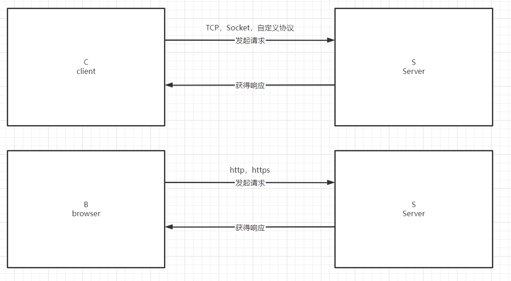

# 数据库基础

学习目标：<span style=color:yellow;background:red>**SQL是重点，需要重点掌握。**</span>

- 掌握什么是数据库。为什么有数据库这个东西
- 了解关系型数据库，非关系型数据库。在工作中的主要区别。
- 熟悉库、表、数据，内部组织形式
- 掌握对库的增加、删除、查询操作。修改操作了解即可
- 掌握对表的增加、删除、查询操作。修改操作了解即可
- 掌握对数据的增删改查。<span style=color:yellow;background:red>**非常重要**</span>。
- 掌握特殊关键字的使用
- 了解多表设计，并能对常见的表格进行建表操作
- 了解数据库设计三大范式
- 熟练掌握多表查询，内连接和外连接的区别及联系。

## 什么是数据库

<font color=red><b>数据库，是存储和管理数据的仓库。</b></font>
什么是仓库，就是有效的组织物品的地方。所谓数据仓库，就是集中存放数据的地方，且可以有效的组织这些数据，利用这些数据。


生活中的例子： 

图书馆。 书非常多。 索引。  高效组织图书的仓库。

超市。   山姆。万达超市。


<font color=red>**存储数据**</font>

txt也可以存储。excel也可以存储。为什么需要数据库呢？

组织数据的效率不高。


生活中excel，很多单位使用excel来存储一些数据，比如一些仓库，或者班主任让大家填写信息的时候。

那我们为什么需要学习数据库呢？<font color=red>**因为excel功能不够强大**</font>，而且数据量太大的情况下，<font color=red>**性能太低。**</font>
和excel类似，数据库也是采用表格来管理数据的。

>1. Database**：**A database is an organized collection of data,stored and accessed electronically.
>
>2. 数据库是按照数据结构来组织、存储和管理数据的仓库。分门别类的来存储数据。
>3. 数据库是一种结构化信息或数据的有组织的集合。
>4. 在现实中，数据、[数据库管理系统 (DBMS)](Database%20Management%20System) 一起被称为数据库系统，通常简称为数据库。


结构化信息： 对于每一行，结构都是一致的。比如第一行  有三列，第10000行，也有三列。

## 数据库的历史

>自 20 世纪 60 年代初诞生至今，数据库已经发生了翻天覆地的变化。最初，人们使用分层数据库（树形模型/一对多）和网络数据库（图模型/多对多）这样的导航数据库来存储和操作数据。这些早期系统虽然简单，但缺乏灵活性。
>20 世纪 80 年代，[关系数据库]()开始兴起.
>20 世纪 90 年代，[面向对象的数据库]()开始成为主流。
>最近，随着互联网的快速发展，为了更快速地处理非结构化数据，[NoSQL 数据库]()应运而生。主要特点就是快。


问题： 关系型数据库和非关系型数据库分别存储在哪呢？ 关系型数据库存储在硬盘，非关系型数据库存储在内存中

硬盘： 持久化、速度慢

内存： 非持久化、速度快。

# 数据库分类

## 关系型数据库

<font color=red>**什么是关系型数据库呢？**</font>
关系型数据库表示这种数据库，不仅可以存储数据，还可以存储数据与数据之间的关系。
这种，不仅可以存数据，还可以用存关系的数据库，这就是关系型数据库。比如这个省份表，城市表，以及它们的关系，在关系型数据库中，可以存储这种关联。


接下来，我们介绍几款常见的关系型数据库。

- Oracle：甲骨文公司的一个产品，世界上使用最多的收费型数据库。性能较好。

  >又名Oracle RDBMS(Relational Database Management System)，或简称Oracle。是甲骨文公司的一款关系数据库管理系统。它是在数据库领域一直处于领先地位的产品。可以说Oracle数据库系统是世界上流行的关系数据库管理系统，系统可移植性好、使用方便、功能强，适用于各类大、中、小微机环境。它是一种高效率的、可靠性好的、适应高吞吐量的数据库方案
  ><font color=red><b>使用公司</b></font>：大商业公司，政府使用较多，但近几年由于一些原因，银行，政府机构等正在替换Oracle。

- <span style="color:red;background:yellow"><b>MySQL</b></span>：最流行的关系型数据库，之前是开源的。

  >由瑞典MySQL AB公司开发，目前属于Oracle旗下产品。MySQL是最流行的关系型数据库管理系统之一。
  >目前分为两种版本：社区版，收费版。
  >注：2008年被Sun公司收购。2009年，Sun公司被Oracle收购。
  ><font color=red><b>使用公司</b></font>：中小企业，追求快速发展。性能非常优秀。

- MariaDB：MySQL原作者开发的，MySQL被Oracle收购后，考虑到Oracle可能会将其闭源，所以基于MySQL的一个分支，又开发了一个MariaDB。

>MariaDB数据库管理系统是MySQL的一个分支，主要由开源社区在维护，采用GPL授权许可 MariaDB的目的是完全兼容MySQL，包括API和命令行，使之能轻松成为MySQL的代替品。MariaDB名称来自Michael Widenius的女儿Maria的名字。
>
><font color=red><b>使用公司</b></font>：中小企业，追求快速发展。MySQL作者的粉丝。MaxDB

- Sql server：微软开发的。

>SQL Server是由微软公司开发的一种关系型据库管理系统，它已广泛用于电子商务、银行、保险、电力等行业。SQLServer提供了对XML和Internet标准的支持，具有强大的、灵活的、基于Web的应用程序管理功能。而且界面友好、易于操作，深受广大用户的喜爱，但它只能在Windows平台上运行(2017 SQL Server后对Linux支持)，并对操作系统的稳定性要求较高，因此很难处理日益增长的用户数量。
><font color=red><b>使用公司</b></font>：中大型企业。国内用的不多。

- DB2数据库

>DB2数据库是由IBM公司研制的一种关系型数据库管理系统，主要应用于OS/2、Windows等平台下，具有较好的可伸缩性，可支持从大型计算机到单用户环境。
>DB2支持标准的SQL，并且提供了高层次的数据利用性、完整性、安全性和可恢复性，以及从小规模到大规模应用程序的执行能力，适合于海量数据的存储，但相对于其他数据库管理系统而言，DB2的操作比较复杂。
><font color=red><b>使用公司</b></font>：大公司，政府部门

- PostgreSQL

>是以[加州大学伯克利分校]()计算机系开发的 Postgres 版本 4.2 为基础的对象关系型数据库管理系统（ORDBMS）。
>因为许可证的灵活，任何人都可以以任何目的免费使用、修改和分发PostgreSQL。
><font color=red><b>使用公司</b></font>：有自研能力的公司使用较多。例如国内的华为。

去 IOE（阿里提出的） ： IBM的小型机（20-30w），Oracle的数据库，EMC，EMC代表数据存储

## 非关系型数据库(NoSQL)

Not only SQL
不仅仅只有SQL。<font color=red><b>对关系型数据库的补充</b></font>，主要是用来做一些关系型数据库不擅长的事情。关系型数据库的数据，一般是存储在磁盘上，所以速度比较慢。非关系型数据库一般是存在内存中的，所以性能比较好。

>SQL： Structed Query Lanugage,结构化查询语言。是一种专门用来和数据库通信的标准语言，**用于向数据库存取数据以及查询、更新和管理关系数据库系统**。 每个关系型数据库都支持SQL语言。
><span style=color:red;background:yellow><b>为什么有SQL</b></span>：数据库产品纷繁复杂，如果没有一套标准的查询语言，对开发者的学习成本和企业的切换成本很高。

常见的非关系型数据库

- Redis（后面会学）： 最常用的非关系型数据库，数据存在内存，速度快，吞吐量高。单机10w吞吐。

> Remote Dictionary Server(Redis) 是一个由 Salvatore Sanfilippo 写的 key-value 存储系统，是跨平台的非关系型数据库。 Redis 是一个开源的使用 ANSI C 语言编写、遵守 BSD 协议、支持网络、可基于内存、分布式、可选持久性的键值对(Key-Value)存储数据库，并提供多种语言的 API。它是一个基于内存实现的键值型非关系（NoSQL）数据库
> Redis 遵守 BSD 协议，实现了免费开源，其最新版本是 6.20，常用版本包括 3.0 、4.0、5.0。自 Redis 诞生以来，它以其超高的性能、完美的文档和简洁易懂的源码广受好评，国内外很多大型互联网公司都在使用 Redis，比如腾讯、阿里、Twitter、Github 等等。
>
> redisCli.put("name", "zhangsan");
>
> redisCli.get("name"); Map 

- Memcached

> 基于内存的key-value数据库。出现自Redis之前，但有一些问题。
> 	- 数据全部在内存中，断电后会挂掉，数据不能超过内存大小
> 	- 支持的类型不丰富
> 	所以目前公司使用它的较少，一些老项目可能仍然在使用，新项目无使用它的。

- Mongodb：文档数据库。存储大量文档的。
- Hbase：大数据领域使用的比较多的数据库，列式数据库。

数据库有很多种，这无关孰优孰劣(没有谁好谁差之分)，<span style=color:red;background:yellow><b>主要取决于企业希望如何使用数据.</b></span>

企业要求： 钱少，能用。性能差不多就可以。  MySQL

政府要求： 钱无所谓，千万数据要安全。

>关系型数据库和非关系型数据库, 区别很多.
>而在关系型和非关系型数据中,最本质的区别是: 关系型数据库以`数据和数据之间存在的关系`维护数据, 而非关系型数据库是指存储数据的时候`数据和数据之间没有什么特定关系`.
>在大多数时候, 非关系型数据库是在传统关系型数据库基础上(其实已经基本上完全不同), 在功能上简化, 在数据存储结构上大大改变, 在效率上提升. 通过减少用不到或很少用的功能, 在能力弱化的同时也带来产品性能的大幅度提高.
>但是本质上讲, 他们都是用来存储数据的. 而对于我们Java后端开发来讲,<span style=color:red;background:yellow><b> 我们在工作中基本上是以关系型数据库为主, 非关系型数据库为辅的用法.</b></span>

关系型数据库： 存在磁盘上。速度慢； 

非关系型数据库： 存在内存上，速度快。 

主要是用关系型数据库。 在一些辅助的接口上，会用非关系型数据库。 

/good/miaosha 秒杀的接口，对速度的要求非常高，这时候会使用非关系型数据库来做一些事情。 

# 数据库安装

安装之前，一定要确保计算机主机名称不要是中文。如果是中文，需要改成英文。

https://baijiahao.baidu.com/s?id=1772935726680824893&wfr=spider&for=pc


**怎么确认安装完成了**


随后配置环境变量


默认安装目录： `C:\Program Files\MySQL\MySQL Server 8.3`。里面有一个`bin`目录，都是启动命令等。

环境变量的设置


<span style=color:yellow;background:red>**对于win7的同学，操作环境变量需要注意。添加Path时候，不要把其他的环境变量全部删除了。**</span>

随后便可以在任意目录下执行mysql指令


# 数据库构成

## 软件架构

> 在互联网的网络交互和数据访问中,一般常见两种网络架构模式: B/S结构或者C/S结构.
> B/S: Browser-Server即浏览器和服务器, 即通过浏览器和服务器发起网络交互的数据请求.
> C/S: Client-Server即客户端和服务器, 即通过客户端和服务器发起网络交互的数据请求.
> 


## MySQL的内部数据组织方式

> 在MySQL中, 我们对数据的组织逻辑上是按照库/表/数据 这种结构组织的.
> 数据库: 表示一份完整的数据仓库, 在这个数据仓库中分为多张不同的表.
> 表: 表示某种特定类型数据的的结构化清单, 里面包含多条数据.
> 数据: 表中数据的基本单元.


Server端是 数据库/表/数据这样的形式。 所以学习的顺序是： 

- 对库的增删改查
- 对表的增删改查
- 对数据的增删改查

# SQL语言

>SQL：结构化查询语言（Structured Query Language）简称SQL，是一种专门用来和数据库通信的语言，**用于向数据库存取数据以及查询、更新和管理关系数据库系统**。
>与其他语言(Java, C++...)不同的是, SQL由很少的词构成, 这是希望从数据库读写数据时能以更简单有效的方法进行.

<span style=color:red;background:yellow><b>SQL有如下优点</b></span>

>SQL语言不是某个特定的数据库提供的语言, 它是一种数据库标准语言.(最初由美国国家标准局 ANSI于1986年完成第一版SQL标准的定义,即SQL-86).<font color=red><b>这也就意味着每个关系型数据库都支持SQL语言.</b></font>
>SQL简单易学, 是由多个描述性很强的单词构成, 并且这些单词数量不多.
>SQL尽管看上去很简单, 但是非常强有力; 灵活的使用SQL, 可以进行比较复杂的和高级的数据库操作.


# SQL的基础操作
## 登录数据库
>MySQL是C/S架构的软件，所以我们的Server是一直启动着的，我们使用官方提供的客户端去连接Server，然后发送命令给server端执行，server端返回执行结果。


```shell
$ mysql -uroot -p 
输入密码
-- 要注意。一定要配置环境变量之后才能执行这个命令。 

$ mysql -uroot -p123456
-- 不建议大家直接把密码写在控制台上
不建议这样写。因为按上下键，可能能看到你的密码，不安全。
```


```SHEL
-- 大家进入企业里面了。注意用户名和密码。 一般不是root
# 开发环境
dev:
ec2-198-51-100-1.compute-1.amazonaws.com:3306    33060  33061   33062
Qw4Rt9Lp7Kj2HxY
Zs8Xd3Cv6Nm1GbE

# 测试环境
test:
ec2-198-51-100-1.compute-1.amazonaws.com:3306    33060  33061   33062
Qw4Rt9Lp7Kj2HxY
Zs8Xd3Cv6Nm1GbE

# 生产环境
prod:
ec2-198-51-100-1.compute-1.amazonaws.com:3306    33060  33061   33062
Qw4Rt9Lp7Kj2HxY
Zs8Xd3Cv6Nm1GbE

有个同学入职了。三天不知道怎么连数据库。

root
123456

-- 环境的问题，可以问同事，不要怕。你不知道，也可以先问同学，问老师。
-- 现在要查看一个机器的CPU和内存。 
-- 问问chatGPT
-- 搜索搜索。 
-- 问同事问谁呢？问左右桌，问师傅，注意次数

-- 也要注意度。 

ec2-198-51-100-1.compute-1.amazonaws.com:3306
Qw4Rt9Lp7Kj2HxY
Zs8Xd3Cv6Nm1GbE
```

# 库操作

## 查看库
```sql
-- 查看所有数据库
-- mysql安装完毕之后的库不要去动它，不要去修改，甚至去删除。
-- 如果自己需要去练习，那么自己去创建库、创建表去操作
show databases;

-- 模糊匹配查找数据库
show databases like "test%";
-- test% 表示以test开头
-- %info  表示以info结尾
-- %info% 表示 info可以出现在任意位置

-- 查看创建数据库命令  可以查看数据库的字符集以及排序规则
show create database db_name;
-- 查看创建db_name 的SQL语句

`test2`
单引号的作用，标识这是一个普通的文本，不是关键字。比如创库的时候，想创建一个select库。

select   create database `select`;

``的位置，在esc的下方，1的左边，注意输入法是英文的。
```


<span style=color:red;background:yellow><b>不要删除默认的自带的库。</b></span>尤其是`mysql` 、`performance_schema` 、`information_schema`

## 创建库
```sql
-- 创建一个叫 db_name 的数据库  注意  库名，表名，列名均不区分大小写
-- dbName   db_name
-- dbName   dbname  
create database db_name;

-- 取数据库的名字的时候。要用  下划线进行分割。    ---> 库名 表名 字段名，都必须是小写，以下划线进行分割。无论题目怎么要求。 写错了 跑2km。

-- 不能这样写
create database teacherInfo;

-- 要用下划线来区分单词 如果后面没有去写字符集，那么使用的是默认的字符集，默认是latin1，不支持中文的
create database teacher_info;

-- 指定字符集和默认校对规则
-- 创建一个数据库，字符集是  utf8mb4  校对规则  utf8mb4_general_ci
-- 其中我们在创建的时候可以只选择字符集，不选择collate排序规则，那么会选择一个默认的排序规则
create database db_name character set utf8mb4 collate utf8mb4_general_ci;
create database db_name character set utf8mb4 collate utf8mb4_bin;
```

<span style=color:red;background:yellow><b>注意 ：库名，表名，列名均不区分大小写，所以如果要区分单词，使用下划线代替。</b></span>
> 比如：希望一个用来存储学生信息的库，应该命名为student_info，而不是studentInfo

阿里编程规范

提一句：如果希望创建一个订单表，应该设置order还是orders呢？按理来说，应该创建一个order表，但是order是mysql里面的一个关键字。如果直接写表名为order，则无法创建。此时我们可以使用t_order。


> MySQL 的字符集（CHARACTER）和校对规则（COLLATION）是两个不同的概念。字符集是用来定义 MySQL 存储字符串的方式，校对规则也可以称为排序规则，是指在同一个字符集内字符之间的比较规则（通俗的来说，便是如果我希望某列按照字符进行升序或者降序，那么排序方式是什么样的）。字符集和校对规则是一对多的关系，每个字符集都有一个默认的校对规则。
>
> 推荐大家使用: utf8mb4 。
>
> mysql里面有一个utf8 ,但是它是三个字节的，有一些四个字节的表示不了。
>
> utf8mb4才是真正的utf-8。


字符集，就是MySQL存储数据的方式。比如现在有一个zhansgan 的字符串，需要存储到MySQL中。因为文件系统中，只能存二进制的。所以需要把zhangsan进行编码，编码之后，才能写入到磁盘里面。

校对规则，是指排序的。比如有一些排序规则区分大小写，有一些排序规则不区分大小写.

utf-8: 使用4个字节来代表一个字符。 MySQL官方有一个utf8.


字符集： 就是MySQL存储数据的方式。  比如，要存储  "张三"  进入数据库。 

校对规则： 就是排序的。  


latin1: <font color=red>**不支持中文。**</font>

```
insert into user values (1, "张三");

 order by name;
 比如校对规则： 有人 name   abc   Abc  ABC   ABc   

如果大家没有设置字符集的时候，是latin1的字符集。然后不能存储中文。

latin1_swedish_ci (case insensitive)
latin1_general_cs (case sensitive)

区分大小写的 (_cs)
不区分大小写的。(_ci)
```

<span style=color:red;background:yellow><b>注意：</b></span>如果不设置字符集，有可能会使用了默认的latin1，导致存储中文报错。


标准的utf8: 使用1-4字节来表示字符。

在MySQL里面有utf8，但是是个假的。3个字节。所以我们一般不用utf8。

utf8mb4 ，一般使用utf8mb4来当做字符集。

默认校对规则： utf8mb4_general_ci。

utf8mb4_bin： 区分大小写。 

```sql
-- 查看所有的字符集
show character set;

-- 查看所有的校对规则
show collation where charset='utf8mb4';
```

大小写不敏感是啥意思？   Abc  ABC   abc 。不是存储的时候会变，只是获取出来时候，排序的规则。

- 我存储  Abc  会不会变成  abc.字符集， 校对规则。
- select name from user order by name;

## 删除数据库

```sql
-- 删除数据库
drop database db_name;

-- 不要瞎操作。尤其是工作过程中。删库一定要小心再小心。要留证。
-- 删库是一个高危动作。 即使有这种操作，也不应该是你来。
-- 工作过程中，有的要注意留痕。 
-- 在微信上，找他确认。

-- 刘总，你刚刚让我删某某库，我确认一下，怕出事担责？ 
-- 刘总，您刚刚在电话里说，我需要删除某个环境的某个库，我和您确认一下，防止操作错了。

-- 是的。
```

## 修改数据库
```SQL
-- 修改指定库的  字符集和校对规则
alter database db_name character set utf8mb4 collate utf8mb4_bin;
```

> <font color=red><b>数据库中未提供改库名的操作</b></font>,只提供修改字符集和校对规则。


## 选择数据库
```SQL
-- 使用db_name这个库
use db_name;
```
> 一个MySQL系统中, 管理多个数据库。 我们只有进入对应的数据库中, 才能进一步操作数据库中的数据。
> 因为表都是在库里面的。所以需要进入库中，再对表进行各种操作。

```SQL
-- <注释>

-- 使用两个横线进行注释的时候。后面必须跟空格

# <注释>

/*
  <注释>
*/    
```

><font color=red><b>注意:</b></font> 
>在数据库语句中如果我们需要注释某些内容, 一般有三种方式。
>`--` 注释符(要注意的是`--`之后要有一个空格再接着书写注释内容)
>`#` 注释符 (之后不需要空格)
>`/* */` 注释符 (一般用于多行注释,导出的sql语句备份中编写注释)

# 表操作
在表格级别的所有操作，都必须要在数据库中，所以必须要先选择数据库。
```SQL
-- 选择指定的数据库
use db_name;
```

## 创建表
```SQL
-- create table table_name  -->  固定写法，表名自己写，多个单词，下划线隔开
-- (column_name column_type [ , column_name2 column_type])  -->  括号里面写有哪些列,以及列类型
--  
create table test_table();

-- 创建表格的写法。此处你发现没有指定字符集，说明了该表会沿用当前数据库的字符集以及校对规则。
-- mysql里面创建表属性时，顺序和java语言是相反的。
create table test_table1( id int , name char(20))

-- 这个SQL相当于创建了一个test1的表。表里面有一列，列名叫id,列类型叫int
create table test1(id int);
```

<span style=color:red;background:yellow;font-size:30><b>类型</b></span>

- 数字(整数型)
	- tinyint：1字节。 (比如如果数据库里面需要设置一列性别，用数字1、0来表示，完全可以使用tinyint来表示)
	- <font color=red><b>int(integer)</b></font>: 4字节。
	- bigint: 8字节。和long比较像。
- 数字(小数)
	- float(M,D): 4字节。浮点型
	- <font color=red><b>double(M,D)</b></font>: 8字节。浮点型
	- decimal (M, D),dec: 压缩的“严格”定点数M+2 个字节。定点型。
  浮点数相对于定点数的优点是在长度一定的情况下，浮点数能够表示更大的范围；缺点是会引起精度问题。  
  

M代表的是允许存储的最大位数，D代表是小数位数。也就是留给整数的是 M-D位。如果整数超了，直接报错，如果小数超了，会四舍五入。

但是，大家在思考问题的时候，可以更加灵活一些，比如存储身高，有小数点，那么可不可以用cm来代替，不就变成了整数吗？1.73m-----> 173cm


```JAVA
float(M,D) 
    // M代表允许存储的最大位数，D代表小数位数。
    // float(5,2) 代表，最大位数5位，2位小数。 留个整数的就三位
    // 如果整数超了。  ---会报错。Out of range
    // 如果小数超了。  -- 四舍五入   100.6666 --》 100.67
    
double也是类似。
    但是要注意，它们都是浮点型。 不精确
    
存钱的时候： 如果之前是100.331  千万不能存储成后面100.33 
    
对一些精度要求比较高的数据（货币数据、科学数据），使用DECIMAL 。
    或者使用字符串的形式。
```


在 MySQL 中，定点数以字符串形式存储，在对精度要求比较高的时候（如货币、科学数据），使用 DECIMAL 的类型比较好，另外两个浮点数进行减法和比较运算时也容易出问题，所以在使用浮点数时需要注意，并尽量避免做浮点数比较。

- 日期：建议大家在创建表的时候，都尽量去分配两列来存储创建的时间、修改的时间。
	- year：年(YYYY)。
	- time: 时分秒(HH:MM:SS)。
	- <font color=red><b>date</b></font>: 年月日(YYYY-MM-DD)。
	- <font color=red><b>datetime</b></font>: 年月日时分秒。(YYYY-MM-DD HH:MM:SS)。
	- <font color=red><b>timestamp</b></font>: 年月日时分秒。(YYYY-MM-DD HH:MM:SS)。和时区是相关的，如果时区发生了变更，那么时间也会同步发生修改。

	```sql
	 insert into time_test values (2024, '11:47:50','2024-02-22','2024-02-22 11:47:50','2024-02-22 11:47:50');
	 
	 -- 如果希望获取现在的时间、现在的年份，那么还有一种更加方便的方式，mysql中提供了一个函数now()可以获取现在的时间的
	  insert into time_test values (now(),now(),now(),now(),now());
	```
	
	
	
- 字符串
	- char(M): 定长字符串，设置了长度，无论存储多少长度的字符串，都会占满M。
	- <font color=red><b>varchar(M)</b></font>：变长字符串，会用1-2字节来存储长度。也就是 实际长度+1(2)。所有的列。<span style=color:red;background:yellow>**最大长度65535字节。**</span>
	- text：文本字符串，会用2字节来存储长度。最大长度65535字符，约64K。
	- longtext：大文本字符串。会使用4字节存储长度。最大长度2^32，约4G。

	如果你需要存储的字符串在2000以内，可以使用varchar()。如果超过，建议使用text。
	
	比如我现在有一个电影 3.8G。需要存怎么办？ 把电影，找个电脑存起来，存路径。 `D:/data1/学习.mp4`。数据库是存放数据的，但是不能存放这种大的视屏。

但是一般使用varchar。不会写太多。  varchar(500) varchar(1000) 这个都是可以的。但是如果要写varchar(5000)。不建议使用varchar。


- <span style=color:red;background:yellow><b>举例：</b></span>
  - 现在有一个学生表，需要存储的信息包括，学生id，姓名，年龄，身高，体重，籍贯，身份证号，联系电话
  - 现在有一个图书信息表，需要存储的信息包括，序号，书名，作者，出版社，出版日期，定价，备注

```SQL
-- 创建一个表，主要是三个问题：
-- 1.表名
-- 2.有哪些字段
-- 3.字段的类型及长度
create table student(
	id int,
	name varchar(200),
	age int,
	height double(10,2),
	weight double(10,2),
	address varchar(500),
	id_card varchar(50),
	phone varchar(20)
);


-- 建表语句的原则。应该留有一定扩展性。

varchar(2) varchar(5) varchar(10) varchar(50) varchar(200) 
写得多，并不一定会直接占用那么多。 varchar(5)。建表的时候留有扩展空间，防止后续数据量变大了之后，频繁去改表。
所以在最开始创建表的时候，直接写大一点点。

-- 现在有一个图书信息表，需要存储的信息包括，序号，书名，作者，出版社，出版日期，定价，备注
create table book(
	id int,
	book_name varchar(200),
	author varchar(100),
	press varchar(200),
	publication_date date,
	price decimal(10,2),
	comment varchar(1000)
);

-- 有一些字段，可以根据上下文进行推断，所以我们也可以做一点省略
-- 比如在书这张表里，出现了name，我们会直接认为name是书的名字，不会认为是作者或者其他人的名字，所以可以省略一点点。
-- book_name
-- 可以根据上下文推断。

class Student{
    String studentName;
    String name;
    String teacherName;
}
```

## 删除表
```sql
-- 删除名为table_name的表
drop table table_name;
```
## 查看表
```sql
-- 查看当前数据库中所有的表
show tables;

-- 查看表格结构(有哪些列，以及列的类型)
desc table_name;
describe table_name;

-- 查看表的创建语句。获取出来的语句，可以直接运行，（改改表名）
show create table table_name;
```

- <span style=color:red;background:yellow><b>举例：</b></span>
	- 查看学生表创建语句: `show create table student;`
	- 查看图书表创建语句。有哪些列.`show create table book_info;` `desc book_info;`
## 修改表

知道有这个东西就可以了，但是在工作中，如果有这种需求，你不要去操作。在自己的数据库上练习一下无所谓。

```SQL
-- 修改表名
rename table {old_table_name} to {new_table_name};
alter table {old_table_name} rename to {new_table_name};

-- 修改表字符集 排序规则
-- 虽然这条sql语句可以修改表的字符集，但是如果此时表中已经有数据了，那么现有的数据也不会再改回来
-- 这条sql语句我们建议是在表中数据位空的时候去用；如果表中已经有数据了，怎么办？此时如果乱码，那么大概率情况下是因为数据库设置的编码格式不对，建议去修改数据库的编码格式；表删除重新创建。
-- 比如刚开始设置的表的字符集是latin1，也就是不支持中文，随后插入了部分数据，发现中文无法正常显示，此时使用下面的sql语句将字符集调整为utf8mb4，但是会发现此时依然无法正常显示中文，原因就在于表中已经有了数据，再次修改便不会生效了；此时可以将表删除之后，重新创建一个utf8mb4格式的表
alter table table_name character set utf8mb4 collate utf8mb4_bin;

-- 添加列
alter table table_name add column column_name column_type;

-- 删除列
alter table table_name drop column column_name;

-- 修改某列的类型，原来的数据类型是varchar(50)但是发现不够用了，此时希望改成200
alter table table_name modify column column_name column_type;

-- 如果希望修改列的名称呢？了解即可，正常情况下来说，建议你不要用到
alter table tb_name change column_name new_column_name datatype
```


## 关于字符集和校对规则的说明

有四个层次的字符集和校对规则。


```JAVA
// 数据库服务层面的。有一个字符集和校对规则，如果没有设置，为latin1。

// 数据库层面的。
// 它也有一个字符集和校对规则。如果创建的时候没有，就会直接继承服务器的参数，即latin1。
 create database test1;   

// 表层面的
它也有一个字符集和校对规则。如果创建的时候没有，就会直接继承数据库的参数。
create table test2(
	id int,
    name varchar(200)
) character set utf8mb4;
    
// 字段层面的
它也有一个字符集，如果创建的时候没有，直接继承表层次的。
create table test3(
	id int,
    name varchar(200) character set utf8mb4
) 
    
创建了一个表之后，它的字段的字符集就固定下来了。现在即使再去改库的字符集，表的字符集，也不会影响列的字符集，所以建议删掉表重新建表。  
    
 // 先创建了一个  test1的数据库，没有指定字符集。  latin1。 
 // 创建一个  test_table的表。也没有指定   latin1
//  表里面的字段也是latin1
    
// alter database test1 character set utf8mb4;
```


```SQL
-- 第一步，如果创建库的时候，没有指定字符集和校对规则， 会使用数据库服务层面的字符集和校对规则
-- 会使用服务层面的字符集   latin1
create database db1; 

use db1;

-- 没有指定表层级的字符集和校对规则，会使用库层级的。 
-- 表是latin1  列是latin1
create table test1(
	id int,
    name varchar(255)
);

-- 一个表一旦创建，列的字符集已经固定下来了，即使你再去改 库的字符集和表的字符集，也不会影响列的字符集。（中文存不进去。）
-- 建议大家把表删掉，再重新建一个表。 
```

# 数据操作

## 添加数据
```SQL
-- 插入数据
-- 方式1，指定需要插入的列名，values需要与之对应。需要保障column1和value1的类型是匹配的，其他同理。
insert into table_name (column1, column2, ......) values (value1, value2, ......)
-- 逐行插入  经过网络传输的sql语句有三条
insert into student (id,sname) values (1,'空灵')；
insert into student (id,sname) values (3,'北海')；
insert into student (id,sname) values (2,'远志')；
--- 批量插入数据的方式 效率会高一些，经过网络传输的sql语句只有一条
insert into student (id,sname) values (1,'空灵'),(2,'远志'),(3,'北海');

-- 直接在表名后，指定需要插入哪几列，然后在后方 values后，直接写列的值。 要一一对应。
insert into test1(id,name,address) values (1, "zhangsan","hubei");

-- 方式2，不指定需要插入的列名。values，必须要写所有value，且与建表语句一一对应
insert into table_name values (value1, value2, ......)

-- 方式3，使用set方式
insert into table_name set column1=value1, column2=value2,...;
```

需要特别注意的是如果使用的是insert into tb_name values ('number','name')执行插入数据的这种方式，那么一定要保障：

values后面填充的数据要求和上述通过desc查看到的列的顺序保持严格的一致才可以，不可以多，也不可以少，数据类型也需要匹配。


> <span style=color:red;background:yellow><b>举例：</b></span>现在有一个学生表，表里有以下列，写出SQL

| 列名   | 类型                  | 说明               |
| ------------- | ------------------------- | ------------------ |
| id        | 整型                  | 学生编号         |
| name        | 字符串                  | 学生姓名        |
| age        | 整型                  | 学生年龄        |
| address        | 字符串                  | 学生地址        |
| remark        | 字符串                  | 自我评价        |

> 插入几条数据
- 编号是1，姓名是 "阿妈粽" ，年龄25， 地址上海，自我评价：是一个up主
- 编号是2，姓名是 "阿斗归来了" ， 地址湖北，自我评价：是一个视频区up主
- 编号是3，姓名是 "盗月社" ， 地址上海，自我评价：做饭up主
- 编号是4，姓名是 "李云龙" ， 地址湖北，自我评价：团长

可以插入多行，只用在values后添加多个括号。
```SQL
insert into table_name values (value1, value2, ......),(valuem,valuen,......),(valuem,valuen,......)
```


```SQL
-- 插入语句。 
-- 方式1： 指定插入的列 insert into test_name(列1,列2,列3, ....)  values (值1,值2,值3,...)
--  一定要一一对应。
desc test1;

-- 前面写得列名和后面写得值的顺序，一定要对应上。 数目也一定要一样
insert into test1(id, name, email, address) values (4, 'email', 'name', 'address');

select * from test1;


-- 方式2： 可以不指定插入的列。 需要插入全部列。而且列的值的顺序和 建表语句(desc select ) 
-- insert into test_name values (值1, 值2, 值3, ....) 值的顺序见上
insert into test1 values (5, 'jingtian', '河南', 'jingtian@qq.com', '110', null);

-- 方式3： 可以指定插入列
-- insert into test_name set column1=value1, column2=value2, column3=value3;
insert into test1 set id=6, name='shenlan', address='shanxi';

select * from test1;


-- 学生表的SQL
create table student_info(
	id int,
	name varchar(255),
	age int,
	address varchar(255),
	remark text
);

insert into student_info values (1, '阿妈粽', '25', '上海', '是一个up猪');
select * from student_info;

-- 可以有两种写法
insert into student_info values (2, '阿斗归来了', null, "湖北", "是一个视频区up主");

insert into student_info(id,name, address, remark) values (3, '盗月社', '上海', '做饭up主');

insert into student_info(id,name, address, remark) values (4, '李云龙', '湖北', '独立团团长');

-- 也可以一次性插入多条数据。直接在括号外面加逗号，加括号
insert into student_info(id,name, address, remark) values (5, '盗月社1', '上海', '做饭up主'),(6, '盗月社2', '上海', '做饭up主'), (7, '盗月社3', '上海', '做饭up主');
```

## 查询数据

```SQL
-- 查询语句 关键词 select ... from 
select * from table_name;

-- select .. from 是查询的关键词

-- * 代表选出所有列
-- 也可以写表中的列，多列使用, 分割
-- 比如 select id,name from students;

-- table_name 是表名
```

以上是查询所有数据，我需要特定的数据怎么办呢？
使用where关键词。where相当于是过滤器。

```SQL
-- 找出name是 zs 的表记录
-- where是一个筛选过滤条件，后续会跟上一个boolean类型的判断条件，会取出每一行数据，依次进行当前boolean类型的判断，如果当前行数据返回的boolean是true，则会显示当前行
select * from table_name where name='zs';

-- 找出年龄大于 18岁的人
select * from table_name where age > 18;
```
> 后面会专门讲where的用法

<span style=color:red;background:yellow><b>举例：</b></span>：我想找出一些数据

- 名字叫做阿妈粽的
- 年龄大于18的
- 是湖北人的

## 修改数据
```sql
-- 更新满足条件的表记录，设置列值
update table_name set column1=value1, column2=value2 [ where 条件];

update student1 set remark = '测试remark' ;

```

- <span style=color:yellow;background:red>**记住，要加where条件，否则，所有数据都会被更改。**</span>

  <span style=color:red;background:yellow><b>举例：</b></span>

  - 更新湖北的人，地址变成湖北省。自我评价也变成湖北人，能吃辣
  
  
  
  ```SQL
  update student1 set address='湖北省',remark='湖北人，能吃辣' where address='湖北';
  ```
  

## 删除数据
```SQL
-- 删除满足条件的数据
delete from table_name [WHERE 条件];


想删除id=10的人。

delete from student1 where id=10;

想删除 湖北人 
delete from student1  where address = '湖北省';
```

<span style=color:yellow;background:red>**需要加where条件，否则会删除所有数据。**</span>

# 特殊关键字

如果我们希望设计一个订单表，订单表的名称叫做order。希望创建一个order表。此时使用之前介绍的方式是无法创建表成功的，因为order是sql里面的关键字。可能在实际开发过程中会用到sql关键字的有哪些呢？

order、desc、

如果你实在是希望使用order来当做表名，可以这么做：可以将关键字使用``来进行转义，转换成普通的字符。

```sql
create table `order`(id int, name varchar(30));
```


数据准备
```SQL
CREATE TABLE `student`  (
	`id` int(11)  PRIMARY KEY  AUTO_INCREMENT,
	`name` varchar(255)   ,
	`class` varchar(255)  ,
	`chinese` float  ,
	`english` float  ,
	`math` float  
) ;
```

```SQL
INSERT INTO student (id, name, class, chinese, english, math) VALUES (1, '武松', '一班', 70, 90, 60);
INSERT INTO student VALUES (2, '林冲', '一班', 70, 90, 90);
INSERT INTO student VALUES (3, '松江', '一班', 90, 90, 20);
INSERT INTO student VALUES (4, '贾琏', '二班', 60, 60, 60);
INSERT INTO student VALUES (5, '贾宝玉', '二班', 95, 80, 5); 
INSERT INTO student VALUES (6, '贾环', '二班', 25, 25, 5); 
INSERT INTO student VALUES (7, '曹操', '三班', 90, 90, 90); 
INSERT INTO student VALUES (8, '曹丕', '三班', 90, 80, 80); 
INSERT INTO student VALUES (9, '曹植', '三班', 98, 90, 80); 
INSERT INTO student VALUES (10, '刘备', '三班', 95, 90, 80); 
INSERT INTO student VALUES (11, '诸葛亮', '三班', 98, 95, 95); 
INSERT INTO student VALUES (12, '孙权', '三班', 80, 90, 80); 
INSERT INTO student (id) VALUES (13);
```


## where-条件
> 使用 WHERE 关键字并指定`查询条件|表达式`, 从`数据表`中获得`满足条件`的数据内容.
> <font color=red><b>使用位置：</b></font>查询语句（select），更新语句（update），删除语句（delete）。<span style=color:yellow;background:red>**在update和delete时必须要用。**</span>
>
> 需要注意：使用where条件时，如果where条件返回的结果是true时，作用的是一行一行的。以行为主体。

```SQL
-- 在select与剧中的含义。只查询出满足条件的数据
SELECT <查询内容>|列1,... FROM  <表名字> WHERE <查询条件>|表达式

-- 在update里面，只修改满足条件的数据
UPDATE table_name SET column1=value1, column2=value2 where 条件;

-- 在delete里面，只删除满足条件的数据
DELETE FROM TABLE_NAME WHERE 条件;

eg:

-- 想找id为1的
select * from table_name where id=1;

-- 年龄 大于20的
selct * from table_name where age > 20;

-- 想找到id大于10的
select id, name from students where id > 10;
```
使用 WHERE 关键字并指定`查询条件|表达式`, 从`数据表`中获得`满足条件`的数据内容.
**在构建Where的`查询条件|表达式`的过程中, 我们可能需要了解到一些重要的`SQL运算符`**

在where语句的后面，我们可以用到算数运算符。也可以用到逻辑运算符。 

在查询结果中，我们也可以使用算术运算符。

1. 算术运算符
| 运算符 | 作用 |
| ------ | ---- |
| +      | 加   |
| -      | 减   |
| *      | 乘   |
| /      | 除   |
| %      | 取余 |
```SQL
-- 算数运算符，不仅可以出现在where中，还可以出现在查询列中。

-- 语数外总分 小于180的
-- 语文-数学 分差大于30的
-- 加权平均，按语文0.5 英语0.1 数学0.4求加权平均分
-- 加权平均分，小于等于60的
-- 求每个人的平均分，语数外三科
-- 求每个人的平均分，只筛选出平均分小于60的

-- 找出id是奇数的
-- 找语文成绩是偶数的

-- eg:
-- 语数外总分 小于180的
	select * from students where (chinese + english + math) < 180; 
	
-- 语文和数学 分差大于30的
	select * from students where (chinese - math) > 30; 
	
-- 加权平均，按语文0.5 英语0.1 数学0.4求加权平均分
	select *, (chinese*0.5 + english*0.1 + math *0.4) from students; 
	
-- 加权平均分，小于等于60的
	select *, (chinese*0.5 + english*0.1 + math *0.4)  from students where (chinese*0.5 + english*0.1 + math *0.4) <= 60 ;  
	
-- 求每个人的平均分。语数外
    select *, (chinese + english + math) / 3 from students ;  
    
-- 求每个人的平均分，只筛选出平均分小于60的
    select *, (chinese + english + math) / 3 from students  where (chinese + english + math) /3  < 60; 
    
    -- 找出id是奇数的
select * from student where id % 2 =1;
-- 找语文成绩是偶数的
select * from student where chinese % 2 =0;
```

2. 比较和逻辑运算符
| 运算符      | 作用       | 运算符      | 作用                        |
| ----------- | ---------- | ----------- | --------------------------- |
| =           | 等于       | <=>         | 等于(可比较null)            |
| !=          | 不等于     | <>          | 不等于                      |
| <           | 小于       | >           | 大于                        |
| <=          | 小于等于   | >=          | 大于等于                    |
| between and | 在闭区间内 | like        | 通配符匹配(%:通配, `_`占位) |
| is null     | 是否为null | is not null | 是否不为null                |
| in          | 在列表内   | not in      | 不在列表内                  |
| and         | 与         | &&          | 与                          |
| or          | 或         | \|\|        | 或                          |

需要注意的：
- `=`无法判断null。一般使用 is null来单独处理null
- like中，%表示通配，表示匹配任意个字符。`_`表示占位。 一个`_`代表一个字符。

>练习：
>查询语数外总成绩大于 180 的同学信息；
>查询数学成绩在[80，90]区间的同学姓名；
>查询各科都及格的同学姓名；
>
>查询有一科成绩小于60的同学信息
>
>查询一班和二班的同学信息；(两种写法)
>
>查询姓贾的同学（只要姓贾就行）
>
>查询姓贾的同学，两个字的
>
>查询语文分数在 60 或90的同学

```SQL
-- 查询语数外总成绩大于 180 的同学信息；
select *,(chinese + english + math) from students where (chinese + english + math) > 180;

-- 查询数学成绩在[80，90]区间的同学姓名；
select * from students where math between 80 and 90;

select * from students where math >= 80 and math <=90;

-- 查询各科都及格的同学姓名；
select * from students where chinese >= 60 and math >= 60 and english >= 60;

-- 查询各科只要有一科及格的同学姓名；
select * from students where chinese >= 60 or math >= 60 or english >= 60;

select * from students where id=6;

-- 查询一班和二班的同学信息；
select * from students where class = '一班' or class = '二班';
select * from students where class in ("一班", "二班");
```

## distinct-过滤
获取某个列的不重复值。或者是某些列的不重复值
```SQL
SELECT DISTINCT <字段名> FROM <表名>;
```

>使用`DISTINCT`对数据表中`一个或多个字段`重复的数据进行过滤，重复的数据只返回其`一条`数据给用户.
>
>什么叫重复：就是多个列，全部相等,这时候就认为是重复的数据。

```SQL
-- 返回所有的 class
select class from students;

-- 返回不重复的 class
select distinct class from students;


-- 返回所有去重后的英语成绩
-- 6条
select distinct english from students;

-- 返回两列 英语和数学去重后的结果。
-- 10条
select distinct english,math from students;

-- 13条
-- 90.90 重复了一条
-- 90,80 重复了两条
select english,math from students;
```

## limit-限制结果集

比如大家在访问购物网站时，搜索引擎搜索时，可以看到一个页面选择按钮，可以选择指定页的数据。

如果你是该网站的老板，你打算如何设计这个系统？

1.到数据库中查询全部的数据，用一个list来接收，取出一部分数据，下一次再取出另外一部分数据

2.到数据库中仅查询部分数据，下一次如果希望展示另外一页的数据，那么再次查询需要的指定数据

select * from students limit 10;

```SQL
SELECT <查询内容|列等> FROM  <表名字> LIMIT 记录数目;
SELECT <查询内容|列等> FROM  <表名字> LIMIT 初始位置，记录数目;
SELECT <查询内容|列等> FROM  <表名字> LIMIT 记录数目 OFFSET 初始位置;

eg:
-- 限制数目 为number个
-- 限制最大返回number个，如果表中记录不足number个，只会返回表中的记录数。
select * from tableName where condition limit number;

-- 偏移量为offsetNumber 从0开始
select * from tb_name limit 0,10;
select * from tb_name limit 10,10;
select * from tb_name limit 20,10;
select * from tableName where condition limit offsetNumber, number;

-- 偏移量offsetNumber:偏移量 number:显示的数据量
select * from tableName where condition limit number offset offsetNumber;

-- 举个例子
select * from tb_name limt pagesize offset (currentPage - 1) * pagesize
-- 要求显示出前10条数据 第1页
select * from tb_name limit 10 offset 0;
-- 查询紧接着的10条记录 第2页
select * from tb_name limit 10 offset 10;
-- 再查询后面的10条记录 第3页
select * from tb_name limit 10 offset 20;
```

>使用`LIMIT`对数据表查询结果集大小进行限定.
LIMIT 记录数目: 从第一条开始, 限定记录数目
LIMIT 初始位置，记录数目: 从起始位置开始, 限定记录数目
LIMIT 记录数目 OFFSET 初始位置: 从起始位置开始, 限定记录数目
注意: 数据(默认下标从0开始) 

```SQL
-- 从第一条开始拿 
select * from students limit 5;

-- limit offsetNumer,number 偏移数目，需要限制的总数
-- 2,5 代表从第三个开始拿 总共拿回来5个
select * from students limit 2,5;

-- limit number offset offsetNumber
-- limit 5 offset 3 代表 从第四个开始拿，总共最大拿回来五个
select * from students limit 5 offset 3;

一般用它来做分页查询。
```

比如当前页为currentPage，每页的数据量为number，让你写出查询任意一页数据的格式：

```sql
select * from student limit {number} offset {(currentPage - 1) * number}
```


## as-别名


```sql
<内容> AS <别名>
```

>`AS` 关键字用来为表和字段指定别名.

```SQL
-- 可以为取出来的列名 取一个别名
select id,name as student_name,class from students;

-- 可以为一些计算的属性取别名
select (chinese + english + math) as total_score from students;

-- 也可以为表名取别名
select s.name from students as s;
-- 也可以对表进行取别名，下面两条sql语句如果在单表查询时其实问题不大，都对，但是如果我们现在一条sql语句中同时操作了多张表，那么建议一定要使用第二种方式，否则mysql无法判断出你要查询的是哪张表的该列。
select name as username, chinese + english + math as total from student as s;
select s.name as username, s.chinese + s.english + s.math as total from student as s;

-- 对表取别名时，也可以将as去掉
select s.name from students s;

-- as 可以省略
```

## order by-排序

比如我们想根据id进行排序； 或者想根据年龄进行排序。

```SQL
SELECT <查询内容|列等> FROM  <表名字> ORDER BY <字段名> [ASC|DESC];


-- 如果没有标注升序还是降序的话，那么默认就是升序。
 select * from student order by id;
 -- 如果有多列，那么优先保障左边的列按照指定的排序规则来进行排序；在满足最左列的前提下，适当微调第二列....
 -- 前面的列的权重是最高的
  select * from student order by chinese,english,math;
```

>`ORDER BY`对查询数据结果集进行排序.
不加排序模式: 升序排序.
ASC: 升序排序.
DESC: 降序排序.
注意: 如上查询, 当我们进行多字段排序的时候, 会先满足第一个列的排序要求, 如果第一列一致的话, 再按照第二列进行排序, 以此类推.

## group by-分组

按照某个、某些字段分组。
比如想看一个班级有多少学生。班级的最高分，最低分。 

```SQL
SELECT <查询内容|列等> FROM  <表名字> GROUP BY  <字段名...>

eg: 
select class from students group by class;
select class,chinese from students group by class, chinese;
select class, group_concat(name), group_concat(chinese) from students group by class;

-- 对语文成绩大于90分的同学，按照班级分组
select class, group_concat(name) from students where chinese > 90 group by class;

-- 获取班级各科的平均分
select class, group_concat(name), avg(chinese) from students group by class;

-- 获取班级人数大于三个人的班级
select class, group_concat(name) from students group by class having count(*) > 3;

-- 获取班级平均语文成绩大于60分的
select class, group_concat(name), avg(chinese) from students group by class having avg(chinese) > 60;

-- 对语文成绩大于80分的同学进行分组，并求得分组之后班级大于三个人的班级
select class from student where chinese > 80 group by class having count(*) > 3;
```

> GROUP_CONCAT()函数会把每个分组的字段值都拼接显示出来.
>
> HAVING 可以让我们对分组后的各组数据过滤。(一般和分组+聚合函数配合使用)

<font color=red>**having注意和where的区别**</font>
where主要用于对原始表进行过滤。having是对group by 后的结果进行过滤，一般配合聚合函数一起使用。


<span style=color:red;background:yellow>**注意点：**</span>

**需要特别注意的是：当我们使用group by class时，我们在查询的时候，仅当查询class列有意义，查询除了class列之外的其他列均无意义，因为此时其他列的数据已经合并堆积在了一起。如果我们希望查询分组之后的其他列的信息，那么我们可以使用group_concat(列名)来进行查询。**

- `group by`的select列中，只能有两种，<font color=red>**在group中出现的字段**</font>，<font color=red>**聚合函数聚合起来的东西**</font>
- 多个字段分组查询时，会先按照第一个字段进行分组。如果第一个字段中有相同的值，MySQL 才会按照第二个字段进行分组。如果第一个字段中的数据都是唯一的，那么 MySQL 将不再对第二个字段进行分组.
- 如果在select 字段中，可以看出group 字段，后方可以使用数字代替，从1开始

```SQL
-- 会报错。如果有同学不报错，是因为有一个选项没开
-- select * from students group by class;
-- select id,class from students group by class;

-- 在select中出现的，只能有 group by 后的字段；或者是聚合函数聚合起来的东西
select class from students group by class;

-- 根据英语成绩进行分组
select english from students group by 1;

-- 根据英语成绩，数学成绩进行分组
-- 会先按照英语成绩分组，如果英语成绩相同，则按照数学成绩进行分组
select english,math from students group by english,math;

```


是因为没有开这个选项。有的同学 `SELECT * from students group by class;`不报错。 

[only_full_group_by](https://www.cnblogs.com/csnjava/p/16531260.html)

## 聚合函数

聚合函数一般用来计算列相关的指定值. `通常`和`分组`一起使用。会在每个分组内单独去调用对应的聚合函数。

| 函数  | 作用         | 说明                                                         |      |
| ----- | ------------ | ------------------------------------------------------------ | ---- |
| COUNT | 计数         | 获取的是总行数                                               |      |
| AVG   | 当前列平均值 | 统计当前指定列的平均值，不可以用在求某个同学语数外平均值场景 |      |
| MIN   | 当前列最小值 | 针对指定的列，求得最小值                                     |      |
| SUM   | 当前列的和   | 针对指定的列，求得这些列的总和，也是不可以用在求某个人语数外的总和场景 |      |
| MAX   | 当前列最大值 | 针对指定的列，求得最大值                                     |      |

但是上述的表述均以语数外是多列的情况下说明的，如果语数外公用一列此时是可以使用的：

如下图所示，此时是可以使用avg、sum等去求同学的语数外的平均分以及总和。


- COUNT: 计数

  ```SQL
  select count(columnName) from tableName [where 条件];
  
    eg:
        select count(*) from students;
        select count(name) from students;
        
  -- 和分组一起使用。查看每个班级有多少人数
  
  select class,count(*) from students group by class;
  
  ```

> `COUNT(*)`:表示表中总行数
>
> `COUNT(列)`: 计算非NULL的总行数。统计这个组，这一列非null的总行数。

- SUM: 求和

  ```SQL
  SELECT <查询内容>|列等 , SUM<列 FROM  <表名字> GROUP BY HAVING SUM<表达式>|条件
    
    eg:
    select sum(chinese) from students;
    select sum(chinese), sum(english), sum(math) from students;
    
    -- 查看每个班级的语文总分
    select class,sum(chinese),group_concat(chinese) from students group by class;
  ```

- AVG: 平均值

  ```SQL
  SELECT <查询内容>|列等 , AVG<列> FROM  <表名字> GROUP BY HAVING AVG<表达式>|条件
  
  eg:
  	select avg(chinese) from students;
      select avg(chinese), avg(english), avg(math) from students;
      
      -- 按班级查看平均分
      select class,avg(chinese), avg(english), avg(math) from students group by 1;
  ```

- MAX: 最大值

  ```SQL
  SELECT <查询内容>|列等 , MAX(<列>) FROM  <表名字> GROUP BY HAVING MAX(<表达式>)|条件
  
  eg: 
      select max(chinese) from students;
      select max(chinese), max(english), max(math) from students;
  ```

- MIN: 最小值

  ```SQL
  SELECT <查询内容>|列等 , MIN(<列>) FROM  <表名字> GROUP BY HAVING MIN(<表达式>)|条件
  
  eg:
      select min(chinese) from students;
      select min(chinese), min(english), max(math) from students;
  ```


<font color=red>**练习：**</font>

- 查询每个同学的总成绩，平均成绩，并用别名表示；
- 查询数学最大值，并用别名表示；
- 查询外语最小值，并用别名表示；
- 查询全体学生的语数外各科平均成绩，并用别名表示；

```SQL
-- 练习：
-- 查询每个同学的总成绩，平均成绩，并用别名表示；
-- ROUND(100.3465,2) 四舍五入
select name, (chinese + english + math) as total_score, ((chinese + english + math)/3) as avg_score from students;

select name, (chinese + math + english) as total_score , round((chinese+math+english) /3, 2) as avg_score from students;

-- 查询数学最大值，并用别名表示；
select max(math) as max_math_score from students;

-- 查询外语最小值，并用别名表示；
select min(english) as min_english_score from students;

-- 查询全体学生的语数外各科平均成绩，并用别名表示；
select avg(chinese),avg(math),avg(english) as avg_english from students;
```


```SQL
SELECT <查询内容>|列等 , (聚合函数)|* FROM  <表名字> GROUP BY 列 HAVING (聚合函数)条件 |条件;

  eg:
      select class, group_concat(name), count(*) from students group by class;
      select class, group_concat(name), count(*) from students group by class having count(*) > 3;  
    

-- 获取语文成绩大于90分的，按照班级分组

-- 获取班级的平均分

-- 获取班级人数大于三个人的班级

-- 获取班级平均语文成绩大于60分的

-- 查询班级语文总分大于200的班级(可以显示一下语文总分)

-- 查询班级情况，要求学生语文最高分大于等于90，语文最少分大于等于70
select class from student group by class having max(chinese) >= 90 and min(chinese) >= 70
-- 查询班级，语文最小成绩大于等于60，数学也是

select class from students group by class having sum(chinese) > 200;
```

练习：


设计上述两张表，分别统计每个学生的平均分、总成绩。


```SQL
 (5) SELECT column_name, ...   
 (1) FROM table_name, ...   
 (2) [WHERE ...]   
 (3) [GROUP BY ...]   
 (4) [HAVING ...]   
 (6) [ORDER BY ...];  
 (7) [Limit ...]
```

> -   （1） 小括号中的数字代表执行顺序
> -   SQL语句的关键字是有顺序的，需要按照上面的顺序来写
> -   要注意书写顺序。也要注意执行顺序。

# 数据完整性

主要是用来限制MySQL表中的数据，使数据符合规范，也称之为完整。


比如，你现在，写了一个用户表。希望用户表里面的name这一列，全部都应该有数据。 有时候，如果不加以限制，那会被插入一些无意义的值。

我们会引入一些约束条件，来保障数据的完整性。比如说假设训练营需要提前收集入学的同学信息，需要安排宿舍，此时性别这一列必须需要填写。数据库中这张表的性别字段就可以给它加上一个约束，叫做非空约束。

## 实体完整性

缺少了这个字段，实体就不完整。


<span style=color:red;font-size:30><b>列约束</b></span>

>MySQL可以对插入的数据进行特定的验证，只有满足条件才可以插入到数据表中，否则认为是非法插入

**主键(primary key)**

- 一个表只能有一个主键
- <font color=red>**主键具有唯一性**</font>
- <font color=red>**主键字段的值不能为null**</font>
- 声明字段时，用 primary key 标识
- 主键可以由一个字段，也可以由多个字段共同组成。此时需要在字段列表后声明的方法。比如我们可以设置id列为主键，也可以设置number和name组成在一起设置为主键。
- 主键，你可以理解为当前数据区别于表中其他数据的一个唯一标识信息。比如班级内有两个同学都叫张伟。比如我们可以使用学号和姓名组合在一起，用来区分彼此；也可以使用唯一的身份标识身份证号码来区分彼此。同样，在数据库的表中的数据，每一行区分于其他行，也需要一个唯一的标识。也就是我们所说的主键。
- 主键的设置我们一般情况下，更为推荐大家设置单列主键，并且设置为int整型。(等后续学到索引之后，可以回来思考一下，此处为什么建议设置为整型？)


```SQL
create table test_primary_key(
    -- 代表这个 columnName是主键
	columnName columnType primary key,
	......
)

create table test_primary_key2(
	columnName columnType,
	......,
	primary key(columnName， columnName2)
)


create table primary_test(
id int,
name varchar(30),
id primary key
);

create table primary_test2(
	id int primary key,
  name varchar(30)
);
```

**auto_increment 自动增长约束**
一些序号，没有必须手动生成，想让mysql自动生成。

- 自动增长必须为索引(主键或unique)
- 只能存在一个字段为自动增长。
- 默认为1开始自动增长。
- **特别需要注意的是：如果设置了主键，那么是不可以赋值null的，但是如果你的主键设置了auto_increment自增，那么是可以赋值null的，数据库会自行去维护自增。**

```SQL
create table test_auto_increment(
	columnName columnType primary key auto_increment,
	......
)

-- 只有当主键设置了自增之后，那么我们才可以在插入数据的时候，给主键这列赋值null，否则会报错
create table primary_test3(
	id int primary key auto_increment,
  name varchar(30)
);
```


```SQL
create table stu(  
   id int PRIMARY KEY auto_increment,  
   name varchar(20),  
   age int,  
   class varchar(20)  
 ) auto_increment=1000 ;
```

在上表中，id是主键，是自增的。主键值从1000开始自增，通过auto_increment来指定，假如没有指定，从1开始自增

```SQL
-- 我们可以使用一条命令去看  自动增长目前增长到哪
show create table table_name;
```


面试题： auto_increment是否一定连续？不断的插入，不删除。

不一定。如果上面有唯一索引，unique 。如果unique重复，这时候，id会跳过。


```SQL
create table test_auto_increment2(
	id int primary key auto_increment,
    name varchar(255) unique
);

insert into test_auto_increment2(name) values ("zhangsan");
insert into test_auto_increment2(name) values ("lisi");

insert into test_auto_increment2(name) values ("lisi");
```

后续学习到索引之后，大家会学习到数据库的存储引擎，mysql的默认存储引擎是innodb。

对于innodb来说， 强烈建议、要求大家一张表一定要设置一列为主键。

> 你可以设置字符串类型的列为主键，也可以设置整型的列为主键，但是我们更为推荐大家使用整型。
>
> 你可以设置单列作为主键，也可以设置多列来当做一个联合主键，我们目前更为推荐大家使用单列主键。


## 域完整性

域完整性是针对某一具体关系数据库的约束条件，<span style=color:red;background:yellow>**它保证表中某些列不能输入无效的值。**</span>

比如这个人的姓名，不允许输入null这种值。


比如有一张学生表。 id name  id_card。不希望这个id_card有任何的null输入值。 


**null约束(非空约束)**

- null不是数据类型，是列的一个属性。一个具体的值
- 表示当前列是否可以为null，表示什么都没有
- null, 允许为空。默认
- not null, 不允许为空
  <font color=red><b>null表示没有数据，但是注意null不是空字符串。</b></font>

```SQL
create table test_null(
	columnName columnType not null,
	columnName2 columnType2 null,
	......
)

create table null_test(id int primary key auto_increment, name varchar(30), gender varchar(20) not null);

-- 这代表null
insert into test_null(column1) values (null);

-- 这个不是null。这是一个普通字符串
insert into test_null(column1) values ("null");
```


**唯一值约束**

- unique

  表示值是唯一的，不重复的

```sql
create table teacher(
	id int PRIMARY KEY,
	name varchar(20) unique,
	age int not null
);


 create table unique_test(id int primary key auto_increment, name varchar(20), identity varchar(20) unique, age int);
```

> unique：
>
> 1. 插入的值不能重复
> 2. 可以插入null
> 3. null可以重复


unique和primary key的区别：

1. 主键值不能为空（null），而unique可以为空(null)
1. 相同点： 都不能插入重复的数据。


## 参照完整性

外键是关系数据库中一个非常重要的概念，用于建立表与表之间的关系。一个表中的外键指向另一个表中的某个字段，这个字段通常是另一个表中的主键。外键的作用是保障数据的完整性和一致性，它可以确保两个表之间的关系正确地维护，防止数据出现不一致或者不完整的情况。

外键。关系型数据库，不仅可以存储数据，还可以存储数据和数据之间的关系，具体的体现就是外键。


```sql
create table province(
	id int PRIMARY KEY,
	name varchar(20)
);

create table city(
	id int ,
	name varchar(20),
	province_id int,
	-- 声明外键
    -- CONSTRAINT 外键名称 foreign key(列) references 表名(列名)
    -- 在 province_id上建立一个外键，指向   province表的id字段
    -- 下面便是设置一个外键的语法：定义一个外键名称叫做city_province_fk，使用province_id去参考province表的id
	CONSTRAINT city_province_fk foreign key(province_id) REFERENCES province(id)
);

-- 外键的另外一种写法
-- foreign key(列) references 表名(列名)
-- foreign key(s_id) references school(id)
 
insert into province values(41, "河南省");
insert into province values(43, "湖南省");
insert into province values(42, "湖北省");

insert into city(id, name, province_id) values(1, "武汉", 42);
insert into city(id, name, province_id) values(13, "随州", 42);
insert into city(id, name, province_id) values(1, "长沙", 43);
insert into city(id, name, province_id) values(6, "岳阳", 43);

-- 城市表插入

-- 插入城市表的时候会去寻找有没有23对应的省份，如果有，插入
-- 如果没有，那么会报错
insert into city values (6,'哈尔滨',23);

-- 不能删除还有子行的数据
delete from province where id = 32;
```

外键的优缺点：

- 优点：能够限制数据的增加、删除或者是修改操作，来保证数据的正确性。

- 缺点：

  1. 在插入（修改）子行（城市表）的数据的时候，需要去父表（省份表）中找对应的数据
  2. 在删除（修改）父表（省份表）的数据的时候，需要去检查城市表中是否有对应的数据

  总结：有了外键之后，影响了增加、删除、修改的性能


> 在公司中，大家觉得应不应该使用外键呢？看具体的情况
>
> 1. 假如公司比较小，表中的数据量不大（外键对效率的影响比较小，甚至可以忽略），可以考虑使用外键
> 2. 假如是大公司，或者是数据库表中的数据很多，（外键对于效率的影响就会很大），不应该使用外键

不建议大家用。如果就是想约束这种关系。不使用外键，怎么保证这种关系。一般使用代码保证。


其他约束（属性）

**default 默认值属性**
当前字段的默认值。

```SQL
create table test_default(
	columnName timestamp ,
	......
);

create table test_default(
	id int primary key,
    name varchar(200),
    -- 如果你插入数据的时候，没有指定，这时候我就用默认值
    country varchar(200) default "中国"
);


CREATE TABLE `user_info`  (
  id int, 
  name varchar(200),
  create_time datetime DEFAULT CURRENT_TIMESTAMP COMMENT '创建时间',
  -- 当我们在更新当前行记录时，会自动更新update_time字段
  update_time datetime DEFAULT CURRENT_TIMESTAMP ON UPDATE CURRENT_TIMESTAMP COMMENT '更新时间'
);
```


> create table tab ( create_time timestamp default current_timestamp );
> -- 表示将当前时间的时间戳设为默认值。
> current_date, current_time
>
> ON UPDATE CURRENT_TIMESTAMP(0) COMMENT '更新时间'


表中，一般会有三个字段是固定的（也就是创表必须得有）。id create_time update_time  见阿里编程规范 9条。


**comment 注释**

```SQL
-- 作用是什么？
-- 为了让代码更好理解。
-- SQL里面的注释，是为了让SQL的字段更好理解。如果你进入了一个公司，不懂这个表里面的字段的含义。
-- 可以运行一下这个命令，看一下有没有备注帮你更好的理解这个表。    show create table test_comment;

create table test_comment(
  id int primary key auto_increment,
  name varchar(255) comment "名字",
  status int comment "0表示未付款，1表示已付款，2"
);

-- 相当于是字段的备注信息
-- 可以使用 show create table test_comment;来查看备注
```

# 多表设计

在关系型数据库中，多表设计是指将数据分散到多个表中，每个表存储不同的数据。这种设计方式可以提高数据存储的效率和灵活性，同时也可以更好地保障数据的完整性和一致性。

有关系的一些表才需要这种多表设计。 

学生表和订单表。 其实没有关系，所以它们不需要多表设计。

用户表和用户详情表。 这个有关系，需要多表设计。

## 一对一

在关系型数据库中，多表设计中的一对一关系指的是两个表之间的关系，其中一个表的记录只能对应另一个表中的一条记录，反之亦然。<span style=color:yellow;background:red>**这种关系，在任意一方添加关系即可。**</span>

- 人和身份证号
- 学号和学生

- 用户和用户详情


> 所有的一一对应的表，在逻辑上，都可以合并为一个表。

<font color=red>**思考一下，为什么本来可以用一张表，却要拆成两张表？**</font>

主要的原因是效率。如果一个表的列太多，比如有300列。最终数据量太大的时候，效率会很差。但是如果将其拆分成两个表，最终频繁查询的这个表，将其列弄得少一点，会提升查询效率。


比如，淘宝。用户表，每天都要大量使用。 比如，单表300列，有3亿人都在用。 


可以把这个表拆成一个小表+另一个大表。  

10列。 290列。

## 一对多

在关系型数据库中，多表设计中的一对多关系指的是两个表之间的关系，其中一个表的记录可以对应另一个表中的多条记录，而另一个表中的每条记录只能对应一个表中的记录。<span style=color:yellow;background:red>**这种关系，会在多的一方添加字段来表示关系。**</span>

一对多是指 存在表A和表B，表A中的一条数据，对应表B中的多条数据；而表B中的一条数据，对应表A中的一条数据。

- 班级和学生、学院和学生
- 省份和城市
- 商品的一级类目和二级类目
- 商品的类目和商品
- 商品和商品里面的规格


## 多对多

在关系型数据库中，多表设计中的多对多关系指的是两个表之间的关系，其中一个表的记录可以对应另一个表中的多条记录，而另一个表中的每条记录也可以对应另一个表中的多条记录。<span style=color:yellow;background:red>**这种关系通常需要通过中间表来实现。**</span>

多对多其实是指存在表A和表B，表A中的一条数据，对应表B中的多条数据；而表B中的一条数据，对应表A中的多条数据。

**互为一对多**

- 学生和课程
- 用户和商品


## 数据库设计三大范式(目前阶段了解)

数据库表设计的时候，应该遵循的规范。只有遵循了这些范式（规范），设计出来的表才是好的。前人总结出来的一些原则，被称之为范式。

### 第一范式

每一列应该保持<span style='color:red;background:yellow;font-size:文字大小;font-family:字体;'>**原子性**</span>。在设计表格的时候，要遵守。

一定要留有一定空间，灵活空间。

> 原子性：表示表中的数据都是一个不可拆分的最小单元。


> 第一范式：是跟着业务走的。但是业务是变动的，所以我们在设计表的时候，应该考虑之后业务的变化，来尽量的让每一列保持原子性。

姓名这东西，是否需要分。 

### 第二范式

第二范式需要确保数据库表中的每一列都和主键相关，而不能只与主键的某一部分相关（主要针对联合主键而言）。也就是说在一个数据库表中，一个表中只能保存一种数据，不可以把多种数据保存在同一张数据库表中。

如下图所示商品名称、单位、商品价格等信息不与该表的主键相关，而仅仅是与商品编号相关。所以在这里违反了第二范式的设计原则。


订单表：订单编号、总金额、客户、单位、联系方式

订单详情表：订单编号、商品编号、商品名称、数量、单位、价格

### 第三范式

第三范式需要确保数据表中的每一列数据都和主键直接相关，非主键列之间不能存在传递依赖关系。

比如Student表（学号，姓名，年龄，性别，所在院校，院校地址，院校电话）。

学生表：学号、姓名、年龄、性别、院校编号

学院表：编号、院校名称、院校地址、院校电话


上述三大范式规范了在设计数据库表结构时，应当遵循的一些原则、准则。但是我们在设计表的时候并不是严格遵守该原则，有时候会适当进行反范式化操作，即不遵守范式的要求。

三大范式要求我们在设计表的时候尽量减少冗余，但是在某些场景下，假如数据的**查询需求远大于增删改的需求**，那么我们会适当地进行冗余。

查询

## 多表查询

多表查询是指在关系型数据库中，从多个表中查询数据的操作。多表查询可以帮助我们获得更加丰富的数据，以满足各种不同的需求。

### 连接查询

```sql
CREATE TABLE `customer` (
  `id` int(11) NOT NULL auto_increment,
  `name` varchar(100) default NULL,
  `city` varchar(20) default NULL,
  PRIMARY KEY  (`id`)
) ENGINE=InnoDB DEFAULT CHARSET=utf8;

INSERT INTO `customer` VALUES
(1,'郭靖','襄阳'),
(2,'黄药师','桃花岛'),
(3,'欧阳锋','西域'),
(4,'段正淳','大理'),
(5,'周伯通','终南山');


CREATE TABLE `orders` (
  `id` int(11) NOT NULL auto_increment,
  `order_number` varchar(100) default NULL,
  `price` float(8,2) default NULL,
  `customer_id` int(11) default NULL,
  PRIMARY KEY  (`id`),
  CONSTRAINT `customer_id_fk` FOREIGN KEY (`customer_id`) REFERENCES `customer` (`id`)
) ENGINE=InnoDB DEFAULT CHARSET=utf8;


INSERT INTO `orders` VALUES (1,'0001',100.00,1),(2,'0002',200.00,1),(3,'0003',300.00,1),(4,'0004',100.00,2),(5,'0005',200.00,3),(6,'0006',100.00,4),(7,'0007',1000.00,4);
```

#### 交叉连接

交叉连接其实就是求多个表的笛卡尔积。

两张表的笛卡尔积就是取出A表中的一行和B表中的每一行数据组成一个新的行。但是两张表的笛卡尔积很多是没有意义的。所以在实际的场景下，我们基本上不会去求两张表的交叉连接，但是它是其他连接的前提条件。


```sql
-- 交叉连接
-- 显式
SELECT * FROM customer CROSS JOIN orders;
-- 隐式
SELECT * FROM customer,orders;
```

> 交叉连接的结果没有实际的意义。
>
> 但是内连接和外连接都是基于交叉连接的结果去筛选的。

比如表A有3条数据，表B中有4条数据，最终会有3*4=12条数据。这个被称为笛卡尔积


#### 内连接(掌握)

内连接（inner join）是一种SQL中的表连接操作，用于将两个或多个表中的数据进行合并匹配。<font color=red>**内连接只返回两个表中具有相同值的行，也就是说，只有在连接列中存在匹配值的行才会被返回。**</font>

内连接的语法如下：

```SQL
-- 显式 需要特别注意的是，多张表进行内连接等操作时，如果后面需要跟筛选条件，那么一定要给表取别名，否则无法识别这一列来自于哪张表
SELECT * FROM customer    c INNER JOIN orders    o ON c.id=o.customer_id; 
-- 隐式
SELECT * FROM customer c,orders o WHERE c.id=o.customer_id; 

```


inner join

- 显式:使用inner join关键字，在on子句中设定连接条件

  ```sql
  -- 显式内连接
  SELECT * FROM customer    c INNER JOIN orders    o ON c.id=o.customer_id; 
  
  ```
  
- 隐式:不包含inner join关键字和on关键字，在where子句中设定连接条件

  ```sql
  -- 隐式内连接
  SELECT * FROM customer c,orders o WHERE c.id=o.customer_id; 
  ```
  
  在开发过程中，90%的业务场景下，我们使用的都是内连接。


练习：查询郭靖的订单

```sql
-- 显式
select o.id,o.order_number,o.price,c.name from customer c inner join orders o on c.id=o.customer_id where c.name='郭靖';
-- 隐式
select o.id,o.order_number,o.price,c.name from customer c,orders o where c.id=o.customer_id and c.name='郭靖';
```


#### 外连接

外连接（outer join）是一种SQL中的表连接操作，用于将两个或多个表中的数据进行合并匹配，<font color=red>**与内连接不同的是，外连接会返回左表或右表中即使没有匹配的行也会被返回，这些没有匹配的行将被填充为NULL值。**</font>

外连接有左外连接（left outer join）、右外连接（right outer join)。

左右表中的数据都保留。

outer可以省略掉。


<font color=red>**左外连接**</font>

左外连接返回左表中的所有行以及右表中与左表匹配的行，右表中没有匹配的行将被填充为NULL值。左外连接的语法如下：

```SQL
-- 使用left outer join关键字，在on子句中设定连接条件
SELECT * FROM customer c LEFT [OUTER] JOIN orders o ON c.id=o.customer_id; 
-- 不仅包含符合c.id=o.customer_id连接条件的数据行，还包含左表中的其他数据行
-- 带查询条件的左外连接查询，在where子句中设定查询条件
SELECT * FROM customer c LEFT OUTER JOIN orders o ON c.id=o.customer_id WHERE o.price>250;
```

<font color=red>**右外连接**</font>

右外连接返回右表中的所有行以及左表中与右表匹配的行，左表中没有匹配的行将被填充为NULL值。右外连接的语法如下：

```SQL
-- 使用right outer join关键字，在on子句中设定连接条件
SELECT * FROM customer c RIGHT OUTER JOIN orders o ON c.id=o.customer_id; 
-- 不仅包含符合c.id=o.customer_id连接条件的数据行，还包含orders右表中的其他数据行
-- 带查询条件的右外连接查询，在where子句中设定查询条件
SELECT * FROM customer c RIGHT OUTER JOIN orders o ON c.id=o.customer_id WHERE o.price>250;
```

外连接有什么用呢？大数据杀熟。


> <span style='color:red;background:yellow;font-size:文字大小;font-family:字体;'>**连接查询最重要的，是找到连接的条件。**</span>
>
> 如何找到连接的条件？多张表之间会存在关系，需要先找出关系是哪个字段来进行维护的。

## 子查询

在关系型数据库中，子查询是指在一个 SQL 语句中嵌套另一个 SQL 语句来实现查询的方式。子查询通常用于在查询结果中过滤、排序、分组或者统计数据，或者作为其他查询语句的一部分。

子查询可以嵌套多层，每一层都返回一个结果集供上一层使用。


子查询可以用于实现各种复杂的查询需求，例如，使用子查询查询最大值或最小值，使用子查询实现分组统计等等。但是，由于子查询会增加查询的复杂度和执行时间，因此在使用子查询时需要注意查询性能的影响。

一个SQL语句的结果可以作为另外一个SQL语句的条件。

```sql
练习：
查询“郭靖”的所有订单信息
SELECT * FROM orders WHERE customer_id=(SELECT id FROM customer WHERE name LIKE ‘%郭靖%');

select * from customer c inner join orders o on c.id = o.customer_id and c.name like '%郭靖%';

```

不建议大家用。效率差。因为每一层查询会生成临时表


案例：要求统计customer表中每个顾客的消费金额。

```sql
select * from customer c left join orders o on c.id=o.customer_id;

select temp.name,sum(temp.price) from (select c.name,o.price from customer c left join orders o on c.id=o.customer_id) temp group by temp.name;

```


## 案例

行列互换


原表数据如上所示，是无法使用聚合函数来对学生的三科总成绩、平均分进行处理的，但是如果我偏要使用聚合函数来处理，应该怎么办呢？行转成列。

```sql
select t.name,avg(t.score),sum(t.score)
	from
(select id,name,class,chinese as score from student
union all
select id,name,class,english from student
union all
select id,name,class,math from student) t group by t.name;


---------使用union，如果某个人的英语、数学、语文成绩如果相同，则会去重，需要使用union all
select temp.name,avg(score),sum(score) from
(select id,name,class,chinese as score from student
union 
select id,name,class,english as score from student
union
select id,name,class,math as score from student) temp group by temp.name;
```


查询语文成绩比数学成绩差的学生姓名，需要将列转换成行

```sql
create table tb(name varchar(10) , course varchar(10) , score int) character set utf8mb4;

insert into tb values('张三' , '语文' , 74);
insert into tb values('张三' , '数学' , 83);
insert into tb values('张三' , '物理' , 93);
insert into tb values('李四' , '语文' , 74);
insert into tb values('李四' , '数学' , 84);
insert into tb values('李四' , '物理' , 94);


select t1.name,t1.score as chinese,t2.score as math  from 
(select * from tb where course='语文')t1
inner join
(select * from tb where course='数学')t2
on t1.name=t2.name where t1.score < t2.score;


```


## 联合查询（了解）

SQL支持把多个SQL语句的结果拼装起来。

```sql
-- 写了两个SQL。把两个SQL的结果拼接起来

select * from student where class = '一班'
union
select * from student where class = '二班';

-- union要求返回的列数目要一致 

-- 我们可以使用union关键字对SQL1和SQL2的结果去做并集，一般来说联合查询作用不大

select * from students where class in ('一班','二班');
-- 当上面这个SQL语句查询速度很慢的时候，可以考虑union联合查询来提高效率。

-- union all  会把sql的结果，直接拼接起来。


--查询订单金额小于500的订单
select * from orders where price < 200;
--查询郭靖的订单
select * from orders where customer_id=1;
--查询上述两个查询的联合查询结果集
select * from orders where price < 200
union
select * from orders where customer_id=1;
```

## 数据库的备份与恢复(了解)

DBA 


数据库是存储数据的地方。我们不希望数据库丢数据，如果丢了数据，对于企业的损失非常大。

所以我们需要了解数据库的备份和恢复手段。


备份产生的SQL，没有建库语句，需要你自己手动建一个库，然后再执行SQL。

### 命令行

```shell
# 备份
# 1. 打开命令行
mysqldump -uroot -p dbName>/path/dbName.sql

mysqldump -uroot -p test_52th3>test52th.sql

# 在生成的sql文件中，主要做了三件事。 删表，建表，插数据


# 恢复
# 1. 打开命令行
# 2. 连接MySQL服务器
mysql -uroot -p

# 3. 选中数据库（假如没有合适的数据库，可以新建一个）
use dbName;
# 4. 执行文件中的SQL语句，恢复数据
source /path/dbName.sql

source c:/Users/Desktop/test52th.sql
```

### Navicat


备份和恢复操作可能会导致数据丢失，因此在执行这些操作之前，我们需要进行数据完整性和正确性的检查，以确保数据的准确性和完整性。

首先，我们可以使用以下SQL查询语句来检查数据表中的记录总数：

```sql
select count(*) from table_name;
```

这将返回表中记录的总数。接下来，如果我们想比较某一行数据在备份前后是否发生变化，我们可以考虑以下方法。

肉眼观察是一种不合适且不可靠的方式，因此我们可以选择对数据进行哈希校验。例如，假设之前某一行的数据是 "zhangsan"，而现在的数据是 "lisi"，我们可以执行以下步骤：

1. 从数据库中选择该行的数据。
2. 对这条数据进行MD5哈希算法，生成一个MD5值。
3. 将备份之前的MD5值与备份之后的MD5值进行比较。

这样，我们可以通过比较哈希值来确定数据是否发生了变化。如果MD5值相同，则表示数据没有发生变化；如果MD5值不同，则表示数据已被更改。

整体的MD5可以通过对整个数据表的所有记录进行MD5哈希计算来获得，从而验证整个数据表的一致性。

总的步骤可以概括为：

1. 选择需要比较的行数据。
2. 对该行数据进行MD5哈希计算，得到哈希值。
3. 比较备份前后的哈希值，以确定数据是否发生变化。

通过这种方法，我们可以有效地检测数据变化，确保备份和恢复操作的安全性和准确性。


在企业中，一般不需要我们去备份和恢复数据库。 

程序是可靠的。 写一段代码，让代码自动在周五晚8点去备份，存到一个地方。 


