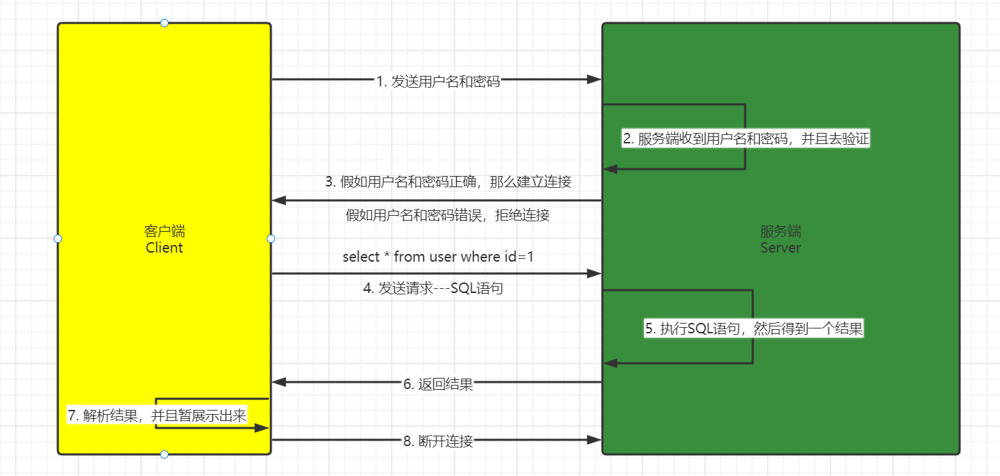
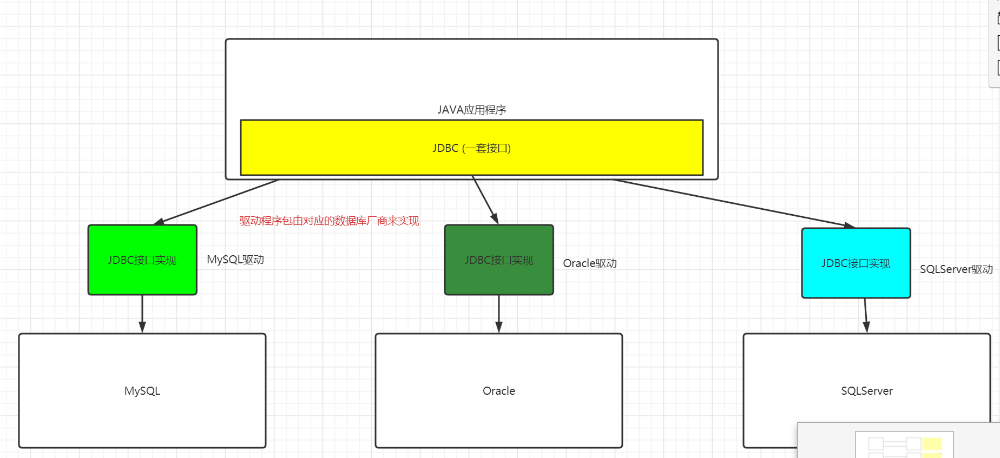
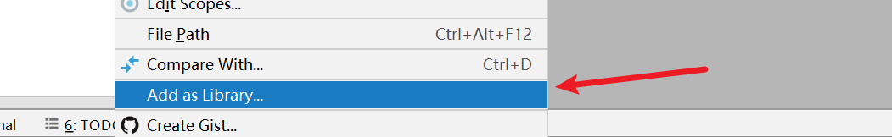
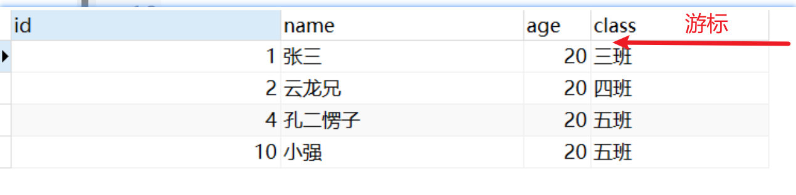
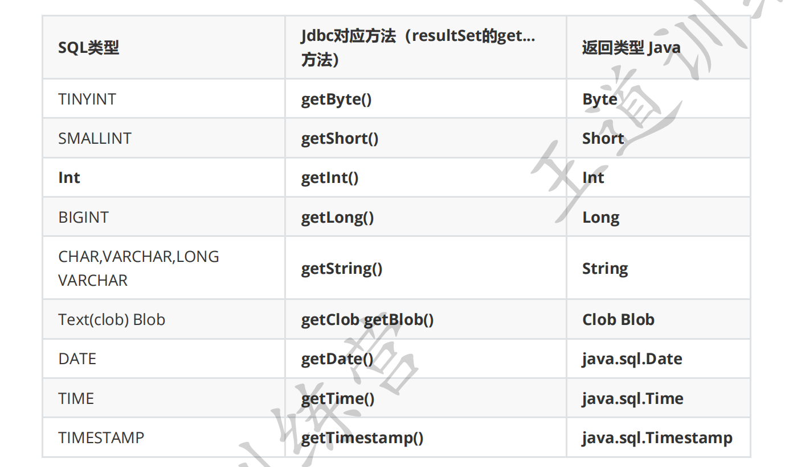
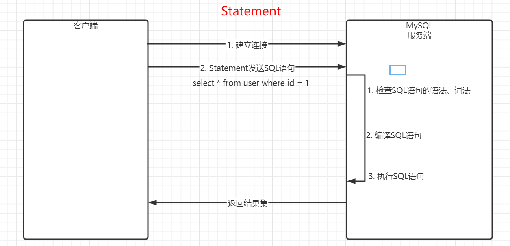
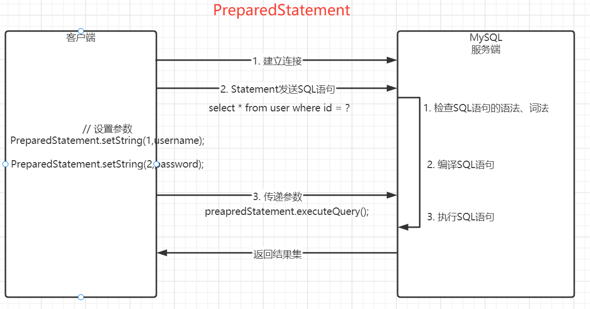
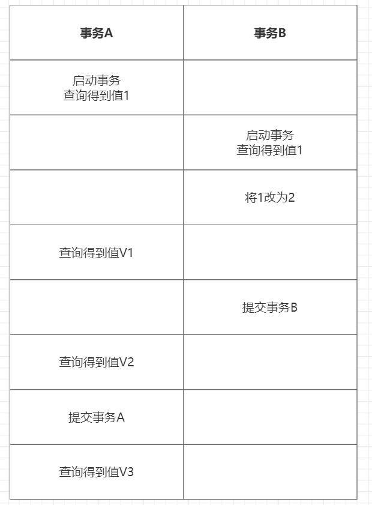

# JDBC

学习目标：

- 了解JDBC是什么，以及定义它有什么好处
- 掌握使用JDBC访问数据库
- 掌握使用JDBC进行增删改查
- 掌握数据库注入问题，以及怎么解决数据库注入问题。面试经常问到的问题
- 掌握事务的使用，以及为什么需要事务。
- <span style=color:red;background:yellow>**理解事务的四大特性，ACID。能用自己的话讲出来**</span>
- 事务的隔离级别（面试）

# 介绍

## 数据库的访问过程




## JDBC是什么

JDBC（Java Database Connectivity）是Java程序与数据库进行交互的一种标准接口。它定义了一组Java API，使得Java程序可以通过这些API来连接和操作各种关系型数据库（如MySQL、Oracle、SQL Server等），执行SQL语句并处理查询结果。JDBC提供了一种跨平台、可移植的方式来访问数据库，使得Java程序可以与不同的数据库进行通信而无需改变代码。JDBC的主要优点包括：可移植性、可靠性、安全性和易于使用。

<span style='color:red;background:yellow;font-size:文字大小;font-family:字体;'>**JDBC具体指的就是 Java的一套标准的连接数据库的接口。**</span>




那么标准的接口具体在哪儿呢？指的是哪些接口呢？（rt.jar内部的）

- `java.sql`
- `javax.sql`

# JDBC怎么用

## 第一个JDBC程序

- 新建项目

- 导包

  导包是指导入其他的人或者是组织写的代码。

  > 如何导包呢？
  >
  > 1. 下载包
  >
  >    [下载仓库地址](https://mvnrepository.com/)
  >
  >    [MySQL驱动包下载地址](https://mvnrepository.com/artifact/mysql/mysql-connector-java/5.1.47)
  >
  > 2. 把包复制到项目中，并且加载进来
  >
  >    `.jar`： 这个格式是一种压缩格式，和 .zip，.rar是类似的，这种类型的文件，可以被Java识别并且运行。
  >
  >    `.jar`文件中都是一些 `.class`文件，是可以直接运行的
  >
  > 
  >
  >    接下来，需要把对应的jar包添加到library里面去。对着jar包右键
  >
  >    

- 编写应用程序

  ```JAVA
  // 1. 加载驱动  {@Link java.sql.Driver   impl : com.mysql.jdbc.Driver}
          DriverManager.registerDriver(new Driver());
  
  
  //        String url = "协议 + ip + 端口 + 路径 + 参数";
          String url = "jdbc:mysql://localhost:3306/40th?useSSL=false&characterEncoding=utf8";
          String username = "root";
          String password = "123456";
  
          // 2. 发送用户名和密码，建立连接
          // 返回的当前是一个Connection接口，但是实际上在运行的时候，返回是Connection接口的实现类的实例
          Connection connection = DriverManager.getConnection(url, username, password);
  
          // 3. 获取statement对象
          Statement statement = connection.createStatement();
  
          // 4. 发送SQL语句
          int affectedRows = statement.executeUpdate("insert into stu values (4,'云飞兄',20,'358班')");
  
          // 5. 解析结果集
          System.out.println("affectedRows:" + affectedRows);
  
          // 6. 断开连接
          statement.close();
          connection.close();
  ```

MySQL版本5.7。我们选驱动 可以选 5.1.47 48 49；都可以。 8的也可以。

MySQL8的版本。只能选8，不要选5的版本。


## 使用JDBC进行增删改查

### 增

```JAVA
// 3. 发送SQL语句
// 返回值是个int，代表影响的行数。 新增的行数
int affectedRows = statement.executeUpdate("insert into stu values (1, 'zhangsan', 22)");
```


### 删

> 增、删、改都是一样的，都是使用 `statement.executeUpdate(String sql)` 来执行SQL语句，返回的结果也是一样的，都是影响的行数。

```java
// 3. 发送SQL语句
// 返回值是个int，代表影响的行数。 删除的行数
int affectedRows = statement.executeUpdate("delete from stu where id = 3");
```

### 改

```sql
int affectedRows = statement.executeUpdate("update stu set name = '孔二愣子',class='五班' where id = 4"
```

### 查

```java
// 3. 发送SQL语句
// resultSet指结果集对象，具体指代查询返回的临时表对象
ResultSet resultSet = statement.executeQuery("select * from stu");


//  解析结果集
while (resultSet.next()) {

	int id = resultSet.getInt("id");
	String name = resultSet.getString("name");
 	int age = resultSet.getInt("age");
	String className = resultSet.getString("class");

	System.out.println("id:" + id);
	System.out.println("name:" + name);
	System.out.println("age:" + age);
	System.out.println("className:" + className);

}
```


## API

> 查看类中所有方法的快捷键：ctrl + F12

### DriverManager

驱动管理器。可以帮助我们管理驱动，获取连接

```java
// 注册驱动
DriverManager.registerDriver(new Driver);

// 获取连接
// 在代码实际运行的时候，一定不可能光是一个接口，一定是一个实现类。（是MySQL提供的一个实现类。）
// 获取到的连接对象实际上是 JDBC4Connection 对象
Connection conn = DriverManager.getConnection(String url,String username,String password);
```

### Connection

指代连接对象。在JDBC中是一个接口，在我们使用JDBC的时候，实际上实现类是 ` com.mysql.jdbc.JDBC4Connection` 对象。

```java
// 获取statement
// 通过statement对象来执行SQL
Statement stat = connection.createStatement();

// 关闭连接
connection.close();

// 事务相关的API
connection.commit();
connection.rollback();
connection.setAutoCommit(false);
```

### Statement

> The object used for executing a static SQL statement and returning the results it produces.

statement对象其实就是用来去执行SQL语句，并且返回这个SQL语句产生的结果集。实际上我们在使用的时候，其实是用的Statement接口的实现类 `com.mysql.jdbc.StatementImpl`

```java
// 执行增删改的方法。新增数据的SQL，删除数据的SQL，修改数据的SQL
int affectedRows = statement.executeUpdate(String updateSql);

// 执行查询的方法
ResultSet rs  = statement.executeQuery(String querySql);

// 拿到一个ResultSet，怎么从里面获取数据。 当一个迭代器的方法使用。

// 关闭
statement.close();

// 执行sql语句
Boolean ret = statement.execute(String sql);

// 如果 ret == true，那么说明执行的是查询语句  statement.getResultSet();
// 如果 ret == false，那么说明执行的是增删改语句 statement.getUpdateCount();
// 获取影响的行数: statement.getUpdateCount();
// 获取返回的结果集：statement.getResultSet();


// 练习一下怎么去组织语言（prompt）
// 我是Java学习者，我在学习JDBC的时候，遇到了一个Statement接口，里面有一个execute()方法，我不知道如何去使用
你的任务如下： 1.简单告诉一下我它的大致作用   2.给我写个demo，示例，让我快速知道如何去使用它。
```

### ResultSet

这个对象表示查询的结果集。



> 在查询的结果集中，有一个游标，游标可以移动，移动的时候会扫描一些行，那么对于这些扫描到的行，我们就可以获取对应的列的值。

```java
// 移动游标方法

// 向下移动
Boolean ret = resultSet.next();

// 向上移动
Boolean ret = resultSet.previous();

// 定位到第一行之前
resultSet.beforeFirst();

// 定义到最后一行之后
resultSet.afterLast();


// 获取值的方法
resultSet.getInt(String columnName);
resultSet.getString(String columnName);
resultSet.getDate(String columnName);
```



## JDBC的优化

- 提取工具类
- 连接配置放入到配置文件中
- 注册驱动利用反射，解耦
- 关闭资源（提取公共方法）

```java
public class JDBCUtils {

    static String url;
    static String username;
    static String password;
    static String driver;

    static {

        Properties properties = new Properties();
        try {
            properties.load(new FileInputStream("jdbc.properties"));
        } catch (IOException e) {
            e.printStackTrace();
        }


        url = properties.getProperty("url");
        username = properties.getProperty("username");
        password = properties.getProperty("password");
        driver = properties.getProperty("driverClassName");
    }


    // 获取连接
    public static Connection getConnection(){

        Connection connection = null;
        try {
            Class.forName(driver);
            connection = DriverManager.getConnection(url, username, password);
        }catch (Exception ex) {
            ex.printStackTrace();
        }

        return connection;
    }


    // 关闭资源
    public static void  close(Connection connection, Statement statement, ResultSet resultSet){

        try {

            if (resultSet != null) resultSet.close();
            if (statement!= null) statement.close();
            if (connection != null) connection.close();

        }catch (Exception ex) {
            ex.printStackTrace();
        }


    }
}
```

## 数据库注入问题

> 数据库注入是一种常见的网络安全漏洞，攻击者利用这种漏洞向网站或应用程序的数据库中插入恶意代码，从而获取敏感信息、执行非法操作等。例如：
>
> 假设有一个登录页面，用户需要输入用户名和密码才能登录。该页面的后端代码使用SQL查询语句来验证用户的身份，例如：
>
> ```
> SELECT * FROM user WHERE username = 'input_username' AND password = 'input_password';
> ```
>
> 其中，'input_username'和'input_password'是用户在登录页面上输入的值。如果用户输入的值与数据库中的值匹配，则允许用户登录，否则拒绝登录。
>
> 然而，攻击者可以在输入框中输入一些恶意代码，例如：
>
> ```
> input_username: root
> input_password: xxx' or ' 1=1
> ```
>
> 这个输入会更改SQL查询语句，变成：
>
> ```SQL
> 
> -- 下面这条SQL的含义，是这样的   1=1是恒等的，所以where条件相当于会没有任何条件
> -- SELECT * FROM users WHERE (username = 'admin' AND password = 'xxx') or '1=1';
> SELECT * FROM users WHERE username = 'admin' AND password = 'xxx' or ' 1=1';
> 
> SELECT * FROM users WHERE username = 'admin' AND password = 'xxx' ;drop database test1';
> ```
> 
>这个SQL语句的含义是“从users表中选择任何一个行，其中用户名为空或1等于1，并且密码为空”。由于1等于1始终为真，因此这个SQL语句将返回users表中的所有行，从而绕过了身份验证，攻击者可以以任何用户的身份登录系统。这就是一个典型的SQL注入攻击。
> 
>为了避免SQL注入攻击，必须对用户输入的值进行过滤和转义，或使用预处理语句等安全措施来防范这种攻击。
> 
>主要的原因是字符串拼接，把用户的一些输入当做了关键字。


```java
 public static void main(String[] args) throws SQLException {

//        Boolean ret = login("天明", "upan");

        // select * from user where name = 'xxx' and password = 'xxx';
        // select * from user where name = 'xxx' and password = 'xxx' or '1=1';

        Boolean ret = login("xxx", "xxx' or '1=1");


        if (ret) {
            System.out.println("登录成功！");

        }else {
            System.out.println("登录失败");
        }
    }

    // 登录方法
    public static Boolean login(String username,String password) throws SQLException {

        // 传入用户名和密码。根据用户名和密码查询用户，假如查询到了，说明登录成功；如果没查到，登录失败
        Connection connection = JDBCUtils.getConnection();

        Statement statement = connection.createStatement();

        String sql = "select * from user where name = '"+username+"' and password = '"+password+"'";

        System.out.println(sql);

        ResultSet resultSet = statement.executeQuery(sql);

        if (resultSet.next()) {

            return true;
        }else {
            return  false;
        }

    }
```

> 数据库注入问题产生的原因：因为SQL语句是通过字符串拼接的，这个时候用户可能输入一些字符，这些字符中包含有SQL语句中的关键字，那么通过字符串拼接SQL语句之后，可能会改变SQL语句的格式，进而引发安全性的问题。
>
> 根本的原因：MySQL把用户输入的参数当做关键字来解析了

> 如何解决数据库注入问题呢？
>
> - PrepareStatement（预编译的Statement）

```java
// 登录方法2
    public static Boolean login2(String username,String password) throws SQLException {

        // 1. 获取连接
        Connection connection = JDBCUtils.getConnection();

        // 2. 获取PreparedStatement
        // 这一步，在创建PreparedStatement的时候，PreparedStatement会把当前这个没有参数的SQL语句，发送给MySQL服务器，执行预编译
        // 预编译：其实就是去解析这个SQL语句中的关键字，变成MySQL可以执行的命令
        // 在预编译之后，后续输入的字符串，就只会被MySQL当成纯文本来解析
        PreparedStatement preparedStatement = connection.prepareStatement("select * from user where name = ? and password = ?");


        // 3. 设置参数
        // 序号从 1 开始
        preparedStatement.setString(1,username);
        preparedStatement.setString(2,password);


        // 4. 传递参数，执行SQL语句
        ResultSet resultSet = preparedStatement.executeQuery();

        if (resultSet.next()) {
            return true;
        }else {
            return false;
        }
    }
```

> 总结：
>
> 1. 在安全性方法，PreparedStatement比Statement要好很多，没有数据库的注入问题
>
> 2. 在效率方面，执行单次SQL语句的时候，Statement的效率比PreparedStatement要好一些
>
>    因为Statement在执行一条SQL语句的时候，只会与数据库通信一次，而PreparedStatement要通信两次
>    
>    prepareStatement使用的比statement多很多。statement几乎不用。





# 批处理

比如，你想往数据库里面插入大量数据。 100w

其实就是批量的处理SQL语句，典型的业务场景就是一次插入大量的数据。在今后，如果需要大家使用JDBC批量插入数据，可以使用这些方法。

## for循环逐条插入

```java
// for循环来做
public static void batchUseForEach() throws SQLException {

    Statement statement = connection.createStatement();

    for (int i = 0; i < 10000; i++) {

        String sql = "insert into user values ("+i+",'foreach',null,null)";

        statement.executeUpdate(sql);

    }
}
```

> 向MySQL服务器发送了SQL语句 1w次，SQL语句被编译了1w次，SQL语句也被执行了1w次

## statement批处理

```java
// Statement 来处理
public static void batchUseStatement() throws SQLException {

    Statement statement = connection.createStatement();

    for (int i = 10000; i < 20000; i++) {
        String sql = "insert into user values ("+i+",'batchUseStatement',null,null)";
        // 相当于在内部有一个容器。 
        statement.addBatch(sql);
    }

    // 发送SQL语句，执行
    statement.executeBatch();

}
```

> 向MySQL服务器发送了SQL语句 1次，这一次中包含1w条SQL语句信息，SQL语句被编译了1w次，SQL语句也被执行了1w次

## PreparedStatement批处理

> 需要在数据库的url后面加上配置：rewriteBatchedStatements=true ，表示开启批处理

```java
// PreparedStatement来处理
public static void batchUsePrepapreStatement() throws SQLException {

    // 获取PreparedStatement
    PreparedStatement preparedStatement = connection.prepareStatement("insert into user values (?,?,null,null)");


    // 循环，设置参数
    for (int i = 20000; i < 30000; i++) {

        preparedStatement.setInt(1,i);
        preparedStatement.setString(2,"PrepapreStatement");

        preparedStatement.addBatch();

    }

    // 把参数发送给MySQL服务器，执行SQL语句
    preparedStatement.executeBatch();

    // insert into user values (),(),(),(),();

}
```

> 与MySQL通信了2次，SQL语句被编译了一次，SQL语句被执行了一次

插入n条数据

for循环，通讯n次，编译n次，执行n次

statement，通讯1次，编译n次，执行n次

prepareStatement，通讯2次，编译1次，执行1次


假如需要批处理n条SQL语句，开启了rewriteBatchedStatements之后

|                   | 通信次数 | 编译次数 | 执行次数 | 时间 |
| ----------------- | -------- | -------- | -------- | ---- |
| for循环           | n        | n        | n        | 最长 |
| Statement         | 1        | n        | n        | 次之 |
| PreparedStatement | 2        | 1        | 1        | 最短 |

# 事务

## 介绍

> 数据库事务( transaction)是访问并可能操作各种数据项的一个数据库操作序列，这些操作要么全部执行,要么全部不执行，是一个不可分割的工作单位。事务由事务开始与事务结束之间执行的全部数据库操作组成。

<span style=color:red;background:yellow>**事务就是要保证一组数据库操作，要么全部成功，要么全部失败。**</span>

比如转账操作，涉及到几个方面。

账户余额表。 zs  1000 |   ls 5000 

现在zs要给ls转账，转500。现在在数据库里面，我们要进行两步操作。

1. 扣zs的钱，扣500
2. 给ls增加钱，增加500


A给B转账。涉及到两个操作，需要给A账户扣钱，然后给B账户增加钱。

如果在这个操作的过程中，出现了异常。可能会导致A账户的钱扣了，B账户的钱没有增加。


## 使用事务

开启事务

提交事务

回滚事务


- API

  ```java
  //  开启事务
  connection.setAutoCommit(false);
  
  // 提交事务
  connection.commit();
  
  // 回滚事务
  connection.rollback();
  ```

- 命令

  ```sql
  # 开始事务
  start transaction;
  
  # 提交事务
  commit;
  
  # 回滚事务
  rollback;
  ```


```SQL
create table account(
    id int primary key auto_increment,
    name varchar(50),
    money int ,
    create_time timestamp  default current_timestamp ,
    update_time timestamp  default current_timestamp on update current_timestamp
);

-- 插入一条数据： 浩铭   50000
insert into account(name, money) values ('浩铭',   50000);
insert into account(name, money) values ('刘楠',   20000);
insert into account(name, money) values ('黄杰',   10000);
insert into account(name, money) values ('殿熙',   10000);

-- name是唯一的。   
```


```java
    private static boolean transfer(String fromName, String toName, int money) throws SQLException, ClassNotFoundException {

        // 1.获取连接
        Connection connection = JdbcUtils.getConnection();

        // 2.开启事务
        connection.setAutoCommit(false);

        try {
            // 3.1 扣A的钱
            // update account set money = money - ? where name = ? and money > ?
            PreparedStatement preparedStatementA = connection.prepareStatement("update account set money = money - ? where name = ? and " + "money > ?");
            preparedStatementA.setInt(1, money);
            preparedStatementA.setString(2, fromName);
            preparedStatementA.setInt(3, money);

            int affectedRowsA = preparedStatementA.executeUpdate();
            System.out.println(affectedRowsA);

            if (affectedRowsA != 1) {
                throw new RuntimeException("A账户信息不对" + affectedRowsA);
            }

            //int i = 1 / 0;


            // 3.2 增加B账户的钱
            // update account set money = money + ? where name = ?
            PreparedStatement preparedStatementB = connection.prepareStatement("update account set money = money + ? where name = ? ");
            preparedStatementB.setInt(1, money);
            preparedStatementB.setString(2, toName);

            int affectedRowsB = preparedStatementB.executeUpdate();
            System.out.println(affectedRowsB);

            if (affectedRowsB != 1) {
                throw new RuntimeException("B账户信息不对" + affectedRowsB);
            }

            connection.commit();

        } catch (Exception e) {
            e.printStackTrace();
            connection.rollback();
            return false;
        }


        return true;
    }

```

## 特性

事务通常具有四个标准特性（ACID）：

- 原子性（Atomicity）

  事务是一个不可分割的操作单元（数据库的操作），事务中的操作要么就都成功，要么就都不成功。

- 一致性（Consistency）

  事务必须使数据库从一个一致性状态到另外一个一致性状态。

  在转账案例中，一致性是指 在转账前和转账后，（无论怎么转账），钱的总金额是前后一致的，不变的

- <span style='color:red;background:yellow;font-size:文字大小;font-family:字体;'>**隔离性（Isolation）**</span>

  事务与事务之间是互相隔离的，互不影响的。

  > 数据库有为隔离性设置不同的隔离级别。不同的隔离级别对于隔离性的影响是不一样的

- 持久性（Durability）

  一个事务一旦生效，那么对数据库的改变是永久的，不可逆转的。意思就是提交了事务之后，就已经对数据库产生的变化，那么后续再回滚就回滚不了了

一般问事务的四大特性。直接说出这几个的中文。 

## 隔离级别

当数据库有<span style=color:red;background:yellow>**多个事务同时执行**</span>的时候，可能会出现问题。

脏读（dirty read）、不可重复读（non-repeatable read）、幻读（phantom read）的问题。

- <font color=red>**脏读**</font>

  > 一个事务读取到了另外一个事务没有提交的数据。（这个比较严重）

- <font color=red>**不可重复读**</font>

  > 在同一个事务中，读取同一个数据，前后读取的数据不一致。
  >
  > 通常指的是，在一个事务中，读取到了另外一个事务已经提交的数据。

- <font color=red>**幻读**</font>

  > 指在同一个事务中，读取同一个表数据，前后读取的数量不一致。
  >
  > 通常指的是，在一个事务，读取到了另外一个事务插入或者删除的数据。


事务的隔离级别：

一个参数，可以用来控制事务和事务之间的隔离性。

- <font color=red>**读未提交**</font>（read uncommitted）

  > 读未提交是指，一个事务还没提交时，它做的变更就能被别的事务看到。
  >
  > 会产生脏读。不可重复读，幻读 会不会造成？

- <font color=red>**读已提交**</font> (read committed)

  > 读提交是指，一个事务提交之后，它做的变更才会被其他事务看到。

- <font color=red>**可重复读**</font> (repeatable read)

  > <span style=color:yellow;background:red>**这个是MySQL默认的隔离级别**</span>
  >
  > 可重复读是指，一个事务执行过程中看到的数据，总是跟这个事务在启动时看到的数据是一致的。当然在可重复读隔离级别下，未提交变更对其他事务也是不可见的。

- <font color=red>**串行化**</font> (serializable)

  > 串行化，顾名思义是对于同一行记录，“写”会加“写锁”，“读”会加“读锁”。当出现读写锁冲突的时候，后访问的事务必须等前一个事务执行完成，才能继续执行。
  >
  > 实际工作中很少采用该级别。

  

  >  <font color=red>**注意：**</font>你隔离得越严实，效率就会越低。因此很多时候，我们都要在二者之间寻找一个平衡点。

## 演示

<font color=red>**准备条件：**</font>有一张表，表里只有一条数据。

```SQL
create table t(
	value int
);
insert into t values (1);

-- test_52th3 代表直接进入这个库
-- 代表我进入之后不用调用 use test_52th3 
mysql -uroot -p123456 test_55th3
```


```SQL
# 获取当前数据库的隔离级别
select @@transaction_isolation;
select @@tx_isolation;

# 设置隔离级别
set global transaction isolation level 隔离级别;

mysql -uroot -p123456 test_55th3

set global transaction isolation level repeatable read;

update t set value=1;

# 读未提交
read uncommitted;
# 读已提交
read committed;

# 可重复读
repeatable read

# 串行化
serializable;

# 注意。设置了隔离级别。必须要重新启动一下客户端，才能生效。
```


MySQL的可重复，可以解决部分幻读问题，不能完全解决。





- 读未提交：V1、V2、V3均为2。
- 读已提交: V1为1，V2为2，V3为2
- 可重复读： V1,V2为1， V3为2
- 串行化: 事务2修改的过程中。会一直等待，直到事务1提交


```JAVA
后端工程
https://gitee.com/snow-lee/java-gui

前端工程
https://gitee.com/snow-lee/vue-gui

尝试把这两个项目起起来了。 然后如果能看懂后端代码，能改更好。
    前端这块，能改更好。 
    
    conntroller   ===> 服务器内部路径
    service  
    mapper(dao)
```


工作过程需要的数据库知识，我们已经具备了。

但是面试的时候，会被问的问题有很多很多。 

关于数据库这块，建议多学。 


leetcode和学学数据库的问题。 

锦上添花


