学习目标

- Maven是什么，有什么作用
- 会配置Maven的环境，以及在idea上配置
- （重点）掌握Maven的工程结构
- 掌握Maven的几个重要指令。（clean compile package install）
- 掌握如何导包及依赖冲突解决办法

# Maven

## 介绍


Apache。


什么是Maven呢？Maven是一个<span style='color:red;background:yellow;font-size:文字大小;font-family:字体;'>**项目管理工具**</span>。主要的功能有两个：

- 项目构建

  项目构建指：项目构建是指可以帮助我们<span style='color:red;background:yellow;font-size:文字大小;font-family:字体;'>**编译项目**</span>、<span style='color:red;background:yellow;font-size:文字大小;font-family:字体;'>**打包项目**</span>（可以帮助我们把自己的项目打包成一个.jar文件）、安装项目、部署项目

- 依赖管理（下项目里面依赖的jar）

  我们目前是用的是传统的Java项目，传统的Java项目来管理依赖其实很不方便。当我们的项目变得复杂之后，项目中的依赖越来越多，管理起来也越来越复杂，Maven可以帮助我们去管理这些依赖。
  
  之前是下载jar的的方式，非常麻烦。还容易出错。


依赖管理， 比如你要在项目中使用 mysql 5.1.47 的包。 传统的项目，需要去mvnrepostory 。下载jar。放到项目里面， add as libaray.

下dbcp，需要下两个包。 如果有一个 commons-java 如果没下，会报错。

NoClassDefFoundError     NoClassDefFoundException   包没下。

如果dbcp依赖了一个jar。c3p0依赖了另一个。是同一个，但是版本不一样。这时候，也会有问题

dbcp   -->   mysql  5.1.47

c3p0    -->    mysql  8.0

maven可以帮我们解决这个问题。

## 安装

### 版本说明

Maven是apache下面的一个项目管理工具，使用Java开发，换句话来说，其实就是Maven的运行依赖于JDK环境。

- 如果需要使用Maven，那么需要安装<font color=red>**JDK环境**</font>并配置好<font color=red>**环境变量**</font>(JAVA_HOME)。
- Maven是Java开发的，所以我们在使用Maven的时候，Maven的版本需要和JDK的版本兼容
- Maven后续需要在idea中使用，idea中有maven的插件，所以Maven的版本也需要和idea的兼容

JDK：1.8、17

IDEA：2018.3.6以后(2022 遇到了问题一定要能解决)

Maven：3.5.3、3.6.0（<font color=red>**建议3.5.3 / 3.6.0**</font>）


一定要配置好 JAVA_HOME  这个环境变量。


### 下载

[官网](https://maven.apache.org/download.cgi)

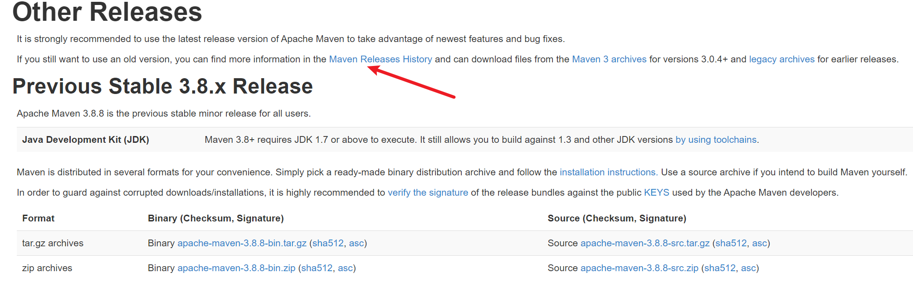


服务器：

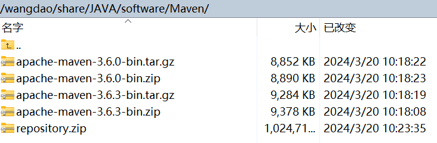


### 解压

maven需要解压到一个 <span style='color:red;background:yellow;font-size:文字大小;font-family:字体;'>**不带有中文、不带有特殊字符**</span>（空格） 的目录。


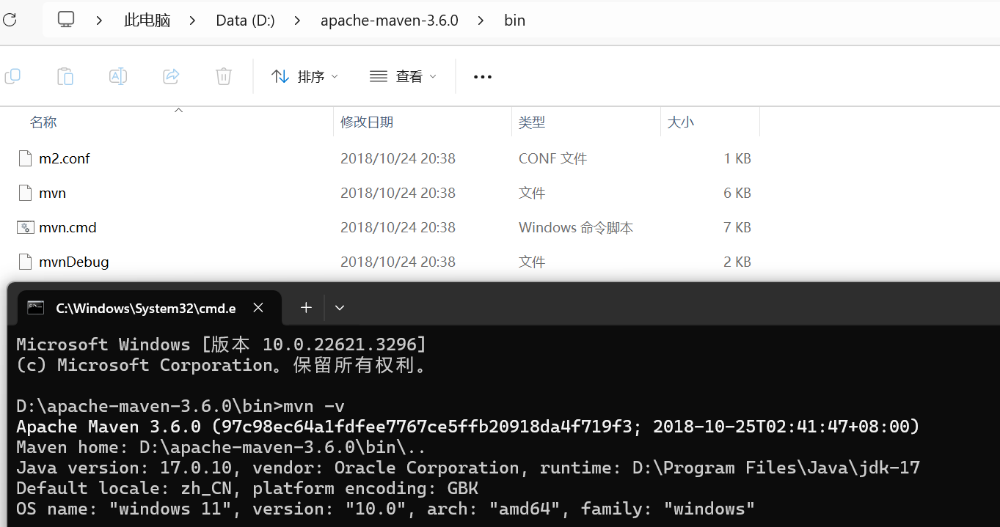

如上图所示，如果maven指令执行没有问题，那么说明maven安装成功了

### 配置环境变量

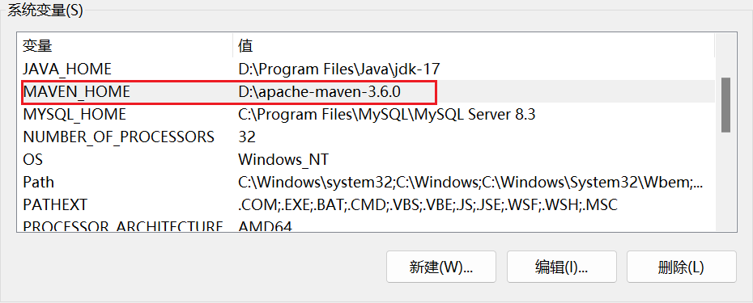

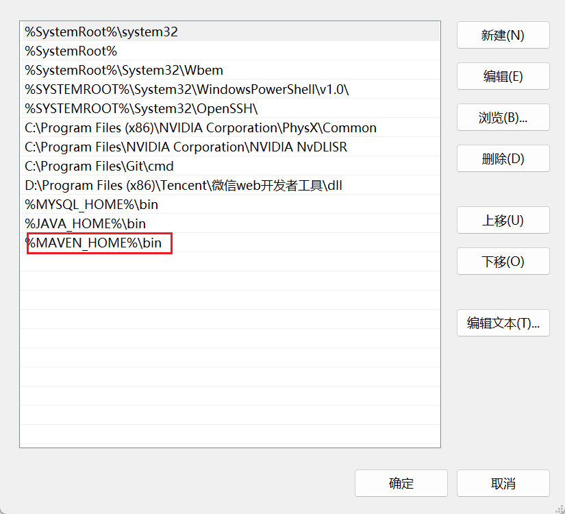


配置了环境变量之后，就可以在任意的路径下使用 `mvn -v`

<span style=color:yellow;background:red>**不要把自己的环境变量全部干掉了。**</span>

## 配置

在介绍Maven的配置之前，我们需要先看一下Maven的工作流程。

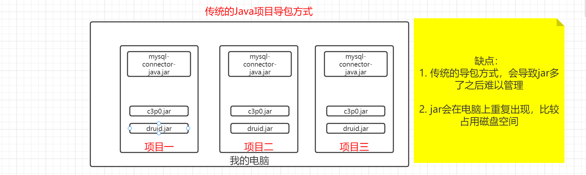


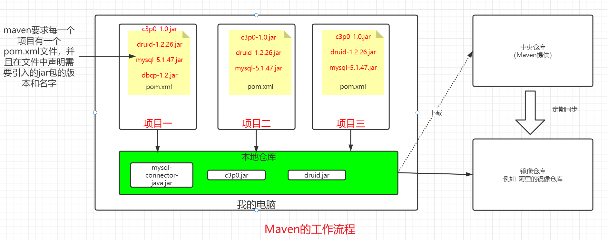

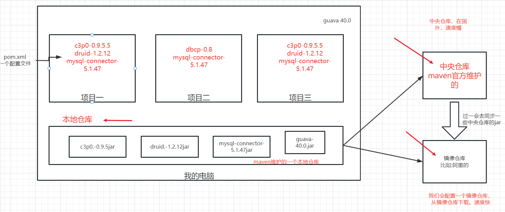


- 本地仓库：其实就是本地存放Jar包的一个路径，统一的集中式的去管理本地的所有jar包
- 中央仓库：中央仓库其实就是Maven 提供的一个仓库，里面收录了世界上所有的开源的jar包。
- 镜像仓库：阿里等公司会去定期同步中央仓库，把中央仓库的内容同步过来。这样我们后续在下载jar包的时候，就可以让他指定去镜像仓库下载，这样下载的速度就会比较快。


### 配置settings.xml


- 配置本地仓库（本地的一个路径）

  ```xml
  <settings>
      ...
  	<localRepository>D:\maven\repo</localRepository>
      ...
  </settings>
  ```
  
- 配置镜像仓库

  ```xml
  <settings>
  	...
      <mirrors>
          <mirror>
          	<id>nexus-aliyun</id>
          	<mirrorOf>central</mirrorOf>
          	<name>Nexus aliyun</name>
          	<url>http://maven.aliyun.com/nexus/content/groups/public</url>
          </mirror>
      </mirrors>
      ...
  </settings>
  ```
  
- 配置JDK的编译版本（如果是jdk8，那么便配置jdk-1.8；如果是jdk17，那么便配置jdk-17）

  ```xml
  <settings>
  	...
      <profiles>
          <profile>
                  <id>jdk-1.8</id>
                  <activation>
                      <activeByDefault>true</activeByDefault>
                      <jdk>1.8</jdk>
                  </activation>
                  <properties>
                      <maven.compiler.source>1.8</maven.compiler.source>
                      <maven.compiler.target>1.8</maven.compiler.target>
                      <maven.compiler.compilerVersion>1.8</maven.compiler.compilerVersion>
                  </properties>
          </profile>
      </profiles>
      ...
  </settings>
  ```

```xml
<settings>
	...
    <profiles>
        <profile>
                <id>jdk-17</id>
                <activation>
                    <activeByDefault>true</activeByDefault>
                    <jdk>17</jdk>
                </activation>
                <properties>
                    <maven.compiler.source>17</maven.compiler.source>
                    <maven.compiler.target>17</maven.compiler.target>
                    <maven.compiler.compilerVersion>17</maven.compiler.compilerVersion>
                </properties>
        </profile>
    </profiles>
    ...
</settings>
```


### 配置idea

maven需要在idea上进行使用，所以我们要在idea上进行配置。

在idea中配置，需要配置两方面，一个是当前项目，一个是新项目。  


#### 配置当前项目

`File---> Setttings----> Maven(直接搜索)`

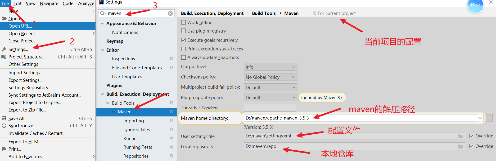

#### 配置新项目

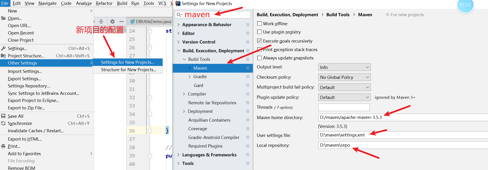


<span style=color:red;background:yellow>**安装Maven的步骤**</span>

1. 解压下载好的maven安装包。需要注意，不要有中文，不要有空格

2. 配置maven的环境变量。   名叫做MAVEN_HOME  ，把它加到path。 ` %MAVEN_HOME%\bin`

3. 配置settings.xml。 主要配置 本地仓库（本地用来放jar的路径），镜像仓库，编译打包的版本

4. 配置idea里面的东西。   配置当前项目，配置新项目。

   ​	主要配置  Maven home directory (解压的maven目录)。User settings file（配置到settings.xml）, Local repository(配置到本地仓库。)


一定要会。 后续，所有的项目都是使用maven来管理。 

## 使用Maven

### maven工程文件结构

maven对文件组织形式有非常高的要求。必须要按照这个目录结构来

> Maven工程的要求：
>
> 1. 在项目的根路径下，有一个pom.xml文件
>
> 2. 工程目录是如下的结构
>
>    projectName
>
>    - src
>      - main
>        - java(写代码的地方)
>        - resources(配置文件地方)
>      - test
>        - java(单元测试代码)
>        - resources(单元测试的配置文件)
>    - pom.xml

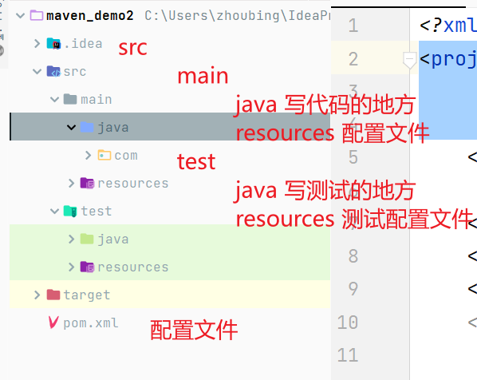

### 新建一个Maven工程

#### 从Java项目去建立一个Maven工程(已有项目)

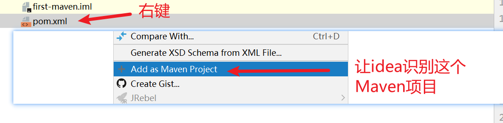

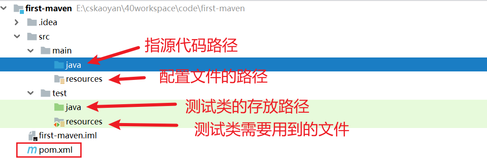


怎么把传统项目改造成一个maven工程的。

1.在项目下创建一个pom.xml文件。

2.对着 pom.xml 右键  Add as Maven Project

3.按照maven的目录结构，创建目录    src/main/java  src/main/resources  src/test/java src/test/resources

4.标记目录的功能。  

- src
  - main
    - java(sources root)
    - resources(resources root)
  - test
    - java(test sources root)
    - resources(test resources root)
- pom.xml

5.把之前的代码挪进去。挪到  src/main/java 目录里面。


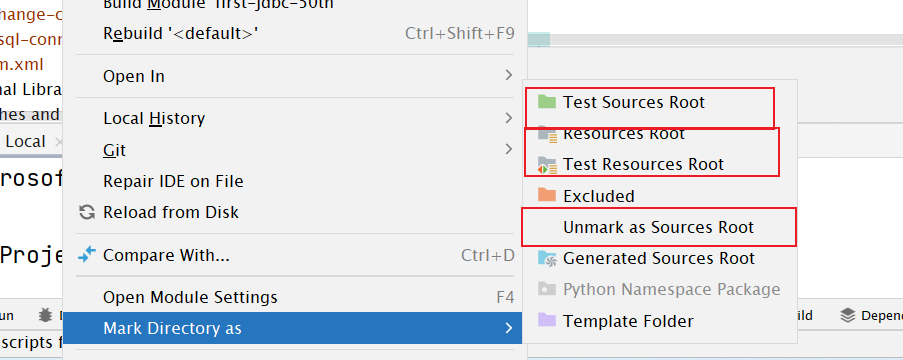

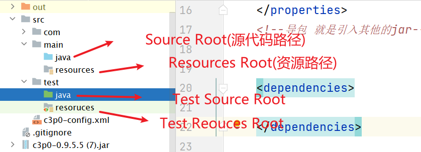


#### 使用idea直接去建立Maven工程(新建项目)

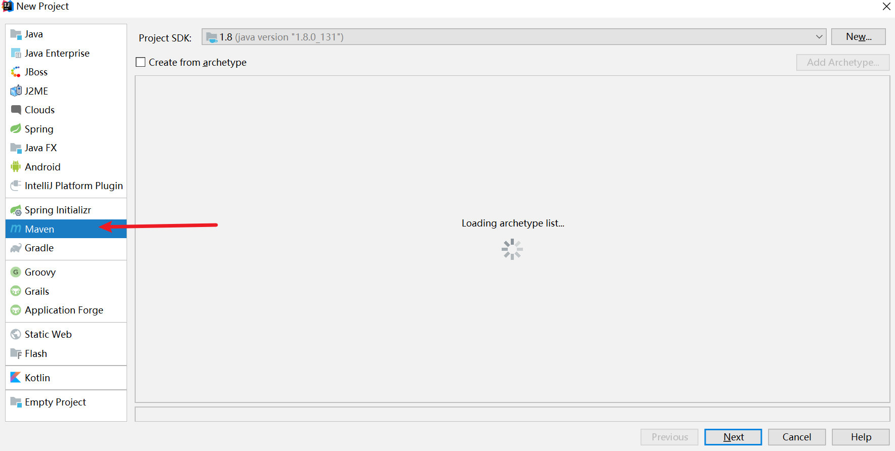

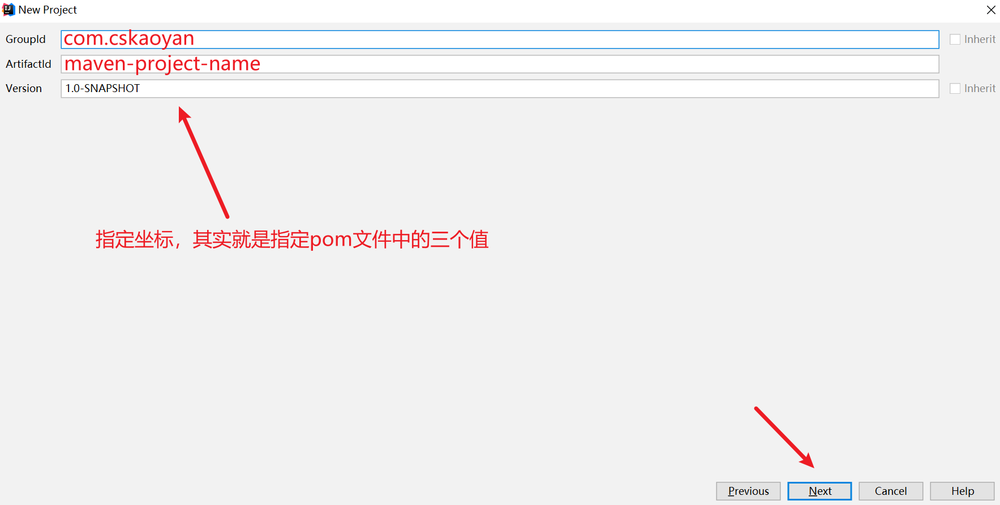

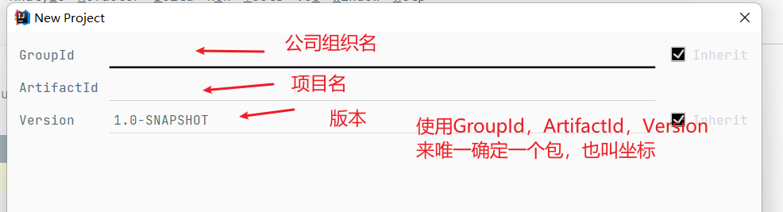


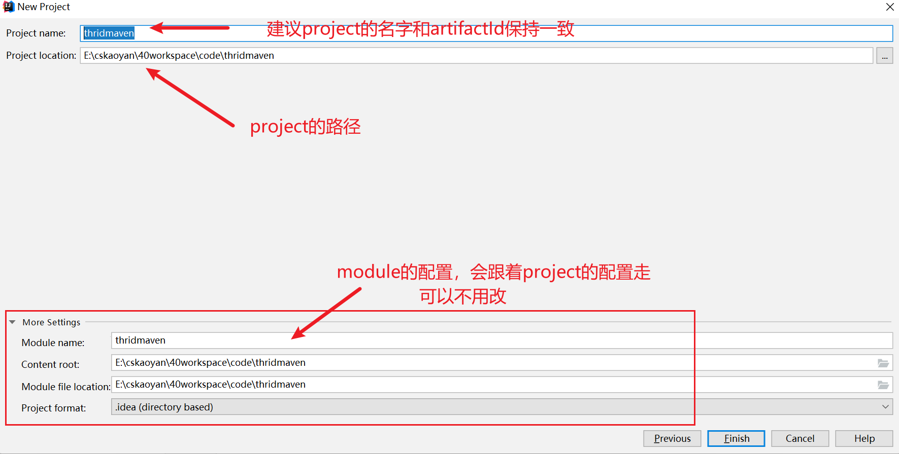


### 理解module与project

project和module都是idea中的概念，不是Java中的概念。

- project

  A project is a top-level organizational unit for your development work in IntelliJ IDEA. In its finished form, a project may represent a complete software solution. A project is a collection of:

  - Your work results: source code, build scripts, configuration files, documentation, artifacts, etc.
  - SDKs and libraries that you use to develop, compile, run and test your code.
  - Project settings that represent your working preferences in the context of a project.

  A project has one or more modules as its parts.

- module

  - A module is a part of a project that you can compile, run, test and debug independently.
  - Modules are a way to reduce complexity of large projects while maintaining a common (project) configuration.
  - Modules are reusable: if necessary, a module can be included in more than one project.

- project

  一个项目是IDEA开发工作的顶级组织单位。在其完成的形式中，一个项目可能代表一个完整的软件解决方案

  项目是以下内容的集合：

  - 你的工作成果：源代码、脚本、配置文件、文档、包等。
  - 用于开发、编译、运行和测试代码的SDK和库。
  - 在项目上下文中表示你的工作偏好设置

  一个项目有一个或者多个模块作为其部件

- module

  - 模块是项目的一部分，<span style='color:red;background:yellow;font-size:文字大小;font-family:字体;'>**你可以独立的编译、运行、测试和调试。**</span>
  - 模块是一种在维护公共项目配置的同时降低大型项目复杂性的方法。
  - 模块可以重复使用：如果需要，可以再多个项目中包含一个模块。

**总结一下：Project是IDEA的最顶级的结构单元，project只是起到了一个项目定义的功能，类似于工作空间的概念，这个工作空间可以去配置你的IDEA的一些公共配置，例如SDK、代码库等。module是project的一部分，可以用来单独编译运行等，每一个module项目运行的时候都是一个单独的Java进程。IDEA创建项目的时候会默认创建一个同名的module，实际上我们开发写代码都是在开发这个module。**

Project是一个工作空间，你在里面可以配置一些公共的配置

Module是一个可以运行的东西。


习惯在一个项目里面创建非常非常多module。不是一个好习惯。

如果说你的module和module之间没有任何关系，这个时候建议大家新建项目。

昨天的  连接池。 有同学导入jar。   add as libaray。如果你的module多了，你add的时候，压根都不知道自己添加到哪个地方去了。


### 简单使用Maven工程

####  如何导包

只需要在 pom.xml文件中声明jar包的坐标就可以了，添加了之后点击 `import changes `

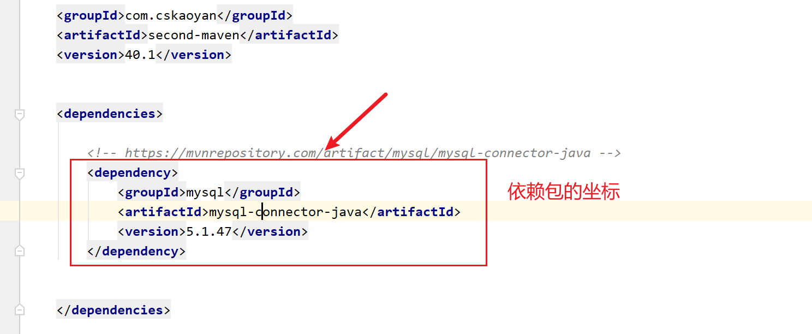

> <dependencies> 这个标签下面可以放置多个 <dependency> 标签，也就是说可以导入多个jar包。

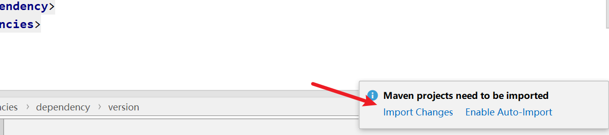


注意事项

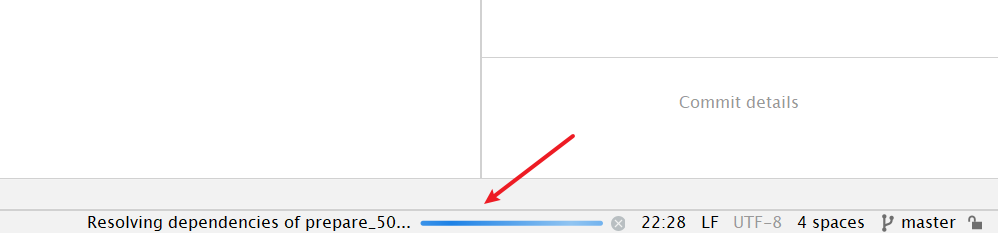

点开它，看一下下载地址是否是aliyun。如果是则镜像仓库配置正常。否则需要检查。

Downloading  from   “maven.org”。说明配置没成功。 

见到这个  “maven.aliyun.com”。才说明配置成功了。


怎么检查。1.去idea  settings里面看下，配置是不是  settings.xml。

2.去maven目录  那个settings.xml里面，看镜像仓库是否配置成功，  mirror是否有。

检查是否保存了。

## 项目构建

### 指令介绍

项目构建其实就是 Maven可以帮助我们去检查项目，编译项目，测试项目，打包项目，安装项目，部署项目

这几个步骤就涉及到了Maven中一些指令。

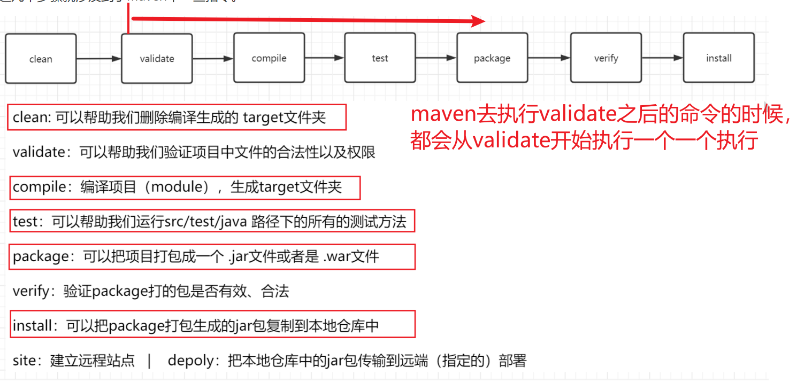


### 指令的执行方式

每一种指令都有三种方式来执行。

Maven指令的执行依赖于一些jar包。

- 方式一。直接通过命令行

  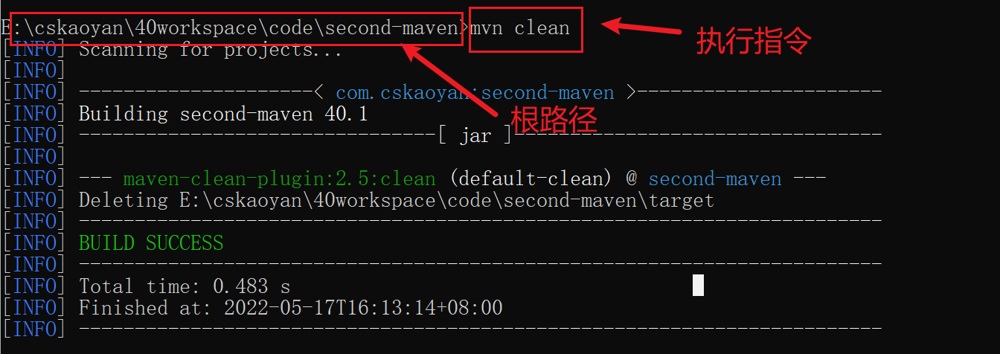

- 方式二： 通过idea里面的terminal

  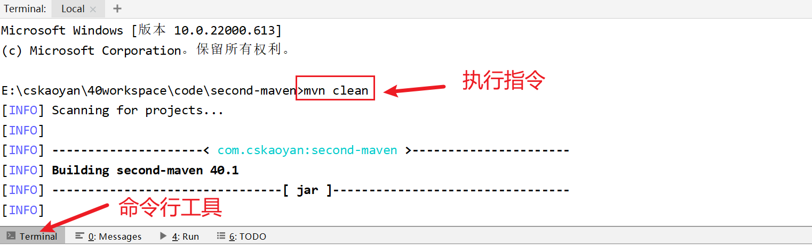

  > 有的同学使用的时候可能会告诉你找不到mvn命令
  >
  > - 环境变量没配置好。重启一下idea。
  > - idea没有权限去执行mvn命令，需要把idea通过管理员权限打开

- 方式三

  直接使用maven的可视化插件.在项目的右边。 

  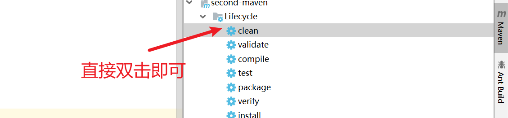


### compile命令详解

> compile是编译的意思，可以帮助我们生成一个target文件夹

<span style=color:red;background:yellow>**以后，只能在java文件夹中写代码**</span>

<span style=color:red;background:yellow>**在resources文件夹里面，写配置文件，配置文件最终会被编译到target/classes**</span>

大家一定要知道，编译之后的文件跑到哪里去了。这个对今后的工作关系非常大。 

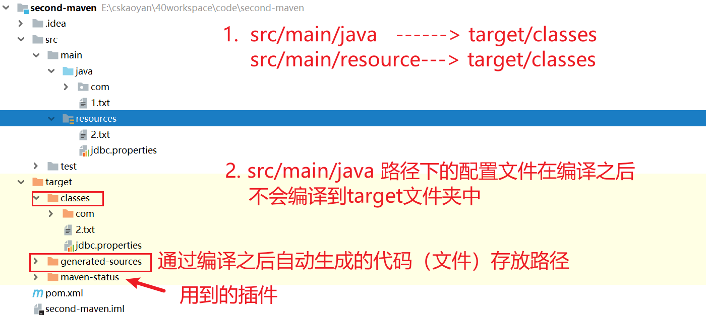


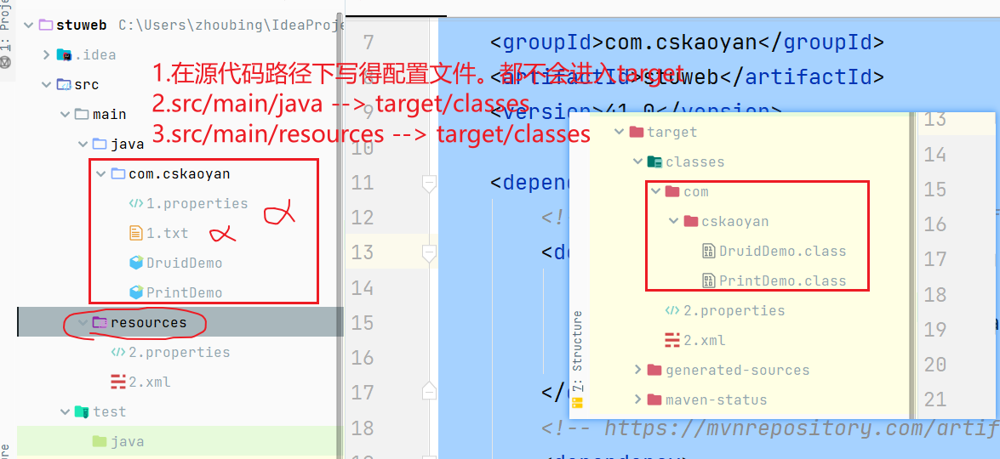


需要注意： 在resources里面新建多级文件夹的时候，不是  com.cskaoyan这种写法。 需要 `com/cskaoyan`。前者只会生成一级文件夹。后者会生成两级。

小tips：如果我想确认这是一级还是两级。去文件系统里面看一下。 

### package命令详解

package可以帮助我们把项目打包。

帮助我们把项目打包，默认打成jar。

> 打包的名字：artifactId-version.jar

> 打包的格式：
>
> - jar
>
>   默认的打包格式
>
> - war
>
>   需要指定
>
> 如何指定呢？
>
> ```xml
> <!-- 指定打包的格式，默认为jar ，可以配置为 war 和 pom -->
> <packaging>jar</packaging>
> ```

### install 命令详解

本地仓库，其实是一个磁盘路径。它存放我们从网络上下载的所有jar包。

> install命令可以帮助我们把package生成的jar包复制到本地仓库中。

如何在本地仓库中寻找jar包呢？

- 进入本地仓库。其实就是刚刚配置的磁盘路径 localRepository 
- 文件夹是这样组织的。  首先是  groupId  ， artifactId   , version 。
  - 比如mysql的包。  groupId= mysql     artinfactId= mysql-connector-java    version=5.1.49
  - 比如druid的包。groupId = com.alibaba artifactId=druid    version=1.2.18.


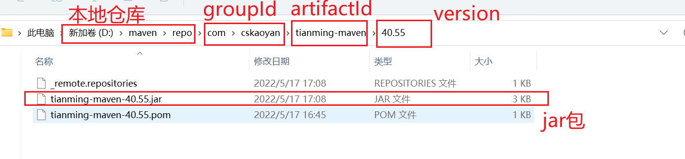


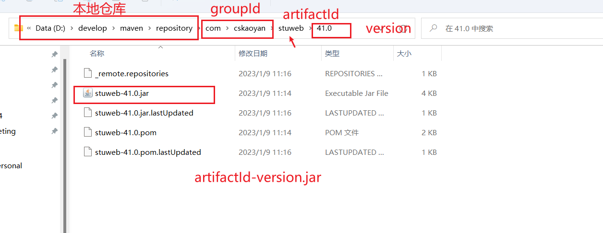


- clean 是干啥的
  - 删除生成的target文件夹。
  - 三种执行mvn命令的方式
    - 通过命令行。
    - 通过 idea 的terminal。
    - 通过可视化插件。(推荐)

- compile 是干什么的？

  - 编译项目的。<span style=color:yellow;background:red>**怎么编译的，编译的目的地。**</span>
  - src/main/java    -->   target/classes
  - src/main/resources   -->   target/classes
  - 在src/main/java下的配置文件（properties.xml）,文本文件 都不会被打包进入 target/classes。<span style=color:yellow;background:red>**今后 src/main/java里面只能写代码，其他东西不要写在这里面。**</span>
  - 在resources里面 或者其他的文件夹中建连续的文件夹，需要注意。  
    - com.cskaoyan   只会建一层文件夹。文件夹名字叫做，com.cskaoyan
    - 如果我们想建多层。 需要这样写`com/cskaoyan`。 或者分着建


  - package: 打包。将我们项目写好的代码，打成一个jar。供别人使用
    - 打包后的名字。artifactId-version.jar
  - install: 将打包好的jar。copy到本地仓库。
    - 怎么根据坐标。在本地仓库找到对应的jar。  首先进入本地仓库，找groupId对应的文件夹，找artifactId对应的文件夹，最后找version对应的文件夹

  

## 依赖管理

maven可以帮助我们管理依赖。依赖其实就是jar的下载。

### 如何导包

- 去maven网站上找到对应的包的坐标

  https://mvnrepository.com/

- 把对应的坐标复制到 pom.xml 文件中

  

- 点击 `import changes`

  

如果是idea2022的版本，有可能不会弹窗。这个时候，多点刷新。

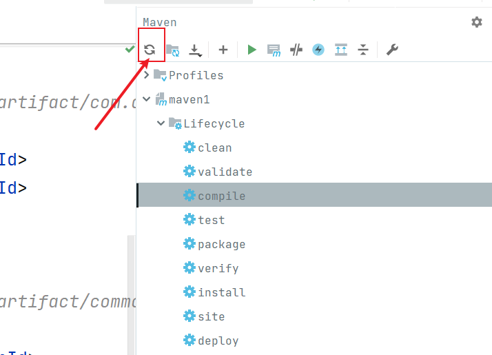

### scope作用域

每一个依赖包都有自己的作用范围。就是标识这个jar在什么时候能用


- test

  仅仅在测试包（src/test/java）路径下有效，在 src/main/java路径下失效。失效的表现：直接看不到类。一般一些测试包会用到。后面写测试类，在src/test/java下面写。测试类。 

- provided

  在编译的时候生效，在运行的时候失效。在什么时候有用，比如我们打完jar，不在本地运行，我们放到一个固定的地方去运行，这个固定的地方有这些jar。

  

  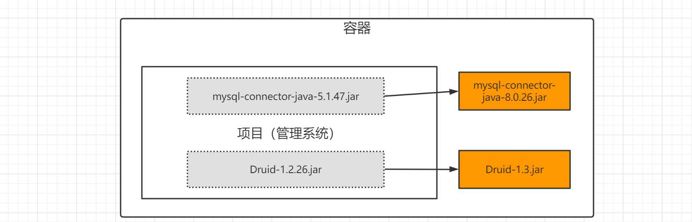

  > 对于上面图中的两个jar包，假如在运行的时候是运行在容器中的，那么运行的时候需要使用容器中提供的jar包，那么这个时候可以让原项目中的jar包失效。也就是编译的时候生效，但是运行的时候失效。
  >
  > 打包一个jar。之后把jar放到服务器运行，服务器有一个文件夹专门放jar。相当于这个jar在服务器上有。

- runtime

  在编译的时候失效，在运行的时候生效。编译的时候，看不到MySQL这个驱动包写的类，用的时候可以用。方便解耦，到时候切数据库的时候。不会有MySQL的类，这时候，非常好切。

  > 典型的就是数据库的驱动包。

- compile

  <span style='color:red;background:yellow;font-size:文字大小;font-family:字体;'>**默认的作用域**</span>，可以省略。99%的jar包都是这个作用域，表示不管是在 src/main/java 还是在 src/test/java 路径下，在编译的时候和运行的时候都有效。


### 依赖传递

指依赖具有传递性。比如，依赖了hikaricp. hikaricp依赖了slj4f-api.只要依赖了hikaricp,   slf4j-api就会自动被导入项目中。 

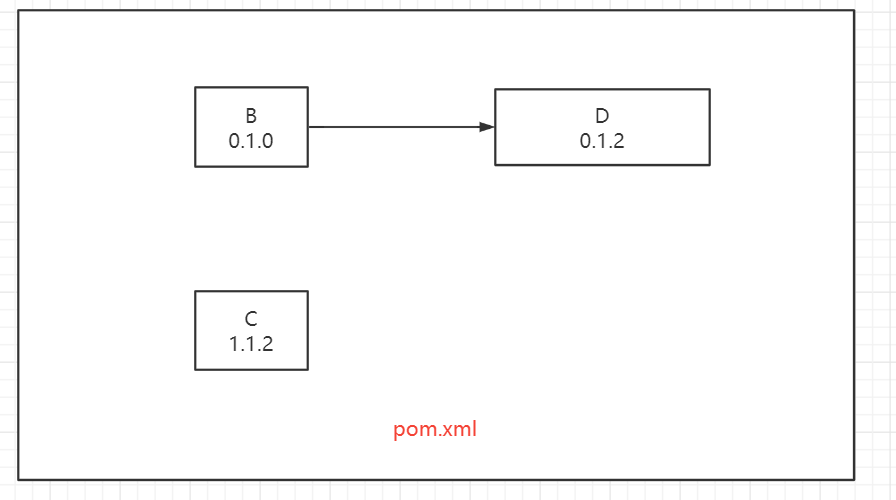

> 根据依赖的传递性，假如项目A中引入了B、C两个依赖，B的依赖中又有D依赖，那么这个时候就相当于A的依赖中有D这个依赖。
>
> 注意：是在compile这个作用域下

例如，我们自己的项目，依赖了c3p0。c3p0依赖了别的。所以我们的项目中会一起依赖它。

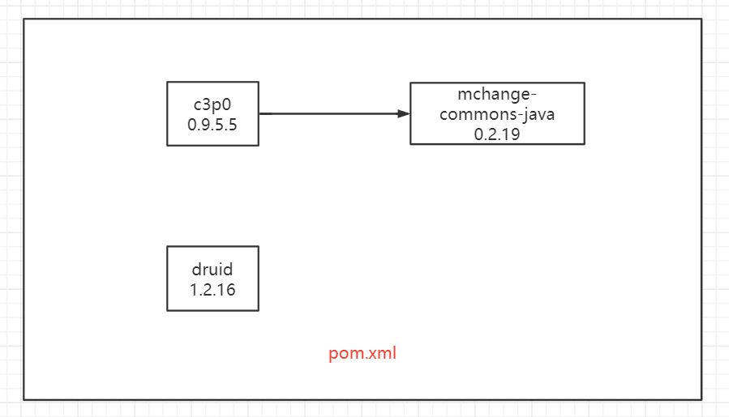

如何看项目的依赖。项目里面生效的jar。

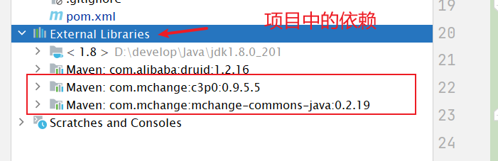

如果看依赖的传递？这个只是代表依赖的传递，并不代表真实会在项目中引入这个依赖。

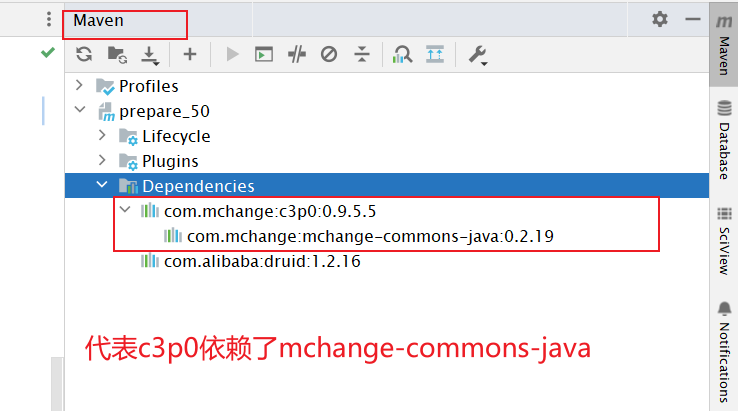


### 依赖冲突

> 什么是依赖冲突呢？
>
> <span style='color:red;background:yellow;font-size:文字大小;font-family:字体;'>**当在同一个项目中，导入同一个依赖的不同的版本，就会有冲突的问题。**</span>
>
> 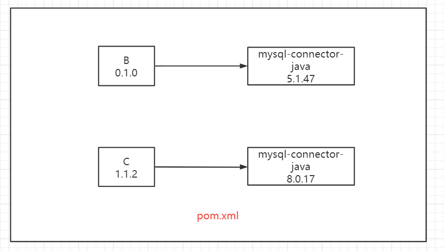

### 如何解决依赖冲突

#### 声明优先原则

是指这同一个项目的不同的版本的jar包，谁先在pom.xml中声明，以谁为准。

> <span style=color:red;background:yellow>**仅仅指的是第二级及后面的依赖。**</span>

spring-context和spring-jdbc都依赖了， spring-beans这个依赖

spring-context 5.3.6  依赖    spring-beans   5.3.6


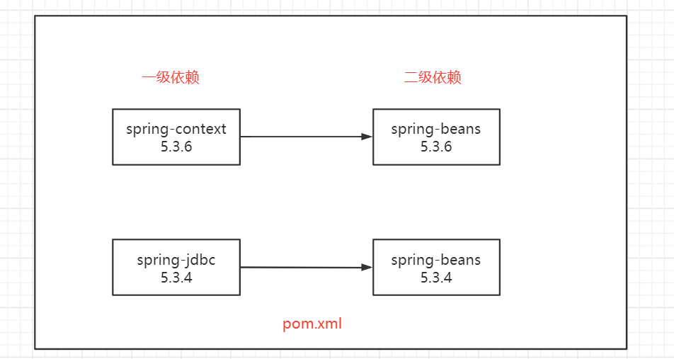


<span style=color:red;background:yellow>**对于一级依赖**</span>

如果在pom.xml里，同时依赖了两个版本。是以最后一个指定的为准。

```xml
<dependency>
    <groupId>org.springframework</groupId>
    <artifactId>spring-jdbc</artifactId>
    <version>5.3.6</version>
</dependency>

<dependency>
    <groupId>org.springframework</groupId>
    <artifactId>spring-jdbc</artifactId>
    <version>5.3.4</version>
</dependency>
```


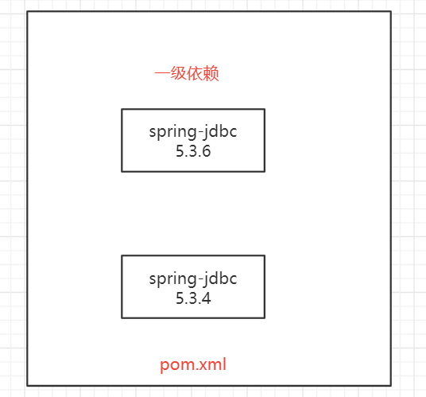


#### 就近原则

就近原则的优先级高于 声明优先原则。

就近原则是指，在进行依赖传递的时候，谁传递的次数比较少，以谁为准。


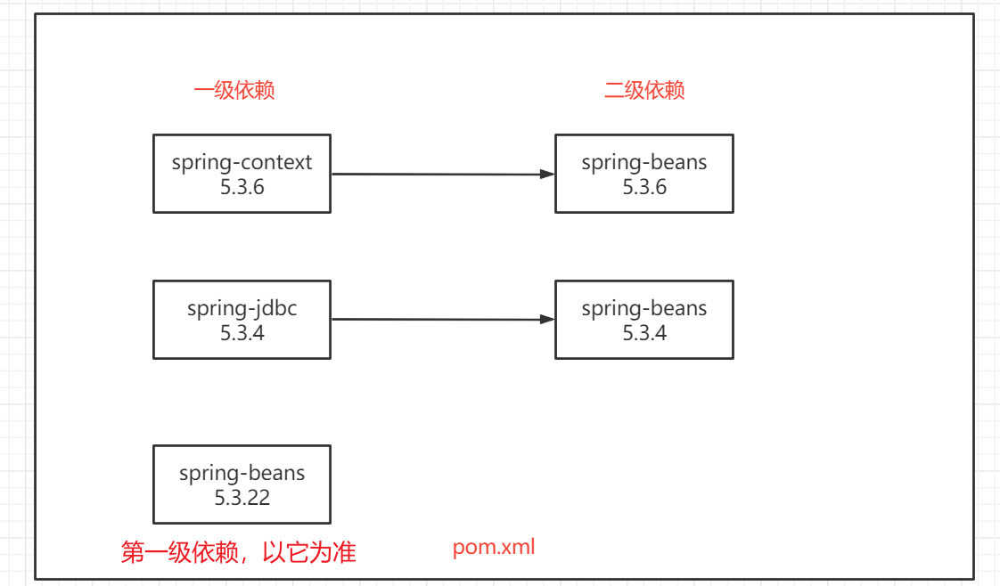


在工作过程中不会用，但是有的时候改依赖要注意。

千万不要觉得改依赖是一个简单问题。   qe        queryEngine  4.1.2    4.1.6。 4.1.7（两周） 4.1.8

#### 手动排除

我们可以手动去排除传递过来的依赖。

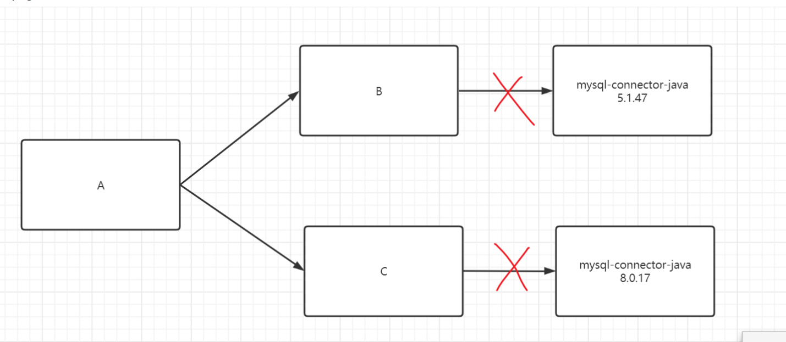

```xml
<dependency>
    <groupId>org.springframework</groupId>
    <artifactId>spring-jdbc</artifactId>
    <version>5.3.4</version>

	<!-- 手动排除 -->
    <exclusions>
        <exclusion>
            <groupId>org.springframework</groupId>
            <artifactId>spring-beans</artifactId>
        </exclusion>

        <exclusion>
            <groupId>org.springframework</groupId>
            <artifactId>spring-core</artifactId>
        </exclusion>
    </exclusions>
    
</dependency>
```

可以利用 idea来进行手动排除

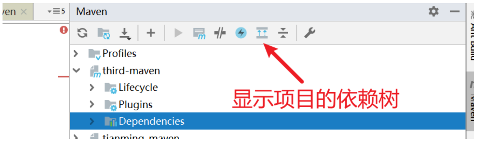

### 提取常量

这个是一个避免依赖冲突的方法。是后面工作中主要推荐的做法。

```xml
<properties>
		<!--
			1. 提取了常量之后，可以避免依赖冲突的问题
			2. 提取了常量之后，可以方便我们后期管理这些依赖（查看版本，更换版本）
		-->
        <spring.version>5.3.3</spring.version>
        <mysql.version>5.1.47</mysql.version>
        <druid.version>1.2.6</druid.version>

    </properties>


    <dependencies>

        <dependency>
            <groupId>org.springframework</groupId>
            <artifactId>spring-jdbc</artifactId>
            <version>${spring.version}</version>
        </dependency>


        <dependency>
            <groupId>org.springframework</groupId>
            <artifactId>spring-context</artifactId>
            <version>${spring.version}</version>
        </dependency>


        <dependency>
            <groupId>org.springframework</groupId>
            <artifactId>spring-beans</artifactId>
            <version>${spring.version}</version>
        </dependency>


        <dependency>
            <groupId>mysql</groupId>
            <artifactId>mysql-connector-java</artifactId>
            <version>${mysql.version}</version>
        </dependency>


        <dependency>
            <groupId>com.alibaba</groupId>
            <artifactId>druid</artifactId>
            <version>${druid.version}</version>
        </dependency>
    </dependencies>
```

> 总结：在后续的工作中，解决依赖冲突的问题主要是通过 提取常量 这种方式来规避依赖冲突的问题，如果规避了之后还有依赖冲突的问题，那么这个时候可以通过手动排除来解决。一般情况下不使用声明优先原则和就近原则来解决依赖冲突的问题。

## 使用maven开发项目

```java
Properties properties = new Properties();
//            FileInputStream fileInputStream = new FileInputStream("src/main/resources/druid.properties");
//            properties.load(fileInputStream);


            ClassLoader classLoader = DruidDemo.class.getClassLoader();

//            URL url = classLoader.getResource("druid.properties");
//            String path = url.getPath();
//            FileInputStream fileInputStream = new FileInputStream(path);
//            properties.load(fileInputStream);

            //file:/E:/cskaoyan/40workspace/code/maven-datasource/target/classes/druid.properties
            // path  /E:/cskaoyan/40workspace/code/maven-datasource/target/classes/druid.properties

//            System.out.println(url);
//            System.out.println("path:" + path);
			
// 使用APP ClassLoader类加载器来找 编译之后的配置文件 

            InputStream resourceAsStream = classLoader.getResourceAsStream("druid.properties");
            properties.load(resourceAsStream);

            dataSource = DruidDataSourceFactory.createDataSource(properties);
```

> 注意：
>
> 1. 导包的方式变了
> 2. 配置文件的加载方式变了（<span style=color:yellow;background:red>**不推荐使用绝对路径**</span>）

## 常见问题

### 依赖下载不下来的问题

假如网络不好的情况下，有的时候依赖可能下载不下来。

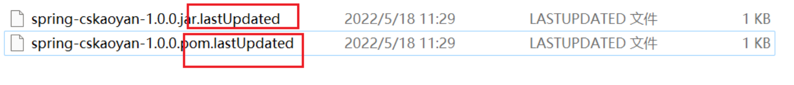

在本地仓库中，没有下载下来的依赖就会是这种 `.lastUpdated `文件类型。

那么这个时候有两个办法：

- 把本地仓库中没有下载下来的jar包删掉（带版本的文件夹）, 删掉了之后点击 reimport 重新下载

- 

  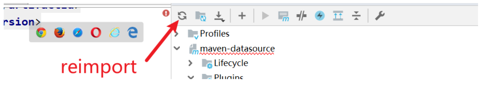

- 假如一直下载不下来，可以直接把同事（同学的依赖复制到本地仓库中）

  > 复制的时候直接复制带版本的文件夹


# Junit

Junit是一个被广泛使用的测试工具，可以帮助我们运行我们指定的方法。

我们一般用它来进行单元测试。单元测试，就是比如你要测试一个方法。


找最大值，找最小值的方法。

之前，使用Juint，一般都是当做主方法用。后续不建议这样用。 

## 如何使用

- 导包

  ```xml
  <dependency>
      <groupId>junit</groupId>
      <artifactId>junit</artifactId>
      <version>4.12</version>
      <scope>test</scope>
  </dependency>
  ```

- 配置

  不需要配置

- 使用

  - @Test

  - @After

    修饰的方法会在测试方法运行之后执行

  - @Before

    修饰的方法会在测试方法运行之前执行

  - @BeforeClass

  - @AfterClass

  > 使用的注意事项：
  >
  > 1. @BeforeClass和@AfterClass修饰的方法必须是静态的
  > 2. @Test注解修饰的方法必须是public、必须是void、必须没有参数
  > 3. 测试类必须在 src/test/java 路径下
  > 4. 测试类的命名必须叫做 `XxxTest`
  > 5. 测试方法（@Test注解修饰的方法）的命名必须叫做` testXxx`();


> maven会帮助我们运行 src/test/java路径下的所有的测试类中的测试方法

`mvn install -DskipTests`

单元测试覆盖率: 90%。保证代码的正确性。


父子工程


后续，进入到企业，可能会出现这种情况。 

```XML
<dependencies>
   
        
dependencyManagement： 里面的知识声明版本，并不会直接导入。在这里面声明了版本，后续就不用在子的pom去声明版本，直接使用这个包即可。 
```

