# MyBatis

>SSM:  Spring   SpringMVC  MyBatis。

# 介绍

>MyBatis本是apache基金会的一个开源项目ibatis ，2010年这个项目由apache迁移到了google code， 并且改名为Mybatis。2013年11月代码迁移到了github. Mybatis是一个基于Java的持久层框架。（DAO Mapper）
>
>Mybatis是一个ORM框架。MyBatis是一种流行的Java持久化框架，用于简化数据库访问和操作。它提供了一种将数据库查询、插入、更新和删除操作与Java对象之间的映射的方式。
>
>```Java
>// ORM：Object Relationship Mapping。 对象关系映射(说白了, 就是可以把Java中的对象映射成关系(数据表中的一条数据))。 其实Mybatis就是一个可以帮助我们把 关系型数据库中的记录转化为 Java对象，把Java对象转化为关系型数据库中的记录的这么一个框架。
>
>举例来说。之前我们写得查询executeQuery()方法，查询user表，拿回来一个ResultSet对象，我们需要去遍历，如果我们在Java中有这样一个类User与之一一对应，这时候需要我们手动将这个类的属性设置进去，但是有了Mybatis，只要配置好映射关系，就可以自动完成映射。（也即从表中的记录 到 Java对象 这个过程）。Mybatis被称为ORM框架，就是负责将表中的数据映射到类上。把类上的数据映射到表上。
>    建立两者之间的关系。
>```
>
>Mybatis就是一个可以帮助我们在Java代码中更加高效的<span style='color:red;background:yellow;font-size:文字大小;font-family:字体;'>**去操作数据库**</span>的这么一个框架。

官网 : https://mybatis.org/mybatis-3/zh/index.html


传统的JDBC查询代码


```JAVA
public class QueryDemo {
    public static void main(String[] args) {
        // JDBC连接信息
        String url = "jdbc:mysql://localhost:3306/test_52th3"; // 替换为你的数据库连接信息
        String username = "root"; // 替换为你的数据库用户名
        String password = "123456"; // 替换为你的数据库密码

        // SQL查询语句
        String sql = "SELECT * FROM user";

        List<User> resultList = new ArrayList<>();

        try (Connection connection = DriverManager.getConnection(url, username, password);
             Statement statement = connection.createStatement();
             ResultSet resultSet = statement.executeQuery(sql)) {

            while (resultSet.next()) {
                int id = resultSet.getInt("id");
                String name = resultSet.getString("name");
                String email = resultSet.getString("email");

                // 创建User对象并打印查询结果
                User user = new User(id, name, email);
                resultList.add(user);
            }
        } catch (SQLException e) {
            e.printStackTrace();
        }
        System.out.println(resultList);
    }
}
```

使用接口的方式写这个关系。

# 入门案例(Quick start)

> 导包
>
> ```xml
> <!--mybatis-->
> <dependency>
>     <groupId>org.mybatis</groupId>
>     <artifactId>mybatis</artifactId>
>     <version>3.5.9</version>
> </dependency>
> 
> 
> <!-- 数据库驱动包 -->
> <dependency>
>     <groupId>mysql</groupId>
>     <artifactId>mysql-connector-java</artifactId>
>     <version>5.1.47</version>
>     <scope>runtime</scope>
> </dependency>
> ```

>配置1: 配置一个Mybatis的主配置文件，用来获取SqlSessionFactory。（`mybatis-config.xml`）
>
>```java
>// SqlSessionFactory：每一个Mybatis应用都是以SqlSessionFactory的实例对象为核心的。使用Mybatis必须以SqlSessionFactory的实例为核心，再以SqlSessionFactory的实例生产SqlSession实例对象的。
>// SqlSession：这个其实表示和数据库之间的一个连接，里面封装了 Connection对象
>```
>
>```xml
><?xml version="1.0" encoding="UTF-8" ?>
>
><!-- 约束文件 -->
><!DOCTYPE configuration PUBLIC "-//mybatis.org//DTD Config 3.0//EN" "https://mybatis.org/dtd/mybatis-3-config.dtd">
>
><!-- 注意这个configuration配置包括内部配置: 不要更换配置顺序  -->
><configuration>
>
><!-- 环境的配置，其实就是去配置数据库连接-->
><environments default="development">
>  <environment id="development">
>      <transactionManager type="JDBC"/>
>       <dataSource type="POOLED">
>           <property name="driver" value="com.mysql.jdbc.Driver"/>
>           <property name="url" value="jdbc:mysql://localhost:3306/db7?useSSL=false&amp;characterEncoding=utf8"/>
>           <property name="username" value="root"/>
>           <property name="password" value="123456"/>
>       </dataSource>
>   </environment>
></environments>
>
><mappers>
>		<!--<mapper resource="UserMapper.xml"/>-->
>    	<!--<mapper resource="com/cskaoyan/mapper/UserMapper.xml"/>-->
></mappers>
>
></configuration>
>```

>配置2: 配置一个专门用来存放SQL语句的配置文件，`UserMapper.xml` 
>
>```Java
>// 在Mybatis中，这样的文件可以有多个。我们使用一个xml文件来存放一组SQL， 比如对学生的SQL，对订单的SQL
>// 这些文件，都必须在Mybatis的主配置文件中，声明进来
>```
>
>```xml
><?xml version="1.0" encoding="UTF-8" ?>
><!DOCTYPE mapper
>        PUBLIC "-//mybatis.org//DTD Mapper 3.0//EN"
>        "http://mybatis.org/dtd/mybatis-3-mapper.dtd">
>
><!-- namespace: 命名空间，整个项目中必须唯一，暂时可以任意取名(后面再进行标准化) -->
><mapper namespace="AccountMapper">
>
>    <!-- 每个标签都需要一个唯一的id属性: 
>    		每一个标签的id不能重复(本Mapper文件中), 用来标识一条SQL  -->
><!-- 在这个Mapper文件中, 怎么唯一表示SQL语句?
>        namespace.id (命名空间.标签的id ) 是这个SQL语句的坐标  -->
>     <!-- <insert> 插入标签 -->
>    <!-- <delete> 删除标签 -->
>    <!-- <update> 修改标签 -->
>    <!-- <select> 查询标签 -->
>    
><!-- parameterType：参数的类型(可以省略,标准语法要指明 ) -->
>    <!-- resultType：返回的结果集的类型(不能省略) -->
>    <select id="selectAccountById"  parameterType="java.lang.Integer" resultType="com.cskaoyan.bean.Account">
>        select * from account where id = #{id}
>     </select>
>    <select id="selectAccountList" resultType="com.cskaoyan.bean.Account">
>       select * from account
>     </select>
>    
></mapper>
>```

>使用
>
>```Java
>@Test
>public void test1() throws IOException {
>   // 1.读取配置文件
>   InputStream inputStream = Resources.getResourceAsStream("mybatis-config.xml");
>
>   // 2.创建一个SqlSessionFactory
>   SqlSessionFactory sqlSessionFactory = new SqlSessionFactoryBuilder().build(inputStream);
>
>   // 3.通过SqlSessionFactory获得一个SqlSession
>   SqlSession sqlSession = sqlSessionFactory.openSession();
>
>   // 4.执行SQL语句：传入SQL语句的坐标
>   // 这里传入的 statement 是一个坐标，用来标识这个SQL的坐标。 使用 namespace.id 来唯一标识这条SQL
>   // 参数写得1，代表传进去一个参数
>   User user = sqlSession.selectOne("UserMapper.selectUserById", 1);
>    
>    // sqlSession.selectList();
>    
>   System.out.println(user);
>
>   List<User> userList = sqlSession.selectList("UserMapper.selectUserList");
>   System.out.println(userList);
>
>   // 5.关闭连接
>   sqlSession.close();
>}
>```

# 动态代理(Dynamic Proxy)

## 动态代理

>一些问题
>
>```Java
>// 目前Mybatis使用起来还不够灵活，不够简单
>// 虽然解决了硬编码的问题，但是出现了一些新的问题
>            SQL语句的坐标硬编码
>            sqlSession调用的方法需要我们去指定
>```
>
>而Mybatis的动态代理可以帮助我们去生成接口的代理对象。我们可以自己不实现接口。
>

代理解释一下。


而Mybatis的动态代理可以帮助我们去生成接口的代理对象。我们可以自己不实现接口。

不需要实现接口，那么就需要遵守Mybatis使用动态代理的一些规则。

<span style=color:yellow;background:red>**必须要遵循的规则**</span>

1. 接口的全限定名称 和 mapper.xml中的namespace的值保持一致。
2. 接口中的方法和 xml文件中的 <select> <insert> <update> <delete> 标签 一一对应，并且方法名要和标签的id值保持一致
3. 方法的返回值类型和标签中的resultType保持一致(注意:添加/删除/修改不需要返回值类型)

4. 参数保持一致(暂时可以不写)


<span style=color:red;background:yellow>**建议要遵守的规则：希望**</span>

还是建议遵守。 

1. 文件的名字 StudentMapper.xml  | StudentMapper.java 建议保持一致。 ---》好认。 好认出来，是一起的。 	
2. StudentMapper.xml 和StudentMapper.java 在编译之后的位置应该要在同一个路径下。

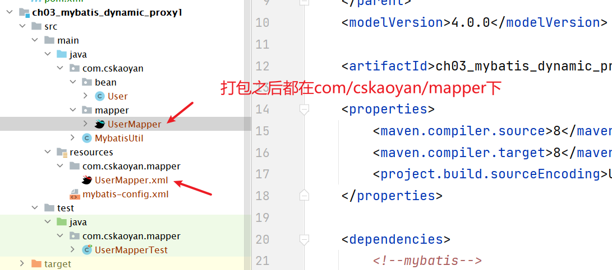

如何使用动态代理呢？

```JAVA
@Test
public void test1() {
    // 获取SqlSession
    SqlSession sqlSession = MybatisUtil.getSqlSession();

    // 获取代理对象
    UserMapper userMapper = sqlSession.getMapper(UserMapper.class);

    // 调用对应的接口，执行
    User user = userMapper.queryUserById(1);
    System.out.println(user);
}
```

## 增删改查示例

### 添加

```XML
<!--在UserMapper中写得内容-->
<insert id="insertUser">
    insert into user(id,name,email) values (#{id}, #{name}, #{email})
</insert>
```

在UserMapper接口

```JAVA
int insertUser(User user);
```

在测试类中的使用

```JAVA
@Test
public void testInsert() {
    User user = new User(4, "zhangsan", "zhangsan@qq.com");

    SqlSession sqlSession = MybatisUtil.getSqlSession();

    UserMapper mapper = sqlSession.getMapper(UserMapper.class);

    int affectedRows = mapper.insertUser(user);
    System.out.println(affectedRows);

    // 获取到的SqlSession，默认不会自动提交。需要手动提交，数据才会进去
    sqlSession.commit();

    //Connection connection = sqlSession.getConnection();
    //connection.commit();
}
```


### 删除

在UserMapper.xml中的内容

```XML
<delete id="deleteUserById">
    delete from user where id = #{id};
</delete>
```

在UserMapper接口

```JAVA
int deleteUserById(Integer id);
```

在测试类中的使用

```JAVA
@Test
public void testDeleteById() {
    SqlSession sqlSession = MybatisUtil.getSqlSession(true);

    UserMapper userMapper = sqlSession.getMapper(UserMapper.class);

    int affectedRows = userMapper.deleteUserById(1);
    System.out.println(affectedRows);
}
```

### 修改

在UserMapper.xml中的内容

```XML
<update id="updateUser">
    update user set name = #{name}, email= #{email} where id = #{id};
</update>
```

在UserMapper接口

```JAVA
int updateUser(User user);
```

在测试类中的使用

```JAVA
@Test
public void testDeleteById() {
    SqlSession sqlSession = MybatisUtil.getSqlSession(true);

    UserMapper userMapper = sqlSession.getMapper(UserMapper.class);

    int affectedRows = userMapper.deleteUserById(1);
    System.out.println(affectedRows);
}
```

### 查询

在UserMapper.xml中的内容

```XML
<select id="queryUserById" resultType="com.cskaoyan.bean.User">
    select *
    from user
    where id = #{id}
</select>
```

在UserMapper接口

```JAVA
User queryUserById(Integer id);
```

在测试类中的使用

```JAVA
@Test
public void testQueryById() {
    // 获取SqlSession
    SqlSession sqlSession = MybatisUtil.getSqlSession();

    // 获取代理对象
    UserMapper userMapper = sqlSession.getMapper(UserMapper.class);

    // 调用对应的接口，执行
    User user = userMapper.queryUserById(1);
    System.out.println(user);
}
```


```JAVA
自己创建表，通过Mybatis SqlSession（原生方式） 和动态代理分别实现用户注册登录需要的接口
 
1. 注册接口
2. 登录接口
3. 修改用户信息
4. 销户
    
    
create table user_login(
	id int primary key auto_increment,
    username varchar(255),
    password varchar(255),
    img varchar(255),
    age int
);
```


```JAVA
写mybatis，主要分几步
    1.在 Mapper接口中，定义方法
    2.在xml中，写一个与之对应的标签，然后再标签中写SQL。
    3.使用
```

## 事务

>在使用Mybatis的时候, 自带事务，而且事务默认情况下是不会自动提交的

### 解决方案一

执行完SQL语句之后, 使用sqlSession提交事务

```JAVA
// 解决办法一:  执行完SQL语句之后, 使用sqlSession提交事务
sqlSession.commit();
```


### 解决方案二

执行完SQL语句之后, 使用sqlSession内部封装的Connection 提交事务

```JAVA
// 解决办法二:  执行完SQL语句之后, 使用sqlSession内部封装的Connection 提交事务
Connection conn  = sqlSession.getConnection();
conn.commit();
```

### 解决方案三

(自动提交) 在获得SqlSession的时候, 给sqlSessionFactory.openSession设置为真

```JAVA
// 解决办法三:(自动提交) 在获得SqlSession的时候, 给sqlSessionFactory.openSession设置为真
// 获取到的SqlSession，里面的connection不会自动提交
SqlSession session = sqlSessionFactory.openSession();
// 获取自动提交的SqlSession
SqlSession session = sqlSessionFactory.openSession(true);  
```

# 搭建开发环境(MyBatis)

是个Maven项目

>第一步: 导包在pom.xml
>
>```xml
><dependencies>
>    <!--mybatis-->
>    <dependency>
>        <groupId>org.mybatis</groupId>
>        <artifactId>mybatis</artifactId>
>        <version>3.5.9</version>
>    </dependency>
>
>    <!-- 数据库驱动包 -->
>    <dependency>
>        <groupId>mysql</groupId>
>        <artifactId>mysql-connector-java</artifactId>
>        <version>5.1.47</version>
>        <scope>runtime</scope>
>    </dependency>
>
>    <!-- 测试包 -->
>    <dependency>
>        <groupId>junit</groupId>
>        <artifactId>junit</artifactId>
>        <version>4.12</version>
>        <scope>test</scope>
>    </dependency>
></dependencies>
>```
>
>第二步: 配置MyBatis的主配置文件(`mybatis-config.xml`)
>
>```xml
><?xml version="1.0" encoding="UTF-8" ?>
><!DOCTYPE configuration PUBLIC "-//mybatis.org//DTD Config 3.0//EN"
>        "https://mybatis.org/dtd/mybatis-3-config.dtd">
><configuration>
>
>    <!-- 环境的配置，其实就是去配置数据库连接-->
>    <environments default="development">
>        <environment id="development">
>            <transactionManager type="JDBC"/>
>            <dataSource type="POOLED">
>                <property name="driver" value="com.mysql.jdbc.Driver"/>
>                <property name="url"
>                          value="jdbc:mysql://localhost:3306/test_52th?useSSL=false&amp;characterEncoding=utf8"/>
>                <property name="username" value="root"/>
>                <property name="password" value="123456"/>
>            </dataSource>
>        </environment>
>    </environments>
>
>    <!-- 去查找的Mapper文件 -->
>    <mappers>
>        <mapper resource="com/cskaoyan/mapper/UserMapper.xml"/>
>    </mappers>
>
></configuration>
>```
>
>第三步: 创建一个Java接口Mapper接口文件 (注意路径)
>
>第四步: 创建一个与Java接口文件对应的Mapper.xml配置文件
>
>```Java
>// 在第三/四步骤中: 
>1, 注意路径保持, 最终经过编译和对应接口文件编译到同一包下   --》 可以让开发者知道接口和这个xml是一起的
>2, 文件的名字和接口的文件的名字保持一致
>3, xml中的namespace(命名空间)的值要和Java接口的全限定名称保持一致
>```
>
>第五步: 把mapper.xml配置文件引入到主配置文件中(`mybatis-config.xml`)
>
>```xml
><!-- 去查找的Mapper文件 -->
><mappers>
><mapper resource="com/snow/www/mapper/AccountMapper.xml"/>
></mappers>
>```
>
>第六步: 加载主配置文件(`mybatis-config.xml`)  
>
>```Java
>// 1. 读取配置文件
>InputStream inputStream = null;
>try {
>	inputStream = Resources.getResourceAsStream("mybatis-config.xml");
>} catch (IOException e) {
>	e.printStackTrace();
>}
>
>// 2. 获取SqlSessionFactory
>SqlSessionFactoryBuilder sqlSessionFactoryBuilder = 
>					new SqlSessionFactoryBuilder();
>sqlSessionFactory = sqlSessionFactoryBuilder.build(inputStream);
>```
>
>第七步: 在对应的Mapper文件和对应的Java接口中, 声明SQL和声明方法
>
>````Java
>// 注意:
>1, 方法名和对应xml的SQL的id保持一致
>2, 参数和返回值设置正确
>3, 注意SQL返回值类型parameterType(结果集的解析是Mybatis自动完成的，不用我们自己解析)
>4, 注意SQL语句书写正确
>````
>
>```Java
>// 添加
>public int insertAccount(Account account);
>// 查找
>public Account selectAccountById(Integer id);
>```
>
>```xml
><insert id="insertAccount" >
>	insert into account set id=#{id}, name=#{name}, money=#{money}
></insert>
><select id="selectAccountById"  parameterType="java.lang.Integer" resultType="com.snow.www.bean.Account">
>	select * from account where id = #{id}
></select>
>```
>
>第八步: 获取SqlSession  和  代理的Mapper对象
>
>```java
>// 1. 获取SqlSession
>sqlSession = sqlSessionFactory.openSession(true);
>
>// 2. 获取接口的代理对象
>studentMapper = sqlSession.getMapper(AccountMapper.class);
>```
>
>第九步: 通过代理对象调用方法执行SQL语句
>
>```Java
>Account account = new Account();
>account.setId(10);
>account.setName("snow");
>account.setMoney(200);
>int rows  = accountMapper.insertAccount(account);
>```

# 配置(MyBatis)

> 主要是介绍Mybatis的核心配置文件。
>
> 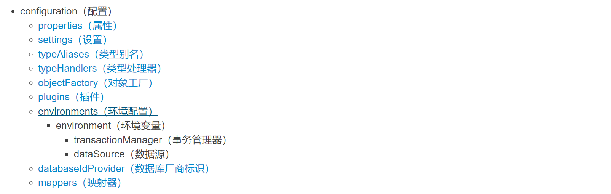

## properties

>properties表示可以外部配置的属性，并可以进行动态替换。(作为典型的是JDBC配置)
>
>```properties
>driver=com.mysql.jdbc.Driver
>url=jdbc:mysql://localhost:3306/db47?useSSL=false&characterEncoding=utf8
>username=root
>password=123456
>```
>
>```xml
><configuration>
>        <!-- 引入外部配置文件 -->
>         <properties resource="com/cskaoyan/mapper/jdbc.properties"/>
></configuration>
>```


可以使用外部的propertie配置文件。

## settings

>settings是MyBatis的行为配置(类似于idea和settings的关系)
>
>eg: 日志配置
>
>```XML
><configuration>
>        <settings>
>             <!-- 添加日志的配置-->
>             <setting name="logImpl" value="STDOUT_LOGGING"/>
>    </settings>
></configuration>
>```
>
>
>
>一个完整的settings配置 (暂时没用)
>
>```xml
><settings>
>      <setting name="cacheEnabled" value="true"/>
>      <setting name="lazyLoadingEnabled" value="true"/>
>      <setting name="aggressiveLazyLoading" value="true"/>
>      <setting name="multipleResultSetsEnabled" value="true"/>
>      <setting name="useColumnLabel" value="true"/>
>      <setting name="useGeneratedKeys" value="false"/>
>      <setting name="autoMappingBehavior" value="PARTIAL"/>
>      <setting name="autoMappingUnknownColumnBehavior" value="WARNING"/>
>      <setting name="defaultExecutorType" value="SIMPLE"/>
>      <setting name="defaultStatementTimeout" value="25"/>
>      <setting name="defaultFetchSize" value="100"/>
>      <setting name="safeRowBoundsEnabled" value="false"/>
>      <setting name="safeResultHandlerEnabled" value="true"/>
>      <setting name="mapUnderscoreToCamelCase" value="false"/>
>      <setting name="localCacheScope" value="SESSION"/>
>      <setting name="jdbcTypeForNull" value="OTHER"/>
>      <setting name="lazyLoadTriggerMethods" value="equals,clone,hashCode,toString"/>
>      <setting name="defaultScriptingLanguage" value="org.apache.ibatis.scripting.xmltags.XMLLanguageDriver"/>
>      <setting name="defaultEnumTypeHandler" value="org.apache.ibatis.type.EnumTypeHandler"/>
>      <setting name="callSettersOnNulls" value="false"/>
>      <setting name="returnInstanceForEmptyRow" value="false"/>
>      <setting name="logPrefix" value="exampleLogPreFix_"/>
>      <setting name="logImpl" value="SLF4J | LOG4J | LOG4J2 | JDK_LOGGING | COMMONS_LOGGING | STDOUT_LOGGING | NO_LOGGING"/>
>      <setting name="proxyFactory" value="CGLIB | JAVASSIST"/>
>      <setting name="vfsImpl" value="org.mybatis.example.YourselfVfsImpl"/>
>      <setting name="useActualParamName" value="true"/>
>      <setting name="configurationFactory" value="org.mybatis.example.ConfigurationFactory"/>
></settings>
>```

## typeAliases

> typeAlies类型别名。(也就是我们可以对 类 起别名，简化操作)  (暂时不建议使用)
>
> ```xml
> <configuration>
>     
>     <!-- 类型别名 -->
>     <typeAliases>
>         <!-- alias别名 type全限定名 -->
>         <typeAlias alias="account" type="com.snow.bean.Account"/>
>         <typeAlias alias="user" type="com.snow.bean.User"/>
>     </typeAliases>
> </configuration>
> ```
>
> ```xml
> <select id="selectAccountById"  resultType="account">
>     select * from account where id = #{id}
> </select>
> ```

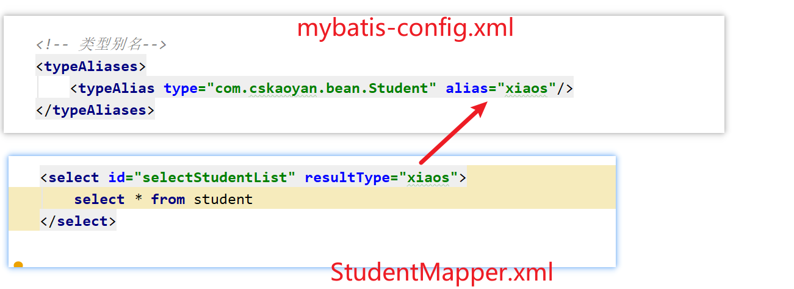

> 注意: Mybatis对于一些基本类型和包装类型，以及集合类型，<span style='color:red;background:yellow;font-size:文字大小;font-family:字体;'>**有内置的别名。**</span>
>
> ```java
> // 值得注意的是下面是一些为常见的 Java 类型内建的类型别名。它们都是不区分大小写的，而且为了应对原始类型的命名重复，采取了特殊的命名风格。
> // 注意: 除了内置别名,  不要乱起别名
> ```
>
> ```xml
>  <select id="selectNameById"
>             parameterType="java.lang.Integer"
>             resultType="java.lang.String">
>         select name from account where id = #{id}
> </select>
> <select id="selectNameById"
>         parameterType="Integer"
>         resultType="String">
>     select name from account where id = #{id}
> </select>
> <select id="selectNameById"
>         parameterType="integer"
>         resultType="string">
>     select name from account where id = #{id}
> </select>
> <select id="selectNameById"
>             parameterType="_int"
>             resultType="String">
>      select name from account where id = #{id}
> </select>
> ```
>
> | 别名       | 映射的类型 |
> | :--------- | :--------- |
> | _byte      | byte       |
> | _long      | long       |
> | _short     | short      |
> | _int       | int        |
> | _integer   | int        |
> | _double    | double     |
> | _float     | float      |
> | _boolean   | boolean    |
> | string     | String     |
> | byte       | Byte       |
> | long       | Long       |
> | short      | Short      |
> | int        | Integer    |
> | integer    | Integer    |
> | double     | Double     |
> | float      | Float      |
> | boolean    | Boolean    |
> | date       | Date       |
> | decimal    | BigDecimal |
> | bigdecimal | BigDecimal |
> | object     | Object     |
> | map        | Map        |
> | hashmap    | HashMap    |
> | list       | List       |
> | arraylist  | ArrayList  |
> | collection | Collection |
> | iterator   | Iterator   |

>注意: 
>
>1, typeHandlers: MyBatis 对我们SQL参数或从结果集中取出一个值时， 都会用类型处理器将获取到的值以合适的方式转换成 Java 类型。(而在我们使用的时候是无法感知这个问题的, 属于MyBatis的底层处理).
>
>2, ObjectFactory: MyBatis 使用一个对象工厂实例来完成实例化工作。 默认的对象工厂要么通过默认无参构造方法，要么通过有参数的构造方法实例化对象。如果想覆盖对象工厂的默认行为，可以通过创建自己的对象工厂来实现。(不要使用)


后续，在拿数据库中的bean中，尽量用包装类。这样我们才能知道，到底是默认值还是数据库中为空。

class User{

int id;

Integer id;

}

## environments

>environments: 可以配置成适应多种环境.比如开发环境、测试环境和生产环境等可能需要有不同的配置.

```XML
<!-- 环境的配置，其实就是去配置数据库连接-->
<environments default="development">

<!-- 环境的id，是唯一的-->
<environment id="development">

   <!-- 事务管理器
       JDBC:   使用JDBC连接来管理事务
       MANAGED: 把事务的管理交给外部的容器 -->
   <!-- 如果你正在使用 Spring + MyBatis，则没有必要配置事务管理器，
				因为 Spring 模块会使用自带的管理器来覆盖前面的配置。-->
   <transactionManager type="JDBC"/>

   <!--
       POOLED： 使用Mybatis自带的连接池
       UNPOOLED：不使用连接池
       JNDI：使用外部的连接池  -->
   <dataSource type="POOLED">
       <property name="driver" value="${driver}"/>
       <property name="url" value="${url}"/>
       <property name="username" value="${username}"/>
       <property name="password" value="${password}"/>
   </dataSource>
</environment>

<environment id="test">
   <transactionManager type="JDBC"/>
   <dataSource type="POOLED">
       <property name="driver" value="${driver}"/>
       <property name="url" value="${url}"/>
       <property name="username" value="${username}"/>
       <property name="password" value="${password}"/>
   </dataSource>
</environment>

<environment id="prod">
   <transactionManager type="JDBC"/>
   <dataSource type="POOLED">
       <property name="driver" value="${driver}"/>
       <property name="url" value="${url}"/>
       <property name="username" value="${username}"/>
       <property name="password" value="${password}"/>
   </dataSource>
</environment>
</environments>
```

## mappers

> 这个是映射器的配置。配置mapper.xml配置文件。


- 配置方式一: 直接以对应mapper文件的相对路径(相对target/classess路径)

```xml
<configuration>    
	<mappers>
      <mapper resource="com/snow/mapper/AccountMapper.xml"/>
      <mapper resource="com/snow/mapper/User.xml"/>
       
        <!-- mapper中，
        可以写resource。（就是相对target/classes的目录）
        可以写url，里面就是写得绝对路径. file:/// ${绝对路径}
        可以写class，写得是类名的全限定类名，但是要注意类和映射文件要在相同路径下。类名和映射文件名字相同。-->
      <mapper url="file:///D:\ideaProjects\java52-course-materials\mapper\UserMapper.xml"/>
      <mapper class="com.cskaoyan.mapper.UserMapper"/>
 	</mappers>
</configuration>
```


- 配置方式二: 配置某个包下的所有的配置文件

```XML
<configuration>    
	<mappers>
       <package name="com.cskaoyan.demo5.mapper"/>
    </mappers>
</configuration>
```

# 输入映射

select * from user where id=?;


> 输入映射其实就是在说Mybatis是如何传值的。

```JAVA
// 只有一个参数
// 传递多个参数
// ....
```

## 一个参数

建议使用`@Param注解`，注解怎么写，xml中就怎么写。


1. <span style='color:red;background:yellow;'>#{任意值}</span> 来取值:  不建议使用, 建议使用注解写法

 ```java
 //一个参数： 一个入参
 // 根据id来查找这个账户
 // 1.如果方法的入参没有加任何的注解，那xml中可以随意写 。   #{id1lsdfjasdlfdjkl}
 // 但是不建议大家随意写。  建议叫什么，写什么
 Account queryAccountById1(Integer id);
 ```

 ```xml
 <select id="queryAccountById1" resultType="com.cskaoyan.demo8.bean.Account">
     select *
     from account
     where id = #{id1lsdfjasdlfdjkl}
 </select>
 ```

2. 如果在方法中 的一个参数 加了@Param注解，那么 后面就只能通过 `#{注解值}` 来取值

```JAVA
// 参数加了 @Param()注解  -->   注解里面怎么写，xml里面就怎么写。
Account queryAccountById2(@Param("id1") Integer id);
```

```XML
<select id="queryAccountById2" resultType="com.cskaoyan.demo8.bean.Account">
    select *
    from account
    where id = #{id1};
</select>
```

## 多个参数

建议使用注解写，注解中怎么写，xml就怎么写。

<span style=color:red;background:yellow>**注意：**</span>

- 直接写多个值, 用参数名简单匹配是不识别的
-  如果参数名简单匹配是不识别, 又不想加注解, 也是有别的解决手段(按位传值: 不建议), 但是建议加注解(最标准的写法)


```JAVA
// 4.推荐增加@Param注解。
// @Param里面怎么写，xml中就怎么写。  @Param("id1") xml中写 #{id1}
// 根据id获取name来查找数据。
List<Account> queryAccountByIdOrName2(@Param("id") Integer id, @Param("name") String name);
```


```XML
<select id="queryAccountByIdOrName2" resultType="com.cskaoyan.demo8.bean.Account">
    select *
    from account
    where id = #{id}
       or name = #{name};
</select>
```

## 对象传值

常用。建议使用方式一。

方式一: SQL使用的参数命名要和对象内部属性保持一致 (<span style='color:red;background:yellow;'>#{成员变量名}</span> 来取值)

```java
// 5.使用对象传值。对象没有注解
// 最后，在xml中，使用 #{成员变量名} 来取值
// 对象前面没有任何的注解，在xml中使用的时候，只要使用  #{对象属性名}即可
// 比如 Account 中有 name 和money.  最终想用name   #{name}
int insertAccount(Account account);
```

```xml
<insert id="insertAccount">
    insert into account(name, money)
    values (#{name}, #{money});
</insert>
```


方式二: 对象有注解, 必须通过 <span style='color:red;background:yellow;'>#{注解值 . 成员变量名} </span>来取值

```JAVA
// 使用对象传值，对象有注解
// 在xml中，应该写  #{注解值.成员变量名}
// 比如 @Param("user") User user.   我要使用里面的name  和  password
// #{user.name}  #{user.password}
int insertAccount2(@Param("account") Account account);
```

```XML
<insert id="insertAccount2">
    insert into account(id, name, money)
    values (#{account.id}, #{account.name},
            #{account.money});
</insert>
```

## 使用Map传值

Map     由  key value

对象里面。 属性名和属性值。 User(name   age  address )


Map传值: <span style=color:yellow;background:red>**不建议使用**</span>。因为写起来非常舒服，维护起来非常抓狂

方式一: SQL使用的参数命名要和Map中存储数据的key保持一致 (<span style='color:red;background:yellow;'>#{key}</span> 来取值)

```java
// 使用Map传值，无注解
// 在xml中，应该写  #{key}
// 比如这里有一个Map。里面有  {"name":"zhangsan", "age": 18}
// 最终，在xml中要取name . #{name}
int insertAccount3(Map<String, String> map);
```

```xml
<insert id="insertAccount3">
    insert into account(name, money)
    values (#{name}, #{money});
</insert>
```

方式二: Map对象有注解, 必须通过 <span style='color:red;background:yellow;'>#{注解值 . key} </span>来取值

```java
// 使用map传值， 加上注解之后。  --> 在xml中，应该怎样写？
int insertUser5(@Param("map") Map<String, String> map);
```

```xml
// 使用Map传值，有注解
// 在xml中，应该写 #{注解值.key}
// 比如这里有一个Map。里面有  {"name":"zhangsan", "age": 18}  @Param("map")
// 最终，在xml中要取name . #{map.name}
int insertAccount4(@Param("map") Map<String, String> map);
```

## 按位置传值

按位传值: 完全不建议(容易因为程序员的记忆和修改导致bug产生, 除非除了按位传值没办法了)


方式一: arg0、arg1、arg2...

```java
// 按位置传值。就是直接拿第一个参数，第二个参数，第三个参数
// arg0  arg1 arg2
// param1  param2 param3
int insertAccount5(String name, Integer money);
```

```xml
<!-- 在xml中，我们可以使用 arg0  arg1 arg2 这些来代表第一个参数，第二个参数，第三个参数-->
<!-- 我们也可以使用param1 param2 来代表第一个参数，第二个参数-->
<insert id="insertAccount5">
    insert into account(name, money)
    values (#{arg0}, #{arg1});
</insert>
```

方式二: param1、param2、param3...

```java

// 不建议大家使用。 
int insertAccount6(Integer money, String name);
```

```xml
<insert id="insertAccount6">
    insert into account(name, money)
    values (#{param2}, #{param1});
</insert>
```

在Mybatis的输入映射中，我们经常使用前面三种方式（传入一个参数、传入多个参数、传递对象），后面通过map传值和按照位置来传值 一般不使用，也不建议大家使用。


推荐大家使用的写法

- 一个参数时，带注解。`User queryUserById2(@Param("id") Integer id);`   在xml中`#{id}`

- 多个参数，带注解。`List<User> queryUsrByNameOrEmail2(@Param("name") String name, @Param("email") String email);`

- 对象。`int insertUser2(User user);`使用的时候，直接使用`#{属性名}`来使用属性

使用Map传值，和按照位置传值，了解即可。不推荐大家使用。也不要使用。 

## #和$的区别

>#{参数}使用:  预编译占位 (尽量使用 #{} ) PreparedStatement
>
>```java
>int insertUser6(@Param("name") String name, @Param("email") String email);
>
>mapper.insertUser6("zhangsan", "aaaaa");
>```
>
>```xml
><insert id="insertUser6">
>    insert into user(name, email)
>    values (#{name}, #{email})
></insert>
>```
>
>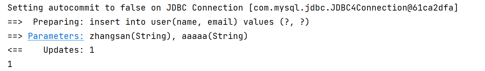
>
>${参数}使用: 字符串拼接, Statement  (存在SQL注入问题)
>
>```java
>int insertUser7(@Param("name") String name, @Param("email") String email);
>
>mapper.insertUser7("zhangsan", "aaaaa");
>```
>
>```xml
><insert id="insertUser7">
>    insert into user(name, email)
>    values ('${name}', '${email}')
></insert>
>```
>
>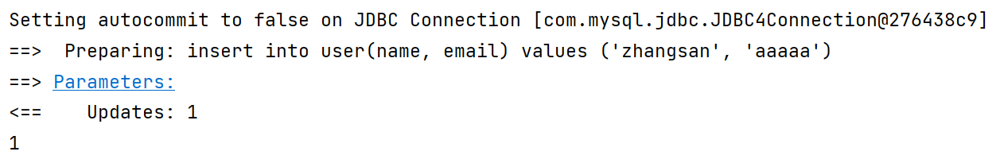


面试可能会问到。 #{}和${}的区别。

#{}是使用的 prapareStatement.首先写SQL，然后使用?来进行占位，最后再把参数设置进去，可以防止SQL注入。

${}是使用的Statement。它是使用的字符串拼接。

### 注意

>````java
>//1, 我们以后开发的时候，应该尽量使用 #{} 去接收传递过来的参数值
>//2, 当我们传递给SQL语句 表名或者是列名的时候，就必须得使用 ${} 来取值。
>````
>
>分表问题: 动态表名 
>
>```java
>// userMapper.dynamicTableName("user2");
>userMapper.dynamicTableName("user");
>```
>
>```java
>List<User> dynamicTableNameList(String user);
>```
>
>```xml
><select id="dynamicTableNameList" resultType="com.snow.www.bean.User">
>	select * from ${user}
></select>
>```
>
>分列问题: 动态列名
>
>```java
>//  List<User> list = userMapper.dynamicColumnName("id");
>List<User> list = userMapper.dynamicColumnName("age");
>```
>
>```java
>List<User> dynamicColumnName(String age);
>```
>
>```xml
><select id="dynamicColumnName" resultType="com.snow.www.bean.User">
>	select * from user order by ${column}
></select>
>```

有一些情景可能会用到 ${},一般不多。


```SQL
select * from user where id = 10;

select * from user1 where id = 10;
select * from user2 where id = 10;
```


```SQL
-- 比如现在你司的用户有1亿个。 
-- 可以将这些表，水平拆分成10个。   如果id是1  ==》  user1
-- 也就是id对10取余。 最终余数是几，就进几表。   id=20054   
-- select * from user where name = "zhangsan"
```

# 输出映射

> 输出映射是指Mybatis是如何把SQL语句执行结果映射为 Java对象的。
>
> ```java
> // 一个参数
> // 多个参数
> // 单个对象
> // 多个对象
> // resultMap: 比较重要(很常用)
> ```

select * from user where id = 1;

## 一条结果

一行一列的结果。返回一个参数。比如根据id找名字。


>一行一列: 必须要有resultType(写简单参数的`全限定类名`或者是`别名`)
>
>```java
>String name = userMapper.selectNameById(5);
>```
>
>```java
>String queryNameById1(Integer id);
>String queryNameById2(Integer id);
>String queryNameById3(Integer id);
>```
>
>```xml
><!-- 我们必须要写一个resultType。标识查询的结果的类型-->
><!-- 对于java.lang.String 。我们既可以写 全限定类名，也可以写string。（别名不区分大小写）-->
><!-- 方式一： 全限定类名-->
><select id="queryNameById1" resultType="java.lang.String">
>        select name
>        from user
>        where id = #{id};
></select>
>
><!-- 方式二： 内置的别名-->
><select id="queryNameById2" resultType="string">
>        select name
>        from user
>        where id = #{id};
></select>
>
><!-- 方式三： 别名不区分大小写-->
><select id="queryNameById3" resultType="String">
>        select name
>        from user
>        where id = #{id};
></select>
>```

## 多条结果

多行一列。比如我们返回的是一个班级的名称列表。比如返回的是账户的所有name。

`select name from user;`

> <span style="color:red">指: 多个结果构成的数组/List/Set</span>
>
> ```java
> // 可以使用  List  Set  数组来接数据。在接口中，使用具体的类型。
> // 在xml中，resultType写单个元素的类型。 比如拿回来是班上人的id，这时候用Integer; 比如拿回来是学生的姓名，这时候用 String
> ```
>
> ```java
> List<String> list = accountMapper.queryAllNameList();
> Set<String> set = accountMapper.queryAllNameSet();
> String[] names = accountMapper.queryAllNameArray();
> ```
>
> ```java
> List<String> queryAllNameList();
> Set<String> queryAllNameSet();
> String[] queryAllNameArray();
> ```
>
> ````xml
> <select id="queryAllNameSet" resultType="java.lang.String">
>     select name
>     from account;
> </select>
> ````

## 单个对象

一行多列。

>单个对象: 
>
>```java
>// 1. Mybatis在去映射的时候，会把`成员变量名` 和`查询结果的列名`去一一映射，假如原始表中的列名和成员变量名不一致的话，我们可以通过取别名的方式来解决(也可以通过resultMap来解决)
>// 2. 在声明JavaBean的成员变量的时候，尽量的使用包装类型
>```
>
>```java
>@Test
>public void testQueryAccountById() {
>    // id name  money存进去。   createTime  updateTime 没有存进去
>    // 因为数据库中的列名和 成员变量名不一样。 所以没映射上。
>    Account account = accountMapper.queryAccountById(2);
>
>    System.out.println(account);
>}
>```
>
>```java
>Account queryAccountById(@Param("id") Integer id);
>```
>
>````xml
><!-- resultType写得是bean的全限定类名。或者是别名-->
><!-- 需要注意。返回的列，需要和bean的成员变量名一致，如果不一致，可以使用取别名的方式解决-->
><select id="queryAccountById" resultType="com.cskaoyan.demo9.bean.Account">
>    select *
>    from account
>    where id = #{id};
></select>
>````

## 多个对象

多行多列。

>多个对象: 数组/List/Set
>
>```java
>//1,  resultType的值是单个元素的类型。
>```
>
>```java
>@Test
>public void testQueryAllUserList(){
>        List<User> users = mapper.queryAllUserList();
>        System.out.println(users);
>}
>```
>
>````java
>// 多行多列，
>// 比如查询一个班级里面的所有学生，在接口中可以使用 List 数组 Set来接。
>// 在mapper.xml的标签中，resultType写单个元素的类型即可
>List<User> queryAllUserList();
>````
>
>```xml
><!-- resultType中是单个元素的类型-->
><select id="queryAllUserList" resultType="com.cskaoyan.demo4.bean.User">
>        select * from user;
>    </select>
>```

## resultMap

>resultMap: 是用来做参数映射的。把数据库中的字段，与实体类中的字段进行映射的。 

如果数据库里的字段，和bean中的对象，名字不一致，有两种解决方法。

- 使用别名

- 使用resultMap。更灵活

>```java
>@Data
>@AllArgsConstructor
>@NoArgsConstructor
>public class StudentDO {
>  	private Integer studentId;
>  	private String studentName;
>  	private Integer studentAge;
>  	private String address;
>}
>
>drop table if exists mybatis_student;
>CREATE TABLE `mybatis_student`  (
>  	`id` int(11) PRIMARY KEY AUTO_INCREMENT,
>  	`name` varchar(255)  ,
>  	`age` int(11)  ,
>  	`address` varchar(255)
>);
>
>insert into mybatis_student(id,name,age,address) values (1, 'zhangsan', 18, 'hubei'),(2, 'lisi', 19, 'hunan'),(3, 'wangwu', 21, 'hubei'),(4, 'zhaoliu', 22, 'beijing');
>```
>
>```java
>List<StudentDO> selectStudentUseAlias();
>```
>
>```java
>List<StudentDO> selectStudentUseResultMap();
>```
>
>```xml
><!-- 方式一: 别名 --> 
><!-- 使用别名的方式来解决， 数据库中的字段和bean中的名称不一致问题。
>   名称不一致会有什么问题： 会查得出来属性，但是数据封装不进去。
>   -->
><select id="queryStudentUseAlias1" resultType="com.cskaoyan.demo4.bean.StudentDO">
>    	select * from mybatis_student;
></select>
>
><!-- 取别名可以解决这个问题。-->
><select id="queryStudentUseAlias2" resultType="com.cskaoyan.demo4.bean.StudentDO">
>    	select id as studentId, name as studentName, age as studentAge, address from mybatis_student;
></select>
>```
>
>```xml
><!-- 方式二: resultMap --> 
><!--resultMap的id属性 和 对应的映射的SQL标签的 resultMap对应-->
><!--resultMap的type属性 指代最终的对象类型-->
><resultMap id="studentResultMap1" type="com.cskaoyan.demo7.bean.StudentDO">
>    	<!-- id主键映射， result： 普通列映射-->
>    	<!-- 在result标签中。  column是数据库的列名， property是成员变量名（bean里面的变量名）-->
>    	<id column="id" property="studentId"/>
>    	<result column="name" property="studentName"/>
>    	<result column="age" property="studentAge"/>
>    	<result column="address" property="address"/>
></resultMap>
>
><!-- 标签需要写resultMap 后面是id值-->
><select id="selectStudentUseResultMap" resultMap="studentResultMap1">
>    	select id, name, age, address from mybatis_student;	
>    </select>
>```

# 插件

## Lombok

>Lombok: 可以帮助代码在编译的时候生成对应的方法。
>
>```java
>// getter
>// setter
>// toString
>// hashCode
>// equals
>```

>第一步: 安装插件
>
>
>
>第二步:  导包
>
>```xml
><dependency>
><groupId>org.projectlombok</groupId>
><artifactId>lombok</artifactId>
><version>1.18.12</version>
></dependency>
>```
>
>打开一个 Annotation  Processors --> Enable annotation processing
>
>第三步: 使用
>
>```java
>//@Getter@Setter@ToString@EqualsAndHashCode
>//@NoArgsConstructor
>//@AllArgsConstructor
>
>// @Data  -->  getter、setter、toString、equals、hashCode
>
>@Data
>@AllArgsConstructor
>@NoArgsConstructor
>public class StudentDO {
>	private Integer studentId;
>	private String studentName;
>	private Integer studentAge;
>	private String address;
>}
>```

>Lombok: 好处
>
>```java
>// 1. 优势
>在去修改（增删改）成员变量的时候，不用我们自己再去生成getter、setter等，效率比较高
>
>// 2. 缺点
> Lombok在项目中，只要有一个人用了，那么其他的组员也都要使用
>```

## MybatisCodeHelperPro

> MybatisCodeHelperPro: 这个是Mybatis的一个插件(提高开发Mybatis应用程序的效率)。
>
> ```java
> // 帮助我们在mapper和mapper.xml 之前来回跳转
> // 可以帮助我们生成mapper.xml文件中的标签
> // 可以做一定的代码提示
> // ...
> ```

>步骤一: 插件安装
>
>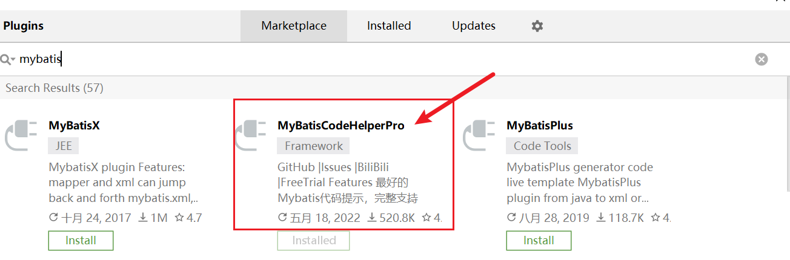

# 动态SQL

> 动态SQL是Mybatis给我们提供的又一个强大的功能。可以帮助我们根据传入的条件，动态的去改变SQL语句。

比如现在要去jd搜索一个手机。下方有大量的条件，比如机身内存，CPU型号，运行内存。等等......

假设有一张手机表，里面存放的全部是手机。 

```SQL
create table phone(
	id int primary key auto_increment,
    name varchar(255),
    brand varchar(255),
    memory int,
    disk int
);

insert into phone values (1, "小米10", "小米", "8", "128"), (2, "OPPO k9x", "OPPO", "8", "128"), (3, "OPPO K10x", "OPPO", "8", "256"), (4, "Redmi Note11", "Redmi", "8", "128"), (5, "荣耀90", "荣耀", "12", "128"), (6, "Redmi Note12", "Redmi", "12", "256");
```

比如筛选框可以随意组合，现在传入了一个品牌：小米。

- 筛选荣耀的手机。 
  - Mapper接口：List<Phone> quryByBrand(String brand);
  - Mapper.xml里面 要写一条SQL
- 筛选小米手机， 机身存储 512.
  - List<Phone> quryByBrandAndDisk(String brand, Integer disk);
- 小米手机，运行内存存储12.
  - List<Phone> quryByBrandAndMemory(String brand, Integer memory);

如果为每一种情况，都写一个接口，写一条SQL。SQL数量会急剧增加。所以需要使用动态SQL，有些情况下增加这种条件，有些条件下增加另外一种条件。


假设有10个筛选条件。 如果我们要用mybatis来完成，要写多少方法，多少SQL。

- 单独选一个条件，我们要写多少方法。要写10个  。 List<Phone> quryByBrand(String brand);
- 单独选两个条件，我们要写多少方法。要写C10 2  = 10*9/2 = 45个  。 List<Phone> quryByBrand(String brand, String memory);

动态SQL，就是根据你传入的条件，比如你传入了品牌，我就给它拼接上去。 没传，就不拼。


select * from phone where name = #{name} and disk = #{disk} and memory = #{memory} ;


```SQL
-- 比如京东的后台有一张手机表。 现在需要根据条件来预测一下，里面有哪些字段。

create table phone(
	id int primary key auto_increment,
    name varchar(255),
    brand varchar(255),
    price decimal(10,2),
    cpu varchar(50),
    disk int,
    memory int
);

-- 想查出荣耀的手机 
select * from phone where brand = '荣耀';


-- 想查出荣耀的手机， 机身内存  1024
select * from phone where brand = '荣耀' and disk=1024;

-- 想查出荣耀的手机， 内存是 16g
select * from phone where brand = '荣耀' and memory=16;


-- 总共有10个条件。   
```


## where

> where这个标签可以帮助我们在最终执行的SQL中自动生成where关键字
>
> ```java
> //1, 可以自动拼接where关键字 (一般和if配合使用)
> //2, 去除直接跟着的and或者是or关键字  
> //3, 如果where标签中没有条件满足的时候（如果SQL片段需要拼接），那么where标签不会给我们拼接where关键字
> 
> // 注意一般if(工作用到更多一些),choose when otherwise(也会用, 用到相对if少一些),都要注意, 尽量写在where标签内部, 因为, 如果根据条件做处理的时候, 没有任何一个条件满足, 如果又使用的where标签(而不是写死的where关键字), 那么最终执行的sql上不会生成where(避免出错)
> ```
>
> ```xml
> <select id="queryAllPhone" resultType="com.cskaoyan.demo5.bean.Phone">
>     select * from phone
>     <where>
>         and id = 1
>     </where>
>    ;
> </select>
> ```
>
> ```xml
> <!-- if标签，只有条件满足，才会拼接进SQL-->
> <select id="queryPhoneByBrandOrDisk" resultType="com.cskaoyan.demo5.bean.Phone">
>     select * from phone
>     <where>
>         <!-- 在if的test中，可以直接使用 输入映射中的参数。比如 brand disk-->
>         <!-- 输入映射可以写什么，在test中就可以写什么。比如有注解  @Param("id") 则可以直接写id。 不用外面的#{}-->
>         <if test="brand != null">
>             brand = #{brand}
>         </if>
> 
>         <!-- 在if中，在test中可以写 ognl。 gt lt gte lte-->
>         <if test="disk != null">
>             and disk = #{disk}
>         </if>
>     </where>
> </select>
> 
> <!-- 如果传入的brand是null，disk是null，则where这个关键字不会被拼接上去-->
> select * from phone;
> 
> ```

## if

> if标签可以帮助我们去做判断是否满足某个条件。如果符合条件，则拼接标签里面的内容；否则，不拼接。在if的条件中，输入映射中可以写什么，if中就可以写什么。
>
> ```JAVA
> // 什么叫做输入映射怎么写， if的test中就怎么写
> Phone queryPhone(@Param("id") Integer id);   ---> 在xml中。  #{id}  test="id"
> Phone queryPhone(@Param("id") Integer id, @Param("name")String name);   ---> 在xml中。  #{id}   test="id"
> Phone queryPhone(Phone phone);   ---> 在xml中。  #{成员变量名}   test="成员变量名" 
> Phone queryPhone(@Param("p1")Phone phone);   ---> 在xml中。  #{p1.成员变量名}  test="p1.id"
> ```
>
> 
>
> ```java
> 		  转义字符     OGNL表达式
> // >      &gt;           gt
> // <      &lt;           lt
> // >=     &gt;=          gte
> // <=     &lt;=          lte
> // !=
> // ==      
> // and
> // or
> 
> ```
>
> ```java
> // 在<if test="">,引号中，我们可以不使用转义字符，可以使用OGNL表达式的写法
> // 在if中，可以使用 > >= ， 但是 < <=这种符号不能使用。所以不推荐大家使用这个
> ```

>代码示例
>
>```xml
><select id="queryPhoneByMemory" resultType="com.cskaoyan.demo5.bean.Phone">
>    select * from phone
>    <where>
>            <!-- memory 小于 8 。就拼接这个if-->
>           <if test="memory &lt; 8">
>                 memory = 8
>           </if>
>           <!-- memory 大于 8，就拼接这个if-->
>             <if test="memory gt 8">
>               and memory = 12
>           </if>
>         </where>
>       ;
></select>
>```

## choose when otherwise

> choose when otherwise就相当于Java中的 if ..else if.. else....
>
> 和where一起使用
>
> ```java
> //  如果传入的id大于5，就按传入的id查询； 否则根据传入的memory 是否等于8，等于8，就按照memory查询；
> //  否则根据disk来进行匹配
> List<Phone> queryByChooseWhenOtherwise(@Param("id") Integer id, @Param("memory") Integer memory, @Param("disk") Integer disk);
> ```
>
> ```xml
> <select id="queryByChooseWhenOtherwise" resultType="com.cskaoyan.demo5.bean.Phone">
>  <!--        //  如果传入的id大于5，就按传入的id查询； 否则根据传入的memory 是否等于8，等于8，就按照memory查询；-->
>  <!--    //  否则根据disk来进行匹配-->
>  select *
>  from phone
>  <where>
>      <choose>
>          <when test="id &gt; 5">
>              id = #{id}
>          </when>
>          <when test="memory == 8">
>              memory = #{memory}
>          </when>
>          <otherwise>
>              disk =#{disk}
>          </otherwise>
>      </choose>
>  </where>;
> </select>
> 
> 
> 就是 if   else-if   else的场景。
> ```


## sql-include

将一些公用的SQL，抽取出来。在其他需要使用的地方，可以直接引入这个公用SQL

一般都是用来提取一些公共列，然后再引入。 


> 这是两个标签，配合起来一起使用的。
>
> ```java
> // sql标签可以帮助我们把公共的sql提取出来
> // include可以帮助我们引入公共的sql片段。
> ```
>
> 提取
>
> ```xml
> <!-- 相当于定义了一个变量，叫做 base_sql  内容是标签内的内容-->
> <sql id="base_sql">
>     select id, name, brand, memory, disk
>     from phone
> </sql>
> ```
>
> 引入
>
> ```xml
> <select id="queryPhoneById" resultType="com.cskaoyan.demo5.bean.Phone">
>     <!-- 可以使用include标签，将定义好的引入进来-->
>     <include refid="base_sql"/>
>     where id = #{id}
> </select>
> ```
>
> ```xml
> <select id="queryAllPhone" resultType="com.cskaoyan.demo5.bean.Phone">
>     <include refid="base_sql"/>
>     <where>
>         and id = 1
>     </where>;
> </select>
> ```
>
> ```java
> // 优点：可以提取公共的sql片段，减少编码量。 防止数据库增加字段后，全部SQL需要修改
> // 缺点：用了sql-include 之后，SQL语句的可读性变差了
> ```

<span style='color:red;background:yellow;'>**sql-include 标签我们一般用来提取 列名。**</span>

> 提取
>
> ```xml
> <sql id="base_column">
>      id, name, brand, memory, disk
> </sql>
> ```
>
> 引入
>
> ```xml
> <select id="queryPhoneById" resultType="com.cskaoyan.demo5.bean.Phone">
>      <!-- 可以使用include标签，将定义好的引入进来-->    
>      select 
>      <include refid="base_column" />
>      from phone 
>        where id = #{id}
>  </select>
> ```
> 
>好处分析
> 
>```java
> // 避免写select *。不要写select * 
> // 不破坏SQL语句的可读性
> // 防止数据库增加字段后，全部SQL需要修改
> ```

## trim

>trim标签可以帮助我们动态的去增加指定的字符，或者是删除指定的字符。
>
>```java
>@Test
>public void testUpdatePhone(){
>    Phone phone = new Phone();
>    phone.setId(22);
>    phone.setMemory(16);
>
>    int i = mapper.updatePhone(phone);
>    System.out.println(i);
>}
>```
>
>````java
>int updatePhone(Phone phone);
>````
>
>```xml
><!--
>prefix: 增加指定的前缀
>suffix: 增加指定的后缀
>prefixOverrides: 删除指定的前缀
>suffixOverrides: 删除指定的后缀
>-->
>```
>
>````xml
><update id="updateByPhone">
>update phone set
><!-- 会把包裹着的块，prefix/suffix prefixOverrides/suffixOverrides -->
><trim suffixOverrides="," >
>   <if test="brand != null">
>       brand = #{brand},
>   </if>
>   <if test="memory != null">
>       memory = #{memory},
>   </if>
>   <if test="disk != null">
>       disk = #{disk}
>   </if>
></trim>
>where id = #{id}
></update>
>````
>

## set

> <set> 就相当于 <trim prefix="SET" suffixOverrides=",">  这个配置，和这个是等价的。
>
> ````java
> // 去除set标签中的最后一个 ","
> // 拼接set关键字
> ````
>
> ```java
> @Test
> public void testTrim() {
>     Phone phone = new Phone();
>     phone.setId(5);
>     phone.setBrand("honor");
>     phone.setMemory(12);
>     phone.setDisk(256);
> 
>     int i = mapper.updateByPhone(phone);
>     System.out.println(i);
> }
> ```
>
> ```java
> int updateByPhone(Phone phone);
> ```
>
> ```xml
> <update id="updateByPhone">
>     update phone
> 
>     <set>
>         <if test="brand != null">
>             brand = #{brand},
>         </if>
>         <if test="memory != null">
>             memory = #{memory},
>         </if>
>         <if test="disk != null">
>             disk = #{disk}
>         </if>
>     </set>
>     where id = #{id}
> </update>
> ```


## <span style=color:red;background:yellow>**foreach**</span>

> foreach可以帮助我们去循环处理SQL语句。

## 批量插入

> foreach在插入的使用
>
> ```java
> // 当个方法中传入的参数没有注解的时候，假如传入的List，那么就可以使用 list，假如传入的是数组，那么就可以使用 array
> // 当方法中传入的参数有注解的时候，collection里面必须写注解的值
> ```
>
> **List类型参数**
>
> 没有注解,  foreach的循环从插入的时候,  要求foreach标签的 collection参数, 是collection  (如果List对象建议写list)
>
> ```java
> List<Phone> phones = new ArrayList<>();
>  phones.add(new Phone(null, "huawei mate50", "huawei", 8, 128));
>  phones.add(new Phone(null, "huawei mate40", "huawei", 8, 256));
> 
> int i = mapper.insertPhoneList(phones);
> System.out.println(i);
> ```
>
> ```java
> int insertPhoneList(List<Phone> phones);
> ```
>
> ```xml
> <insert id="insertPhoneList">
>  <!-- insert into phone(id, name, brand, memory, disk) values (?, ?, ?, ?, ?) , (?, ?, ?, ?, ?) -->
> 
>  insert into phone(id, name, brand, memory, disk) values
>  <!-- foreach遍历传入的集合；
>      separator：循环的时候，以什么字符分割开
>      open：在循环开始的时候，添加指定的字符
>      close：在循环结束的时候，添加指定的字符
>      item：循环中的元素名 相当于 for(int i=0;i<100;i++) {}  中的 i
>      index: 元素的下标. index=“index1”代表使用一个叫做index1的变量将它存起来，在循环内部，就可以使用这个index1
>      -->
>  <foreach collection="list" item="phone" separator=","
>           open="" close="" index="index1">
>      (#{phone.id}, #{phone.name}, #{phone.brand},
>      #{phone.memory}, #{index1})
>  </foreach>
> </insert>
> ```
>
> **数组类型参数**
>
> 没有注解,  foreach的循环从插入的时候,  要求foreach标签的 collection参数,<span style=color:red;background:yellow>**必须是array**</span>
>
> ```java
> @Test
> public void testInsertArray() {
>  Phone[] phones = new Phone[2];
>  phones[0] = new Phone(null, "huawei mate50", "huawei", 8, 128);
>  phones[1] = new Phone(null, "huawei mate40", "huawei", 8, 256);
> 
>  int i = mapper.insertPhoneArray(phones);
>  System.out.println(i);
> }
> ```
>
> ```java
> int insertPhoneArray(Phone[] phones);
> ```
>
> ```xml
> <insert id="insertPhoneArray">
>  insert into phone(id, name, brand, memory, disk) values
>  <foreach collection="array" item="phone" separator=","
>           open="" close="" index="index1">
>      (#{phone.id}, #{phone.name}, #{phone.brand},
>      #{phone.memory}, #{index1})
>  </foreach>
> </insert>
> ```
>
> **添加注解**
>
> 如果在使用foreach的循环从插入的时候,  要求foreach标签的 collection参数, <span style=color:red;background:yellow>**必须是注解名**</span>
>
> ```java
> @Test
> public void testInsertArray() {
>  Phone[] phones = new Phone[2];
> 
>  phones[0] = new Phone(null, "huawei mate50", "huawei", 8, 128);
>  phones[1] = new Phone(null, "huawei mate40", "huawei", 8, 256);
> 
>  int i = mapper.insertPhoneArray(phones);
>  System.out.println(i);
> }
> 
> @Test
> public void testInsertArrayParam() {
>  List<Phone> phones = new ArrayList<>();
> 
>  phones.add(new Phone(null, "huawei mate50 ListParam", "huawei", 8, 128));
>  phones.add(new Phone(null, "huawei mate40 ListParam", "huawei", 8, 256));
> 
>  int i = mapper.insertPhoneListParam(phones);
>  System.out.println(i);
> }
> ```
>
> ```java
> int insertPhoneArrayParam(@Param("phones") Phone[] phones);
> int insertPhoneListParam(@Param("phones") List<Phone> phones);
> ```
>
> ```xml
> <insert id="insertPhoneArrayParam">
>  insert into phone (id,name,brand,memory,disk) values
>  <foreach collection="phones" open=""
>           close="" separator="," item="phone">
>      (#{phone.id}, #{phone.name}, #{phone.brand},
>      #{phone.memory}, #{phone.disk})
>  </foreach>
> </insert>
> 
> <insert id="insertPhoneListParam">
>  insert into phone (id,name,brand,memory,disk) values
>  <foreach collection="phones" open=""
>           close="" separator="," item="phone">
>      (#{phone.id}, #{phone.name}, #{phone.brand},
>      #{phone.memory}, #{phone.disk})
>  </foreach>
> </insert>
> ```

## <span style=color:red;background:yellow>**使用in查询**</span>

>foreach在查询时候的使用: 
>
>注意: foreach collection在不使用注解情况下, 默认集合类使用collection (List建议使用List),  数组使用array
>
>如果参数使用了注解, foreach 标签的collection属性使用注解名
>
>```java
>@Test
>public void testQueryByIdList(){
>    	List<Phone> phones = mapper.queryPhoneByIdList(Arrays.asList(1,2,3));
>    	System.out.println(phones);
>}
>```
>
>```java
>List<Phone> queryPhoneByIdList(@Param("list") List<Integer> list);
>```
>
>```xml
><select id="queryPhoneByIdList" resultType="com.cskaoyan.demo5.bean.Phone">
>    select *
>    from phone
>    <where>
>           id in
>             <foreach collection="list" separator="," open="(" close=")" item="id">
>               #{id}
>           </foreach>
>         </where>
>     </select>
>     ```


## selectKey

> 这个标签可以帮助我们在执行目标SQL语句之前或者是之后执行一条额外的SQL语句。有自动生成id的场景下，我们需要知道自动生成的id是多少。
>
> **AFTER操作**
>
> ```java
> @Test
> public void testInsertPhone(){
>     Phone phone = new Phone();
>     phone.setName("iphone13");
>     phone.setBrand("Apple");
>     int i = mapper.insertPhone(phone);
>
>     System.out.println(phone);
> }
> ```
>
> ```java
>  int insertPhone(@Param("phone") Phone phone);
> ```
>    
>    ```xml
>    <insert id="insertPhone">
>        <!--order: 表示在目标SQL执行之前或者是之后执行 AFTER | BEFORE
>              keyProperty： 表示执行的结果映射到哪个参数中
>              resultType: SQL语句返回的类型 -->
>        <selectKey order="AFTER" keyProperty="phone.id" resultType="Integer">
>            select LAST_INSERT_ID();
>        </selectKey>
>    
>        insert into phone(name, brand, memory, disk) values( #{phone.name},
>        #{phone.brand}, #{phone.memory}, #{phone.disk})
>      </insert>
>    ```
>    


## useGeneratedKeys

>useGeneratedKeys:  获取insert/update操作数据的主键
>
>```java
>开启配置：useGeneratedKeys="true" 
>映射到对应的参数中：keyProperty="order.id"
>```
>
>```java
>@Test
>public void testInsertPhone2(){
>    	Phone phone = new Phone();
>    	phone.setName("iphone14");
>    	phone.setBrand("Apple");
>
>    	// 手机的id，会被存到原对象的id中
>    	int affectedRows = mapper.insertPhone2(phone);
>    	System.out.println(phone);
>}
>```
>
>```java
>int insertPhone2(@Param("phone") Phone phone);
>    ```
>    
>     ```xml
>     <insert id="insertPhone2" useGeneratedKeys="true" keyProperty="phone.id">
>         insert into phone(id, name, brand, memory, disk)
>         values (#{phone.id}, #{phone.name},
>         #{phone.brand}, #{phone.memory}, #{phone.disk})
>     </insert>
>     ```


# 多表查询

## 一对一结构

>结构示例
>
>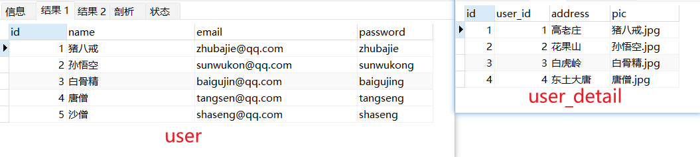
>
>```sql
>drop table if exists user;
>create table user(
>	id int primary key auto_increment,
>	name varchar(255),
>	email varchar(255),
>	password varchar(255)
>     );
>
>drop table if exists user_detail;
>create table user_detail(
>	id int primary key auto_increment,
>    user_id int,
>	address varchar(255),
>	pic varchar(255)
>);
>
>insert into user values (1, "猪八戒","zhubajie@qq.com", "zhubajie");
>insert into user values (2, "孙悟空","sunwukon@qq.com", "sunwukong");
>insert into user values (3, "白骨精","baigujin@qq.com" ,"baigujing");
>insert into user values (4, "唐僧",  "tangsen@qq.com" , "tangseng");
>insert into user values (5, "沙僧", "shaseng@qq.com", "shaseng");
>
>select * from user;
>
>insert into user_detail values(null, 1, "高老庄", "猪八戒.jpg");
>insert into user_detail values(null, 2, "花果山", "孙悟空.jpg");
>insert into user_detail values(null, 3, "白虎岭", "白骨精.jpg");
>insert into user_detail values(null, 4, "东土大唐", "唐僧.jpg");
>
>select * from user_detail;
>```
>
>```java
>@Data
>@NoArgsConstructor
>@AllArgsConstructor
>public class User {
>    	private Integer id;
>    	private String name;
>    	private String email;
>    	private String password;
>
>    	private UserDetail userDetail;
>}
>
>@Data
>@NoArgsConstructor
>@AllArgsConstructor
>public class UserDetail {
>    	private Integer id;
>    	private Integer userId;
>    	private String address;
>    	private String pic;
>}
>```

### 方式一: 分次查询

>测试
>
>```java
>@Test
>public void testQueryOne2One() {
>        List<User> users = mapper.queryAllUser();
>    	for (User user : users) {
>     	   System.out.println(user);
>    	}
>}
>```
>
>TableMapper接口
>
>```java
>List<User> queryAllUser();
>```
>
>UserMapper.xml文件
>
>```xml
>    <mapper namespace="com.cskaoyan.demo9.mapper.UserMapper">
>       <resultMap id="baseUserMap" type="com.cskaoyan.demo9.bean.User">
>             <id column="id" property="id"/>
>             <result column="name" property="name"/>
>             <result column="email" property="email"/>
>             <result column="password" property="password"/>
>     
>         <!-- association: 关联单个bean的时候，使用
>             property: 成员变量的名字
>             javaType: 成员变量的类型
>             select: 第二条SQL执行时，SQL的坐标.
>             如果两条SQL在一个mapper.xml中，可以不写namespace。
>             如果不在一个mapper.xml中，需要写namespace
>             column: 第二条SQL，传递的参数
>        -->
>   
>             <association property="userDetail" javaType="com.cskaoyan.demo9.bean.UserDetail"
>                          column="id"
>                          select="com.cskaoyan.demo9.mapper.UserDetailMapper.queryUserDetailByUserId"/>
>         </resultMap>
>     
>        <select id="queryAllUser" resultMap="baseUserMap">
>            select * from user;
>         </select>
>     </mapper>
>    ```
>
>UserDetailMapper.xml文件
>
>```xml
><mapper namespace="com.cskaoyan.demo9.mapper.UserDetailMapper">
><select id="queryUserDetailByUserId" resultType="com.cskaoyan.demo9.bean.UserDetail">
>       select *
>             from user_detail
>             where user_id = #{userId};
>         </select>
>     </mapper>
>     ```

### 方式二: 连接查询

>测试
>
>```java
>@Test
>public void testQueryOne2One2(){
>    List<User> users = mapper.queryAllUser2();
>    for (User user : users) {
>        System.out.println(user);
>    }
>}
>```
>
>UserMapper接口
>
>```java
>List<User> queryAllUser2();
>```
>
>UserMapper.xml
>
>```xml
><resultMap id="baseUserMap2" type="com.cskaoyan.demo9.bean.User">
>    <id column="id" property="id"/>
>    <result column="name" property="name"/>
>    <result column="email" property="email"/>
>    <result column="password" property="password"/>
>
>    <association property="userDetail"
>                 javaType="com.cskaoyan.demo9.bean.UserDetail">
>        <id column="ud_id" property="id"/>
>        <result column="pic" property="pic"/>
>        <result column="user_id" property="userId"/>
>        <result column="address" property="address"/>
>    </association>
></resultMap>
>
><select id="queryAllUser2" resultMap="baseUserMap2">
>    select u.id       as id
>    , u.name     as name
>    , u.email    as email
>    , u.password as password
>    , ud.id      as ud_id
>    , ud.pic     as pic
>    , ud.user_id as user_id
>    , ud.address as address
>    from user u
>    left join user_detail ud on u.id =
>    ud.user_id;
></select>
>
>```


## 一对多结构

>结构示例
>
>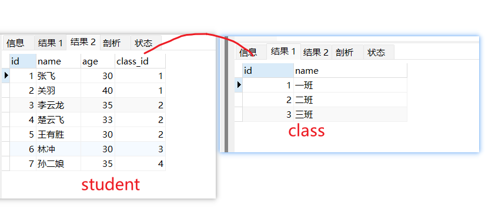
>
>```sql
>drop table if exists student;
>drop table if exists class;
>
>create table class(
>	id int primary key auto_increment,
>	name varchar(200)
>);
>
>create table student(
>	id int primary key auto_increment,
>	name varchar(200),
>	age int,
>	class_id int
>);
>
>insert into class values(1,"一班");
>insert into class values(2,"二班");
>insert into class values(3,"三班");
>
>insert into student values(1, "张飞", 30, 1);
>insert into student values(2, "关羽", 40, 1);
>insert into student values(3, "李云龙", 35, 2);
>insert into student values(4, "楚云飞", 33, 2);
>insert into student values(5, "王有胜", 30, 2);
>insert into student values(6, "林冲", 30, 3);
>insert into student values(7, "孙二娘", 35, 4);
>
>select * from class;
>select * from student;
>```
>
>```java
>@Data
>@NoArgsConstructor
>@AllArgsConstructor
>public class Clazz {
>private Integer id;
>private String className;
>
>private List<Student> studentList;
>}
>
>
>@Data
>@NoArgsConstructor
>@AllArgsConstructor
>public class Student {
>private Integer id;
>private String name;
>private Integer age;
>private Integer classId;
>}
>
>```

### 方式一: 分次查询

>测试
>
>```java
>@Test
>public void test1() {
>    List<Clazz> clazzes = mapper.queryAllClazz();
>    for (Clazz clazz : clazzes) {
>        System.out.println(clazz);
>    }
>}
>```
>
>ClazzMapper接口
>
>```xml
>List<Clazz> queryAllClazz();
>```
>
>ClazzMapper.xml
>
>```xml
><resultMap id="baseClazzMap" type="com.cskaoyan.demo9.bean.Clazz">
>    <id column="id" property="id"/>
>    <result column="name" property="name"/>
>    <!--collection: 关联的是集合，用collection
>           property：成员变量的名字
>           ofType：集合中单个元素的类型
>           select: 关联的SQL语句坐标
>           column: 列名 -->
>
>    <collection property="studentList"
>                ofType="com.cskaoyan.demo9.bean.Student"
>                select="com.cskaoyan.demo9.mapper.StudentMapper.queryStudentListByClassId"
>                column="id">
>    </collection>
></resultMap>
>
><select id="queryAllClazz" resultMap="baseClazzMap">
>    select *
>    from class;
></select>
>```
>
>StudentMapper.xml文件
>
>```xml
><resultMap id="baseResultMap" type="com.cskaoyan.demo9.bean.Student">
>    <id column="id" property="id"/>
>    <result column="name" property="name"/>
>    <result column="age" property="age"/>
>    <result column="class_id" property="classId"/>
></resultMap>
>
><select id="queryStudentListByClassId" resultMap="baseResultMap">
>    select *
>    from student
>    where class_id = #{classId};
></select>
>```

### 方式二: 连接查询

>测试
>
>```java
>@Test
>public void test2(){
>    List<Clazz> clazzes = mapper.queryAllClazz2();
>    for (Clazz clazz : clazzes) {
>        System.out.println(clazz);
>    }
>}
>```
>
>ClazzMapper接口
>
>```java
>List<Clazz> queryAllClazz2();
>```
>
>TableMapper.xml
>
>```xml
><resultMap id="baseResultMap2" type="com.cskaoyan.demo9.bean.Clazz">
>    <id column="id" property="id"/>
>    <result column="name" property="name"/>
>    <collection property="studentList" ofType="com.cskaoyan.demo9.bean.Student">
>        <id column="s_id" property="id"/>
>        <result column="s_name" property="name"/>
>        <result column="s_age" property="age"/>
>        <result column="s_class_id" property="classId"/>
>    </collection>
></resultMap>
>
><select id="queryAllClazz2" resultMap="baseResultMap2">
>    select c.id,
>    c.name,
>    s.id       as s_id,
>    s.name     as s_name,
>    s.age      as s_age,
>    s.class_id as s_class_id
>    from class c
>    left join student s on c.id = s.class_id;
></select>
>```

 

## 多对多结构

>结构示例
>
>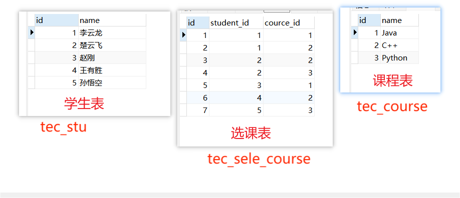
>
>```sql
>drop table if exists tec_stu;
>drop table if exists tec_course;
>drop table if exists tec_sele_course;
>
>create table tec_stu(
>	id int primary key auto_increment,
>    	name varchar(200)
>);
>
>create table tec_course(
>	id int primary key auto_increment,
>    name varchar(200)
>);
>
>-- 选课表
>create table tec_sele_course(
>	id int primary key auto_increment,
>    student_id int,
>    course_id int
>);
>
>insert into tec_stu values (1, "李云龙");
>insert into tec_stu values (2, "楚云飞");
>insert into tec_stu values (3, "赵刚");
>insert into tec_stu values (4, "王有胜");
>insert into tec_stu values (5, "孙悟空");
>
>insert into tec_course values (1, "Java");
>insert into tec_course values (2, "C++");
>insert into tec_course values (3, "Python");
>
>insert into tec_sele_course(student_id, course_id) values (1,1);
>insert into tec_sele_course(student_id, course_id) values (1,2);
>insert into tec_sele_course(student_id, course_id) values (2,2);
>insert into tec_sele_course(student_id, course_id) values (2,3);
>insert into tec_sele_course(student_id, course_id) values (3,1);
>insert into tec_sele_course(student_id, course_id) values (4,2);
>insert into tec_sele_course(student_id, course_id) values (5,3);
>
>select * from tec_stu;
>select * from tec_course;
>select * from tec_sele_course;
>```
>


```JAVA
@Data
public class TecCourse {
    private Integer id;
    private String name;

    List<TecStu> studentList;
}


@Data
public class TecStu {
    private Integer id;
    private String name;
}
```


### 方式一: 分次查询

> 根据用户的名字查询出用户信息以及用户对应购买的商品信息。
>
> 测试
>
> ```java
> @Test
> public void testQueryAllCourses1() {
>     List<TecCourse> tecCourses = mapper.queryAllCourses2();
> 
>     for (TecCourse tecCours : tecCourses) {
>         System.out.println(tecCours);
>     }
> }
> ```
>
> Mapper接口
>
> ```java
> List<TecCourse> queryAllCourses1();
> ```
>
> Mapper.xml
>
> ```xml
> <select id="queryByCourseId" resultType="com.cskaoyan.demo11.bean.TecStudent">
>     select s.id,s.name from tec_sele_course sc left join tec_stu s on sc.student_id = s.id
>     where sc.course_id = #{courseId}
> </select>
> 
> 
> <resultMap id="baseCourseResultMap1" type="com.cskaoyan.demo11.bean.TecCourse">
>     <id column="id" property="id"/>
>     <result column="name" property="name"/>
>     <collection property="students" ofType="com.cskaoyan.demo11.bean.TecStudent"
>                 column="id"
>                 select="com.cskaoyan.demo11.mapper.TecStudentMapper.queryByCourseId">
>     </collection>
> </resultMap>
> 
> <select id="queryAllCourses1" resultMap="baseCourseResultMap1">
>     select id, name
>     from tec_course;
> </select>
> ```

### 方式二: 连接查询

>测试
>
>```java
>@Test
>public void testQueryAllCourses2() {
>    List<TecCourse> tecCourses = mapper.queryAllCourses2();
>
>    for (TecCourse tecCours : tecCourses) {
>        System.out.println(tecCours);
>    }
>}
>```
>
>Mapper接口
>
>```java
>List<TecCourse> queryAllCourses2();
>```
>
>Mapper.xml
>
>```xml
><resultMap id="baseCourseResultMap2" type="com.cskaoyan.demo11.bean.TecCourse">
>    <id column="c_id" property="id"/>
>    <result column="c_name" property="name"/>
>    <collection property="students" ofType="com.cskaoyan.demo11.bean.TecStudent">
>        <id column="s_id" property="id"/>
>        <result column="s_name" property="name"/>
>    </collection>
></resultMap>
>
><select id="queryAllCourses2" resultMap="baseCourseResultMap2">
>    select c.id as c_id, c.name as c_name, s.id as s_id, s.name as s_name
>    from tec_course c
>    left join tec_sele_course sc on c.id = sc.course_id
>    left join tec_stu s on sc.student_id = s.id;
></select>
>```


# 懒加载

> 懒加载和MyBatis缓存作为了解, 知道是怎么回事, 面试的时候可以谈一谈思想即可, 因为工作中并不会使用(基本不会使用)
>
> 懒加载又叫做延迟加载。
>
> ```java
> // 是指在Mybatis进行分次查询的时候，假如第二次查询的内容没有被使用到的话，那么就不去执行第二次查询的SQL语句，等到用到第二次查询的内容的时候再去执行第二条SQL语句。
> ```
>
> 注意:
>
> ```java
> // 1. 当局部开关配置的时候，以局部开关的配置为准
> // 2. 当局部开关没有配置的时候，以总开关的配置为准
> // 3. 当总开关也没有配置的时候，以默认配置为准（默认配置是关闭懒加载）
> ```

>总开关配置: mybatis的主配置文件里面的settings里面
>
>```xml
><settings>
>    <!-- 懒加载 true: 表示开启  false:默认值，表示关闭 --> 
>    <setting name="lazyLoadingEnabled" value="true"/>
></settings>
>```
>
>案例
>
>```java
>// 测试
>List<User> list = mapper.selectUserGoodsListByName("天明");
>```
>
>```java
>// Mapper接口
>List<User> selectUserGoodsListByName(String name);
>```
>
>Mapper.xml
>
>```xml
><select id="selectUserGoodsListByName" resultMap="baseMap5">
>    select id,  user_name  from user where user_name = #{name}
></select>
><resultMap id="baseMap5" type="bean.User">
>    <id column="id" property="id"/>
>    <result column="user_name" property="userName"/>
>    <collection property="goodsList"
>                ofType="bean.Goods"
>                select="selectGoodsListByUserId"
>                column="id"/>
></resultMap>
>
><select id="selectGoodsListByUserId" resultType="bean.Goods">
>    select g.id , g.goods_name as goodsName
>    from `order` o left join goods g on g.id = o.goods_id
>    where o.user_id = #{id}
></select>  
>```

>局部开关
>
>```xml
> <!-- fetchType: eager关闭/lazy开启 -->
><resultMap id="baseMap5" type="bean.User">
>    <id column="id" property="id"/>
>    <result column="user_name" property="userName"/>
>    <collection property="goodsList"
>                ofType="bean.Goods"
>                select="selectGoodsListByUserId"
>                fetchType="lazy"
>                column="id"/>
></resultMap>
>```
>
>注意：idea的Debug模式下不能复现懒加载，因为debug模式会显示出对象中的所有的信息，相当于已经用到了第二次SQL语句查询的内容，所以第二次SQL语句就会立马执行

# 缓存

> 缓存是指在Mybatis中，单独开辟一块内存空间（map），来存储查询的信息。后续假如再次调用了到了同样的查询，那么就直接查询缓存。
>
> `MyBatis默认开启了缓存`
>
> ```java
> MyBatis是怎么存储缓存的: 在MyBatis中缓存是以Map(集合类容器)接口存储的
> // map：
> //  	key：SQL语句和查询的条件(注意: SQL语句是依赖于坐标的)				
> //							 (MapperID+Sql+所有的入参)
> // 		value：查询的结果
> ```


缓存： 查数据，会从数据库中查（磁盘上）。速度比较慢。 缓存就是把数据存储在内存上，特点快。 

为什么不把数据全部存储在内存上，这样速度快。   数据安全问题，有可能程序跑着跑着，电脑挂了。

Map.。    key-value . 


### 一级缓存

> <span style='color:red;background:yellow;'>**一级缓存是一个以SqlSession管理的Mapper级别的缓存**</span>。缓存的内容存储在SQLSession中管理。
>
> 一定要通过同一个SqlSession获取出来的Mapper，才会走缓存。
>
> 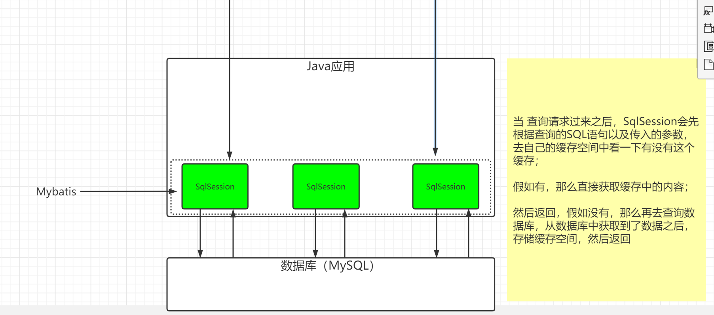

> 配置：一级缓存默认是开启的，并且没有提供开关给用户关闭(不可以关闭)。
>
> ```java
> 一级缓存什么时候失效呢？
> //  	SqlSession关闭的时候
> //      SqlSession调用增删改的时候,会清空当前SqlSession缓存
> // 		SqlSession调用commit方法
> ```

#### 测试

> 同一个SqlSession 获取的同一个Mapper: 走缓存
>
> ```java
> @Test
> public void testQueryByOneMapper1() {
>     SqlSession sqlSession = MybatisUtil.getSqlSession(true);
>     StudentMapper mapper = sqlSession.getMapper(StudentMapper.class);
> 
>     Student student = mapper.queryStudentByPrimaryKey(1);
> 
>     // 根据同一个Mapper。会走缓存
>     Student student1 = mapper.queryStudentByPrimaryKey(1);
>     Student student2 = mapper.queryStudentByPrimaryKey(1);
> 
>     System.out.println(student);
>     // 参数不同，不会走缓存
>     Student student5 = mapper.queryStudentByPrimaryKey(2);
>     System.out.println(student5);
> }
> ```
>
> 同一个SQLSession获取不同的的mapper: 走缓存
>
> ```java
> @Test
> public void testQueryByTwoMapper1() {
>     SqlSession sqlSession = MybatisUtil.getSqlSession(true);
> 
>     // 同一个SqlSession获取的不同Mapper。会走缓存
>     StudentMapper mapper = sqlSession.getMapper(StudentMapper.class);
>     Student student = mapper.queryStudentByPrimaryKey(1);
> 
>     StudentMapper mapper2 = sqlSession.getMapper(StudentMapper.class);
>     Student student1 = mapper2.queryStudentByPrimaryKey(1);
> }
> ```
>
> 不同SQLSession获取同一种的mapper: 不走缓存
>
> ```java
> @Test
> public void testQueryByTwoSqlSession() {
>     SqlSession sqlSession = MybatisUtil.getSqlSession(true);
>     SqlSession sqlSession2 = MybatisUtil.getSqlSession(true);
> 
>     // 不同SqlSession获取的Mapper。不会走缓存
>     StudentMapper mapper = sqlSession.getMapper(StudentMapper.class);
>     StudentMapper mapper2= sqlSession2.getMapper(StudentMapper.class);
> 
> 
>     Student student = mapper.queryStudentByPrimaryKey(1);
>     Student student2 = mapper2.queryStudentByPrimaryKey(1);
> }
> ```


### 二级缓存

> <span style='color:red;background:yellow;'>**二级缓存是一个NameSpace级别（mapper.xml）的缓存**</span>，每一个NameSpace都有自己的单独的缓存空间。(要通过两级配置开启)

> 配置1：总开关
>
> ```xml
> <!-- 二级缓存开关配置 -->
> <setting name="cacheEnabled" value="true"/>
> ```
>
> 配置2: 局部开关
>
> 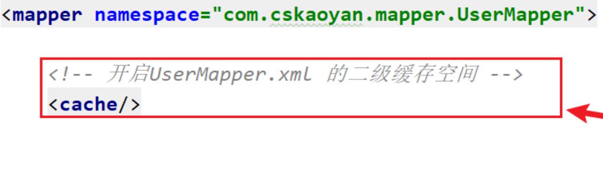

><span style="color:red">需要对二级缓存的缓存的所有相关对象实现序列化接口</span>
>
>开启自动生成序列化id
>
>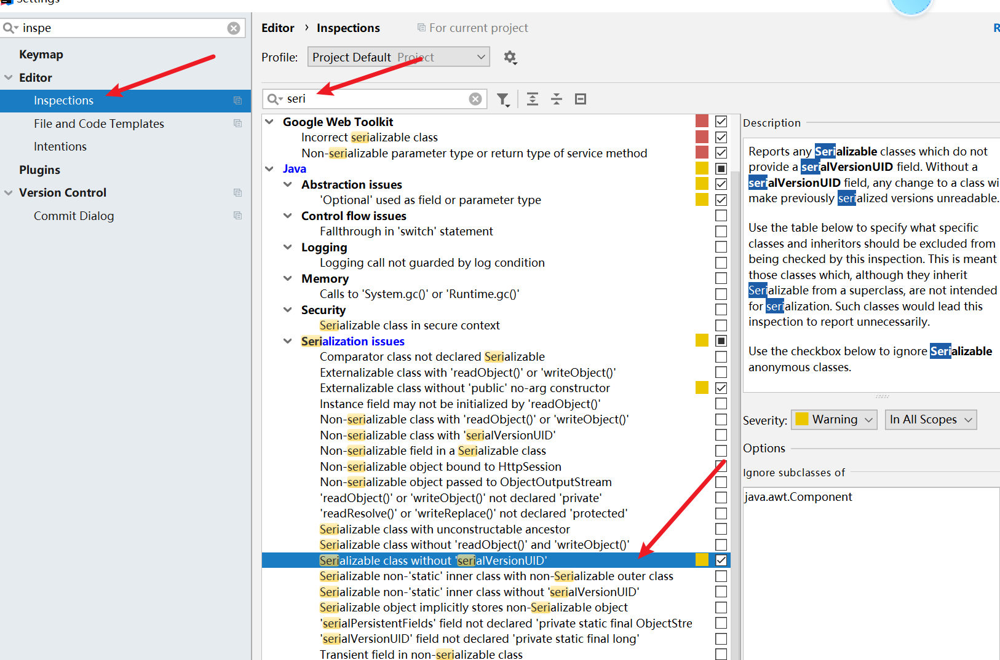
>
>实现序列化接口，生成序列化id
>
>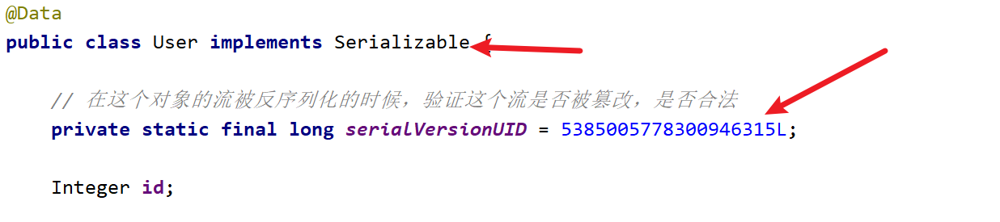

>```java
>// 1, 二级缓存是 namespace级别/Mapper级别 的缓存
>// 2, 多个SqlSession可以共用二级缓存(同一个Mapper)
>// 3, 在关闭sqlsession后(close);  才会把该sqlsession一级缓存中的数据添加到对应namespace的二级缓存中。
>// 4, 当Mybatis默认先查询二级缓存，二级缓存中无对应数据，再去查询一级缓存，一级缓存中也没有，最后去数据库查找。
>```
>
>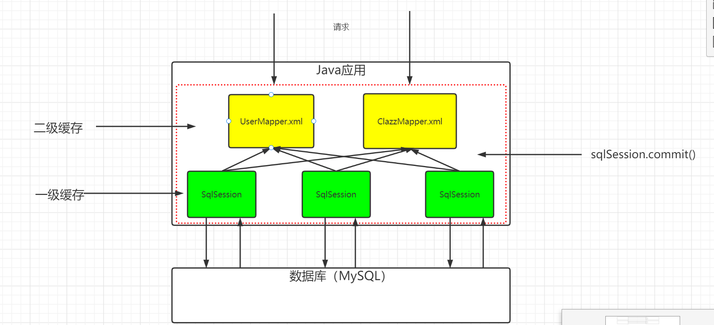

#### 测试

>测试
>
>```java
>@Test
>public void testQueryTwoLevelCache() {
>    SqlSession sqlSession = MybatisUtil.getSqlSession(true);
>    SqlSession sqlSession2 = MybatisUtil.getSqlSession(true);
>
>    // 不同SqlSession获取的Mapper。不会走缓存
>    StudentMapper mapper = sqlSession.getMapper(StudentMapper.class);
>    StudentMapper mapper2 = sqlSession2.getMapper(StudentMapper.class);
>
>    Student student = mapper.queryStudentByPrimaryKey(1);
>    Student student2 = mapper2.queryStudentByPrimaryKey(1);
>
>    // 二级缓存是在namespace级别下的缓存
>    // 只有close后，才会把数据添加进二级缓存
>    sqlSession.close();
>
>    Student student1 = mapper2.queryStudentByPrimaryKey(1);
>    System.out.println(student1);
>
>}
>```

> 二级缓存有没有用呢？
>
> - 其实有一定的作用，但是也有一定的缺陷
>
>   - 确实能够提高Mybatis的性能
>   - 不能完美的解决脏数据的问题
>   - 二级缓存空间对于用户来说是完全透明的，我们用户不能够直接的去操作它，也不能够让用户指定去查询数据库还是查询缓存，所以其实使用起来不太方便
>
>   在以后的工作中，有一些需要使用缓存的场景，那么这个时候我们不会考虑使用Mybatis给我们提供的缓存，取而代之的是使用我们的NoSQL数据库（Redis）。


如果mybatis有缓存。mybatis给我的数据，是数据库提供的数据，还是缓存拿出来的。 

我们不清楚。 

