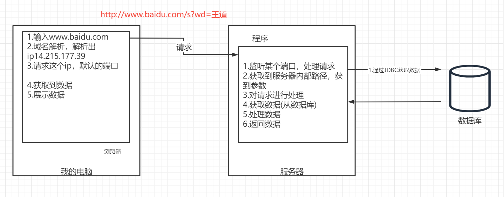
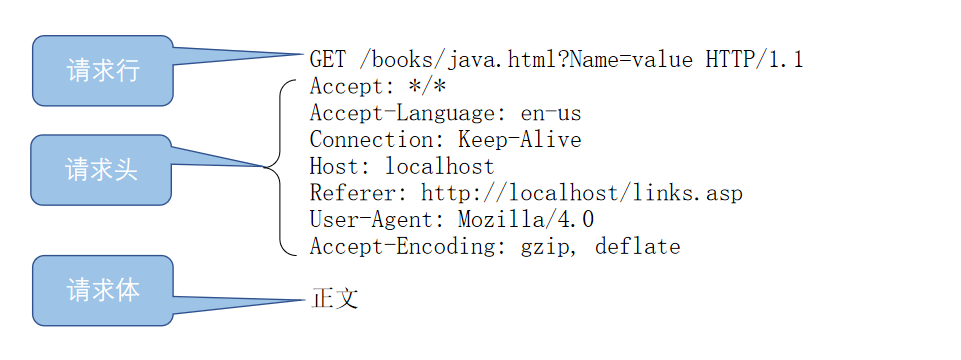
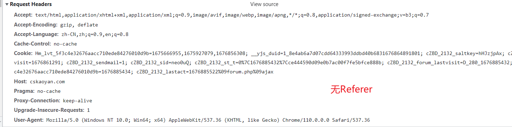
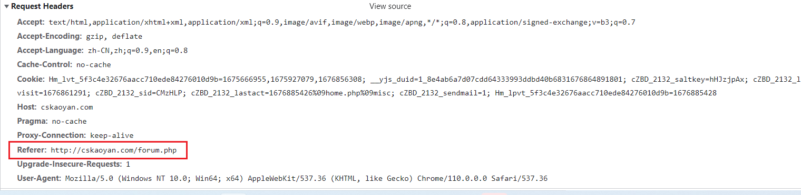
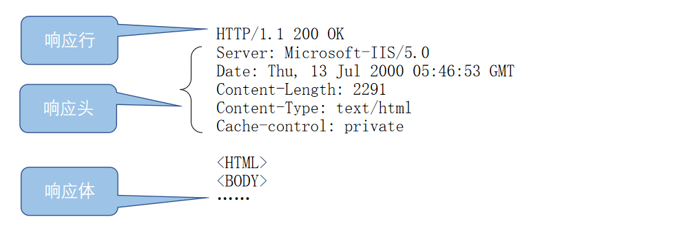
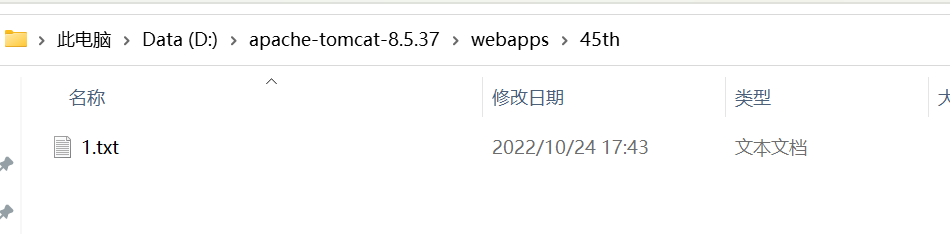

# HTTP

学习目标：

- 掌握HTTP报文格式，请求报文格式，响应报文格式
- 掌握状态码
- 了解Tomcat是什么
- Tomcat的安装及使用
- 掌握直接部署&虚拟部署


**整体流程图**



- 前端：负责获取数据，展示数据
- 程序：负责监听端口，并对请求作出响应，这中间需要从数据库获取数据
- 数据库：数据仓库。通过标准化语言SQL进行操作，在Java代码中，是通过JDBC进行操作。

## 协议


协议在不同场景中有不同的含义，下面分别整理三方协议、租房协议、购房协议，以及网络传输中提及的通讯协议。

### 三方协议

三方协议是指涉及三方之间的一种规定，用于明确各方的权利和义务。这种协议通常包括详细的条款和条件，以确保各方在交往过程中能够达成共识。

### 租房协议

租房协议是一种合同，规定了房东和租户之间的权利和义务。该协议通常包括租赁期限、租金支付方式、房屋使用规定、押金退还条件等条款，以保障租户和房东的合法权益。

### 购房协议

购房协议是指在购房交易中，买卖双方达成的书面协议。这份文件规定了房屋的购买价格、付款方式、交付时间、过户手续等重要信息，确保双方在交易中有明确的权益和责任。

### 网络传输中的通讯协议

在网络传输中，通讯协议是一种规范，用于定义信息传递的格式和规则，确保通信双方能够正确地解释和处理数据。例如，约定了数据的分割符、字段的顺序和格式，以便发送方和接收方能够正常地进行信息交流。

如果A老师和B老师要进行学生信息的传递，他们需要遵循相同的通讯协议。这个协议可能包括换行符的使用、空格的分割规则等，以确保数据能够被正确拆分和解析，从而实现学生信息的顺利传递和宿舍分配。

总体而言，协议在各种情境下都是一种规范和约定，它确保参与方能够按照相同的标准进行交流和合作，从而避免混乱和误解。


比如大家来之前，我们要根据学生的性别，给学生分宿舍。在这个场景中，班主任需要将学生信息表传递给南风老师，以便后者负责给学生分配宿舍。为了确保数据传递的顺利进行，他们约定了一种格式，包含四列信息：姓名、年龄、籍贯、性别。

具体操作步骤如下：

1. **数据格式约定：** 班主任和南风老师约定了数据格式，其中每个学生信息占据一行，各项信息之间用空格分隔。
2. **数据传递：** 班主任将学生信息表发送给南风老师。在Java代码中，南风老师可以使用`split("\r\n")`来按照换行符拆分每一行数据。
3. **数据解析：** 南风老师在接收到数据后，遍历每一行，再使用`split(" ")`按照空格拆分每个学生的具体信息。通过指定索引，南风老师可以取得姓名（index=0）和性别（index=3）等关键信息。
4. **宿舍分配：** 南风老师根据学生的性别信息进行宿舍分配。这里的性别信息是约定好的第四列数据。

这种约定的数据格式和操作流程，类似于一种通讯协议，在确保数据一致性的基础上，实现了班主任和南风老师之间的信息传递和宿舍分配任务。


景天  19  河南  男

长风 18  河南  男

深澜  20  陕西  男

凌霄  17 河南  女

豆豆 17  湖北 女


上述过程中，甲乙双方可以正常进行通讯的前提是双方都遵循同样的规则。这个就是协议。

## HTTP协议

HTTP:Hyper Text Transfer Protocol。超文本传输协议。

超文本：超越了普通的文本，资源类型是丰富的，比如文本、音视频、图片等资源。

传输：通讯的双方。客户端、服务器

协议：通讯双方应该在传递时遵循的规则

HTML: Hyper Text Markup Language

### 网络模型

只是逻辑上面的概念，分层。并不是物理上面的层次。分层的目的主要是为了解耦、提升代码的可复用性、系统的可维护性。

有七层的、  四层  五层。去看看，有几层模型，这几层都是什么。

### HTTP协议工作流程

1.域名解析

域名：jd.com  cskaoyan.com  taobao.com.可以用来指代网络中的一台计算机主机，对应ip地址。

jd.com----------解析   xxx.xxx.xxx.xxx

- 浏览器缓存
- 操作系统缓存
- hosts文件（127.0.0.1  localhost指的是本机）
- DNS服务器解析


C:\Windows\System32\drivers\etc


2.建立TCP连接

3.浏览器发送HTTP请求

4.HTTP请求经过中转到达服务器之后，被服务器接收到，服务器解析HTTP请求，并且做出HTTP响应。

5.HTTP响应经过中转再次返回给客户端，客户端接收到HTTP响应，并且加以解析、渲染

6.如果解析的过程中，发现需要去加载其他的css、js、img等资源，那么会自行再次发送请求，整个过程同上

7.最终浏览器渲染出来页面，呈现页面给用户。


### HTTP请求

发送的HTTP请求一般称之为HTTP请求报文，分为<span style=color:red;background:yellow>**请求行、请求头、空行、请求体**</span>四部分.其中的一些消息头和正文都是可选的，消息头和正文内容之间要用空行(CRLF即\r\n)隔开.·

客户端发送的HTTP请求信息，一般情况下也称作HTTP请求报文。



#### 请求行

请求行，其实就是请求的第一行。


又可以进一步分为三个部分。

`GET /forum-280-1.html HTTP/1.1`


- 请求方法（GET  POST ）
- 请求资源（服务器内部路径）---》  这个请求主要是干啥的？
- 协议版本（HTTP协议的版本）


<span style=color:red;background:yellow>**GET 请求  POST请求。区别。**</span>

1.语义不同。get请求是获取数据，post请求一般是提交数据

2.参数放的位置不同。get请求的参数放在url上面，使用？进行拼接， post请求请求的参数放在请求体里。 url长度有限制，所以使用get请求发送的数据长度有限制。

3.post请求安全一点。 因为它提交数据的时候，不能直接看到。


- <font color=red>**请求方法**</font>：使用何种方法向当前的请求资源地址发起请求。常见的请求方法 GET  POST

  **GET和POST区别？**

  本质的区别在于语义的不同。

  - **GET的语义是用来进行查询、获取数据。99%的情况下通过浏览器访问网站都是get请求。比如查询商品信息。**

  - **POST的语义是用来进行提交数据。注册、登录、文件上传（微信更换头像）等**

  **如何发送GET或者POST请求？**

  - get请求： 使用浏览器，在地址栏直接输入url，直接发送的就是get请求；使用form表单
  - post请求：使用form表单

  ```html
  <!DOCTYPE html>
  <html lang="en">
  <head>
      <meta charset="UTF-8">
      <title>Title</title>
  </head>
  <body>
  以post请求方法访问cskaoyan.com,不可以直接在浏览器地址栏直接输入网址
  如果希望使用post方法访问cskaoyan.com，需要：
  1.先访问1.html（当前页面），将form表单加载出来
  2.点击form表单的提交按钮
      <form action="http://www.cskaoyan.com" method="post">
          <input type="text" name="username"><br>
          <input type="submit">
      </form>
  </body>
  </html>
  ```

  <span style=color:red;background:yellow>**验证：**</span>fiddler软件

  安装完毕之后，打开软件。只需要操作浏览器即可，浏览器发送请求时，fiddler软件便会记录下来

  注意，如果是以下情况，fiddler软件无法抓包：

  - 浏览器设置了代理。（chatGPT ,大家晚上如果抓不上包，看看扩展程序）
  - https。

  

  抓包：就是将浏览器发起的请求，显示在这个软件上。我们可以看到请求和响应的字符串。

  

  

  <span style=color:red;background:yellow>**学会怎样发get请求和post请求。**</span>

  

  

- <font color=red>**请求资源**</font>:指的是访问服务器上面的哪个资源(访问不同页面时，区别主要在于请求资源的不同)

  http://www.cskaoyan.com/forum-280-1.html

  http://www.cskaoyan.com/forum-279-1.html

  上述两个不同的请求，在HTTP请求报文层面的区别是啥？

  ```
  GET http://www.cskaoyan.com/forum-280-1.html HTTP/1.1
  
  GET http://www.cskaoyan.com/thread-664595-1-1.html HTTP/1.1
  
  GET /thread-664595-1-1.html HTTP/1.1
  
  请求资源 或者 服务器内部路径不同。就相当于告诉服务器，我需要请求不同的资源
   
  /login   
  /search 
  
  Fiddler抓包，请求资源有点问题。它自己把url拼接上去了。 真实请求是没有这个url的。
  ```
  
  
  
- <font color=red>**版本协议**</font>

  HTTP/1.1：当前使用的是HTTP 1.1的版本

  在1.1之前的上一个版本是1.0.他们两者之间的区别主要在于是否支持长连接。

  长连接：在一个TCP连接内，是否允许发送多个HTTP请求。如果支持就是长连接。

  1.0版本不支持长连接

  1.1默认支持长连接

#### 请求头

请求头可以理解为是对于请求信息的额外补充，类似于合同的附加合同、补充条款。

作为一个了解。不要背，如果忘了，看下文档，或者查一下。 


```
Accept:浏览器可接受的    MIME类型 */*   (大类型)/(小类型)。浏览器可以接收的类型，言外之意是服务器做出响应时，应当优先响应我可以接收处理的类型。
	MIME:使用一种大类型/小类型的方式将互联网上面的资源加以分类。比如text/html、text/txt、audio/mp3、video/mkv、image/jpeg、image/png
 Accept作为一个补充条款，浏览器告诉服务器，我优先能处理的类型。 服务器在响应的时候，会优先响应这几种指定的类型。
	
Accept-Charset: 浏览器通过这个头告诉服务器，它支持哪种字符集
Accept-Encoding:浏览器能够进行解码的数据编码方式，比如gzip。浏览器利用该头告诉服务器，如果返回的资源需要进行压缩，那么应该使用浏览器可以支持的压缩算法。

	rar zip   

Accept-Language: 浏览器所希望的语言种类，当服务器能够提供一种以上的语言版本时要用到,
Accept-Language: zh-CN,zh;q=0.9,en;q=0.8
中文简体 q=权重。 越大代表优先级越高，没写q，代表1。

假设外国人这样发： Accept-Language: en;q=1,zh-CN；q=0.9,zh;q=0.8
对于王道这个网站，有没有办法返回英语？  没有办法； 这个东西，一定是你的网站做了国际化，才有效果。 

浏览器，告诉服务器。  我这边最希望拿到的数据是中文； 如果没有，你给我返回中文繁体，权重 0.9；

国际化： 一个网站，访问有中国人，有外国人。 如果你是中国人，返回中文； 如果你是美国人，返回英文。

可以在浏览器中进行设置。twitter.com
Host:初始URL中的主机和端口 
Referer:包含一个URL，用户从该URL代表的页面出发访问当前请求的页面 （防盗链）
Content-Type:内容类型。发送的时候的内容类型。比如我现在要上传一张图片。
If-Modified-Since: Wed, 02 Feb 2011 12:04:56 GMT 服务器利用这个头与服务器的文件进行比对，如果一致，则告诉浏览器从缓存中直接读取文件。
User-Agent:浏览器类型.是从什么浏览器发起的请求
Content-Length:表示请求消息正文的长度。表示的是体的长度。
Connection:表示是否需要持久连接。如果服务器看到这里的值为“Keep-Alive”，或者看到请求使用的是HTTP 1.1（HTTP 1.1默认进行持久连接 
Cookie:这是最重要的请求头信息之一 

Date: Mon, 22 Aug 2011 01:55:39 GMT请求时间GMT 
```

**1.直接访问A页面**



**2.先访问B页面，通过B页面跳转到A页面**



**referer请求头**：

- **技术手段：** Referer请求头是HTTP请求中的一部分，包含了请求的来源页面的URL。可以通过解析请求头中的Referer字段来获取访问来源信息。
- **应用场景：**
  - **主播带货：** 在直播带货场景中，主播贴了一个商品链接，商家可以通过解析referer来确定哪些用户是通过该主播的直播间进入的，从而进行合理的分成和奖励。
  - **图片防盗链：** 在图片网站中，通过检查referer请求头，可以确定请求图片的来源，从而实现防盗链机制，确保只有合法的来源才能显示图片。
  - **谷歌广告联盟：** 在广告领域，通过referer可以确定广告点击的来源，帮助广告联盟统计广告效果和提供适当的报酬。

2. **防盗链**：

- **技术手段：** 防盗链是通过检查请求中的referer字段或者使用其他验证手段，确保请求者有权访问资源。可以通过服务器端设置，拒绝不合法的referer来源。
- **应用场景：**
  - **图片网站：** 当你从其他网站复制URL引用图片时，图片网站可以通过检查referer来判断请求是否合法，以防止图片被盗链。
  - **直播带货：** 在直播带货中，商家可以通过防盗链的方式，确保只有通过主播合法渠道进入店铺的用户才能享受相应的优惠或奖励。

结论：

技术手段如referer请求头和防盗链，为各种场景提供了有效的工具，使得在主播带货、图片防盗链、广告统计等应用中更加灵活和可控。通过这些手段，可以实现对请求来源的合法性判断，帮助业务方更好地管理和运营。


```JAVA
请求头，响应头。不要背。大致知道意思（英语单词。）
如果有一些你想懂得更深一点，上网google一下。chatgpt一下。 
```


#### 空行

#### 请求体（存储提交的请求数据）

可以用来大量放置数据的地方。客户端希望提交大量的数据到服务器，那么就把数据放置在请求体里面。微信更换头像。

上传一个文件，上传word txt。

### HTTP响应

服务器发送的HTTP响应信息，一般情况下也称作HTTP响应报文。

服务器发送的HTTP响应一般称之为HTTP请求报文，分为<span style=color:red;background:yellow>**响应行、响应头、空行、响应体**</span>四部分.其中的一些消息头（响应）和正文都是可选的，消息头和正文内容之间要用空行(CRLF即\r\n)隔开.




#### 响应行

响应行主要是三部分组成

- 版本协议（HTTP/1.1 HTTP1.0）
- 状态码
- 原因短语


- 版本协议

- <span style=color:yellow;background:red>**状态码**</span>

  200：OK  一切访问过程是正常的

  301、302、307：重定向。当前的地址不可用，服务器需要将请求重新定向到一个新的地址。**重定向一定会搭配着Location响应头**一起来发挥作用。

  http://www.bing.com 

  

  ```JAVA
  // 第一步，去访问这个网址。得到一个307状态码，相当于 服务器告诉浏览器，我这个网址用不了。 也会给你一个新的地址
  http://www.bing.com/    307   Location:https://www.bing.com/
  https://www.bing.com/   200
  ```
  
  
  
  304:未修改。使用缓存。
  
  
  
  
  
  404：没有找到。Not Found。 
  
  500：服务器异常。有bug。如果出现500状态码，那么一定有bug，但是200状态码不一定没有bug。

bug: 运行异常叫bug？ 和产品经理的预期不一样，就叫bug。

- 我传入一个班级id，你需要根据班级id，找出这个班上最高的分数的同学。 
- 找出这个班上最低的分数的同学。 


- 原因短语 OK

#### 响应头

```
Location: http://www.cskaoyan.com/指示新的资源的位置.需要搭配着重定向状态码一起来使用。

// 301 302 307  一定要返回一个location。告诉浏览器去请求新的地址。

Server: apache tomcat 指示服务器的类型
Content-Encoding: gzip ； 服务器发送的数据采用的编码格式。

Content-Length: 80 告诉浏览器正文的长度
Content-Language: zh-cn; 服务发送的文本的语言
Content-Type: text/html;  服务器发送的内容的MIME类型,

// 写这个Content-Type有什么作用。  图片按照什么发的？音频怎么发
// 必须要把这个图片进行  编码  转成二进制。 写到响应体里面
// 浏览器这边。 对数据进行解析。尤其是响应体里面的图片。 
// 如果不写Content-Type， 可能会导致乱码。
// 如果写错了，会发生什么。 乱码。     乱码的本质： 编解码不一致。

Last-Modified: Tue, 11 Jul 2000 18:23:51 GMT; 文件的最后修改时间
Refresh: 1;url=http://www.cskaoyan.com; 指示客户端刷新频率。单位是秒
相当于告诉浏览器，这边 1s后对页面进行刷新。 刷新的网址是 url=http://www.cskaoyan.com;

Content-Disposition: attachment; filename=aaa.zip; 指示客户端保存文件,直接下载文件
Set-Cookie: SS=Q0=5Lb_nQ; path=/search; 服务器端发送的Cookie
Expires: 0
Cache-Control: no-cache (1.1)  
Connection: close/Keep-Alive   
Date: Tue, 11 Jul 2000 18:23:51 GMT

// 有一些情况是不希望进行缓存。 
// 就可以通过这两个响应头进行控制。 
```

#### 空行

#### 响应体(是存放返回数据的地方)

用来存放服务器返回给客户端大量的数据。响应体里面的数据会最终出现在浏览器的窗口界面中。

可以响应文本类型，也可以响应二进制类型；如果响应二进制类型，那么需要返回特定的Content-Type


比如，现在写回了一张图片。但是content-type写的是text/html


对于浏览器来说。有没有啥问题？会乱码。


浏览器得到的信息： 我现在拿到了一个网页。所以拿响应体，会按照网页来进行解析。就会乱码

乱码的本质： 编解码不一致。


比如返回html，浏览器会把这个东西显示在页面上。

返回图片，会显示到页面上。

html和图片 都是放在 响应体里面的。

### 请求完整的处理流程(重要)

以访问http://www.cskaoyan.com为例

1.域名解析。首先尝试使用浏览器缓存查找，再次通过操作系统缓存查找，借助于hosts文件，最终利用DNS服务器来进行解析。

​						cskaoyan.com------58.211.2.79（中国 江苏省 苏州市）

2.建立TCP连接。

3.浏览器会代理用户发送HTTP请求报文(GET /1.html HTTP/1.1...........)，请求报文在网络中中转传输到达服务器之后，会服务器接收到，进行解析

4.服务器产生HTTP响应报文（HTTP/1.1 200 OK...........）,响应报文在网络中中转传输返回给客户端之后，客户端会将响应报文进行解析、渲染（显示到页面上）

5.如果发现需要再次加载新的资源文件，那么浏览器会自行再次发起请求，过程同上

6.加载获取到所有的资源文件之后，最终渲染（显示），将页面呈现在用户面前。

## HTTPS

目前主流的网站使用的都是https协议了。

HTTPS = HTTP + Secure/SSL


相当于，只是给HTTP加了一些保护壳。如果在企业开发过程中，我们不用去管它。因为有运维。


http协议目前存在的问题？

1.传输过程全程明文传输

2.不验证通讯另一方的身份

3.没有完整性校验，可能报文在中途已经被篡改，但是无从得知


https分别针对上述三点做了改进：

1.加密

加密算法：对称加密（加密解密使用的是同一把秘钥；效率高，但是安全性不高）、非对称加密（公钥加密，私钥解；公钥加密，公钥无法解;安全程度非常高，但是效率低）

混合加密


对称加密： 加密算法： 对每一个字母，+1

hello,java    -->     ifmmp.kbwb  --->   hello,java。


公钥 私钥。      公钥加密，私钥解密。 私钥加密，公钥解密。 


2.证书：证书颁发者（一般是一个权威机构）颁发给当前网站的一个凭证。

3.完整性校验：哈希。


hello,java   --->  fdkljsahfjksdhfshdkfjhdskjfhsdjkl

hello,java1    ---->    145646546132416556655


我们开发的时候，只用了解http.  https是在网络的出入口配置的，是已经直接配置好的。


# Tomcat服务器

## 概念

服务器：两层含义。**软件层面：软件，可以将本地的资源发布到网络中，供网络上面的其他用户来访问，比如tomcat**；硬件层面：一台性能比较高的计算机主机，云服务器。


有些人，只是想下午两小时，使用以下性能比较高的电脑。64个CPU，256G内存。 5w 10w。可以找阿里云，这种大公司。

为什么阿里云，有这么多电脑？双十一的时候。 1w台电脑来提供服务。 


比如，平时它只需要500台服务器。 但是双十一峰值的时候，可能需要1w台。  其余的9500台电脑。其他时候，租出去给别人用。 等到双十一的时候，我自己用。 


服务器开发：指的是在服务器软件程序中进一步去编写程序来运行。

静态资源：页面一成不变的。小说， 图片

动态资源：富有交互性、变化性。目前访问的网站页面基本都是动态资源。本质就是程序。比如登录之后会显示各自的用户名。开发动态资源的技术有很多种，其中java语言中 Servlet。

## 手写简易服务器

服务器程序：持续不断地监听某一端口号；如果客户端往当前端口号发送请求，那么服务器需要做出响应。

要求：涉及协议的部分需要掌握，其他部分根据自己的情况来。

手写服务器，接收请求，然后  1.html   2.txt  返回这种东西。

```java
package com.cskaoyan.server;

import java.io.*;
import java.net.ServerSocket;
import java.net.Socket;
import java.util.Set;

/**
 * @ClassName MainServer
 * @Description: 对于服务器来说，需要做的事情就是根据客户端发送过来的请求报文，然后取出请求资源部分
 * 然后做出对应的响应（如果文件存在，则将文件的数据响应出去；如果文件不存在，则返回404状态码）
 * @Author 远志 zhangsong@cskaoyan.onaliyun.com
 * @Date 2022/10/24 15:53
 * @Version V1.0
 **/
public class MainServer {

    public static void main(String[] args) {
        //服务器程序，需要监听某一端口号 8080
        try {
            ServerSocket serverSocket = new ServerSocket(8080);
            //client就是连接进来的一个客户端
            while (true){
                Socket client = serverSocket.accept();
                //获取客户端提交过来的信息
                new Thread(new Runnable() {
                    @Override
                    public void run() {
                        Request request = new Request(client);
                        String requestURI = request.getRequestURI();
//            String method = request.getMethod();
//            String host = request.getHeader("Host");
//            Set<String> headerNames = request.getHeaderNames();
//            for (String headerName : headerNames) {
//                String value = request.getHeader(headerName);
//            }
                        //已经获取到了请求资源，有针对性的做出响应
                        //   /1.html  /2.html
                        //subString1目的是为了把前面的/去掉
                        OutputStream outputStream = null;
                        try {
                            outputStream = client.getOutputStream();
                            File file = new File(requestURI.substring(1));
                            StringBuffer buffer = new StringBuffer();
                            if(file.exists() && file.isFile()){
                                //200
                                //响应HTTP响应报文
                                buffer.append("HTTP/1.1 200 OK\r\n");
                                buffer.append("Content-Type:text/html\r\n");
                                buffer.append("Server:changfengdeeBMW\r\n");
                                buffer.append("\r\n");
                                outputStream.write(buffer.toString().getBytes("UTF-8"));
                                FileInputStream fileInputStream = new FileInputStream(file);
                                int length = 0;
                                byte[] bytes = new byte[1024];
                                while ((length = fileInputStream.read(bytes)) != -1){
                                    outputStream.write(bytes, 0, length);
                                }
                                return;
                            }
                            //404
                            //如果希望给客户端返回信息
                            buffer.append("HTTP/1.1 404 Not Found\r\n");
                            buffer.append("Content-Type:text/html\r\n");
                            buffer.append("Server:changfengdeeBMW\r\n");
                            buffer.append("\r\n");
                            buffer.append("<div style='color:red;align:center'>File Not Found</div>");
                            outputStream.write(buffer.toString().getBytes("UTF-8"));
                        } catch (IOException e) {
                            e.printStackTrace();
                        }finally {
                            if(outputStream != null){
                                try {
                                    outputStream.close();
                                } catch (IOException e) {
                                    e.printStackTrace();
                                }
                            }
                        }
                    }
                }).start();

            }
        } catch (IOException e) {
            e.printStackTrace();
        }

    }
}
```

```java
package com.cskaoyan.server;

import java.io.IOException;
import java.io.InputStream;
import java.net.Socket;
import java.util.HashMap;
import java.util.Map;
import java.util.Set;

/**
 * @ClassName Reqeust
 * @Description: TODO
 * @Author 远志 zhangsong@cskaoyan.onaliyun.com
 * @Date 2022/10/24 16:07
 * @Version V1.0
 **/
public class Request {

    private String requestMessage;

    private String method;

    private String requestURI;

    private String protocol;

    public String getMethod() {
        return method;
    }

    public String getRequestURI() {
        return requestURI;
    }

    public String getProtocol() {
        return protocol;
    }

    private Map<String, String> requestHeaders = new HashMap<>();

    public String getHeader(String headerName){
        return requestHeaders.get(headerName);
    }

    public Set<String> getHeaderNames(){
        return requestHeaders.keySet();
    }

    public Request(Socket client) {
        parseRequest(client);
        parseRequestLine();
        parseRequestHeader();
    }

    /**
     * 解析请求报文的请求头部分
     * 如何解析？请求头开始的标志：\r\n   请求头结束的标志：\r\n\r\n
     * 解析之后的请求头存放在哪？map
     */
    private void parseRequestHeader() {
        int begin = requestMessage.indexOf("\r\n");
        int end = requestMessage.indexOf("\r\n\r\n");
        String header = requestMessage.substring(begin + 2, end);
        String[] split = header.split("\r\n");
        for (String s : split) {
            int index = s.indexOf(":");
            String key = s.substring(0, index).trim();
            String value = s.substring(index + 1).trim();
            requestHeaders.put(key, value);
        }
    }

    /**
     * 解析请求报文的请求行部分  GET /2.html HTTP/1.1\r\n
     */
    private void parseRequestLine() {
        int index = requestMessage.indexOf("\r\n");
        // GET /2.html HTTP/1.1
        String line = requestMessage.substring(0, index);
        String[] parts = line.split(" ");
        this.method = parts[0];
        this.requestURI = parts[1];
        this.protocol = parts[2];
    }

    private void parseRequest(Socket client) {
        InputStream inputStream = null;
        try {
            inputStream = client.getInputStream();
            byte[] bytes = new byte[1024];
            //note：下面read这一步不要再循环里面读取
            int length = inputStream.read(bytes);
            this.requestMessage = new String(bytes, 0, length);
            System.out.println(requestMessage);
        } catch (IOException e) {
            e.printStackTrace();
        }

    }
}
```


能写就写。不能写算了。一定要理解这个过程。

## JavaEE规范

<span style=color:red;background:yellow>**JavaEE规范：**</span>制定了一系列的接口。相应的厂商需要实现该接口，对于开发者来说，<font color=red>**只需要面向接口编程即可。**</font>

```JAVA
如果没有这样一套规范，对于服务器A厂商。 
    // 获取请求方法名称   getMethodName()
    // 获取版本协议    getProtocol()
    // 获取请求头    String  getHeader(String name);
    
后续，我想切换服务器了。 对于服务器厂商B。
    // 获取请求方法   getMethod();
    // 获取版本协议 getProtocol()
    // 获取请求头    Map<String,String> getHeaders();


interface Request{
 	String getHeader(String name);
    
    String getMethod();
    String getResourceName();
} 

// 服务器厂商A，需要实现这套接口； 服务器厂商B需要实现这套接口。

// 用接口编程有啥好处，我只需要对着接口开发。 至于其他的我不关系。 
// Request request = new ServerARequest(); 
// request.getHeader("refer")
// request.getMethod();

// Request request = new ServerBRequest(); 

    
// 接口有什么好处。 定义规范。 比如tomcat实现了这个规范， 最后再需要使用 header的时候
// 只需要面向接口编程     Request request = *********
// request.getHeader("refer")

// 如果没有这样一套规范，tomcat这样定义
// String header(String name);
// String method();

// 服务器厂商B
// String fetchHeader(String name);
// String fetchMethod();

CutRequest   来解析 方法，资源，请求头
    
    简易的服务器。
    getMethod()   getResourceName()  getProtocol()  
    
Request2   
// String fetchHeader(String name);
// String fetchMethod();
// String fetchResourceName();

    
面向接口编程： 
    Request request = new TomCatQuquest();
	request.getHeader()

```


以服务器部分来做一个举例说明：

- 比如说某个初创公司，使用了服务器A产品，需求：获取到referer请求头的值，进行统计
  - A服务器提供了一个封装。叫做RequestA.getHeader("referer")
- 之后，初创公司更换了另外一个服务器产品B
  - B服务器提供一个获取请求头的方法是RequestB.getRequestHeader("referer")
- 如果对于这个初创公司，从服务器产品A切换到B，<span style=color:red;background:yellow>**需要做哪些事情？**</span>涉及到request相关的部分全部需要推到重写。


<font color=red>**问题：**</font>

- 切换服务器麻烦
- 如果获取请求参数的方法参数根本不一样，很难兼容


JavaEE规范，针对服务器这部分，做了一个规定：

请求报文 的封装对象统一使用HttpServletRequest接口来充当，里面制定了非常详细的方法。

```JAVA
String getHeader(String name); 

String getMethod();
```

各个服务器 厂商实现该接口即可。

```java
RequestA impl HttpServletRequest

RequestB impl HttpServletRequest
```

初创公司的开发人员来说，我们编写的代码只需要这么去写HttpServletRequest.getHeader(key)

统一了操作，今后如果想从服务器A切换到服务器B，很容易就切换过去了。


面向接口编程。 就是使用接口来接，不要使用具体的实现类来接。

好处是，等到你需要切换服务的时候，只用改一行代码，其余代码全部不用动。

## Tomcat

### 安装

>  直接解压缩到盘符根目录即可（推荐）

<span style=color:red;background:yellow>**注意：无论使用哪个软件，尽量不要代码放置在含有空格、中文、目录价结构非常深的目录中（idea、tomcat、vue等）**</span>


**目录结构介绍**

```TEXT
bin：存放命令的目录。启停tomcat的命令。

conf：配置文件文件夹，对tomcat进行配置。

logs：日志目录，排查故障所用。

webapps：部署资源
```

### 启动

1.双击startup.bat文件。


2.bin目录下唤出cmd，执行startup


常见的启动故障：

<font color=red>**没有正确配置好JAVA_HOME,导致tomcat启动窗口一闪而过。**</font>


### 停止

1.双击shutdown.bat文件


2.bin目录下唤出cmd，执行shutdown


3.可以在tomcat启动成功的窗口中按住ctrl键，多次按c键，也可以结束。


4.直接关掉cmd。即可。


### 部署资源

#### 直接部署

直接将资源文件放置在webapps目录下。


<span style=color:red;background:yellow>**步骤：**</span>

**1.需要在webapps目录下新建一个目录,也建议大家使用英文**

**2.需要将资源文件放置在该目录下**



如果希望访问该文件，应该如何访问？

`http://localhost:8080/{文件夹的名称}/相对路径`

`http://localhost:8080/test52th/`


`http://localhost:8080/{目录名称}`  --》 相当于找到了 webapps目录下的  {目录名称}

http://localhost:8080/app1   -->  相当于找到webapps/app1的目录


<span style=color:red;background:yellow>**注意：**</span>

不能将文件直接放置在webapps目录下。需要放在webapps目录下的文件夹内。


我们不想直接将文件拷贝到 webapps目录下，我们有啥办法完成部署？


#### 虚拟映射

正常情况下来说，需要部署资源，是要在webapps目录下操作的。但是如果希望不再webapps目录下，可不可以部署呢？可以。

不在webapps目录这种方式叫做<font color=red>**虚拟映射**</font>。虚拟地映射到tomcat的webapps目录下。

##### conf/Catalina/localhost(掌握)

新建一个xml文件，xml文件的名称（user1.xml）里面配置Context节点信息

```xml
<?xml version="1.0" encoding="UTF-8"?>
<Context docBase="D:\app1"/>
```

比如，我们现在新建了一个xml文件，名字叫做user1.xml

`http://localhost:8080/{xml的名称}` ---》 其实相当于找到  {docBase}路径

我想访问这个{docBase}路径下。 222/1.png的图片，现在需要怎么写？

http://localhost:8080/user1/222/1.png


现在，想访问 test333里面的  1.txt。需要怎么写？

`localhost:8080/user1/test333/1.txt`

 这样写没用：`localhost:8080/user1/../test4.war`


##### conf/server.xml(了解)

需要在Host节点下配置Context节点

/app452-----Context

```xml
<Context path="/app452" docBase="D:\app2" />
```

现在我们需要找 D:/app2。这时候怎么写 


`http://localhost:8080/{path的值}` 其实就相当于找到docBase。

如果想访问 docBase下的。 1.txt  --》 `localhost:8080/app452/1.txt`

如果想访问 docBase下的。 test1/test2/1.png  --> `localhost:8080/app452/test1/test2/1.png`


这个作为了解即可，因为修改配置文件比较危险。

#### 原理

<font color=red>**静态资源服务器的本质：**</font>把用户输入的一个路径（url），加以解析转换成服务器所在的主机本地硬盘路径。

需要能够获取到该文件的硬盘路径。

比如，我们在url上输入 `http://localhost:8080/user/1.txt`最终，Tomcat需要在本地找到这样一个1.txt，然后把数据写回给浏览器。


大家一定要掌握这个映射关系。


<font color=red>**除了上述我们部署目录之外，其实tomcat还支持部署压缩包，只不过压缩包的格式，而是war格式。**</font>

war包部署到了tomcat中之后，tomcat会自行将其解压缩成目录，访问方式和上述完全一致。


如果大家不写前面的路径。其实是访问的 webapps目录下的 ROOT文件夹。 默认应用。


- 虚拟映射和直接部署冲突的时候。是以虚拟映射为准。

如果在webapps目录下，有这个文件夹。在conf/Catalina/localhost里面也有  ROOT.xml。

这时候，是以虚拟映射为准。


### Tomcat设置

<font color=red>**1.设置默认端口号**</font>

比如访问www.cskaoyan.com时，发现没有携带端口号，如果没有端口号，那么说明的是当前服务器使用的是当前协议的默认端口号。

http : 80

https: 443


对于http协议来说，默认端口号是80端口号。如果你也希望访问你的tomcat时，也不携带端口号，你只需要设置你的tomcat监听80端口号即可。

`conf/server.xml`可以在这里修改Tomcat的端口。需要主要，修改的protocal 是HTTP/1.1。

```xml
 <Connector port="80" protocol="HTTP/1.1"
               connectionTimeout="20000"
               redirectPort="8443" />
```

<font color=red>**2.设置缺省应用**</font>

tomcat中存在着一个缺省应用，如果没有找到匹配的应用时，则将该请求交给缺省应用来处理。

/test1

localhost:80/test3/1.png


缺省应用的特征：

1.如果希望配置一个ROOT应用，那么webapps目录下新建一个ROOT目录；`conf/Catalina/localhost`目录下新建一个`ROOT.xml`

2.但是ROOT应用下的资源文件在访问时，不需要携带应用的名称。

虚拟映射也可以配置一个ROOT.xml。如果虚拟映射和直接部署都有。虚拟映射的优先级高。


假设，如果你部署了一个资源文件，但是希望在访问时不携带应用名，则直接设置应用名为ROOT即可。


<font color=red>**3.设置欢迎页面（缺省页面）**</font>

比如访问http://localhost，可以显示出一个页面。访问的是哪个页面呢？

1.没有应用名，说明访问的是ROOT应用

2.没有页面，说明访问的是欢迎页面(`conf/web.xml`文件中有配置)

表示的是：如果请求没有指明具体访问的是哪个页面，那么会在当前应用下依次去查找是否存在该文件，如果存在，则加载；如果不存在，则返回404

```xml
<welcome-file-list>
        <welcome-file>index.html</welcome-file>
        <welcome-file>index.htm</welcome-file>
        <welcome-file>index.jsp</welcome-file>
</welcome-file-list>
```


要求通过ip地址就可以访问到该文件。

现在，想通过ip地址，就访问到 D:\test333\1.txt

输入：  http://localhost 直接访问到 

- 改端口。 把端口改成80
- 虚拟映射。   ROOT.xml --> docBase D:\test333
- 加1.txt到欢迎页面。


<font color=red>**需要注意：**</font>

1.有部分同学可能80端口号没法改，因为已经被微软的产品占用了

2.如果自己可以访问，别人访问不到，关注防火墙


Tomcat控制台乱码，是因为我们的cmd是GBK的编码，Tomcat是UTF8的编码

```JAVA
修改logging.properties配置 :
打开tomcat/conf/logging.properties
添加语句：java.util.logging.ConsoleHandler.encoding = GBK
重启tomcat，查看日志数据即可
```


中文文件乱码问题

访问文件。1.txt里面有 中文，也会乱码。

这个乱码我们目前不需要解决。


映射路径问题

```XML
新建了 user1.xml  
配置的docBase一定要是一个路径，不能是一个文件。
<?xml version="1.0" encoding="UTF-8"?>
<Context docBase="D:\app1\1.png"/>
```

