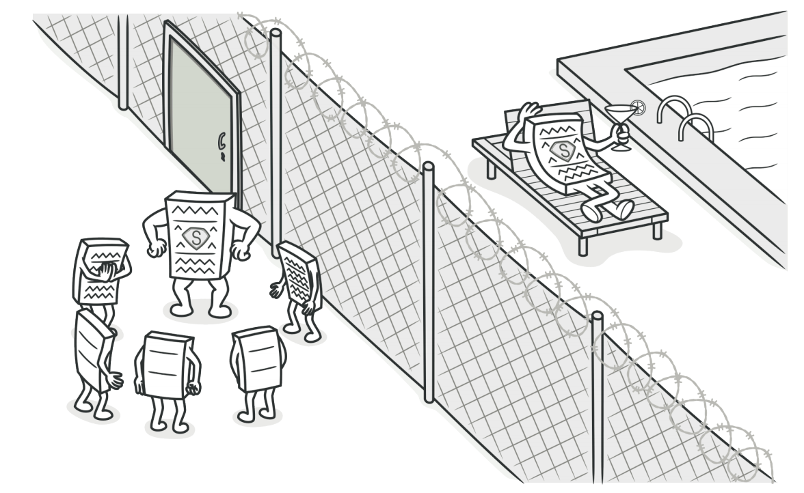
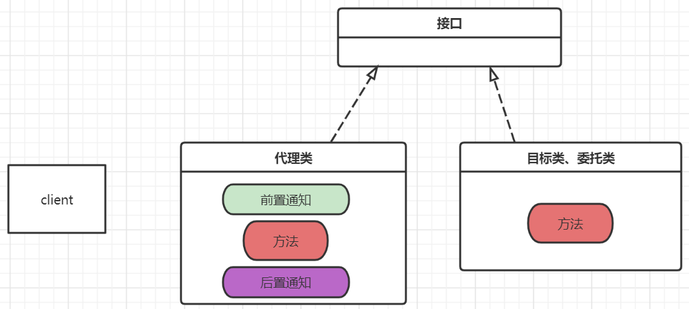

# 代理



代理是一种结构型设计模式，可以允许我们生成对象的替代品。代理控制着对于原对象的访问，同时也允许在原对象的方法前后做一些处理，便可以实现在原方法执行前后都会执行某段代码逻辑的功能。这个也是面向切面编程的指导思想。

代理模式在我们日常生活中用处还是相当广泛的，比如海外购网站就是一个代理。海外购网站负责代理用户到国外的电商网站去下单购买商品，也可以在商品送达到海外购网站时，再执行进一步加固操作，再次转送给用户。

代理模式在软件开发过程中的应用场景也非常常见。在客户端以及客户端访问的目标类对象中间，额外再引入一个第三方代理类对象。如果直接访问目标类对象，就是执行对应的方法；如果客户端访问的是代理类对象，那么不仅可以访问对应的方法，还会再方法的执行前后执行对应的前置、后置通知。



## 静态代理

```java
public interface UserService {

    void insert();
}
```

```java
public class UserServiceImpl implements UserService {
    @Override
    public void insert() {
        System.out.println("目标类执行了insert方法");
    }
}
```

```java
public class UserServiceProxy implements UserService {

    UserService target;

    public UserServiceProxy(UserService target) {
        //注入委托类对象
        this.target = target;
    }

    @Override
    public void insert() {
        System.out.println("代理之前打印一个日志");
        target.insert();
        System.out.println("代理之后打印一个日志");
    }
}
```

```java
@Test
    public void test1(){
        UserServiceProxy proxy = new UserServiceProxy(new UserServiceImpl());
        proxy.insert();
    }
```


**代理模式最大的优点在于可以不更改目标类代码的前提下，扩展目标类代码的功能。**

**静态代理最大的缺点在于代码较为冗余，每代理一个类，便要手动编写一个代理类；代理对象和目标类对象均实现了接口，如果接口发生了修改，不仅目标类需要更改，代理类也需要同步发生修改，维护成本变高了很多**。

因此，我们希望可以在程序运行过程中，动态地生成一个代理类对象，这样处理任务更加的方便。这也便是我们接下来介绍的动态代理。

## JDK动态代理

静态代理，顾名思义，便是在编译时，就已经实际存在了该`class`文件；而动态代理，在编译时期，实际上并不存在该`class`文件，而是程序在运行阶段动态生成了字节码。**`JDK`动态代理，即`JDK`给我们提供的动态生成代理类的方式，无需引入第三方`jar`包，但是使用`JDK`动态代理有一个先决条件，那就是目标类对象必须实现了某个接口；如果目标类对象没有实现任何接口，则`JDK`动态代理无法使用**。

如果使用`JDK`提供的动态代理，那么需要借助于如下几个类

- `java.lang.reflect.Proxy`

  | API                                                          | 参数                                                         | 返回值                                                       |
  | ------------------------------------------------------------ | ------------------------------------------------------------ | ------------------------------------------------------------ |
  | public static Object newProxyInstance(ClassLoader loader, Class<?>[] interfaces, InvocationHandler h) | loader表示目标类使用的类加载器；interfaces表示目标类所实现的接口类型；h表示处理器，用来规定代理的内部细节 | 返回一个实现指定接口的代理类实例对象；代理类对象和目标类对象实现相同的接口类型 |

- `java.lang.reflect.InvocationHandler`

  | API                                                          | 参数                                                         | 返回值                             |
  | ------------------------------------------------------------ | ------------------------------------------------------------ | ---------------------------------- |
  | public Object invoke(Object proxy, Method method, Object[] args) | proxy表示JDK帮助开发者生成的代理类对象，这个参数一般不用理会；method表示的是目标类中的方法；args表示执行目标类方法时传递的参数；三个参数合在一起表示的含义表示代理类如何来代理、增强目标类里面的方法 | 代理类执行完对应的方法时它的返回值 |

```java
public class ProxyFactory {

    Object target;

    public ProxyFactory(Object target) {
        this.target = target;
    }

    public Object newProxyInstance(){
        return Proxy.newProxyInstance(target.getClass().getClassLoader(),
                target.getClass().getInterfaces(),
                new InvocationHandler() {
                    
                    //代理类如何代理
                    @Override
                    public Object invoke(Object proxy, Method method, Object[] args) throws Throwable {
                        System.out.println("代理之前签订合约");
                        Object invoke = method.invoke(target, args);
                        System.out.println("代理完毕转账确认");
                        return invoke;
                    }
                });
    }
}
```

```java
@Test
    public void test2(){
        UserService userService = new UserServiceImpl();
        //对哪个目标类进行代理，我们对UserServiceImpl进行代理
        ProxyFactory factory = new ProxyFactory(userService);
        //生成代理类对象
        UserService userServiceProxy = (UserService) factory.newProxyInstance();
        //代理类对象执行insert方法，什么逻辑呢？主要是invoke里面的代码逻辑
        userServiceProxy.insert();
    }
```


利用线上监测工具以及反编译工具，可以看到生成的代理类对象源码

```java
public final class $Proxy0
extends Proxy
implements UserService {
    private static Method m1;
    private static Method m3;
    private static Method m2;
    private static Method m0;

    public $Proxy0(InvocationHandler invocationHandler) {
        super(invocationHandler);
    }

    static {
        try {
            m1 = Class.forName("java.lang.Object").getMethod("equals", Class.forName("java.lang.Object"));
            m3 = Class.forName("com.cskaoyan.pattern.proxy.UserService").getMethod("insert", new Class[0]);
            m2 = Class.forName("java.lang.Object").getMethod("toString", new Class[0]);
            m0 = Class.forName("java.lang.Object").getMethod("hashCode", new Class[0]);
            return;
        }
        catch (NoSuchMethodException noSuchMethodException) {
            throw new NoSuchMethodError(noSuchMethodException.getMessage());
        }
        catch (ClassNotFoundException classNotFoundException) {
            throw new NoClassDefFoundError(classNotFoundException.getMessage());
        }
    }

    public final boolean equals(Object object) {
        try {
            return (Boolean)this.h.invoke(this, m1, new Object[]{object});
        }
        catch (Error | RuntimeException throwable) {
            throw throwable;
        }
        catch (Throwable throwable) {
            throw new UndeclaredThrowableException(throwable);
        }
    }

    public final String toString() {
        try {
            return (String)this.h.invoke(this, m2, null);
        }
        catch (Error | RuntimeException throwable) {
            throw throwable;
        }
        catch (Throwable throwable) {
            throw new UndeclaredThrowableException(throwable);
        }
    }

    public final int hashCode() {
        try {
            return (Integer)this.h.invoke(this, m0, null);
        }
        catch (Error | RuntimeException throwable) {
            throw throwable;
        }
        catch (Throwable throwable) {
            throw new UndeclaredThrowableException(throwable);
        }
    }
	//主要关注insert方法
    public final void insert() {
        try {
            this.h.invoke(this, m3, null);
            return;
        }
        catch (Error | RuntimeException throwable) {
            throw throwable;
        }
        catch (Throwable throwable) {
            throw new UndeclaredThrowableException(throwable);
        }
    }
}
```

## Cglib动态代理

Cglib(`Code Generation Library`)是一个开源项目，是一个强大的，高性能，高质量的`Code`生成类库，它可以在运行期扩展`Java`类与实现Java接口。我们可以借助于`Cglib`来帮助我们动态地生成代理类对象。`Cglib`可以弥补`JDK`动态代理的不足，`JDK`要求目标类必须实现了某个接口，才可以执行代理功能；而`Cglib`对此无任何要求，**主要原因在于`Cglib`扩展的代理类会继承自目标类**。**所以这也要求我们的目标类不能是`final`修饰**。

使用`Cglib`涉及到的相关类如下

- `net.sf.cglib.proxy.Enhancer`

  | API                                | 参数                                                         | 返回值/说明                                                  |
  | ---------------------------------- | ------------------------------------------------------------ | ------------------------------------------------------------ |
  | enhancer.setSuperclass(superClass) | 父类的字节码对象，也就是我们的目标类                         | 无返回值;Cglib产生的代理类会继承目标类，所以此处设置的父类也就是目标类 |
  | enhancer.setCallBack(callback)     | 设置一个回调函数，代理类对象如何代理目标对象需要在回调函数中制定策略 | CallBack是一个接口，MethodInterceptor是一个子接口。我们选用该类来设置回调策略 |
  | enhancer.create()                  | -                                                            | 生成代理类对象                                               |

- `net.sf.cglib.proxy.MethodInterceptor`

  | API                                                          | 参数                                                         | 返回值/说明                                    |
  | ------------------------------------------------------------ | ------------------------------------------------------------ | ---------------------------------------------- |
  | public Object intercept(Object obj, Method method, Object[] args, MethodProxy proxy) | 第一个参数obj为代理类对象；第二个参数为目标类对应中对应的方法；第三个参数为目标类对象中对应的方法执行时传递的参数；第四个参数是代理类对象中的对应方法 | 返回值一般便将代理类对象对应方法的执行结果返回 |


使用Cglib需要导包

```xml
 <dependency>
            <groupId>cglib</groupId>
            <artifactId>cglib</artifactId>
            <version>3.3.0</version>
        </dependency>
```

编写代理工具类，用来生成代理类

```java
public class ProxyFactory {

    private Object target;

    public ProxyFactory(Object target) {
        this.target = target;
    }

    public Object newProxyInstance(){
        Enhancer enhancer = new Enhancer();
        //设置代理类的父类字节码对象，也就是我们的目标类
        enhancer.setSuperclass(target.getClass());
        //设置回调函数,需要传递CallBack，为一个接口，有众多的子接口
        //其中一个叫做MethodInterceptor接口
        enhancer.setCallback(new MethodInterceptor() {
            /**
             *
             * @param obj 代理类对象
             * @param method 目标类对象中对应的方法
             * @param args 目标类对象对应的方法执行时传递的参数
             * @param proxy 代理类对象中的方法
             * @return
             * @throws Throwable
             */
            @Override
            public Object intercept(Object obj, Method method, Object[] args, MethodProxy proxy) throws Throwable {
                System.out.println("增强之前");
                Object o = proxy.invokeSuper(obj, args);
                System.out.println("增强之后");
                return o;
            }
        });
        //产生代理类对象
        return enhancer.create();
    }
}
```

创建一个目标类，在这里为了体现Cglib的效果，目标类没有实现任何接口

```java
public class UserServiceImpl {

    public String getName(){
        System.out.println("目标方法执行");
        return "zhangsan";
    }
}
```

编写测试代码

```java
public class ProxyTest {

    public static void main(String[] args) {
        UserServiceImpl userService = new UserServiceImpl();
        ProxyFactory factory = new ProxyFactory(userService);
        UserServiceImpl userServiceProxy = (UserServiceImpl) factory.newProxyInstance();
        String name = userServiceProxy.getName();
        System.out.println(name);
    }
}
```
