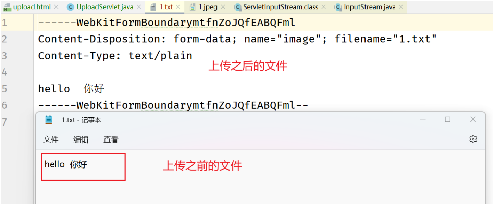
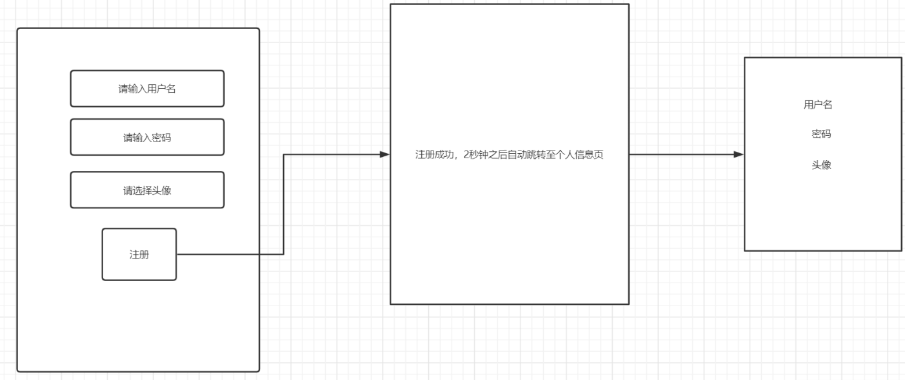

# FileUpload

## 概述

文件上传的原理就是将客户端本地硬盘上的资源文件借助于HTTP请求报文的请求体传输到服务器，服务器会将请求报文解析封装成为request对象，文件数据也会被封装到request对象中。**对于JavaWeb开发人员来说，我们需要做的事情就是利用request提供的API来获取请求体的文件数据，然后将其保存到服务器主机的硬盘上**。

文件上传也有比较广泛的使用场景。比如微信更换头像。就是用户将本地的图片上传到微信的服务器上，然后加以保存。后续再次通过网络去访问该图片。还比如商家发布新的商品等等。

## 实验过程

- 准备工作：

1. 准备一个form表单，method=post

2. 需要有一个input type=file用来进行上传文件

   选择一张图片来进行文件上传，抓取HTTP请求报文如下：

   ```
   POST http://localhost/app/upload HTTP/1.1
   Host: localhost
   Connection: keep-alive
   Content-Length: 11
   Cache-Control: max-age=0
   sec-ch-ua: " Not A;Brand";v="99", "Chromium";v="101", "Microsoft Edge";v="101"
   sec-ch-ua-mobile: ?0
   sec-ch-ua-platform: "Windows"
   Upgrade-Insecure-Requests: 1
   Origin: http://localhost
   Content-Type: application/x-www-form-urlencoded
   User-Agent: Mozilla/5.0 (Windows NT 10.0; Win64; x64) AppleWebKit/537.36 (KHTML, like Gecko) Chrome/101.0.4951.64 Safari/537.36 Edg/101.0.1210.53
   Accept: text/html,application/xhtml+xml,application/xml;q=0.9,image/webp,image/apng,*/*;q=0.8,application/signed-exchange;v=b3;q=0.9
   Sec-Fetch-Site: same-origin
   Sec-Fetch-Mode: navigate
   Sec-Fetch-User: ?1
   Sec-Fetch-Dest: document
   Referer: http://localhost/app/upload.html
   Accept-Encoding: gzip, deflate, br
   Accept-Language: zh-CN,zh;q=0.9,en;q=0.8,en-GB;q=0.7,en-US;q=0.6
   Cookie: JSESSIONID=FC4722447D98CCCA05012E8C6D0A0287
   
   image=1.jpg
   ```

   此时发现文件仅上传文件的名称，并没有上传文件的内容。

3. form表单设置enctype=multipart/form-data才会上传文件数据

- 编写Servlet处理：

  ```java
  package com.cskaoyan.upload;
  
  import javax.servlet.ServletException;
  import javax.servlet.ServletInputStream;
  import javax.servlet.annotation.WebServlet;
  import javax.servlet.http.HttpServlet;
  import javax.servlet.http.HttpServletRequest;
  import javax.servlet.http.HttpServletResponse;
  import java.io.File;
  import java.io.FileOutputStream;
  import java.io.IOException;
  
  /**
   * @ClassName ${NAME}
   * @Description: TODO
   * @Author 远志 zhangsong@cskaoyan.onaliyun.com
   * @Version V1.0
   **/
  @WebServlet("/upload")
  public class UploadServlet extends HttpServlet {
      protected void doPost(HttpServletRequest request, HttpServletResponse response) throws ServletException, IOException {
          //我们需要做的事情是从请求体中获取到文件的数据，然后将其保存到服务器的本地硬盘上面
          //哪个方法可以获取请求体？
          //ServletInputStream类不熟悉，但是可以通过去查看类继承关系
          //ServletInputStream 和FileInputStream均继承自InputStream（输入流），两个子类表示的寓意应当是
          //输入流的来源不同，具体操作的细节部分已经被封装到了方法的实现内部
          ServletInputStream inputStream = request.getInputStream();
          String realPath = getServletContext().getRealPath("image/1.jpeg");
          File file = new File(realPath);
          if(!file.getParentFile().exists()){
              //表示的是某个文件的父级目录如果不存在
              file.getParentFile().mkdirs();
          }
          FileOutputStream fileOutputStream = new FileOutputStream(file);
          int length = 0;
          byte[] bytes = new byte[1024];
          while ((length = inputStream.read(bytes)) != -1){
              fileOutputStream.write(bytes, 0, length);
          }
          //关闭流
          inputStream.close();
          fileOutputStream.close();
      }
  
      protected void doGet(HttpServletRequest request, HttpServletResponse response) throws ServletException, IOException {
  
      }
  }
  ```

  但是最终二进制文件直接损坏。图片无法打开。

  文件损坏的原因未知，但是我们可以使用文本文件执行一遍上传操作，通过上传前后进行比对：

  

  通过上图可以发现，上传之后，文件中引入了很多无关的字符。这些字符进入到二进制文件中，会直接导致文件的损坏。

  如果此时我同时上传表单数据和文件，那么抓取此时的HTTP请求报文

  ```
  POST http://localhost/app/upload HTTP/1.1
  Host: localhost
  Connection: keep-alive
  Content-Length: 396
  Cache-Control: max-age=0
  sec-ch-ua: " Not A;Brand";v="99", "Chromium";v="101", "Microsoft Edge";v="101"
  sec-ch-ua-mobile: ?0
  sec-ch-ua-platform: "Windows"
  Upgrade-Insecure-Requests: 1
  Origin: http://localhost
  Content-Type: multipart/form-data; boundary=----WebKitFormBoundarydVK64vdnBYNPuTX7
  User-Agent: Mozilla/5.0 (Windows NT 10.0; Win64; x64) AppleWebKit/537.36 (KHTML, like Gecko) Chrome/101.0.4951.64 Safari/537.36 Edg/101.0.1210.53
  Accept: text/html,application/xhtml+xml,application/xml;q=0.9,image/webp,image/apng,*/*;q=0.8,application/signed-exchange;v=b3;q=0.9
  Sec-Fetch-Site: same-origin
  Sec-Fetch-Mode: navigate
  Sec-Fetch-User: ?1
  Sec-Fetch-Dest: document
  Referer: http://localhost/app/upload.html
  Accept-Encoding: gzip, deflate, br
  Accept-Language: zh-CN,zh;q=0.9,en;q=0.8,en-GB;q=0.7,en-US;q=0.6
  Cookie: JSESSIONID=FC4722447D98CCCA05012E8C6D0A0287
  
  ------WebKitFormBoundarydVK64vdnBYNPuTX7
  Content-Disposition: form-data; name="image"; filename="1.txt"
  Content-Type: text/plain
  
  hello  你好
  ------WebKitFormBoundarydVK64vdnBYNPuTX7
  Content-Disposition: form-data; name="username"
  
  admin
  ------WebKitFormBoundarydVK64vdnBYNPuTX7
  Content-Disposition: form-data; name="password"
  
  admin123
  ------WebKitFormBoundarydVK64vdnBYNPuTX7--
  
  ```

  可以发现，在同时上传表单数据和文件时，之前提交表单数据时key=value数据格式也发生了改变。

## 面临的问题

- 二进制文件损坏

- 文本文件会多出字符

- request.getParameter系列API失效

  虽然看似三个问题， 但是其实是由同一个问题引起的。

  在没有**引入文件上传之前，我们提交表单数据时，数据的格式是key=value&key=value格式**。但是在**进行文件上传时，因为我们要提交文件的数据，所以不可能再使用key=value来提交文件数据。因为数据的格式必须要发生改变**。我们可以发现WebKitFormBoundarydVK64vdnBYNPuTX7实际上是起着分隔符的作用(和&的功能是一致的)。

  **所以，这些字符进入到二进制文件中，会导致了文件的损坏。文本文件多出字符其实和二进制文件损坏的原因是一致的，也是因为分隔符进入了文件内部。API失效原因是数据不再是key=value格式，所以失效。**


## 解决方案

解决思路：我们可以使用WebKitFormBoundarydVK64vdnBYNPuTX7来进行分割。但是实际操作过程并不是特别的简单，另外一点是市面上已经存在比较成熟的解决方案了，所以也没有必要自己动手去解析。

因为在接下来的课程中，我们将使用commons-fileupload来进行处理。

***特别需要注意的是，针对文件上传部分，需要大家着重去理解掌握引入组件之前的代码。引入组件之后的代码对于大家的要求是可以参考官方文档完成实际文件上传功能即可。***

## Commons-fileupload

官方网站：

[FileUpload – Home (apache.org)](https://commons.apache.org/proper/commons-fileupload/)

```java
package com.cskaoyan.upload;

import org.apache.commons.fileupload.FileItem;
import org.apache.commons.fileupload.FileUploadException;
import org.apache.commons.fileupload.disk.DiskFileItemFactory;
import org.apache.commons.fileupload.servlet.ServletFileUpload;

import javax.servlet.ServletContext;
import javax.servlet.ServletException;
import javax.servlet.ServletInputStream;
import javax.servlet.annotation.WebServlet;
import javax.servlet.http.HttpServlet;
import javax.servlet.http.HttpServletRequest;
import javax.servlet.http.HttpServletResponse;
import java.io.File;
import java.io.FileOutputStream;
import java.io.IOException;
import java.util.List;

/**
 * @ClassName ${NAME}
 * @Description: TODO
 * @Author 远志 zhangsong@cskaoyan.onaliyun.com
 * @Version V1.0
 **/
@WebServlet("/upload2")
public class UploadServlet2 extends HttpServlet {
    protected void doPost(HttpServletRequest request, HttpServletResponse response) throws ServletException, IOException {
        //使用fileupload组件来进行文件上传
        //当前jar包、工具类必须要求在有上传文件时才可以使用，如果只是一个普通的表单，那么是不可以使用该jar包的
        //jar包给我们提供了一个静态方法来保障请求中包含上传文件
        boolean isMultiPart = ServletFileUpload.isMultipartContent(request);
        if(!isMultiPart){
            //当前请求就是一个普普通通的表单
            //这里面也可以不直接return，直接去写request.getParameter获取请求参数也可以
            return;
        }
        //SqlSessionFactory 采用的是一个工厂的设计模式
        //下面这几行代码表示的是，这个组件是可以进行大文件上传的，如果上传大文件可能会采取边缓存边上传的方式
        //下面这几行代码主要的目的就是为了配置缓存的目录
        DiskFileItemFactory factory = new DiskFileItemFactory();
        ServletContext servletContext = getServletContext();
        File repository = (File) servletContext.getAttribute("javax.servlet.context.tempdir");
        factory.setRepository(repository);
        //下面这行代码其实是利用刚刚所做的配置，创建一个处理文件上传的处理器
        ServletFileUpload upload = new ServletFileUpload(factory);
        try {
            //页面中提交的每一个input，都会被解析封装到一个FileItem对象中
            List<FileItem> items = upload.parseRequest(request);
            for (FileItem item : items) {
                //FileItem其实就是对于input的封装，那么可能是常规的表单数据，也可能是上传的文件
                if(item.isFormField()){
                    //是表单数据
                    processFormField(item);
                }else {
                    //上传的文件
                    processUploadeFile(item);
                }
            }
        } catch (FileUploadException e) {
            e.printStackTrace();
        }
    }

    /**
     * 处理上传的文件业务逻辑
     * 首先先获取一些文件相关的信息，然后将文件保存到服务器硬盘上面
     * @param item
     */
    private void processUploadeFile(FileItem item) {
        //input的name属性
        String fieldName = item.getFieldName();
        String fileName = item.getName();
        String contentType = item.getContentType();
        boolean isInMemory = item.isInMemory();
        long sizeInBytes = item.getSize();
//        System.out.println(fieldName + ":" + fileName + ":" + contentType + ":" + isInMemory + ":" + sizeInBytes);
        String realPath = getServletContext().getRealPath("image/" + fileName);
        File file = new File(realPath);
        if(!file.getParentFile().exists()){
            file.getParentFile().mkdirs();
        }
        try {
            item.write(file);
        } catch (Exception e) {
            e.printStackTrace();
        }
    }

    /**
     * 处理常规表单数据的业务逻辑
     * 只需要获取key和value值即可
     * @param item
     */
    private void processFormField(FileItem item) {
        String name = item.getFieldName();
        String value = item.getString();
        System.out.println(name + ":" + value);
    }

    protected void doGet(HttpServletRequest request, HttpServletResponse response) throws ServletException, IOException {

    }
}
```

- 表单项中文乱码问题

  表单项中文乱码问题，我们需要使用组件给我们提供的方案来解决。因为在文件上传时，请求体中数据提交的格式已经不再是key=value类型了，所以不能再使用request.setCharacterEncoding来设定。

  ```java
  value = item.getString("UTF-8");
  ```

- 上传文件名中文乱码问题

  ```java
  //可以解决上传的文件文件名中文乱码问题
  upload.setHeaderEncoding("utf-8");
  ```

- 上传文件的大小限制

  ```java
  upload.setFileSizeMax(1024);
  ```


思考题：可以尝试使用目前学习的知识做一个简单的作业提交、检查系统

本功能包含两个终端。

一个是学生端，利用表单页面将作业以压缩包的形式提交到服务器所在硬盘上面

一个是教师端，教师需要将每天同学提交的作业放置在一个目录中，然后对目录内提交的文件进行分析，提取出文件中包含的学生姓名。再和全体学生的成员名单进行比对。成员名单中有，但是作业提取出的名单中没有的学生姓名，即是当天没有提交作业的同学。

比如某班有张三、李四、王五、赵六四位同学，在第一天的作业中，一共有以下同学提交了作业

Day1_HTTP_张三.zip

Day1_HTTP_李四.zip

Day1_HTTP_王五.zip

当统计程序运行完毕，可以得出提交作业的学生名单为：张三、李四、王五，和全体的成员名单进行比对，可以得出赵六没有提交作业。

## 数据封装到JavaBean

假设有一个用户注册页面，不仅需要提交用户的基本信息数据，还需要上传用户选择的图片。这些数据需要全部提交到服务器，并最终全部保存到数据库。有一个问题，关于用户提交的图片，我们应当把图片保存到数据库还是把图片的路径保存到数据库？此时，我们选择将图片的路径保存到数据库更为合适一些。那么如何将用户提交的基本信息以及用户提交的图片保存到服务器硬盘上面的路径封装到对象中呢？

思路：可以在执行processUploadeFile和processFormField这两个方法的时候，分别传递进去一个user对象，然后将user对象进行赋值。

```java
package com.cskaoyan.upload;

import org.apache.commons.fileupload.FileItem;
import org.apache.commons.fileupload.FileUploadException;
import org.apache.commons.fileupload.disk.DiskFileItemFactory;
import org.apache.commons.fileupload.servlet.ServletFileUpload;

import javax.servlet.ServletContext;
import javax.servlet.ServletException;
import javax.servlet.annotation.WebServlet;
import javax.servlet.http.HttpServlet;
import javax.servlet.http.HttpServletRequest;
import javax.servlet.http.HttpServletResponse;
import java.io.File;
import java.io.IOException;
import java.io.UnsupportedEncodingException;
import java.util.List;

/**
 * @ClassName ${NAME}
 * @Description:
 * 封装数据到对象中
 * @Author 远志 zhangsong@cskaoyan.onaliyun.com
 * @Version V1.0
 **/
@WebServlet("/upload3")
public class UploadServlet3 extends HttpServlet {
    protected void doPost(HttpServletRequest request, HttpServletResponse response) throws ServletException, IOException {
//        request.setCharacterEncoding("UTF-8");
        //使用fileupload组件来进行文件上传
        //当前jar包、工具类必须要求在有上传文件时才可以使用，如果只是一个普通的表单，那么是不可以使用该jar包的
        //jar包给我们提供了一个静态方法来保障请求中包含上传文件
        boolean isMultiPart = ServletFileUpload.isMultipartContent(request);
        if(!isMultiPart){
            //当前请求就是一个普普通通的表单
            //这里面也可以不直接return，直接去写request.getParameter获取请求参数也可以
            return;
        }
        //SqlSessionFactory 采用的是一个工厂的设计模式
        //下面这几行代码表示的是，这个组件是可以进行大文件上传的，如果上传大文件可能会采取边缓存边上传的方式
        //下面这几行代码主要的目的就是为了配置缓存的目录
        DiskFileItemFactory factory = new DiskFileItemFactory();
        ServletContext servletContext = getServletContext();
        File repository = (File) servletContext.getAttribute("javax.servlet.context.tempdir");
        factory.setRepository(repository);
        //下面这行代码其实是利用刚刚所做的配置，创建一个处理文件上传的处理器
        ServletFileUpload upload = new ServletFileUpload(factory);
        //可以解决上传的文件文件名中文乱码问题
        upload.setHeaderEncoding("utf-8");
        // bytes
//        upload.setFileSizeMax(1024);
        User user = new User();
        try {
            //页面中提交的每一个input，都会被解析封装到一个FileItem对象中
            List<FileItem> items = upload.parseRequest(request);
            for (FileItem item : items) {
                //FileItem其实就是对于input的封装，那么可能是常规的表单数据，也可能是上传的文件
                if(item.isFormField()){
                    //是表单数据
                    processFormField(item, user);
                }else {
                    //上传的文件
                    processUploadeFile(item, user);
                }
            }
        } catch (FileUploadException e) {
            e.printStackTrace();
        }
        System.out.println(user);
    }

    /**
     * 处理上传的文件业务逻辑
     * 首先先获取一些文件相关的信息，然后将文件保存到服务器硬盘上面
     * @param item
     * @param user
     */
    private void processUploadeFile(FileItem item, User user) {
        //input的name属性
        String fieldName = item.getFieldName();
        String fileName = item.getName();
        String contentType = item.getContentType();
        boolean isInMemory = item.isInMemory();
        long sizeInBytes = item.getSize();
//        System.out.println(fieldName + ":" + fileName + ":" + contentType + ":" + isInMemory + ":" + sizeInBytes);
        String relativePath = "image/" + fileName;
        String realPath = getServletContext().getRealPath(relativePath);
        File file = new File(realPath);
        if(!file.getParentFile().exists()){
            file.getParentFile().mkdirs();
        }
        try {
            item.write(file);
            //路径存储绝对硬盘路径还是存储一个相对路径？取决于接下来如何使用该数据？
            //我们保存到数据库中的路径，大概率情况下，是在下一次网络再次去请求访问该图片
            //如果路径存储的是一个绝对硬盘路径，后续依然不是特别容易访问到
            //  img src=/app/image/1.jpeg
            //http://localhost/app      /image/1.jpeg
            user.setImage(relativePath);
        } catch (Exception e) {
            e.printStackTrace();
        }
    }

    /**
     * 处理常规表单数据的业务逻辑
     * 只需要获取key和value值即可
     * @param item
     * @param user
     */
    private void processFormField(FileItem item, User user) {
        //name的取值可能性  username password
        String name = item.getFieldName();
        String value = null;
        try {
            value = item.getString("UTF-8");
            if("username".equals(name)){
                user.setUsername(value);
            }
            if("password".equals(name)){
                user.setPassword(value);
            }
        } catch (UnsupportedEncodingException e) {
            e.printStackTrace();
        }
        System.out.println(name + ":" + value);
    }

    protected void doGet(HttpServletRequest request, HttpServletResponse response) throws ServletException, IOException {

    }
}
```

## 数据封装到JavaBean2

在这一版本，我们希望数据封装的代码可以更加健壮一些。不会因为表单项的变化，而需要去修改封装的业务逻辑。

提及数据封装到JavaBean，大家可以想到在之前的课程中我们介绍过BeanUtils来封装数据。因此，我们可以尝试使用该类来进行数据封装。但是BeanUtils封装数据的第二个参数需要一个map，但是在我们的案例中没有该map。因此，我们的思路应当是如何提供一个map。那么在这一版本中，我们对代码做出修改，将之前版本中处理processUploadeFile和processFormField这两个方法时，提供user对象改为提供一个map。

```java
package com.cskaoyan.upload;

import org.apache.commons.beanutils.BeanUtils;
import org.apache.commons.fileupload.FileItem;
import org.apache.commons.fileupload.FileUploadException;
import org.apache.commons.fileupload.disk.DiskFileItemFactory;
import org.apache.commons.fileupload.servlet.ServletFileUpload;

import javax.servlet.ServletContext;
import javax.servlet.ServletException;
import javax.servlet.annotation.WebServlet;
import javax.servlet.http.HttpServlet;
import javax.servlet.http.HttpServletRequest;
import javax.servlet.http.HttpServletResponse;
import java.io.File;
import java.io.IOException;
import java.io.UnsupportedEncodingException;
import java.lang.reflect.InvocationTargetException;
import java.util.HashMap;
import java.util.List;
import java.util.Map;

/**
 * @ClassName ${NAME}
 * @Description:
 * 封装数据到对象中
 * @Author 远志 zhangsong@cskaoyan.onaliyun.com
 * @Version V1.0
 **/
@WebServlet("/upload4")
public class UploadServlet4 extends HttpServlet {
    protected void doPost(HttpServletRequest request, HttpServletResponse response) throws ServletException, IOException {
//        request.setCharacterEncoding("UTF-8");
        //使用fileupload组件来进行文件上传
        //当前jar包、工具类必须要求在有上传文件时才可以使用，如果只是一个普通的表单，那么是不可以使用该jar包的
        //jar包给我们提供了一个静态方法来保障请求中包含上传文件
        boolean isMultiPart = ServletFileUpload.isMultipartContent(request);
        if(!isMultiPart){
            //当前请求就是一个普普通通的表单
            //这里面也可以不直接return，直接去写request.getParameter获取请求参数也可以
            return;
        }
        //SqlSessionFactory 采用的是一个工厂的设计模式
        //下面这几行代码表示的是，这个组件是可以进行大文件上传的，如果上传大文件可能会采取边缓存边上传的方式
        //下面这几行代码主要的目的就是为了配置缓存的目录
        DiskFileItemFactory factory = new DiskFileItemFactory();
        ServletContext servletContext = getServletContext();
        File repository = (File) servletContext.getAttribute("javax.servlet.context.tempdir");
        factory.setRepository(repository);
        //下面这行代码其实是利用刚刚所做的配置，创建一个处理文件上传的处理器
        ServletFileUpload upload = new ServletFileUpload(factory);
        //可以解决上传的文件文件名中文乱码问题
        upload.setHeaderEncoding("utf-8");
        // bytes
//        upload.setFileSizeMax(1024);
        User user = new User();
        Map<String, String> params = new HashMap<>();
        try {
            //页面中提交的每一个input，都会被解析封装到一个FileItem对象中
            List<FileItem> items = upload.parseRequest(request);
            for (FileItem item : items) {
                //FileItem其实就是对于input的封装，那么可能是常规的表单数据，也可能是上传的文件
                if(item.isFormField()){
                    //是表单数据
                    processFormField(item, params);
                }else {
                    //上传的文件
                    processUploadeFile(item, params);
                }
            }
        } catch (FileUploadException e) {
            e.printStackTrace();
        }
        try {
            BeanUtils.populate(user, params);
        } catch (IllegalAccessException e) {
            e.printStackTrace();
        } catch (InvocationTargetException e) {
            e.printStackTrace();
        }
        System.out.println(user);
    }

    /**
     * 处理上传的文件业务逻辑
     * 首先先获取一些文件相关的信息，然后将文件保存到服务器硬盘上面
     * @param item
     * @param params
     */
    private void processUploadeFile(FileItem item, Map<String, String> params) {
        //input的name属性
        String fieldName = item.getFieldName();
        String fileName = item.getName();
        String contentType = item.getContentType();
        boolean isInMemory = item.isInMemory();
        long sizeInBytes = item.getSize();
//        System.out.println(fieldName + ":" + fileName + ":" + contentType + ":" + isInMemory + ":" + sizeInBytes);
        String relativePath = "image/" + fileName;
        String realPath = getServletContext().getRealPath(relativePath);
        File file = new File(realPath);
        if(!file.getParentFile().exists()){
            file.getParentFile().mkdirs();
        }
        try {
            item.write(file);
            //路径存储绝对硬盘路径还是存储一个相对路径？取决于接下来如何使用该数据？
            //我们保存到数据库中的路径，大概率情况下，是在下一次网络再次去请求访问该图片
            //如果路径存储的是一个绝对硬盘路径，后续依然不是特别容易访问到
            //  img src=/app/image/1.jpeg
            //http://localhost/app      /image/1.jpeg
            params.put(fieldName, relativePath);
        } catch (Exception e) {
            e.printStackTrace();
        }
    }

    /**
     * 处理常规表单数据的业务逻辑
     * 只需要获取key和value值即可
     * @param item
     * @param params
     */
    private void processFormField(FileItem item, Map<String, String> params) {
        //name的取值可能性  username password
        String name = item.getFieldName();
        String value = null;
        try {
            value = item.getString("UTF-8");
            params.put(name, value);
        } catch (UnsupportedEncodingException e) {
            e.printStackTrace();
        }
        System.out.println(name + ":" + value);
    }

    protected void doGet(HttpServletRequest request, HttpServletResponse response) throws ServletException, IOException {

    }
}
```

## 数据封装到JavaBean3

我们思考一个问题，如果此时业务场景不是在用户的注册，而是商家发布商品。数据封装的对象此时需要发生变化，但是过程还是一致的。那么此时我们编写的代码中哪些是需要发生改变的，哪些是不需要发生改变的呢？通过分析可以发现，99%的文件上传的代码在此时是不需要改动的，是可以直接使用的。如果直接再重复写一遍，着实有一些冗余。可以尝试将这部分通用的代码写成一个工具类。

```java
package com.cskaoyan.upload;

import org.apache.commons.fileupload.FileItem;
import org.apache.commons.fileupload.FileUploadException;
import org.apache.commons.fileupload.disk.DiskFileItemFactory;
import org.apache.commons.fileupload.servlet.ServletFileUpload;

import javax.servlet.ServletContext;
import javax.servlet.http.HttpServletRequest;
import java.io.File;
import java.io.UnsupportedEncodingException;
import java.util.HashMap;
import java.util.List;
import java.util.Map;

/**
 * @ClassName FileUploadUtils
 * @Description: TODO
 * @Author 远志 zhangsong@cskaoyan.onaliyun.com
 * @Version V1.0
 **/
public class FileUploadUtils {

    public static Map<String, String> parseRequest(HttpServletRequest request){
        DiskFileItemFactory factory = new DiskFileItemFactory();
        ServletContext servletContext = request.getServletContext();
        File repository = (File) servletContext.getAttribute("javax.servlet.context.tempdir");
        factory.setRepository(repository);
        //下面这行代码其实是利用刚刚所做的配置，创建一个处理文件上传的处理器
        ServletFileUpload upload = new ServletFileUpload(factory);
        //可以解决上传的文件文件名中文乱码问题
        upload.setHeaderEncoding("utf-8");
        // bytes
//        upload.setFileSizeMax(1024);
        Map<String, String> params = new HashMap<>();
        try {
            //页面中提交的每一个input，都会被解析封装到一个FileItem对象中
            List<FileItem> items = upload.parseRequest(request);
            for (FileItem item : items) {
                //FileItem其实就是对于input的封装，那么可能是常规的表单数据，也可能是上传的文件
                if(item.isFormField()){
                    //是表单数据
                    processFormField(item, params);
                }else {
                    //上传的文件
                    processUploadeFile(item, params, request);
                }
            }
        } catch (FileUploadException e) {
            e.printStackTrace();
        }
        return params;
    }

    /**
     * 处理上传的文件业务逻辑
     * 首先先获取一些文件相关的信息，然后将文件保存到服务器硬盘上面
     * @param item
     * @param params
     * @param request
     */
    private static void processUploadeFile(FileItem item, Map<String, String> params, HttpServletRequest request) {
        //input的name属性
        String fieldName = item.getFieldName();
        String fileName = item.getName();
        String contentType = item.getContentType();
        boolean isInMemory = item.isInMemory();
        long sizeInBytes = item.getSize();
//        System.out.println(fieldName + ":" + fileName + ":" + contentType + ":" + isInMemory + ":" + sizeInBytes);
        String relativePath = "image/" + fileName;
        String realPath = request.getServletContext().getRealPath(relativePath);
        File file = new File(realPath);
        if(!file.getParentFile().exists()){
            file.getParentFile().mkdirs();
        }
        try {
            item.write(file);
            //路径存储绝对硬盘路径还是存储一个相对路径？取决于接下来如何使用该数据？
            //我们保存到数据库中的路径，大概率情况下，是在下一次网络再次去请求访问该图片
            //如果路径存储的是一个绝对硬盘路径，后续依然不是特别容易访问到
            //  img src=/app/image/1.jpeg
            //http://localhost/app      /image/1.jpeg
            params.put(fieldName, relativePath);
        } catch (Exception e) {
            e.printStackTrace();
        }
    }

    /**
     * 处理常规表单数据的业务逻辑
     * 只需要获取key和value值即可
     * @param item
     * @param params
     */
    private static void processFormField(FileItem item, Map<String, String> params) {
        //name的取值可能性  username password
        String name = item.getFieldName();
        String value = null;
        try {
            value = item.getString("UTF-8");
            params.put(name, value);
        } catch (UnsupportedEncodingException e) {
            e.printStackTrace();
        }
        System.out.println(name + ":" + value);
    }
}
```

```java
package com.cskaoyan.upload;

import org.apache.commons.beanutils.BeanUtils;
import org.apache.commons.fileupload.FileItem;
import org.apache.commons.fileupload.FileUploadException;
import org.apache.commons.fileupload.disk.DiskFileItemFactory;
import org.apache.commons.fileupload.servlet.ServletFileUpload;

import javax.servlet.ServletContext;
import javax.servlet.ServletException;
import javax.servlet.annotation.WebServlet;
import javax.servlet.http.HttpServlet;
import javax.servlet.http.HttpServletRequest;
import javax.servlet.http.HttpServletResponse;
import java.io.File;
import java.io.IOException;
import java.io.UnsupportedEncodingException;
import java.lang.reflect.InvocationTargetException;
import java.util.HashMap;
import java.util.List;
import java.util.Map;

/**
 * @ClassName ${NAME}
 * @Description:
 * 封装数据到对象中
 * @Author 远志 zhangsong@cskaoyan.onaliyun.com
 * @Version V1.0
 **/
@WebServlet("/upload5")
public class UploadServlet5 extends HttpServlet {
    protected void doPost(HttpServletRequest request, HttpServletResponse response) throws ServletException, IOException {
        boolean isMultiPart = ServletFileUpload.isMultipartContent(request);
        if(!isMultiPart){
            //当前请求就是一个普普通通的表单
            //这里面也可以不直接return，直接去写request.getParameter获取请求参数也可以
            return;
        }
        Map<String, String> params = FileUploadUtils.parseRequest(request);
        User user = new User();
        try {
            BeanUtils.populate(user, params);
        } catch (IllegalAccessException e) {
            e.printStackTrace();
        } catch (InvocationTargetException e) {
            e.printStackTrace();
        }
    }


    protected void doGet(HttpServletRequest request, HttpServletResponse response) throws ServletException, IOException {

    }
}
```

## 文件重名

文件如果重名，那么文件上传组件会直接报错，导致文件上传失败。但是在实际业务场景下，不同用户提交不同的文件，但是具有相同的文件名场景是普遍存在的。因此，我们需要对用户提交的图片进行改名操作。

文件改名可以有很多策略。比如每个用户在系统中有唯一的编号（比如wxid），再搭配着当前时刻的时间戳，可以保障文件名的唯一性。还比如也可以使用完全随机的方式。

```java
String fileName = item.getName();
        //对filename进行处理
String uuid = UUID.randomUUID().toString();
fileName = uuid + "-" + fileName;
```

## 目录内文件数过多

如果目录内文件数过多，也会导致文件加载速度变慢的情况。如何提升加载速度呢？最容易想到的就是将文件分开到多个目录内。有很多种算法可供选择。比如最常用的是使用日期来设置。比如一年设置12个目录，每个月的目录内创建31个左右的目录。这样的确可以起到分散的效果，但是这种方法最大的问题是分布不均匀。比如周末要比工作日目录内文件数多，有节假日的月份目录内文件数要比没有节假日的多。我们希望可以尽可能分散的均匀一些。我们可以使用散列来实现。

比如针对文件名取hash值，然后将hash值转换成16进制，会得到一个8位由0至F组成的字符串。将该字符串的每一位当做目录，将文件放置在最后一级目录内。此时每一级目录最多有16个目录，全部组合在一起会有
$$
16^8
$$


种组合。所以，最终每个目录内分配的文件数不会很多。另外虽然目录很多，但是再加载某一个文件时不会去遍历所有的文件，因此加载速度也不会很慢。

```java
private static void processUploadeFile(FileItem item, Map<String, String> params, HttpServletRequest request) {
        //input的name属性
        String fieldName = item.getFieldName();
        String fileName = item.getName();
        //对filename进行处理
        String uuid = UUID.randomUUID().toString();
        fileName = uuid + "-" + fileName;
        String contentType = item.getContentType();
        boolean isInMemory = item.isInMemory();
        long sizeInBytes = item.getSize();
//        System.out.println(fieldName + ":" + fileName + ":" + contentType + ":" + isInMemory + ":" + sizeInBytes);
        //string的hashcode源码为什么会采取31作为乘子
        int hashCode = fileName.hashCode();
        String hexString = Integer.toHexString(hashCode);
        char[] chars = hexString.toCharArray();
        String basePath = "image";
        for (char aChar : chars) {
            basePath = basePath + "/" + aChar;
        }
        String relativePath = basePath + "/" + fileName;
        String realPath = request.getServletContext().getRealPath(relativePath);
        File file = new File(realPath);
        if(!file.getParentFile().exists()){
            file.getParentFile().mkdirs();
        }
        try {
            item.write(file);
            //路径存储绝对硬盘路径还是存储一个相对路径？取决于接下来如何使用该数据？
            //我们保存到数据库中的路径，大概率情况下，是在下一次网络再次去请求访问该图片
            //如果路径存储的是一个绝对硬盘路径，后续依然不是特别容易访问到
            //  img src=/app/image/1.jpeg
            //http://localhost/app      /image/1.jpeg
            params.put(fieldName, relativePath);
        } catch (Exception e) {
            e.printStackTrace();
        }
    }
```

## 注册案例

我们编写一个注册案例，用户提交常规的表单数据，比如用户名、密码等，同时还会选择一个头像。点击注册按钮，会提示注册成功，2秒钟之后即将跳转至个人信息页。在个人信息页需要将用户注册的信息再次显示给用户。其中图片需要显示出来，而不是把图片的地址显示给用户。



```html
<!DOCTYPE html>
<html lang="en">
<head>
    <meta charset="UTF-8">
    <title>Title</title>
</head>
<body>
    <form action="/app/user/register" enctype="multipart/form-data" method="post">
        <input type="file" name="image"><br>
        <input type="text" name="username"><br>
        <input type="password" name="password"><br>
        <input type="submit">
    </form>
</body>
</html>
```

```java
package com.cskaoyan.upload;

import org.apache.commons.beanutils.BeanUtils;

import javax.servlet.ServletException;
import javax.servlet.annotation.WebServlet;
import javax.servlet.http.HttpServlet;
import javax.servlet.http.HttpServletRequest;
import javax.servlet.http.HttpServletResponse;
import java.io.IOException;
import java.lang.reflect.InvocationTargetException;
import java.util.Map;

/**
 * @ClassName ${NAME}
 * @Description: TODO
 * @Author 远志 zhangsong@cskaoyan.onaliyun.com
 * @Version V1.0
 **/
@WebServlet("/user/*")
public class UserServlet extends HttpServlet {
    protected void doPost(HttpServletRequest request, HttpServletResponse response) throws ServletException, IOException {
        //在doPost方法中，首先确认是哪个业务功能，是注册、登录、或者是其他
        //通过请求的资源地址加以确认
        //   /app/user/ register
        String requestURI = request.getRequestURI();
        String op = requestURI.replace(request.getContextPath() + "/user/", "");
        if("register".equals(op)){
            register(request,response);
        }
    }

    /**
     * 注册的业务逻辑
     * @param request
     * @param response
     */
    private void register(HttpServletRequest request, HttpServletResponse response) throws IOException {
        //需要获取得到用户页面中提交过来的请求参数
        //因为此时涉及到图片的上传，所以数据不再是key=value类型提交过来的
        //所以无法使用request.getParameter来获取请求参数
        //需要借助于commons-fileupload组件来上传文件、同时获取表单的参数
        response.setContentType("text/html;charset=utf-8");
        Map<String, String> params = FileUploadUtils.parseRequest(request);
        User user = new User();
        try {
            BeanUtils.populate(user, params);
        } catch (IllegalAccessException e) {
            e.printStackTrace();
        } catch (InvocationTargetException e) {
            e.printStackTrace();
        }
        response.getWriter().println("注册成功，5秒钟之后即将跳转至个人信息页");
        //设置一个跳转，原理：发送一个refresh响应头，浏览器看到该头之后，会再次往新的地址发起http请求
        response.setHeader("refresh", "5;url=" + request.getContextPath() + "/user/info");
        //如何在当前servlet中以及另外一个servlet中共享user数据
        //context域在这个场景下不是特别的恰当，因为context域存储数据相同的key仅可以存储一份
        //如果有多个浏览器同时进行该操作，会出现后者会把前者覆盖的情况
        //这里最为妥当的应当是使用session域，但是目前还没有介绍，暂时先用context域来处理
        getServletContext().setAttribute("user", user);
    }

    protected void doGet(HttpServletRequest request, HttpServletResponse response) throws ServletException, IOException {
        String requestURI = request.getRequestURI();
        String op = requestURI.replace(request.getContextPath() + "/user/", "");
        if("info".equals(op)){
            info(request,response);
        }
    }

    /**
     * 该方法中需要将用户的信息显示出来
     * @param request
     * @param response
     */
    private void info(HttpServletRequest request, HttpServletResponse response) throws IOException {
        //拿到该数据
        User user = (User) getServletContext().getAttribute("user");
        response.getWriter().println("<div>" + user.getUsername() + "</div>");
        response.getWriter().println("<div>" + user.getPassword() + "</div>");
        response.getWriter().println("<div></div>");

    }
}
```

