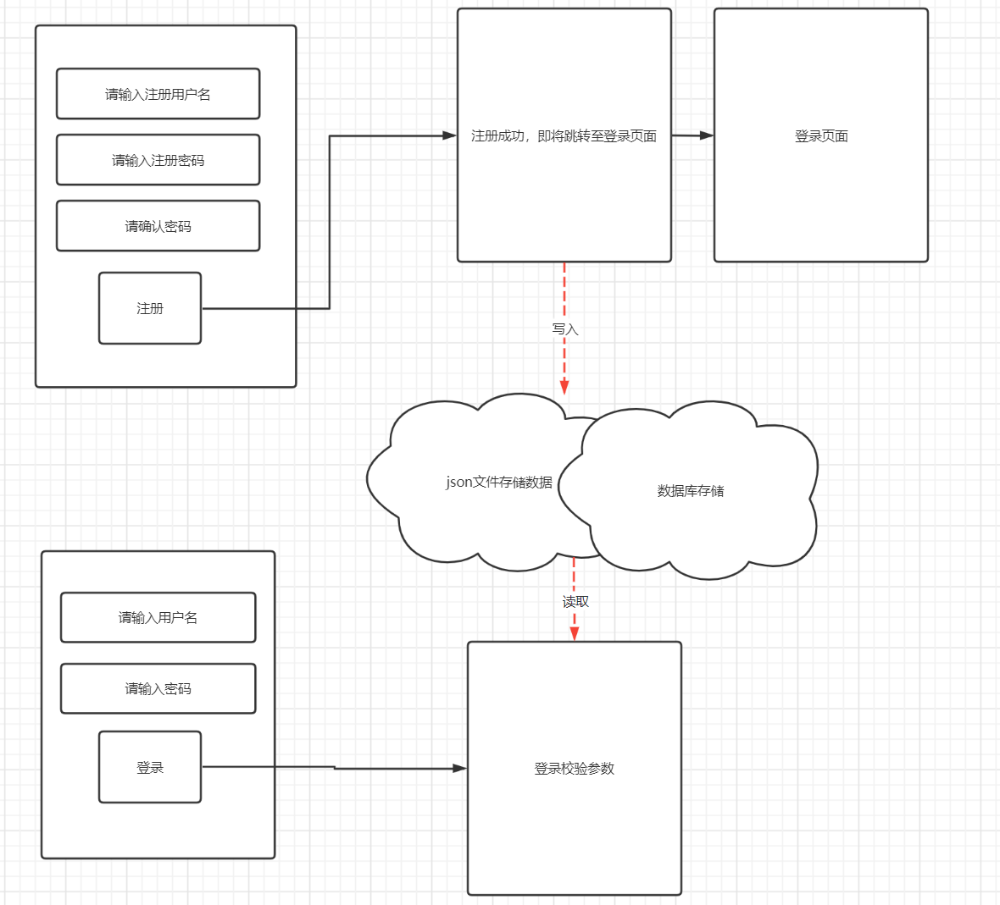
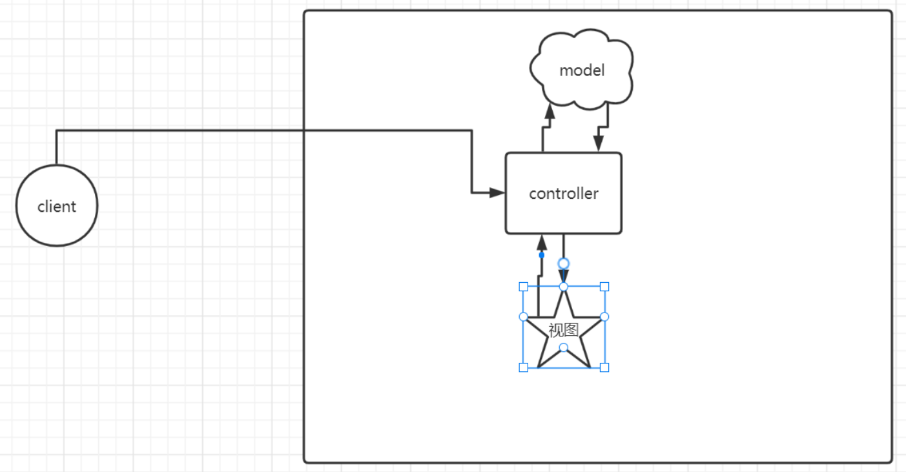
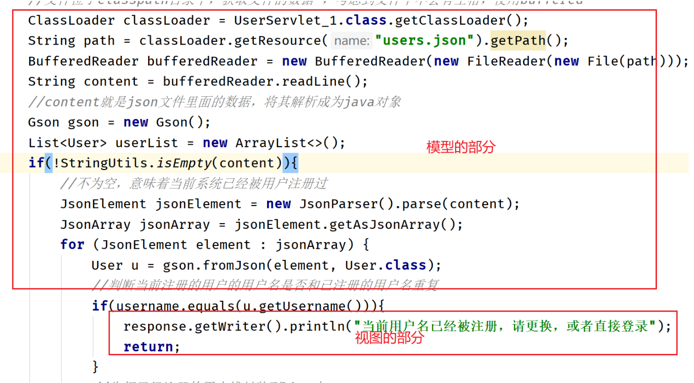
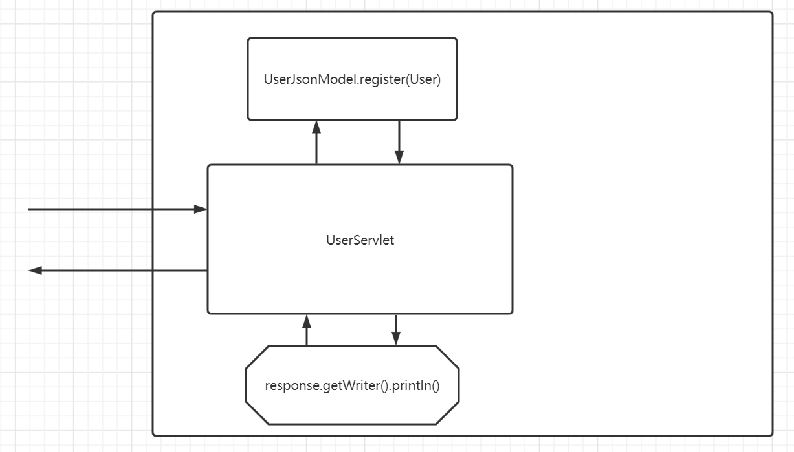
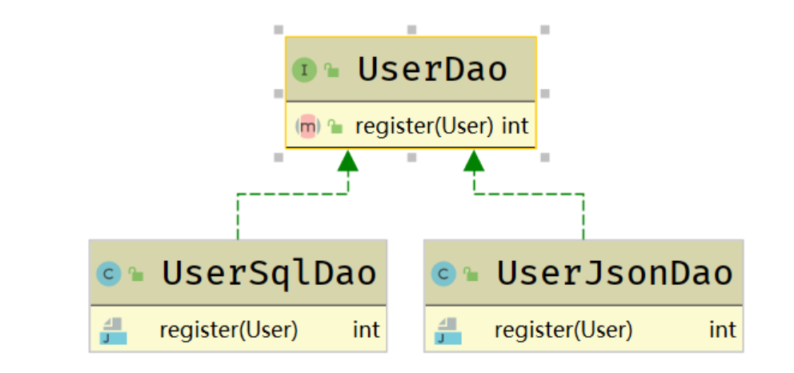
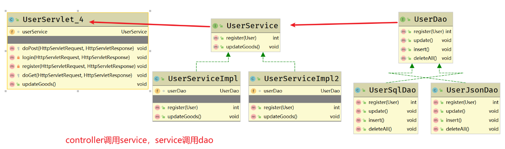
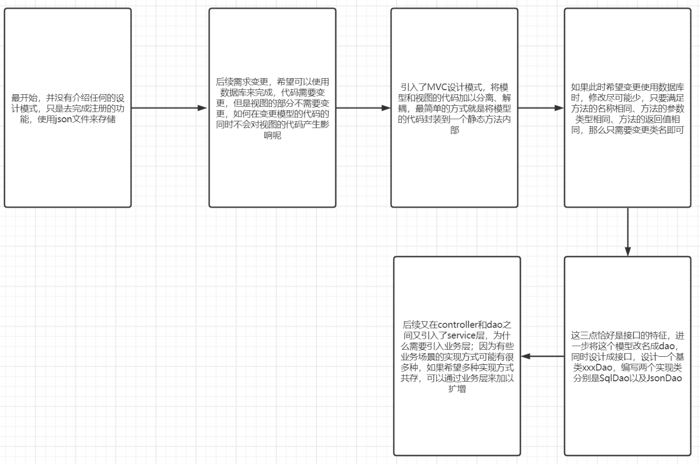

# MVC

## 注册案例

在今天的课程中，我们先不过多介绍MVC相关概念。我们首先完成一个注册登录案例。对于该案例的要求是，先使用json文件(里面存储json字符串)来充当存储方式，后续需求变更为使用数据库。



```java
package com.cskaoyan.register;

import com.google.gson.Gson;
import com.google.gson.JsonArray;
import com.google.gson.JsonElement;
import com.google.gson.JsonParser;
import org.apache.commons.lang3.StringUtils;

import javax.servlet.ServletException;
import javax.servlet.annotation.WebServlet;
import javax.servlet.http.HttpServlet;
import javax.servlet.http.HttpServletRequest;
import javax.servlet.http.HttpServletResponse;
import java.io.*;
import java.util.ArrayList;
import java.util.List;

/**
 * @ClassName ${NAME}
 * @Description: TODO
 * @Author 远志 zhangsong@cskaoyan.onaliyun.com
 * @Version V1.0
 **/
@WebServlet("/user/*")
public class UserServlet_1 extends HttpServlet {
    protected void doPost(HttpServletRequest request, HttpServletResponse response) throws ServletException, IOException {
        //首先进行方法的分发
        String requestURI = request.getRequestURI();
        String op = requestURI.replace(request.getContextPath() + "/user/", "");
        if("register".equals(op)){
            register(request, response);
        }else if("login".equals(op)){
            login(request, response);
        }
    }

    private void login(HttpServletRequest request, HttpServletResponse response) {


    }

    /**
     * 注册的业务逻辑：
     * 获取用户提交过来的请求参数，加以校验、判空、密码是否一致
     * 判断用户输入的用户名在当前注册的用户系统中是否已经被占用；如果没有使用，则可以注册，将这个用户数据追加到目前的注册用户中
     * 根据结果做出响应
     * @param request
     * @param response
     */
    private void register(HttpServletRequest request, HttpServletResponse response) throws IOException {
        //1.获取请求参数
        //只要使用的是常规form表单提交的key=value类型数据，那么就可以使用该方法
        //如果提交的是json字符串类型，需要我们自行去处理的
        String username = request.getParameter("username");
        String password = request.getParameter("password");
        String confirmPass = request.getParameter("confirmPass");
        //判空
        if(StringUtils.isEmpty(username) || StringUtils.isEmpty(password) ||StringUtils.isEmpty(confirmPass)){
            response.getWriter().println("参数不能为空");
            return;
        }
        //确认密码和密码是否一致
        if(!password.equals(confirmPass)){
            response.getWriter().println("两次密码不一致");
            return;
        }
        //执行注册的逻辑：首先存储介质使用的是json文件（要求该文件内必须存储json字符串）
        //需要获取到当前系统的注册的用户名，然后进行比对，如果没有重复，则允许注册
        //思考：技术层面。json文件中存储json字符串，应当是[{},{},{}]
        //先获取到该文件里面的数据，解析成java对象  List<User> 一一比对用户名是否相同
        //文件位于classpath目录下，获取文件的数据 ，考虑到文件中不会有空格，使用buffered
        ClassLoader classLoader = UserServlet_1.class.getClassLoader();
        String path = classLoader.getResource("users.json").getPath();
        BufferedReader bufferedReader = new BufferedReader(new FileReader(new File(path)));
        String content = bufferedReader.readLine();
        //content就是json文件里面的数据，将其解析成为java对象
        Gson gson = new Gson();
        List<User> userList = new ArrayList<>();
        if(!StringUtils.isEmpty(content)){
            //不为空，意味着当前系统已经被用户注册过
            JsonElement jsonElement = new JsonParser().parse(content);
            JsonArray jsonArray = jsonElement.getAsJsonArray();
            for (JsonElement element : jsonArray) {
                User u = gson.fromJson(element, User.class);
                //判断当前注册的用户的用户名是否和已注册的用户名重复
                if(username.equals(u.getUsername())){
                    response.getWriter().println("当前用户名已经被注册，请更换，或者直接登录");
                    return;
                }
                //先把已经注册的用户线封装到list中
                userList.add(u);
            }
        }
        //List<User>追加刚刚注册的用户，一并写回json文件中  不要考虑性能
        User register = new User();
        register.setUsername(username);
        register.setPassword(password);
        userList.add(register);
        //需要将userlist转换成json字符串，再次写回到json文件中
        FileWriter fileWriter = new FileWriter(new File(path));
        fileWriter.write(gson.toJson(userList));
        fileWriter.flush();
        fileWriter.close();
        response.getWriter().println("注册成功");
    }

    protected void doGet(HttpServletRequest request, HttpServletResponse response) throws ServletException, IOException {

    }
}
```

对上述的代码进行分析，如果今后存储介质由json文件更改为数据库，那么哪些代码需要变动，哪些代码不要变动。

```java
ClassLoader classLoader = UserServlet_1.class.getClassLoader();
        String path = classLoader.getResource("users.json").getPath();
        BufferedReader bufferedReader = new BufferedReader(new FileReader(new File(path)));
        String content = bufferedReader.readLine();
        //content就是json文件里面的数据，将其解析成为java对象
        Gson gson = new Gson();
        List<User> userList = new ArrayList<>();
        if(!StringUtils.isEmpty(content)){
            //不为空，意味着当前系统已经被用户注册过
            JsonElement jsonElement = new JsonParser().parse(content);
            JsonArray jsonArray = jsonElement.getAsJsonArray();
            for (JsonElement element : jsonArray) {
                User u = gson.fromJson(element, User.class);
                //判断当前注册的用户的用户名是否和已注册的用户名重复
                if(username.equals(u.getUsername())){
                    response.getWriter().println("当前用户名已经被注册，请更换，或者直接登录");
                    return;
                }
                //先把已经注册的用户线封装到list中
                userList.add(u);
            }
        }
        //List<User>追加刚刚注册的用户，一并写回json文件中  不要考虑性能
        User register = new User();
        register.setUsername(username);
        register.setPassword(password);
        userList.add(register);
        //需要将userlist转换成json字符串，再次写回到json文件中
        FileWriter fileWriter = new FileWriter(new File(path));
        fileWriter.write(gson.toJson(userList));
        fileWriter.flush();
        fileWriter.close();
```

上述代码需要变动，但是里面却紧密嵌套着一行不需要变更的代码，耦合性非常强。如何做到在变更代码的同时不会对不需要变更的代码产生影响呢？

```java
response.getWriter().println("当前用户名已经被注册，请更换，或者直接登录");
return;
```

## 引出MVC

MVC主要就是说了一个事情，就是将应用的代码按照模型、视图、控制加以分离解耦，分层三个模块。MVC的核心就是解耦。各个部分的功能如下：

model：数据模型和所以基于对这些数据的操作。user就充当着数据模型，对user的注册、登录等行为操作都是属于模型的

view：视图。页面。

controller：一般是在model和view之间起着一个沟通的作用，主要的目的就是为了将model和view进行解耦。

**MVC的核心思想是请求到来之后，首先交给controller来处理，处理之后调用不同的model的代码，根据model代码的返回结果，再调用不同的视图。通过这种方式，就可以实现model和view之间松散耦合。model代码变更不会对视图产生影响。**

本案例中，哪些代码分别属于什么模块呢？

*servlet此时充当的就是controller的功能。注册功能、登录功能以及相应的bean此时充当的是model的功能。向客户端输出数据此时充当的就是view的功能。*





如何解耦呢？

将模型中用户注册的相关代码封装在一个类方法内部。

```java
package com.cskaoyan.register.controller;

import com.cskaoyan.register.model.JsonModel;
import com.cskaoyan.register.model.User;
import com.google.gson.Gson;
import com.google.gson.JsonArray;
import com.google.gson.JsonElement;
import com.google.gson.JsonParser;
import org.apache.commons.lang3.StringUtils;

import javax.servlet.ServletException;
import javax.servlet.annotation.WebServlet;
import javax.servlet.http.HttpServlet;
import javax.servlet.http.HttpServletRequest;
import javax.servlet.http.HttpServletResponse;
import java.io.*;
import java.util.ArrayList;
import java.util.List;

/**
 * @ClassName ${NAME}
 * @Description: TODO
 * @Author 远志 zhangsong@cskaoyan.onaliyun.com
 * @Version V1.0
 **/
@WebServlet("/user/*")
public class UserServlet_2 extends HttpServlet {
    protected void doPost(HttpServletRequest request, HttpServletResponse response) throws ServletException, IOException {
        //首先进行方法的分发
        String requestURI = request.getRequestURI();
        String op = requestURI.replace(request.getContextPath() + "/user/", "");
        if("register".equals(op)){
            register(request, response);
        }else if("login".equals(op)){
            login(request, response);
        }
    }

    private void login(HttpServletRequest request, HttpServletResponse response) {


    }

    /**
     * 注册的业务逻辑：
     * 获取用户提交过来的请求参数，加以校验、判空、密码是否一致
     * 判断用户输入的用户名在当前注册的用户系统中是否已经被占用；如果没有使用，则可以注册，将这个用户数据追加到目前的注册用户中
     * 根据结果做出响应
     * @param request
     * @param response
     */
    private void register(HttpServletRequest request, HttpServletResponse response) throws IOException {
        //1.获取请求参数
        //只要使用的是常规form表单提交的key=value类型数据，那么就可以使用该方法
        //如果提交的是json字符串类型，需要我们自行去处理的
        String username = request.getParameter("username");
        String password = request.getParameter("password");
        String confirmPass = request.getParameter("confirmPass");
        //判空
        if(StringUtils.isEmpty(username) || StringUtils.isEmpty(password) ||StringUtils.isEmpty(confirmPass)){
            response.getWriter().println("参数不能为空");
            return;
        }
        //确认密码和密码是否一致
        if(!password.equals(confirmPass)){
            response.getWriter().println("两次密码不一致");
            return;
        }
        User register = new User();
        register.setUsername(username);
        register.setPassword(password);
        //TODO 此时将所有的代码逻辑都封装到了register方法的内部，后续如果该方法需要进一步变更，那么也不会对视图的代码产生任何影响  model
        int code = JsonModel.register(register);
        if(code == 404){
            //TODO view
            response.getWriter().println("当前用户名已经被注册，请更换，或者直接登录");
            return;
        }else if(code == 500){
            response.getWriter().println("服务器当前繁忙，请稍后再试");
            return;
        }
        response.getWriter().println("注册成功");
    }

    protected void doGet(HttpServletRequest request, HttpServletResponse response) throws ServletException, IOException {

    }
}
```

```java
package com.cskaoyan.register.model;

import com.cskaoyan.register.controller.UserServlet_2;
import com.google.gson.Gson;
import com.google.gson.JsonArray;
import com.google.gson.JsonElement;
import com.google.gson.JsonParser;
import org.apache.commons.lang3.StringUtils;

import java.io.*;
import java.util.ArrayList;
import java.util.List;

/**
 * @ClassName JsonModel
 * @Description: TODO
 * @Author 远志 zhangsong@cskaoyan.onaliyun.com
 * @Version V1.0
 **/
public class JsonModel {

    /**
     * 使用json文件来存储用户的注册信息
     * @param register
     * @return code的值如果是200表示的是注册成功；404表示的是注册失败，当前用户名已经被占用；500表示的是服务器异常
     */
    public static int register(User register){
        //执行注册的逻辑：首先存储介质使用的是json文件（要求该文件内必须存储json字符串）
        //需要获取到当前系统的注册的用户名，然后进行比对，如果没有重复，则允许注册
        //思考：技术层面。json文件中存储json字符串，应当是[{},{},{}]
        //先获取到该文件里面的数据，解析成java对象  List<User> 一一比对用户名是否相同
        //文件位于classpath目录下，获取文件的数据 ，考虑到文件中不会有空格，使用buffered
        ClassLoader classLoader = UserServlet_2.class.getClassLoader();
        String path = classLoader.getResource("users.json").getPath();
        BufferedReader bufferedReader = null;
        try {
            bufferedReader = new BufferedReader(new FileReader(new File(path)));
            String content = bufferedReader.readLine();
            //content就是json文件里面的数据，将其解析成为java对象
            Gson gson = new Gson();
            List<User> userList = new ArrayList<>();
            if(!StringUtils.isEmpty(content)){
                //不为空，意味着当前系统已经被用户注册过
                JsonElement jsonElement = new JsonParser().parse(content);
                JsonArray jsonArray = jsonElement.getAsJsonArray();
                for (JsonElement element : jsonArray) {
                    User u = gson.fromJson(element, User.class);
                    //判断当前注册的用户的用户名是否和已注册的用户名重复
                    if(register.getUsername().equals(u.getUsername())){
                        return 404;
                    }
                    //先把已经注册的用户线封装到list中
                    userList.add(u);
                }
            }
            //List<User>追加刚刚注册的用户，一并写回json文件中  不要考虑性能
            userList.add(register);
            //需要将userlist转换成json字符串，再次写回到json文件中
            FileWriter fileWriter = new FileWriter(new File(path));
            fileWriter.write(gson.toJson(userList));
            fileWriter.flush();
            fileWriter.close();
            return 200;
        } catch (FileNotFoundException e) {
            e.printStackTrace();
        } catch (IOException e) {
            e.printStackTrace();
        }
        return 500;
    }
}
```

相关的类模块关系如下：



## 设计接口

此时我们编写的代码就已经是符合MVC设计模式了。但是并不意味着是最优代码，依然有可以进一步优化的空间。我们分析代码可以发现，如果今后需求变更为使用数据库，那么代码需要做如下变动：

```java
//        int code = JsonModel.register(register);
        int code = SqlModel.register(register);
```

如果希望在这一变化过程中，所做的代码修改尽可能少，那么需要满足如下三点：

**1.无论是在JsonModel还是在SqlModel中，方法的名称全部都需要叫做register**

**2.方法的参数类型都必须是User类型**

**3.方法的返回值都应该是int类型**

满足这三点之后，我们只需要变更类名，不需改变其他部分。

接口天然具有这三点。将这个模型设计成接口，不同的实现方式分别去实现该接口。顺势将模型的操作部分改名，改成Dao（Data Access Object）专门用来处理数据相关的。

```java
package com.cskaoyan.register.dao;

import com.cskaoyan.register.model.User;

/**
 * @ClassName UserDao
 * @Description: TODO
 * @Author 远志 zhangsong@cskaoyan.onaliyun.com
 * @Version V1.0
 **/
public interface UserDao {

    int register(User user);
}
```

```java
package com.cskaoyan.register.dao;

import com.cskaoyan.register.controller.UserServlet_2;
import com.cskaoyan.register.model.User;
import com.google.gson.Gson;
import com.google.gson.JsonArray;
import com.google.gson.JsonElement;
import com.google.gson.JsonParser;
import org.apache.commons.lang3.StringUtils;

import java.io.*;
import java.util.ArrayList;
import java.util.List;

/**
 * @ClassName UserJsonDao
 * @Description: TODO
 * @Author 远志 zhangsong@cskaoyan.onaliyun.com
 * @Version V1.0
 **/
public class UserJsonDao implements UserDao {
    @Override
    public int register(User register) {
        //执行注册的逻辑：首先存储介质使用的是json文件（要求该文件内必须存储json字符串）
        //需要获取到当前系统的注册的用户名，然后进行比对，如果没有重复，则允许注册
        //思考：技术层面。json文件中存储json字符串，应当是[{},{},{}]
        //先获取到该文件里面的数据，解析成java对象  List<User> 一一比对用户名是否相同
        //文件位于classpath目录下，获取文件的数据 ，考虑到文件中不会有空格，使用buffered
        ClassLoader classLoader = UserServlet_2.class.getClassLoader();
        String path = classLoader.getResource("users.json").getPath();
        BufferedReader bufferedReader = null;
        try {
            bufferedReader = new BufferedReader(new FileReader(new File(path)));
            String content = bufferedReader.readLine();
            //content就是json文件里面的数据，将其解析成为java对象
            Gson gson = new Gson();
            List<User> userList = new ArrayList<>();
            if(!StringUtils.isEmpty(content)){
                //不为空，意味着当前系统已经被用户注册过
                JsonElement jsonElement = new JsonParser().parse(content);
                JsonArray jsonArray = jsonElement.getAsJsonArray();
                for (JsonElement element : jsonArray) {
                    User u = gson.fromJson(element, User.class);
                    //判断当前注册的用户的用户名是否和已注册的用户名重复
                    if(register.getUsername().equals(u.getUsername())){
                        return 404;
                    }
                    //先把已经注册的用户线封装到list中
                    userList.add(u);
                }
            }
            //List<User>追加刚刚注册的用户，一并写回json文件中  不要考虑性能
            userList.add(register);
            //需要将userlist转换成json字符串，再次写回到json文件中
            FileWriter fileWriter = new FileWriter(new File(path));
            fileWriter.write(gson.toJson(userList));
            fileWriter.flush();
            fileWriter.close();
            return 200;
        } catch (FileNotFoundException e) {
            e.printStackTrace();
        } catch (IOException e) {
            e.printStackTrace();
        }
        return 500;
    }
}
```

```java
package com.cskaoyan.register.dao;

import com.cskaoyan.register.model.User;

/**
 * @ClassName UserSqlDao
 * @Description: TODO
 * @Author 远志 zhangsong@cskaoyan.onaliyun.com
 * @Version V1.0
 **/
public class UserSqlDao implements UserDao {
    @Override
    public int register(User user) {

        return 0;
    }
}
```

类继承关系如下



优化后的代码如下：

```java
package com.cskaoyan.register.controller;

import com.cskaoyan.register.dao.UserDao;
import com.cskaoyan.register.dao.UserJsonDao;
import com.cskaoyan.register.model.SqlModel_deprecate;
import com.cskaoyan.register.model.User;
import org.apache.commons.lang3.StringUtils;

import javax.servlet.ServletException;
import javax.servlet.annotation.WebServlet;
import javax.servlet.http.HttpServlet;
import javax.servlet.http.HttpServletRequest;
import javax.servlet.http.HttpServletResponse;
import java.io.IOException;

/**
 * @ClassName ${NAME}
 * @Description: TODO
 * @Author 远志 zhangsong@cskaoyan.onaliyun.com
 * @Date 2022/6/7 10:59
 * @Version V1.0
 **/
@WebServlet("/user/*")
public class UserServlet_3 extends HttpServlet {

    //下面这行代码很关键，如果注册的时候，我使用的存储介质是json文件，那么应当使用jsondao，那么登录的时候，是不是也应当从json中去读取，所以也应当使用jsondao，所以下面这行代码可以写成成员变量
    //一旦将其写成成员变量之后，那么后续存储介质再次发生变更时，方法内部的代码一行都不需要变更，只需要变更该指向即可
    UserDao userDao = new UserJsonDao();


    protected void doPost(HttpServletRequest request, HttpServletResponse response) throws ServletException, IOException {
        //首先进行方法的分发
        String requestURI = request.getRequestURI();
        String op = requestURI.replace(request.getContextPath() + "/user/", "");
        if("register".equals(op)){
            register(request, response);
        }else if("login".equals(op)){
            login(request, response);
        }
    }

    private void login(HttpServletRequest request, HttpServletResponse response) {


    }

    /**
     * 注册的业务逻辑：
     * 获取用户提交过来的请求参数，加以校验、判空、密码是否一致
     * 判断用户输入的用户名在当前注册的用户系统中是否已经被占用；如果没有使用，则可以注册，将这个用户数据追加到目前的注册用户中
     * 根据结果做出响应
     * @param request
     * @param response
     */
    private void register(HttpServletRequest request, HttpServletResponse response) throws IOException {
        //1.获取请求参数
        //只要使用的是常规form表单提交的key=value类型数据，那么就可以使用该方法
        //如果提交的是json字符串类型，需要我们自行去处理的
        String username = request.getParameter("username");
        String password = request.getParameter("password");
        String confirmPass = request.getParameter("confirmPass");
        //判空
        if(StringUtils.isEmpty(username) || StringUtils.isEmpty(password) ||StringUtils.isEmpty(confirmPass)){
            response.getWriter().println("参数不能为空");
            return;
        }
        //确认密码和密码是否一致
        if(!password.equals(confirmPass)){
            response.getWriter().println("两次密码不一致");
            return;
        }
        User register = new User();
        register.setUsername(username);
        register.setPassword(password);
        //TODO 此时将所有的代码逻辑都封装到了register方法的内部，后续如果该方法需要进一步变更，那么也不会对视图的代码产生任何影响  model
        int code = userDao.register(register);
        if(code == 404){
            //TODO view
            response.getWriter().println("当前用户名已经被注册，请更换，或者直接登录");
            return;
        }else if(code == 500){
            response.getWriter().println("服务器当前繁忙，请稍后再试");
            return;
        }
        response.getWriter().println("注册成功");
    }

    protected void doGet(HttpServletRequest request, HttpServletResponse response) throws ServletException, IOException {

    }
}
```

```java
UserDao userDao = new UserJsonDao();
```

将这行代码写成成员变量的目的：

1.如果注册时使用的是一种存储介质，那么登录时也应当使用的是相同的存储介质，两者是一致的，为了避免频繁去编写该行代码，可以将其写成成员变量

2.将其写成成员变量之后，后续存储介质再次发生任何修改，都不会对方法内部的代码产生任何影响。只需要变更成员变量即可。

## 三层架构

我们的业务代码在上述的优化过程中，已经符合了MVC设计模式的思想。但是，代码依然可以进一步演化，将模型相关代码逻辑进行进一步解耦分离。也就是之前Dao的代码进一步抽象成service和dao。三层架构分别指的是展示层、业务层、数据层。其中，展示层由controller和view组合在一起；数据层由Dao方法来充当；还有中间的业务层。通常情况下，你也可以简单的理解为controller、service、dao三层。

**为什么还需要有业务层呢？**

在后续项目开发过程中，我们需要去做一个电商网站，电商网站可以分为前台系统，供消费者使用；还有后台管理系统，供网站工作人员使用。后台管理系统的主要功能是给前台系统提供支持和保障。前台用户系统中的商品是在后台管理系统中由工作人员录入。在后台管理系统中可以对商品进行编辑等。比如假设iphone13商品的规格有绿色、红色、黑色。后续又上架了一个新的配色粉色，此时我需要在原商品页面进行剪辑，重新增加一个新的规格；又或者新进了一批货，原有的规格数量又有增加。此时依然需要修改原有规格。

针对商品规格的修改，应该如何来实现呢？

从上面的描述可以得知，有的规格是无需变化的，有的规格是新增的，有的规格是需要修改数据的。应该如何操作呢？

此时我们可以有两种思路：

思路一：将原先的规格全部删除， 然后将这些修改之后的规格再次插入到数据库中

思路二：新增的规格是没有编号的，而修改的规格是包含商品编号的。我们可以采取有编号的执行修改操作，没有编号的执行插入操作

这两种思路都可以解决当前问题，那么接下来，如果我需要评估一下两者性能，代码应当如何编写？

```java
/**
     * 当我们需要在两种实现方式中进行变更时，我们依然需要频繁的进行修改现有代码逻辑
     * 开闭原则：对于新增时开放的；对于修改是关闭的
     * 尽量当需求发生变更时，不要过分地去修改现有的代码逻辑；而是尽可能去新增一个新的实现方式
     */
    public void updateGoods(){
        long begin = System.currentTimeMillis();
        //进行操作
        //方式一：
        userDao.update();
        userDao.insert();
        //方式二：
//        userDao.deleteAll();
//        userDao.insert();
        long end = System.currentTimeMillis();
        System.out.println(end - begin);
    }
```

我们可以再中间引入service业务层。引入service层最大的好处是今后需求变更时更多的是扩增而不是修改。

符合开闭原则：对新增是开放的，对于修改是关闭的。



```java
package com.cskaoyan.register.controller;

import com.cskaoyan.register.dao.UserDao;
import com.cskaoyan.register.dao.UserJsonDao;
import com.cskaoyan.register.model.User;
import com.cskaoyan.register.service.UserService;
import com.cskaoyan.register.service.UserServiceImpl;
import org.apache.commons.lang3.StringUtils;

import javax.servlet.ServletException;
import javax.servlet.annotation.WebServlet;
import javax.servlet.http.HttpServlet;
import javax.servlet.http.HttpServletRequest;
import javax.servlet.http.HttpServletResponse;
import java.io.IOException;

/**
 * @ClassName ${NAME}
 * @Description: TODO
 * @Author 远志 zhangsong@cskaoyan.onaliyun.com
 * @Version V1.0
 **/
@WebServlet("/user/*")
public class UserServlet_4 extends HttpServlet {

    //下面这行代码很关键，如果注册的时候，我使用的存储介质是json文件，那么应当使用jsondao，那么登录的时候，是不是也应当从json中去读取，所以也应当使用jsondao，所以下面这行代码可以写成成员变量
    //一旦将其写成成员变量之后，那么后续存储介质再次发生变更时，方法内部的代码一行都不需要变更，只需要变更该指向即可
//    UserDao userDao = new UserJsonDao();

    UserService userService = new UserServiceImpl();


    protected void doPost(HttpServletRequest request, HttpServletResponse response) throws ServletException, IOException {
        //首先进行方法的分发
        String requestURI = request.getRequestURI();
        String op = requestURI.replace(request.getContextPath() + "/user/", "");
        if("register".equals(op)){
            register(request, response);
        }else if("login".equals(op)){
            login(request, response);
        }
    }

    private void login(HttpServletRequest request, HttpServletResponse response) {
//        userDao.login();

    }

    /**
     * 注册的业务逻辑：
     * 获取用户提交过来的请求参数，加以校验、判空、密码是否一致
     * 判断用户输入的用户名在当前注册的用户系统中是否已经被占用；如果没有使用，则可以注册，将这个用户数据追加到目前的注册用户中
     * 根据结果做出响应
     * @param request
     * @param response
     */
    private void register(HttpServletRequest request, HttpServletResponse response) throws IOException {
        //1.获取请求参数
        //只要使用的是常规form表单提交的key=value类型数据，那么就可以使用该方法
        //如果提交的是json字符串类型，需要我们自行去处理的
        String username = request.getParameter("username");
        String password = request.getParameter("password");
        String confirmPass = request.getParameter("confirmPass");
        //判空
        if(StringUtils.isEmpty(username) || StringUtils.isEmpty(password) ||StringUtils.isEmpty(confirmPass)){
            response.getWriter().println("参数不能为空");
            return;
        }
        //确认密码和密码是否一致
        if(!password.equals(confirmPass)){
            response.getWriter().println("两次密码不一致");
            return;
        }
        User register = new User();
        register.setUsername(username);
        register.setPassword(password);
        //TODO 此时将所有的代码逻辑都封装到了register方法的内部，后续如果该方法需要进一步变更，那么也不会对视图的代码产生任何影响  model
        int code = userService.register(register);
        if(code == 404){
            //TODO view
            response.getWriter().println("当前用户名已经被注册，请更换，或者直接登录");
            return;
        }else if(code == 500){
            response.getWriter().println("服务器当前繁忙，请稍后再试");
            return;
        }
        response.getWriter().println("注册成功");
    }

    protected void doGet(HttpServletRequest request, HttpServletResponse response) throws ServletException, IOException {

    }


    /**
     * 当我们需要在两种实现方式中进行变更时，我们依然需要频繁的进行修改现有代码逻辑
     * 开闭原则：对于新增时开放的；对于修改是关闭的
     * 尽量当需求发生变更时，不要过分地去修改现有的代码逻辑；而是尽可能去新增一个新的实现方式
     */
    public void updateGoods(){
        long begin = System.currentTimeMillis();
       /* //进行操作
        //方式一：
        userDao.update();
        userDao.insert();
        //方式二：
//        userDao.deleteAll();
//        userDao.insert();*/
       userService.updateGoods();
        long end = System.currentTimeMillis();
        System.out.println(end - begin);
    }
}
```

```java
package com.cskaoyan.register.service;

import com.cskaoyan.register.model.User;

/**
 * @ClassName UserService
 * @Description: TODO
 * @Author 远志 zhangsong@cskaoyan.onaliyun.com
 * @Date 2022/6/7 14:54
 * @Version V1.0
 **/
public interface UserService {

    int register(User user);

    void updateGoods();
}
```

```java
package com.cskaoyan.register.service;

import com.cskaoyan.register.dao.UserDao;
import com.cskaoyan.register.dao.UserJsonDao;
import com.cskaoyan.register.model.User;
import org.w3c.dom.UserDataHandler;

/**
 * @ClassName UserServiceImpl
 * @Description: TODO
 * @Author 远志 zhangsong@cskaoyan.onaliyun.com
 * @Version V1.0
 **/
public class UserServiceImpl implements UserService {

    UserDao userDao = new UserJsonDao();

    @Override
    public int register(User user) {
        return userDao.register(user);
    }

    @Override
    public void updateGoods() {
        //方式一的实现方式
        userDao.update();
        userDao.insert();

    }
}
```

```java
package com.cskaoyan.register.service;

import com.cskaoyan.register.dao.UserDao;
import com.cskaoyan.register.dao.UserJsonDao;
import com.cskaoyan.register.model.User;

/**
 * @ClassName UserServiceImpl
 * @Description: TODO
 * @Author 远志 zhangsong@cskaoyan.onaliyun.com
 * @Version V1.0
 **/
public class UserServiceImpl2 implements UserService {

    UserDao userDao = new UserJsonDao();

    @Override
    public int register(User user) {
        return userDao.register(user);
    }

    @Override
    public void updateGoods() {
        userDao.deleteAll();
        userDao.insert();
    }
}
```

## 架构演进历程



业务代码调用顺序：

**controller（servlet）调用service，service调用dao**

三层架构类比为汽车的生产过程：

**controller：类似于汽车的4s门店。负责接收客户端的请求，做一些校验、紧接着调用业务层代码，根据业务层代码的返回值调用视图**

**service：类似于汽车的生产组装车间。汽车需要很多零部件，零部件生成在零部件生产车间生成的，但是组装在组装车间进行一并组装。执行每个功能具体的业务逻辑，如果需要操作数据库，那么发起一个数据库方法调用。比如新增商品，一张商品表、一张规格表，具体的操作过程应当写在service层，数据层只是负责去发起一个dao方法调用。**

**dao：零部件的车间。只是去负责维护一个一个的dao方法来供service调用。所以整个请求的处理过程中，service层是权重最高的地方。**


易混淆概念

**符合MVC设计模式的代码不一定是三层架构的**

**但是如果是三层架构的代码，那么一定是符合MVC设计模式的**