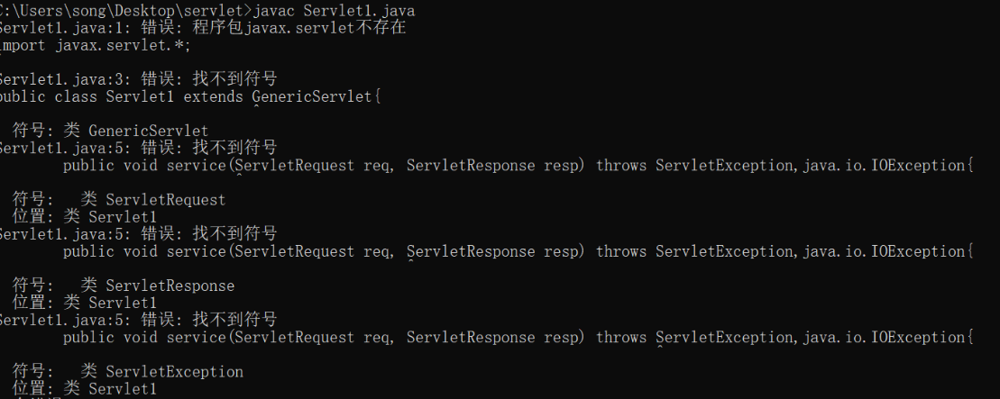
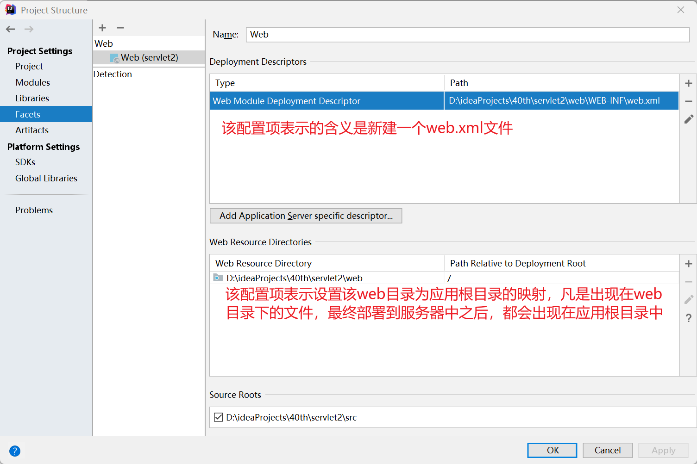

# Servlet

JavaEE阶段参考资料地址：https://tomcat.apache.org/tomcat-8.5-doc/servletapi/

JavaEE阶段，全称为Enterprise Edition。即java企业级开发，使用java语言来进行企业级项目的开发工作。企业级项目具有如下特征：通过web进行通讯访问、系统比较复杂、需要获取客户的信息等。利用SE阶段的API的确可以完成上述内容，但是过于繁琐。EE可以理解为是在SE的基础上做了进一步的封装，可以非常方便地去完成企业级开发需要的功能。

如下图所示是EE阶段的架构图。在前面的课程中，我们学到我们只需要在tomcat服务器中部署一个静态资源文件，通过浏览器访问那么便可以访问到对应的文件，便是如下图所示的过程。浏览器根据用户输入的地址发送HTTP请求，到达服务器，被服务器所解析处理，随后将文件数据通过HTTP响应报文返回给浏览器。tomcat不仅仅可以部署静态资源，还可以部署程序，也就是动态资源，也就是今天学习的Servlet。


## 概念

Servlet是和一个合成词。Servlet = Server + applet.Servlet其实就是运行在服务器里面的一个java小程序，也就是我们所说的服务器开发。即在服务器软件中编写代码，运行。

> Defines methods that all servlets must implement.
>
> Servlet是一个接口。我们如果要编写Servlet，那么必须要实现该接口。
>
> A servlet is a small Java program that runs within a Web server. Servlets receive and respond to requests from Web clients, usually across HTTP, the HyperText Transfer Protocol.
>
> Servlet是一个运行在服务器中的java小程序。Servlet接收网络客户端的请求，并且对其做出响应。大多数情况下是通过HTTP协议。
>
> To implement this interface, you can write a generic servlet that extends `javax.servlet.GenericServlet` or an HTTP servlet that extends `javax.servlet.http.HttpServlet`.
>
> 可以通过继承GeneiricServlet或者通过继承HttpServlet的方式来实现该接口。
>
> This interface defines methods to initialize a servlet, to service requests, and to remove a servlet from the server. These are known as life-cycle methods and are called in the following sequence:
>
> 1. The servlet is constructed, then initialized with the `init` method.
> 2. Any calls from clients to the `service` method are handled.
> 3. The servlet is taken out of service, then destroyed with the `destroy` method, then garbage collected and finalized.
>
> Servlet定义了一些方法，分别可以初始化Servlet、给请求提供服务、将Servlet从服务器中移除。这些被称之为生命周期方法，并且依次被按照如下顺序被调用：
>
>   1.当Servlet对象被创建，通过调用init方法来完成一些初始化操作
>
>   2.客户端的任何请求都会交给service方法来处理
>
>   3.Servlet不再发挥功能，会通过调用destroy方法来完成销毁，然后会被垃圾回收。

## 开发Servlet

- **编写Servlet**

  ```java
  import javax.servlet.*;
  
  public class Servlet1 extends GenericServlet{
  
  	public void service(ServletRequest req, ServletResponse resp) throws ServletException,java.io.IOException{
  			System.out.println("servlet1");
  	}
  }
  ```

  不使用idea，根据Servlet的定义，编写一个类继承GenericServlet.

- **编译代码**

  通过javac指令进行编译，会出错

  

  **为什么会出现编译找不到符号的问题呢？**

  大家都知道，JDK中的类全部都在硬盘上面，但是运行时却可以找到该类，说明了这些类被加载到了内存中。类是如何被加载到内存中的呢？类是由类加载器负责加载到内存中的。java中的类加载器分为三类：

  ​	1.BootStrap类加载器：负责加载JDK中的核心类库

  ​	2.Extension类加载器：负责加载JDK中ext目录下的核心类库

  ​	3.System类加载器：它负责将用户类路径 (java -classpath所指的目录，即当前类所在路径及其引用的第三方类库的路径)下的类库 加载到内存中。

  **因此，我们编写的代码可以通过javac -classpath  xxx.jar FirstServlet.java来进行编译。**

- **运行代码**

  通过java指令进行运行，却无法运行，为什么？因为通过java指令运行需要有main方法，但是在我们编写的Servlet中，没有main方法。

  回顾一下之前Servlet的定义。Servlet是运行在服务器中的java小程序。所以，我们编写的Servlet必须得放置在服务器中才可以运行。如何将Servlet放置在服务器中运行呢？**需要将Class文件部署在服务器中**。

  - **部署Servlet**

    采用虚拟映射的方式来设置一个应用，Class文件存放在应用中。

    Tomcat的conf/Catalina/localhost目录下新建ee.xml文件

    ```xml
    <?xml version="1.0" encoding="UTF-8"?>
    <Context docBase="C:\Users\song\Desktop\servlet" />
    ```

    

    **通过http://localhost:8080/ee/FirstServlet.class来访问，但是此时是下载该文件，而不是运行该文件。此外，服务器的源代码可以被客户端下载到本地，存在很大的风险。**

  - **设置WEB-INF目录**

    服务器上面的源代码如果想要不被客户端直接访问到，则可以将文件放置在WEB-INF目录下。该目录下的文件不可以通过浏览器直接访问的方式访问到。但是将class文件放置到WEB-INF目录下之后，依然没有解决如何让服务器运行该类的问题。

    我们采取的方式是给Servlet设置一个映射。当访问指定路径时，那么服务器便会运行对应的Servlet。

    

  - **设置映射**

    如果需要设置映射关系，那么需要满足一些条件。**首先，class文件必须放置于WEB-INF/classes目录中；其次，在WEB-INF下还需要有web.xml文件用来配置映射关系；最后，如果class文件运行还需要一些其他的类库，则还需要将jar包放置在WEB-INF/lib目录中(目前暂不需要)**

    web.xml文件配置映射关系

    servlet-name 可以随意设置

    servlet-class 全类名类

    url-pattern 设置访问的映射

    ```xml
    <?xml version="1.0" encoding="UTF-8"?>
    <!--
     Licensed to the Apache Software Foundation (ASF) under one or more
      contributor license agreements.  See the NOTICE file distributed with
      this work for additional information regarding copyright ownership.
      The ASF licenses this file to You under the Apache License, Version 2.0
      (the "License"); you may not use this file except in compliance with
      the License.  You may obtain a copy of the License at
    
          http://www.apache.org/licenses/LICENSE-2.0
    
      Unless required by applicable law or agreed to in writing, software
      distributed under the License is distributed on an "AS IS" BASIS,
      WITHOUT WARRANTIES OR CONDITIONS OF ANY KIND, either express or implied.
      See the License for the specific language governing permissions and
      limitations under the License.
    -->
    <web-app xmlns="http://xmlns.jcp.org/xml/ns/javaee"
      xmlns:xsi="http://www.w3.org/2001/XMLSchema-instance"
      xsi:schemaLocation="http://xmlns.jcp.org/xml/ns/javaee
                          http://xmlns.jcp.org/xml/ns/javaee/web-app_3_1.xsd"
      version="3.1"
      metadata-complete="true">
    
      <servlet>
        <servlet-name>first</servlet-name>
        <servlet-class>FirstServlet</servlet-class>
      </servlet>
      <servlet-mapping>
        <servlet-name>first</servlet-name>
          <url-pattern>/ss1</url-pattern>
      </servlet-mapping>
    </web-app>
    ```

    如何访问？

    http://localhost:8080/ee/ss1

## Servlet运行过程

以浏览器输入http://localhost:8080/ee/ss1

1.域名解析

2.TCP连接建立socket（clientAdd clientPort serverAdd serverPort）

3.发送HTTP请求报文（GET /app/ss1 HTTP/1.1.....）

4.请求报文到达服务器之后，被监听着8080端口号的程序Connector接收到,将请求报文解析成为reqeust对象，同时提供一个response对象

5.Connector随即将这两个对象传给engine，engine进一步传给host

6.host根据请求的资源地址，去挑选一个合适的Context，尝试将/app当做一个应用去解析，如果找到，则将这两个对象进行进一步传递

**7.Context内部根据输入的地址/ss1，查看有没有servlet相关的映射，如果找到，则利用反射调用servlet的service方法，service方法运行时需要传递两个参数，那么刚好这两个对象作为参数传递进入service方法**

8.service方法运行，可以从request中读取请求报文信息，也可以从往response中写入相关的数据

9.Connector会读取response里面的数据，然后生成HTTP响应报文，传输给客户端，客户端将响应报文进行解析渲染，最终呈现出页面

## IDEA开发Servlet

### 新建Web项目

第一步：


第二步：


第三步：


第四步：配置tomcat


java文件以及html文件等如果发生了修改，那么必须让其生效。选择debug或者run按钮，再次点击，会出现一个对话框。建议每次都选择第三个重新部署。文件便会发生修改。


### 继承HttpServlet

> Provides an abstract class to be subclassed to create an HTTP servlet suitable for a Web site. A subclass of `HttpServlet` must override at least one method, usually one of these:
>
> - **`doGet`, if the servlet supports HTTP GET requests**
> - **`doPost`, for HTTP POST requests**
> - `doPut`, for HTTP PUT requests
> - `doDelete`, for HTTP DELETE requests
> - `init` and `destroy`, to manage resources that are held for the life of the servlet
> - `getServletInfo`, which the servlet uses to provide information about itself
>
>  继承HttpServlet这种方式必须实现重写doGet、doPost、doPut、doDelete、init和destroy、getServletInfo中的一种或者多种

```java
package com.cskaoyan.servlet;

import javax.servlet.ServletException;
import javax.servlet.http.HttpServlet;
import javax.servlet.http.HttpServletRequest;
import javax.servlet.http.HttpServletResponse;
import java.io.IOException;

/**
 * @ClassName Servlet3
 * @Description:
 * 根据文档中的说明：
 * 如果你希望编写一个继承HttpServlet的servlet
 * 那么你应当做如下事情：
 * 如果你需要支持get请求方法，那么应当重写doGet
 * 如果你需要支持post请求方法，那么应当重写doPost
 * @Author 远志 zhangsong@cskaoyan.onaliyun.com
 * @Version V1.0
 **/
public class Servlet3 extends HttpServlet {

    //如果往当前servelt发送的是get请求那么会进入该方法中
    @Override
    protected void doGet(HttpServletRequest req, HttpServletResponse resp) throws ServletException, IOException {
 //super不要保留
//        super.doGet(req, resp);
        System.out.println("get");
    }

    //如果往当前servelt发送的是post请求那么会进入该方法中
    @Override
    protected void doPost(HttpServletRequest req, HttpServletResponse resp) throws ServletException, IOException {
//        super.doPost(req, resp);
        System.out.println("post");
    }
}
```

```xml
<?xml version="1.0" encoding="UTF-8"?>
<web-app xmlns="http://xmlns.jcp.org/xml/ns/javaee"
         xmlns:xsi="http://www.w3.org/2001/XMLSchema-instance"
         xsi:schemaLocation="http://xmlns.jcp.org/xml/ns/javaee http://xmlns.jcp.org/xml/ns/javaee/web-app_4_0.xsd"
         version="4.0">
    <servlet>
        <servlet-name>servlet2</servlet-name>
        <servlet-class>com.cskaoyan.servlet.Servlet2</servlet-class>
    </servlet>
    <servlet-mapping>
        <servlet-name>servlet2</servlet-name>
        <url-pattern>/ss2</url-pattern>
    </servlet-mapping>

    <servlet>
        <servlet-name>servlet3</servlet-name>
        <servlet-class>com.cskaoyan.servlet.Servlet3</servlet-class>
    </servlet>
    <servlet-mapping>
        <servlet-name>servlet3</servlet-name>
        <url-pattern>/ss3</url-pattern>
    </servlet-mapping>
</web-app>
```

**问题：如何访问上述Servlet中的doGet或者doPost方法？**

**根据文档说明，只需要以get或者post请求方法，访问当前servlet即可。如果想要访问doGet方法，那么只需要在浏览器地址栏直接输入当前servlet的地址即可；如果想要访问doPost方法，那么需要通过一个form表单，点击提交按钮时，以post请求方法向当前servlet提交请求。**


**问题：Servlet接口中定义了service方法，但是为什么在继承HttpServlet的servlet中却没有service方法？**

**所有的servlet都有service方法。如果在某个servlet中没有发现有service方法，那么只能说明该方法在父类中，它继承了父类的。**


**问题：servlet的程序执行入口是service方法，为什么在继承HttpServlet的servlet中却是doXXX方法？**

**根据servlet请求处理流程，任何servlet的程序执行入口都是serivice方法。**在**继承HttpServlet的servlet中，却变成了doXXX方法，主要是根据当前请求方法的不同，又做了进一步的分发。**

入口代码：

这段代码的主要逻辑是将这两个参数做了向下转型，然后调用了自身的service方法

```java
public void service(ServletRequest req, ServletResponse res) throws ServletException, IOException {
        HttpServletRequest request;
        HttpServletResponse response;
        try {
            request = (HttpServletRequest)req;
            response = (HttpServletResponse)res;
        } catch (ClassCastException var6) {
            throw new ServletException("non-HTTP request or response");
        }

        this.service(request, response);
    }
```

这段代码的主要逻辑是根据请求方法的不同，分发到servlet的对应方法中。

```java
protected void service(HttpServletRequest req, HttpServletResponse resp) throws ServletException, IOException {
        String method = req.getMethod();
        long lastModified;
        if (method.equals("GET")) {
            lastModified = this.getLastModified(req);
            if (lastModified == -1L) {
                this.doGet(req, resp);
            } else {
                long ifModifiedSince;
                try {
                    ifModifiedSince = req.getDateHeader("If-Modified-Since");
                } catch (IllegalArgumentException var9) {
                    ifModifiedSince = -1L;
                }

                if (ifModifiedSince < lastModified / 1000L * 1000L) {
                    this.maybeSetLastModified(resp, lastModified);
                    this.doGet(req, resp);
                } else {
                    resp.setStatus(304);
                }
            }
        } else if (method.equals("HEAD")) {
            lastModified = this.getLastModified(req);
            this.maybeSetLastModified(resp, lastModified);
            this.doHead(req, resp);
        } else if (method.equals("POST")) {
            this.doPost(req, resp);
        } else if (method.equals("PUT")) {
            this.doPut(req, resp);
        } else if (method.equals("DELETE")) {
            this.doDelete(req, resp);
        } else if (method.equals("OPTIONS")) {
            this.doOptions(req, resp);
        } else if (method.equals("TRACE")) {
            this.doTrace(req, resp);
        } else {
            String errMsg = lStrings.getString("http.method_not_implemented");
            Object[] errArgs = new Object[]{method};
            errMsg = MessageFormat.format(errMsg, errArgs);
            resp.sendError(501, errMsg);
        }

    }
```


**问题：为什么需要根据请求方法不同，分发到不同的方法中？**

可以将程序进行更精细的控制。比如设置登录方法仅允许使用post请求方法进行提交，如果用户使用get请求方法（用户可以通过自行编写代码、使用一些专门的发送请求的工具），那么此时程序不会有任何响应。

### Servlet原理图

每当有一个客户端发送HTTP请求访问当前servlet，那么服务器便会分配一个线程给当前请求，在这个线程中调用servlet的service方法

如果编写Servlet的方式是通过继承HttpServlet来实现，那么还会有后续虚线标注的部分。还会根据当前请求方法的不同，分发到不同的方法中


### 使用注解配置映射关系

编写Servlet可以通过继承GenericServlet或者HttpServlet，但是最终servlet需要被运行，必须得配置映射关系。映射关系不仅可以使用web.xml方式来进行配置，还可以使用注解的方式。

```java
package com.cskaoyan.servlet;

import javax.servlet.ServletException;
import javax.servlet.annotation.WebServlet;
import javax.servlet.http.HttpServlet;
import javax.servlet.http.HttpServletRequest;
import javax.servlet.http.HttpServletResponse;
import java.io.IOException;

/**
 * @ClassName Servlet4
 * @Description: TODO
 * @Author 远志 zhangsong@cskaoyan.onaliyun.com
 * @Version V1.0
 **/
//@WebServlet(name = "servlet4", urlPatterns = "/ss4")
//可以将上述注解进行进一步简化
//@WebServlet(urlPatterns = "/ss4")
//还可以进一步简化，如果注解的括号内只有单个的值，那么表示的是就是url-pattern
@WebServlet("/ss4")
public class Servlet4 extends HttpServlet {

    @Override
    protected void doGet(HttpServletRequest req, HttpServletResponse resp) throws ServletException, IOException {
        System.out.println("444");
    }

    @Override
    protected void doPost(HttpServletRequest req, HttpServletResponse resp) throws ServletException, IOException {

    }
}
```

## IDEA和Tomcat整合方式

使用IDEA开发Servlet时，简化了很多步骤。虽然方便了我们的开发工作，但是很多细节我们不是特别了解，如果出现了问题，我们不清楚如何排查。

IDEA会关联本地tomcat，利用tomcat来进行部署。回顾一下，部署资源的方式可以分为直接部署、虚拟映射两种，但是无论哪一种，在本地tomcat中都没有找到相应的配置。

那么IDEA是如何和tomcat关联的呢？我们需要利用一个配置信息


**CATALINA_BASE，该地址可以理解为IDEA会复制本地tomcat的配置文件到此处，然后利用这些新的配置文件重新开启一个新的tomcat（这个作为结论记住即可，不是我们现阶段需要掌握的知识点）。**

在conf/Catalina/localhost目录下，可以发现有一个xml文件，利用虚拟映射来部署应用。

xml文件的内容：

```xml
<Context path="/servlet2" docBase="D:\ideaProjects\40th\servlet2\out\artifacts\servlet2_war_exploded" />
```

我们之前推测web目录是应用的根目录，但是根据docBase指向的地址发现是位于out目录中。这两个目录虽然不是同一个，但是两者之间也是存在着某种联系。


问题：web目录和应用根目录有何联系？回答这个问题，我们需要对IDEA的一些配置有一个了解。选中项目，点击open module settings




上述web目录主要的作用是为了开发阶段存放静态资源文件方便。在团队合作时，一个开发者只需要将项目的开发环境分享给另一个开发者，那么另外的开发者就可以利用直接配置重新生成应用根目录，可以开发、可以部署运行，非常方便。


经过这个配置之后，无论class文件以及静态资源文件都会妥善地放置在特定的位置。最后再利用tomcat来部署该应用。


总结：通过上述配置项，我们可以发现，web目录并不是我们的应用根目录，只是为了方便我们在开发阶段存放静态资源文件方便。我们放置在web目录下的静态资源文件，最终就会同步出现在应用根目录中。但是，大家要清楚，这两个目录不是同一个目录。

如果在开发阶段遇到一些问题，比如在web目录中新建了一个html文档，但是在访问时显示404.此时大家一定要记得去应用根目录中去查看，应用根目录在哪？


一般情况下出现该问题，解决办法可以采用如下方式：

**首先将out目录全部删除，然后执行Build-rebuild project，最后再次点击redeploy来进行重新部署究竟可以解决该问题。**


## SE项目改造成EE项目


pom.xml文件设置packaging war

src\main目录下新建webapp目录

pom.xml文件中引入Servlet依赖


右键项目-----open module settings-------artifacts

如果可以看到war包，war包展开形式这两个部署的形式，那么便是成功


配置tomcat来部署应用：


选择+，选择Tomcat Server


## Servlet生命周期

> This interface defines methods to initialize a servlet, to service requests, and to remove a servlet from the server. These are known as life-cycle methods and are called in the following sequence:
>
> 1. **The servlet is constructed, then initialized with the `init` method.** 当servlet被创建之后，会通过调用init方法来完成一些初始化
>
> 2. **Any calls from clients to the `service` method are handled.** 客户端的任何请求，最终都会交给service方法来处理
>
> 3. **The servlet is taken out of service, then destroyed with the `destroy` method, then garbage collected and finalized.**

Servlet的生命周期函数分为：init、service、destroy。并且按照上述顺序被调用

```java
package com.cskaoyan.servlet.cycle;

import javax.servlet.ServletException;
import javax.servlet.annotation.WebServlet;
import javax.servlet.http.HttpServlet;
import javax.servlet.http.HttpServletRequest;
import javax.servlet.http.HttpServletResponse;
import java.io.IOException;

/**
 * @ClassName ${NAME}
 * @Description:
 * @Author 远志 zhangsong@cskaoyan.onaliyun.com
 * @Version V1.0
 **/
@WebServlet("/cycle")
public class LifeCycleServlet extends HttpServlet {

    /**
     * init方法默认情况下只会在浏览器第一次访问当前servlet时执行一次
     * 后续不会再次执行
     * init其实是servlet被创建出来之后，通过init方法来完成一些初始化工作的
     * 一个servlet其实在tomcat中只有一个对象（单例）
     * @throws ServletException
     */
    @Override
    public void init() throws ServletException {
        System.out.println("init");
    }

    protected void doPost(HttpServletRequest request, HttpServletResponse response) throws ServletException, IOException {

    }

    /**
     * service方法会在客户端的每次访问时，都会触发调用
     * @param request
     * @param response
     * @throws ServletException
     * @throws IOException
     */
    protected void doGet(HttpServletRequest request, HttpServletResponse response) throws ServletException, IOException {
        System.out.println("service");
    }

    /**
     * 当servlet不再发挥功能，会通过调用destroy方法来完成销毁工作
     * 应用被卸载、服务器关闭
     */
    @Override
    public void destroy() {
        System.out.println("destroy");
    }
}
```

Servlet生命周期函数的意义？

生命周期就是指的是在特定的阶段，会调用对应的方法。如果刚好我们的业务功能也需要在该场景下去做一些处理，那么便可以将代码写在生命周期函数内。**关于Servlet的init方法会在当前servlet第一次被调用时触发；service方法会在客户端每次访问时触发；destroy会在应用卸载、服务器关闭时触发**。如果我们希望统每个servlet在整个生命周期内处理请求的个数，应该如何处理？此时我们便可以采取在init阶段从硬盘中读取序列化文件，读出上次的次数；在service方法中，对个数进行+1操作；在destroy方法中将数字重新写回到序列化文件中。

*需要特别注意的是，一个servlet正常情况下来说，只有一个实例化对象，这个也称之为单例。如果在处理客户端的请求时，尽量不要去使用成员变量，否则可能会出现一些数据混乱的问题。*

关于servlet的init方法还有一个补充。正常情况下来说，是第一次访问当前servlet时触发，但是可以通过设置一个load-on-startup=非负数 参数，让init方法随着应用的加载而触发。

可以分别使用web.xml以及注解两种方式来实现。

注解：

```java
@WebServlet(value = "/cycle",loadOnStartup = 1)
```

web.xml：

```xml
<servlet>
    <servlet-name>cycle</servlet-name>
    <servlet-class>com.cskaoyan.servlet.cycle.LifeCycleServlet</servlet-class>
    <load-on-startup>1</load-on-startup>
</servlet>
<servlet-mapping>
    <servlet-name>cycle</servlet-name>
    <url-pattern>/cycle</url-pattern>
</servlet-mapping>
```

## Url-Pattern细节

- 一个Servlet可以配置多个Url-pattern吗？可以。

  注解方式：

  ```java
  @WebServlet({"/url1","/url2"})
  ```

  web.xml方式：

  ```xml
  <servlet>
      <servlet-name>url</servlet-name>
      <servlet-class>com.cskaoyan.servlet.url.URLServlet1</servlet-class>
  </servlet>
  <servlet-mapping>
      <servlet-name>url</servlet-name>
      <url-pattern>/url1</url-pattern>
      <url-pattern>/url2</url-pattern>
  </servlet-mapping>
  ```

- **多个Servlet可以映射到同一个Url-pattern吗？不可以，会报错。报错信息比较难找，建议大家主动去复现，找出错误信息。**

  ***Caused by: java.lang.IllegalArgumentException: The servlets named [com.cskaoyan.servlet.url.URLServlet1] and [com.cskaoyan.servlet.url.URLServlet2] are both mapped to the url-pattern [/url2] which is not permitted***

- **Servlet的合法Url-pattern写法有哪些？只有/xxxx和*.xxx是合法的，其他全面是错误的。比如/servlet1和 *.html是合法的，servlet1是非法的。报错信息同样比较难找，建议大家主动去复现，找出错误信息。**

  ***Caused by: java.lang.IllegalArgumentException: Invalid <url-pattern> [servlet] in servlet mapping***

## Url-pattern优先级

url-pattern允许写 *，表示的是通配符。如果设置一个servlet的url-pattern是

```
/*
```

另外一个servlet的url-pattern是

```
/abc/*
```

那么，当我们在地址栏输入地址/abc/a时，这两个servlet均可以处理该请求，那么最终会交给哪个Servlet来处理呢？

Url-pattern优先级满足如下规律：

1. **/xxx优先级高于*.xxx**
2. **如果都是/xxx,那么匹配程度越高，优先级越高**

## 缺省Servlet

根据前面的课程，我们清楚servlet可以设置url-pattern为*.html。既然servlet可以设置这样的一个url-pattern，那么当访问/1.html时，究竟访问的是页面呢？还是访问的是servlet呢？

其实，在tomcat中，处理请求最终都会依赖于servlet来处理。也就是说任何一个请求都是由servlet来处理的；如果项目中配置了servlet，并且该servlet也可以处理该请求，那么便会交给当前servlet来处理。但是如果应用中没有配置servlet或者虽然配置了servlet，但是servlet不可以处理该请求，那么请求最终会交给缺省Servlet来处理。Tomcat会提供一个缺省Servlet，该servlet处理请求的逻辑就是会把当前地址当做一个静态资源文件去看待。但是如果在项目中重新配置了一个新的缺省Servlet，那么Tomcat就不会再提供缺省Servlet了。

*只要项目中配置了一个Servlet，url-pattern为/，那么就是配置了一个新的缺省Servlet，Tomcat就不会再提供缺省Servlet了。而是会使用开发者自己实现的。*


在tomcat的conf/web.xml文件中有如下配置，就是缺省Servlet的配置

```xml
<!-- The default servlet for all web applications, that serves static     -->
  <!-- resources.  It processes all requests that are not mapped to other   -->
  <!-- servlets with servlet mappings (defined either here or in your own   -->
  <!-- web.xml file). 
```

```xml
<servlet>
        <servlet-name>default</servlet-name>
        <servlet-class>org.apache.catalina.servlets.DefaultServlet</servlet-class>
        <init-param>
            <param-name>debug</param-name>
            <param-value>0</param-value>
        </init-param>
        <init-param>
            <param-name>listings</param-name>
            <param-value>false</param-value>
        </init-param>
        <load-on-startup>1</load-on-startup>
    </servlet>
<servlet-mapping>
        <servlet-name>default</servlet-name>
        <url-pattern>/</url-pattern>
    </servlet-mapping>
```


## 请求处理流程

访问：http://localhost/app/1.html 或 http://localhost/app/ss1

1.域名解析

2.TCP连接建立

3.发送HTTP请求报文  （GET /app/1.html HTTP/1.1）（GET /app/ss1 HTTP/1.1）

4.请求报文到达服务器之后，会监听着80端口号的Connector接收到，Connector将其解析成为request对象，同时提供一个response对象

5.Connector将这两个对象交给engine来处理，engine进一步传递给host

6.host根据请求的资源地址，尝试去找一个叫做/app的应用，如果找到，则将这两个对象进行进一步传递

**7.这两个对象到达Context之后，Context的执行逻辑首先判断/1.html或者/ss1有没有servlet可以处理该请求，如果找到，则交给一个优先级最高的servlet来处理，如果没有找到，则交给缺省Servlet来处理；缺省Servlet如果用户自己在项目中重新实现了一个，那么就会交给用户自己实现的，如果用户没有重写，则最终会交给tomcat提供的默认缺省Servlet。该servlet会将请求的资源地址当做一个静态资源文件来看待，拼接处docBase查找该文件是否存在；存在，则往response中写入文件数据；不存在，则写入404**

8.最终Connector会读取response里面的数据，生成HTTP响应报文


## ServletConfig(了解)

上面的缺省Servlet的配置中，我们可以发现在servlet标签中有init-param标签。主要的应用场景是在配置servlet时，初始化一些参数，希望在程序运行时，可以获取到这些数据。如何获取到这些数据，其实就可以使用servletConfig来获取。这个部分**了解即可**， 我们在实际编程过程中很少会去写，但是如果你看到别人这么去写，知道怎么一回事即可。

```java
package com.cskaoyan.servlet.config;

import javax.servlet.ServletConfig;
import javax.servlet.ServletException;
import javax.servlet.annotation.WebServlet;
import javax.servlet.http.HttpServlet;
import javax.servlet.http.HttpServletRequest;
import javax.servlet.http.HttpServletResponse;
import java.io.IOException;

/**
 * @ClassName ${NAME}
 * @Description: TODO
 * @Author 远志 zhangsong@cskaoyan.onaliyun.com
 * @Version V1.0
 **/
public class ConfigServlet extends HttpServlet {
    protected void doPost(HttpServletRequest request, HttpServletResponse response) throws ServletException, IOException {

    }

    protected void doGet(HttpServletRequest request, HttpServletResponse response) throws ServletException, IOException {
        //在程序运行的过程中，可以获取到init-param里面的初始化参数
        //就可以借助于servletConfig来获取初始化参数
        //1.拿到ServletConfig对象 该方法是如何来的？ 继承自父类的
        ServletConfig servletConfig = getServletConfig();
        //2.利用servletConfig来获取初始化参数
        String name = servletConfig.getInitParameter("name");
        System.out.println(name);
    }
}
```

## ServletContext(掌握)

ServletContext对象在每个应用中有且只有唯一的一个。它的生命周期基本上和应用的生命周期保持一致。当应用被加载，ServletContext对象被创建，当应用被销毁之前ServletContext对象被销毁。

- context域

  ServletContext对象内部有一个类似于map的数据结构。可以作为共享数据的场所。凡是在同一个应用下的Servlet，那么均可以拿到同一个ServletContext对象的应用。那么这些Servlet在运行时就可以利用ServletContext来进行数据共享。该功能被称之为context域。

  

  ```java
  package com.cskaoyan.servlet;
  
  import javax.servlet.ServletContext;
  import javax.servlet.ServletException;
  import javax.servlet.annotation.WebServlet;
  import javax.servlet.http.HttpServlet;
  import javax.servlet.http.HttpServletRequest;
  import javax.servlet.http.HttpServletResponse;
  import java.io.IOException;
  
  /**
   * @ClassName ${NAME}
   * @Description: TODO
   * @Author 远志 zhangsong@cskaoyan.onaliyun.com
   * @Date 2022/6/20 17:30
   * @Version V1.0
   **/
  @WebServlet("/cc1")
  public class ContextServlet_17 extends HttpServlet {
      protected void doPost(HttpServletRequest request, HttpServletResponse response) throws ServletException, IOException {
  
      }
  
      protected void doGet(HttpServletRequest request, HttpServletResponse response) throws ServletException, IOException {
          //拿到servletContext对象
          ServletContext servletContext = getServletContext();
          servletContext.setAttribute("name", "zhangsan");
  
      }
  }
  ```

  ```java
  package com.cskaoyan.servlet;
  
  import javax.servlet.ServletContext;
  import javax.servlet.ServletException;
  import javax.servlet.annotation.WebServlet;
  import javax.servlet.http.HttpServlet;
  import javax.servlet.http.HttpServletRequest;
  import javax.servlet.http.HttpServletResponse;
  import java.io.IOException;
  
  /**
   * @ClassName ${NAME}
   * @Description: TODO
   * @Author 远志 zhangsong@cskaoyan.onaliyun.com
   * @Date 2022/6/20 17:30
   * @Version V1.0
   **/
  @WebServlet("/cc2")
  public class ContextServlet_18 extends HttpServlet {
      protected void doPost(HttpServletRequest request, HttpServletResponse response) throws ServletException, IOException {
  
      }
  
      protected void doGet(HttpServletRequest request, HttpServletResponse response) throws ServletException, IOException {
          ServletContext servletContext = getServletContext();
          Object name = servletContext.getAttribute("name");
          System.out.println(name);
      }
  }
  ```

  使用场景：比如在商城的首页需要展示出商品的分类，但是在其他页面同样也需要显示商品的分类，那么我们在其他页面再次获取商品分类数据时，便可以不用再次查询数据库等，我们可以直接将查询得到的商品分类放入context域中来进行共享（servlet我们也可以理解为是页面，因为servlet持有response，可以给客户端写入数据，也就是页面）

- 获取EE项目文件的绝对路径

  在学习之前，我们要明确一点：为什么不使用在SE阶段new File相对路径的方式来获取文件的绝对路径。因为此时file的相对路径相对的是tomcat的bin目录。关于file的相对路径，你可以理解为相对的是用户的工作目录。也就是在哪个目录下调用了JVM。EE项目中是没有main方法的，我们仅仅是编写了一些代码片段来供tomcat服务器调用。tomcat服务器和我们编写的代码合在一起，可以看做是一个java程序。所以相对路径获取到的是tomcat的bin目录。我们需要获取应用根目录下某个文件的绝对路径，如何获取呢？我们联想到应用的其中一个属性docBase就是应用的根目录，改地址拼接出文件相对应用根目录的一个相对路径便可以得到绝对路径。ServletContext给我们提供了一个方法可以获取到应用的docBase.

  ```java
  package com.cskaoyan.servlet.context;
  
  import javax.servlet.ServletContext;
  import javax.servlet.ServletException;
  import javax.servlet.annotation.WebServlet;
  import javax.servlet.http.HttpServlet;
  import javax.servlet.http.HttpServletRequest;
  import javax.servlet.http.HttpServletResponse;
  import java.io.File;
  import java.io.IOException;
  
  /**
   * @ClassName ${NAME}
   * @Description:
   * 为什么相对路径获取到的是tomcat的bin目录？
   * file的相对路径相对的是用户的工作目录---tomcat/bin
   * 为什么工作目录是tomcat的bin目录？
   * EE阶段项目、代码全部都是代码片段，没有main方法，tomcat作为一个java程序，启动了之后，通过反射调用了我们编写的代码
   * 切记：在ee阶段如果需要获取文件的绝对路径，那么一定不能用file相对路径来获取
   *
   * 如何获取到应用根目录下1.html文件的绝对路径？
   * 应用根目录  应用路径 tomcat肯定知道，tomcat只要暴露一个方法给开发者，那么我们就可以获取到应用根目录
   *
   * @Author 远志 zhangsong@cskaoyan.onaliyun.com
   * @Version V1.0
   **/
  @WebServlet("/path")
  public class PathServlet extends HttpServlet {
      protected void doPost(HttpServletRequest request, HttpServletResponse response) throws ServletException, IOException {
  
      }
  
      protected void doGet(HttpServletRequest request, HttpServletResponse response) throws ServletException, IOException {
          //获取应用根目录下1.html文件的绝对路径
          File file = new File("1.html");
          String absolutePath = file.getAbsolutePath();
          System.out.println(absolutePath);
  
          //利用servletContext对象暴露应用的docBase
          ServletContext servletContext = getServletContext();
          //关于当前方法的使用方式由两种：
          // 方式一：直接输入一个空字符串，获取到docBase
          String docBase = servletContext.getRealPath("");
          System.out.println(docBase);
          //如果在希望获取某个文件的路径，那么只需要自行拼接出该文件相对docBase的相对路径即可
  
          //方式二：输入一个相对应用根目录的一个相对路径，它会帮助我们返回绝对路径
          String realPath = servletContext.getRealPath("1.html");
          System.out.println(realPath);
          boolean exists = new File(realPath).exists();
          System.out.println(exists);
      }
  }
  ```

  

