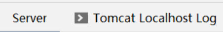
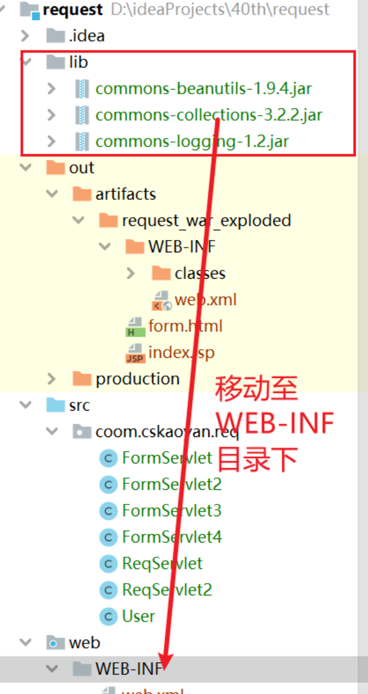
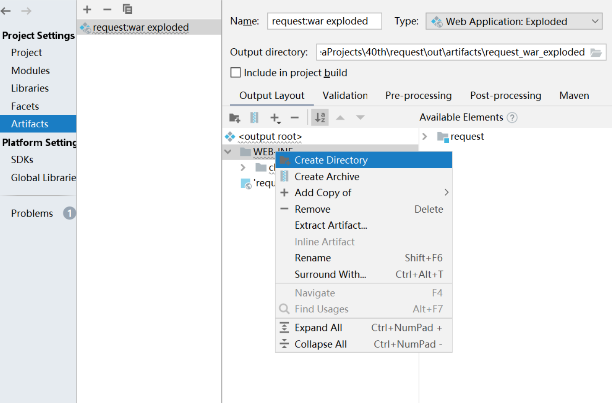
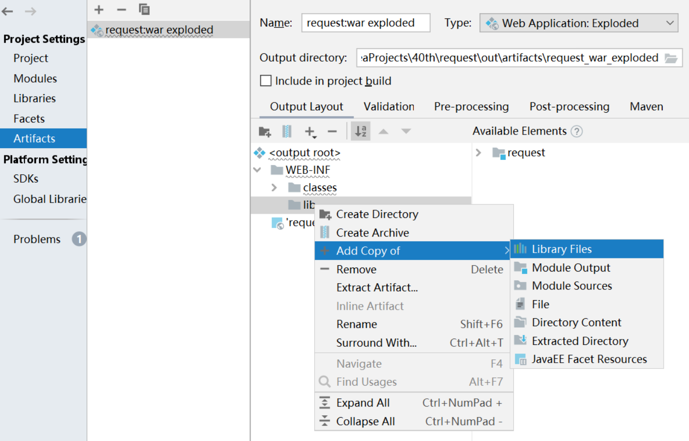
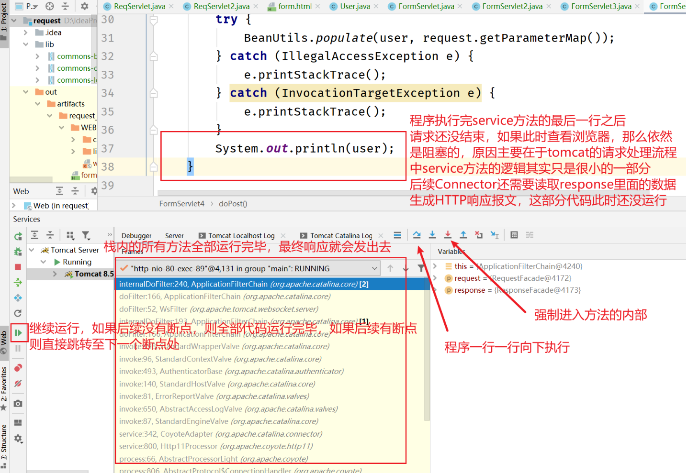
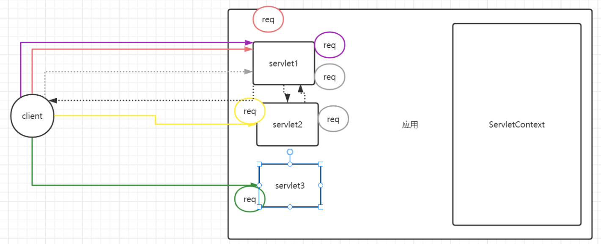

# ServletRequest

## 概念

> ```
> public interface ServletRequest
> ```
>
> Defines an object to provide client request information to a servlet. The servlet container creates a `ServletRequest` object and passes it as an argument to the servlet's `service` method.
>
> A `ServletRequest` object provides data including parameter name and values, attributes, and an input stream. Interfaces that extend `ServletRequest` can provide additional protocol-specific data (for example, HTTP data is provided by [`HttpServletRequest`](https://tomcat.apache.org/tomcat-8.5-doc/servletapi/javax/servlet/http/HttpServletRequest.html).
>
> ServletRequest接口
>
> 定义了一个对象给Servlet提供了客户端发送过来的请求信息。Servlet容器创建了一个ServletRequest对象，并且作为参数传递给servlet的service方法。
>
> ServletRequest对象提供了关于请求参数、属性、输入流等数据信息。扩展自ServletRequest接口可以提供和当前协议所特有的数据。比如HTTP协议所特有的数据由HttpSerlvetRequest提供

ServletRequest可以理解为对请求报文的封装。HttpServletRequest可以理解为是对HTTP请求报文的封装。浏览器在发送请求时，发送的基本都是HTTP请求，所以这两者基本可以看做是相同的。

为什么是接口？

某个创业公司，在多个平台投放了广告页面。接下来的时间，公司需要分别对从各个平台过来的流量进行统计。我们可以设计获取访问广告页面时请求报文的referer请求头。如果没有一个统一的标准规范，假设公司目前使用的是服务器A，该产品将请求报文封装之后的对象是ARequest，提供获取请求头的方法是getHeader(headername);今后公司业务调整，改成使用服务器B，该产品将请求报文封装之后的对象是BRequest，提供获取请求头的方式是getRequestHeader(headername)。公司业务的调整将会导致代码需要全部推到重来。

但是如果有一个统一的规范，也就是这里面使用一个接口。那么便不会有这样的问题。无论使用的是A公司还是B公司的产品，ARequest以及BRequest均实现ServletRequest接口，那么获取请求头的方法是统一的。在业务代码中，我们只需要将代码写成servletRequest.getHeader(headername)即可。


## 常用方法

- 获取请求报文

  主要是获取请求报文的请求行、请求头。请求体暂不获取。

  其中关于请求资源有两种形式：一种是URL；一种是URI。两者的区别你可以理解为 URI + 访问协议、主机、端口号 = URL

  ```java
  package coom.cskaoyan.req;
  
  import javax.servlet.ServletException;
  import javax.servlet.annotation.WebServlet;
  import javax.servlet.http.HttpServlet;
  import javax.servlet.http.HttpServletRequest;
  import javax.servlet.http.HttpServletResponse;
  import java.io.IOException;
  import java.util.Enumeration;
  
  /**
   * @ClassName ${NAME}
   * @Description: TODO
   * @Author 远志 zhangsong@cskaoyan.onaliyun.com
   * @Version V1.0
   **/
  @WebServlet("/req1")
  public class ReqServlet extends HttpServlet {
      protected void doPost(HttpServletRequest request, HttpServletResponse response) throws ServletException, IOException {
  
      }
  
      protected void doGet(HttpServletRequest request, HttpServletResponse response) throws ServletException, IOException {
          //常用方法
          //该对象就是对于请求报文的封装体，可以获取到所有的请求报文信息
          //利用request提供的相关方法，可以将HTTP请求报文全部复原
          String method = request.getMethod();
          String requestURI = request.getRequestURI();
          String requestURL = request.getRequestURL().toString();
          String protocol = request.getProtocol();
          System.out.println(method + " " + requestURI + " " + protocol);
          System.out.println(method + " " + requestURL + " " + protocol);
  
          //获取请求头 键值对
          Enumeration<String> headerNames = request.getHeaderNames();
          while (headerNames.hasMoreElements()){
              String headerName = headerNames.nextElement();
              String headerValue = request.getHeader(headerName);
              System.out.println(headerName + ":" + headerValue);
          }
          //获取请求体
          //在今天的课程中，我们没有必要自己主动去获取请求体，即便用户提交的请求参数位于请求体中，那么也不需要开发者去获取
  //        request.getInputStream();
      }
  }
  ```

- 获取客户机和服务器主机信息

  ```java
  package coom.cskaoyan.req;
  
  import javax.servlet.ServletException;
  import javax.servlet.annotation.WebServlet;
  import javax.servlet.http.HttpServlet;
  import javax.servlet.http.HttpServletRequest;
  import javax.servlet.http.HttpServletResponse;
  import java.io.IOException;
  import java.util.Enumeration;
  
  /**
   * @ClassName ${NAME}
   * @Description: TODO
   * @Author 远志 zhangsong@cskaoyan.onaliyun.com
   * @Version V1.0
   **/
  @WebServlet("/req2")
  public class ReqServlet2 extends HttpServlet {
      protected void doPost(HttpServletRequest request, HttpServletResponse response) throws ServletException, IOException {
  
      }
  
      protected void doGet(HttpServletRequest request, HttpServletResponse response) throws ServletException, IOException {
          //获取客户机和服务器主机的信息
          //客户端信息 封俄罗斯ip 小黑屋
          String remoteAddr = request.getRemoteAddr();
          int remotePort = request.getRemotePort();
          String localAddr = request.getLocalAddr();
          int localPort = request.getLocalPort();
          System.out.println("位于" + remoteAddr + "的客户机使用了端口号" + remotePort + "访问了位于" + localAddr + "服务器主机上面的" + localPort + "端口号上面的程序");
      }
  }
  ```

## 获取请求参数

对于ServletRequest来说，最为核心的功能便是获取请求参数。使用场景也比较广泛。比如用户注册、用户登录、商家发布商品等...此时均需要将客户端的数据提交到服务器上面。那么应该如何提交呢？需要利用HTTP请求报文来进行提交。请求参数可以附着在地址栏的后面，也可以存放在请求体中。**但是无论哪种方式，只要请求参数是key=value&key=value格式来进行提交而不管请求参数是在请求行地址栏后还是在请求体，那么就可以使用接下来介绍的获取请求参数的方法来获取**。

> 但是如果提交的是诸如{“username”:"admin","password":"admin"}这种类型的数据，那么便无法使用这种方式来进行获取。

在本次实验中，我们以form表单的方式来进行提交。

```html
<!DOCTYPE html>
<html lang="en">
<head>
    <meta charset="UTF-8">
    <title>Title</title>
</head>
<body>
    <form action="http://localhost/app/form1" method="post">
        <input type="text" name="username"><br>
        <input type="password" name="password"><br>
        <input type="radio" name="gender" value="male">男
        <input type="radio" name="gender" value="female">女<br>
        <input type="checkbox" name="course" value="java">java
        <input type="checkbox" name="course" value="python">python
        <input type="checkbox" name="course" value="c++">c++<br>
        <input type="submit">
    </form>
</body>
</html>
```

通过抓包，获取到对应的HTTP请求报文

```
POST http://localhost/app/form1 HTTP/1.1
Host: localhost
Connection: keep-alive
Content-Length: 72
Cache-Control: max-age=0
sec-ch-ua: " Not A;Brand";v="99", "Chromium";v="101", "Microsoft Edge";v="101"
sec-ch-ua-mobile: ?0
sec-ch-ua-platform: "Windows"
Upgrade-Insecure-Requests: 1
Origin: http://192.168.13.202
Content-Type: application/x-www-form-urlencoded
User-Agent: Mozilla/5.0 (Windows NT 10.0; Win64; x64) AppleWebKit/537.36 (KHTML, like Gecko) Chrome/101.0.4951.64 Safari/537.36 Edg/101.0.1210.53
Accept: text/html,application/xhtml+xml,application/xml;q=0.9,image/webp,image/apng,*/*;q=0.8,application/signed-exchange;v=b3;q=0.9
Sec-Fetch-Site: cross-site
Sec-Fetch-Mode: navigate
Sec-Fetch-User: ?1
Sec-Fetch-Dest: document
Referer: http://192.168.13.202/
Accept-Encoding: gzip, deflate, br
Accept-Language: zh-CN,zh;q=0.9,en;q=0.8,en-GB;q=0.7,en-US;q=0.6

username=admin&password=admin&gender=female&course=python&course=c%2B%2B
```

HTTP请求报文传输到服务器之后，会被解析封装到request对象中。同样，请求参数也会进入到request对象中。JavaEE规范给我们提供了一种方式来获取key=value&key=value类型的数据。

```java
package coom.cskaoyan.req;

import javax.servlet.ServletException;
import javax.servlet.annotation.WebServlet;
import javax.servlet.http.HttpServlet;
import javax.servlet.http.HttpServletRequest;
import javax.servlet.http.HttpServletResponse;
import java.io.IOException;
import java.util.Arrays;

/**
 * @ClassName ${NAME}
 * @Description: TODO
 * @Author 远志 zhangsong@cskaoyan.onaliyun.com
 * @Version V1.0
 **/
@WebServlet("/form1")
public class FormServlet extends HttpServlet {
    protected void doPost(HttpServletRequest request, HttpServletResponse response) throws ServletException, IOException {
        //注意事项：
        //1.只可以获取key=value&key=value类型的数据
        //2.参数中传入key，（其实该key就是form表单input的name属性）可以获取到value值 username=admin&password=admin123
        String username = request.getParameter("username");
        String password = request.getParameter("password");
        String gender = request.getParameter("gender");
        //note：需要注意的是该方法只可以获取单个值，如果提交的是类似于chekcbox这种多个值
//        String course = request.getParameter("course");
        String[] courses = request.getParameterValues("course");
        System.out.println(username);
        System.out.println(password);
        System.out.println(gender);
        System.out.println(Arrays.toString(courses));
    }

    protected void doGet(HttpServletRequest request, HttpServletResponse response) throws ServletException, IOException {

    }
}
```

## 获取请求参数2

上一阶段，我们完成了请求参数的获取。但是假设今后如果页面需要新增或者修改很多的表单项，那么服务器代码也需要随之同步发生修改。我们希望在第二版中，我们编写的代码可以更加健壮一些。当页面修改表单项时，服务器代码不需要过多的去变化。

```java
package coom.cskaoyan.req;

import javax.servlet.ServletException;
import javax.servlet.annotation.WebServlet;
import javax.servlet.http.HttpServlet;
import javax.servlet.http.HttpServletRequest;
import javax.servlet.http.HttpServletResponse;
import java.io.IOException;
import java.util.Arrays;
import java.util.Enumeration;

/**
 * @ClassName ${NAME}
 * @Description: TODO
 * @Author 远志 zhangsong@cskaoyan.onaliyun.com
 * @Date 2022/5/31 11:05
 * @Version V1.0
 **/
@WebServlet("/form2")
public class FormServlet2 extends HttpServlet {
    protected void doPost(HttpServletRequest request, HttpServletResponse response) throws ServletException, IOException {
        //获取请求参数的代码可以更加健壮一些
        //获取请求参数一系列的方法，你都可以理解为服务器解析这些请求参数之后，将其封装到了一个类似于map的数据结构中
        //给我们开发者提供了如下这几个方法来获取这些请求参数的键值对
        //username=admin&password=admin123&gender=female&course=java
        //另外一个注意事项：要记得和request.getHeaderNames作区分，两者获取的部位是不一样的
        //本API获取的是请求参数；getHeaderNames获取的是请求头的所有的key值
        Enumeration<String> parameterNames = request.getParameterNames();
        while (parameterNames.hasMoreElements()){
            String key = parameterNames.nextElement();
            String[] value = request.getParameterValues(key);
            System.out.println(key + "=" + Arrays.toString(value));
        }
    }

    protected void doGet(HttpServletRequest request, HttpServletResponse response) throws ServletException, IOException {

    }
}
```

## 封装数据到JavaBean

在这一版本中，我们希望将获取到的请求参数进一步封装到一个JavaBean中。

*何为JavaBean？是一个对象，但是同时具有一些要求：一定要求具有无参构造函数；成员变量要求是private；提供public的get和set方法*

回顾之前学习的dbutils以及mybatis在封装数据时采用的是何种方式。反射。

主要步骤如下：

dbutils或者mybatis在执行数据库查询任务时，假设查询到如下一行数据：

| id   | username | password | gender |
| ---- | -------- | -------- | ------ |
| 1    | zhangsan | admin123 | male   |

如果我们希望使用dbutils或者mybatis来进行数据的封装。我们一般情况下要提供一个user对象。该对象中需要有id、username、password、gender四个成员变量，并且同时提供public的get和set方法，同时提供一个无参构造函数。满足这几点便可以将查询到的结果封装到user对象中。

过程可以如下：

1.dbutils、mybatis在查询数据时，可以得到所有的数据的键值对，比如id=1、username=zhangsan、password=admin123、gender=male

2.利用传递的user对象或者user类，获取到相对应的Class对象

3.将数据的键值对遍历出全部的key值，利用set + key首字母大写拼接出一个字符串，利用该字符串到Class对象中去查找相对应的set方法

4.如果该方法存在，则反射调用该方法，方法运行时，需要传递两个参数，第一个参数为将要执行的哪个对象中的该方法；第二个参数是该方法在运行时需要传递的参数(也就是键值对中的值)。


- 使用dbutils工具类来进行数据封装

  使用第三方jar包需要导包。**特别需要注意的是EE项目要求运行时，jar包必须得放置在应用根目录/WEB-INF/lib目录中。**

  ```java
  package coom.cskaoyan.req;
  
  import org.apache.commons.beanutils.BeanUtils;
  
  import javax.servlet.ServletException;
  import javax.servlet.annotation.WebServlet;
  import javax.servlet.http.HttpServlet;
  import javax.servlet.http.HttpServletRequest;
  import javax.servlet.http.HttpServletResponse;
  import java.io.IOException;
  import java.lang.reflect.InvocationTargetException;
  import java.util.Arrays;
  import java.util.Enumeration;
  
  /**
   * @ClassName ${NAME}
   * @Description: TODO
   * @Author 远志 zhangsong@cskaoyan.onaliyun.com
   * @Version V1.0
   **/
  @WebServlet("/form4")
  public class FormServlet4 extends HttpServlet {
      protected void doPost(HttpServletRequest request, HttpServletResponse response) throws ServletException, IOException {
          //接下来我们使用一个工具类来进行封装赋值   俗称调包侠
          //commons-beanutils
          User user = new User();
          try {
              BeanUtils.populate(user, request.getParameterMap());
          } catch (IllegalAccessException e) {
              e.printStackTrace();
          } catch (InvocationTargetException e) {
              e.printStackTrace();
          }
          System.out.println(user);
      }
  
      protected void doGet(HttpServletRequest request, HttpServletResponse response) throws ServletException, IOException {
  
      }
  }
  ```

  ```java
  package coom.cskaoyan.req;
  
  import java.util.Arrays;
  
  /**
   * @ClassName User
   * @Description: TODO
   * @Author 远志 zhangsong@cskaoyan.onaliyun.com
   * @Version V1.0
   **/
  public class User {
  
      private String username;
  
      private String password;
  
      private String gender;
  
      private String[] course;
  
      public String getUsername() {
          return username;
      }
  
      public void setUsername(String username) {
          this.username = username;
      }
  
      public String getPassword() {
          return password;
      }
  
      public void setPassword(String password) {
          this.password = password;
      }
  
      public String getGender() {
          return gender;
      }
  
      public void setGender(String gender) {
          this.gender = gender;
      }
  
      public String[] getCourse() {
          return course;
      }
  
      public void setCourse(String[] course) {
          this.course = course;
      }
  
      @Override
      public String toString() {
          return "User{" +
                  "username='" + username + '\'' +
                  ", password='" + password + '\'' +
                  ", gender='" + gender + '\'' +
                  ", course=" + Arrays.toString(course) +
                  '}';
      }
  }
  ```

  如果在应用根目录/WEB-INF/lib目录中没有对应的jar包，则会报500错误状态码。表示服务器异常。如何查看错误日志？

  

  我们需要在Server以及localhost log这两处标签页中进行查看。因为有的时候，错误信息不会显示在Server中，而是显示在localhost中。

  报错信息为：**ClassNotFoundException: org.apache.commons.beanutils.BeanUtils**

  **如果在EE阶段，程序运行时出现ClassNotFoundException，那么错误的原因基本就是只有一种可能性：**

  **那就是在应用根目录/WEB-INF/lib目录中没有jar包(如果使用Maven项目，那么大概率没有该问题)**

  为什么呢？因为我们项目中的class文件都是位于硬盘中，但是程序访问可以正常执行，说明该class文件被加载到了内存中。实际上是由Tomcat提供的类加载器去完成的。**Tomcat提供的类加载器在加载类以及jar包时，有严格的要求：class文件必须得放置在应用根目录/WEB-INF/classes目录下；jar包得放置在应用根目录/WEB-INF/lib目录下**

  所以，我们需要将jar包放置到应用根目录/WEB-INF/lib目录中。如何放置呢？

  方式一：

  将lib目录及jar包整体复制到图示的WEB-INF目录下。当应用部署时，该目录及jar包文件会复制到应用根目录/WEB-INF目录下。

  

  方式二：

  在图中的WEB-INF目录下，新建一个lib目录。

  ​			将当前项目中依赖的类库复制到该目录中		




## 中文乱码

当使用post请求方法提交表单页面时，中文乱码，解决方法如下：

> setCharacterEncoding
>
> ```
> void setCharacterEncoding(java.lang.String env) throws java.io.UnsupportedEncodingException
> ```
>
> Overrides the name of the character encoding used in the body of this request. This method must be called prior to reading request parameters or reading input using getReader().
>
> - **Parameters:**
>
>   `env` - a `String` containing the name of the character encoding.
>
> - **Throws:**
>
>   `java.io.UnsupportedEncodingException` - if this is not a valid encoding

**该方法有两个注意事项：**

**1.只可以作用于请求体的中文乱码**

**2.该方法必须要在读取请求参数之前调用**


需要注意的是，如果使用表单以get请求方法提交，则默认无中文乱码问题。

## IDEA Debug

IDEA的控制台输出的中文会出现乱码问题。所以在遇到查看中文是否乱码时，不要通过控制台去查看。而是建议使用IDEA的debug模式来进行验证。如果debug模式中中文没有乱码，那么绝对没有乱码问题。

EE项目如何进行debug呢？

1.打断点。建议在service方法中第一行打断点。断点的作用仅仅是程序如果执行到改行时，会阻塞住。

2.程序运行到断点处进行调试。Servlet的代码如何想要被运行，那么需要通过浏览器去访问。



**关于EE阶段的debug。其实总体过程和SE阶段类似，只不过需要注意service方法执行完毕时，响应并没有发出。依然需要点击resume program将代码全部执行完毕，才可以发出响应。**

## 网络路径总结

网络路径，就是在网络访问过程中使用的路径。比如form表单的action地址、a标签的href、img标签的src。网络路径的写法有三种：

- 全路径

  访问协议、主机、端口号、应用名、资源路径等组成的一个完整的路径地址。比如http://xx.xx.xx.xx/app/1.html,全路径最大的优点是可读性比较好，但是里面会包含一些服务器主机地址、端口号等信息。而这些信息在不同的计算机中是不同的，也就是这部分内容是可变的部分。

  在企业中进行开发一般会涉及到几个环境。分别是开发环境、测试环境、生产环境。

  项目的开发阶段，基本上都是在开发者的个人电脑上面进行（windows、MacOS），**在该阶段去编写form表单地址，如何填写 localhost:8080,但是该地址可不可以直接迁移到测试环境中**

  项目代码开发完毕，最终合并提交，提交到一个测试服务器上面去进行测试（配置、环境和生产要非常接近 Linux），**测试环境下，表单的地址路径肯定不可以写localhost:8080,而需要去写测试服务器所在的地址**

  生产环境（项目最终部署上线的地方  taobao.com  jd.com Linux），**生产环境下，form表单的地址同样需要再次变更，变更为生成环境下主机的地址**

  **针对全路径：全路径可以去写，但是如果要写的话，那么一定要将可变的部分以配置文件的形式配置下来，比如将主机、端口号等信息写入到配置文件中。**

- 相对路径

  相对路径就是相对当前页面的一个相对的地址。

  比如当前所在的页面http://localhost:8080/app/1.html，页面中有一个form表单，提交的action地址http://localhost:8080/app/submit，如果我使用相对路径的方式来填写：submit。相对路径过分依赖于当前页面所在的位置，不是特别推荐。

- **/应用名/相对应用的相对路径（推荐）**

  **如果是servlet，那么写法是：/应用名/url-pattern；如果是静态资源文件，写法是：/应用名/相对应用的相对路径**

## Request域

context域：每个应用中有且只有唯一的一个servletContext对象，该对象内部你可以理解为有一个map，只要可以拿到同一个context对象的应用，那么就可以共享数据。

request域：request对象中也有一个类似于map的结构，只要可以拿到同一个request对象，那么也可以进行数据的共享。

哪些对象可以拿到同一个request对象？如果我频繁刷新同一个请求地址，那么tomcat会生成多个request对象还是一致都是一个request对象？多个。

**转发。只有转发的这两个组件之间可以共享request域。**

## context域 VS request域

context域：比较大。context对象持续时间比较久。也就是在程序运行的期间，当前应用下的任何servlet都可以共享该数据。context域一般用来存放一些全局性的配置信息等。项目的初始化配置，当前项目所在的主机名、端口号；当前商城的商品的分类

request域：比较小。因为一个请求只要响应发出去之后，request对象就会被销毁，随即request域里面的数据也就失效了。request域一般用来存放一些不怎么频繁使用的数据。数据的使用场景仅仅在当前请求下需要用到，其他情况下很少用到。仅在转发的场景下可以用到。



