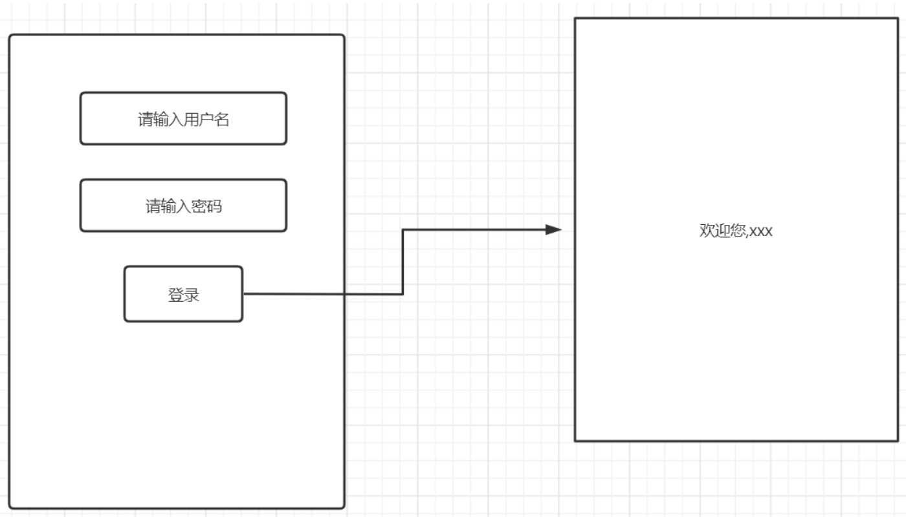

# ServletResponse

## 概念

> ```
> public interface ServletResponse
> ```
>
> Defines an object to assist a servlet in sending a response to the client. The servlet container creates a `ServletResponse` object and passes it as an argument to the servlet's `service` method.
>
> To send binary data in a MIME body response, use the [`ServletOutputStream`](https://tomcat.apache.org/tomcat-8.5-doc/servletapi/javax/servlet/ServletOutputStream.html) returned by [`getOutputStream()`](https://tomcat.apache.org/tomcat-8.5-doc/servletapi/javax/servlet/ServletResponse.html#getOutputStream()). To send character data, use the `PrintWriter` object returned by [`getWriter()`](https://tomcat.apache.org/tomcat-8.5-doc/servletapi/javax/servlet/ServletResponse.html#getWriter()). To mix binary and text data, for example, to create a multipart response, use a `ServletOutputStream` and manage the character sections manually.
>
> ServletResponse是用来协助servlet给客户端返回响应信息的一个对象。servlet容器创建了serlvetResponse对象，并且把它作为参数传递给servlet的service方法。
>
> 如果需要发送二进制类型数据，那么可以通过调用getOutputStream()返回的ServletOutputStream来实现；如果需要发送字符数据，那么可以通过调用getWriter()返回的PrintWriter来实现。
>
> 

> ```
> public interface HttpServletResponse
> extends ServletResponse
> ```
>
> Extends the [`ServletResponse`](https://tomcat.apache.org/tomcat-8.5-doc/servletapi/javax/servlet/ServletResponse.html) interface to provide HTTP-specific functionality in sending a response. For example, it has methods to access HTTP headers and cookies.
>
> The servlet container creates an `HttpServletResponse` object and passes it as an argument to the servlet's service methods (`doGet`, `doPost`, etc).
>
> HttpServletResponse扩展自ServletResposne接口，可以提供HTTP协议所特有的响应数据。比如可以设置HTTP响应头以及cookie等。

## 常用功能

- 设置响应报文

  ```java
  package com.cskaoyan.resp;
  
  import javax.servlet.ServletException;
  import javax.servlet.annotation.WebServlet;
  import javax.servlet.http.HttpServlet;
  import javax.servlet.http.HttpServletRequest;
  import javax.servlet.http.HttpServletResponse;
  import java.io.IOException;
  
  /**
   * @ClassName ${NAME}
   * @Description: TODO
   * @Author 远志 zhangsong@cskaoyan.onaliyun.com
   * @Version V1.0
   **/
  @WebServlet("/resp1")
  public class RespServlet extends HttpServlet {
      protected void doPost(HttpServletRequest request, HttpServletResponse response) throws ServletException, IOException {
  
      }
  
      protected void doGet(HttpServletRequest request, HttpServletResponse response) throws ServletException, IOException {
          //可以设置响应报文 服务器创建一个对象，对象里面包含很多属性
          //开发者需要做的事情及时往对象里面的属性进行赋值；最终服务器读取里面的数据生成HTTP响应报文
          response.setStatus(404);
          response.setHeader("Server", "OS");
          //响应体
          response.getWriter().println("<div style='color:red'>File Not Found</div>");
      }
  }
  ```

- 输出字符数据

  ```java
  //输出字符数据
  response.getWriter().println("<div style='color:red'>File Not Found</div>");
  ```

- 中文乱码

  解决思路：服务器设置响应体编码格式，随后键使用的编码格式告诉给客户端。双方保持一致，那么中文便可以正常显示。设置的编码格式可以通过响应头告诉给客户端；也可以通过响应体告诉给客户端。

  - 方式一：setContentType响应头

    ```java
    package com.cskaoyan.resp;
    
    import javax.servlet.ServletException;
    import javax.servlet.annotation.WebServlet;
    import javax.servlet.http.HttpServlet;
    import javax.servlet.http.HttpServletRequest;
    import javax.servlet.http.HttpServletResponse;
    import java.io.IOException;
    
    /**
     * @ClassName ${NAME}
     * @Description: TODO
     * @Author 远志 zhangsong@cskaoyan.onaliyun.com
     * @Version V1.0
     **/
    @WebServlet("/resp3")
    public class RespServlet3 extends HttpServlet {
        protected void doPost(HttpServletRequest request, HttpServletResponse response) throws ServletException, IOException {
    
        }
    
        protected void doGet(HttpServletRequest request, HttpServletResponse response) throws ServletException, IOException {
    //        response.setCharacterEncoding("utf-8");
            //把使用的编码格式告诉给客户端，可以通过哪个部分？响应头、响应体
            //其中下面这行代码有两个功能，如果设置了该响应头，那么服务器会自动读取里面的charset的值，作用于响应体
            //所以，上面的那行代码可以不用写
            response.setHeader("Content-Type","text/html;charset=utf-8");
            response.getWriter().println("你好");
        }
    }
    ```

  - 方式二：设置编码格式 + 响应体声明使用的编码格式

    ```java
    package com.cskaoyan.resp;
    
    import javax.servlet.ServletException;
    import javax.servlet.annotation.WebServlet;
    import javax.servlet.http.HttpServlet;
    import javax.servlet.http.HttpServletRequest;
    import javax.servlet.http.HttpServletResponse;
    import java.io.IOException;
    
    /**
     * @ClassName ${NAME}
     * @Description: TODO
     * @Author 远志 zhangsong@cskaoyan.onaliyun.com
     * @Version V1.0
     **/
    @WebServlet("/resp4")
    public class RespServlet4 extends HttpServlet {
        protected void doPost(HttpServletRequest request, HttpServletResponse response) throws ServletException, IOException {
    
        }
    
        protected void doGet(HttpServletRequest request, HttpServletResponse response) throws ServletException, IOException {
            response.setCharacterEncoding("utf-8");
    
            //通过响应体告诉客户端使用的编码格式
            response.getWriter().println("<!DOCTYPE html>\n" +
                    "<html lang=\"en\">\n" +
                    "<head>\n" +
                    "    <meta charset=\"UTF-8\">\n" +
                    "    <title>Title</title>\n" +
                    "</head>\n" +
                    "<body>");
    
            response.getWriter().println("你好");
    
            response.getWriter().println("</body>\n" +
                    "</html>");
        }
    }
    ```

- 输出字节数据

  ```java
  package com.cskaoyan.resp.stream;
  
  import javax.servlet.ServletException;
  import javax.servlet.ServletOutputStream;
  import javax.servlet.annotation.WebServlet;
  import javax.servlet.http.HttpServlet;
  import javax.servlet.http.HttpServletRequest;
  import javax.servlet.http.HttpServletResponse;
  import java.io.File;
  import java.io.FileInputStream;
  import java.io.IOException;
  
  /**
   * @ClassName ${NAME}
   * @Description: TODO
   * @Author 远志 zhangsong@cskaoyan.onaliyun.com
   * @Date 2022/6/1 10:03
   * @Version V1.0
   **/
  @WebServlet("/stream")
  public class StreamServlet extends HttpServlet {
      protected void doPost(HttpServletRequest request, HttpServletResponse response) throws ServletException, IOException {
  
      }
  
      protected void doGet(HttpServletRequest request, HttpServletResponse response) throws ServletException, IOException {
          //字节流
          //todo note:字符流和字节流不可以同时调用，只可以调用一个
  //        response.getWriter().println();
          //今后如果遇到一个新的类，不知道该如何去使用，那么可以查看一下类继承关系
          ServletOutputStream outputStream = response.getOutputStream();
          //新建一个文件输入流
          String realPath = getServletContext().getRealPath("WEB-INF/1.jpeg");
          FileInputStream fileInputStream = new FileInputStream(new File(realPath));
          int length = 0;
          byte[] bytes = new byte[1024];
          while ((length = fileInputStream.read(bytes)) != -1){
              outputStream.write(bytes, 0, length);
          }
          //关闭流
          fileInputStream.close();
          //关于ServletOutputStream可以关闭也可以不关闭，如果不关闭，tomcat会帮我们关闭
          outputStream.close();
      }
  }
  ```


## 登录案例



```java
package com.cskaoyan.resp.login;

import javax.servlet.ServletException;
import javax.servlet.annotation.WebServlet;
import javax.servlet.http.HttpServlet;
import javax.servlet.http.HttpServletRequest;
import javax.servlet.http.HttpServletResponse;
import java.io.IOException;

/**
 * @ClassName ${NAME}
 * @Description: TODO  请求报文  响应报文
 * @Author 远志 zhangsong@cskaoyan.onaliyun.com
 * @Date 2022/5/31 17:39
 * @Version V1.0
 **/
@WebServlet("/login")
public class LoginServlet extends HttpServlet {
    protected void doPost(HttpServletRequest request, HttpServletResponse response) throws ServletException, IOException {
        response.setContentType("text/html;charset=utf-8");
        request.setCharacterEncoding("utf-8");
        //分析：当用户点击登录按钮时，用户输入的用户名、密码等参数，会以key=value&key=value附着在请求体中传输到服务器
        //java开发需要接力，从request中获取请求参数username、password
        String username = request.getParameter("username");
        String password = request.getParameter("password");
        //正常的业务逻辑应当是去到数据库中进行比对 JDBC
        if("admin".equals(username) && "admin".equals(password)){
            //登录成功
            //如果按照设计模式来，单一职责，需要重新在写一个类，将数据转交给另外一个servlet，另外servlet去做页面的显示操作
            //为了简化难度，直接将显示的代码直接写在当前servlet中
            response.getWriter().println("欢迎您," + username);
            return;
        }
        //登录失败
        response.getWriter().println("登录失败，用户名、密码错误");
        //比对成功之后，出结果；如果匹配 登录成功；如果不匹配，说明登录失败

    }

    protected void doGet(HttpServletRequest request, HttpServletResponse response) throws ServletException, IOException {

    }
}
```

## 定时刷新、定时跳转

通过设置一个refresh:数字	响应头可以让浏览器每隔指定秒数刷新当前页面。

通过设置一个refresh:数字;url=xxxx 响应头可以让浏览器经过指定秒数之后跳转至指定的url页面。

```java
package com.cskaoyan.resp.refresh;

import javax.servlet.ServletException;
import javax.servlet.annotation.WebServlet;
import javax.servlet.http.HttpServlet;
import javax.servlet.http.HttpServletRequest;
import javax.servlet.http.HttpServletResponse;
import java.io.IOException;
import java.util.Date;

/**
 * @ClassName ${NAME}
 * @Description: TODO
 * @Author 远志 zhangsong@cskaoyan.onaliyun.com
 * @Version V1.0
 **/
@WebServlet("/refresh")
public class RefreshServlet extends HttpServlet {
    protected void doPost(HttpServletRequest request, HttpServletResponse response) throws ServletException, IOException {

    }

    protected void doGet(HttpServletRequest request, HttpServletResponse response) throws ServletException, IOException {
        //定时刷新、跳转
        //1.定时刷新，只会刷新当前页面 每隔多少秒刷新一次当前的时间
        response.getWriter().println(new Date());
//        response.setHeader("refresh", "1");
        //2.用法二：定时跳转 表示经过指定秒数之后，跳转至指定的页面
        response.setHeader("refresh", "2;url=" + request.getContextPath() + "/1.jpeg");
    }
}
```

## 重定向

服务器返回301、302、307状态码，同时搭配Location响应头，可以让浏览器再次重定向到指定的页面

```java
package com.cskaoyan.resp.redirect;

import javax.servlet.ServletException;
import javax.servlet.annotation.WebServlet;
import javax.servlet.http.HttpServlet;
import javax.servlet.http.HttpServletRequest;
import javax.servlet.http.HttpServletResponse;
import java.io.IOException;

/**
 * @ClassName ${NAME}
 * @Description: TODO
 * @Author 远志 zhangsong@cskaoyan.onaliyun.com
 * @Version V1.0
 **/
@WebServlet("/redirect")
public class SendRedirectServlet extends HttpServlet {
    protected void doPost(HttpServletRequest request, HttpServletResponse response) throws ServletException, IOException {

    }

    protected void doGet(HttpServletRequest request, HttpServletResponse response) throws ServletException, IOException {
        //根据重定向的定义，302、Location
//        response.setStatus(302);
//        response.setHeader("Location", request.getContextPath() + "/1.jpeg");
        //上述是我们根据重定向的定义自己去实现的，其实ee规范给我们提供了一个简化的方式
        response.sendRedirect(request.getContextPath() + "/1.jpeg");
    }
}
```

## 登录案例(带跳转)

```html
<!DOCTYPE html>
<html lang="en">
<head>
    <meta charset="UTF-8">
    <title>Title</title>
</head>
<body>
    <form action="/app/login2" method="post">
        <input type="text" name="username" placeholder="请输入用户名"><br>
        <input type="password" name="password" placeholder="请输入密码"><br>
        <input type="submit">
    </form>
</body>
</html>
```

```java
package com.cskaoyan.resp.login2;

import javax.servlet.ServletException;
import javax.servlet.annotation.WebServlet;
import javax.servlet.http.HttpServlet;
import javax.servlet.http.HttpServletRequest;
import javax.servlet.http.HttpServletResponse;
import java.io.IOException;

/**
 * @ClassName ${NAME}
 * @Description: TODO
 * @Author 远志 zhangsong@cskaoyan.onaliyun.com
 * @Version V1.0
 **/
@WebServlet("/login2")
public class LoginServlet2 extends HttpServlet {
    protected void doPost(HttpServletRequest request, HttpServletResponse response) throws ServletException, IOException {
        response.setContentType("text/html;charset=utf-8");
        //页面中输入的用户名、密码通过HTTP请求报文传输到服务器之后，会被解析到request对象中
        //我们需要从request对象中获取到请求参数，如果是key=value类型，那么就可以使用request.getParameter来获取
        String username = request.getParameter("username");
        String password = request.getParameter("password");
        //DB---校验
        if("admin".equals(username) && "admin".equals(password)){
            //登录成功
            response.getWriter().println("登录成功，2秒钟之后即将跳转至个人主页,如果没有跳转可以手动点击链接来进行跳转<a href='" + request.getContextPath() + "/info" +"'>点击跳转</a>");
            response.setHeader("refresh", "2;url=" + request.getContextPath() + "/info");
            return;
        }
        //登录失败
        response.getWriter().println("登录失败，确认用户名、密码是否正确");
    }

    protected void doGet(HttpServletRequest request, HttpServletResponse response) throws ServletException, IOException {

    }
}
```

```java
package com.cskaoyan.resp.login2;

import javax.servlet.ServletException;
import javax.servlet.annotation.WebServlet;
import javax.servlet.http.HttpServlet;
import javax.servlet.http.HttpServletRequest;
import javax.servlet.http.HttpServletResponse;
import java.io.IOException;

/**
 * @ClassName ${NAME}
 * @Description: TODO
 * @Author 远志 zhangsong@cskaoyan.onaliyun.com
 * @Version V1.0
 **/
@WebServlet("/info")
public class InfoServlet extends HttpServlet {
    protected void doPost(HttpServletRequest request, HttpServletResponse response) throws ServletException, IOException {

    }

    protected void doGet(HttpServletRequest request, HttpServletResponse response) throws ServletException, IOException {
        response.setContentType("text/html;charset=utf-8");
        response.getWriter().println("欢迎您");
    }
}
```

## 下载

对于浏览器来说，可以打开的文件，默认会执行打开操作；无法打开的文件，默认就会执行下载操作，无需做任何设置。我们这里提及的下载指的是对于可以打开的文件，可以设置一个响应头，让浏览器将该资源进行下载，而不是打开。

```java
package com.cskaoyan.resp.down;

import javax.servlet.ServletException;
import javax.servlet.ServletOutputStream;
import javax.servlet.annotation.WebServlet;
import javax.servlet.http.HttpServlet;
import javax.servlet.http.HttpServletRequest;
import javax.servlet.http.HttpServletResponse;
import java.io.File;
import java.io.FileInputStream;
import java.io.IOException;

/**
 * @ClassName ${NAME}
 * @Description: TODO
 * @Author 远志 zhangsong@cskaoyan.onaliyun.com
 * @Version V1.0
 **/
@WebServlet("/down")
public class DownServlet extends HttpServlet {
    protected void doPost(HttpServletRequest request, HttpServletResponse response) throws ServletException, IOException {

    }

    protected void doGet(HttpServletRequest request, HttpServletResponse response) throws ServletException, IOException {
        //字节流
        //只需要在原先的代码基础上追加一个下载的响应头
        response.setHeader("Content-Disposition", "attachment;filename=1.jpeg");
        //todo note:字符流和字节流不可以同时调用，只可以调用一个
//        response.getWriter().println();
        //今后如果遇到一个新的类，不知道该如何去使用，那么可以查看一下类继承关系
        ServletOutputStream outputStream = response.getOutputStream();
        //新建一个文件输入流
        String realPath = getServletContext().getRealPath("WEB-INF/1.jpeg");
        FileInputStream fileInputStream = new FileInputStream(new File(realPath));
        int length = 0;
        byte[] bytes = new byte[1024];
        while ((length = fileInputStream.read(bytes)) != -1){
            outputStream.write(bytes, 0, length);
        }
        //关闭流
        fileInputStream.close();
        //关于ServletOutputStream可以关闭也可以不关闭，如果不关闭，tomcat会帮我们关闭
        outputStream.close();
    }
}
```

## 代码优化

在上述案例中，图片的显示和图片的下载逻辑99%的代码是一致的，并且这两个功能上来说，也比较接近。根据软件设计的原则，高内聚、低耦合。我们希望将相关的代码尽可能写在一个功能模块中（后续代码维护也比较方便），不相关的代码尽量不要产生关联。因此，我们希望将图片显示和图片下载的逻辑合并到一个servlet中，应该如何进行呢？

优化策略：

1.通过请求参数不同来进行分发

2.通过对请求的资源地址进行判断，来进行分发

```html
<!DOCTYPE html>
<html lang="en">
<head>
    <meta charset="UTF-8">
    <title>Title</title>
</head>
<body>
    <a href="/app/stream">stream</a>
    <a href="/app/down">down</a>

    <a href="/app/pic?op=stream">stream优化合并</a>
    <a href="/app/pic?op=down">down优化合并</a>

    <a href="/app/picture/stream">stream优化合并2</a>
    <a href="/app/picture/down">down优化合并2</a>

</body>
</html>
```

```java
package com.cskaoyan.resp.update;

import javax.servlet.ServletException;
import javax.servlet.ServletOutputStream;
import javax.servlet.annotation.WebServlet;
import javax.servlet.http.HttpServlet;
import javax.servlet.http.HttpServletRequest;
import javax.servlet.http.HttpServletResponse;
import java.io.File;
import java.io.FileInputStream;
import java.io.FileNotFoundException;
import java.io.IOException;

/**
 * @ClassName ${NAME}
 * @Description: TODO
 * @Author 远志 zhangsong@cskaoyan.onaliyun.com
 * @Version V1.0
 **/
@WebServlet("/pic")
public class PicServlet extends HttpServlet {
    protected void doPost(HttpServletRequest request, HttpServletResponse response) throws ServletException, IOException {

    }

    protected void doGet(HttpServletRequest request, HttpServletResponse response) throws ServletException, IOException {
        //访问当前servlet时，均会携带一个op=xxx请求参数过来，我们需要获取该请求参数
        //如何获取该请求参数？可以直接使用request.getParameter来获取
        String op = request.getParameter("op");
        if("stream".equals(op)){
            stream(request, response);
        }else if("down".equals(op)){
            dowm(request, response);
        }
    }

    private void dowm(HttpServletRequest request, HttpServletResponse response) throws IOException {
        response.setHeader("Content-Disposition", "attachment;filename=1.jpeg");
        stream(request, response);
    }

    private void stream(HttpServletRequest request, HttpServletResponse response) throws IOException {
        ServletOutputStream outputStream = response.getOutputStream();
        //新建一个文件输入流
        String realPath = getServletContext().getRealPath("WEB-INF/1.jpeg");
        FileInputStream fileInputStream = new FileInputStream(new File(realPath));
        int length = 0;
        byte[] bytes = new byte[1024];
        while ((length = fileInputStream.read(bytes)) != -1){
            outputStream.write(bytes, 0, length);
        }
        //关闭流
        fileInputStream.close();
        //关于ServletOutputStream可以关闭也可以不关闭，如果不关闭，tomcat会帮我们关闭
        outputStream.close();

    }
}
```

```java
package com.cskaoyan.resp.update;

import javax.servlet.ServletException;
import javax.servlet.ServletOutputStream;
import javax.servlet.annotation.WebServlet;
import javax.servlet.http.HttpServlet;
import javax.servlet.http.HttpServletRequest;
import javax.servlet.http.HttpServletResponse;
import java.io.File;
import java.io.FileInputStream;
import java.io.IOException;

/**
 * @ClassName ${NAME}
 * @Description: TODO
 * @Author 远志 zhangsong@cskaoyan.onaliyun.com
 * @Date 2022/6/1 11:18
 * @Version V1.0
 **/
@WebServlet("/picture/*")
public class PictureServlet extends HttpServlet {
    protected void doPost(HttpServletRequest request, HttpServletResponse response) throws ServletException, IOException {

    }

    protected void doGet(HttpServletRequest request, HttpServletResponse response) throws ServletException, IOException {
        //访问当前servlet时，均会携带一个op=xxx请求参数过来，我们需要获取该请求参数
        //如何获取该请求参数？可以直接使用request.getParameter来获取
        //如果此时是显示  /app/picture/stream   下载  /app/picture/down
        String requestURI = request.getRequestURI();
        String op = requestURI.replace(request.getContextPath() + "/picture/", "");
        if("stream".equals(op)){
            stream(request, response);
        }else if("down".equals(op)){
            dowm(request, response);
        }
    }

    private void dowm(HttpServletRequest request, HttpServletResponse response) throws IOException {
        response.setHeader("Content-Disposition", "attachment;filename=1.jpeg");
        stream(request, response);
    }

    private void stream(HttpServletRequest request, HttpServletResponse response) throws IOException {
        ServletOutputStream outputStream = response.getOutputStream();
        //新建一个文件输入流
        String realPath = getServletContext().getRealPath("WEB-INF/1.jpeg");
        FileInputStream fileInputStream = new FileInputStream(new File(realPath));
        int length = 0;
        byte[] bytes = new byte[1024];
        while ((length = fileInputStream.read(bytes)) != -1){
            outputStream.write(bytes, 0, length);
        }
        //关闭流
        fileInputStream.close();
        //关于ServletOutputStream可以关闭也可以不关闭，如果不关闭，tomcat会帮我们关闭
        outputStream.close();

    }
}
```

## 登录案例优化

在上述的登录案例中。用户的登录、用户的个人主页显示均是和用户相关的功能。写在不同的servlet中显得过于分散。在一个比较大的系统中，如果每个请求编写一个servlet，那么servlet的数量也会非常庞大，显得很难维护。因此，借鉴上述的经验，我们对登录功能进行优化。思路为：

登录的请求地址：/app/user/login

注册的请求地址：/app/user/register

个人主页的请求地址：/app/user/info

在doGet或者doPost方法中，首先获取到请求的资源地址，通过判断是login、register还是info，进而处理具体不同的业务逻辑

登录页面：

```html
<!DOCTYPE html>
<html lang="en">
<head>
    <meta charset="UTF-8">
    <title>Title</title>
</head>
<body>
    <form action="/app/user/login" method="post">
        <input type="text" name="username" placeholder="请输入用户名"><br>
        <input type="password" name="password" placeholder="请输入密码"><br>
        <input type="submit">
    </form>
</body>
</html>
```

注册页面：

```html
<!DOCTYPE html>
<html lang="en">
<head>
    <meta charset="UTF-8">
    <title>Title</title>
</head>
<body>
    <form action="/app/user/register" method="post">
        <input type="text" name="username" placeholder="请输入用户名"><br>
        <input type="password" name="password" placeholder="请输入密码"><br>
        <input type="submit">
    </form>
</body>
</html>
```

业务逻辑代码：

```java
package com.cskaoyan.resp.login2;

import javax.servlet.ServletException;
import javax.servlet.annotation.WebServlet;
import javax.servlet.http.HttpServlet;
import javax.servlet.http.HttpServletRequest;
import javax.servlet.http.HttpServletResponse;
import java.io.IOException;

/**
 * @ClassName ${NAME}
 * @Description: TODO
 * @Author 远志 zhangsong@cskaoyan.onaliyun.com
 * @Date 2022/6/1 11:33
 * @Version V1.0
 **/
@WebServlet("/user/*")
public class UserServlet extends HttpServlet {
    protected void doPost(HttpServletRequest request, HttpServletResponse response) throws ServletException, IOException {
        //首先要判断当前请求是什么功能？ 注册、登录
        // /app/user/login  /app/user/register
        //首先根据请求资源地址进行分发到具体的方法内部之后，才去处理真正的业务逻辑
        String requestURI = request.getRequestURI();
        //将/app/user替换成空字符串
        String op = requestURI.replace(request.getContextPath() + "/user/", "");
        if("login".equals(op)){
            login(request, response);
        }else if("register".equals(op)){
            register(request,response);
        }
    }

    /**
     * 当前方法用来去处理用户的注册逻辑
     * @param request
     * @param response
     */
    private void register(HttpServletRequest request, HttpServletResponse response) {

    }

    /**
     * 当前方法用来处理用户的登录逻辑
     * @param request
     * @param response
     */
    private void login(HttpServletRequest request, HttpServletResponse response) throws IOException {
        String username = request.getParameter("username");
        String password = request.getParameter("password");
        if("admin".equals(username) && "admin".equals(password)){
            //登录成功
            response.getWriter().println("登录成功，2秒钟之后即将跳转至个人主页,如果没有跳转可以手动点击链接来进行跳转<a href='" + request.getContextPath() + "/info" +"'>点击跳转</a>");
            response.setHeader("refresh", "2;url=" + request.getContextPath() + "/user/info");
            return;
        }
        //登录失败
        response.getWriter().println("登录失败，确认用户名、密码是否正确");
    }

    protected void doGet(HttpServletRequest request, HttpServletResponse response) throws ServletException, IOException {
        String requestURI = request.getRequestURI();
        //将/app/user替换成空字符串
        String op = requestURI.replace(request.getContextPath() + "/user/", "");
        if("info".equals(op)){
            info(request, response);
        }
    }

    /**
     * 当前方法用来去处理用户的个人主页显示逻辑
     * @param request
     * @param response
     * @throws IOException
     */
    private void info(HttpServletRequest request, HttpServletResponse response) throws IOException {
        response.setContentType("text/html;charset=utf-8");
        response.getWriter().println("欢迎您");

    }
}
```


